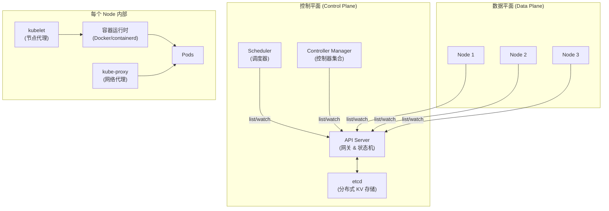
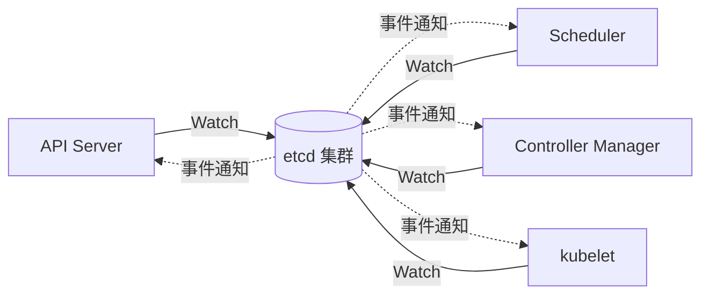
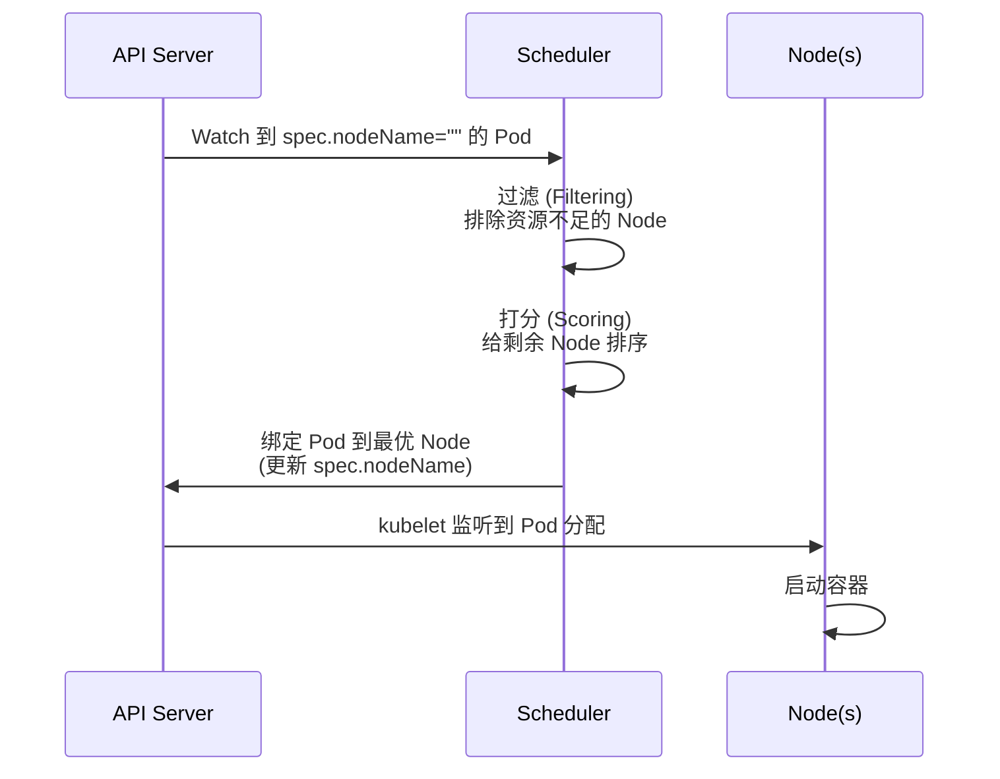
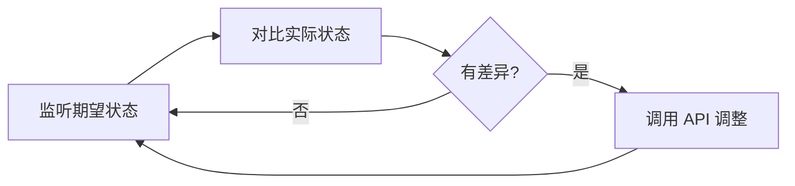
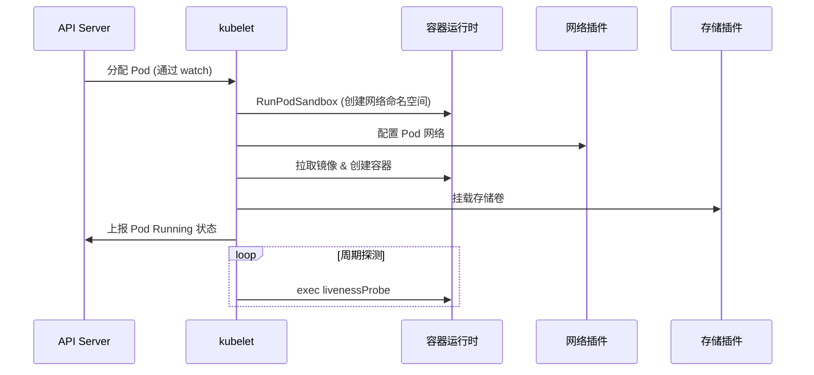
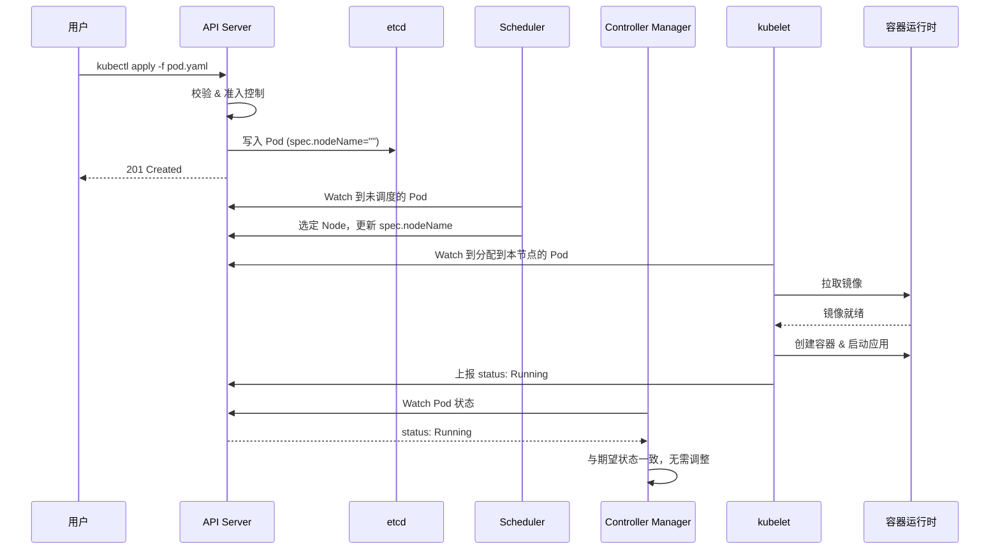
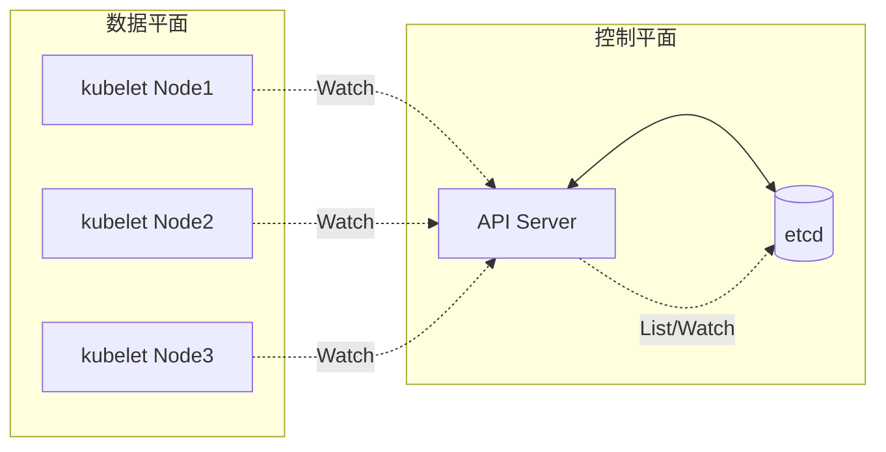

2014 年 Google 开源 Kubernetes 时，Docker 已经独霸容器市场，但"容器编排"领域还是群雄割据：Mesos、Swarm、Nomad 各占山头。六年后，Kubernetes 几乎统一了整个云原生版图，成为容器时代的事实标准。

理解 Kubernetes 的关键，是把它的架构切成**两个平面**来看：控制平面（Control Plane）做决策，数据平面（Data Plane）执行决策。这两个平面通过声明式 API 和 list-watch 机制协作，构成一个典型的"分布式控制系统"——本质上和 Borg 的设计哲学一脉相承。

<!--more-->

## 一、为什么 Kubernetes 是"分布式操作系统"

在 Kubernetes 出现之前，运维团队的工作模式是：**手动 SSH 到机器、修改配置、重启服务**。这套流程在 10 台机器时可行，1000 台机器时彻底崩溃。

Kubernetes 做的事情，本质上是把**集群当成一台计算机**：

- 你告诉它"我要运行 3 个 order-service 的副本"——它会确保始终有 3 个副本在跑
- 你告诉它"这个应用需要 512MB 内存"——它会调度到合适的节点
- 你告诉它"我的服务需要 80 端口对外暴露"——它会自动配置负载均衡



**两个平面的核心职责**：

- **控制平面**：决策"集群应该是什么状态"，包括接收用户请求、存储期望状态、计算差异、发出指令
- **数据平面**：执行"让集群达到这个状态"，包括运行容器、配置网络、上报状态

这种"决策与执行分离"的设计是 Kubernetes 的灵魂，也是它比传统运维脚本强得多的根本原因。

## 二、控制平面的四个核心组件

### 2.1 API Server：集群的唯一入口

**API Server** 是整个集群的"网关"和"大脑"：

- 接收所有外部请求（kubectl、UI、其他组件）
- 唯一与 etcd 通信的组件（读写集群状态）
- 提供基于 HTTP/JSON 的 RESTful API（也是 gRPC）
- 负责认证、授权、准入控制（Admission Control）

```yaml
# 一个 Pod 的 YAML 描述，本质上是对 API Server 的"期望状态"声明
apiVersion: v1
kind: Pod
metadata:
  name: order-service
  namespace: production
  labels:
    app: order
    tier: backend
spec:
  containers:
    - name: order
      image: order-service:v1.2.0
      ports:
        - containerPort: 8080
      resources:
        requests:
          cpu: 100m
          memory: 256Mi
        limits:
          cpu: 500m
          memory: 512Mi
      livenessProbe:
        httpGet:
          path: /healthz
          port: 8080
        initialDelaySeconds: 10
        periodSeconds: 5
  restartPolicy: Always
```

当你执行 `kubectl apply -f pod.yaml`，发生的事：

1. kubectl 把 YAML 序列化后 HTTP POST 到 API Server
2. API Server 校验字段（schema validation）
3. 准入控制器（Admission Controller）修改请求（如注入默认标签）
4. 写入 etcd，触发 watch 事件

### 2.2 etcd：集群的"数据库"

**etcd** 是一个基于 Raft 协议的分布式键值存储，是 Kubernetes 的唯一持久化层。

关键特性：

- **强一致性**：Raft 保证所有节点数据一致
- **Watch 机制**：客户端可以订阅 key 的变化，实时收到通知（Kubernetes 的 list-watch 模式的基础）
- **高可用**：至少 3 节点部署，容忍 1 节点故障



**重要事实**：**Kubernetes 集群的所有状态都在 etcd 里**。Node 上不存储任何业务状态，kubelet 也不持久化 Pod 配置。这意味着：

- 备份 etcd = 备份整个集群
- etcd 挂了 = 集群不可用（但已运行的 Pod 还在跑）
- etcd 数据丢失 = 集群彻底崩溃

生产环境必须配置 etcd 定期备份。`etcdctl snapshot save` 是标准做法。

### 2.3 Scheduler：决定 Pod 跑在哪

**Scheduler** 的职责是：为新创建的 Pod 挑选一个最合适的 Node。

调度分两步：



**过滤阶段** 排除不满足硬性条件的 Node：

- 资源够不够（CPU/内存 requests）
- 端口冲突吗（如果 Pod 指定了 hostPort）
- 节点选择器匹配吗（`nodeSelector`、`nodeName`）
- 污点容忍吗（`taints` / `tolerations`）

**打分阶段** 给剩余 Node 排序：

- 资源碎片（少装 Pod 的 Node 分数低，倾向装箱）
- 镜像是否已存在（避免重复拉取）
- 亲和性规则（`podAffinity` / `podAntiAffinity`）
- 拓扑分布（多可用区均衡）

Scheduler 的策略是可插拔的，2020 年已经支持自定义调度框架（Scheduling Framework），可以在过滤和打分阶段插入自己的逻辑。

### 2.4 Controller Manager：自动化运维的大脑

**Controller Manager** 实际上是一组控制器的集合，每个控制器负责一种资源的"实际状态向期望状态靠拢"。

常见的内置控制器：

| 控制器 | 职责 |
|--------|------|
| Deployment Controller | 确保 ReplicaSet 的副本数符合期望 |
| ReplicaSet Controller | 确保 Pod 副本数符合期望 |
| Node Controller | 监控 Node 健康，标记不可达节点 |
| Endpoints Controller | 维护 Service Endpoints 列表 |
| ServiceAccount Controller | 为 namespace 创建默认 SA |
| Garbage Collector | 清理孤儿资源（如被删除的 Pod） |

每个控制器的工作模式都是一样的：



这就是 Kubernetes 的**声明式哲学**：你只描述"想要什么"，控制器循环（reconciliation loop）负责把系统调成那个状态。

## 三、数据平面：让 Pod 真正运行起来

### 3.1 kubelet：节点上的"指挥官"

**kubelet** 是每个 Node 上必跑的代理进程，负责：

- 监听 API Server 上分配到本节点的 Pod
- 通过 CRI（Container Runtime Interface）调用容器运行时（Docker/containerd/CRI-O）启动容器
- 挂载 Pod 的存储卷（通过 CSI）
- 配置 Pod 的网络（通过 CNI）
- 周期性执行 livenessProbe、readinessProbe
- 上报节点和 Pod 的状态



### 3.2 kube-proxy：让 Service 真正可访问

**kube-proxy** 是实现 Kubernetes Service 抽象的关键组件。它在每个 Node 上维护 iptables 或 IPVS 规则，把访问 Service VIP 的流量转发到后端 Pod。

**三种模式**（2020 年的主流）：

| 模式 | 工作机制 | 性能 | 适用场景 |
|------|---------|------|---------|
| iptables | 内核 netfilter 规则链 | 中等（数千 Service 后性能下降） | 小集群默认 |
| IPVS | 内核 L4 负载均衡 | 高（支持 10K+ Service） | 中大型集群 |
| userspace | 用户态代理（已废弃） | 低 | 不推荐 |

IPVS 模式在 1.11 GA 后逐渐成为默认推荐。它利用 Linux 内核的 IP Virtual Server，支持多种负载均衡算法（rr、lc、dh、sh、sed、nq），性能远超 iptables 模式。

### 3.3 容器运行时：CRI 标准

Kubernetes 1.5 引入了 **CRI（Container Runtime Interface）**，把容器运行时抽象成 gRPC 接口。这意味着 kubelet 不再硬编码 Docker，而是可以调用任何实现了 CRI 的运行时：

```mermaid
graph LR
    KUBELET[kubelet] -->|CRI (gRPC)| SHIM["CRI Shim"]
    SHIM --> DOCKER[containerd]
    SHIM --> CRIO[CRI-O]
    SHIM --> OTHER[其他运行时]
```

2020 年主流选择：

- **containerd**：Docker 捐给 CNCF 的核心运行时，是 Kubernetes 1.20+ 的默认推荐
- **CRI-O**：Red Hat 主导，专为 Kubernetes 设计的轻量级运行时

注意 dockershim 的弃用与移除走的是一条较长的路径：1.20 (2020-12) → 1.21 (2021-04) → 1.22 (2021-08) → 1.23 (2021-12) 连续四个版本都只是 deprecated，直到 **K8s 1.24 (2022-05) 才正式移除**。截至 2020-10-20 文章发布时，社区已通过 KEP-2221 提案、1.20 即将于 2020-12 发布正式公告 deprecated，集群仍可正常使用 Docker。

## 四、Pod 生命周期：从 kubectl apply 到 Running

把上面所有组件串起来，看一个 Pod 的完整诞生过程：



完整的生命周期阶段（2020 年的标准定义）：

| 阶段 | 说明 |
|------|------|
| Pending | Pod 已被 API Server 接收，但容器尚未启动（可能在调度/拉镜像） |
| ContainerCreating | kubelet 正在创建容器（拉镜像、配网络、挂卷） |
| Running | 容器正常运行 |
| Succeeded | 所有容器成功退出（适用于 Job） |
| Failed | 至少一个容器异常退出 |
| Unknown | Pod 状态无法获取（通常 kubelet 失联） |

## 五、控制平面与数据平面的协作模式

Kubernetes 的设计哲学可以总结为一句话：**控制平面决策，数据平面执行，通过 list-watch 异步协作**。



**这种模式的几个关键优势**：

### 5.1 异步解耦

所有组件通过 API Server 通信，不直接相互调用。重启任何组件都不会导致级联故障——它们重启后会重新建立 watch，从中断时的状态继续工作。

### 5.2 最终一致性

控制平面下发指令到数据平面有延迟，数据平面上报状态也有延迟。整个系统接受**最终一致**而非强一致——这换来了极高的可用性。

### 5.3 可观测性

所有状态都存在 etcd，任何组件都可以读取全集群视图。这意味着运维、调试、监控都有标准的数据来源。

## 六、常见坑

### 1. 控制平面单点故障

虽然 Kubernetes 设计上支持多副本控制平面，但**很多人部署的是单 etcd、单 API Server**。一旦这台机器宕机，整个集群就废了。

2020 年的生产最低要求：

- etcd 至少 3 节点（容忍 1 节点故障）
- API Server 至少 2 副本 + LB
- Scheduler 和 Controller Manager 各 2 副本（同时只有一个是 leader）

### 2. 资源 request/limit 设置不当

很多团队只设 limit 不设 request：

```yaml
resources:
  limits:
    cpu: 500m
    memory: 512Mi
```

**没有 request，Scheduler 没法做合理的资源调度**。结果就是 Node 看着 CPU 还剩 30%，但 Pod 都无法调度上去（因为不知道每个 Pod 实际需要多少）。

最佳实践：**request = 稳态使用量，limit = 峰值上限**。可以通过 Prometheus + VPA（Vertical Pod Autoscaler）观察真实使用情况，再反推合理的 request。

### 3. PodDisruptionBudget 被忽视

当运维做节点维护（cordon + drain）时，会把所有 Pod 驱逐到其他节点。如果不设置 PDB（PodDisruptionBudget），可能一次性驱逐所有 Pod，导致服务短暂不可用：

```yaml
apiVersion: policy/v1beta1
kind: PodDisruptionBudget
metadata:
  name: order-pdb
spec:
  minAvailable: 2  # 至少保持 2 个 Pod 可用
  selector:
    matchLabels:
      app: order
```

### 4. 健康探针配置错误

```yaml
# 错误：initialDelaySeconds 太短，应用还没启动就探测
livenessProbe:
  httpGet:
    path: /healthz
    port: 8080
  initialDelaySeconds: 1
  periodSeconds: 1

# 正确：给应用充分启动时间
livenessProbe:
  httpGet:
    path: /healthz
    port: 8080
  initialDelaySeconds: 30
  periodSeconds: 10
  failureThreshold: 3
```

启动探针（`startupProbe`）历经三个版本才稳定：1.16 (2019-09) alpha → 1.18 (2020-03) beta → **1.20 (2020-12) GA**，专门用于解决"慢启动应用被 liveness 误杀"的问题。

## 七、小结

Kubernetes 的架构看似复杂，本质上是非常优雅的**分布式控制系统**：

- **控制平面** = 决策层 = API Server + etcd + Scheduler + Controller Manager
- **数据平面** = 执行层 = kubelet + kube-proxy + 容器运行时
- **协作机制** = 声明式 API + list/watch + reconciliation loop

掌握这套架构的关键，不是记住每个组件的命令，而是理解**"期望状态 vs 实际状态"的循环**——这是 Kubernetes 一切自动化能力的思想根源。

2020 年的云原生版图里，Kubernetes 已经不只是"容器编排工具"，而是**新的分布式应用基础设施**。Prometheus Operator、Istio、Argo CD 等项目都在 K8s 之上构建生态。**学懂 K8s 架构，是云原生时代的必修课。**