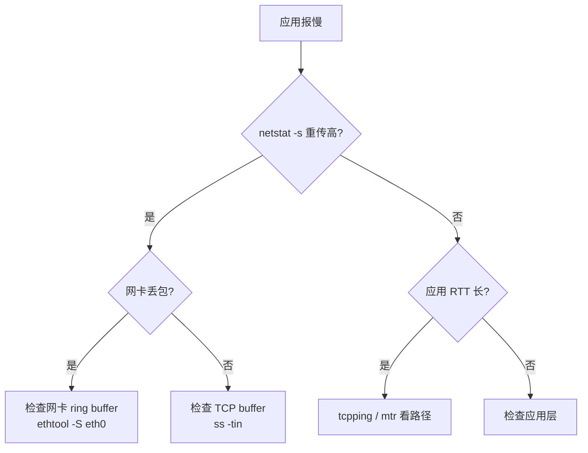

线上服务响应慢了，你第一反应是什么？看应用日志？重启？扩容？这些都不是诊断——是赌博。

性能问题的定位需要一套**先全局后局部、先假设后验证**的工程方法。Brendan Gregg 在 ACM Queue（2012）和 *Systems Performance*（2013，Prentice Hall）里总结的 **USE 方法**（Utilization, Saturation, Errors）是入门最快的框架：**对每个资源，先查利用率、查饱和度、查错误**。

这篇文章用一台典型的 Linux 服务器（4 核 8GB，跑 Nginx + MySQL + 应用进程）走一遍 USE 流程，掌握 `top`、`vmstat`、`iostat`、`mpstat`、`pidstat`、`free`、`strace` 的基础读法。

<!--more-->

## 一、USE 方法：先问"哪里满了"

面对一台慢的服务器，传统做法是"猜"：猜 CPU 满了、猜内存不够、猜磁盘慢。USE 方法反着来——**先列出所有资源，逐个查利用率、饱和度、错误**。

| 资源 | 利用率 Utilization | 饱和度 Saturation | 错误 Errors |
|------|--------------------|-------------------|-------------|
| CPU | `%user + %system` | `load average`、`runqueue` | `dmesg` 中 `MCE` |
| 内存 | 已用 / 总内存 | `si/so`（swap in/out） | OOM killer |
| 磁盘 | `%util`、`await` | `avgqu-sz` | `dmesg` I/O error |
| 网络 | `bandwidth / capacity` | `drops`/`overruns` | `NIC` errors |
| 文件描述符 | 已用 / `fs.file-max` | - | `Too many open files` |

USE 方法的工程意义：**它把性能排查从"经验主义"变成"清单式扫描"**。即使你不知道根因，按表跑一遍命令也能定位到"哪行数字不对"，再针对那行深入。

下面按资源类型逐个介绍核心命令。

## 二、CPU 观测

### 2.1 `uptime` 和 `load average`：一眼看全局

```bash
$ uptime
 16:00:00 up 30 days, 1 user, load average: 0.50, 0.60, 0.70
```

**三个数字是 1/5/15 分钟的指数移动平均负载**，代表"可运行 + 不可中断"任务数。

| 经验阈值 | 含义 |
|---------|------|
| load < CPU 核数 | 健康 |
| load = CPU 核数 | 满载但没排队 |
| load > CPU 核数 | 有任务排队，性能开始受影响 |
| load >> CPU 核数 | 严重过载，响应时间陡升 |

注意：load 高不一定是 CPU 忙——也可能磁盘 I/O 卡住导致 `D` 状态进程堆积。要结合 CPU 利用率看。

### 2.2 `top`：实时进程视图

```bash
$ top
top - 16:00:00 up 30 days,  1 user,  load average: 0.50, 0.60, 0.70
Tasks: 200 total,   2 running, 198 sleeping
%Cpu(s):  5.0 us,  3.0 sy,  0.0 ni, 90.0 id,  2.0 wa,  0.0 hi,  0.0 si,  0.0 st
MiB Mem :   8000.0 total,   1200.0 free,   4500.0 used,   2300.0 buff/cache
MiB Swap:   2000.0 total,      0.0 used,   2000.0 free
```

读 `top` 的关键字段：

| 行 / 列 | 含义 | 警戒值 |
|--------|------|--------|
| `load average` | 三档负载均值 | 持续 > CPU 数 |
| `%us` | 用户态 CPU | 长期 > 70% |
| `%sy` | 内核态 CPU | 长期 > 20%（系统调用/中断过多） |
| `%wa` | I/O 等待 | > 5% 说明 CPU 在等磁盘 |
| `%id` | 空闲 | < 10% 说明 CPU 紧张 |
| `%si/%hi` | 软件/硬件中断 | 突然升高可能是网卡风暴 |
| `MiB Mem` 的 `buff/cache` | 可回收缓存 | 不算"真用"内存 |

### 2.3 `mpstat`：看每个 CPU 核

```bash
$ mpstat -P ALL 1 3
Linux 4.4.0 (host)  08/25/2016  _x86_64_  (4 CPU)

16:00:01  CPU  %usr  %nice  %sys  %iowait  %irq  %soft  %steal  %guest  %idle
16:00:02  all   5.0    0.0   3.0     2.0   0.0    0.0     0.0      0.0    90.0
16:00:02    0  20.0    0.0   5.0     0.0   0.0    0.0     0.0      0.0    75.0
16:00:02    1   0.0    0.0   0.0     0.0   0.0    0.0     0.0      0.0   100.0
16:00:02    2   0.0    0.0   0.0     0.0   0.0    0.0     0.0      0.0   100.0
16:00:02    3   0.0    0.0  11.0     8.0   0.0    0.0     0.0      0.0    81.0
```

**核 0 单核 20%、核 3 有 iowait、其余空闲**——典型的单线程热点，可能是个没用多核的进程卡在核 0 上。

### 2.4 `pidstat`：定位到具体进程

```bash
$ pidstat -u -p 1234 1 3
16:00:01    PID    %usr  %system  %guest   %wait   %CPU  CPU  Command
16:00:02    1234    5.0      1.0      0.0     0.0    6.0    0  mysqld
16:00:03    1234   95.0      3.0      0.0     0.0   98.0    1  mysqld
```

`pidstat` 把 CPU 占用归因到进程，比 `top` 适合脚本化采集。

## 三、内存观测

### 3.1 `free`：内存全景

```bash
$ free -h
              total        used        free      shared  buff/cache   available
Mem:           7.8Gi       4.4Gi       1.2Gi       100Mi       2.3Gi       3.1Gi
Swap:          2.0Gi          0B       2.0Gi
```

Linux 内存的真相：

- **`free` 小 ≠ 内存不够**：内核把空闲内存用作 buff/cache（页缓存），是正常现象
- **`available` 才是真可用**：应用程序实际能申请的内存
- **关注 swap**：长期非零说明物理内存不足，触发了换页

| 现象 | 含义 |
|------|------|
| `free` 几乎为 0，`buff/cache` 大 | 健康，buff/cache 可回收 |
| `available` 接近 0 | 真危险，OOM 临近 |
| `Swap used` 持续增长 | 物理内存不足，需要扩内存或排查泄漏 |

### 3.2 进程级内存

```bash
$ ps aux --sort=-rss | head -5
USER  PID   %CPU %MEM VSZ     RSS    COMMAND
mysql 1234  50.0  35.0  8.0g  2.8g   mysqld
nginx 5678   2.0   1.5  100m  120m   nginx
```

`RSS`（Resident Set Size）是物理内存占用，`VSZ` 是虚拟地址空间大小。看内存泄漏时关注 `RSS` 持续增长。

### 3.3 OOM Killer

```bash
$ dmesg | grep -i "out of memory"
[Wed Aug 25 15:50:00 2016] Out of memory: Kill process 1234 (mysqld) score 950 ...
```

`/var/log/messages` 或 `dmesg` 里搜 OOM 记录。出现 OOM = 物理内存 + swap 都用完了，内核按 `oom_score` 杀进程。

## 四、磁盘 I/O 观测

磁盘往往是性能问题的根因——CPU 再快，数据读不到也是白搭。

### 4.1 `iostat`：磁盘读写全景

```bash
$ iostat -xz 1 3
Device  r/s    w/s    rkB/s   wkB/s  await  svctm  %util
sda     2.0  100.0   10.0   500.0    8.0    4.0   40.0
```

关键列：

| 列 | 含义 | 警戒值 |
|---|------|--------|
| `r/s, w/s` | 每秒读写次数 | 取决于磁盘类型（SSD 几万，HDD 几百） |
| `rkB/s, wkB/s` | 吞吐量 | 看是否打满磁盘带宽 |
| `await` | 平均 I/O 等待时间（ms） | > 10ms（SSD）/ > 50ms（HDD）需警惕 |
| `svctm` | 平均服务时间（4.x 内核已弃用） | - |
| `%util` | 设备繁忙度 | **接近 100% = 满载** |
| `aqu-sz` | 平均队列长度 | > 1 说明有排队 |

注意 `%util` 的陷阱：**`%util` 高不等于磁盘是瓶颈**。`%util` 只看"是否在处理 I/O"，并发多个请求时单请求可能很快但 `%util` 已经 100%。要结合 `await` 和队列看。

### 4.2 `iotop`：找出 I/O 吃最多的进程

```bash
$ iotop -o -P
Total DISK READ: 50.00M/s | Total DISK WRITE: 100.00M/s
  PID  PRIO  USER     DISK READ  DISK WRITE  COMMAND
 1234  be/4 mysql      5.00M/s   95.00M/s   mysqld --innodb...
```

`-o` 只显示有 I/O 的进程，`-P` 显示进程而非线程。

### 4.3 `vmstat 5`：每秒采样系统全景

```bash
$ vmstat 5
procs  ---memory--- ---swap-- -----io---- -system-- ------cpu-----
 r  b   swpd  free  buff  cache   si  so    bi    bo   in   cs  us sy id wa st
 2  0      0 1.2g 200m  2.3g    0    0    10   500   50  100  5  3 90  2  0
```

`vmstat` 是个"万能小抄"——一行包含内存、swap、I/O、系统调用、CPU 利用率五项数据。每 5 秒采一次，趋势一眼能看出来。

| 列 | 含义 |
|---|------|
| `r` | 可运行进程数（runqueue） |
| `b` | 阻塞在 I/O 的进程数 |
| `si, so` | swap in / out（KB/s） |
| `bi, bo` | 块设备 read / write（块/s） |
| `in, cs` | 中断 / 上下文切换次数 |

## 五、进程级深挖：`strace` 与 `/proc`

USE 方法定位到"某个资源有问题"后，需要看是**哪个进程**在用、**在做什么**。

### 5.1 `/proc/<pid>/`：进程的自描述文件

```bash
# 进程的 fd
$ ls -la /proc/1234/fd/

# 进程当前状态（栈、寄存器）
$ cat /proc/1234/status

# 进程的 I/O 统计
$ cat /proc/1234/io
```

### 5.2 `strace`：追踪系统调用

```bash
# 跟踪进程所有系统调用（最常用：跟踪 read/write）
$ strace -p 1234 -e trace=read,write -f -T
```

输出示例：

```
read(7, "GET /api/users HTTP/1.1\r\nHost: ..."..., 4096) = 412 <0.000012>
write(8, "HTTP/1.1 200 OK\r\nContent-Type: ..."..., 1024) = 1024 <0.000008>
```

- `-T` 显示每次调用的耗时
- `-c` 输出统计汇总
- `-tt` 显示微秒级时间戳

**`strace` 会显著拖慢进程（5-10x），生产慎用**。可改用 `perf trace` 或 eBPF（5.x+ 内核）。

## 六、典型问题排查流程

下面用三个真实场景走一遍 USE 方法。

### 6.1 "应用响应突然变慢"

```bash
# 1. 全局看
$ uptime
load average: 12.00, 8.00, 4.00  ← 高

# 2. CPU 利用率
$ top
%wa 30%  ← 大量等 I/O

# 3. 找出谁在用 I/O
$ iostat -xz 1 3
sda  await=200ms  %util=100%  ← 磁盘满了

# 4. 谁在打 I/O
$ iotop -o -P
mysqld 90%  ← MySQL 在做大量磁盘写

# 5. MySQL 在做什么
$ mysqladmin -uroot -p ext | grep Innodb
Innodb_data_writes    50000/s  ← 大量写
```

定位：MySQL 触发刷脏风暴 → 调大 `innodb_buffer_pool_size`、调整 `innodb_log_file_size`、检查长事务。

### 6.2 "内存占用高，服务被杀"

```bash
# 1. 看是否真紧张
$ free -h
available 50MB  ← 危险

# 2. 看 swap
$ vmstat 5
si 5MB/s  so 10MB/s  ← 持续换页

# 3. 谁占内存
$ ps aux --sort=-rss | head
app  30% MEM  ← 单进程占 2.4GB 且在涨

# 4. 是不是泄漏
$ ps -o rss= -p $(pgrep app) # 多次采样看趋势
```

定位：应用内存泄漏 → 看 GC 日志（Java）、pprof（Go）、heap snapshot（Node）。

### 6.3 "CPU 单核被打满"

```bash
# 1. 看是单核还是多核
$ mpstat -P ALL 1
CPU0 99%  CPU1 0%  CPU2 0%  CPU3 0%  ← 单核热点

# 2. 哪个进程
$ pidstat -u 1
python 100% CPU  ← Python 进程
```

定位：单线程程序卡在核 0 上 → 多进程并行、用 C 扩展重写热点、改用 Go/Java 多线程。

## 七、网络 I/O 观测

USE 方法覆盖到网络资源——Web 服务 90% 的"慢"问题都跟网络有关。

### 7.1 `sar -n DEV`：网卡吞吐历史

```bash
$ sar -n DEV 1 3
16:00:01  IFACE   rxpck/s  txpck/s  rxkB/s  txkB/s  %ifutil
16:00:02  eth0    1500.00   800.00   200.0   100.0    2.5
16:00:03  eth0    1800.00  1000.00   300.0   150.0    3.7
```

| 列 | 含义 |
|---|------|
| `rxpck/s, txpck/s` | 每秒收发的包数 |
| `rxkB/s, txkB/s` | 每秒收发的字节数 |
| `%ifutil` | 网卡利用率（基于理论带宽） |

`%ifutil` 接近 100% 意味着带宽打满。但实际中瓶颈往往在**包数 PPS** 而不是字节——很多小包（HTTP/1.1 时代）能轻松把 PPS 打满但带宽利用率还很低。1G 网卡理论 1.5Mpps，10G 网卡 15Mpps，超出即丢包。

### 7.2 `ss`：连接与 socket

```bash
$ ss -s
TCP:   1200 (estab 800, closed 200, orphaned 0, timewait 200)
UDP:   100
...
```

| 场景 | 命令 |
|------|------|
| 看所有 TCP 连接 | `ss -tan` |
| 看某端口的连接数 | `ss -tan 'sport = :80' \| wc -l` |
| 看 TIME_WAIT 堆积 | `ss -tan state time-wait \| wc -l` |
| 看 socket 缓冲区 | `ss -tin` |
| 看进程关联的连接 | `ss -ltp` |

### 7.3 `netstat -s`：协议层统计

```bash
$ netstat -s | head -30
Tcp:
    800 active connections openings
    1200 passive connection openings
    5 failed connection attempts
    12 resets received
    ...
TcpExt:
    50 invalid SYN cookies received
    200 delayed acks sent
    ...
```

关键搜索词：`retransmits`（重传）、`out-of-order packets`（乱序）、`fast retransmits`（快速重传）。重传率高 = 网络有丢包或接收端响应慢。

### 7.4 网络丢包的根因排查



```bash
# 看网卡层丢包
$ ethtool -S eth0 | grep -E "drop|err|fifo"
     rx_dropped: 15000   ← 接收丢包
     tx_dropped: 0

# 看 ring buffer
$ ethtool -g eth0
```

`rx_dropped` 涨通常意味着**网卡接收速度跟不上 CPU 处理速度**——可以通过多队列绑核、调大 `net.core.netdev_max_backlog` 缓解。

## 八、实战：用脚本做 5 秒快速体检

```bash
#!/bin/bash
# quick-health.sh - 5 秒快速体检
echo "=== UPTIME ==="
uptime

echo "=== LOAD ==="
cat /proc/loadavg

echo "=== CPU ==="
mpstat 1 2 | tail -3

echo "=== MEMORY ==="
free -h

echo "=== IO ==="
iostat -xz 1 2 | tail -10

echo "=== TOP PROCESSES ==="
ps aux --sort=-%cpu | head -6
echo "---"
ps aux --sort=-rss | head -6

echo "=== OOM EVENTS (last 24h) ==="
dmesg --since="24 hours ago" | grep -iE "out of memory|killed process" | tail -5
```

生产环境建议每分钟采一次关键指标（CPU、内存、磁盘 IOPS、网络流量）落到时序数据库，配 Grafana 看板。**事后排查有数据，比任何"经验"都靠谱**。

## 九、小结

| 概念 | 工程意义 |
|------|---------|
| USE 方法 | 把排查变成清单式扫描，5 分钟定位资源瓶颈 |
| `load average` | 一眼看系统压力，但需要结合 CPU 核数解读 |
| `%wa` 高 | CPU 在等 I/O，通常意味着磁盘慢或锁竞争 |
| `available` 不是 `free` | Linux 内存的真实可用量 |
| `await` + `aqu-sz` | 看磁盘饱和度的双指标，比 `%util` 更准确 |

性能观测的核心是**把模糊的"慢"变成具体的"哪个资源、哪个进程、哪种瓶颈"**。USE 方法给了你清单，剩下的就是工具的熟练度——`vmstat` 和 `iostat` 必须能在 30 秒内读出结论，碰到新问题再去查 man page。

## 十、更新记录

- 2016-08 初稿（基于 Linux 4.4 内核，sysstat 11.x）
- Linux 4.x 后续版本 eBPF 工具（`bcc`、`bpftrace`）成为更强大的观测手段，但 `vmstat`/`iostat` 仍是入门首选
- 2018 年后 `perf` 成为 CPU profiling 的标配
- 2019 年后 bpftrace 把很多原本 `strace` 才能做的追踪变成脚本化、低开销，对生产环境的"线上 debug"友好很多

USE 方法本身没有过时，但工具栈在持续演进：当年（2016）的 `strace + perf` 组合，现在被 `bpftrace + eBPF + prometheus` 部分替代。掌握 USE 的思维框架（先资源后应用），再追新工具的细节，会轻松很多。

## 十一、扩展：USE 之外的辅助方法

USE 方法擅长快速定位**资源瓶颈**，但有些性能问题不在资源层（CPU 满、内存满、磁盘满），而在**应用逻辑层**。下面是 USE 的补充方法：

| 方法 | 关注点 | 何时用 |
|------|--------|--------|
| **USE Method** | 资源利用率、饱和度、错误 | 服务器突然慢、不知道哪里出问题 |
| **RED Method** | Rate、Errors、Duration | Web 服务，关注请求级指标（QPS、错误率、延迟） |
| **TSA Method** | Time、State、Activity | 调试单个慢请求的全链路耗时 |
| **Method R** | 深度响应时间分析 | 数据库调优（按时间占比拆解） |

### RED Method：服务的三个数字

Tom Wilkie 提出的 RED 方法是面向**服务**而非资源：

```
Rate:      每秒请求数 (QPS)
Errors:    每秒错误数 (HTTP 5xx、4xx)
Duration:  请求延迟分布 (P50/P95/P99)
```

这三个指标是 Web 服务的"心电图"——监控上只要画好这三条曲线，80% 的服务问题能被自动告警捕获。Prometheus + Grafana 的经典模板就是 RED 看板。

### TSA 方法：拆一个慢请求

```bash
# 用 curl 看分阶段耗时
$ curl -w "@-" -o /dev/null -s http://api.example.com/users <<EOF
time_namelookup:    %{time_namelookup}s\n
time_connect:       %{time_connect}s\n
time_appconnect:    %{time_appconnect}s\n
time_pretransfer:   %{time_pretransfer}s\n
time_redirect:      %{time_redirect}s\n
time_starttransfer: %{time_starttransfer}s\n
time_total:         %{time_total}s\n
EOF
```

输出类似：

```
time_namelookup:    0.005s
time_connect:       0.020s
time_appconnect:    0.080s    ← TLS 握手
time_pretransfer:   0.080s
time_redirect:      0.000s
time_starttransfer: 0.350s    ← TTFB
time_total:         0.380s
```

如果 `time_starttransfer` 大、`time_total - time_starttransfer` 小，瓶颈在服务端处理；如果前者小、后者大，瓶颈在网络传输（响应体大或带宽低）。

### Method R：数据库调优的利器

Cary Millsap 提出的 Method R 核心思路：**把所有响应时间分解为时间块，按耗时排序找到最大的"罪魁"**。MySQL 的 `performance_schema`、PostgreSQL 的 `pg_stat_statements` 都提供类似数据。

USE 看资源、RED 看服务、TSA 看单请求、Method R 看数据库——**不同方法关注不同层级，配合使用才能从"哪个资源慢了"问到"哪行代码慢了"**。

## 参考资料

- Brendan Gregg, *Systems Performance*, Prentice Hall, 2013
- [The USE Method](https://www.brendangregg.com/usemethod.html)
- [Linux Performance Tools - Brendan Gregg](http://www.brendangregg.com/linuxperf.html)
- `man` pages: `vmstat(8)`、`iostat(1)`、`mpstat(1)`、`pidstat(1)`、`top(1)`
