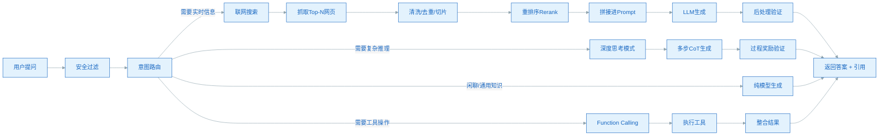
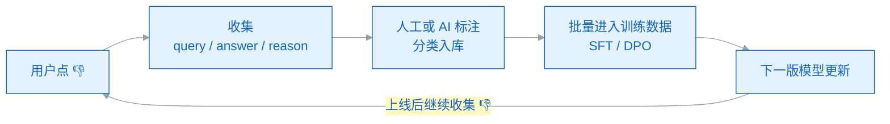

用户点了 👎，反馈"答错了"。接下来该改什么？

这是每个做大模型产品的人每天都会遇到的问题。多数团队第一反应是"换更强的模型"或者"加更多 prompt"，但这两条路都偏题。**大模型答错是一个链路累积误差问题**，工程上要做的是：先归因，再定位，最后在最优的那一层修。

这篇文章不讲玄学技巧，给一套可直接落地的优化框架。

<!--more-->

## 一、七类错误：先归因再动手

把"答错"拆开看，至少有七类完全不同的错误，根因和修法都不一样：

| 错误类型 | 典型表现 | 主要责任层 |
|---------|---------|-----------|
| **事实幻觉** | 编造不存在的论文、人名、API 参数 | LLM + 训练数据 |
| **时效错误** | 用旧信息答新问题（"2024 年奥运会在哪"答东京） | 路由 + 检索 |
| **检索错** | 搜到了，但召回的文档不对 | 检索层 |
| **读不懂检索** | 文档是对的，模型没正确提取 | Prompt + LLM |
| **逻辑推理错** | 数学、代码、因果推理崩了 | 推理 / 思考模式 |
| **过度拒答** | 能答的说"不确定" | 对齐 / 安全策略 |
| **该拒没拒** | 瞎答敏感问题 | 安全层 |

不分类就动手 = 打地鼠。一个改 prompt 能修的"检索召回不准"，重训基模都救不回来；反之亦然。

## 二、完整链路：错大多不在 LLM

以"联网问答"为例，元宝、ChatGPT、文心一言这类产品的推理链路大致是这样的：



**一个关键事实：真实场景里很大比例的"答错"是路由 + 检索层的问题，不是 LLM 本身。** 这是为什么很多团队发现"换了更大的模型，准确率还是上不去"——瓶颈根本不在基模。

## 三、归因：5 步定位 bad case

工程师拿到 bad case 后，按这个顺序排查，每一步都要看真实日志，不要靠"我觉得是哪里的问题"：

```
1. 用户原始问题是什么
2. 路由判对了吗？该联网却没联？该思考却直答？
3. 检索 Top-K 里有没有正确答案？
   ├── 没有 → 检索召回差（切片 / Embedding / Query 改写出问题）
   └── 有 → 进入 4
4. Prompt 里有没有正确包含检索内容？
   ├── 没有 → 拼接 / 长度截断出问题
   └── 有 → 进入 5
5. LLM 读懂了吗？答对了吗？
   ├── 答错 → Prompt 不够约束 / LLM 能力不够
   └── 答对 → 是不是后处理把它改坏了？
```

## 四、四个典型 bad case

### 案例 A：用户问"今天 A 股收盘点位"，模型给了旧数据

**归因**：时效错误 + 路由错（路由器没判出需要联网）

**修法**：
1. 路由 prompt 强化："涉及实时数据（股价、天气、新闻）必须触发搜索"
2. 时间敏感 query 加硬规则：默认强制联网，不管路由器怎么判
3. 检索 query 重写：把"今天 A 股"改成"2026-07-28 上证指数 收盘 点位"

### 案例 B：用户问"transformer 和 mamba 核心区别"，第 2 点事实错误

**归因**：事实幻觉（模型内部知识模糊）

**修法**：
1. 触发联网，强制检索 arxiv 论文
2. Prompt 加硬约束：
   ```
   必须基于以下检索内容回答，列出 [1][2] 引用。
   不要使用模型自有知识，不确定就回答"暂无可靠信息"。
   ```
3. 后处理用 NLI 模型校验："答案的每句话是否被检索内容支持"，不支撑就拒答

### 案例 C：用户问"9.11 和 9.9 哪个大"，答 9.11 大

**归因**：推理错（链式思维崩了）

**修法**：
1. 强制启用"深度思考"模式（DeepSeek R1、o1 风格）
2. Prompt 引导："请先列已知条件，再逐步推，禁止跳步"
3. 简单算术 / 逻辑题默认走思考模式

### 案例 D：用户问"怎么写爬虫绕过反爬"，模型敷衍拒答

**归因**：过度拒答（安全策略过严）

**修法**：
1. 安全分类器调阈值，区分"教学讨论" vs"恶意攻击"
2. Refusal 指令微调：合法范围内答得更详细
3. Few-shot 加几个"安全但详细"的回答样例

## 五、优化手段全景

上面四个案例大多在推理阶段就能修。但凡涉及基模能力上限（推理、风格、知识深度）的问题，必须回到训练。把可选手段汇总成一张表：

| 手段 | 解决的问题 | 适用场景 | 成本 |
|------|----------|---------|------|
| **修路由 / 强化检索（Rerank + 混合）** | 时效错、检索错 | 多数联网问答 | 低 |
| **约束 Prompt + NLI 后处理** | 事实幻觉、读不懂检索 | 知识类回答 | 低 |
| **启用深度思考模式**（o1 / R1） | 推理错 | 数学、代码、规划 | 中 |
| **Function Calling / Agent** | 复杂多步任务 | 业务系统对接 | 中 |
| **SFT 监督微调** | 风格、格式、对齐 | 有 1k+ 高质量标注 | 中高 |
| **RLHF / DPO 偏好对齐** | 风格倾向、安全 | 想调"语气"或拒答阈值 | 高 |
| **Constitutional AI / Process Reward** | 推理与安全深度对齐 | 大厂级投入 | 高 |
| **RAG 链路优化**（分块 / Embedding 调优） | 召回率、引用准确性 | 企业知识库 | 中 |
| **重训基模** | 整体能力上限 | 几乎只有大厂做 | 极高 |

几个值得拎出来说的判断：

- **数据质量 > 模型规模**：业内共识是高质量数据带来的提升远大于多 10B 参数。去重、去污染、事实性数据加权这三件事性价比最高
- **Test-time Compute 是当下热点**：OpenAI o1、DeepSeek R1、Claude Sonnet（Extended Thinking 模式）都是这条路——**很多问题不是模型不知道，而是没给自己时间想**
- **RAG 做对比基模升级更值**：真正难的不是"有没有 RAG"，而是 RAG 的每一步（混合检索、多级分块、NLI 验证、Query decomposition、多源交叉验证）

## 六、闭环与优先级

优化做完不代表结束，还要把"用户反馈"接成数据飞轮：



日活百万级的产品每天会积累大量 👎 反馈，**这是最大的免费标注数据源**，但绝大多数团队都没真正接到训练链路里。

最后是工程师的优先级——按投入产出比：

```
1. 修路由 bug               ← 成本最低、影响最大
2. 强化检索（Rerank / 混合）← 中等成本、效果立竿见影
3. 加约束 prompt + 后处理验证  ← 成本低
4. 接深度思考模式            ← 中等成本
5. 针对性微调（DPO / SFT）   ← 成本高、周期长
6. 重训基模                 ← 成本最高、一般只有大厂或专项团队做
```

**80% 的优化在前 3 步就够了。** 不要动不动就想重训。

## 七、结语

> 大模型的"答错"不是单一问题，而是**数据 → 训练 → 推理 → 产品**整条链路的累积误差。工业界不指望"一招治幻觉"，而是用**评测驱动每一层逐步降低**。

作为工程师，最该养成的习惯是：
- 拿到 bad case 先归因，不动手就改是浪费
- 永远先在**最便宜的那一层**修
- 每次改动都要进回归测试集
- 把用户反馈接成数据飞轮

剩下的，就交给时间。

---

**参考**

- [OpenAI o1 System Card（推理时计算）](https://openai.com/index/learning-to-reason-with-llms/)
- [DeepSeek R1 论文（强化学习 + 推理）](https://arxiv.org/abs/2501.12948)