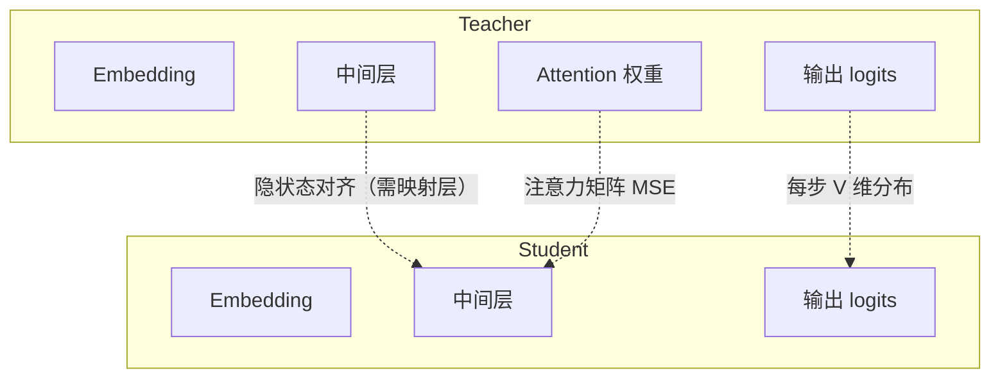
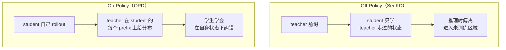

2025 年 1 月，DeepSeek 一口气放出 6 个 R1 蒸馏模型。但如果按 Hinton 2014 年那篇论文的定义逐条对照，这些模型一个都不算蒸馏。

它们的实际训练过程是：用 R1 生成了 80 万条完整解答，然后在 Qwen / Llama 基座上做 2~3 个 epoch 的监督微调。Teacher 的 logits、隐状态、注意力图——一概没有参与训练。

同一件事被叫成同一个名字，底下其实是三种完全不同的技术：**能看到的 teacher 信息越少，蒸馏的信息密度就越低，需要的算力也就越多**。这篇文章把这三层拆开讲清楚，以及 2025-2026 年工业界真正在用的是哪一层。

<!--more-->

## 一、蒸馏传的不是"答案"，是"答案的分布"

先把定义收紧：蒸馏是在 **teacher 参数冻结**的前提下，让 student 去拟合 teacher 的输出分布。它既不是某种模型结构，也不是某种压缩算法——它就是一个**目标函数的写法**。

传统训练的监督信号是 one-hot 硬标签。"这张图是 7"，这条样本携带的有效信息就是"这是 7"，仅此而已。

Hinton 注意到 teacher 的概率分布里多藏了一层东西。他在论文里举的例子很具体：某张写得很潦草的 2，被模型判成 3 的概率是 10⁻⁶、判成 7 的概率是 10⁻⁹；换一张 2，这两个数字正好反过来。两张图在硬标签下完全等价，但 teacher 的反应透露了一个硬标签永远表达不了的事实：**哪些数字互相容易混，哪些不会混**。

这就是所谓 dark knowledge——它不是任何一个样本的正确答案，而是 teacher 从全部训练数据里归纳出来的**类间相似度结构**。

| 监督信号 | 每个样本携带的信息 | 是否包含类间关系 |
|---|---|---|
| 硬标签 | 1 个类别索引 | 否 |
| 软标签 | 整个类别/词表上的概率分布 | 是 |

放到语言模型上，这个差距会被 token 数量再放大一次。一段 $T$ 个 token 的文本，硬标签下每个位置只告诉 student "下一个词是 X"；软标签下每个位置给的是**词表上 10 万个数**，其中绝大多数不为 0，只是很小——而这些小值恰好编码了 teacher 认为"下一个词还可能是哪些"。

### 那组被引用了上万次的数字

Hinton 2014 年在 MNIST 上的对照实验，是理解软标签价值最干净的一组数据：

| 模型 | 配置 | 测试错误数 |
|---|---|---|
| Teacher | 784-1200-1200-10，dropout + 权值约束 + 输入抖动 | **67** |
| Student（基线） | 784-800-800-10，无任何正则 | 146 |
| Student（软标签蒸馏） | 同一结构，去掉 dropout 和抖动，只增加一项"匹配 T=20 软标签"的任务 | **74** |

Student 的参数没变、数据没变、正则一项没用——只是把损失函数里的硬标签换成了 teacher 的软标签，错误数就从 146 掉到 74，几乎追平 teacher。这个提升本来是由"输入抖动 + dropout"带来的，而**抖动的收益通过软标签被打包转移到了 student 身上**，尽管 student 自己完全没有做数据增强。

论文里还有一处细节更能说明问题：训练 student 时**把数字 3 的样本全部删掉**。对 student 来说，3 是一个从未见过的类别。结果它在测试集上依然把 98.6% 的 3 认对了——因为 teacher 在别的数字上早就反复暗示过"这种形状和我见过的 3 很像"。硬标签做不到这件事，因为在硬标签的世界里，"3"这个名字压根没有出现过。

**软标签本质上是一种更强的正则化项**：它把 teacher 的泛化方式，以分布的形式直接压进了 student 的损失函数。

## 二、温度：把 logits 的暗部提亮

直接拿 teacher 的 softmax 输出当软标签是有问题的。模型在正确答案上通常极度自信，分布接近 one-hot：

```
正确类 0.9995
其余各类 1e-4 ~ 1e-6
```

这种分布喂给 student，信息量和硬标签没有本质差别——1e-6 在浮点里约等于 0，类间关系全被量级压掉了。

Hinton 的解法是给 softmax 加一个温度：

```
q_i = exp(z_i / T) / Σ_j exp(z_j / T)
```

除以温度 T 再做 softmax。T=1 就是原始分布；T 越大，logits 之间的差距等比压缩，分布被熨平，原本埋在 1e-6 的关系浮到了 1e-2，进入梯度能看见的区间。

打个比方，这很像 HDR 合成里的 tone mapping：场景动态范围太大时，暗部在直方图上被压成一片死黑，必须把它拉起来才能看见阴影里的细节。**温度不创造任何信息，它只是把已经存在、但被量级掩盖的部分调到可读区间。**

训练时 student 用同样高温算 softmax，推理时切回 T=1——蒸馏阶段要"软"，部署阶段要"准"。

### 为什么软标签那项必须乘 T²

高温不只是把分布变软，它同时会**把梯度缩小**。把交叉熵对 student 的 logits 求导：

```
∂C/∂z_i = (1/T) · (q_i - p_i)
```

`q` 是 student 软化后的预测，`p` 是 teacher 软化后的软标签。温度越高，差值越小，梯度整体按 1/T 衰减。

继续推到高温极限（logits 幅度远小于 T），并对 logits 做零均值化，上式可以收敛到一个非常干净的形式：

```
∂C/∂z_i ≈ (1 / (N·T²)) · (z_i - v_i)
```

`v_i` 是 teacher 的 logits。注意右端这一项——**当温度趋于无穷时，蒸馏等价于直接对 logits 做 L2 回归**。这同时解释了两件事：

1. 梯度正比于 1/T²，所以软标签项必须乘 T² 才能和硬标签项的梯度量级对齐，否则温度一调高，软标签就自动"失声"了。
2. Caruana 2006 年的 model compression（直接拿 teacher 的预测当硬标签训小模型）是蒸馏的一个特例，而不是另一种方法。

蒸馏损失通常写成两部分加权：

```python
# 概念示意，非可直接运行的训练脚本
loss = (1 - alpha) * cross_entropy(student_logits, hard_labels) \
     + alpha * T**2 * kl_div(
           log_softmax(student_logits / T),
           softmax(teacher_logits / T),
       )
```

Hinton 的语音实验里 α 取 0.5。student 既要拟合真实标签（防止 teacher 的错误被全盘继承），又要拟合 teacher 的分布（拿到类间结构），两条腿走路。

### 温度不是越高越好

如果"温度越高，暗知识越可见"这条逻辑无限延伸，T 应该开得越大越好。但实验数据否掉了它：

- student 每层 **300 个以上**单元时，**T > 8 的结果基本没有差别**；
- 把 student 砍到每层 **30 个单元**，**T ∈ [2.5, 4] 反而显著优于更高或更低的温度**。

温度太低，类间关系还埋在噪声里；温度太高，teacher 的分布被熨得太平，student 有限的容量学不动——原本清晰的"像谁"退化成均匀的糊状。这里已经埋下了后文容量差距（capacity gap）的伏笔。

## 三、三种粒度：能拿到 teacher 的什么，决定能蒸什么

按"能访问到 teacher 内部多少东西"，蒸馏分成三个层次，信息密度依次递增：

| 粒度 | 传输的内容 | 需要的前提 | 代表工作 |
|---|---|---|---|
| **输出/Logit 蒸馏** | 每步的完整概率分布 | teacher 的 logits | Hinton KD、DistilBERT |
| **特征蒸馏** | 中间层隐状态 | 拿到 activation，且维度可对齐 | FitNets、PKD |
| **注意力蒸馏** | 每层的注意力矩阵 | 拿到 attention weights | TinyBERT、MobileBERT |



特征蒸馏的经典实现是 FitNets：在 student 和 teacher 各挑一层，teacher 那层叫 hint layer、student 那层叫 guided layer，中间插一个可学习的线性回归器 `W_r` 做维度对齐，然后对两者做 MSE。注意力蒸馏则不看隐状态数值，只对齐"模型把注意力放在了输入的哪些位置"——它的好处是注意力矩阵天然可解释，student 学到的是**关注模式**而不是数值。

这三种在 encoder 时代是组合使用的。DistilBERT 同时挂三个损失：

1. **蒸馏损失（L_ce）**：拟合 teacher 的软标签，训练时用 T=4
2. **学生损失（L_mlm）**：student 自己做掩码语言建模，保住基础能力
3. **余弦损失（L_cos）**：student 与 teacher 的隐状态做余弦相似度对齐

结果：**参数减 40%、推理快 60%、GLUE 保留 97%**。TinyBERT 做得更细（embedding / hidden / attention / prediction 四类损失，通用蒸馏 + 任务蒸馏两阶段），4 层模型比 BERT-base 小 7.5 倍、快 9.4 倍，GLUE 保留 96.8%。

但这里有个现实必须点破：**上面三种粒度里，只有第一种在 LLM 时代还能用**。原因很简单——今天最强的 teacher 大多藏在 API 后面，你既拿不到它的激活值，更拿不到它的注意力图。

## 四、工业界实际在蒸的，是黑盒序列级蒸馏

Hinton 式蒸馏的前提是拿到 teacher 在**整个词表**上的分布。而商用 API 返回的是采样出来的 token，最多附带几个候选的 top-k logprob——一个 128k 词表的完整分布，从来没有对外提供过。

所以当你调用 API 做"蒸馏"时，做的必然是另一件事：**序列级知识蒸馏（SeqKD）**，出自 Kim & Rush 2016 年的机器翻译工作。做法是把 teacher 用 beam search 解出的完整序列当伪标签，student 在上面做普通的最大似然。原文报告 student 推理快约 10 倍而质量损失很小。

两种方式的信息密度差得很远：

| | 每个位置的信息量 | 实际含义 |
|---|---|---|
| Logit 蒸馏 | 整个词表上的分布 | "正确答案是 A，但如果换成 B/C/D 也不算离谱" |
| SeqKD | 1 个 token | "正确答案是 A" |

前者是后者信息量的几个数量级。这直接决定了两者的样本效率：logit 蒸馏每个样本榨得更干，SeqKD 则需要海量生成文本。这也是为什么"蒸馏"在大模型语境下退化成了一件很朴素的事——**用模型生成的数据做 SFT**。

### 生产环境里的实际配方

如果要复现一个可用的黑盒蒸馏流程，关键动作只有五个，其中第四个是最大的质量杠杆：

1. **Prompt 来自真实流量**。这是整件事的起点：用合成 prompt 会系统性偏离你的线上分布，蒸出来的 student 在真实输入上就是不准。
2. **每个 prompt 采样多个候选**，而不是只取一个贪心结果。贪心解码会让语料多样性极低，student 会继承 teacher 唯一一种解法。
3. **用 verifier / 评分标准挑出最好的那个**——能跑单测的跑单测，能校验 schema 的校验 schema。这一步叫拒绝采样（rejection sampling）。
4. **硬过滤**：schema 不符、长度异常、事实性没过关的一律扔掉。一条未经审阅的 teacher 输出，就是一条你准备永久训进去的 teacher 错误。
5. **在幸存样本上做普通 SFT**。

DeepSeek-R1-Distill 就是这条路线的公开样本：800K 监督数据（约 60 万条推理相关 + 20 万条非推理），对 Qwen / Llama 基座微调 2~3 个 epoch。R1-Distill-Qwen-32B 在 AIME 2024 拿到 72.6、MATH-500 拿到 94.3、Codeforces 评分 1691——这些数字确实来自一个 32B 的稠密模型。

值得记住的一点是**命名和实质的错位**：这条路线被叫做"蒸馏"，但 teacher 的权重、隐状态、完整 token 分布都没有参与，实际发生的是"在精选生成数据上做监督微调"。这个区分不是学术洁癖：

- **技术后果不同**：SeqKD 迁移的是"这种题该怎么解的表述方式"，logit 蒸馏迁移的是 teacher 的概率几何。前者的能力上限明显更低。
- **法律后果不同**：调用闭源 API 大量生成数据来训练竞品模型，在主流厂商的服务条款里是被明确禁止的；部分厂商还会公开声明检测到了大规模自动化抓取行为。白盒蒸馏不存在这个问题，因为 teacher 本来就在你手里。

## 五、On-Policy 蒸馏：2025-2026 的主战场

SeqKD 有一个结构性缺陷，来自它模仿的是**teacher 的轨迹**。

**状态分布错配（exposure bias）**：训练时 student 被喂的是 teacher 生成的前缀，它学的是"给定 teacher 的完美上下文，下一步该输出什么"；推理时它必须条件在自己的前缀上。一旦第 3 步就写错了一个符号，后面所有 token 都落进了训练时从未见过的状态区域。误差不是线性叠加的——**off-policy 的误差累积是 O(εT²)，on-policy 是 O(εT)**。推理链越长，这个差距越不可接受。这正是 2024 年之后所有前沿实验室都转向 On-Policy 蒸馏（OPD）的原因。



机制上的改动只有一处，但很关键：**监督的状态来自 student，监督的内容来自 teacher**。student 先按当前策略生成自己的轨迹，teacher 在 student 实际走到的每个 prefix 上给出 token 级分布。teacher 不再只回答"标准解是什么"，而是回答"如果你已经走到了这里，下一步我会怎么分布"——最终奖励信号被展开成了 prefix 级的密集信号。

### 为什么 OPD 普遍用反向 KL

这里有一个容易被忽略的细节：蒸馏的散度方向不是随便选的。

- **前向 KL**（min KL(p_teacher ‖ p_student)）：mean-seeking。student 被迫去覆盖 teacher 分布的所有质量，包括它没把握的长尾区域——**这正是幻觉的数学来源**。
- **反向 KL**（min KL(p_student ‖ p_teacher)）：mode-seeking。student 只要抓住 teacher 最确信的那几个模式即可，可以自由地把概率从长尾上收回来。

反向 KL 还有一个工程上的好处：它"不可被利用"（unhackable）。前向 KL 下 student 只要在不确定处乱铺概率就能降低损失，反向 KL 下这条路走不通，所以训练更稳。

### 工业界已经全面转向

OPD 不是论文里的概念，2025 年下半年开始它已经写进了各家技术报告：

| 模型 / 机构 | 做法 |
|---|---|
| **Gemma 2** | 后训练阶段引入 on-policy 蒸馏：student 先按 SFT prompt 生成 completion，teacher 在这些 student 生成结果上给 logits / KL 信号 |
| **Qwen3** | 轻量模型的 strong-to-weak 蒸馏分两阶段：先 off-policy 冷启动，再 on-policy——student 在 `/think` 或 `/no_think` 模式下生成序列，对齐 Qwen3-32B 或 Qwen3-235B-A22B 的 logits 并最小化 KL |
| **Thinking Machines** | 2025 年 10 月开源 OPD 方法，公布了 Qwen3-32B → Qwen3-8B-Base 的可复现案例 |
| **DeepSeek-V4** | 后训练阶段直接放弃混合 RL，用多 teacher 的反向 KL 做 OPD，把数学、代码、Agent、指令遵循等多个领域专家统一灌进一个 student |

公开的效率数字相当可观：Qwen3-32B → Qwen3-8B-Base 的能力迁移只用了约 **150 个训练步**就达到目标分数的 70%，算力成本比 RL 路线低 **9~30 倍**；行为恢复场景下 Qwen3-8B 的 IF-eval 从 79% 回到 83%，且没有损害新学到的能力。

### 但 OPD 的成功是有条件的

2026 年 5 月，清华 THUNLP 联合多所机构的一项系统性研究给出了两条前提，值得任何打算上 OPD 的人先对照检查：

1. **思维模式一致性**：teacher 和 student 的初始推理模式必须相近。
2. **teacher 必须提供新知识**，而不只是"同一分布下的更强版本"。一个分数更高但思维方式不同的 teacher，学生学不动。

机制层面，真正驱动优化的是**师生共同看好的高概率 token 的重叠率**——只在这些重叠 token 上算损失，性能几乎不受影响；而师生都不看好的非重叠 token 对优化贡献微乎其微。

失效模式也很清晰：**teacher 在 student 生成的 prefix 上给出不确定的判断时，密集信号会退化成噪声**。更麻烦的是长序列场景——教师提供的密集监督质量随轨迹深度急剧衰减，会出现"从后向前的熵崩塌"，这也是 OPD 目前难以直接扩展到长思维链和多轮 Agent 任务的原因。

工程上的修法已经出现：把采样 token 的单点监督换成 **teacher top-K 局部支撑集匹配 + 截断反向 KL**（只在 teacher 支持的 token 子集上比较分布），配合 top-p rollout 采样和特殊 token 掩码，在推理与 Agent 基准上比标准 sampled-token OPD 高出 **19.8%**。

## 六、算力该分给谁：蒸馏的 Scaling Law

到这一步，工程问题变成了预算分配问题：**给定算力上限，是加训 teacher、放大 student、多喂数据，还是干脆别蒸馏？**

Apple 和牛津在 ICML 2025 的 *Distillation Scaling Laws* 给了目前最完整的答案。实验规模是 143M ~ 12.6B 参数、最多 512B token、73 组监督训练 + 697 组蒸馏训练，拟合出的公式预测学生交叉熵的**相对误差小于 1%**。

五条结论，每一条都足够反直觉：

| 结论 | 工程含义 |
|---|---|
| 决定 student 表现的是 **teacher 的交叉熵损失**，不是参数量 | 一个小而训练充分的 teacher，胜过一个大而欠训练的 teacher |
| **最优 teacher 尺寸只比 student 略大**，之后收益趋于平台 | 无脑堆 teacher 规模是浪费 |
| **teacher 可能"太强"**：固定 student 后继续提升 teacher，student 反而变差 | 容量差距是真实存在的，且是 U 型曲线 |
| 数据充足时，**监督学习一定赢过蒸馏** | 蒸馏是加速器，不是降低地板的手段 |
| 是否省算力取决于 **teacher 成本能否摊薄** | 已有 teacher 或一师多徒 → 划算；为单个 student 从头训 teacher → 不如直接训 student |

第三点值得展开，因为它推翻了"teacher 越强越好"这个直觉。论文给出的根因是**学习能力差距**（假设空间 + 优化能力），而不只是模型尺寸——teacher 变强的同时，它的输出分布对 student 而言也越来越难拟合，最终 student 无法把 teacher 的进步转化成自己的收益。论文里用来解释这个现象的类比很传神：

> 一个好奇心旺盛的 5 岁孩子，能从高中数学老师那里学到不少东西；但换成研究生数学导师，他大概率什么也学不到，甚至会变得更困惑。

这正好解释了第二节里那个悬而未决的现象——**student 每层只有 30 个单元时，反而 T ∈ [2.5, 4] 比高温效果更好**：容量不够的时候，teacher 越"清晰"的软化分布对 student 越是噪声。

最后一条是纯工程判断，可以直接抄成决策规则：

```
if teacher 已经存在 or 一个 teacher 要服务多个 student:
    蒸馏划算
else:
    直接在真实数据上监督训练
```

## 七、蒸馏的四条硬边界

- **天花板由 student 的架构容量决定。** 蒸馏让 student 更快地逼近它自身的架构极限，但不会把它抬到极限之上。论文原话是"compute accelerator，而不是降低不可约误差"。
- **能力会回退。** 蒸馏数据过于集中在单一任务上时，student 可能在通用对话上变笨。缓解办法是混入通用预训练数据、加正则约束；OPD 里的"行为恢复"之所以成为一个专门场景，正是因为能力回退是常态。
- **teacher 的坏习惯照单全收。** 偏见、格式偏好、长度偏好、错误的推理捷径，都会原封不动地进到 student 里。更隐蔽的是第六节提到的那条：反向 KL 配合奖励外推时，会把 teacher 相对 reference 的偏好进一步放大——包括它的校准错误。
- **白盒蒸馏有法律边界。** 黑盒路线下的数据采集在多数厂商条款里是被禁止的，而白盒路线（teacher 自持）没有这个问题。

## 八、结语

蒸馏真正的洞见不在于"小模型可以变强"，而在于一个更底层的事实：**一个训练好的模型的输出，不只是关于正确答案的信息，还是关于"什么像什么"的结构**。硬标签丢掉了这层结构，软标签、中间层激活、注意力图，都是在把这层结构以不同分辨率抢救出来。

如果只记住三条分歧线，那么今天讨论蒸馏时应该先问清楚的是：

1. **白盒还是黑盒**——你能不能拿到 teacher 的完整分布，决定了信息密度差一个数量级。
2. **Off-policy 还是 On-policy**——监督发生在 teacher 的状态上还是 student 的状态上，决定了长链推理能不能训得动。
3. **模仿还是外推**——把 teacher 当作能力上限去复制，还是当作偏好的噪声表示去强化，决定了 student 有没有机会超过 teacher。

而算力该怎么花，现在有了可以用公式算的答案：teacher 的能力比它的体积更重要，最优 teacher 只比 student 略大，而蒸馏在数据稀缺时才最划算。

---

## 参考资料

- Hinton, Vinyals, Dean. *Distilling the Knowledge in a Neural Network*. NIPS 2014 Deep Learning Workshop. arXiv:1503.02531
- Kim, Rush. *Sequence-Level Knowledge Distillation*. EMNLP 2016. arXiv:1606.07947
- Sanh et al. *DistilBERT, a distilled version of BERT: smaller, faster, cheaper and lighter*. 2019. arXiv:1910.01108
- Jiao et al. *TinyBERT: Distilling BERT for Natural Language Understanding*. 2020. arXiv:1909.10351
- Busbridge et al. *Distillation Scaling Laws*. ICML 2025. arXiv:2502.08606
- Agarwal et al. *On-Policy Distillation of Language Models: Learning from Self-Generated Mistakes*. ICLR 2024. arXiv:2306.13649
- DeepSeek-AI. *DeepSeek-R1: Incentivizing Reasoning Capability in LLMs via Reinforcement Learning*. 2025. arXiv:2501.12948
- Qwen Team. *Qwen3 Technical Report*. 2025. arXiv:2505.09388
