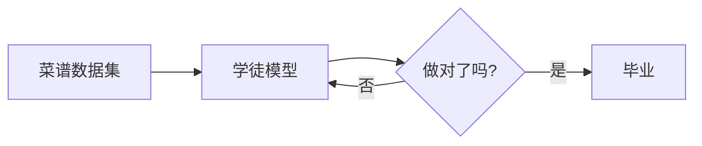
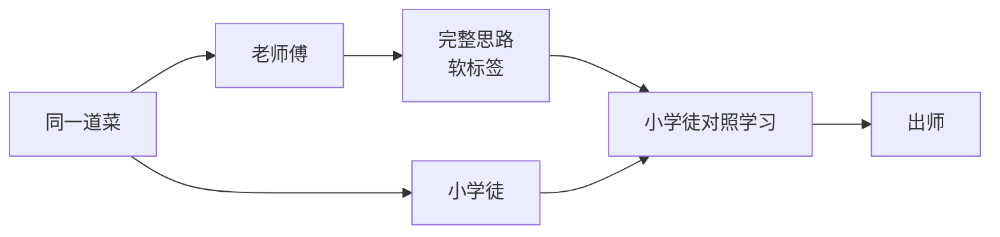
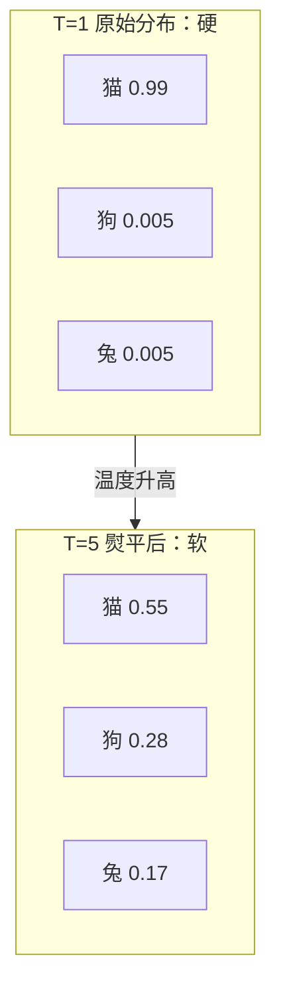
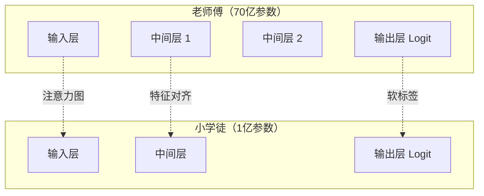

你是一家百年老店的老板。你有一位镇店的老厨师——做菜几十年，火候精准、味觉敏锐，客人赞不绝口。但问题是，他一个月薪要 5 万，切菜慢、脾气大、还时不时请假。

现在你要开分店，需要 10 个能做出 80% 味道的厨师，便宜、听话、能加班。怎么办？

最直接的方法：让他们去新东方烹饪学校重学三年。但太慢了。

更聪明的办法：让老厨师**手把手带徒弟**。不要求徒弟复制老厨师的一切，只要他们能学到老厨师的"味觉直觉"和"调味逻辑"——几个月后，这些徒弟就能做出**味道相近、薪资只需老厨师十分之一**的菜。

**大模型蒸馏（Knowledge Distillation），就是这个"带徒弟"的过程。**

<!--more-->

它让一个庞大的、能力强的"老师模型"（Teacher Model），把它的"知识"传授给一个轻量级的"学生模型"（Student Model）。结果就是：学生模型以小得多的体积、跑得快得多的速度，达到接近老师的能力。

这篇文章，我们就用"老师傅带学徒"这个类比，把蒸馏这件事彻底讲清楚。

## 一、从老师傅说起：大模型的"三高"困境

2026 年的旗舰大模型，参数动辄数千亿。GPT-4 级别模型的推理成本大约是**每生成 100 万个 Token 要几百美元**，单次响应延迟常常超过 1 秒。

这带来三个具体问题：

- **贵**：每次 API 调用都让企业肉疼，C 端产品根本用不起
- **慢**：聊天机器人回复要等几秒，用户体验差
- **重**：一张 A100 显卡跑不动，手机端更是奢望

但这些大模型确实强——它们在复杂推理、专业问答、多轮对话上的能力远超小模型。

矛盾出现了：**我们想要大模型的"聪明"，但要不起它的"体型"**。

怎么办？传统的"瘦身"方法有三种：

| 方法 | 类比 | 思路 |
|------|------|------|
| **剪枝（Pruning）** | 砍掉师傅不常用的工具 | 去掉不重要的参数 |
| **量化（Quantization）** | 把 32 位精度降到 8 位 | 用更少的比特存同一个数 |
| **蒸馏（Distillation）** | 让师傅带徒弟 | **用大模型教小模型** |

剪枝和量化是"瘦身"，蒸馏是"传承"。它们经常组合使用，但目标不同：剪枝量化让模型变小但能力也变小；蒸馏则是**主动让小模型"继承"大模型的能力**。

## 二、什么是蒸馏：师傅如何教徒弟

传统训练一个 AI 模型，就像送学徒去新东方：给他一堆菜谱（标注数据），让他照着做，做错了就改。



**这条路线的局限**：菜谱只有"对"和"错"两个答案。学不到师傅为什么这么做、这道菜哪里微妙。

蒸馏的思路完全不同：



老师傅对这道菜的回答不是简单的"好吃/不好吃"，而是一整套**判断逻辑**——比如这道菜 70% 像川菜、20% 像湘菜、10% 像本帮菜。学生学的不只是最终答案，还有老师傅**如何思考**的过程。

这就是 2014 年 Hinton 等人在论文 *Distilling the Knowledge in a Neural Network* 中提出的核心洞见：

> **大模型输出的"概率分布"中，包含了比"硬标签"丰富得多的信息**——这些信息被称为 **暗知识（Dark Knowledge）**。

## 三、关键一课：软标签与温度

### 什么是软标签

想象一个图像分类问题：一张猫的图片。

**传统训练（硬标签）**：

```
猫: 100%
狗: 0%
兔子: 0%
```

学生只学到"这是猫"，没学到任何额外信息。

**蒸馏训练（软标签）**：

```
猫: 0.85
狗: 0.10
兔子: 0.05
```

学生不仅学到"这是猫"，还学到了"它有点像狗、更不像兔子"——这就是**类间关系**。老师傅把"这道菜和那几道菜的相似度"也告诉了徒弟。

### 什么是温度（Temperature）

但这里有个问题：如果直接用 softmax 出来的概率，**正确答案的概率通常接近 1，其他都是 0.001 级别**——差异太大，徒弟根本学不到"像什么"。

**Hinton 的解法：温度（Temperature）**。

原始 softmax：

```
p_i = exp(z_i) / sum_j exp(z_j)
```

带温度的 softmax：

```
p_i_T = exp(z_i / T) / sum_j exp(z_j / T)
```

公式很简单：把每个 logits 除以温度 T，再做 softmax。

**直觉理解**：

- **T=1**（常温）：概率分布很"硬"，正确答案接近 1，其他接近 0
- **T 很大**（高温）：概率分布被"熨平"，原来 0.001 的变成 0.05，原来 0.99 的变成 0.6，差异变小
- **T 越大，分布越"软"**，暗知识暴露得越多



**温度越高，越能看清"像谁"的细微差别**。蒸馏时通常用 T=3 到 T=20 之间。

训练完成后，推理时回到 T=1，因为此时不需要"软"，需要的是"准"。

### 总损失函数

学生最终的损失由两部分组成：

```
L = a * L_hard + (1 - a) * L_soft
```

- `L_hard`：学徒自己对答案的损失（传统交叉熵）
- `L_soft`：学徒模仿老师傅软标签的损失（用高温）
- `a` 是权重，常取 0.3 到 0.5

**类比**：学徒既要学做菜（`L_hard`），也要学师傅的思维方式（`L_soft`），两手都要抓。

## 四、师傅的三种教法

不同师傅擅长教不同的东西。蒸馏也有三大主流流派，每种流派的"教学内容"不同。

### 4.1 Logit 蒸馏：教"最终结论"

徒弟只学老师傅最后端输出的概率分布。

**类比**：学徒只看师傅做的成品菜，琢磨"这道菜调味比例大概是这样"。

**代表方法**：Hinton 2015 的原始 KD、DistilBERT。

**优点**：简单、好实现、不需要中间层匹配。

**缺点**：老师傅的中间思考过程（用了什么调料、火候怎么控制）丢了。

### 4.2 特征蒸馏：教"中间笔记"

徒弟不仅学最终结论，还要学中间层的特征表示。

**类比**：学徒看师傅做菜时的"中间笔记"——比如"这道菜先大火爆炒 30 秒，再转小火焖 5 分钟"。

**代表方法**：FitNets、Patient Knowledge Distillation。

**优点**：学徒能学到更深的"加工过程"，效果往往更好。

**缺点**：要求老师傅和学生中间层维度匹配（或用映射层），实现复杂。

### 4.3 注意力蒸馏：教"关注点"

徒弟学老师傅每一层的"注意力分布"——也就是模型在做判断时**关注输入的哪些部分**。

**类比**：师傅做菜时会"看火候、闻香气、尝咸淡"，徒弟也要学着把注意力分配到这几个关键环节。

**代表方法**：TinyBERT、MobileBERT。

**优点**：注意力本身就是模型"思考路径"的可视化，学生学到的是"思维方式"。

**缺点**：通常要结合特征蒸馏一起用，纯注意力蒸馏效果有限。



实际工程中，主流框架通常**三种方法组合使用**，并配合损失函数加权。

## 五、经典案例：DistilBERT

2019 年 Hugging Face 发布的 DistilBERT，是蒸馏领域最经典的案例之一。

**它的目标**：把 BERT-base 蒸馏成更小的版本。

| 指标 | BERT-base | DistilBERT | 比例 |
|------|-----------|------------|------|
| 参数 | 1.1 亿 | 6600 万 | **60%** |
| 推理速度 | 1x | **1.6x** | 快 60% |
| 能力（GLUE 基准）| 100% | **97%** | 几乎保留 |

只用了 BERT 60% 的参数、跑快 60%，却保留了 97% 的能力。这就是蒸馏的威力。

**它用了三种损失**：

1. **蒸馏损失（L_ce）**：学生模仿老师的软标签（带温度 T=4）
2. **学生损失（L_mlm）**：学生自己做掩码预测（保留传统学习能力）
3. **余弦相似损失（L_cos）**：学生的隐藏层和老师的隐藏层方向尽量一致

**类比**：DistilBERT 不仅学师傅的"成品菜"（蒸馏损失），自己也要练基本功（学生损失），还要让自己的"做菜思路"和师傅对齐（余弦损失）。三管齐下，效果自然好。

## 六、现代战场：大模型的"师徒传承"

2025-2026 年，蒸馏进入了"大模型时代"。最具代表性的当属 **DeepSeek**。

DeepSeek-V3 是一个 6710 亿参数的 MoE（混合专家）模型——其中**总参数** 6710 亿，但每次推理**实际激活**的只有约 370 亿。它发布时**同时提供了多个蒸馏版本**：DeepSeek-R1-Distill-Qwen-1.5B、7B、14B、32B，以及基于 Llama 的 8B、70B 版本。

这些蒸馏小模型在数学、代码、推理任务上的表现**超过了同等尺寸的原生模型**，甚至某些维度追平了 GPT-4o 这种巨型闭源模型。

**业界类似的蒸馏动作**：

- **Qwen 系列**：阿里持续发布 Qwen2.5 的蒸馏小模型（0.5B、1.5B、3B），专门针对端侧部署
- **Llama 系列**：Meta 推出了多个尺寸的 Llama 模型（8B、70B、405B），不同尺寸针对不同部署场景，但小尺寸版本并非蒸馏产物，而是单独训练的
- **手机端 LLM**：高通、联发科芯片上的本地大模型，几乎都是蒸馏产物

**类比**：DeepSeek 就像一个全国闻名的老师傅，派了 6 个学徒去 6 个不同的"分校"传承。这些学徒毕业时，已经能做出接近老师傅水平的菜，但每个学徒只需要一个灶台（手机、笔记本）就能干活。

## 七、学徒的局限

蒸馏不是万能的，徒弟终究是徒弟。

### 7.1 能力天花板

**学生模型的天花板，由它的架构容量决定**。如果你用一个 1 亿参数的模型蒸馏 1000 亿参数的模型，它能继承 60%-80% 的能力，但永远达不到 100%——因为它根本没"脑子"装那么多东西。

**类比**：让一个 5 岁的孩子跟老厨师学，他能学会 80% 的家常菜，但永远做不出满汉全席。

### 7.2 灾难性遗忘

学生模型在蒸馏过程中，可能**忘记自己原本在预训练阶段学到的能力**。特别是当蒸馏数据集中在某一类任务时（比如全部是代码），模型可能在通用对话上变笨。

**类比**：学徒太专注于师傅的招牌菜，结果把基础刀工都忘了。

**缓解方法**：蒸馏时混入通用预训练数据、加正则化约束。

### 7.3 与量化、剪枝的关系

| 方法 | 类比 | 特点 |
|------|------|------|
| **蒸馏** | 师傅带徒弟 | 主动让小模型继承能力，**耗时但效果上限高** |
| **量化** | 把 32 位食谱压成 8 位 | **算力成本低**，但精度损失明显 |
| **剪枝** | 砍掉师傅不用的工具 | **算力成本低**，但可能误剪重要连接 |

**工业实践通常组合使用**：先用蒸馏得到一个能力继承好的小模型，再做 4-bit 量化进一步压缩，最终部署。

### 7.4 老师傅的"坏习惯"也会传

老师傅有时会犯偏见性错误，学生会**忠实地继承这些错误**。比如老师傅在某种问题上性别偏见严重，学生也会学到。

**类比**：师傅做菜有个小毛病——盐永远多放一点。徒弟跟着学，几年后自己做菜也永远多放盐。

**对策**：蒸馏前对老师傅做"去偏"处理，或在学生训练时加入"纠错数据"。

## 八、结语：AI 时代的师徒传承

蒸馏技术的优雅之处在于：**它承认了一个朴素的事实——能力可以被传递**。

一个 700 亿参数的大模型，花几个月训练成本几百万美元。但通过蒸馏，它的"知识"可以被压缩进一个 7 亿参数的模型——**成本几乎归零，能力保留 90%**。

这让 AI 的"民主化"成为可能：

- **大公司**用蒸馏降低部署成本，把昂贵的云端推理变成便宜的端侧推理
- **研究者**用蒸馏探索小模型的极限，理解"哪些知识是必须的、哪些是冗余的"
- **普通人**最终用上能在手机、平板上跑得动的本地 AI

某种意义上，蒸馏是 AI 行业从"堆算力"走向"重效率"的转折点。它告诉我们：

> **模型不必越大越好。让对的知识到达对的地方，比单纯把模型做大更重要。**

下次你看到手机输入法里的本地补全、智能音箱的离线唤醒词识别、汽车座舱里无需联网的语音助手，请记得背后那位"老师傅"——以及它把毕生所学传给小学徒的那份耐心。

---

## 参考资料

- Hinton, Vinyals, Dean. *Distilling the Knowledge in a Neural Network*. NeurIPS 2014 Deep Learning Workshop.
- Sanh et al. *DistilBERT, a distilled version of BERT: smaller, faster, cheaper and lighter*. 2019.
- Jiao et al. *TinyBERT: Distilling BERT for Natural Language Understanding*. 2020.
- DeepSeek-AI. *DeepSeek-V3 Technical Report*. 2024.