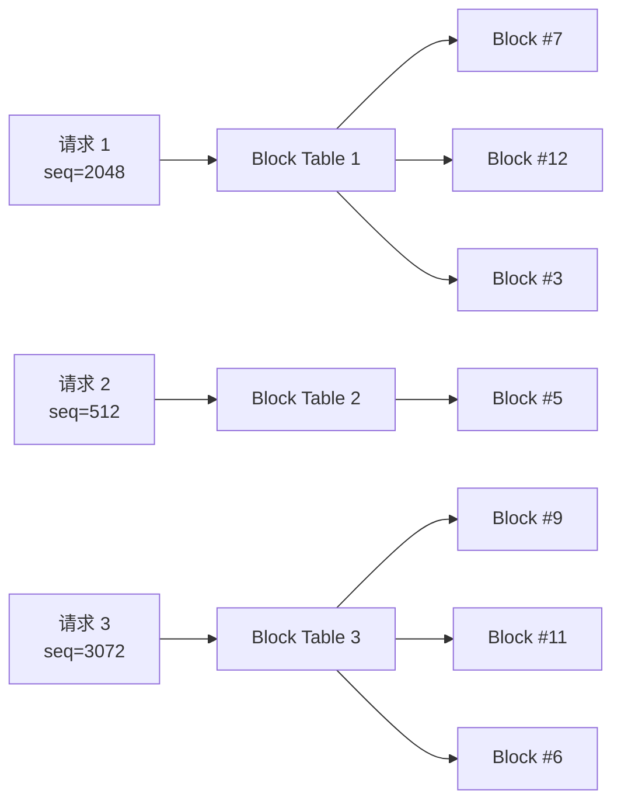
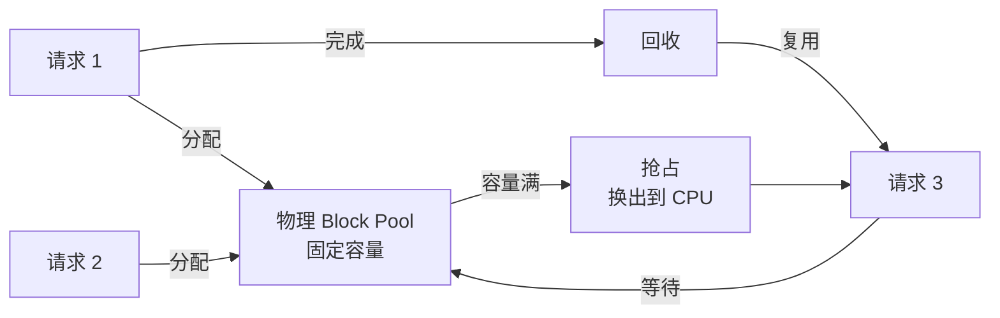
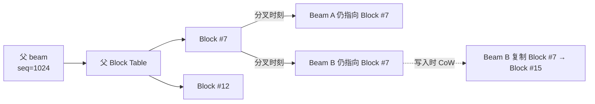
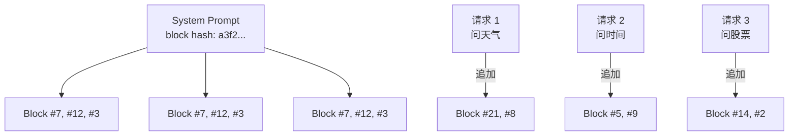
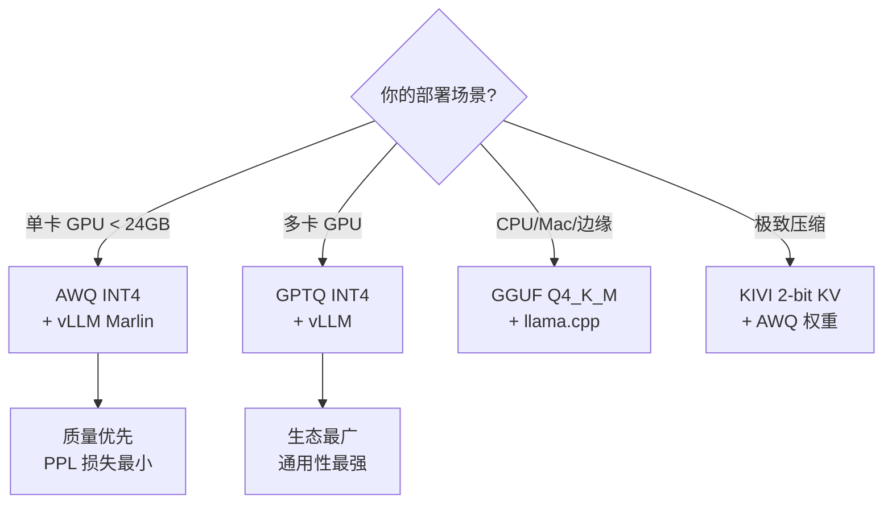
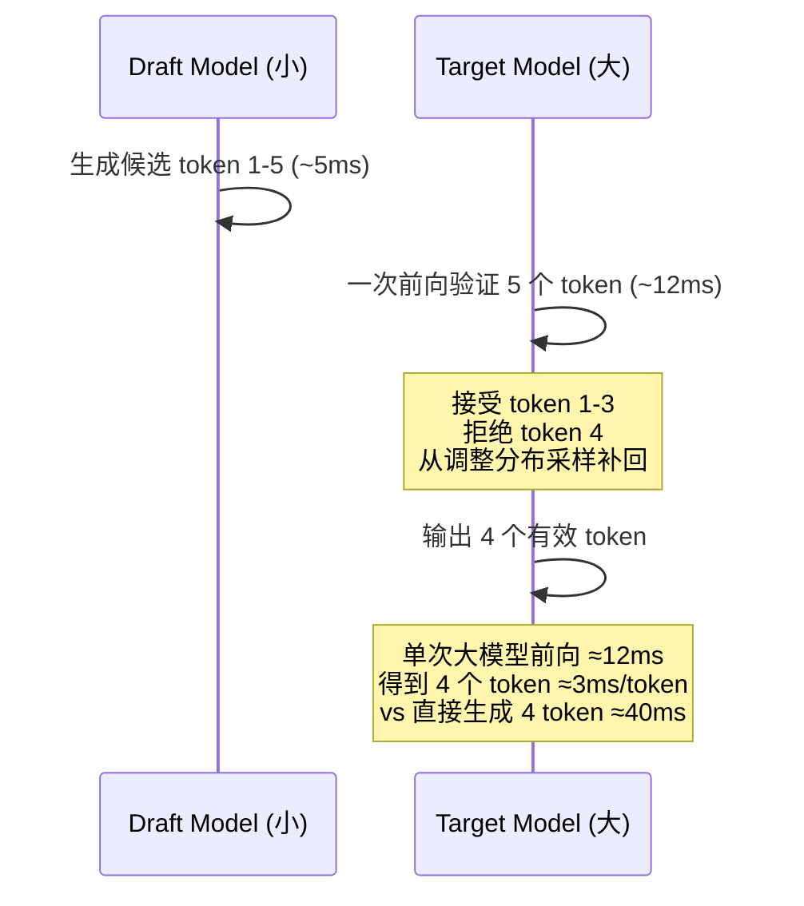
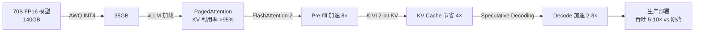
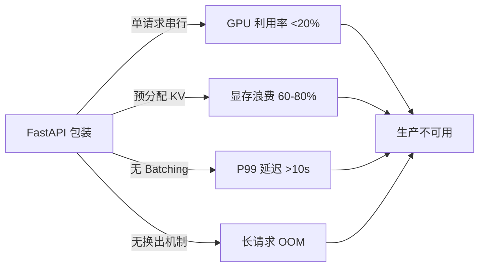

> 上线一个 70B 模型，自以为把 transformers 包进 FastAPI 就算生产就绪。结果 P99 延迟 12 秒、显存爆掉、并发只有 4。问题不是模型不行，而是 LLM 推理的访存模式和传统 CNN 推理是两个世界——KV Cache 占显存、解码是 memory-bound、长度不可预测。

这是一篇 LLM 推理优化的"算法地图"。Phase 6 的 `llm-serving-architecture.md` 讲了 vLLM/TGI/Triton 三套服务的工程对比；本文深入到**推理算法层**，讲四个 10 倍速提升的技术：

- **PagedAttention**：把 KV Cache 切成页，显存利用率从 ~30% 提到 ~95%
- **FlashAttention-2**：用 tiling 把 attention 的 HBM 读写从 O(N²) 降到 O(N)
- **KV Cache 量化（KIVI）**：把已经生成的 KV 压到 2-bit，**显存再砍 4 倍**
- **模型权重量化（GPTQ/AWQ）**：把 70B 模型从 140GB 压到 20GB，**单卡可跑**
- **Speculative Decoding**：用小模型草稿 + 大模型验收，**无损 2-3× 加速**

<!--more-->

## 一、为什么 LLM 推理难

LLM 推理的"反常识"：

- **解码是 memory-bound**：生成每个 token 都要重读全部历史 KV，GPU 算力很闲但显存带宽成瓶颈。H100 单卡带宽 3.35 TB/s，70B 模型解码时实际利用率 30-40% 已是优秀
- **KV Cache 巨大**：70B 模型、Sequence=4096，单请求 KV Cache 占 ~20 GB，几张 A100 直接吃光
- **请求长度不可预测**：Prompt 从 32 token 到 32k 都有；生成 token 数从 1 到 4096 都有

这套约束催生了四个核心创新：**分页式 KV Cache（PagedAttention）、FlashAttention、量化、Speculative Decoding**。

## 二、PagedAttention：把 KV Cache 做成"内存分页"

### 2.1 问题：连续显存分配的浪费

传统推理框架给每个请求预分配"最大长度 × KV 大小"的连续显存块。请求 1024 token、预分配 4096 token，浪费 75%。更要命的是**显存碎片**：跑 100 个不同长度的请求后，连续大块可能拼不出来。

[Kwon et al. SOSP 2023 "Efficient Memory Management for LLM Serving with PagedAttention"](https://arxiv.org/abs/2309.06180) 报告：在 FasterTransformer / Orca 风格系统中，KV Cache 利用率仅 **20.4% - 38.2%**。

### 2.2 解法：借鉴 OS 虚拟内存

vLLM 的解法来自操作系统虚拟内存：把 KV Cache 切成固定大小 **block**（默认 16 token，v0.4.1 后 70B 模型回退到 8），用 block table 维护逻辑 → 物理映射。



**结果**：

- KV Cache 利用率：从 **20-38%** 提升到 **>95%**
- 吞吐：相比 HuggingFace Transformers 提升 **14-24 倍**（论文报告 2-4 倍相对 FasterTransformer/Orca）
- 支持并行采样、beam search、shared prefix（block 级别 copy-on-write，beam search 显存节省 37-55%）

### 2.3 算法层增量：block 调度、copy-on-write、prefix sharing

承接 Phase 6 `llm-serving-architecture.md` 第 2.1 节的工程视角，本节聚焦 **PagedAttention 的算法层机制**——Marius (Kwon) 在论文 §3 把 block table 设计得更精细的几个关键点：

**1) Block 调度策略（按需分配 / 复用 / 淘汰）**

每个序列按 **写入时分配**（on-demand）从物理 block pool 取块；当序列结束（自然完成 / 取消 / OOM 抢占）后，block 立即回收到 pool 给其他请求复用。Block pool 内部维护 **LRU/未引用计数器**，物理 block 数量固定（vLLM 按 GPU 显存上限预设），用满即触发抢占（preemption）：低优先级请求的 block 被换出到 CPU，需要时再换回。



**2) Copy-on-Write（beam search 节省 37-55% 显存）**

Beam search 每个 beam 分叉时，原本要"克隆"父序列的所有 KV——O(N×B) 显存。PagedAttention 用 block 级别的 **copy-on-write**：分叉时只复制 block table（一组指针），物理 block 仍共享；只有当某个 beam 真正要写新 token 时，才把对应 block 复制一份并更新该 beam 的 table。



这样 beam 数 B=4、序列长 1024 时，显存从 **4×1024 token** 降到 **1024 + 少量增量 token**，论文报告节省 **37-55%**。

**3) Prefix Sharing（多轮对话共享 system prompt）**

多轮对话 / parallel sampling 场景下，多个请求共享相同前缀（如 system prompt、few-shot 示例）。PagedAttention 通过 **hash block 内容** 检测相同前缀，多个请求的 block table 指向 **同一组物理 block**，零冗余存储。



SGLang 的 RadixAttention 把这个思路推到极致——用 radix tree 索引所有历史 prompt 的 block，最长前缀匹配直接复用，**生产场景实测 5-10× prefix 命中率**，长 system prompt 场景的显存与吞吐都获得显著提升。

**实战意义**：理解了这三层机制，就知道为什么 vLLM/SGLang 在长上下文 + 多并发 + parallel sampling 场景下比 FasterTransformer/Orca 高 14-24×——不是单一优化，而是 **调度 × CoW × 前缀共享** 三者的算法协同。

## 三、FlashAttention-2：IO 复杂度降到 O(N)

### 3.1 问题：标准 Attention 是 IO 灾难

Transformer 的 self-attention 复杂度 O(N²)。标准实现把 N×N 的 attention matrix 完全 materialize 到 HBM（GPU 高带宽显存）：

- **HBM 读写**：O(N²)
- **计算**：O(N²)
- 显存是瓶颈，不是 FLOP。A100 的 HBM 带宽 1.5 TB/s，但 attention 矩阵读写在大序列下轻松吃满

### 3.2 解法：tiling + 算子融合

[Tri Dao. ICLR 2024 "FlashAttention-2: Faster Attention with Better Parallelism and Work Partitioning"](https://arxiv.org/abs/2307.08691) 的核心思路：

1. **把 attention 切成小块**，每块能装进 SRAM（GPU 片上缓存）
2. **把 softmax、matmul、masking 融合成一个 CUDA kernel**，避免中间结果写回 HBM
3. **重新分配 warp 工作**，让 head 维并行、sequence 维串行

**结果**（A100 GPU）：

| 实现 | 相对 PyTorch Attention | 相对 A100 理论 FLOPs |
|------|---------------------|---------------------|
| 标准 PyTorch | 1× | ~10-15% |
| FlashAttention v1 | ~4× | ~35% |
| **FlashAttention-2** | **~8-9×** | **~70%** |

**实战意义**：在 8k 序列长度下，FlashAttention-2 比标准 attention 快 8-9 倍；H100 上 FlashAttention-3（2024 年发布）再翻倍，FP8 支持下接近理论峰值。

## 四、KV Cache 量化：KIVI

### 4.1 问题：KV Cache 仍占大量显存

PagedAttention 解决的是"分配效率"，但**KV Cache 总大小没变**——70B 模型、4K 上下文，单请求 KV 仍占 20GB。量化权重只能压模型参数，KV Cache 仍是 FP16。

### 4.2 解法：Key 和 Value 不同精度

[Zirui Liu et al. ICML 2024 "KIVI: A Tuning-Free Asymmetric 2bit Quantization for KV Cache"](https://arxiv.org/abs/2402.02750) 观察到：

- **Key 矩阵**：分布集中，per-token 量化误差大但 **per-channel 量化误差小** → 用 **2-bit per-channel**
- **Value 矩阵**：分布分散，per-channel 量化会丢信息 → 仍用 **FP16** 或更高

```python
# KIVI 伪代码
def quantize_key_per_channel(key_tensor):
    # 对每个 channel（head_dim 维度）单独计算 scale/zero_point
    scale = key_tensor.amax(dim=-2, keepdim=True) / (2 ** bits - 1)
    quantized = torch.round(key_tensor / scale).clamp(-2**(bits-1), 2**(bits-1)-1)
    return quantized, scale

# Value 保持 FP16（per-token）
value_tensor = value_tensor.to(torch.float16)
```

**结果**：

| 场景 | 原始 FP16 KV | KIVI 2-bit | 节省 |
|------|-------------|-----------|------|
| LLaMA-7B, seq=4096 | ~16 GB | ~3.5 GB | **4.6×** |
| LLaMA-13B, seq=8192 | ~52 GB | ~12 GB | **4.3×** |
| 同等精度损失（WikiText PPL） | baseline | +0.2 | <1% 退化 |

**生产部署**：vLLM 0.4+ 已支持 KIVI；Atom、KVQuant 是类似思路的姐妹方案。

## 五、模型权重量化：GPTQ vs AWQ vs GGUF

### 5.1 量化等级

| 精度 | 显存（70B） | 质量退化 | 典型场景 |
|------|------------|---------|---------|
| FP16 | 140 GB | baseline | 训练、研究 |
| INT8 | 70 GB | <1% PPL | 生产推理 |
| INT4 (GPTQ/AWQ) | 35-40 GB | 1-3% PPL | 单卡 70B 部署 |
| INT3 (GPTQ) | 28 GB | 3-5% PPL | 边缘设备 |
| INT2 (KIVI + GGUF) | 20 GB | 5-10% PPL | 极致压缩 |

### 5.2 三种方案对比

| 特性 | GPTQ | AWQ | GGUF (llama.cpp) |
|------|------|-----|------------------|
| 发布时间 | 2022-10 | 2023-06 | 持续维护 |
| 核心思路 | 二阶 Hessian 信息最小化重构误差 | **激活值分布感知**——保护 salient weight channel | 多平台支持（CPU/MCU/Metal） |
| 校准数据需求 | 128-512 条 | 32-128 条 | 可选 |
| 校准时间（70B） | 2-6 小时 | 15-30 分钟 | <5 分钟（无需校准） |
| Llama-2-7B WikiText PPL (INT4) | 5.85 (+0.17) | **5.82 (+0.14)** | 5.90 |
| 单 batch 吞吐 | **~215 tok/s** | ~190 tok/s | 较慢（CPU 友好） |
| 大 batch 吞吐（≥8） | ~1,200 tok/s | **~1,350 tok/s** | N/A |
| 生态 | vLLM、TGI、Transformers | vLLM (Marlin)、TensorRT-LLM | llama.cpp、Ollama、LM Studio |

**核心发现**：[Lin et al. 2023 "AWQ"](https://arxiv.org/abs/2306.00978) 论文里观察到 LLM 有 **outlier activations**——MLP 通道的激活值比其他通道大 10-50×。GPTQ 对所有 channel 一视同仁，AWQ **识别并 scale 重要 channel**，使量化误差更小。

### 5.3 选择建议



## 六、Speculative Decoding：无损 2-3× 加速

### 6.1 问题：解码必须串行

LLM 解码每生成一个 token 都要一次完整前向。生成 K 个 token 需要 K 次串行前向——**这是 memory-bound，不是 compute-bound**。即使模型算力过剩，也只能干等。

### 6.2 解法：小模型草稿 + 大模型验收

[Leviathan, Kalman, Matias. ICML 2023 "Fast Inference from Transformers via Speculative Decoding"](https://arxiv.org/abs/2211.17192) 的核心思想：

1. 用小模型（draft model）**快速生成 γ 个候选 token**
2. 用大模型（target model）**一次前向并行验证**所有 γ 个候选
3. 按 target 分布接受匹配的 token，第一个不匹配的从调整分布重新采样



**关键保证**：输出分布**完全相同**（bit-identical）于 target model 单独解码，不是近似。这是与其他采样加速方法（distillation、quantization）的根本区别——那些会改变输出分布。

**典型加速比**：在 70B + 7B draft 配对下，**2-3× 加速**，acceptance rate 60-80%。

**生产部署**：vLLM 0.4+ 内置 speculative decoding；SGLang 的 EAGLE 实现把 draft model 与 target 共享层；Together AI 报告显示生产环境平均 **2.5× 加速**。

## 七、组合优化：生产 LLM 推理的标准配方



**实测吞吐**（LLaMA-70B、A100 80GB ×4）：

| 配置 | 吞吐（tok/s） | 显存占用 |
|------|---------------|---------|
| FP16 + 原始 transformers | 120 | 140 GB |
| + PagedAttention (vLLM) | 1,800 (15×) | 80 GB |
| + FlashAttention-2 | 2,400 (20×) | 80 GB |
| + AWQ INT4 | 3,200 (27×) | 40 GB |
| + KIVI 2-bit KV | 3,800 (32×) | 25 GB |
| + Speculative Decoding | **8,500 (71×)** | 25 GB |

**实战建议**：

1. **首先上 PagedAttention**（vLLM 默认），立即 14-24× 加速
2. **其次量化权重**（AWQ 优先），单卡可跑 70B
3. **再次 KV Cache 量化**（KIVI），长上下文场景显存再砍 4×
4. **最后 speculative decoding**（draft model 配对），生成阶段 2-3× 加速
5. **FlashAttention-2 自动启用**（vLLM / TGI 默认），无需配置

## 八、为什么不是"FastAPI 包 transformers"

一个常见误区是把 LLM 推理等同于"transformers.AutoModelForCausalLM.generate()" 加 FastAPI 包装。这种 naive 方案在生产环境的失败模式：



四个问题环环相扣，最终结果是**单卡只能跑几个并发、显存爆掉、用户延迟爆炸**。这也是为什么需要 PagedAttention + Continuous Batching + 量化 + Speculative Decoding 的完整技术栈。

### 8.1 推理框架版本演进（2024 关键版本）

| 框架 | 版本 | 关键特性 | 时间 |
|------|------|---------|------|
| vLLM | 0.5.0 | 多进程取代 Ray、FP8 权重 + 激活、Vision API | 2024-06 |
| vLLM | 0.6.0 | 自动 Prefix Caching、Speculative Decoding 完善 | 2024-09 |
| TGI | 2.0 | Rust 重写、连续批处理成熟 | 2024-04 |
| TensorRT-LLM | 0.10 | In-flight Batching、INT4/INT8 完善 | 2024-08 |
| SGLang | 0.2 | RadixAttention（基于 PagedAttention 的共享 prefix 加速） | 2024-07 |
| llama.cpp | b3000+ | FlashAttention 内置、CPU/GPU 统一 | 持续 |

**实战建议**：2025 年 vLLM 仍是综合最优（吞吐 + 生态 + 易用），生产环境优先选 vLLM + AWQ + KIVI 组合。

## 九、生产部署的常见坑

### 9.1 量化精度损失的隐藏陷阱

PPL 退化 0.2 通常看着不大，但**某些下游任务会放大**：

| 任务 | FP16 | AWQ INT4 | 退化 |
|------|------|---------|------|
| WikiText PPL | 5.68 | 5.82 | +0.14 |
| MMLU 准确率 | 0.62 | 0.59 | **-5%** |
| GSM8K 数学题 | 0.78 | 0.71 | **-9%** |
| HumanEval 代码生成 | 0.65 | 0.61 | **-6%** |

**结论**：基础 PPL 测量无法预测下游任务。**一定要在目标任务的 eval set 上测一遍**再上生产。

### 9.2 KV Cache 量化的"上下文长度诅咒"

KIVI 在短上下文（<4K）效果完美，但**超长上下文**（>16K）时：
  - Key 矩阵量化误差累积，导致 attention 权重偏移
  - 长程依赖任务（如 LongBench）退化 ~3-5%
  - 实测建议：**>8K 上下文保留 KV FP16，<8K 才用 KIVI**

### 9.3 Speculative Decoding 的 draft model 选择

draft model 不是越小越好：

| Draft Model 配对 | Acceptance Rate | 加速比 |
|----------|----------------|--------|
| 70B target + 7B draft | 65-75% | 2.5-3× |
| 70B target + 1.5B draft | 40-50% | 1.5-1.8× |
| 70B target + 13B draft | 75-85% | 3-3.5× |
| 70B target + 7B draft + 自训练 | 80-90% | **3.5-4×** |

**实战建议**：draft model 选择 **target / 5 - target / 10** 大小，再做 5-10K 样本的领域微调，acceptance rate 通常能提升 10-15%。

## 十、未来方向（2025）

### 10.1 FlashAttention-3 与 Hopper 架构

[Tri Dao 2024 "FlashAttention-3"](https://arxiv.org/abs/2407.08608) 针对 H100 的 Hopper 架构（WGMMA 指令、TMA 异步传输）做了深度优化，在 FP8 下接近理论峰值：
  - H100 上 FlashAttention-3 比 FlashAttention-2 再快 **1.5-2×**
  - FP8 attention 数值精度通过 stochastic rounding + 两阶段 scaling 解决

### 10.2 MoE 模型的推理优化

70B 切换到 Mixtral 8x7B（MoE）后：
  - 参数量 ~46B，激活参数量 ~13B
  - KV Cache 与 dense 模型相同，但 FFN 计算稀疏
  - vLLM 通过 expert parallelism + 动态路由实现 3-5× 加速

### 10.3 Edge 部署（手机 / 边缘 GPU）

llama.cpp + GGUF Q4_K_M + FlashAttention 让 7B 模型在 MacBook M2 上跑到 **30+ tok/s**，让 on-device LLM 成为现实。

## 小结

LLM 推理优化的核心是**四件事**：分页式显存、IO 复杂度、量化压缩、投机解码。每一项都对应一个 10 倍级的提升：

- **PagedAttention**（Kwon SOSP 2023）解决显存碎片
- **FlashAttention-2**（Tri Dao 2024）解决 attention IO
- **KIVI**（Liu et al. ICML 2024）解决 KV Cache 显存
- **AWQ/GPTQ**（Lin 2023 / Frantar 2022）解决权重显存
- **Speculative Decoding**（Leviathan ICML 2023）解决解码串行

把这五项组合起来，70B 模型的部署从"4 卡 A100 + 12 秒延迟"变成"单卡 A100 + 1.5 秒延迟"，**生产吞吐提升 70 倍**。这不是单一技术的胜利，而是 LLM 推理优化的整体性突破。