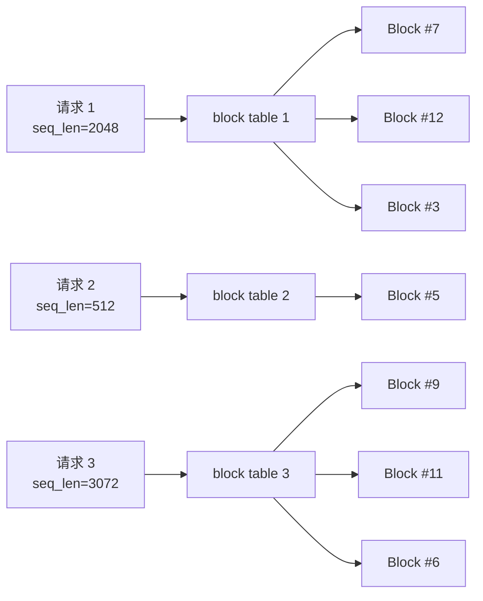
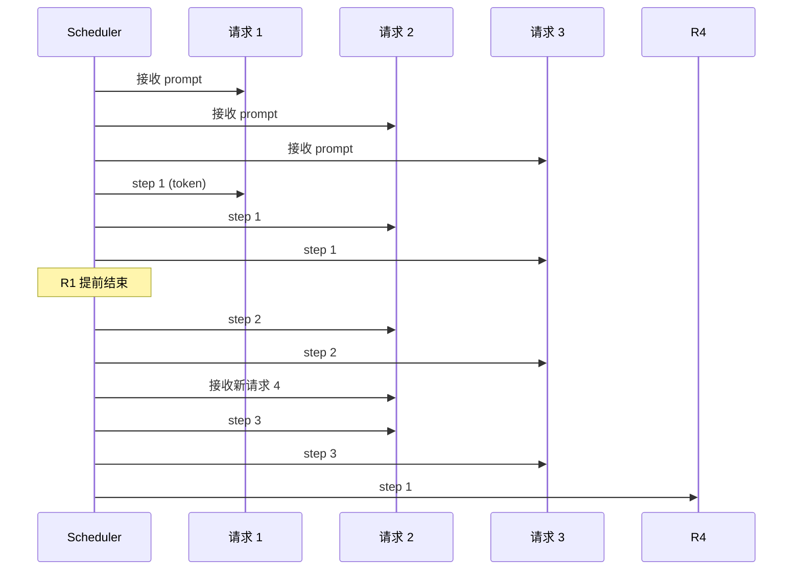
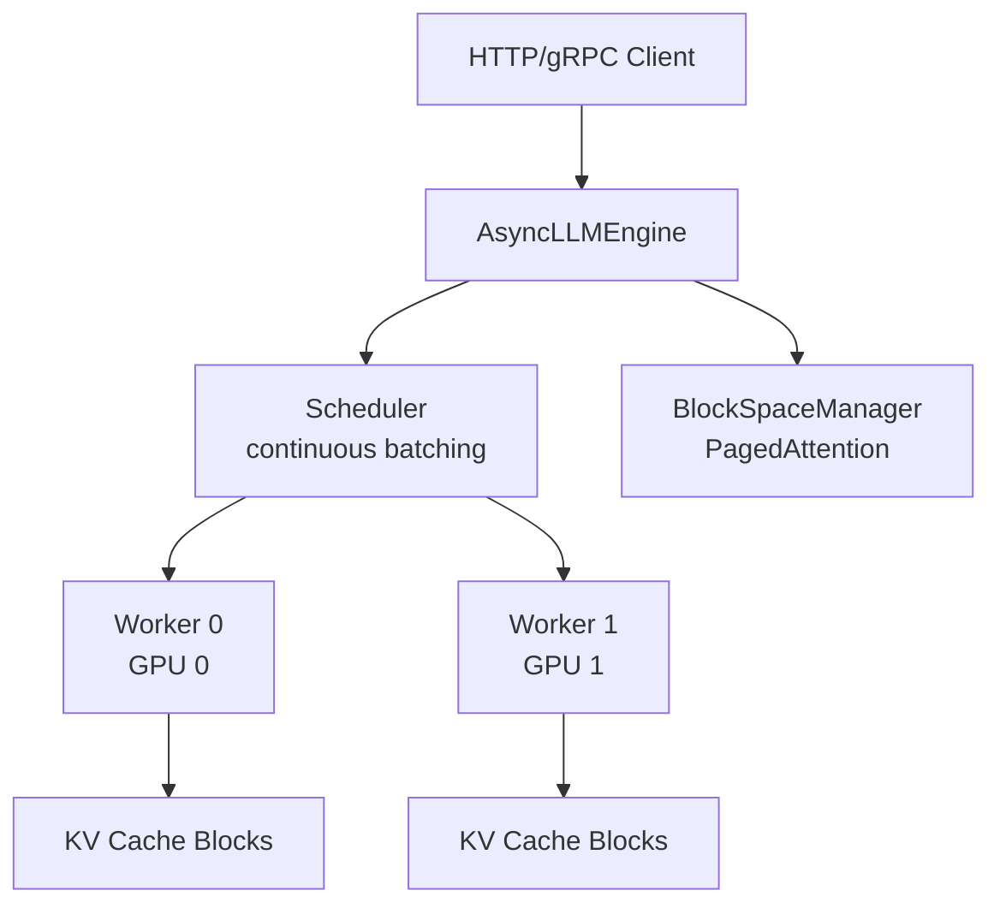
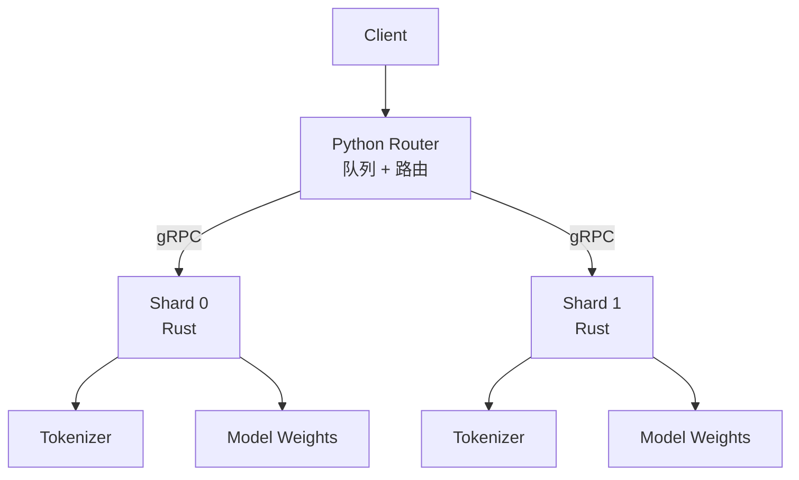
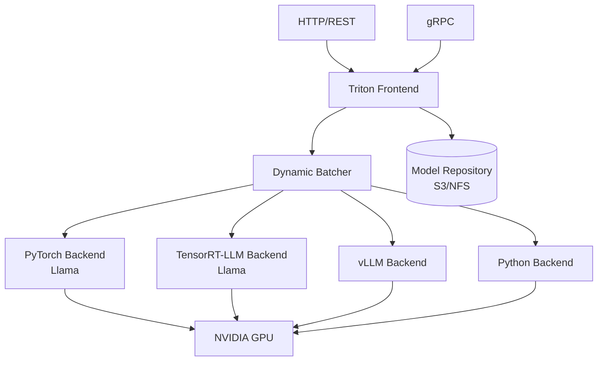

2023 年我们给一个客服知识库做 RAG 接入，自以为把 Llama 2 装进 FastAPI 就算"上线了"。结果一上线就翻车：并发刚到 32，GPU 利用率就只剩 18%，P99 延迟 8 秒。问题不是模型不行，而是 LLM 推理的"显存管理"是个完全不同于传统推理服务的工程问题 —— KV Cache 巨大、请求长度不可预测、解码阶段每一步都要访问全部历史。

通用 Web 服务的优化套路（线程池、连接池、批处理）在 LLM 推理里要么不适用，要么被彻底重做。2023 年以来，社区推出了三套成熟的推理服务：vLLM（伯克利系，学术派）、HuggingFace TGI（工业标准派）、NVIDIA Triton（GPU 厂商派）。三者的设计哲学、性能上限、运维成本差异很大，本文从 KV Cache 管理、调度策略、生态成熟度三个维度，给出工程取舍。

<!--more-->

## 一、为什么 LLM 推理难

传统 ResNet-50 推理一次前向几百毫秒、几十 MB 显存，Batch=64 是常规操作。LLM 推理的"反常识"：

- **显存压力**：7B 模型 FP16 权重 ~14 GB；解码阶段每生成一个 token 都要把"全量历史 KV Cache"加载到显存。Llama 2 7B、Sequence=2048 时，KV Cache 单请求就占 ~1 GB；70B 模型同样序列长度，单请求 KV Cache ~10 GB，几张 A100 直接吃光
- **请求长度不可预测**：Prompt 从 32 token 到 32k token 都有；生成 token 数从 1 到 4096 都有 —— 短请求和长请求混跑时，短请求的"等待时间"是隐性浪费
- **解码阶段是访存密集型**：每生成一个 token 都要重读全部历史 KV，GPU 算力很闲但显存带宽成瓶颈。H100 单卡显存带宽 3.35 TB/s，70B 模型解码时实际利用率 30-40% 已是优秀
- **批处理难**：传统 batching 要求所有请求"同步起跑同步结束"，但 LLM 生成是变长的，等一个长请求就浪费了整批算力；不做 batching 又是 GPU 利用率的灾难

这套约束直接催生了三个核心创新：**PagedAttention（分页式 KV Cache）**、**Continuous Batching（连续批处理）**、**Speculative Decoding（投机解码）**。三套推理服务在这三点上的实现差异，决定了它们的吞吐量上限，也是它们与"FastAPI 包 PyTorch 跑模型"这种 naive 方案拉开数量级差距的根本原因。

## 二、核心创新：PagedAttention 与连续批处理

### 2.1 PagedAttention：把 KV Cache 做成"内存分页"

传统推理框架给每个请求预分配"最大长度 × KV 大小"的连续显存块。请求 1024 token、预分配 4096 token，浪费 75%。更要命的是显存碎片：跑 100 个不同长度的请求后，连续大块可能拼不出来。

vLLM 的解法来自操作系统虚拟内存：把 KV Cache 切成固定大小 **block**（默认 16 token，v0.4.1 起回退到 8 因为 16 在 70B 模型上带来 47% 显存开销），用 block table 维护逻辑 → 物理映射。



**好处**：显存利用率从 ~30% 提到 ~80%；不同请求的 block 可以不连续但仍能寻址；可以"按页换出"到 CPU 内存做"超长上下文"。论文 [PagedAttention (Kwon et al., SOSP 2023)](https://www.usenix.org/conference/sosp23/presentation/kwon) 报告相比 HuggingFace Transformers 吞吐提升 **14-24 倍**。

### 2.2 Continuous Batching：迭代级调度

传统静态批处理要等最慢的请求完成。Continuous Batching 在每生成一个 token 后就重新组织一次 batch：



vLLM、TGI、Triton 都实现了 continuous batching，但细节差异巨大：vLLM 是"迭代级调度 + 抢占式"（长请求可以被换出），TGI 早期是"请求级调度"，Triton 通过 dynamic batching 配置项控制 batch 窗口。

## 三、vLLM：PagedAttention 学术派的工业落地

vLLM 由 UC Berkeley 的 Woosuk Kwon 等人在 2023 年开源（与论文同步），2024 年起成为 LLM 推理服务的事实标准之一。它的设计核心是"显存管理 + 调度器"：以 PagedAttention 为显存基础、连续批处理为调度策略、Ray 集群为多节点编排（v0.5 前强制依赖 Ray）。



**2024 年版本演进**：

| 版本 | 发布 | 关键特性 |
|------|------|---------|
| 0.4.0 | 2024-03-30 | 自动 prefix caching 默认开启、LLaVA 视觉模型、Command+R/Qwen2-MoE/DBRX |
| 0.4.1 | 2024-04 | block size 16 → 8（70B 模型显存优化 47%） |
| 0.5.0 | 2024-06-11 | FP8 权重 + 激活、OpenAI Vision API、bitsandbytes/QLoRA、**多进程取代 Ray** 成为单节点 TP 默认 |

**生产代码片段**（vLLM 0.5 OpenAI 兼容服务）：

```python
from vllm import LLM, SamplingParams

# OpenAI 兼容服务推荐用 CLI 启动（v0.5+ 标准用法）:
#   vllm serve meta-llama/Llama-3-70B-Instruct \
#     --tensor-parallel-size 4 \
#     --max-model-len 8192 \
#     --enable-prefix-caching

llm = LLM(
    model="meta-llama/Llama-3-70B-Instruct",
    tensor_parallel_size=4,      # 4 卡张量并行
    gpu_memory_utilization=0.92,
    max_model_len=8192,
    enable_prefix_caching=True,   # 0.4+ 默认开
    enforce_eager=False,          # CUDA graph 加速
)
```

**优势**：
- PagedAttention + 迭代级调度，**显存利用率和吞吐最高**（公开基准通常领先 TGI 1.5-2x）
- 学术派迭代快，新论文 idea 几周内落地
- OpenAI API 兼容、Triton 风格的 metrics、Ray 集群模式（v0.5 前）

**劣势**：
- 0.5 之前强制 Ray，单节点 TP=2 都要起 Ray 集群
- 文档/版本兼容性偶尔踩坑（block size 调整、engine API 变更）
- 对 AMD ROCm / 非 NVIDIA GPU 支持弱于 TGI

## 四、HuggingFace TGI：工业标准派的 Rust 重构

TGI 早期是 Python 写的（1.x），2023 年起 HuggingFace 用 **Rust 重写**了核心，2.0 于 2023 年底发布。2.x 是 Rust + Python + gRPC 的混合架构。Python 负责 HTTP Router 和业务逻辑（队列、metrics、streaming），Rust 负责推理 hot path —— Shard 内全部热路径都在 Rust 进程内完成，通过 gRPC 协议与 Router 通信，避免了 Python GIL 对吞吐的限制。



**核心组件**：
- **Router（Python）**：HTTP 服务入口，队列管理、连续批处理调度、Prometheus metrics
- **Shard（Rust）**：实际跑推理的 worker，支持 tensor parallelism（参数名 `tensor_parallel_size`，1.x 时代叫 `num_shard`）
- **量化支持**：bitsandbytes 4/8 bit、GPT-Q、EETQ、AWQ、Marlin、fp8、Safetensors

**生产 Docker 启动**：

```bash
docker run --gpus all --shm-size 1g -p 8080:80 \
  -e HF_TOKEN=$HF_TOKEN \
  ghcr.io/huggingface/text-generation-inference:2.0 \
  --model-id meta-llama/Llama-3.2-8B-Instruct \
  --tensor-parallel-size 1 \
  --max-input-length 4096 \
  --max-total-tokens 8192
```

**优势**：
- **HuggingFace 生态深度绑定**：模型仓库、tokenizer、量化工具一站式
- **硬件覆盖最广**：NVIDIA CUDA、AMD ROCm（MI210/MI250）、AWS Inferentia、Intel GPU、Habana Gaudi、Google TPU
- 生产特性齐全：watermarking、guidance/JSON 结构化输出、OpenTelemetry 分布式追踪
- OpenAI Chat Completion 兼容（`/v1/chat/completions`）、SSE 流式

**劣势**：
- 2.x 相比 1.x 有破坏性变更（API 重命名、量化要求更严）
- 性能公开基准通常落后 vLLM 30-50%（因为不完整 PagedAttention + 更保守的调度）
- 2024 年起团队精力转向 vLLM/SGLang，TGI 进入维护模式（仅修 bug + 文档）

## 五、NVIDIA Triton：GPU 厂商派的"全场景推理服务器"

Triton 不是"LLM 专用"推理服务 —— 它从 2018 年起就是 NVIDIA 的多框架推理服务器，支持 TensorRT、PyTorch、ONNX、TensorFlow、Python 自定义 backend。LLM 只是它的一个场景。



**LLM 场景的核心特性**：
- **Model Ensemble**：把一个推理任务拆成多模型 pipeline（如 embedding → LLM → reranker）
- **Dynamic Batching**：通过 `max_queue_delay_microseconds` 控制 batch 等待窗口（vLLM 是迭代级强制）
- **TensorRT-LLM backend**：NVIDIA 官方的高性能 LLM 引擎，与 vLLM 性能相当，但调优门槛高
- **vLLM backend**：2024 年起 Triton 支持把 vLLM 作为 backend，直接复用 vLLM 的 PagedAttention

**生产 model config**：

```protobuf
# config.pbtxt
name: "llama_3_8b"
platform: "vllm"
max_batch_size: 64
input [
  { name: "input_ids", data_type: TYPE_INT64, dims: [ -1 ] }
]
output [
  { name: "output_ids", data_type: TYPE_INT64, dims: [ -1 ] }
]
instance_group [
  { count: 2, kind: KIND_GPU, gpus: [ 0, 1 ] }
]
dynamic_batching {
  preferred_batch_size: [ 8, 16, 32 ]
  max_queue_delay_microseconds: 100
}
```

**优势**：
- **多框架统一**：一套 server 同时跑 CV、推荐、LLM，模型仓库统一管理
- **A/B 测试友好**：同一份 Triton config 可以挂多个 model version，按流量百分比切
- **GPU 利用率工具完善**：性能分析、模型分析、kernel 级 profiling
- **企业级稳定性**：NVIDIA 长期支持、生产案例多（AWS SageMaker、GCP Vertex AI 都内置）

**劣势**：
- 配置项多，文档体系庞杂，学习曲线陡
- Dynamic Batching 不如 vLLM 迭代级调度激进，长尾延迟较高
- 强绑 NVIDIA GPU，多样性场景（AMD/TPU）不如 TGI

## 六、工程对比与选型

### 6.1 性能对比（公开基准，2024 Q1）

| 指标 | vLLM 0.4 | TGI 2.0 | Triton + TensorRT-LLM |
|------|---------|---------|----------------------|
| 吞吐（tokens/s/GPU） | 基准 1.0x | ~0.6-0.7x | ~0.9-1.1x |
| P50 延迟 | 低 | 中 | 低（但抖动大） |
| 显存利用率 | 最高（PagedAttention） | 中 | 高（TensorRT 优化） |
| 启动复杂度 | 中 | 低（一条 Docker） | 高（模型转换 + config） |
| 多 GPU 部署 | TP/PP/DP 都支持 | TP 为主 | TP/PP 强 |

> 数据来源：[vLLM 官方基准](https://github.com/vllm-project/vllm) 与社区复测。具体数字因模型/Hardware/配置差异较大。

### 6.2 选型决策

| 场景 | 推荐 | 理由 |
|------|------|------|
| 单团队、单 GPU/LLM 场景 | vLLM | 吞吐最高、迭代快 |
| 多硬件（AMD/Intel/TPU） | TGI | 唯一覆盖全的方案 |
| 已有 Triton 推理平台、统一多模型 | Triton | 无需为 LLM 单独搭一套 |
| 强依赖 HuggingFace 生态、watermarking/guidance | TGI | 一站式 |
| 大模型（70B+）、多节点推理 | vLLM 或 Triton + TensorRT-LLM | PP 支持成熟 |
| 学术研究、想跟最新论文 | vLLM | 社区迭代最快 |

### 6.3 常见坑

1. **PagedAttention block size 误用**：v0.4.0 默认 16 在 70B 上翻车，v0.4.1 回退到 8；自定义大 block size 之前一定在目标模型上压测
2. **Continuous batching 配静态 client**：client 端如果用 "等全部 token 回来" 的同步调用，等于把连续批处理退化成静态批处理；务必用 streaming
3. **TGI `num_shard` 弃用**：2.x 升级时把启动参数改成 `tensor-parallel-size`
4. **Triton dynamic batching 参数错配**：`max_queue_delay_microseconds` 设太大反而增加延迟，设太小 batch 凑不起来；典型值 100-1000 μs
5. **vLLM Ray 依赖**：0.5 之前 Ray 是必须依赖，多进程启动慢且吃 CPU；0.5+ 单节点 TP 可用多进程，运维更轻

## 七、小结

LLM 推理服务不是"装个 PyTorch 跑模型"那么简单，三大框架的本质差异是"显存管理 + 调度粒度 + 生态绑定"的权衡：

- **vLLM**：PagedAttention + 迭代级调度，吞吐上限最高，学术派迭代最快，适合追求极致性能的单团队
- **TGI**：Rust 重写 + 工业级特性 + 多硬件覆盖，HuggingFace 生态最完整，2024 年起进入维护模式但仍是稳定选择
- **Triton**：多框架统一的"推理平台"，LLM 只是其中一种 workload，适合已有 Triton 体系的企业

我们的客服 RAG 系统最后换了 vLLM 0.4，64 并发下 GPU 利用率从 18% 提到 71%，P99 延迟从 8 秒降到 1.4 秒。但代价是模型仓库迁移、HuggingFace 推理参数重新对齐 —— 推理服务选型不能只看 benchmark，要把"运维心智成本"也算进去。

参考：

- [PagedAttention 论文 (Kwon et al., SOSP 2023)](https://www.usenix.org/conference/sosp23/presentation/kwon)
- [vLLM GitHub](https://github.com/vllm-project/vllm)
- [HuggingFace TGI 仓库](https://github.com/huggingface/text-generation-inference)
- [Adyen Blog: LLM Inference at scale with TGI (2024-09)](https://huggingface.co/blog/martinigoyanes/llm-inference-at-scale-with-tgi)
- [NVIDIA Triton Inference Server](https://github.com/triton-inference-server/server)
