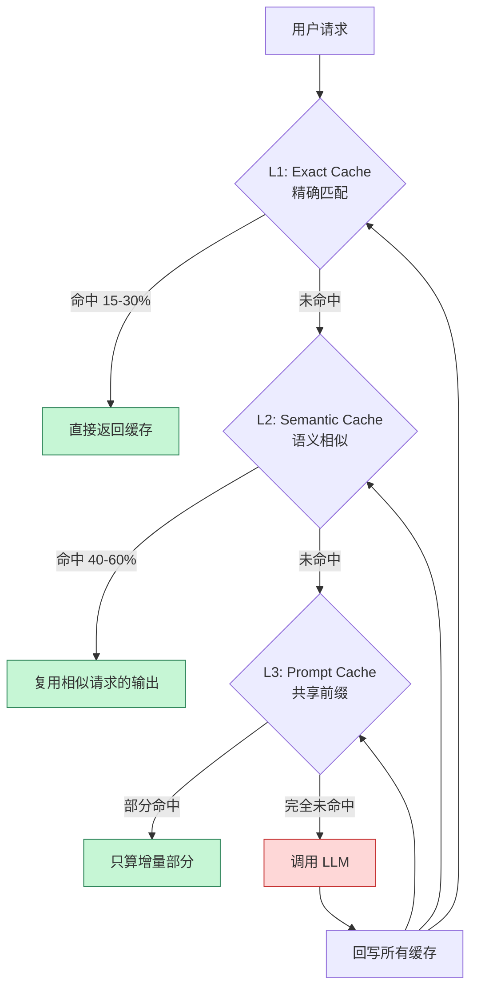
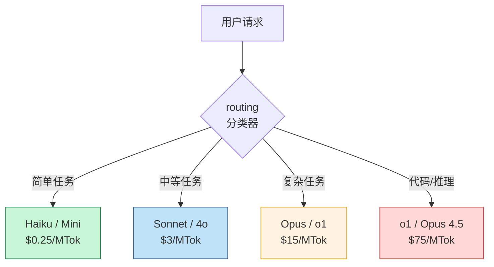

> 一个中等规模的 AI Agent 产品，月调用百万次 token 计费是常态。Bugster 在 2025 年 8 月报告：通过 prompt caching 把 LLM 成本降低 **60 倍**，p95 延迟下降 20%，质量纹丝不动。这不是营销话术——是任何团队都能复现的工程优化。

LLM 调用成本是 AI 产品商业化的生死线。一个看似不贵的单次调用（几分钱），乘以百万级用户量，每月账单能轻松冲到六位数。

这篇文章不讲"为什么要优化成本"（地球人都知道），讲**具体怎么优化**：

- 三层缓存架构：exact / semantic / prompt cache
- Prompt 结构怎么排才能让 cache 命中
- 模型分级路由：什么任务用什么模型
- 实战案例：60x 成本降低是怎么做到的

<!--more-->

## 一、三层缓存架构

LLM 调用成本优化的**第一性原理**是：**减少不必要的计算**。同样的输入，不要让模型算两次。



### 1.1 L1: Exact Match Cache（精确匹配）

最简单：请求的 prompt 完全一致时直接返回历史结果。

```python
import hashlib
import redis

class ExactCache:
    def __init__(self):
        self.redis = redis.Redis()
    
    def get(self, prompt: str, model: str) -> str | None:
        key = self._key(prompt, model)
        return self.redis.get(key)
    
    def set(self, prompt: str, model: str, response: str):
        key = self._key(prompt, model)
        self.redis.setex(key, 3600, response)  # 1 小时 TTL
    
    def _key(self, prompt: str, model: str) -> str:
        h = hashlib.sha256(f"{model}:{prompt}".encode()).hexdigest()
        return f"exact:{h}"
```

**命中率**：15-30%。对高频重复查询（比如 FAQ）非常有效。**坑**：prompt 里多一个空格就 miss——对 prompt 模板的任何改动都会让缓存失效。

### 1.2 L2: Semantic Cache（语义缓存）

对 prompt 做 embedding，**语义相似但表述不同**的请求也命中。

```python
import numpy as np

class SemanticCache:
    def __init__(self, threshold: float = 0.92):
        self.entries = []  # [(embedding, prompt, response)]
        self.threshold = threshold
        self.embedder = load_embedder("text-embedding-3-small")
    
    def get(self, prompt: str, model: str) -> str | None:
        query_emb = self.embedder.encode(prompt)
        
        best_score = 0
        best_response = None
        for emb, stored_prompt, response in self.entries:
            if stored_prompt.split(":")[0] != model:
                continue
            sim = np.dot(query_emb, emb)
            if sim > best_score:
                best_score = sim
                best_response = response
        
        if best_score >= self.threshold:
            return best_response
        return None
    
    def set(self, prompt: str, model: str, response: str):
        emb = self.embedder.encode(prompt)
        self.entries.append((emb, f"{model}:{prompt}", response))
```

**命中率**：40-60%。Zylos 2025 年的研究显示，**31% 的企业 LLM 查询在语义层面是重复的**——这个数字远超直觉。

**坑**：threshold 设太高 → 命中率低；设太低 → 答案不准。0.92-0.95 是常见起点，但需要 A/B 测试调。

### 1.3 L3: Prompt Cache（厂商前缀缓存）

这是 2024 年后最大的成本优化武器。**原理**：LLM 推理时，前缀 token 的 KV cache 可以复用。下次同样的前缀进来，**不用重新计算**。

| 厂商 | 折扣 | 模式 | 最小前缀 | TTL |
|------|------|------|---------|-----|
| **Anthropic Claude** | 写入 1.25x，**读取 0.1x（90% 折扣）** | 显式 `cache_control` | 1024 tokens | 5 分钟 / 1 小时 |
| **OpenAI** | 50%（自动）/ **最高 90%（叠加 batch）** | **自动**（≥1024 tokens） | 1024 tokens | 5-10 分钟 |
| **Google Gemini** | 75-95% | 隐式 + 显式 | 2048 tokens | 15 分钟 / 1 小时 |
| **AWS Bedrock** | 90% | 自动（≥1024 tokens 块） | 1024 tokens | GA 2025 年 4 月 |

**Anthropic 是这个领域最激进的**——读取价格只有正常的 1/10。Bugster 用 Claude 3.7 Sonnet 报告：

| 指标 | 优化前 | 优化后 | 变化 |
|------|-------|-------|------|
| 单次测试成本 | $X | $X/60 | **-98.3%** |
| p95 延迟 | 100% | 80% | -20% |
| 任务完成率 (TCR) | 80.1% | 80.5% | +0.4% |

质量几乎不变，**成本降低 60 倍**——这是工程上的"既要又要"。

## 二、Prompt 结构：cache 命中的关键

Prompt cache 命中率的**最大杀手**是结构不对。最常见的错误：

```python
# ❌ 错的：动态内容在前面
messages = [
    {"role": "user", "content": f"今天日期：{date}\n用户消息：{user_input}"},
    {"role": "system", "content": "你是..."}  # 1000 token 的 system prompt
]

# 计算顺序：user message 先，system prompt 后
# 系统 prompt 不在 cache 前缀里 → 每次都重算
```

正确的顺序：

```python
# ✅ 对的：稳定内容在前面，动态内容在后面
messages = [
    {"role": "system", "content": "你是..."},  # 1000+ token，不变
    {"role": "user", "content": f"[用户消息]\n{user_input}\n[今天的日期]\n{date}"}
]

# 系统 prompt 在前，每次进来都是相同的 1024+ token
# 厂商自动 cache → 命中 → 只算增量部分
```

**经验法则**：

```
[稳定的 system prompt] → [工具定义] → [长文档/RAG context] → [用户消息 + 动态数据]
   ↑ 必 cache            ↑ 必 cache    ↑ 经常 cache           ↑ 不 cache
```

### 2.1 实测案例：LightRAG 把 cache 命中率从 0% 提升到 100%

HKUDS/LightRAG 的一个真实 GitHub issue 报告：原本的 entity extraction prompt 把 `{input_text}` 放在 system prompt 里，结果每次 prompt 都不同，**cache 命中率 0%**。

```python
# ❌ 之前：input_text 在 system prompt
system_prompt = f"""从以下文本提取实体：
{input_text}
返回 JSON 格式。"""

# ✅ 之后：input_text 移到 user message
system_prompt = """从给定文本提取实体，返回 JSON 格式。"""
user_message = input_text
```

改完后：**100% cache 命中，每次复用 ~1450 token 的缓存前缀，成本降低 45%**。

### 2.2 Anthropic 显式控制

Anthropic 是显式 cache control，要在 system prompt 上加 `cache_control` 标记：

```python
import anthropic

client = anthropic.Anthropic()

response = client.messages.create(
    model="claude-sonnet-4-5",
    max_tokens=1024,
    system=[
        {
            "type": "text",
            "text": "你是客服助手..."
        },
        {
            "type": "text",
            "text": "[长文档内容...]",  # 经常变化的 RAG 检索结果
            "cache_control": {"type": "ephemeral"}  # 标记为 cache
        }
    ],
    messages=[{"role": "user", "content": user_input}]
)

# 看返回的 usage
print(response.usage)
# {
#   "input_tokens": 1500,
#   "cache_creation_input_tokens": 3000,  # 这次新建 cache
#   "cache_read_input_tokens": 0          # 第一次没命中
# }
# 第二次同样请求：
# {
#   "cache_read_input_tokens": 3000       # 命中！3000 token 只算 0.1x
# }
```

**最多 4 个 cache breakpoint**——可以分段控制哪部分 cache、哪部分不算。

### 2.3 OpenAI 自动 cache

OpenAI 是自动的，只要 prefix ≥ 1024 token 且 5 分钟内有相同前缀就命中。但**坑**：

```python
# 同样的 messages，每次调用都必须完全相同才能命中
messages_v1 = [
    {"role": "system", "content": "你是..."},
    {"role": "user", "content": "问题 1"}
]

messages_v2 = [
    {"role": "system", "content": "你是..."},
    {"role": "user", "content": "问题 2"}  # 不同 user message → 前缀匹配失败
]
```

OpenAI 只对**前缀完全一致**的请求 cache。中间任何一个 token 变了就 miss——所以"动态内容一定放最后"这条规则，对 OpenAI 更严格。

## 三、模型分级路由

不是所有任务都需要 GPT-5 / Claude Opus。一个关键洞察：**任务难度差异巨大，但模型价格差异更大**。



### 3.1 分类器实现

```python
class ModelRouter:
    def __init__(self):
        # 简单任务分类器（可以用小模型或规则）
        self.classifier = "gpt-4o-mini"  # 用便宜模型分类
    
    def route(self, query: str, task_type: str) -> str:
        # 规则匹配：明显的简单任务
        if self._is_obvious_simple(query):
            return "claude-haiku-4"
        
        # 复杂任务标记
        if "code" in task_type or "reasoning" in task_type:
            return "claude-opus-4-5"
        
        # 让小模型判断
        classification = self._classify(query)
        
        if classification == "simple":
            return "claude-haiku-4"
        elif classification == "medium":
            return "claude-sonnet-4-5"
        else:
            return "claude-opus-4-5"
    
    def _is_obvious_simple(self, query: str) -> bool:
        # 短问题、明显 FAQ
        return len(query) < 50 and not any(kw in query for kw in ["为什么", "怎么", "分析"])
    
    def _classify(self, query: str) -> str:
        response = openai.ChatCompletion.create(
            model=self.classifier,
            messages=[{
                "role": "user",
                "content": f"判断以下问题的复杂度（回复 'simple' / 'medium' / 'complex'）：\n\n{query}"
            }],
            max_tokens=5
        )
        return response.choices[0].message.content.strip()
```

### 3.2 Cascade 模式

更激进的优化：**先用便宜模型试，不行再升级**。

```python
def cascade_complete(prompt: str) -> str:
    # 第一关：Haiku
    response = call_llm("claude-haiku-4", prompt)
    
    # 检查响应质量
    if is_confident(response):
        return response
    
    # 第二关：Sonnet
    response = call_llm("claude-sonnet-4-5", prompt)
    
    if is_confident(response):
        return response
    
    # 第三关：Opus
    return call_llm("claude-opus-4-5", prompt)


def is_confident(response: str) -> bool:
    """用 logprobs 或特定标记判断模型是否自信"""
    # 方法 1：检查 response 里的不确定性词汇
    uncertain = ["我不知道", "可能", "也许", "不太确定"]
    return not any(u in response for u in uncertain)
```

**实测数据**：60-70% 的请求可以用 Haiku 完成，整体成本下降 50%+。

## 四、Batching 与 Concurrency

LLM 推理有两个独立的优化维度：**单次成本** 和 **吞吐量**。

### 4.1 Batch API

Anthropic 和 OpenAI 都提供 **batch API**：批量提交请求，**24 小时内返回**，价格折扣 50%。

```python
# Anthropic Batch API
from anthropic import Anthropic

client = anthropic.Anthropic()

batch = client.messages.batches.create(
    requests=[
        {"custom_id": "req-1", "params": {"model": "claude-sonnet-4-5", "messages": [...]}},
        {"custom_id": "req-2", "params": {"model": "claude-sonnet-4-5", "messages": [...]}},
        # ... 最多 10,000 个请求
    ]
)

# 等结果
result = client.messages.batches.retrieve(batch.id)
```

**适用场景**：离线任务（数据处理、批量翻译、夜间报告生成）。
**不适用**：实时交互（用户等不及）。

### 4.2 vLLM Prefix Caching：自托管的另一种思路

如果用量大到值得自托管 GPU，**vLLM 的 prefix caching** 是一个免费的高 ROI 优化：

```python
# vLLM 默认开启 prefix caching
# 报告数据：14-24x 吞吐量提升

from vllm import LLM, SamplingParams

llm = LLM(
    model="meta-llama/Llama-3.1-8B-Instruct",
    enable_prefix_caching=True,  # 默认 true
)
```

**机制**：vLLM 把 KV cache 存到 radix tree（基数树），相同 prefix 的请求直接复用。论文报告 **87% cache 命中率**。

### 4.3 并行的陷阱

有个**反直觉的坑**：并行调用会破坏 cache 命中率。

```python
# ❌ 错误做法：fan-out 并行
results = await asyncio.gather(*[
    call_llm(prompt_template.format(input=i))
    for i in inputs
])
# cache 命中率可能降到 4%！

# ✅ 正确做法：串行 + 暖 cache
for i in inputs:
    result = await call_llm(prompt_template.format(input=i))
    # 第一次没命中，第二次开始命中
```

为什么？第一次并行请求同时到达，cache 还是空的，大家都 miss；然后各自回写 cache，浪费了一次机会。**串行执行让 cache 预热**，后续请求能命中。

## 五、其他省钱手段

### 5.1 流式输出

`stream=True` 让用户**更快看到第一 token**（TTFT），但**不降低 token 总成本**。它优化的是感知延迟，不是账单。

### 5.2 控制输出长度

```python
# max_tokens 不是越高越好
response = client.chat.completions.create(
    model="gpt-4o",
    max_tokens=200,  # 不要默认 4096
    messages=[...]
)

# 配合 prompt 引导
prompt = "用 100 字以内回答：..."  # 明确要求短
```

### 5.3 Token 预算硬上限

Agent 类任务最大的成本黑洞：**循环里 token 无限累积**。必须加硬上限：

```python
class TokenBudget:
    def __init__(self, max_tokens: int):
        self.max = max_tokens
        self.used = 0
    
    def can_spend(self, tokens: int) -> bool:
        return self.used + tokens <= self.max
    
    def spend(self, tokens: int):
        self.used += tokens
        if self.used > self.max:
            raise BudgetExceeded(self.used, self.max)

# 在 Agent 主循环里
budget = TokenBudget(max_tokens=50_000)
while not done:
    if not budget.can_spend(estimated_tokens):
        raise BudgetExceeded(...)
    response = llm.complete(...)
    budget.spend(response.usage.total_tokens)
```

## 六、上线 checklist

把成本优化落到代码里：

- [ ] **L1 exact cache** 对 FAQ 类高频请求启用，TTL 1 小时
- [ ] **L2 semantic cache** threshold 0.92-0.95，A/B 测试调
- [ ] **L3 prompt cache** 稳定内容放前缀，动态放末尾
- [ ] **Model routing** 简单任务用 Haiku/Mini，复杂任务才升级
- [ ] **Cascade** 模式：便宜模型先试，不行再升级
- [ ] **Batch API** 处理离线任务，50% 折扣
- [ ] **Token budget** 防止 Agent 循环烧钱
- [ ] **监控** cache_read_input_tokens / cached_tokens 占比
- [ ] **并行场景**先暖 cache 再 fan-out

## 七、成本监控的 dashboard

没有监控就没有优化。最小化指标：

```python
cost_metrics = {
    # 绝对成本
    "daily_cost_usd": 0,
    "cost_per_request": 0,
    "cost_per_user": 0,
    
    # Cache 效率
    "exact_cache_hit_rate": 0.0,
    "semantic_cache_hit_rate": 0.0,
    "prompt_cache_hit_rate": 0.0,
    
    # 模型分布
    "model_request_distribution": {"haiku": 0, "sonnet": 0, "opus": 0},
    
    # 异常信号
    "single_request_max_cost": 0,  # 防失控
}
```

把这些指标接到 Grafana，设告警：
- 单日成本 > 阈值 → 告警
- cache 命中率突然下降 → 告警（可能 prompt 改了）
- 单请求成本 > $1 → 立刻熔断

## 八、一点建议

LLM 成本优化不是"省着用"，是**用对地方**。

- 一个查询如果重复 1000 次，一定要 cache
- 一个任务如果 Haiku 能完成 70%，就别用 Opus
- 一个 Agent 如果会循环，必须有 token budget

2025 年的 LLM 成本已经比 2023 年低了一个数量级（GPT-4 比 GPT-3.5 便宜、Claude Haiku 比 Sonnet 便宜 10x），但**用户的用量增长更快**。优化永远不会结束，只是边际收益变小。

工程师能做的，是**把每一分成本都花在真正需要强模型的地方**——其余的，让 cache 和小模型解决。

---

**参考资料：**
- [Bugster: Prompt Caching - 60x Cost Reduction](https://newsletter.bugster.dev/p/prompt-caching-how-we-reduced-llm)
- [TianPan.co: Prompt Caching Cuts LLM Costs by 90%](https://tianpan.co/blog/2025/10/13/prompt-caching-cut-llm-costs)
- [Zylos: LLM Caching Strategies 2025](https://zylos.ai/en/research/llm-caching-strategies-2025)
- [HashLytics: Prompt Caching Provider Comparison](https://hashlytics.io/prompt-caching-how-to-cut-llm-costs-by-90-and-slash-latency)
- [DigitalOcean: Prompt Caching Explained](https://digitalocean.com/community/tutorials/prompt-caching-explained)
- [OpenAI: Prompt Caching Guide](https://platform.openai.com/docs/guides/prompt-caching)
- [Anthropic: Prompt Caching Documentation](https://docs.anthropic.com/en/docs/build-with-claude/prompt-caching)
- [Sean Kim: Anthropic Claude API Cost Reduction Strategies Oct 2025](https://blog.imseankim.com/anthropic-claude-api-batch-processing-prompt-caching-cost-reduction-october-2025)
- [BCloud Consulting: 73% Cost Reduction Guide](https://bcloud.consulting/en/blog/llm-inferencia-costes-73-reduccion-semantic-caching-2025)
- [LightRAG GitHub Issue: 45% Cost Reduction via Prompt Restructure](https://github.com/HKUDS/LightRAG/issues/2355)