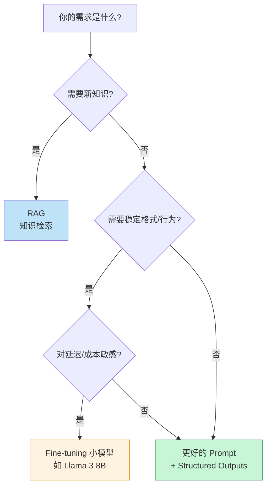
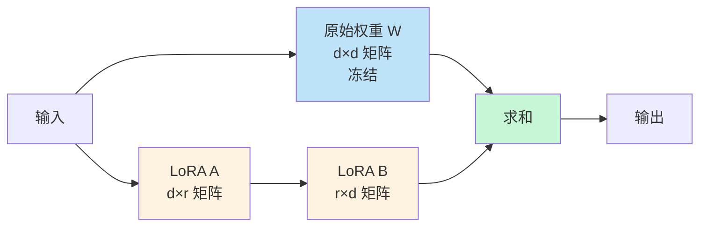
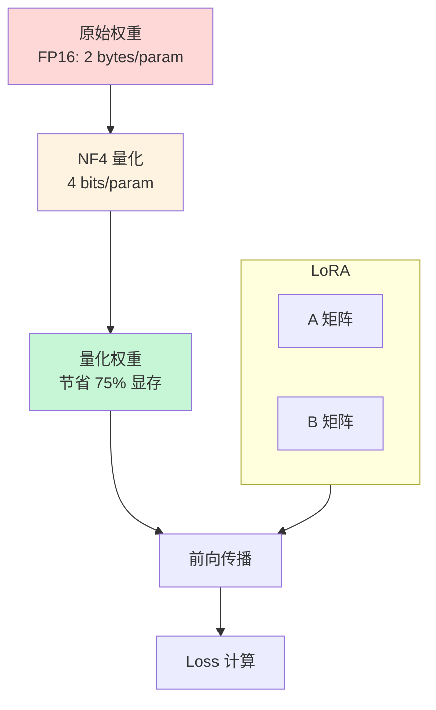

> Fine-tuning 是 LLM 应用的分水岭——但 90% 的场景其实**不应该 fine-tune**。这篇文章讲清楚：什么时候 fine-tune、什么时候用 RAG、什么时候用 prompt，以及 fine-tune 时**LoRA / QLoRA 的工程要点**（2025 年最新）。

很多团队的 LLM 上线流程是：**先 fine-tune 一个"专属模型"**。但 2025 年的共识已经变了：

> 微调 ≠ 提升能力。微调 = **对齐行为到特定场景**。

GPT-4 不会因为你 fine-tune 变聪明，但会变得更"听话"——更稳定地按你的格式输出、更贴合你的语气、更准确地调用你的工具。**这不是能力问题，是行为问题**。

这篇文章分两部分：

1. **决策框架**：什么时候 fine-tune，什么时候用其他方法
2. **工程实践**：LoRA / QLoRA 怎么调、怎么部署

<!--more-->

## 一、Fine-tuning 的真正价值

先澄清一个误解：fine-tuning **不能**让模型：

- ❌ 学会新知识（"我们公司 2025 年发布的政策是..."）
- ❌ 提升推理能力（"让它更会做数学"）
- ❌ 解决幻觉问题（甚至可能加重）

fine-tuning **能**让模型：

- ✅ **稳定按格式输出**（JSON Schema、特定语气）
- ✅ **学会特定模式**（你的工具调用方式、prompt 模板）
- ✅ **降低 latency / cost**（小模型微调后达到大模型水平）
- ✅ **对齐特殊风格**（法律文书、医学诊断口吻）

## 二、决策框架：四象限选择



**经典例子**：

| 场景 | 正确方案 |
|------|---------|
| 让 AI 知道公司最新政策 | **RAG**（不是 fine-tune） |
| 让 AI 稳定输出特定 JSON | **Structured Outputs**（不需 fine-tune） |
| 让 AI 用 8B 模型达到 70B 的特定任务质量 | **Fine-tune** 8B |
| 让 AI 按特定语气写医学诊断 | **Fine-tune** 或 few-shot prompt |
| 让 AI 学会公司内部 DSL | **Fine-tune** + 大量样本 |

## 三、LoRA 原理：为什么高效

Fine-tune 一个 70B 模型，传统方式需要 7x70B 的参数量（每参数 7 个：模型参数 + Adam optimizer state + gradient + ...），也就是 **490 GB 显存**——普通团队根本玩不起。

LoRA（Low-Rank Adaptation）的核心洞察：**模型权重的更新是低秩的**。



数学：

```
输出 = W·x + ΔW·x = W·x + B·A·x
其中 W 是冻结的原始权重
A 和 B 是新增的可训练低秩矩阵
r 是秩（通常 8-64）
```

**参数量对比**：

| 模型 | 原始参数量 | LoRA 参数量 (r=16) | 节省 |
|------|-----------|-------------------|------|
| Llama 3 8B | 8B | ~4M | **99.95%** |
| Llama 3 70B | 70B | ~32M | **99.95%** |

冻结大部分原始权重，只训练 1% 的参数——这就是 LoRA 的"魔法"。

## 四、QLoRA：单 GPU 微调 70B 模型

QLoRA 在 LoRA 基础上加了 **4-bit 量化**：



**QLoRA 的关键创新**：

1. **NF4 (4-bit NormalFloat)** ——专门为正态分布权重设计的 4-bit 量化格式
2. **Double Quantization** ——对量化常数再做一次量化
3. **Paged Optimizers** ——用 NVIDIA unified memory 自动换页到 CPU

**结果**：70B 模型在 **单张 24GB 显存 GPU**（如 RTX 4090）上就能 fine-tune——这是 2025 年消费级硬件玩大模型的关键。

## 五、工程实践：从数据到部署

### 5.1 数据准备

**质量 > 数量**——几千条精心准备的样本胜过百万条脏数据。

```python
# 数据格式（OpenAI / HuggingFace 标准）
training_data = [
    {
        "messages": [
            {"role": "system", "content": "你是客服助手，按 JSON 格式回复"},
            {"role": "user", "content": "我要退款"},
            {"role": "assistant", "content": '{"action": "refund_request", "needs_clarification": true, "questions": ["请提供订单号"]}'}
        ]
    },
    # ... 至少 1000-5000 条
]

# 数据质量检查
def quality_check(data):
    issues = []
    for i, sample in enumerate(data):
        # 1. 格式校验
        if not validate_format(sample):
            issues.append(f"Sample {i}: invalid format")
        # 2. 长度检查
        if len(json.dumps(sample)) > 8000:
            issues.append(f"Sample {i}: too long")
        # 3. 多样性检查
        if i > 0 and similarity(sample, data[i-1]) > 0.95:
            issues.append(f"Sample {i}: too similar to previous")
    return issues
```

### 5.2 LoRA 超参数

```python
from peft import LoraConfig

lora_config = LoraConfig(
    # 核心超参
    r=16,                    # 秩：8/16/32/64，越大越能拟合复杂任务
    lora_alpha=32,           # 通常 2*r
    lora_dropout=0.05,       # 防止过拟合
    bias="none",             # 不训练 bias
    
    # 目标模块（按模型架构）
    target_modules=[
        "q_proj", "k_proj", "v_proj", "o_proj",     # attention
        "gate_proj", "up_proj", "down_proj"          # MLP
    ],
    
    # 任务类型
    task_type="CAUSAL_LM"
)
```

**超参选择经验**：

| 任务复杂度 | r | lora_alpha | 训练样本 |
|-----------|---|------------|---------|
| 简单格式对齐 | 8 | 16 | 500-1000 |
| 中等任务 | 16-32 | 32-64 | 1000-5000 |
| 复杂推理/风格 | 64-128 | 128-256 | 5000-50000 |

### 5.3 QLoRA 配置

```python
from transformers import BitsAndBytesConfig

bnb_config = BitsAndBytesConfig(
    load_in_4bit=True,
    bnb_4bit_quant_type="nf4",           # NF4 量化
    bnb_4bit_compute_dtype=torch.bfloat16,
    bnb_4bit_use_double_quant=True,      # Double Quantization
    bnb_4bit_quant_storage="nf4",        # 优化器状态分页
)

# 训练参数
from transformers import TrainingArguments

training_args = TrainingArguments(
    output_dir="./output",
    
    # 学习率
    learning_rate=2e-4,                  # QLoRA 标准
    lr_scheduler_type="cosine",
    warmup_ratio=0.03,
    
    # 训练轮数
    num_train_epochs=3,
    per_device_train_batch_size=4,
    gradient_accumulation_steps=4,       # effective batch size = 16
    
    # 优化
    optim="paged_adamw_8bit",            # 8-bit 优化器
    
    # 监控
    logging_steps=10,
    save_steps=500,
    eval_steps=100,
    
    # 防止过拟合
    load_best_model_at_end=True,
    metric_for_best_model="eval_loss",
)
```

### 5.4 完整训练代码

```python
from peft import LoraConfig, get_peft_model, prepare_model_for_kbit_training
from trl import SFTTrainer
from transformers import AutoModelForCausalLM, AutoTokenizer, BitsAndBytesConfig

# 加载模型（4-bit 量化）
model = AutoModelForCausalLM.from_pretrained(
    "meta-llama/Llama-3.1-8B-Instruct",
    quantization_config=bnb_config,
    device_map="auto",
)

# 准备 k-bit 训练
model = prepare_model_for_kbit_training(model)

# LoRA 配置
lora_config = LoraConfig(r=16, lora_alpha=32, target_modules="all-linear", lora_dropout=0.05, bias="none", task_type="CAUSAL_LM")

model = get_peft_model(model, lora_config)
model.print_trainable_parameters()
# trainable params: 4,194,304 || all params: 8,030,261,248 || trainable%: 0.052%

# 训练
trainer = SFTTrainer(
    model=model,
    args=training_args,
    train_dataset=train_dataset,
    eval_dataset=eval_dataset,
    peft_config=lora_config,
    max_seq_length=2048,
)

trainer.train()
trainer.save_model("./final-adapter")
```

## 六、训练后的部署

LoRA 训练产出的**只是 adapter 权重**（几个 MB），原始模型还在原处。部署有两种方式。

### 6.1 合并权重（推荐）

把 LoRA 权重合并回原始模型，部署一个**完整模型**——延迟和显存和原模型一样。

```python
from peft import PeftModel

base = AutoModelForCausalLM.from_pretrained("meta-llama/Llama-3.1-8B-Instruct")
peft_model = PeftModel.from_pretrained(base, "./final-adapter")
merged = peft_model.merge_and_unload()
merged.save_pretrained("./merged-model")
```

### 6.2 动态加载（多 adapter）

一个基础模型 + 多个 LoRA adapter，按需切换：

```python
# vLLM 支持多 LoRA
from vllm import LLM, SamplingParams
from vllm.lora.request import LoRARequest

llm = LLM(model="meta-llama/Llama-3.1-8B-Instruct", enable_lora=True)

# 不同任务加载不同 adapter
outputs = llm.generate(
    prompts,
    SamplingParams(temperature=0.7),
    lora_request=LoRARequest("customer_service", 1, "./cs-adapter")
)
outputs2 = llm.generate(
    prompts,
    SamplingParams(temperature=0.7),
    lora_request=LoRARequest("code_review", 2, "./code-adapter")
)
```

适合多场景共享基础模型的场景。

## 七、评估 Fine-tune 效果

**fine-tune 完一定要评估**——很多团队 fine-tune 完就直接上线，结果质量反而下降。

### 7.1 评估指标

```python
fine_tune_metrics = {
    # 1. 任务指标
    "exact_match_rate": "输出与标准答案完全一致的比例",
    "format_compliance_rate": "符合格式要求（JSON / 结构）的比例",
    
    # 2. 质量指标（LLM-as-Judge）
    "style_adherence": "风格一致性",
    "task_accuracy": "任务准确率",
    
    # 3. 退化指标（重要！）
    "general_capability_regression": "通用能力是否下降",
    "幻觉率": "微调后是否引入幻觉"
}
```

### 7.2 防过拟合

```python
# 1. 训练时就监控 eval loss
if eval_loss > train_loss * 1.5:
    print("⚠️ 可能过拟合，考虑早停")

# 2. 用通用能力测试集测
general_test = load_dataset("mmlu")  # 或其他通用测试
regression_score = evaluate(model, general_test)
if regression_score < baseline - 0.05:
    print("⚠️ 通用能力下降超过 5%")
```

**真实案例**：某团队 fine-tune Llama-3 8B 后在 MMLU 上下降 12%——他们没有监控通用能力，结果生产环境用户反馈"AI 变笨了"。

### 7.3 何时该停

- Eval loss 不再下降
- 开始上升（过拟合信号）
- 训练轮数达到预设上限（通常 3-5 epoch）

## 八、Fine-tune vs 蒸馏 vs Prompt

三种"调模型"的方法，定位不同：

| 方法 | 适用 | 成本 |
|------|------|------|
| **Prompt Engineering** | 一次性、格式对齐 | 极低（改文本） |
| **Fine-tuning (LoRA)** | 行为对齐、特定风格 | 中（几小时 GPU） |
| **Distillation** | 让小模型达到大模型质量 | 高（大量数据 + GPU） |

**蒸馏**（Distillation）值得专门讲：

```python
# 用大模型（teacher）的输出训练小模型（student）
teacher = "gpt-4o"
student = "Llama-3.1-8B"

# 1. 大模型生成大量样本
training_data = []
for question in questions_pool:
    response = call_gpt4(question)  # teacher
    training_data.append({"input": question, "output": response})

# 2. 小模型 fine-tune
train(student, training_data)  # student
```

蒸馏后的小模型可以达到大模型 **85-95% 的质量**，但推理成本只有 1/10。

**何时用蒸馏**：
- 高 QPS 场景
- 单调用成本敏感
- 可以承受一次性训练成本

## 九、上线 checklist

把 fine-tuning 落到代码里：

- [ ] **先评估是否需要 fine-tune**——80% 的场景 prompt + RAG 够用
- [ ] **数据质量 > 数量**——至少 1000 条高质量样本
- [ ] **LoRA 起步**——r=16, alpha=32
- [ ] **QLoRA 跑 70B**——单 24GB GPU 即可
- [ ] **训练时监控 eval loss**——过拟合立刻停
- [ ] **保留通用能力测试**——防微调退化
- [ ] **合并权重部署**——延迟和原模型一样
- [ ] **A/B 测试上线**——fine-tune 版本 vs base prompt 版本
- [ ] **监控线上指标**——确认没回归

## 十、一点反思

Fine-tune 是 AI 工程化里**最被过度使用**的工具。

> "我们 fine-tune 一个专属模型"听起来很高级，但 90% 的团队其实只需要**更好的 prompt + 合适的 RAG**。

Fine-tune 的真正价值在**两个边界**：

1. **极致成本敏感**：必须用 8B 模型达到 70B 质量
2. **极致延迟要求**：每个 token 都数着花

如果不在这两个边界，**先用 prompt + RAG**。Fine-tune 应该是**最后一步优化**，不是第一步。

2025 年的工程共识：**80% RAG + 15% Prompt + 5% Fine-tune**。

---

**参考资料：**
- [PEFT: Parameter-Efficient Fine-Tuning Library](https://github.com/huggingface/peft)
- [QLoRA Paper (Dettmers et al., 2023)](https://arxiv.org/abs/2305.14314)
- [LoRA Paper (Hu et al., 2021)](https://arxiv.org/abs/2106.09685)
- [TRL: Transformer Reinforcement Learning](https://github.com/huggingface/trl)
- [bitsandbytes: 4-bit Quantization](https://github.com/TimDettmers/bitsandbytes)
- [Hugging Face PEFT Documentation](https://huggingface.co/docs/peft)
- [Anthropic: Building Effective Agents (RAG vs Fine-tuning discussion)](https://www.anthropic.com/research/building-effective-agents)
- [NEFTune: Adding Noise to Embeddings](https://arxiv.org/abs/2310.05914)
- [DoRA: Weight-Decomposed Low-Rank Adaptation](https://arxiv.org/abs/2402.09353)
- [vLLM LoRA Support](https://docs.vllm.ai/en/latest/features/lora.html)