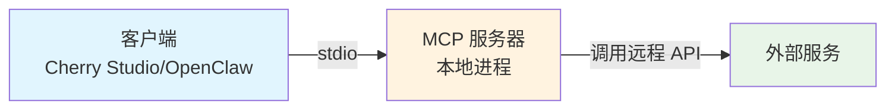
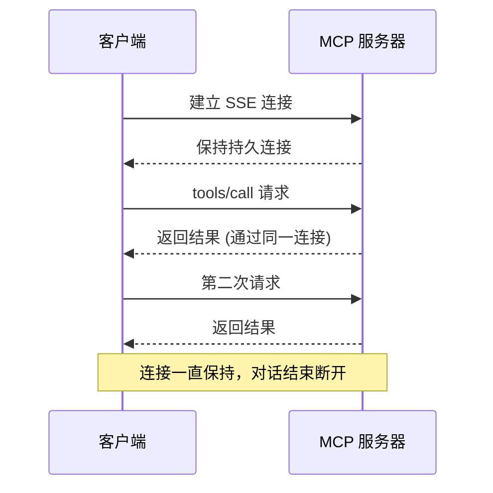
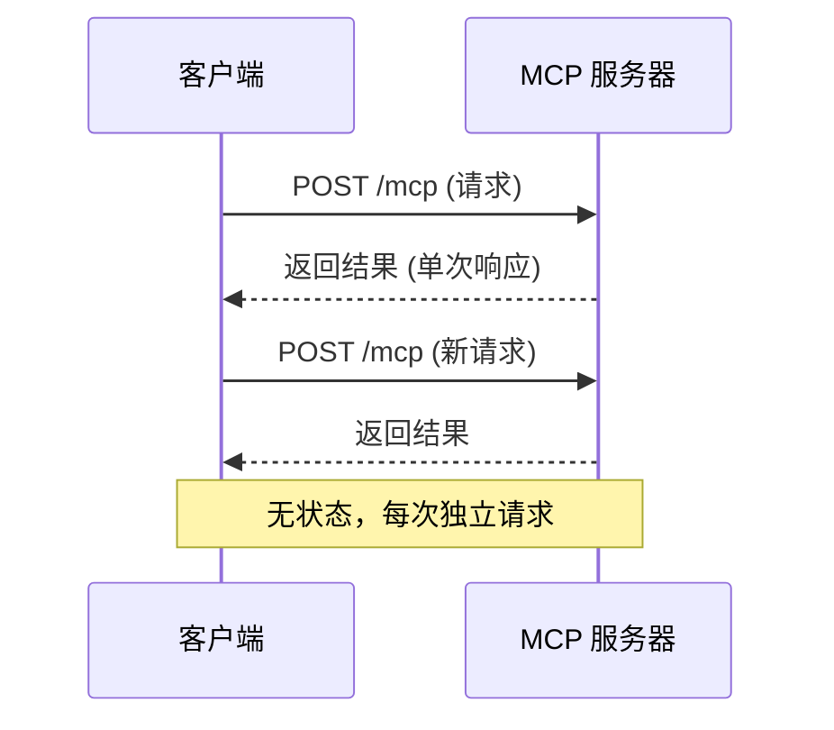
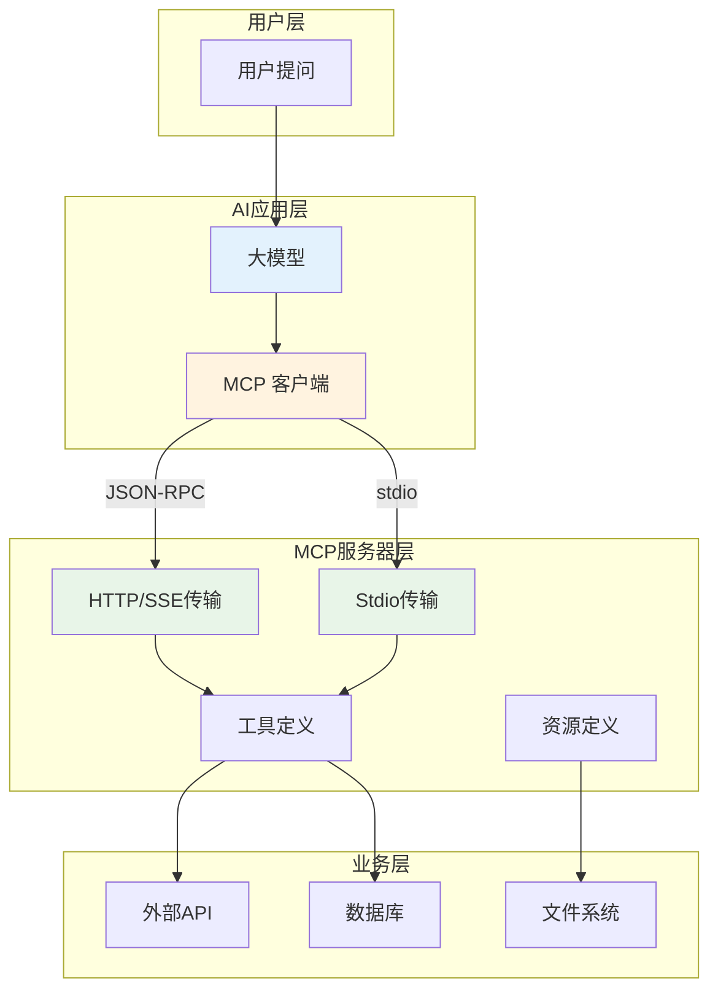

# MCP 完全指南：从协议原理到 Go 服务开发实战

> MCP（Model Context Protocol）是 AI 时代的重要协议，本文详细介绍其原理、传输方式差异、以及如何用 Go 开发 MCP 服务。

## 什么是 MCP？

MCP（Model Context Protocol，模型上下文协议）是一个**标准化协议**，旨在增强大语言模型（LLM）与外部应用之间的交互。

### 核心定位

```
┌─────────────────────────────────────────────────────────────┐
│                        用户                                  │
│                     提问 / 需求                               │
└─────────────────────────┬───────────────────────────────────┘
                          │
                          ▼
┌─────────────────────────────────────────────────────────────┐
│                    大模型 (LLM)                               │
│  • 理解用户意图                                              │
│  • 决定何时调用工具                                          │
│  • 解析工具返回结果                                          │
└─────────────────────────┬───────────────────────────────────┘
                          │
                    MCP 协议通信
                          │
          ┌───────────────┼───────────────┐
          ▼               ▼               ▼
   ┌─────────────┐  ┌─────────────┐  ┌─────────────┐
   │   客户端     │  │  MCP 客户端  │  │  MCP 客户端 │
   │ (Claude/    │  │ (OpenClaw/  │  │ (Cherry     │
   │  OpenClaw)  │  │  mcporter)  │  │  Studio)    │
   └──────┬──────┘  └──────┬──────┘  └──────┬──────┘
          │                │                │
          └────────────────┼────────────────┘
                           ▼
┌─────────────────────────────────────────────────────────────┐
│                    MCP 服务器                                 │
│  • 定义工具 (tools)                                         │
│  • 定义资源 (resources)                                     │
│  • 提供提示 (prompts)                                       │
└─────────────────────────────────────────────────────────────┘
```

### 技术特点

- **协议层**: JSON-RPC 2.0
- **架构**: 客户端-服务器模式
- **安全**: 零信任架构，所有操作需授权

---

## MCP 服务器的三种传输模式

MCP 服务器支持三种传输方式：**stdio**、**SSE**、**Streamable HTTP**。

### 1. Stdio 模式

**本地进程通信**，通过标准输入输出传递数据。



- **适用场景**: 本地开发的 MCP 服务
- **优点**: 配置简单，无需网络
- **缺点**: 不能跨网络部署

### 2. SSE 模式

**Server-Sent Events**，服务器推送模式。



- **适用场景**: 需要服务器推送的场景
- **优点**: 支持实时推送
- **缺点**: 需要维护持久连接

### 3. Streamable HTTP 模式

**官方推荐的现代传输方式**（2025年3月推出）。



- **适用场景**: 云部署、无服务器环境
- **优点**: 无状态、适合水平扩展、官方推荐
- **缺点**: 不支持服务器主动推送

### 三种模式对比

| 特性 | Stdio | SSE | Streamable HTTP |
|------|-------|-----|-----------------|
| 部署方式 | 本地 | 远程 | 远程 |
| 连接方式 | 进程通信 | 持久连接 | 无状态 |
| 官方推荐 | ✅ 本地开发 | ❌ 已废弃 | ✅ 推荐 |
| 云部署 | ❌ | ⚠️ | ✅ |
| 服务器推送 | ❌ | ✅ | ❌ |

---

## MCP 服务开发（Go 语言）

### 环境准备

```bash
# 创建项目
mkdir mcp-demo && cd mcp-demo
go mod init mcp-demo

# 安装 mcp-go 库
go get github.com/mark3labs/mcp-go@v0.45.0
```

### 完整代码示例

```go
package main

import (
	"context"
	"flag"
	"fmt"
	"log"
	"os"

	"github.com/mark3labs/mcp-go/mcp"
	"github.com/mark3labs/mcp-go/server"
)

func main() {
	transport := flag.String("t", "stdio", "传输模式: stdio, http")
	port := flag.Int("port", 8080, "HTTP 模式端口")
	flag.Parse()

	s := server.NewMCPServer(
		"go-demo-server",
		"1.0.0",
		server.WithResourceCapabilities(true, true),
		server.WithToolCapabilities(true),
		server.WithLogging(),
	)

	registerTools(s)

	if *transport == "http" {
		log.Printf("启动 HTTP 模式，端口 %d", *port)
		httpServer := server.NewStreamableHTTPServer(s)
		httpServer.Start(fmt.Sprintf(":%d", *port))
	} else {
		log.Println("启动 stdio 模式")
		server.ServeStdio(s)
	}
}

func registerTools(s *server.MCPServer) {
	// echo 工具
	s.AddTool(
		mcp.NewTool("echo",
			mcp.WithDescription("返回输入的文本"),
			mcp.WithString("text",
				mcp.Description("要回显的文本"),
				mcp.Required(),
			),
		),
		func(ctx context.Context, request mcp.CallToolRequest) (*mcp.CallToolResult, error) {
			args := request.GetArguments()
			text := args["text"].(string)
			return &mcp.CallToolResult{
				Content: []mcp.Content{
					mcp.NewTextContent(fmt.Sprintf("Echo: %s", text)),
				},
			}, nil
		},
	)

	// add 工具
	s.AddTool(
		mcp.NewTool("add",
			mcp.WithDescription("计算两个数的和"),
			mcp.WithNumber("a", mcp.Description("第一个数"), mcp.Required()),
			mcp.WithNumber("b", mcp.Description("第二个数"), mcp.Required()),
		),
		func(ctx context.Context, request mcp.CallToolRequest) (*mcp.CallToolResult, error) {
			args := request.GetArguments()
			a := args["a"].(float64)
			b := args["b"].(float64)
			return &mcp.CallToolResult{
				Content: []mcp.Content{
					mcp.NewTextContent(fmt.Sprintf("%d + %d = %d", int64(a), int64(b), int64(a+b))),
				},
			}, nil
		},
	)

	// get_weather 工具
	s.AddTool(
		mcp.NewTool("get_weather",
			mcp.WithDescription("获取指定城市的天气"),
			mcp.WithString("location",
				mcp.Description("城市名称"),
				mcp.Required(),
			),
		),
		func(ctx context.Context, request mcp.CallToolRequest) (*mcp.CallToolResult, error) {
			args := request.GetArguments()
			location := args["location"].(string)
			weather := map[string]string{
				"beijing":  "☀️ 晴天, 15°C",
				"shanghai": "🌧️ 小雨, 18°C",
				"shenzhen": "☀️ 晴天, 24°C",
			}
			desc := weather[location]
			if desc == "" {
				desc = "🌤️ 多云"
			}
			return &mcp.CallToolResult{
				Content: []mcp.Content{
					mcp.NewTextContent(fmt.Sprintf("%s: %s", location, desc)),
				},
			}, nil
		},
	)
}
```

### 运行方式

```bash
# 编译
go build -o mcp-server main.go

# stdio 模式 (本地)
./mcp-server

# HTTP 模式 (远程)
./mcp-server -t http -port 8080
```

---

## MCP 服务配置

### Cherry Studio 配置

#### stdio 模式
```
类型: stdio
命令: /path/to/mcp-server
```

#### HTTP 模式
```
类型: streamablehttp 或 SSE
URL: http://your-server:8080/mcp
```

### OpenClaw 配置

通过 mcporter 配置：

```bash
# 添加 MCP 服务
mcporter config add go-demo \
  --url "http://localhost:8080/mcp" \
  --type http

# 查看工具列表
mcporter list go-demo

# 调用工具
mcporter call "go-demo.add(a: 5, b: 3)"
```

配置文件位置：`/root/.openclaw/workspace/config/mcporter.json`

```json
{
  "mcpServers": {
    "go-demo": {
      "baseUrl": "http://localhost:8080/mcp"
    }
  }
}
```

---

## 整体架构流程



---

## 常见问题

### 1. 三种模式如何选择？

- **本地开发测试**: stdio
- **远程部署**: Streamable HTTP（官方推荐）
- **需要推送**: SSE（但官方已废弃）

### 2. mcporter 是什么？

mcporter 是 MCP 的命令行客户端工具，用于手动调用 MCP 服务进行测试。

### 3. MCP 客户端有哪些？

- **Cherry Studio**: 桌面应用
- **OpenClaw**: AI 助手
- **Claude Desktop**: 桌面应用
- **mcporter**: 命令行工具

---

## 参考资料

- [MCP 官方文档](https://modelcontextprotocol.io)
- [MCP 中文站](https://mcpcn.com)
- [mark3labs/mcp-go](https://github.com/mark3labs/mcp-go)

---

*本文首发于 [Tony老师的博客](https://blog.tanteng.space)，如需转载，请注明出处。*
