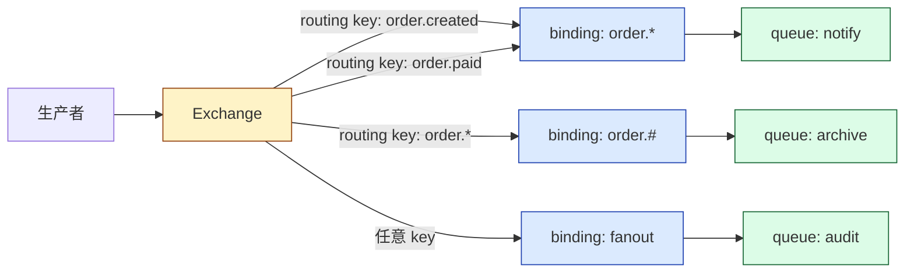
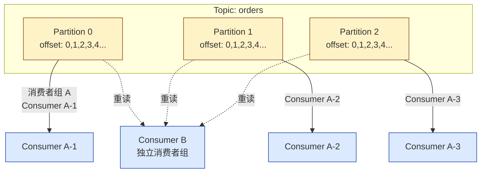
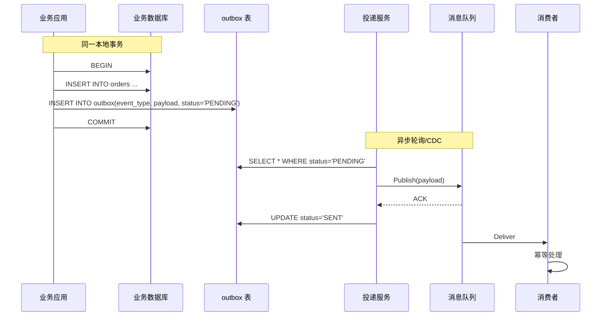

新团队第一次接入消息队列，几乎都会问同一个问题：Redis Stream、RabbitMQ、Kafka 选哪个？三种方案在 benchmark 文章里都能跑到几十万 QPS，单看吞吐根本分不出胜负。但真正上线之后踩到的坑——消息被消费了两次、消费者卡住之后整个队列堆积、镜像队列脑裂后丢消息——都跟性能数字毫无关系。

分歧的根源不是性能，而是三者对"一条消息属于谁、什么时候算处理完"这个问题的回答完全不同。性能只是表面，**语义模型**才是选型的核心。

<!--more-->

## 一、五个问题看穿一个 MQ

与其在功能清单上做加减法，不如用一组问题把任何一个消息队列切开来看。任何 MQ——不管叫 Redis Stream 还是 Pulsar——都能用这五个问题回答清楚：

1. **投递语义**：是 at-most-once、at-least-once 还是 exactly-once？是在哪一段成立？
2. **消息归属与顺序**：一条消息被谁消费？顺序在哪一层成立？
3. **消费进度存在哪**：客户端、服务端、还是中间件集群？
4. **堆积后会发生什么**：消息落盘了吗？存多久？会不会撑爆内存？
5. **失败消息去哪**：处理失败是回滚、重投，还是直接进入死信？

把这些问题对齐之后，再去查 benchmark 才有意义。下文就用这五个维度横向切三个产品。

## 二、投递语义到底在说什么

`at-most-once`（最多一次）最容易实现：消息发出去就当完事。SMTP 邮件、部分日志采集就是这种语义——丢一条无所谓。

`at-least-once`（至少一次）意味着消息绝不会丢，但**可能重复**：网络抖动让 ack 没到达服务端，服务端会再发一次。**工业界绝大多数 MQ 的默认语义都是 at-least-once**——Redis Stream、RabbitMQ、Kafka 在不做任何额外配置时都是这一档。

`exactly-once`（精确一次）是工程上最难做到的。**严格意义上的端到端 exactly-once 在分布式系统里不存在**：消息经过网络、落盘、被消费者读取、再写入下游数据库，每一步都可能失败。Kafka 0.11 引入事务，Kafka 2.3/2.4 进一步完善，其事务的覆盖范围是：

- **幂等生产者**（`enable.idempotence=true`）：通过 PID + Sequence Number 防止同一生产者重试导致的重复
- **事务**：把"读取 → 处理 → 写入"打包为一个原子单元。消费端需要设置 `isolation.level=read_committed`
- **覆盖范围**：Kafka 内部的 topic-to-topic、Kafka Streams 状态存储、consumer offset 一起提交

但**事务边界一旦跨出 Kafka，写数据库、调外部 API、发邮件，都不在原子保证内**。换句话说，Kafka 事务不解决"业务写入 MySQL 和发送消息同时成功"的问题。

幂等生产者的机制值得展开看一下：每个生产者实例启动时会被分配一个 **PID**（Producer ID），每条消息带一个从 0 开始递增的 **Sequence Number**。Broker 端为每个 `(PID, Partition)` 维护最近一次写入的 Sequence Number，若新消息的 Sequence Number 严格大于这个值则接受，否则丢弃。这样即使生产者在网络抖动时重试，也不会因为重发导致 Partition 里出现两条相同内容的消息——但这个保证只在**同一个生产者会话内**生效；生产者重启 PID 变了，幂等就失效。事务更进一步，把"读 consumer offset → 处理 → 写 Kafka → 提交 offset"打包为一个原子单元，写出去的中间结果对其他事务不可见。

实践中处理外部系统的标准做法是：**at-least-once + 消费端幂等**。换一种说法，"端到端 exactly-once"在通用场景下等价于"at-least-once + 幂等消费"——业务上需要的"只生效一次"由消费端用唯一键 + 去重表保证。

```sql
-- 消费幂等的最小实现：业务唯一键 + 唯一索引
CREATE TABLE order_processed (
    order_id VARCHAR(64) PRIMARY KEY,
    processed_at TIMESTAMP DEFAULT CURRENT_TIMESTAMP
);

-- 消费时
INSERT INTO order_processed (order_id) VALUES (?);
-- 重复消费会被主键约束直接拒绝，业务侧即可识别为已处理
```

幂等是后面"无论选谁都要做的事"，下文会再展开。

## 三、Redis Stream：把 Redis 当队列用

Redis 5.0（2018 年 10 月）引入 Stream，让 Redis 第一次有了"消息队列级别"的能力——之前的 `LPUSH` + `BRPOP` 是早期玩法，没有消费者组、没有 ack，靠客户端自己维护索引，丢消息后无法追查。

### 模型

- **Stream 是追加日志**：`XADD stream * field value` 写入一条消息，Stream 内部维护一个递增的 ID（形如 `1234-0`），消息不会被删除除非显式 `XDEL` 或 `XTRIM`
- **Consumer Group**：多个消费者组成一个组，组内每条消息只投递给一个消费者（类似 Kafka 的消费者组）
- **PEL（Pending Entries List）**：每个消费者各自维护一份"已投递但未确认"的消息清单；消费者调用 `XACK` 才会从 PEL 中清除
- **消费进度在服务端**：每个消费者组有一个 last-delivered-id，记录这个组已经派发到哪一条

```bash
# 创建消费组（从最新消息开始）
XGROUP CREATE orders '$' MKSTREAM

# 消费者读取
XREADGROUP GROUP workers worker-1 COUNT 10 BLOCK 5000 STREAMS orders '>'

# 处理成功后确认
XACK orders workers <id1> <id2> ...
```

### 处理超时与消息认领

消费者挂掉之后，PEL 里的消息就成了"孤儿"。在 Redis 5.0/5.x 时代，处理这种情况的标准动作是 `XPENDING` + `XCLAIM`：

```bash
# 查看 PEL 中超过 60 秒未确认的消息
XPENDING orders workers IDLE 60000 - + 10

# 把超时的消息强制转移给另一个消费者
XCLAIM orders workers worker-2 60000 <id>
```

这套机制在功能上等价于 Kafka 的消费者组 rebalance，但 `XCLAIM` 是命令式的、需要手动触发。**Redis 6.2 之后引入的 `XAUTOCLAIM` 才实现了自动认领**——本文写作时（2019 年底）还没有这个命令。

### 边界

- **持久化是可选的**：Stream 本身不强制落盘，由 RDB/AOF 策略决定。如果 Aof-rewrite 还没刷盘就宕机，未确认的消息可能丢失——等价于 at-most-once
- **内存边界**：`MAXLEN` 可以裁剪历史，但裁剪掉的消息无法回放；`XADD stream * ... MAXLEN ~ 1000000` 是常见做法
- **延迟极低**：单机 Redis 端到端延迟通常在亚毫秒级，比 RabbitMQ、Kafka 都快一个量级

Redis Stream 的本质是**用 Redis 已经有的能力做轻量队列**，优势是零新组件、低延迟；代价是持久化和消息可靠性要自己保证。它适合"已经重度使用 Redis、不想再引入一个集群"的轻量任务队列场景。

## 四、RabbitMQ：路由是它的灵魂

RabbitMQ 是 AMQP 协议最知名的实现，**它最强的能力不是吞吐，而是路由**。

### Exchange / Binding / Queue 三段式

AMQP 把消息的"流向"拆成三段：生产者 → Exchange → (Binding 规则) → Queue → 消费者。Exchange 决定消息怎么分发，Binding 决定消息去哪条 Queue。



四种 Exchange 类型覆盖了几乎所有路由需求：

| 类型 | 路由规则 | 典型场景 |
|------|----------|----------|
| direct | routing key 完全匹配 | 订单状态精确分发 |
| topic | routing key 按模式匹配（`order.*` / `order.#`） | 多业务线共享一个 Exchange |
| fanout | 忽略 routing key，广播所有绑定 Queue | 配置变更通知 |
| headers | 按消息 header 属性匹配 | 复杂条件路由 |

### 延迟队列与死信

两个 RabbitMQ 杀手锏都是用基础组件拼出来的：

- **延迟队列**：没有原生延迟消息，靠"消息 TTL + 死信 Exchange"组合实现——消息在 Queue 里待到 TTL 过期，被自动路由到 DLX（Dead Letter Exchange），再路由到真正的消费者队列
- **优先级队列**：声明 Queue 时指定 `x-max-priority`，消息带 priority 字段，高优先级先消费（10 级以内）

### 消费模型

RabbitMQ 是 **push 模型**：

- 消息进入 Queue 后，Broker 主动推给消费者；消费者用 `prefetch_count`（QoS）控制一次拿多少，未确认的消息数超过这个值就不再推送——这是**背压机制**
- 消费者处理完后必须调 `basic.ack`；如果断开连接 / 调 `basic.nack`，消息重新入队
- **消息被 ack 后即从 Queue 中删除**，Queue 实质上是"待办清单"——没有"重放历史"的能力

### 集群与一致性

RabbitMQ 经典队列（Classic Queue）在多节点上独立存在，**只在镜像队列（Mirrored Queue）模式下才复制**。镜像队列通过 GM（Guaranteed Multicast）同步：

- 一条消息被发布到镜像队列，所有镜像都会收到，主节点确认 ack
- 主节点宕机时从镜像中选新主
- 代价是**同步延迟**——`min_sync_time` 越长越安全，性能越差；过短又可能在网络抖动时丢消息

RabbitMQ 3.8（2019 年 10 月）引入 **Quorum Queue**，基于 Raft 共识算法，是镜像队列的官方替代品。它解决了镜像队列的几个老问题：内存不可控、脑裂后丢消息、恢复时间长。**生产环境推荐 Quorum Queue 替代经典镜像队列**——但 3.8 是初版，仍在演进。

## 五、Kafka：日志即消息

Kafka 的设计哲学与 RabbitMQ 截然相反：**消息是一条持久日志中的位置，不是独立实体**。

### 分区是并行与顺序的最小单位



几个关键结论：

- **一个 Partition 只能被同一个消费者组里的一个消费者消费**——并行度上限就是 Partition 数
- **顺序只在 Partition 内成立**。跨 Partition 无序，要全局有序只能把 Topic 设为 1 个 Partition（代价是失去并行）
- **消费者自己维护 offset**——存在 `__consumer_offsets` 这个内部 Topic 里。消费者可以任意重置 offset 重新消费：**消息可以重放是 Kafka 区别于 RabbitMQ 最核心的能力**

### 投递保证三件套

`acks`、`min.insync.replicas`、`enable.idempotence` 三个参数决定了 Kafka 的可靠性：

```text
# 生产端
acks=all                              # 等待所有 ISR 副本确认
enable.idempotence=true               # 幂等生产者，防止重试重复
transactional.id=order-tx-producer    # 启用事务（与幂等是不同层级）

# Broker 端
min.insync.replicas=2                 # 至少 2 个 ISR 副本，acks=all 时才写入
unclean.leader.election.enable=false  # 禁止落后太多的副本竞选 leader
```

`acks=all` 配合 `min.insync.replicas=2` 是 2019 年的标准做法——保证消息写入 2 个副本后才返回成功。少一个副本就拒绝写入，宁可丢可用性也不丢消息。

### Rebalance 的代价

消费者组成员变更（加机器、缩机器、心跳超时）都会触发 rebalance：整个组停下，重新分配 Partition，再恢复消费。Rebalance 期间**整个消费者组暂停**——这对延迟敏感的业务影响很大。

Kafka 2.4 引入的**协作式再均衡（Cooperative Sticky Assignor）** 解决了部分问题：只迁移需要变动的 Partition，而不是停掉整个组做全量重分配。但 2.4 是初始版本，生产验证还需要时间。

Rebalance 触发的三个常见场景：

- **session.timeout.ms 过期**：`session.timeout.ms`（默认 10s）是消费者与 group coordinator 之间心跳的超时时间。如果一次 GC 停顿超过这个值，coordinator 就会认为消费者死了
- **max.poll.interval.ms 过期**：默认 5 分钟。如果业务处理一批消息超过 5 分钟，coordinator 也会把消费者踢出组
- **主动加入/退出**：消费者启动或优雅关闭时主动触发

实战中要小心"长任务陷阱"：消费者拉了 1000 条消息准备慢慢处理，结果超过 5 分钟没 poll，触发 rebalance，下次又被分配到这 1000 条——形成死循环。**正确做法是控制每批消息的处理时间**（`max.poll.records` 调小到几十条），或者在业务层面把慢任务异步化（消息本身只做快速入库，慢逻辑走工作线程）。

## 六、横向对比：五个问题三个产品

| 维度 | Redis Stream (5.0) | RabbitMQ (3.8) | Kafka (2.3/2.4) |
|------|-------------------|----------------|------------------|
| **默认投递语义** | at-least-once（取决于 AOF 配置） | at-least-once | at-least-once |
| **端到端 exactly-once** | 无原生支持，需业务幂等 | 无原生支持，需业务幂等 | Kafka 内部事务；外部系统需幂等 |
| **消息归属** | 消费组，组内一条消息一人 | 队列，一条消息一人 | Partition，组内一条消息一人 |
| **顺序保证** | 单消费者有序；组内按到达顺序 | 单队列有序 | 单 Partition 有序 |
| **消费进度存在哪** | 服务端（每个消费组 last-delivered-id） | 服务端（Queue 中消息未 ack 即待办） | 服务端（`__consumer_offsets`）+ 客户端 offset |
| **历史可重放** | 受限（MAXLEN 裁剪即丢） | 否（ack 后删除） | 是（按 retention 时间或大小） |
| **失败消息去哪** | PEL 留存，需手动 XPENDING + XCLAIM | Dead Letter Exchange（DLX） | 需自行管理重试 Topic + 死信 |
| **堆积后行为** | 内存增长；MAXLEN 裁剪历史 | 队列磁盘堆积，影响内存 | 分区日志保留，按 retention 滚动 |
| **路由能力** | 无（按 Stream 名一对一） | 强（direct/topic/fanout/headers） | 无（按 Partition 键 + 消费者组） |
| **延迟（典型）** | 亚毫秒级 | 毫秒级 | 毫秒级到十毫秒级（依赖 acks） |
| **吞吐（典型）** | 单机十万级 QPS | 单机数万到十万级 QPS | 集群百万级 QPS |
| **延迟消息** | 无原生 | TTL + DLX 拼出来 | 无原生（需额外方案） |
| **典型场景** | 轻量任务队列、已有 Redis 的团队 | 订单异步、复杂路由、定时任务 | 日志管道、流处理、事件溯源 |

这张表几乎回答了所有选型问题——**剩下要决定的就是业务更看重哪一列**。

## 七、三个真实决策走一遍

### 场景一：订单异步处理

需求：下单后异步发券、发短信、发通知；要支持失败重试；不同业务线订阅不同状态。

**选 RabbitMQ**。理由：

- topic exchange 天然支持"订单状态变更"这种多业务线路由
- DLX + TTL 拼出延迟消息（30 分钟后检查支付状态）
- push 模型 + prefetch 背压，订单量突增时不会拖垮消费者
- 每条消息 ack 后删除，符合"订单事件触发一次"的语义

```go
// 订单服务发送
ch.Publish("orders", "order.paid", false, false, amqp.Publishing{
    Body:        payload,
    DeliveryMode: amqp.Persistent,
    MessageId:   orderID, // 用于消费幂等
})

// 消费者侧
for d := range msgs {
    if !idempotencyCheck(d.MessageId) {
        d.Ack(false)
        continue
    }
    if err := process(d.Body); err != nil {
        d.Nack(false, false) // 进入 DLX，不重回队列
        continue
    }
    d.Ack(false)
}
```

### 场景二：埋点日志与数据管道

需求：每天数十亿条埋点事件，要给离线数仓、实时分析、风控三个下游同时消费。

**选 Kafka**。理由：

- 三个下游用不同 Consumer Group 各自消费一次，**广播天然支持**
- 数据保留 7 天，下游临时出问题可以重放
- 分区并行，集群吞吐足够
- Kafka Streams / Flink 拉走时，事务能保证读-处理-写不丢不重

### 场景三：已有 Redis，不想加组件

需求：定时任务队列、即时任务下发，量不大（每秒数百条），已经重度使用 Redis。

**选 Redis Stream**。理由：

- 零新组件、零新集群、运维负担最小
- PEL + XACK 实现"处理完才删"，等于 at-least-once
- XADD MAXLEN 限制内存上限

**但要清楚它的上限**：当任务变成长链路处理（消费 → 调 API → 写数据库 → 通知下游），或开始出现明显的堆积（数十万条），就该迁移到 RabbitMQ 或 Kafka。Redis Stream 不是为这些场景设计的，**AOF 持久化在高吞吐下会成为瓶颈**。

## 八、无论选谁都要自己做的四件事

选型只是开始。下面四件事不分产品，是消息队列使用的"基本功"。

### 1. 消费幂等

每一种 MQ 的默认语义都是 at-least-once——**重复消费是常态，不是异常**。消费端必须用业务唯一键（订单 ID、用户 ID、事件 ID）+ 去重表保证幂等。

```sql
-- 处理订单事件
INSERT INTO order_event_dedup (event_id, processed_at)
VALUES (?, NOW())
ON DUPLICATE KEY UPDATE processed_at = NOW();
-- 主键冲突表示已处理，跳过业务逻辑
```

### 2. 重试与退避

消费失败不能无限重试——一个坏消息会把消费者卡死直到天荒地老。三种退避策略：

- **固定间隔重试**：实现简单，但尖刺流量会瞬间打死下游
- **指数退避**：1s、2s、4s、8s...最常用
- **抖动退避**：在指数退避基础上加随机偏移，避免雷鸣群（thundering herd）

重试 N 次仍然失败的消息必须送入死信队列，人工介入。

### 3. 死信与人工介入通道

- RabbitMQ：原生 DLX 路由到专门的"死信队列"，后台管理员看队列消息排查
- Kafka：手动实现"重试 Topic + 死信 Topic"两段式——重试 N 次后发到死信 Topic
- Redis Stream：PEL 中超过阈值的 ID 由人工用 XCLAIM 取走排查

死信不是垃圾桶，是**业务的最后一根稻草**——没有死信通道，所有失败都会悄悄消失在重试循环里。

### 4. 堆积监控

最关键的指标是 **lag**（消费者当前 offset 距离最新 offset 的差值）：

- RabbitMQ：Queue 消息数（`rabbitmqctl list_queues`）
- Kafka：Consumer Lag（JMX 指标 `kafka.consumer:type=consumer-fetch-manager-metrics`）
- Redis Stream：Stream 长度减去已确认 ID 对应的位置

把 lag 接到 Prometheus + AlertManager，超阈值（比如 lag > 10000 或 lag 增长率 > X 条/分钟）就告警。**没有 lag 监控的消息队列是盲盒**。

## 九、本地事务与消息发送的原子性

这是分布式系统里一个经典难题，业务代码里几乎都见过：

```go
// ❌ 先写数据库再发消息
db.Exec("INSERT INTO orders ...")
mq.Publish("order.created", ...)  // 如果这一步失败，数据库有记录但没有消息
```

```go
// ❌ 先发消息再写数据库
mq.Publish("order.created", ...) // 如果这一步成功但下面失败，消息消费了订单却不存在
db.Exec("INSERT INTO orders ...")
```

两种顺序都不对。**本地消息表（Outbox 模式）** 是工业界最常用的兜底方案：



核心思想：**业务数据和消息写在同一个本地事务里**。投递服务（或者 CDC，比如 Debezium 监听 binlog）异步把 outbox 表里的消息发到 MQ，并标记已发送。

```sql
-- outbox 表结构
CREATE TABLE outbox (
    id BIGINT AUTO_INCREMENT PRIMARY KEY,
    event_type VARCHAR(64) NOT NULL,
    aggregate_id VARCHAR(64) NOT NULL,
    payload JSON NOT NULL,
    status ENUM('PENDING', 'SENT', 'FAILED') DEFAULT 'PENDING',
    created_at TIMESTAMP DEFAULT CURRENT_TIMESTAMP,
    sent_at TIMESTAMP NULL,
    INDEX idx_status_created (status, created_at)
);
```

投递服务的关键设计：

- **至少一次发送**：网络抖动导致重复发，靠消费端幂等去重
- **顺序性**：按 `aggregate_id` 串行发送，避免同一业务实体的消息乱序
- **失败重试**：失败的消息状态留在 PENDING，下次轮询继续发
- **告警**：PENDING 状态超过 N 分钟告警，说明 MQ 或投递服务出问题了

**Outbox 模式牺牲了实时性（投递延迟 = 轮询周期），换来了事务一致性**——绝大多数业务系统都接受这个 trade-off。

## 九、选型常见坑

最后列几个真实项目里反复出现的"不该犯的错误"——它们和性能无关，全是语义层面的误区。

### 1. 把 Kafka 当成 RabbitMQ 用

最常见的反向选型：在 Kafka 上实现复杂的"按业务类型路由"——比如订单创建走消费者组 A，订单支付走消费者组 B，订单退款走消费者组 C。**Kafka 的消费者组是为水平扩展设计的，不是路由工具**。这种用法本质上在用 Partition 模拟 Queue，每多一个业务类型就要多一套消费者组，运维成本爆炸。**多业务线路由请用 RabbitMQ 的 topic exchange**。

### 2. 在 RabbitMQ 上做事件溯源

事件溯源（Event Sourcing）的核心是**消息可以重放**——消费者能从任意历史位置重新消费事件。RabbitMQ ack 后消息就删了，不具备重放能力。要做事件溯源、日志回溯、流处理，**Kafka 是更合适的选择**，原因恰恰是它的"日志即消息"模型。

### 3. 忽略顺序错乱

`order.created` 和 `order.paid` 在 Kafka 里被分到了不同 Partition，消费者拉取时**可能先收到 paid 再收到 created**——业务上订单从未创建却已被支付。三个解决思路：

- **用业务键作为 Partition Key**：同一订单 ID 永远进同一 Partition，分区内有序
- **业务侧校验**：消费者收到 paid 时先检查订单是否存在 created 事件，没有就丢回重试队列
- **KStream 表 join**：Kafka Streams 用 KTable 做状态 join，把同一 key 的事件对齐到时间顺序

### 4. 监控缺失到出事后才发现

很多团队上线消息队列时只接了业务指标的监控，**MQ 自身的指标一个没接**。等到下游消费延迟了几小时才发现——此时消息已经堆积到上千万级，恢复要几小时。**MQ 自身的指标必须在上线第一天就接监控**：

| 指标 | Redis Stream | RabbitMQ | Kafka |
|------|-------------|----------|-------|
| 待处理数 | `XLEN` | `messages_ready` | Consumer Lag |
| 未确认数 | `XPENDING` 长度 | `messages_unacknowledged` | Consumer Lag（细分） |
| 生产速率 | `XINFO STREAM` | `message_publish_rate` | `MessagesInPerSec` |
| 消费速率 | `XINFO GROUPS` | `message_delivery_rate` | `MessagesConsumedPerSec` |
| 节点健康 | Redis Sentinel | `rabbitmqctl status` | Kafka Broker JMX |

### 5. 消费者线程数拍脑袋

Kafka 一个 Partition 只能被一个消费者读，启动 10 个消费者但只有 3 个 Partition——**多出的 7 个消费者是空跑的**。RabbitMQ 没有这个限制，但**单个 Queue 上的消费者也不是越多越好**——prefetch 控制不好会变成顺序处理；消费者太多又会频繁 context switch。**经验值**：Kafka 消费者数 ≤ Partition 数；RabbitMQ 单 Queue 消费者数 ≈ 业务并发上限 / 每消费者并发度。

## 十、决策清单

最后是一份可以直接拿去用的选型 checklist：

- **要复杂路由（多业务线订阅、状态机分发）、延迟消息、定时任务** → RabbitMQ
- **要高吞吐（日志、埋点、流处理）、多消费者组广播、历史可重放** → Kafka
- **已有 Redis、任务量小、不想引入新组件** → Redis Stream，但要清楚它的可靠性边界
- **消息要写入 MySQL 等外部数据库** → Outbox 模式 + 消费幂等
- **任何选型都必须配套**：消费幂等 + 重试退避 + 死信通道 + lag 监控
- **如果纠结就问自己两个问题**：业务能不能接受消息重复（几乎所有业务都能）？业务能不能接受消息丢失（这是底线）

消息队列没有"最好"的选项，只有"最匹配业务语义"的选项。**先想清楚业务对消息一致性的真实要求，再去看 benchmark，顺序反了选型就反了**。
