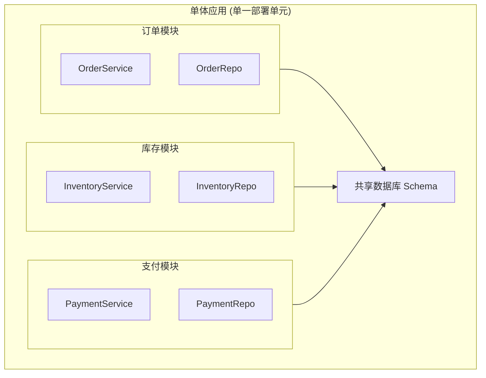
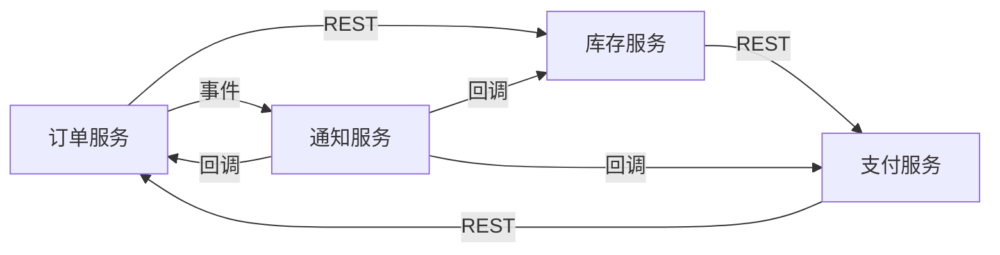
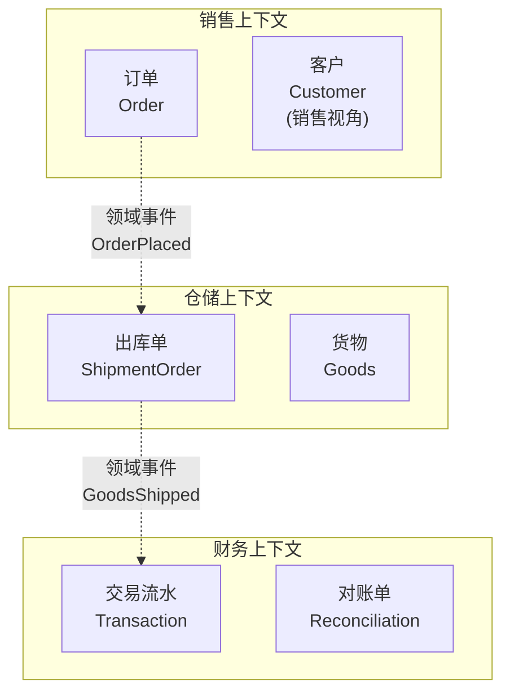
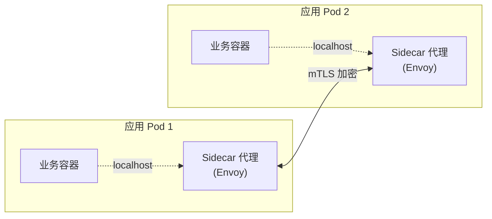

2014 年 Martin Fowler 发表那篇著名的《Microservices》时，整个 Java 社区还在为 Spring Boot 的"约定优于配置"而兴奋。五年过去，单体（Monolith）依然是大多数团队的首选结构——不是因为它好，而是因为拆分的代价足够大，没人愿意轻易付账。

我们见过太多团队把"微服务"当成万能膏药：在还没有遇到单体痛点的时候强行拆服务，结果既享受不到单体的开发效率，又背上了分布式系统的运维负担。

这篇文章想回答一个朴素的问题：**什么时候应该拆？怎么拆？拆完又该如何收尾？**

<!--more-->

## 一、单体并非"坏"，只是"长不大"

单体应用（Monolithic Application）的核心特征是：**所有业务功能共享一个代码仓库、一个部署单元、一套运行时**。整个团队对着一份代码提交，CI 一次构建所有模块，部署一个 war 包就上线所有功能。

在早期，单体的优势是碾压性的：

- **开发简单**：一次 checkout，所有代码可见，IDE 跳转随叫随到
- **调试直接**：本地起服务就能复现跨模块问题，不用连 N 个服务
- **部署一致**：不会出现"开发环境能跑，生产环境某台机器缺包"
- **事务天然**：数据库本地事务 ACID，无需考虑最终一致性

但当业务成长到一定规模，单体会显露出"单体地狱（Monolithic Hell）"的症状：

| 痛点 | 典型场景 |
|------|---------|
| 代码腐化 | 三年没人敢动的 core 模块，谁动谁背锅 |
| 团队冲突 | 多个团队争抢同一份代码的部署窗口 |
| 伸缩浪费 | 一个访问量小的报表模块拖累整个应用扩容 |
| 技术债固化 | 升级 JDK 版本要 6 个月，引入新框架等于做梦 |

## 二、演进路径：分三步走

从单体到分布式，从来不是"今天决定拆，明天就拆完"。这是一条**渐进式**的路。

### 第一步：模块化单体（Modular Monolith）

在拆服务之前，先在单体内部做好**模块边界**。这是大多数团队跳过的、也是最重要的一步。



**关键约束**：

- 模块间**只能通过公开的 API（如 Java 的 package-private 之外的方法）调用**，不能直接互访私有表
- 数据库按模块拆分 **schema** 或 **table 前缀**，逻辑上隔离
- 引入 **Maven 多模块** 或 **Gradle 子项目**，让编译期就能发现越界引用

这一步做完，模块之间的依赖图已经清晰，谁负责什么一目了然。

### 第二步：抽出独立服务（First Split）

从模块化单体里挑出**变更频率最高、与其他模块耦合最弱**的一块，拆成独立服务。

为什么选"最高频变更"？因为这是微服务最大的价值——**独立部署**。如果一个模块一年改一次，拆出去除了增加运维负担，看不到收益。

典型步骤：

1. 在单体里把模块的代码搬到一个新仓库
2. 把数据库访问从共享 schema 切到独立数据库（用同步双写过渡）
3. 引入 HTTP（REST）/ RPC 客户端调用，原来的内部方法调用改为远程调用
4. 单体侧保留一个 **Anti-Corruption Layer（防腐层）**，把对老接口的调用收敛到一个适配器

### 第三步：全面服务化（Distributed Monolith 警示）

当团队拆分服务有了节奏，会进入一个危险的阶段：**为了拆而拆**。



这是经典的 **Distributed Monolith（分布式单体）** 反模式。看上去是微服务，实际上：

- **服务之间循环依赖**，任意一个改动都要联动发布
- **数据强一致通过同步调用链保证**，延迟叠加成雪崩的导火索
- **故障域没有隔离**，一个慢查询拖垮整条链路

识别它的关键信号：**拆完服务之后，部署反而比单体更难了。** 如果是这样，立刻回滚到模块化单体，重新审视拆分边界。

## 三、用 DDD 找边界：限界上下文（Bounded Context）

微服务最被滥用的部分是"按业务功能拆服务"。但"业务功能"这个词本身就是模糊的。订单到底是"下单"还是"履约"？支付是"扣款"还是"对账"？

Eric Evans 的领域驱动设计（DDD）给出了答案——**限界上下文（Bounded Context）**。



**关键思想**：

- 同一个业务概念（"客户"）在销售上下文里有"购买偏好"，在财务上下文里只有"账户余额"
- 不同上下文通过**领域事件**（Domain Event）通信，而不是互相直接调用数据库或同步 RPC
- 限界上下文的边界就是微服务的边界——这是经验之谈，也是大多数落地团队的选择

实操技巧：**从事件风暴（Event Storming）入手**。把团队关在一个房间里，用便签纸把业务里发生的所有"事件"（"订单已创建"、"库存已扣减"等）贴出来，然后按这些事件回推出哪些"聚合根"，再按聚合根的归属划分上下文。

## 四、Go 代码示例：服务注册与发现

服务拆出来后第一个要解决的是**怎么找到彼此**。在 2019 年的主流做法是引入注册中心。下面是 Go 语言基于 etcd 的简化实现：

```go
// pkg/registry/registry.go
package registry

import (
    "context"
    "encoding/json"
    "time"

    "go.etcd.io/etcd/clientv3"
)

// ServiceInfo 描述一个服务实例
type ServiceInfo struct {
    Name    string `json:"name"`
    Address string `json:"address"`
    Port    int    `json:"port"`
}

// Register 将服务注册到 etcd，并维持租约
func Register(cli *clientv3.Client, info ServiceInfo, ttl int64) error {
    key := "/services/" + info.Name + "/" + info.Address
    val, _ := json.Marshal(info)

    // 申请租约
    resp, err := cli.Grant(context.Background(), ttl)
    if err != nil {
        return err
    }

    // 将服务信息写入 etcd，绑定租约
    _, err = cli.Put(context.Background(), key, string(val), clientv3.WithLease(resp.ID))
    if err != nil {
        return err
    }

    // 续约：保持服务在线状态
    keepAlive, err := cli.KeepAlive(context.Background(), resp.ID)
    if err != nil {
        return err
    }

    go func() {
        for {
            select {
            case <-keepAlive:
                // 自动续约
            case <-time.After(ttl * time.Second):
                return
            }
        }
    }()

    return nil
}

// Discover 从 etcd 发现服务的所有可用实例
func Discover(cli *clientv3.Client, name string) ([]ServiceInfo, error) {
    prefix := "/services/" + name + "/"
    resp, err := cli.Get(context.Background(), prefix, clientv3.WithPrefix())
    if err != nil {
        return nil, err
    }

    var instances []ServiceInfo
    for _, kv := range resp.Kvs {
        var info ServiceInfo
        if err := json.Unmarshal(kv.Value, &info); err == nil {
            instances = append(instances, info)
        }
    }
    return instances, nil
}
```

这段代码只展示骨架，完整实现还需要考虑：服务变更的 watch 通知、健康检查、负载均衡策略（随机/轮询/一致性哈希）等。在生产环境里，大多数团队直接使用现成的服务网格（Linkerd / Istio）来托管这些逻辑。

## 五、常见坑

### 1. 拆服务是为了解决组织问题，不是技术问题

Conway 定律（1968）说：**系统设计反映组织结构**。如果三个团队挤在一个单体里互相阻塞，那拆服务的本质是**让团队独立运作**，而不是为了"上微服务显得高级"。

### 2. 分布式事务不是银弹

微服务拆分后，跨服务的事务一致性是绕不开的话题。2019 年的主流方案：

| 方案 | 适用场景 | 缺点 |
|------|---------|------|
| 本地消息表 | 异步最终一致性 | 需要额外的轮询 job |
| Saga 模式 | 长事务业务流程 | 补偿逻辑复杂 |
| TCC（Try-Confirm-Cancel） | 短事务、强一致要求 | 侵入业务代码 |
| 2PC / XA | 极短事务 | 性能差，分布式协调脆弱 |

不要看到分布式事务就上 2PC，**大多数业务场景用最终一致性就够了**。

### 3. 监控先于拆分

拆完服务后第一个痛的不是部署，而是"**线上出了问题不知道哪里挂了**"。日志聚合（ELK）、链路追踪（Zipkin / Jaeger）、指标监控（Prometheus）这三件套必须在拆分前就位。

## 六、服务网格：把"通信基础设施"抽出来

当微服务数量超过 50 个，团队开始被另一类问题困扰：每个服务都要写一遍"重试、超时、熔断、追踪、加密"等横切代码。即使有 gRPC 拦截器，每个团队都要重复发明轮子。

2017 年前后，**服务网格（Service Mesh）** 应运而生——把服务间通信的所有横切逻辑从应用进程里抽出来，放到独立的 **Sidecar 代理** 里：



Sidecar 拦截所有进出 Pod 的流量，统一实现：

- **重试 / 超时 / 熔断**：不再写 Hystrix 风格的代码
- **服务发现**：从控制平面拉取 endpoint 列表
- **负载均衡**：可定制策略（最少连接、随机、一致性哈希）
- **可观测性**：自动上报请求量、延迟、错误率
- **安全**：所有 Pod 间通信自动 mTLS 加密

2019 年的两大代表：**Linkerd**（Rust 写的轻量级代理）和 **Istio**（基于 Envoy 的完整控制平面）。Istio 功能强大但资源开销高，Linkerd 更适合资源敏感的场景。

服务网格不是银弹，它带来了**额外的网络一跳**（业务容器 → 本地 sidecar → 远程 sidecar → 业务容器）和**显著的内存占用**（每个 Pod 多 50-200MB 的 Envoy）。在服务规模 < 20 时，**用客户端库（gRPC + 拦截器 + 治理 SDK）通常更划算**。

## 七、小结

微服务不是目的，是手段。它解决的是**组织规模和系统复杂度**的问题。当团队还小、单体还干净的时候，强行拆分只会换来 Distributed Monolith 的悲剧。

务实的路径：

1. **先把单体写好**：模块边界清晰、依赖单向、单元测试覆盖
2. **按 DDD 划分上下文**：用事件风暴找出真正的业务边界
3. **渐进式拆分**：先拆一个，再拆第二个，每个都要让部署更轻松
4. **可观测性先行**：日志、监控、链路追踪在拆之前就准备好

记住一句话：**单体不是坏系统，拆得太早才是坏决定。**