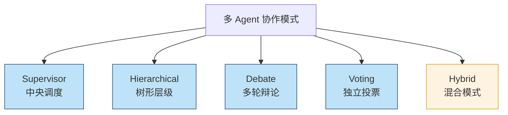
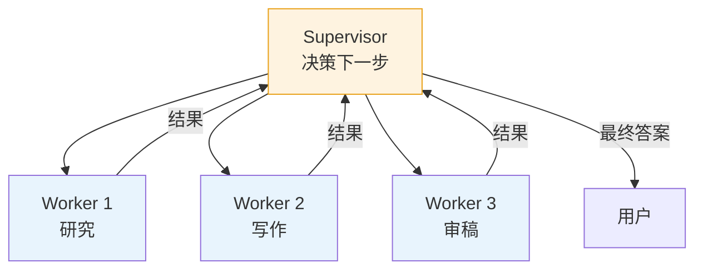
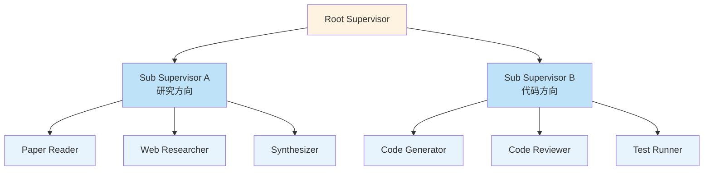
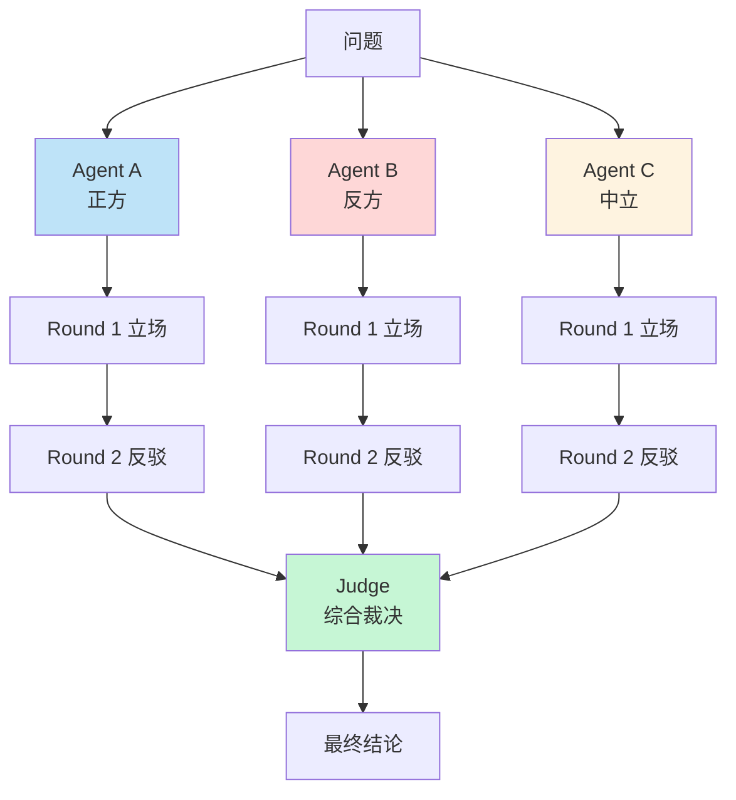
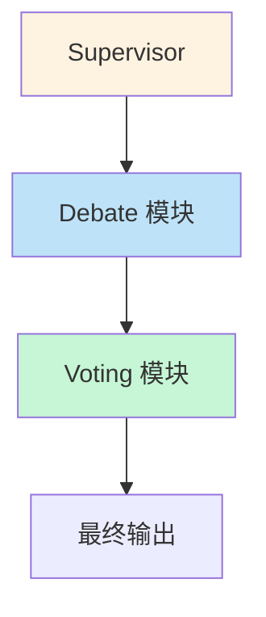
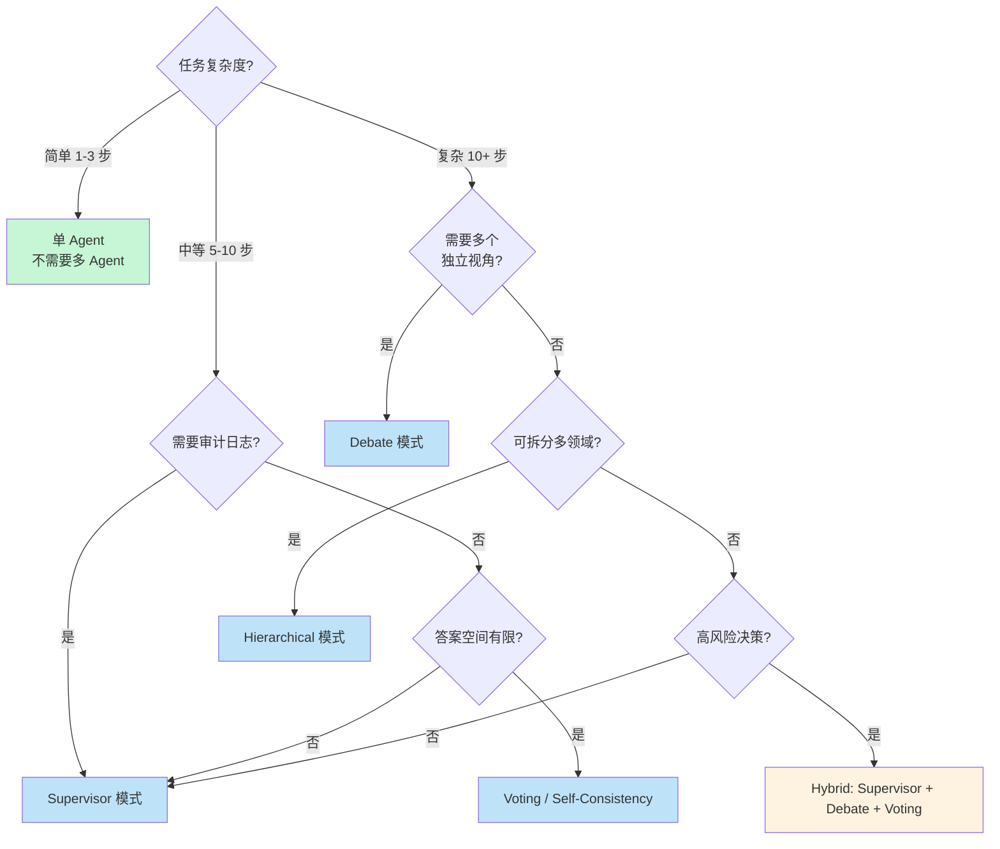

> 一个 Agent 做不了的事，多个 Agent 凑在一起就能解决——但凑错了方式，可能比单 Agent 还差。这篇文章系统讲清楚四种主流多 Agent 协作模式的**机制、适用场景、坑和代码模板**，帮你在生产里选对模式。

单 Agent 的瓶颈很明显：context window 有限、专业能力单一、长任务可靠性差。**多 Agent 协作** 是 2025 年解决这些问题的标准答案——但模式选错了，成本翻倍、质量反而下降。

四种主流模式：



<!--more-->

## 一、Supervisor（中央调度）模式

**最常用**的模式。一个 supervisor（也叫 orchestrator）协调多个 worker agents。



### 1.1 经典实现

```python
from langgraph.graph import StateGraph, END

# 定义 worker
def researcher(state):
    """研究子任务"""
    result = llm.invoke(f"研究: {state['current_task']}")
    return {"research": result}

def writer(state):
    """写作子任务"""
    result = llm.invoke(f"基于研究写作: {state['research']}")
    return {"draft": result}

def reviewer(state):
    """审稿子任务"""
    result = llm.invoke(f"审稿并提出修改: {state['draft']}")
    return {"feedback": result}

# 定义 supervisor 决策
def supervisor_decision(state):
    """决定下一步调用哪个 worker"""
    decision = llm.invoke(f"""
    当前状态: {state}
    下一步应该调用哪个 agent？可选: researcher / writer / reviewer / FINISH
    只回复 agent 名称，不要解释。
    """)
    return decision.strip()

# 构建 graph
workflow = StateGraph(State)

workflow.add_node("supervisor", supervisor_node)
workflow.add_node("researcher", researcher)
workflow.add_node("writer", writer)
workflow.add_node("reviewer", reviewer)

# supervisor 决定下一步
workflow.add_conditional_edges(
    "supervisor",
    supervisor_decision,
    {
        "researcher": "researcher",
        "writer": "writer",
        "reviewer": "reviewer",
        "FINISH": END
    }
)

# workers 完成后回到 supervisor
workflow.add_edge("researcher", "supervisor")
workflow.add_edge("writer", "supervisor")
workflow.add_edge("reviewer", "supervisor")

workflow.set_entry_point("supervisor")
app = workflow.compile()
```

### 1.2 优缺点

**优点**：
- **控制流清晰**——所有决策都过 supervisor，易调试
- **可观测性好**——每个 step 都有 trace
- **工具组合灵活**——不同 worker 用不同工具

**缺点**：
- **单点瓶颈**——supervisor 的 context 装不下所有 worker 的中间结果
- **延迟累积**——每步都要等 supervisor 决策
- **成本高**——supervisor 决策本身也要调 LLM

**适用场景**：
- 中等复杂度任务（5-10 步以内）
- 需要明确审计日志的场景（金融、医疗）
- 工具异构的复杂 workflow

## 二、Hierarchical（树形层级）模式

任务太复杂，单层 supervisor 也管不过来时，用**树形层级**——高层 supervisor 把任务拆给子 supervisor，子 supervisor 再分给具体 worker。



### 2.1 Anthropic 多 Agent 研究系统

Anthropic 在 2025 年公开的 [Building a Multi-Agent Research System](https://www.anthropic.com/engineering/built-multi-agent-research-system) 是这种模式的代表：

```python
class ResearchSystem:
    def __init__(self):
        self.root_supervisor = SupervisorAgent(
            name="root",
            tools=[
                "delegate_to_research_team",
                "delegate_to_writing_team",
                "search_web"
            ]
        )
        
        # 每个 sub-team 有自己的 supervisor
        self.research_team = SupervisorAgent(
            name="research_lead",
            workers=[
                "paper_reader",
                "web_researcher",
                "data_analyst"
            ]
        )
        
        self.writing_team = SupervisorAgent(
            name="writing_lead",
            workers=[
                "outline_writer",
                "section_writer",
                "editor"
            ]
        )
```

**关键数据**（Anthropic 报告）：
- 比单 Agent 方案 token 消耗减少 **90%+**（每个 sub-agent 只看自己的 context）
- 复杂研究任务的准确率提升明显
- **但**：端到端延迟增加（多个串行 supervisor）

### 2.2 适用场景

- **超大复杂任务**（10+ 步，需要拆分成多个子领域）
- **团队式 workflow**（研究 / 实现 / 测试三阶段）
- **不同子任务需要的工具完全异构**（编程任务 vs 写作任务）

## 三、Debate（辩论）模式

让多个 Agent **持反对意见**，相互辩论，最后由 Judge 仲裁。



### 3.1 经典实现

```python
class DebateSystem:
    def __init__(self, n_agents=3, n_rounds=2):
        self.n_agents = n_agents
        self.n_rounds = n_rounds
        self.agents = [
            DebateAgent(role=role, perspective=perspective)
            for role, perspective in [
                ("bull", "支持这个方案"),
                ("bear", "反对这个方案"),
                ("neutral", "分析利弊")
            ]
        ]
        self.judge = JudgeAgent()
    
    def run(self, question: str) -> str:
        # Round 1: 各方表态
        positions = {}
        for agent in self.agents:
            positions[agent.name] = agent.initial_position(question)
        
        # Round 2+: 互相反驳
        for round_num in range(1, self.n_rounds):
            new_positions = {}
            for agent in self.agents:
                # 每个 agent 看到其他人的观点
                other_positions = {
                    name: pos for name, pos in positions.items()
                    if name != agent.name
                }
                new_positions[agent.name] = agent.rebut(
                    question=question,
                    my_position=positions[agent.name],
                    other_positions=other_positions,
                    round_num=round_num
                )
            positions = new_positions
        
        # Judge 综合
        return self.judge.synthesize(question, positions)
```

### 3.2 真实价值

辩论模式能**显著降低幻觉**——多个独立视角相互校验，单一 Agent 容易犯的"想当然"被暴露。

**适用场景**：
- **高风险决策**（投资策略、医疗方案、代码审查）
- **争议性问题**（"该不该用微服务"、"AI 是否该有版权"）
- **需要对抗性思维**的场景

**不适用**：
- 简单事实问答（成本不划算）
- 需要快速响应的场景（辩论太慢）

**坑**：辩论轮数多了之后，**容易陷入琐碎细节**。通常 2-3 轮最佳。

## 四、Voting（投票）模式

让多个 Agent **独立**解决问题，投票决定最终答案。

```python
class VotingSystem:
    def __init__(self, n_agents=5):
        self.n_agents = n_agents
    
    def run(self, problem: str) -> dict:
        # 1. 多个 agent 独立求解（并行！）
        solutions = []
        for i in range(self.n_agents):
            sol = self.independent_solve(problem, agent_id=i)
            solutions.append(sol)
        
        # 2. 投票（多数决 / 加权 / 置信度）
        final = self.vote(solutions)
        
        return {
            "answer": final["answer"],
            "confidence": final["confidence"],
            "votes": [s["answer"] for s in solutions]
        }
    
    def vote(self, solutions):
        # 简单多数
        from collections import Counter
        answers = [s["answer"] for s in solutions]
        counts = Counter(answers)
        winner, count = counts.most_common(1)[0]
        confidence = count / len(solutions)
        
        # 如果多数票信心不足，调用更贵但更强的模型仲裁
        if confidence < 0.6:
            arbiter = self.arbitrate(solutions)
            return arbiter
        
        return {"answer": winner, "confidence": confidence}
```

### 4.1 Self-Consistency

这是 Voting 模式的最简单应用：**同一个 prompt 跑 N 次，少数服从多数**。

```python
def self_consistency(problem, n=5):
    """Self-Consistency: 同一 prompt 多采样"""
    answers = []
    for _ in range(n):
        response = llm.invoke(problem, temperature=0.7)  # 高温保证多样性
        answer = extract_final_answer(response)
        answers.append(answer)
    
    # 多数决
    from collections import Counter
    final, count = Counter(answers).most_common(1)[0]
    confidence = count / n
    
    return final, confidence
```

**Wang et al. (2023)** 报告 Self-Consistency 在 GSM8K 数学题上把准确率从 74% 提升到 **91%**。这是个几乎免费的提升——代价是 N 倍的 token 消耗。

### 4.2 适用场景

- **答案空间有限**（选择题、判断题）
- **需要降低随机性**的推理任务（数学、逻辑）
- **追求高准确率**且不在乎成本的场景（医疗、金融）

## 五、Hybrid（混合）模式

真实生产里，**没有哪个项目用纯一种**。大多数是混合：



### 5.1 真实案例：投资分析 Agent

```python
class InvestmentAnalystSystem:
    """混合架构：supervisor + debate + voting"""
    
    def __init__(self):
        self.supervisor = SupervisorAgent(tools=["delegate_research", "delegate_debate"])
        
        # 研究阶段：supervisor 调度多个 worker
        self.research_workers = [
            FinancialWorker(),
            TechnicalWorker(),
            SentimentWorker()
        ]
        
        # 辩论阶段：bull vs bear
        self.debate_agents = [
            BullAgent(),
            BearAgent(),
            NeutralAgent()
        ]
        
        # 投票阶段：多个 Judge agent 投票
        self.judges = [JudgeAgent(seed=i) for i in range(3)]
    
    def analyze(self, stock: str) -> dict:
        # Stage 1: Supervisor 调度研究
            research_results = self.run_research(stock)
            
            # Stage 2: Debate 阶段
            debate_outcome = self.run_debate(stock, research_results)
            
            # Stage 3: Voting 决定评级
            final_rating = self.run_voting(stock, debate_outcome)
            
            return final_rating
```

TradingAgents-CN-Skill 的设计就是这个模式——分析师团队（supervisor）→ 多空辩论（debate）→ 风控三方辩论（debate）→ 投资组合经理五级评级（voting）。

## 六、框架对比：选哪个工具？

```python
frameworks = {
    "LangGraph": {
        "核心模型": "图（Graph）",
        "擅长": "复杂 control flow、人在回路、状态管理",
        "代表项目": "LangChain 生态",
        "学习曲线": "中等"
    },
    "CrewAI": {
        "核心模型": "角色 (Role) + 任务 (Task)",
        "擅长": "角色扮演类协作、易上手",
        "代表项目": "团队式 workflow",
        "学习曲线": "低"
    },
    "AutoGen": {
        "核心模型": "对话 (Conversation)",
        "擅长": "对话驱动协作、研究类任务",
        "代表项目": "Microsoft 学术研究",
        "学习曲线": "中等"
    },
    "OpenAI Swarm": {
        "核心模型": "Handoff（移交）",
        "擅长": "轻量级 agent 切换",
        "代表项目": "客服、路由类任务",
        "学习曲线": "极低"
    },
    "Anthropic SDK": {
        "核心模型": "Sub-agents",
        "擅长": "Claude 生态、parallel tool use",
        "代表项目": "Claude 深度用户",
        "学习曲线": "中等"
    }
}
```

**经验选型**：

| 场景 | 推荐框架 |
|------|---------|
| 复杂 workflow + 需要审计 | LangGraph |
| 角色扮演类协作 | CrewAI |
| 研究/对话为主 | AutoGen |
| 简单路由/客服 | OpenAI Swarm |
| Claude 生态 | Anthropic SDK |

## 七、性能、成本、可靠性 trade-offs

### 7.1 成本对比

| 模式 | 相对单 Agent 成本 | 适用 ROI 场景 |
|------|-----------------|-------------|
| Supervisor | 3-5x | 中等复杂度，节省开发时间 |
| Hierarchical | 8-15x | 大任务，token 利用更高效 |
| Debate (2 轮 3 agents) | 6-10x | 高风险决策 |
| Voting (5 samples) | 5x | 关键推理 |
| Hybrid | 10-20x | 复杂决策系统 |

### 7.2 延迟对比

```
单 Agent:                    ~5s
Supervisor (3 workers):      ~15s   (3x)
Hierarchical (2 levels):     ~25s   (5x)
Debate (2 轮 3 agents):      ~30s   (6x)
Voting (5 parallel):         ~10s   (2x) ← 并行有救
Hybrid:                      ~45s   (9x)
```

**优化**：Voting 模式天然适合 `asyncio.gather`，**并行执行**能让延迟从 5x 降到 2x。

### 7.3 可靠性

**多 Agent 系统的可靠性是反直觉的**：

- **Supervisor 链路过长时可靠性反而下降**——每多一层 LLM 调用就多一次失败机会
- **Debate 在某些任务上过度谨慎**——反复争论导致最终结论平庸
- **Voting 在答案空间小时很好，答案空间大时崩塌**（"哪个最佳"不存在多数派）

## 八、决策树：选哪种模式？



## 九、上线 checklist

- [ ] **先从 Supervisor 开始**——大多数场景够用，再视情况升级
- [ ] **控制 supervisor 链深度 ≤ 3 层**——超过 3 层延迟和成本失控
- [ ] **Voting 用并行执行**——`asyncio.gather`，延迟能从 5x 降到 2x
- [ ] **Debate 限制 2-3 轮**——多了反而拖累
- [ ] **每个 sub-agent 有独立的 context**——不要共享 messages
- [ ] **完整 tracing**——多 Agent 系统必须能回放每一步决策
- [ ] **成本监控**——单次任务成本超过 $0.5 要告警
- [ ] **充分评估**——参考前面文章里的 Golden Dataset + LLM-as-Judge
- [ ] **human-in-the-loop**——关键决策节点保留人审

## 十、一点反思

多 Agent 系统的**真正挑战不是选哪种模式**，而是：

1. **避免无限循环**——supervisor 来回踢皮球烧光 token
2. **context 不溢出**——每个 sub-agent 的 context 独立管理
3. **debug 困难**——多步决策链里问题定位极难
4. **成本失控**——单 Agent 看起来贵，多 Agent 可能贵 10 倍

我见过太多团队**为了"高级"而做多 Agent**，结果：

- 单 Agent 能 95% 解决的问题，多 Agent 反而掉到 88%
- Token 成本翻了 10 倍
- 调试时间翻了 5 倍
- **唯一的好处**：演示时显得很复杂

正确的态度：**先单 Agent，实在不够再升级**。多 Agent 是工具，不是目的。

---

**参考资料：**
- [Anthropic: Building Effective Agents](https://www.anthropic.com/research/building-effective-agents)
- [Anthropic: Building a Multi-Agent Research System](https://www.anthropic.com/engineering/built-multi-agent-research-system)
- [LangGraph: Multi-Agent Workflows](https://langchain-ai.github.io/langgraph/)
- [CrewAI: Role-based Agent Collaboration](https://docs.crewai.com/)
- [Microsoft AutoGen: Conversation-based Agents](https://microsoft.github.io/autogen/)
- [OpenAI Swarm: Lightweight Handoff](https://github.com/openai/swarm)
- [Wang et al.: Self-Consistency Improves Chain of Thought Reasoning (2023)](https://arxiv.org/abs/2203.11171)
- [Du et al.: Improving Factuality and Reasoning through Multiagent Debate (2023)](https://arxiv.org/abs/2305.14325)
- [MetaGPT: Multi-Agent Collaborative Framework](https://github.com/geekan/MetaGPT)
- [TradingAgents-CN-Skill: 17 步多 Agent 股票分析](https://github.com/tanteng/tradingagents-cn-skill)