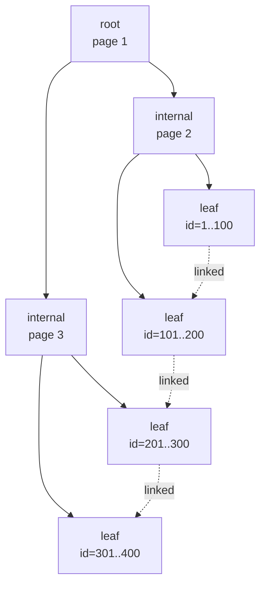
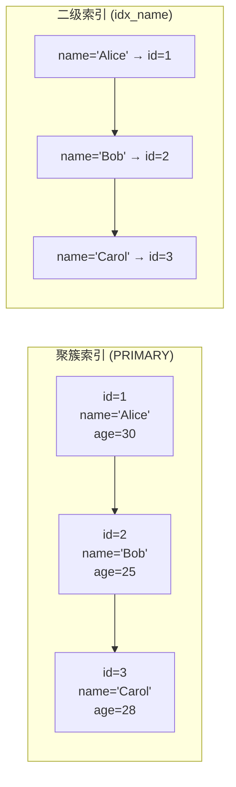

MySQL InnoDB 存储引擎的索引底层是一棵 **B+ 树**。理解 B+ 树的结构、聚簇索引与二级索引的差异、以及覆盖索引与索引下推，是写出高性能 SQL 的基础。本文从原理入手，逐步剖析这些机制。

## 为什么是 B+ 树

常见的查询加速数据结构有：

- **二叉搜索树**：极端情况下退化成链表，O(N) 查找
- **平衡二叉树（AVL/红黑树）**：O(log N)，但每个节点只能存一个值，树高过高
- **B 树（多路平衡查找树）**：每个节点存多个 key，减少树高度
- **B+ 树**：B 树的变种，只有叶子节点存数据，内部节点只存 key（路由）

InnoDB 选择 B+ 树有三个关键原因：

1. **磁盘 I/O 友好**：树高低（通常 3-4 层），单次查询只需 3-4 次磁盘寻道
2. **范围查询友好**：叶子节点按顺序链表相连，范围扫描无需回溯上层
3. **查询效率稳定**：所有数据都在叶子节点，路径长度一致



## 聚簇索引 vs 二级索引

InnoDB 的索引分为两种，存储方式截然不同：

### 聚簇索引（Clustered Index）

- 叶子节点存储的是**完整的行数据**（包括所有列）
- 每张表只能有一个聚簇索引
- 默认用主键作为聚簇索引；如果没有主键，用第一个唯一非空索引；如果都没有，InnoDB 会隐式生成一个 6 字节的 ROW_ID

### 二级索引（Secondary Index）

- 叶子节点存储的是 **<索引键值, 主键值>** 对
- 二级索引查询到主键后，还需要回表到聚簇索引取完整数据（除非使用覆盖索引）



## 覆盖索引：避免回表

如果查询的列全部包含在某个二级索引中，就不需要回表——这种优化叫**覆盖索引**（Covering Index）。

```sql
-- 创建索引：idx_name_age (name, age)
SELECT age FROM users WHERE name = 'Alice';
```

`idx_name_age` 叶子节点已经有 `(name, age, id)`，查询只需要 `name` 和 `age`，正好都在索引里——无需回表。这是最直接的查询性能优化手段之一。

## 索引下推（ICP）

MySQL 5.6+ 引入了 **Index Condition Pushdown**。在二级索引遍历时，把原本需要在服务层做的 WHERE 条件下推到存储引擎层，提前过滤不符合条件的数据。

```sql
-- 假设有索引 (name, age)
SELECT * FROM users WHERE name LIKE 'A%' AND age > 20;
```

没有 ICP 时：存储引擎按 name 前缀扫描所有匹配行，把每行回表取出全部数据，再在服务层过滤 `age > 20`。

有 ICP 时：存储引擎在扫描 `(name, age)` 索引时就判断 `age > 20`，不满足的索引项直接跳过，**减少回表次数**。

## 最左前缀原则

复合索引 `(a, b, c)` 的存储顺序等价于先按 `a` 排序，`a` 相同时按 `b` 排序，`b` 相同时按 `c` 排序。这意味着：

- `WHERE a = ?`：能用索引
- `WHERE a = ? AND b = ?`：能用索引
- `WHERE b = ?`：**不能**用索引（跳过了 `a`）
- `WHERE a = ? AND c = ?`：只能用 `a` 部分，`c` 不能用索引
- `WHERE a = ? ORDER BY b`：可以用索引避免排序


## 索引选择性

索引列的区分度（cardinality / total rows）越高，索引过滤效率越好。一般认为选择性 < 10% 时索引价值不大，但实际还要看查询模式。

可以通过 `SHOW INDEX FROM table_name` 查看每列的 Cardinality。MySQL 优化器也会基于统计信息决定是否使用索引。

## 查询优化实践

1. **避免 SELECT ***：覆盖索引的好处在于只读必要的列
2. **复合索引列顺序**：高选择性列放前面，等值查询列放前面，范围列放最后
3. **避免在索引列上做函数计算**：`WHERE YEAR(create_time) = 2024` 会让索引失效
4. **利用索引做排序**：`ORDER BY` 的列如果匹配索引顺序，可避免 filesort
5. **小表全表扫描可能更快**：当数据量小时，索引的磁盘 I/O 反而是负担

## 参考资料

- MySQL 官方文档：[Clustered and Secondary Indexes](https://dev.mysql.com/doc/refman/8.0/en/innodb-index-types.html)
- 姜承尧《MySQL 技术内幕：InnoDB 存储引擎》
- 掘金：[MySQL 索引背后的数据结构及算法原理](https://juejin.im/entry/591012d161ff4b006255b447)
