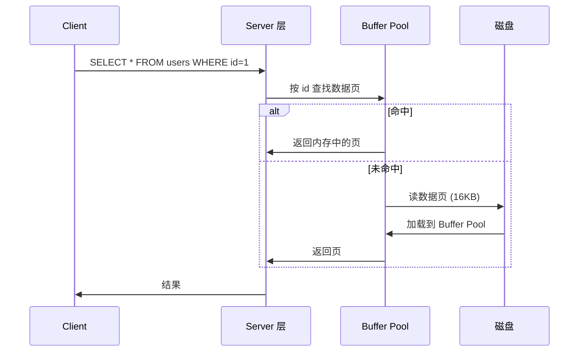
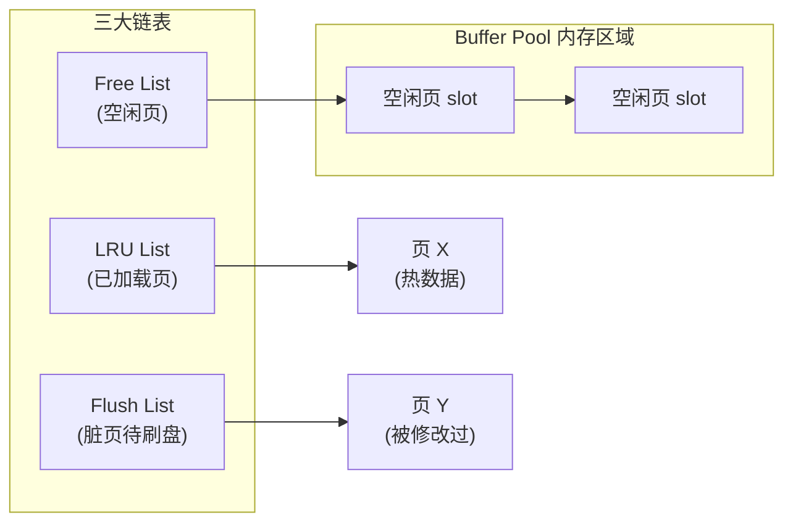
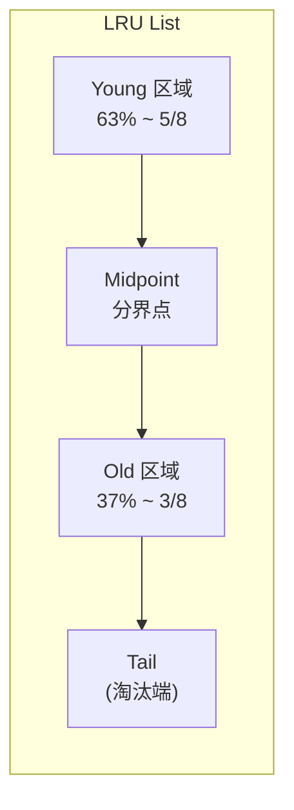
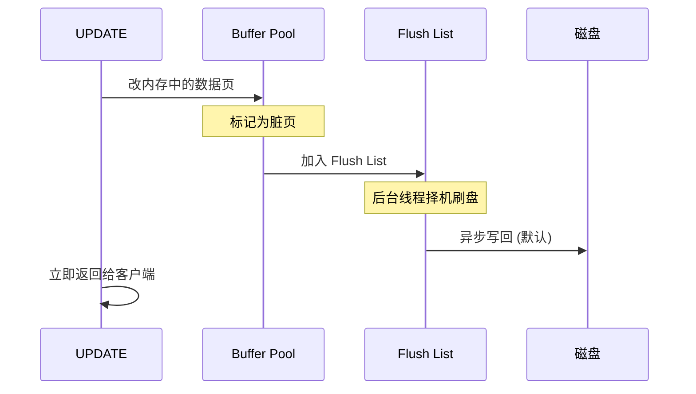
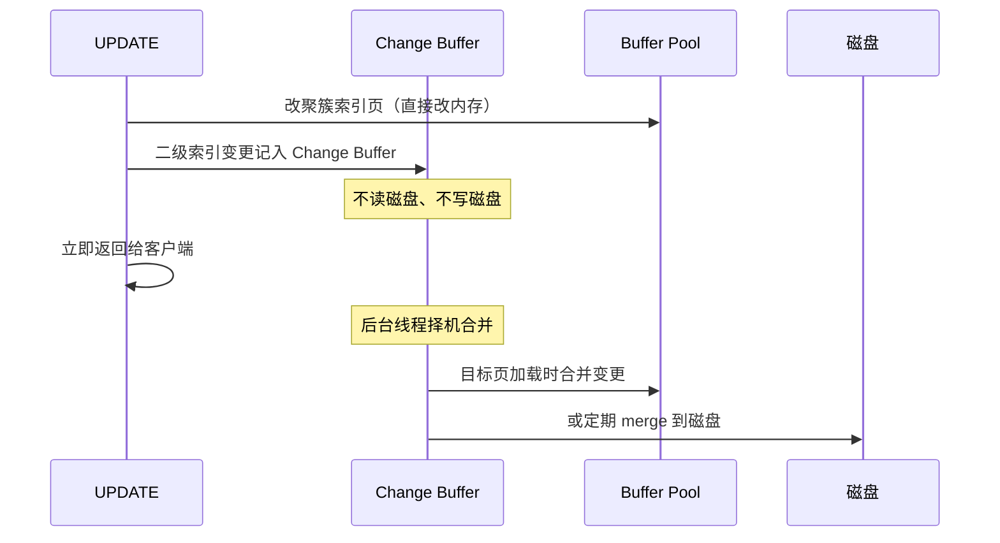

你执行 `SELECT * FROM users WHERE id = 1;` 时，MySQL 真的去磁盘读数据了吗？多半没有。一次随机磁盘 I/O 大约 10ms，而一次内存访问大约 100ns——差距 10 万倍。这就是为什么 InnoDB 把"把数据搬到内存"这件事做成了一个独立子系统：**Buffer Pool**。

这篇文章以 MySQL 5.7（InnoDB 1.1.x）为基线，从一个具体查询出发，拆解 Buffer Pool 的内部结构、LRU 淘汰策略、刷脏机制和常见调优陷阱。

<!--more-->

## 一、从一次查询看 Buffer Pool 的角色



InnoDB 以**页（page）**为单位管理数据，默认每页 16KB。即使只查一行，也会把整页（通常包含几百行）读进内存。下次查同一页的相邻记录就直接命中了。

这就是 Buffer Pool 存在的全部理由：**用空间换时间，把磁盘 I/O 变成内存读**。

## 二、Buffer Pool 的内部结构

Buffer Pool 本质是一块连续的内存区域（`innodb_buffer_pool_size` 配置），按页大小切成若干 slot，逻辑上由三个链表维护：



| 链表 | 作用 | 关键字段 |
|------|------|---------|
| **Free List** | 空闲页池，加载新页时取一个 slot | 控制块 `buf_block_t` |
| **LRU List** | 已加载页，按访问时间排序 | `freed_page_clock` |
| **Flush List** | 被修改过（脏页）但未刷盘的页 | 按最早脏化时间排序 |

一个页在生命周期里会在这三个链表之间迁移：

- 刚加载进来：从 Free List 取出，挂到 LRU List 中点
- 被修改：除了在 LRU List 还多一份指针在 Flush List
- 被淘汰：从 LRU List 移除，如果脏则需先刷盘才能归还 Free List

## 三、改进型 LRU：为什么要分代？

朴素 LRU 算法有个致命问题：**一次全表扫描会把所有热数据全部挤出内存**。

设想热数据约占 Buffer Pool 的 10%，但你跑了一个 `SELECT * FROM huge_table` 读入大量冷数据。朴素 LRU 把新数据全插到链表头，热数据瞬间被挤到尾部。扫描结束后，热数据已经不在内存里——查询延迟陡升。

InnoDB 用**中点插入策略（Midpoint Insertion）**解决：



| 参数 | 默认值 | 作用 |
|------|-------|------|
| `innodb_old_blocks_pct` | 37 | Old 区域占总 LRU List 的百分比 |
| `innodb_old_blocks_time` | 1000 (ms) | Old 区域页必须停留多久才能升入 Young |

**规则**：

1. 新页首次加载进 LRU List 时，**插在 midpoint**（即 Old 区域头部），而不是最热端
2. 页在 Old 区域被再次访问时，必须先等 `innodb_old_blocks_time` 毫秒才"晋升"到 Young 区域头部
3. 直接被淘汰的，是 Old 区域尾部那些长期未再访问的页

效果：一次全表扫描加载的页，**绝大部分只访问一次就自然老化到 Tail 被淘汰**，不会冲击 Young 区域里的真正热数据。

### 3.1 实测参数影响

```sql
-- 查看当前 LRU 配置
SHOW VARIABLES LIKE 'innodb_old_blocks_%';

-- 调大 Old 区域（适合频繁做全表扫描的报表库）
SET GLOBAL innodb_old_blocks_pct = 50;

-- 调大 Old 区域停留时间（防止偶发访问误判为热）
SET GLOBAL innodb_old_blocks_time = 2000;
```

经验值：

| 场景 | `innodb_old_blocks_pct` | `innodb_old_blocks_time` |
|------|--------------------------|--------------------------|
| 纯 OLTP，小扫描 | 20~37 | 0~1000 |
| OLTP + 偶尔大查询 | 37（默认） | 1000（默认） |
| 数据仓库，频繁全表扫描 | 50 | 2000+ |

## 四、刷脏页：从内存到磁盘

Buffer Pool 里的页被修改后不会立刻写回磁盘，而是标记为**脏页**挂在 Flush List 上。**Master Thread** 和 **Page Cleaner Thread** 负责异步刷盘。

### 4.1 触发刷盘的条件

| 条件 | 阈值参数 | 说明 |
|------|---------|------|
| 脏页比例超阈值 | `innodb_max_dirty_pages_pct` (默认 75) | 占用 Buffer Pool 的百分比 |
| Redo Log 满 | `innodb_log_file_size` 总和的 75% | 触发"尖锐刷盘"（sharp checkpoint） |
| 空闲页不足 | LRU 淘汰脏页时同步刷 | 同步刷会阻塞查询 |
| 正常 checkpoint | 后台线程周期刷 | 异步、不阻塞 |

### 4.2 刷盘的工程取舍



关键问题：**用户线程提交时是否同步刷盘**？由 `innodb_flush_log_at_trx_commit` 控制：

| 值 | 行为 | 性能 | 风险 |
|---|------|------|------|
| **1**（默认，最安全） | 每次提交都刷 redo log 到磁盘 | 慢 | 几乎不丢数据 |
| **0** | 每秒刷一次 | 最快 | 宕机可能丢 1 秒数据 |
| **2** | 每次提交写到 OS cache，每秒刷盘 | 中等 | MySQL 宕机不丢，OS 宕机丢 1 秒 |

**金融场景必须为 1**。电商秒杀、大数据量导入可考虑 2 配合备库。

### 4.3 刷盘抖动的坑

当系统压力上来后，脏页堆积到 `innodb_max_dirty_pages_pct`，后台线程开始疯狂刷盘——**磁盘 IO 被打满，正常查询也被拖慢**。MySQL 5.7 引入了**自适应刷盘（adaptive flushing）**：根据 redo log 生成速度动态调整刷盘节奏，避免突发刷盘。

观察刷盘压力：

```sql
SHOW ENGINE INNODB STATUS\G
-- 看 BUFFER POOL AND MEMORY 段
-- Pages made young / Pages not made young
-- youngs/s, non-youngs/s
```

### 4.4 Change Buffer：二级索引的特殊加速

Buffer Pool 不仅缓存数据页和一级索引页，还有一块专门给**二级索引（secondary index）变更**用的内存——**Change Buffer**。

设想更新一条记录：如果该记录所在的二级索引页**不在内存中**，朴素的做法是从磁盘读入、修改、写回。这是一次额外的随机 I/O——二级索引的更新是 InnoDB 历史上最慢的一类操作。

Change Buffer 把这步优化掉：



收益：**写密集型场景下，二级索引更新 I/O 显著减少**（典型值 50%+）。代价是查询二级索引时可能要触发合并，产生少量延迟。

| 参数 | 默认 | 作用 |
|------|------|------|
| `innodb_change_buffering` | `all` | 控制对哪些操作启用：all / none / inserts / deletes / purges |
| `innodb_change_buffer_max_size` | `25` | Change Buffer 占 Buffer Pool 的最大百分比 |

适用场景：写多读少的应用（订单、日志）；不适合：读多写少 + 数据立刻要查（Change Buffer 没收益，徒增合并开销）。

### 4.5 自适应哈希索引（Adaptive Hash Index）

Buffer Pool 还隐含一块**自适应哈希索引**——InnoDB 在内存中自动为热点 B+ 树页构建哈希索引，把"等值查询 + 缓冲池命中"从 O(log N) 变成 O(1)：

```bash
# 启用状态
SHOW VARIABLES LIKE 'innodb_adaptive_hash_index';
# ON（默认）

# 观察使用情况（SHOW ENGINE INNODB STATUS 的 INSERT BUFFER AND ADAPTIVE HASH INDEX 段）
```

启用它能显著加速 `WHERE id = ?` 类查询，但会占用 Buffer Pool 内存并产生哈希维护开销。**写入密集 + 长连接**通常收益明显；**短连接 + 大查询**建议关闭以减少 mutex 竞争。

## 五、Buffer Pool 调优实战

### 5.1 内存大小

`innodb_buffer_pool_size` 是最关键的参数。生产建议：

| 数据库总内存 | 建议 Buffer Pool |
|-------------|----------------|
| 4 GB | 1-2 GB |
| 16 GB | 8-12 GB |
| 64 GB | 40-48 GB |
| 128 GB+ | 考虑多实例 |

经验值是物理内存的 **50%-70%**。剩下的要给 OS 文件缓存、连接线程、临时表等。

### 5.2 多实例 Buffer Pool（5.7+）

大内存下单个 Buffer Pool 的 mutex 竞争严重，5.7 引入 `innodb_buffer_pool_instances`：

```ini
innodb_buffer_pool_size = 16G
innodb_buffer_pool_instances = 8
```

每个实例独立管理自己的 LRU List、Free List、Flush List。生产中建议每实例 ≥ 1 GB，否则没收益。

### 5.3 命中率监控

```sql
-- 全局命中率
SHOW STATUS LIKE 'Innodb_buffer_pool_read%';
-- Innodb_buffer_pool_read_requests: 逻辑读次数
-- Innodb_buffer_pool_reads: 物理读次数（未命中）
-- 命中率 = 1 - reads / requests

-- 5.7+ 精确视图
SELECT * FROM sys.innodb_buffer_stats_by_table;
```

健康值：

| 命中率 | 含义 | 行动 |
|-------|------|------|
| > 99% | 优秀 | 维持现状 |
| 95%-99% | 正常 | 观察是否在恶化 |
| < 95% | 异常 | 查全表扫描、检查热点、考虑扩内存 |

### 5.4 预热（Warmup）

重启后 Buffer Pool 是空的，第一次查询会很慢——所有热点都要从磁盘加载。5.7 之前靠人工 dump：

```bash
# 重启前 dump 热点页
SELECT * FROM INFORMATION_SCHEMA.INNODB_BUFFER_PAGE_LRU;

# 启动后强制预加载（5.7+）
SET GLOBAL innodb_buffer_pool_dump_now = ON;
SET GLOBAL innodb_buffer_pool_load_now = ON;
```

5.7+ 默认在停机时自动 dump、启动时自动 load。

## 六、代码示例：观察 Buffer Pool 行为

```sql
-- 1. 看当前 Buffer Pool 整体状态
SHOW ENGINE INNODB STATUS\G

-- 找到这段:
-- BUFFER POOL AND MEMORY
-- Total memory allocated 10989076480
-- Buffer pool size   655360
-- Free buffers       1024
-- Database pages     650000
-- Old database pages 240000
-- Modified db pages  1500
```

```sql
-- 2. 看哪些表占了最多 Buffer Pool
SELECT
    table_name,
    index_name,
    COUNT(*) AS pages,
    ROUND(COUNT(*) * 16 / 1024, 2) AS MB
FROM information_schema.INNODB_BUFFER_PAGE
GROUP BY table_name, index_name
ORDER BY pages DESC
LIMIT 10;
```

```sql
-- 3. 看 LRU 淘汰速率（健康参考）
SHOW STATUS LIKE 'Innodb_buffer_pool_pages_evicted';
```

## 七、常见坑与排查清单

| 现象 | 可能根因 | 排查 |
|------|---------|------|
| 命中率突然下降 | 突发大查询 / 全表扫描 | `sys.innodb_buffer_stats_by_table` 看是否某个表突增 |
| 查询延迟周期性升高 | 刷脏抖动 | `SHOW ENGINE INNODB STATUS` 看 `Pages flushed/s` |
| Buffer Pool 永远不够用 | 实际工作集大于内存 | 调大 `innodb_buffer_pool_size` 或升级内存 |
| 重启后第一波查询很慢 | 没开自动预热 | 启用 `innodb_buffer_pool_dump_at_shutdown` |
| 频繁出现 `log wait` | redo log 太小 | 调大 `innodb_log_file_size` |

## 八、小结

| 概念 | 工程意义 |
|------|---------|
| Buffer Pool | 内存缓存磁盘页，是 InnoDB 性能的根基 |
| 16KB 页 | 磁盘 I/O 和内存操作的对齐单位 |
| 中点 LRU | 防止全表扫描污染缓存 |
| 异步刷脏 | 权衡性能与持久性的工程妥协 |
| 命中率监控 | 唯一能反映"内存是否够用"的客观指标 |

Buffer Pool 的设计哲学是数据库内核的缩影：**用内存换磁盘 I/O，用算法（LRU 改进）防误判，用异步（刷脏）保延迟，用参数（多个 innodb_*）留调节空间**。理解了它，再去看 Redis 的内存淘汰、Linux 的 Page Cache，本质都是同一类工程问题。

### 7.1 Chunk 化内存管理（5.7+）

大内存下 Buffer Pool 的动态调整（在线扩缩容）原本是一把锁管理整块内存，扩缩容时全局 mutex 竞争严重。5.7 把 Buffer Pool 切成**多个 chunk**（默认 128 个），每个 chunk 大约 128 MB：

```ini
innodb_buffer_pool_size = 16G
innodb_buffer_pool_instances = 8
innodb_buffer_pool_chunk_size = 128M
```

扩缩容以 chunk 为单位，**不需要重新分配整块内存**。`SET GLOBAL innodb_buffer_pool_size = 20G` 的过程是后台异步、逐 chunk 申请的，运行时业务几乎无感知。

## 九、更新记录

- 2016-04 初稿（基于 MySQL 5.7，InnoDB 1.1.x）
- 8.0（2018）移除了查询缓存，与 Buffer Pool 无关
- 8.0（2018）将 `innodb_buffer_pool_size` 的动态调整粒度从实例级细化到 chunk 级
- 后续版本持续优化自适应刷盘和 LRU flush 行为

## 参考资料

- MySQL 5.7 Reference Manual: [InnoDB Buffer Pool](https://dev.mysql.com/doc/refman/5.7/en/innodb-buffer-pool.html)
- MySQL 5.7 Reference Manual: [Making the Buffer Pool Scan Resistant](https://dev.mysql.com/doc/refman/5.7/en/innodb-performance-midpoint_insertion.html)
- 《MySQL 技术内幕：InnoDB 存储引擎》 — 姜承尧
- 《High Performance MySQL》 — Baron Schwartz 等

## 十、扩展：Buffer Pool 在不同工作负载下的差异

不同业务对 Buffer Pool 的"形状需求"完全不同，理解这一点才能避免一刀切配置：

| 工作负载类型 | 数据特征 | Buffer Pool 需求 | 调优重点 |
|------------|---------|----------------|---------|
| **OLTP（电商、交易）** | 大量小事务，热数据集中 | 高命中率优先 | 命中率 > 99%，innodb_buffer_pool_size 给足 |
| **数据仓库 / BI** | 大查询、全表扫描 | 抗扫描污染优先 | innodb_old_blocks_pct 调大，避免缓存被一次性查询冲掉 |
| **日志型（IoT、监控）** | 写入密集、按时间分区 | Change Buffer 收益高 | 确认 innodb_change_buffering=all |
| **混合负载** | 既要 OLTP 又要报表查询 | 实例拆分 | 用多实例隔离 OLTP 池和报表池 |

一个常见的误区是给 OLTP 库配置过大的 Buffer Pool。Buffer Pool 不是越大越好——超过工作集后继续增大是浪费（命中率上升停滞），且会拉长冷启动时间（重启后需要更久才能预热）。生产中推荐**逐步调大并观察命中率曲线**：当命中率稳定超过 99% 时，再增大收益已经很小。

另一个易踩的坑是 `innodb_buffer_pool_dump_pct`（5.7 默认 100）。这个值控制停机 dump 时保存多少 LRU 列表的页。**100% dump 在大 Buffer Pool 上重启非常慢**，可调到 25-50 加快冷启动——业务允许少量冷数据未预热的话。
