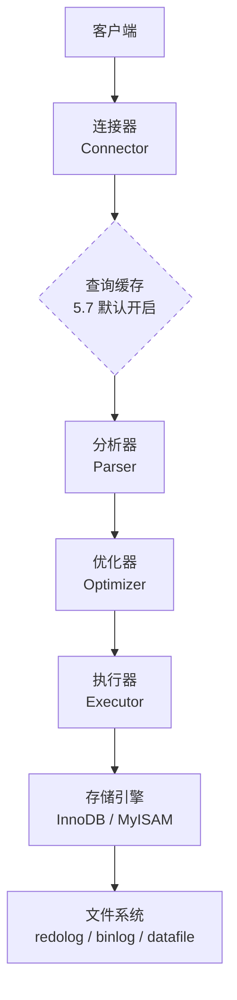
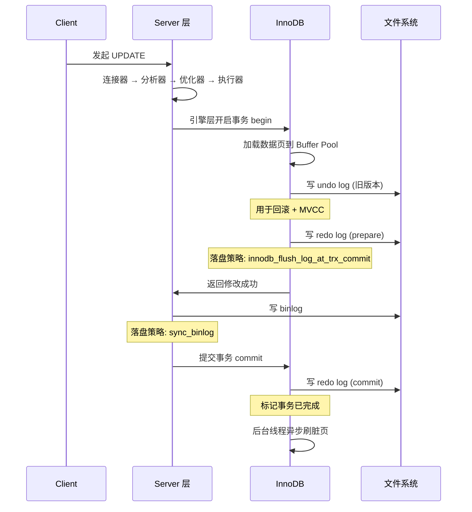

一条看似简单的 `SELECT * FROM user WHERE id = 1;`，在 MySQL 5.7 内部其实穿越了多层组件、多个内存数据结构、多种日志，才最终把结果返回给你。本文以 **MySQL 5.7** 为基线（其核心机制在 5.7 / 8.0 之间高度一致，差异点会单独标注），从一名数据库内核工程师的视角，把这条链路完整拆开。

<!--more-->

## 一、MySQL 整体架构

MySQL 采用经典的「分层 + 插件化引擎」架构，分为三层：



**Server 层**是 MySQL 自己的代码（连接器、分析器、优化器、执行器），大部分 MySQL 特性都在这里实现；**存储引擎层**是插件式的（InnoDB、MyISAM、Memory 等），负责数据的存取；InnoDB 自 MySQL 5.5 之后成为默认引擎，本文主要围绕 InnoDB 展开。

## 二、一条 SELECT 的执行链路

以 `SELECT * FROM user WHERE id = 1;` 为例：

### 1. 连接器（Connector）

客户端发起 TCP 握手后，连接器负责：

- **身份认证**：用 `user` 表里的账号、密码、host 三元组校验
- **权限读取**：认证通过后，把该用户的权限读进内存（**之后这条连接的所有权限判断都用这份内存副本**）
- **连接管理**：维护连接池。长连接 vs 短连接的取舍：长连接省 TCP/认证开销但会累积内存碎片（`mysql_reset_connection` 可重置）

注意：**权限变更不会立即生效**——连接里缓存的权限只在该连接新建时才会刷新。`FLUSH PRIVILEGES` 只是清缓存，不会主动踢掉已建立的连接。

### 2. 查询缓存（Query Cache，5.7 反模式）

MySQL 5.7 中，**查询缓存默认开启**（默认 `query_cache_type=1` ON，`query_cache_size=1048576` ≈ 1MB，`query_cache_limit=1MB`）。注意：**MySQL 5.7.20 起官方已将 Query Cache 标记为 deprecated**——5.7 内仍可用，但官方明确建议新部署中关闭；8.0 干脆把这个组件**整块移除**，社区早有共识这是个失败的设计。Server 收到一条 SELECT 后，先拿 SQL 文本做哈希去缓存里查：

- **命中**：直接返回缓存结果，跳过分析器、优化器、执行器、InnoDB 全链路
- **未命中**：正常往下走，最后把结果写回缓存

听起来很美，但生产中几乎没人敢开它，原因有四：

1. **命中率极低**：SQL 必须**完全一致**才命中（任何空格、注释、大小写差异都 miss），业务代码里拼接出来的 SQL 几乎不可能复用
2. **写放大严重**：只要该表上发生一次写操作，**整张表的所有缓存全部失效**——高写比场景下命中率趋近于零
3. **单线程串行**：查询缓存的读写都需要获取一个全局互斥锁（`Query Cache Mutex`），高并发下反而成为瓶颈
4. **缓存碎片**：连续分配小块内存，长期运行后产生大量碎片，需要 `FLUSH QUERY CACHE` 或重启清理

**生产建议**：在 `my.cnf` 里加上：

```ini
query_cache_type = 0
query_cache_size = 0
```

`query_cache_type = 0` 完全禁用，`query_cache_size = 0` 不分配内存。即使留着默认值 1MB 不动，并发一上来也够呛。后续 8.0 版本干脆把这个组件**整块移除**，社区早有共识这是个失败的设计。

### 3. 分析器（Parser）

- **词法分析**：把 SQL 切成 token 序列，识别 `SELECT`、`user`、`id` 等关键字、标识符、常量
- **语法分析**：按语法规则生成**解析树（AST）**。语法错误在这一步就会被拒
- **语义检查**：表、列是否存在（这一步只做存在性检查，不做权限校验）

### 4. 优化器（Optimizer）

优化器决定 SQL 的「物理执行方式」。它的工作是：

- **索引选择**：表上有多个索引时，选哪个（或全表扫描）
- **JOIN 顺序**：多表 JOIN 时，按什么顺序连接代价最小
- **子查询转 JOIN**、**外连接转内连接** 等等价变换
- **代价估算**：基于统计数据（行数、索引基数、页数等）走 CBO（Cost-Based Optimizer）

产出物是**执行计划**，可用 `EXPLAIN` 查看。优化器选错索引是性能问题的常见根因，但**不要轻易用 `FORCE INDEX`**，先看统计信息是否过期。

### 5. 执行器（Executor）

按执行计划逐步执行：

- 根据表的引擎调用对应 API：`InnoDB` 调用 `handler::index_read`、`ha_innobase:: rnd_next` 等
- 在 Server 层做 **WHERE 条件过滤**、**数据格式化**
- 排序（`ORDER BY`）、聚合（`GROUP BY`）、去重（`DISTINCT`）等都在 Server 层完成（除非下推到引擎）

注意一个细节：**索引下推（ICP, Index Condition Pushdown）** —— 在 MySQL 5.6 之后，部分 WHERE 条件下推到 InnoDB 引擎层，能减少回表。

### 6. InnoDB：真正把数据读出来

到了 InnoDB 这里，逻辑是：

1. **Buffer Pool 查找**：先看 `id = 1` 这条记录所在的数据页是否在内存。命中则直接返回；未命中则从磁盘加载（异步预读 + LRU 淘汰）
2. **索引查找**：默认走**主键聚簇索引**（id 是主键）。如果 id 上有二级索引，先二级索引 → 拿到主键 → 回聚簇索引（**回表**）
3. **返回数据**：把行数据返回给 Server 层

## 三、一条 UPDATE 的完整生命周期（重头戏）

`UPDATE user SET name = 'tony' WHERE id = 1;` 远比 SELECT 复杂，因为它牵涉到**事务、持久性、一致性、并发**四大难题。

### 关键概念：两阶段提交（2PC）

在讲流程前，必须先理解 InnoDB 的两个核心日志：

| 日志 | 谁写 | 用途 |
|------|------|------|
| **redo log** | InnoDB | 崩溃恢复（crash-safe），保证已提交事务不丢 |
| **binlog** | MySQL Server | 主从复制 + point-in-time recovery，归档日志 |

二者目标不同：redo log 是**物理 + 逻辑**混合日志，记录的是「在某个数据页做了什么修改」，循环写，固定大小；binlog 是**逻辑**日志，记录的是「行的变更」，追加写，可以归档。

**问题来了**：如果 redo log 写了但 binlog 没写，崩溃后从库会少数据；如果 binlog 写了但 redo log 没写，主库重启后这条修改会丢失。**两阶段提交就是为了让这两个日志原子地完成「要么都成功，要么都失败」**。

### UPDATE 执行链路



**逐步拆解：**

1. **加载数据页**：从 Buffer Pool（或磁盘）拿到 `id = 1` 的数据页。如果该记录被其他事务锁住（行锁/间隙锁），按隔离级别等待或报死锁
2. **写 undo log**：把 `id = 1` 的**旧值**记到 undo log，同时记下事务 ID 和回滚指针。这有两个用途：
   - 事务回滚时反向补偿
   - 实现 **MVCC**（多版本并发控制）
3. **写 redo log（prepare）**：在 Buffer Pool 里修改数据页（先改内存），同时把「对哪个数据页做了什么修改」写到 redo log buffer，标记为 `prepare` 状态
4. **写 binlog**：Server 层把这条 UPDATE 的逻辑变更（SET name='tony' WHERE id=1）写入 binlog cache，然后按 `sync_binlog` 策略刷盘
5. **写 redo log（commit）**：InnoDB 在 redo log 中标记该事务为 `commit` 状态。两阶段提交完成
6. **后台异步**：Buffer Pool 里的脏页由后台 master 线程按 checkpoint 机制刷回磁盘（不阻塞事务返回）

### crash 时的恢复逻辑

- 启动时 InnoDB 扫描 redo log：
  - 如果 redo log 是 `commit` 状态 → **应用 redo log**（事务已落地）
  - 如果 redo log 是 `prepare` 状态 → 看 binlog 是否完整：
    - binlog 完整 → **提交事务**（应用 redo log）
    - binlog 不完整 → **回滚**（用 undo log）
  - 如果 redo log 都没有 → 丢弃

这就是「**用 binlog 当 redo log 的提交凭证**」的设计妙处。

### MVCC：让读不阻塞写

UPDATE 在写 undo log 时，会记录一个**事务 ID 和回滚指针**。当其他事务执行 SELECT 时：

- **快照读**（普通 SELECT）：InnoDB 根据事务启动时的 **Read View** 判断哪个版本可见。版本链：当前数据 → 回滚指针 → undo log 里更早的版本。**读不加锁**，读写不冲突
- **当前读**（`SELECT ... LOCK IN SHARE MODE`、`SELECT ... FOR UPDATE`、UPDATE、DELETE）：读到最新已提交版本，**加锁**

这就是 **RR 隔离级别下 MVCC + 一致性读** 的精髓：避免了大量读-写锁冲突。

### 锁机制（避免脏写）

UPDATE 的「写」不是无锁的。InnoDB 在 RR 隔离级别下：

- **行锁（Record Lock）**：锁索引上的具体记录
- **间隙锁（Gap Lock）**：锁索引记录之间的间隙，防止其他事务在该范围内插入新记录（**解决幻读**）
- **临键锁（Next-Key Lock）**：行锁 + 间隙锁的合体，默认加这个

死锁检测是 InnoDB 自动做的：发现环路后回滚代价更小的事务，抛 `Deadlock found`。

## 四、完整流程图

把 SELECT 和 UPDATE 放在一起看：


## 五、实战调优建议

理解了链路，调优就不再是猜：

| 现象 | 排查方向 | 工具 |
|------|----------|------|
| SQL 慢 | 优化器选错索引？统计信息过期？ | `EXPLAIN`、`SHOW INDEX FROM t`、`ANALYZE TABLE t` |
| 写慢 | 锁等待？redo log 刷盘策略？ | `SHOW ENGINE INNODB STATUS`、`INFORMATION_SCHEMA.INNODB_TRX` |
| Buffer Pool 命中率低 | `innodb_buffer_pool_size` 不够？LRU 被全表扫描污染？ | `SHOW STATUS LIKE 'Innodb_buffer_pool_read%'` |
| 主从延迟 | binlog 写入慢？大事务？从库单线程回放？ | `SHOW SLAVE STATUS`、`SHOW MASTER STATUS` |
| 死锁频繁 | 间隙锁范围过大？事务太长？ | `SHOW ENGINE INNODB STATUS` 的 `LATEST DETECTED DEADLOCK` 段 |

几个关键参数的取舍：

- `innodb_flush_log_at_trx_commit`：1（最安全，每次提交刷盘） / 0（每秒刷盘，最快但可能丢 1s 数据） / 2（OS cache 刷盘，主库宕机丢，从库宕机不丢）。**金融场景必须 1**
- `sync_binlog`：默认 0（OS 决定刷盘时机），高可靠场景设为 1
- `innodb_buffer_pool_size`：通常设为物理内存的 **50%-70%**，过小会频繁换页
- `innodb_log_file_size`：单个 redo log 文件大小（5.7 默认 48MB），配合 `innodb_log_files_in_group`（默认 2），**总 redo log 容量默认 96MB**。生产建议 1-4GB，过小会导致 checkpoint 频繁、刷盘压力陡增；过大则崩溃恢复时间变长

## 六、写在最后

MySQL 的执行链路是个精巧的工程：

- **Server 层**用 CBO 优化器 + 插件引擎架构，实现了「一份 SQL 多种存储」
- **InnoDB** 用 Buffer Pool 做内存加速，用 undo log + redo log + binlog 三件套 + 两阶段提交解决持久性和一致性
- **MVCC** 让读不阻塞写，**行锁 + 间隙锁** 让写不脏写
- 整个系统对**ACID** 的实现是「分层 + 协同」的结果：原子性靠 undo log，持久性靠 redo log + binlog，隔离性靠锁 + MVCC，一致性靠前三者的合谋

理解了这条链路，你就不会再去死记那些「MySQL 调优 100 条」——因为你看到的每一条参数、每一个报错，都有它准确的因果定位。

---

**参考：**

- 《High Performance MySQL》— Silvia Botros 等
- MySQL 5.7 Reference Manual：InnoDB 存储引擎章节（https://dev.mysql.com/doc/refman/5.7/en/innodb-storage-engine.html）