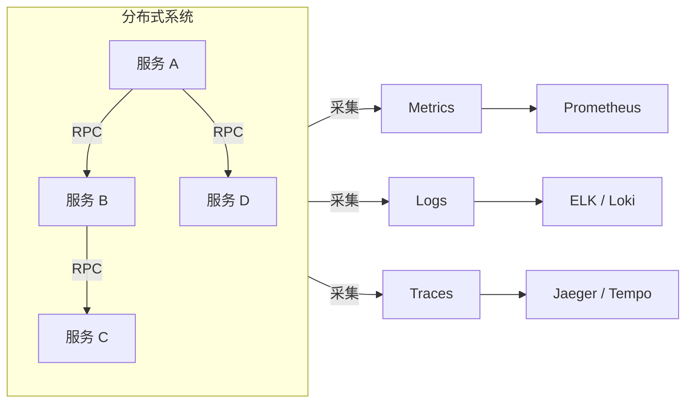
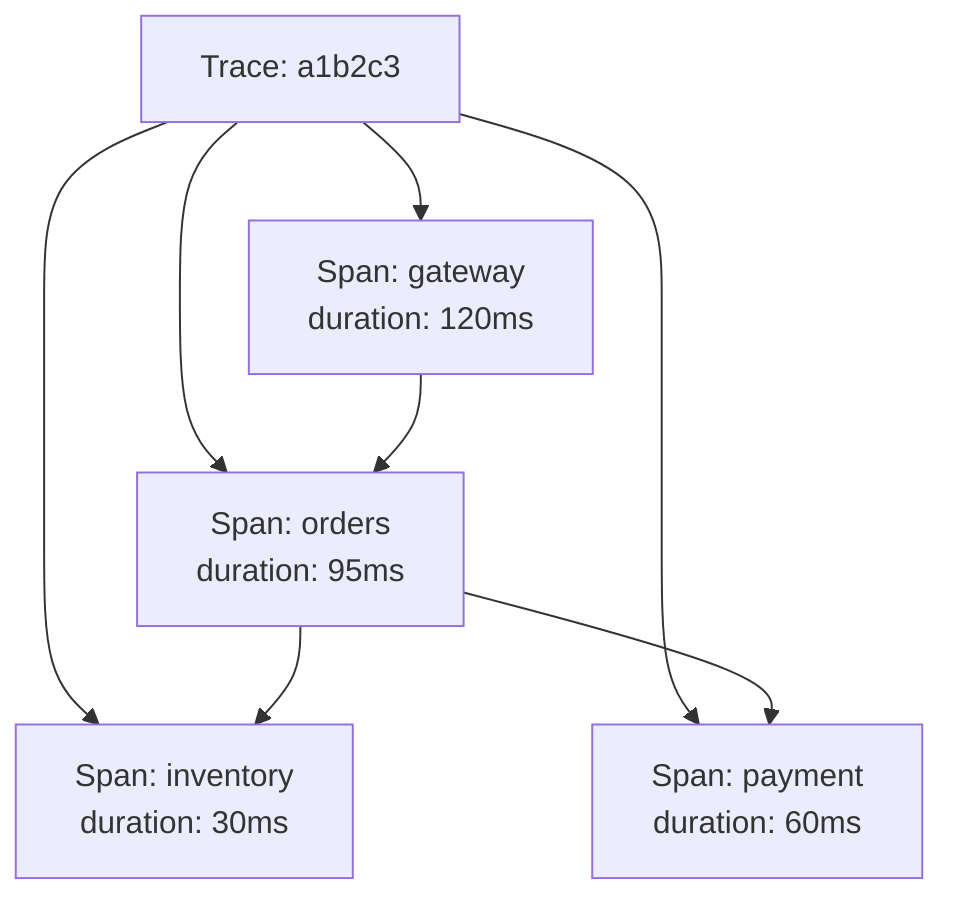
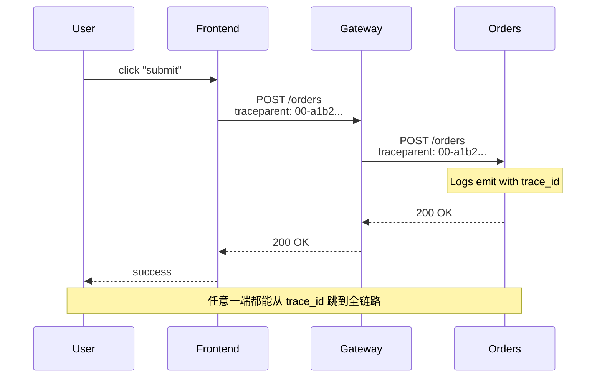

2017 年 Pinterest 工程团队在 SREcon 上分享其监控平台 Bender 时展示过一组数字：单业务域的时序指标规模动辄上万，传统告警体系面对每天数百条告警已经疲于奔命，但工程师真正关心的"这个请求为什么慢"却往往无解。那个时刻暴露了一个被广泛忽视的事实——传统监控（Monitoring）解决的是"系统是否在运行"，而真正想回答"系统为什么这样运行"，需要的是可观测性（Observability）。

监控与可观测性不是同义词。监控是一组预定义的仪表盘和告警规则，依赖"已知未知"——你必须先想象故障形态。可观测性是一套能从系统外部行为反推内部状态的能力，依赖"未知未知"——即使面对从未发生过的故障，也能从足够丰富的遥测数据中推断根因。

<!--more-->

## 一、可观测性的定义与三大支柱

CNCF Observability TAG 的白皮书给出一个工程化定义：**可观测性是通过系统产生的输出（遥测数据）来推断其内部状态的能力**。这个能力有三个量化维度：

- **解释过去**：当故障已经发生，能定位到具体时间、组件与请求
- **理解当下**：实时呈现系统的健康度、流量、错误率
- **预测未来**：从趋势、关联关系中预判容量与风险

Google SRE Book 中《Monitoring Distributed Systems》一章明确指出，遥测数据有三种形态——Metrics、Logs、Traces，即"三大支柱"。三者在数据模型、采样成本、查询模式上有本质差异，**任何一种都无法被另外两种完全替代**。



## 二、Metrics：聚合后的数值信号

Metrics 是带时间戳的数值序列，本质是**预聚合**——在采集端就完成求和、求平均、分位数等操作。它的核心优势是**成本极低**：一个指标点通常只有 40-80 字节（OpenMetrics 规范），单实例每秒采集数千指标对存储和查询压力都不大。

Metrics 适合回答"整体如何"，但很难回答"具体哪一个请求"。

### 四种指标类型

| 类型 | 含义 | 示例 |
|------|------|------|
| **Counter** | 单调递增 | `http_requests_total` |
| **Gauge** | 任意上下波动 | `node_memory_bytes` |
| **Histogram** | 分桶统计分布 | `http_request_duration_seconds_bucket` |
| **Summary** | 客户端预计算分位数 | `rpc_latency_seconds{quantile="0.99"}` |

### RED 与 USE 框架

生产环境的 Metrics 采集不必从零设计。两个成熟范式可以直接套用：

- **RED 方法**（来自 Tom Wilkie，Weaveworks）：聚焦服务视角，关注 **R**ate（请求速率）、**E**rror（错误率）、**D**uration（延迟）
- **USE 方法**（来自 Brendan Gregg）：聚焦资源视角，关注 **U**tilization（使用率）、**S**aturation（饱和度）、**E**rrors（错误）

一个订单服务的 RED 仪表盘应当包含：

```promql
# 每秒请求数
rate(http_requests_total{job="orders"}[5m])

# 错误率
sum(rate(http_requests_total{job="orders",status=~"5.."}[5m]))
  / sum(rate(http_requests_total{job="orders"}[5m]))

# P99 延迟
histogram_quantile(0.99,
  rate(http_request_duration_seconds_bucket{job="orders"}[5m]))
```

## 三、Logs：离散事件的完整叙述

Logs 是带时间戳的离散事件记录，本质是**完整叙述**——它保留请求的全部上下文（用户 ID、参数、堆栈），但代价是**存储爆炸**。一份普通 Java 应用 INFO 级别日志，每秒可产生数 MB 文本；一个月下来轻松突破 TB 量级。

### 结构化日志

生产级日志必须**结构化**——JSON 优于纯文本，原因有三：

- 可索引（按字段精确过滤，而非正则匹配）
- 可聚合（直接做 SQL-like 查询）
- 可关联（通过 `trace_id` 与 Traces 互查）

```json
{
  "timestamp": "2021-03-15T09:42:11.038Z",
  "level": "INFO",
  "service": "orders",
  "trace_id": "a1b2c3d4e5f6...",
  "span_id": "f6e5d4c3b2a1...",
  "user_id": 47291,
  "order_id": "O20210315-0042",
  "message": "order created",
  "duration_ms": 87
}
```

注意 `trace_id` 与 `span_id`——这是 Logs 与 Traces 互联的桥梁。从一条 ERROR 日志跳转到完整调用链，只需要一次点击。

## 四、Traces：因果关系的时空图谱

Traces 记录单个请求在分布式系统中的完整路径。它解决 Metrics 和 Logs 都回答不了的问题：**"这个慢请求到底卡在哪一跳？"**

### 数据模型



- **Trace**：一个完整请求，由若干 Span 组成
- **Span**：一次具体操作（RPC、DB 查询、缓存访问），包含起止时间、属性、状态
- **Context Propagation**：通过 `traceparent` header（W3C Trace Context 规范）在服务间传递

### 采样策略

完整记录每个 Trace 的成本极高——一个电商下单链路可能跨 20+ 服务，每秒数千订单意味着每秒数万 Span。生产环境必须采样：

| 策略 | 规则 | 适用场景 |
|------|------|----------|
| **恒定采样** | 始终采 1% 或 10% | 流量稳定 |
| **比率采样** | 按概率随机采 | 通用 |
| **头部采样** | 入口网关决定是否采，传递决策 | 全链路一致 |
| **尾部采样** | 收集后基于规则决定保留 | 错误/慢请求全采 |

OpenTelemetry 1.0 于 2021-02 GA，统一了 OpenTracing 和 OpenCensus 两套 API，是 Traces 标准化进程中的标志性事件。

## 五、上下文传播：三大支柱的连接器

如果三大支柱是孤岛，可观测性就是空谈。**Context Propagation** 通过标准化 header 把三者串起来：

```text
traceparent: 00-a1b2c3d4e5f6a7b8c9d0e1f2a3b4c5d6-1234567890abcdef-01
```

这个 header 同时携带 Trace 上下文。日志采集器识别它后写入 `trace_id` 字段；前端监控 SDK 识别它后与浏览器性能条目对齐。



## 六、常见工程陷阱

**陷阱 1：用 Metrics 替代 Traces**

Metrics 告诉你"平均延迟上升了 200ms"，但不会告诉你"是某一个用户的某一类请求在卡"。一旦需要定位个体故障，Traces 是不可替代的——这是"长尾问题"的本质。

**陷阱 2：日志采样丢失上下文**

有人为了节省成本对 INFO 日志采样 10%。但这会让排障时**90% 的请求根本看不见**——结构化日志应当保留全部 DEBUG 之外的级别，靠**保留期**和**冷热分层**而非采样来控制成本。

**陷阱 3：Traces 链路不全**

只对核心服务埋点，Nginx、Sidecar、消息队列、数据库都是盲区。一次"慢"的根因经常藏在没人想到的地方（DNS、TCP 重传、连接池等待）。OpenTelemetry 的 `instrumentation` 自动探针可以低成本覆盖。

**陷阱 4：高基数爆炸**

把 `user_id`、`order_id` 当作 Metrics label 会导致时序基数爆炸——一个百万用户的系统，单指标点即可膨胀到百万级。**Metrics label 必须低基数**，高基数数据应进 Traces 或 Logs。

## 七、落地路径：从监控走向可观测

一个团队的演进路线通常是：

| 阶段 | 形态 | 工具组合（参考） |
|------|------|----------------|
| L1 黑盒监控 | 仅 Metrics + 告警 | Prometheus + Alertmanager |
| L2 关联排障 | 加入结构化 Logs | + ELK 或 Loki |
| L3 全链路追踪 | 加入 Traces | + Jaeger 或 Tempo |
| L4 统一观测 | OpenTelemetry 统一采集 | OTel SDK + Collector + 后端解耦 |

L4 阶段的关键收益是**采集端与后端解耦**——前端/服务端 SDK 用 OpenTelemetry 统一写入，数据可以同时发给 Prometheus、Jaeger、Sentry 等多个后端，避免被某一个商业方案绑定。

## 八、小结

三大支柱不是非此即彼，而是**互补关系**：

- Metrics 告诉你**系统整体怎样**（成本低、易告警）
- Logs 告诉你**具体发生了什么**（完整上下文、代价高）
- Traces 告诉你**因果链条是什么**（路径与依赖、采样复杂）

工程落地的关键不是选哪一套工具，而是**保证上下文传播链不断裂**——一次端到端的请求，从浏览器到网关到服务到数据库，所有节点都能通过同一个 `trace_id` 串起来。

当三者真正连成一张网，"线上为什么慢"就不再依赖某个工程师的直觉，而是一组可查询、可下钻、可复现的客观事实。

## 更新记录

- **2021-02**：OpenTelemetry 1.0 GA，统一了此前 OpenTracing 与 OpenCensus 的 API 阵营
- **2021-06**：Grafana 8.0 GA，将 Loki/Tempo/Explore 整合到统一 UI
- **2022 之后**：eBPF 技术成熟，Cilium/Parca 等基于 eBPF 的可观测性方案成为 Metrics/Traces 的新数据源，特别是无需应用改造的自动探针场景
- **2023+**：OpenTelemetry Collector 在生产环境大规模替代传统 Agent，Profile 数据（持续剖析）开始与 Traces 融合
