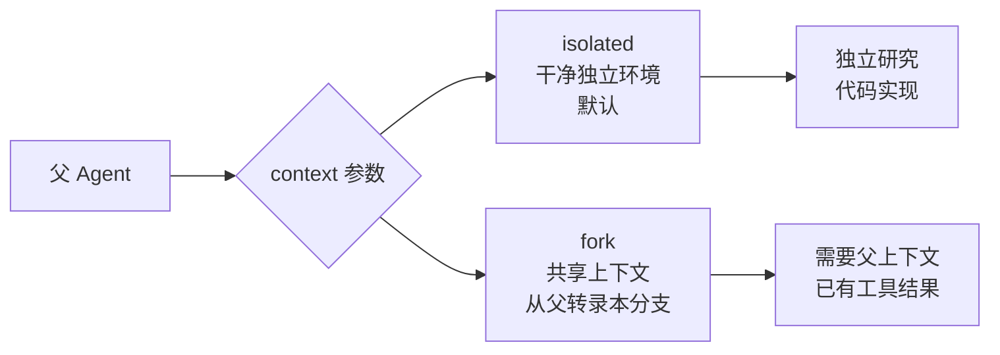
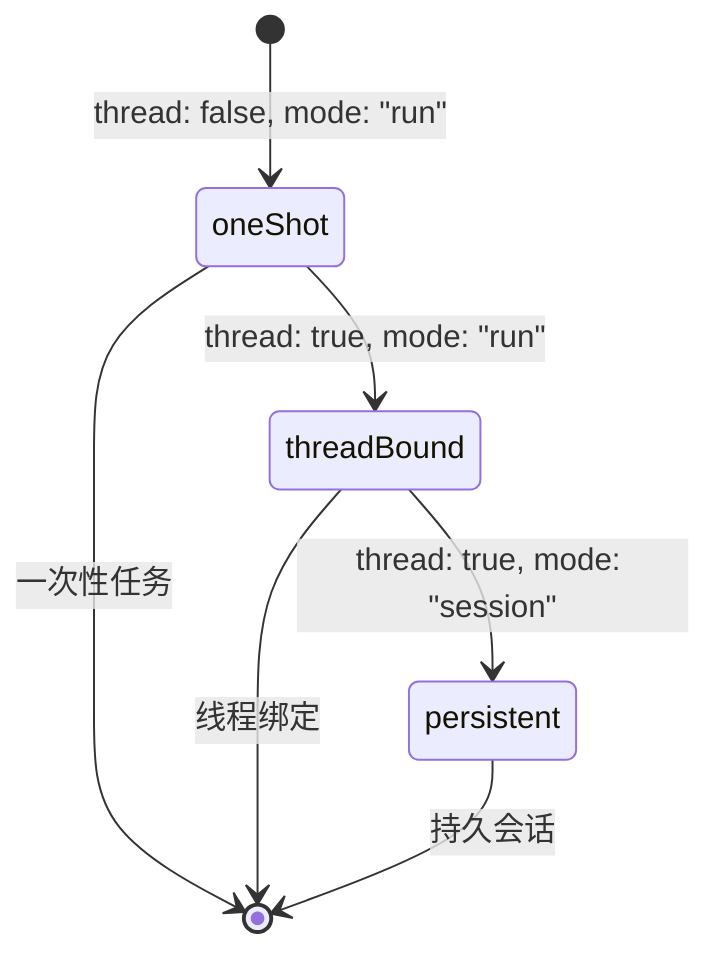
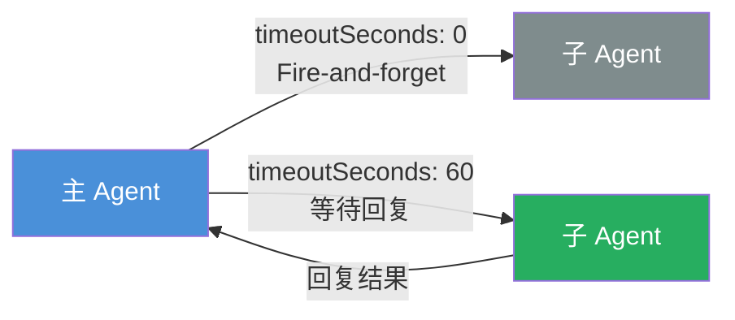
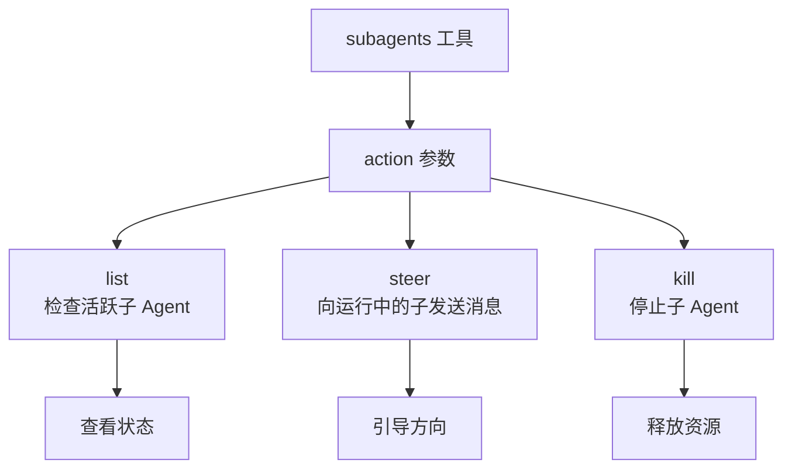
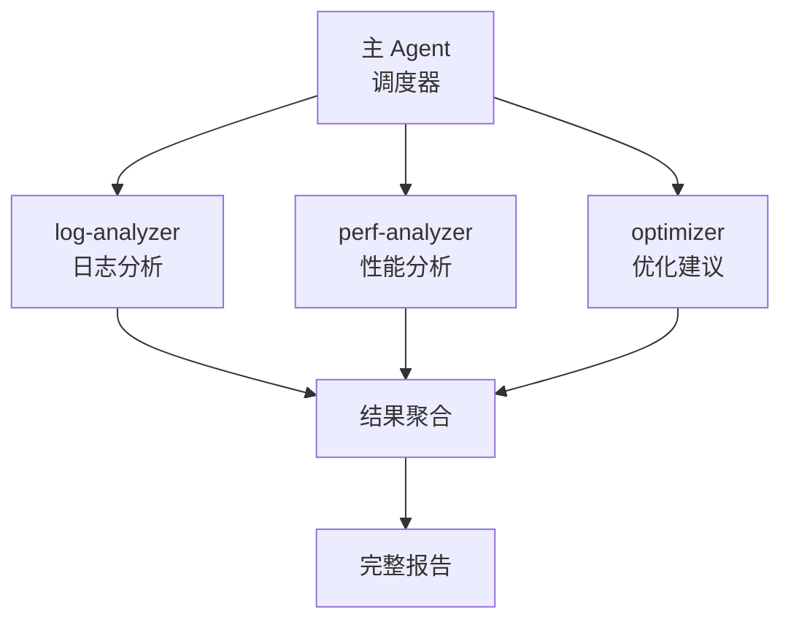
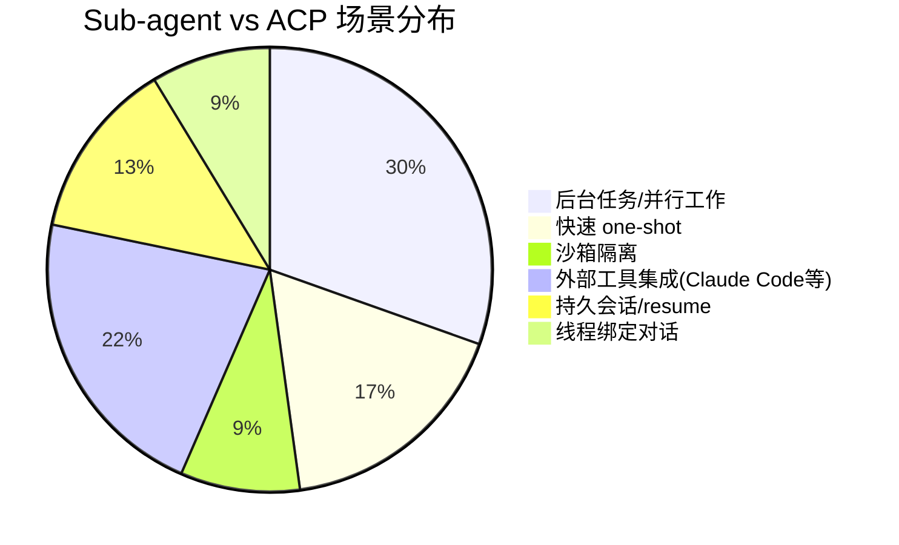

# OpenClaw ACP 会话：如何让 AI Agent 协同工作

> 你有没有想过，一个 AI Agent 发号施令，多个专业 Agent 并行干活，听起来像是科幻片的设定，其实在 OpenClaw 里已经实现了。

## 引言

现代 AI 应用越来越复杂，单一 Agent 的能力往往有上限。想象一下：你需要一个 Agent 做代码审查，另一个做性能分析，还有一个负责汇总报告——这时候，**Agent 之间的协同工作**就成了刚需。

OpenClaw 给出的答案就是 **ACP（Agent Client Protocol）**——一个基于 JSON-RPC 2.0 扩展的通信协议。它让主 Agent 能够无缝调度外部专业编码 harness（如 Claude Code、Codex、Qwen Code 等），实现真正的 Agent-to-Agent 协作。

这篇文章，我们来把 ACP 会话的核心用法彻底讲清楚。

---

## 1. 什么是 ACP 会话

ACP 是 OpenClaw 设计的一套通信协议，核心目标是**让多个 AI Agent 能够互相通信、协同任务**。

它的几个关键特点：

- **运行在外部 harness 进程中**：ACP 会话并不运行在 OpenClaw 主进程里，而是跑在 Claude Code、Codex、Gemini CLI 等外部工具中
- **被追踪为后台任务**：每个 ACP 会话在 OpenClaw 中都有迹可循，可查询状态、可获取结果
- **支持丰富的会话特性**：对话绑定、线程绑定、持久会话等高级特性全支持
- **触发方式灵活**：通过 `/acp` 命令或 `sessions_spawn({ runtime: "acp" })` 即可启动

Session Key 的格式长这样：`agent:<agentId>:acp:<uuid>`，唯一标识一个 ACP 会话。

---

## 2. sessions_spawn：如何派生子 Agent

`sessions_spawn` 是 ACP 的核心 API，用于**派生一个子 Agent 去执行任务**。

### 核心参数一览

| 参数 | 类型 | 默认值 | 说明 |
|------|------|--------|------|
| `task` | string | **必填** | 子 Agent 的任务描述 |
| `label` | string | - | 可读标签，方便追踪 |
| `agentId` | string | - | 托管目标（需 `subagents.allowAgents` 允许） |
| `runtime` | `"subagent"` \| `"acp"` | `"subagent"` | 运行时类型 |
| `mode` | `"run"` \| `"session"` | `"run"` | 运行模式 |
| `context` | `"isolated"` \| `"fork"` | `"isolated"` | 上下文模式 |
| `runTimeoutSeconds` | number | `0` | 超时秒数（0=无超时） |
| `cleanup` | `"delete"` \| `"keep"` | `"keep"` | 完成后删除策略 |

### context 参数：isolated vs fork

这一参数决定了子 Agent 能看到多少父 Agent 的上下文：



### thread + mode 组合



---

## 3. sessions_send：向子 Agent 发消息

`sessions_spawn` 只是**启动**一个子 Agent，真正实现双向通信要靠 `sessions_send`。



### sessions_send 核心参数

| 参数 | 类型 | 必填 | 说明 |
|------|------|------|------|
| `sessionKey` | string | 否 | 目标会话 key |
| `label` | string | 否 | 标签定位目标（二选一） |
| `message` | string | **是** | 发送的消息 |
| `timeoutSeconds` | number | 否 | 等待回复超时（0=立即返回） |

---

## 4. 辅助工具一览

除了 `sessions_spawn` 和 `sessions_send`，OpenClaw 还提供了一系列辅助工具：

### sessions_list：查看会话列表

```javascript
{
  "kinds": ["main", "subagent"],    // 过滤会话类型
  "activeMinutes": 10,              // 最近活跃时间
  "messageLimit": 3                 // 每条会话显示最近几条消息
}
```

### sessions_history：读取历史转录本

```javascript
{
  "sessionKey": "agent:main:subagent:xyz",
  "includeTools": false,
  "limit": 20
}
```

### sessions_yield：主动让出主轮次

```javascript
sessions_spawn({ task: "分析数据", runtime: "subagent" })
sessions_yield()
// 下一条消息将收到子 Agent 完成通知
```

主 Agent 调用 `sessions_yield()` 后可以继续处理其他事情，等子 Agent 完成后 OpenClaw 会主动通知。

### subagents：控制子 Agent 生命周期



---

## 5. 实际应用场景

理解了 API，来看看这些场景怎么落地。

### 场景一：并行代码审查

一个常见的工程场景——同时审查多个模块的代码质量：

```javascript
sessions_spawn({
  task: "审查 /src/auth 模块的代码质量、安全漏洞和性能问题",
  label: "auth代码审查",
  runtime: "subagent",
  model: "anthropic/claude-sonnet-4-6",
  runTimeoutSeconds: 300
})

sessions_spawn({
  task: "审查 /src/api 模块的代码质量、安全漏洞和性能问题",
  label: "api代码审查",
  runtime: "subagent",
  model: "anthropic/claude-sonnet-4-6",
  runTimeoutSeconds: 300
})
```

两个子 Agent 并行启动，各自审查不同模块，主 Agent 等待两者结果汇总，效率翻倍。

### 场景二：跨 Agent 任务协作

让专业 Agent 做专业的事：

```javascript
sessions_send({
  agentId: "coding",
  message: "生成依赖分析报告，包含：1) 依赖树 2) 版本冲突 3) 安全漏洞",
  timeoutSeconds: 120
})
```

通过 `agentId` 直接向特定 Agent 发消息，获取专业化输出。

### 场景三：子 Agent 结果聚合

多阶段分析流水线：



```javascript
sessions_spawn({ task: "分析日志错误", label: "log-analyzer", ... })
sessions_spawn({ task: "分析性能瓶颈", label: "perf-analyzer", ... })
sessions_spawn({ task: "生成优化建议", label: "optimizer", ... })

sessions_yield()
// 下一条消息收到聚合结果
```

三个子 Agent 分别处理日志分析、性能分析、优化建议，最后主 Agent 汇总成完整报告。

---

## 6. ACP vs Sub-agent：怎么选？



---

## 总结

ACP 会话是 OpenClaw 实现多 Agent 协作的核心机制。通过 `sessions_spawn` 派生子 Agent、`sessions_send` 进行双向通信、再配合 `sessions_yield` 和 `subagents` 等辅助工具，我们可以构建出复杂的多 Agent 工作流水线。

关键要记住的几点：

1. **`context` 参数决定上下文是否共享**：`isolated` 是干净的独立环境，`fork` 则共享父 Agent 上下文
2. **`timeoutSeconds` 控制等待策略**：设为 0 就是 fire-and-forget，设具体数值则等待回复
3. **选对运行时**：需要外部专业工具选 ACP，简单并行任务用 Sub-agent 更轻量

多 Agent 协作让 AI 系统从"单兵作战"进化到"团队配合"，而 ACP 就是这套协作机制的通信协议。学会用它，相当于给你的 AI 系统装上了一个可扩展的任务调度中枢。

---

*更多关于 OpenClaw 和 AI Agent 的实践，欢迎持续关注。*