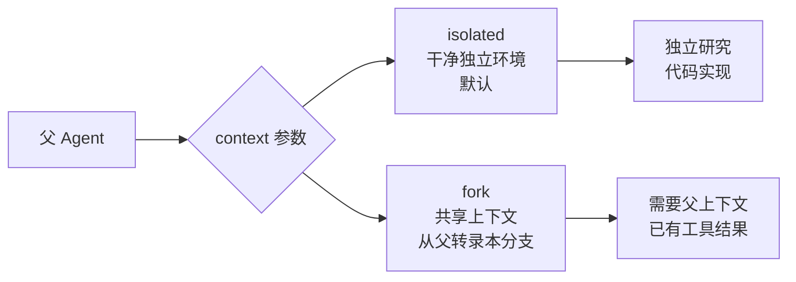
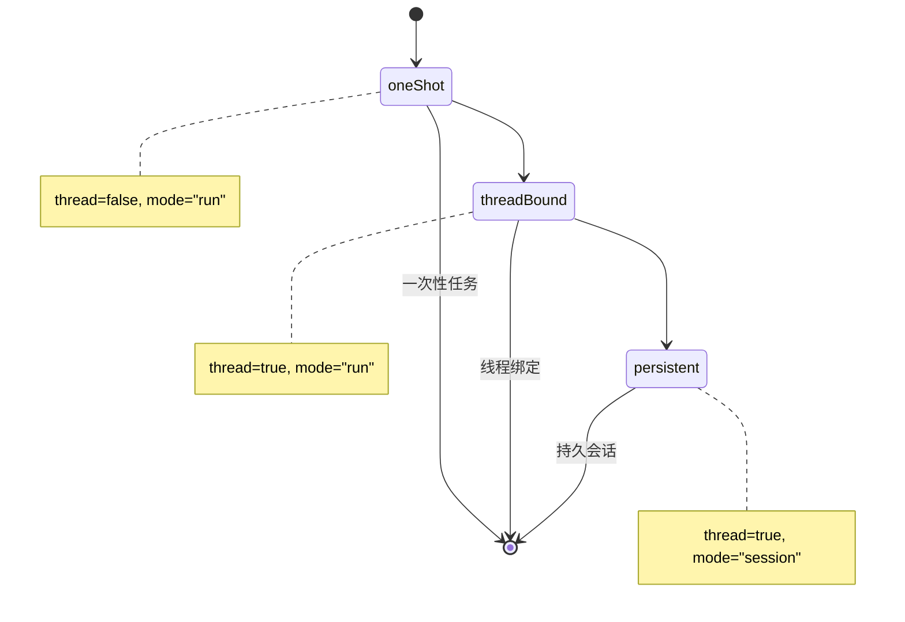
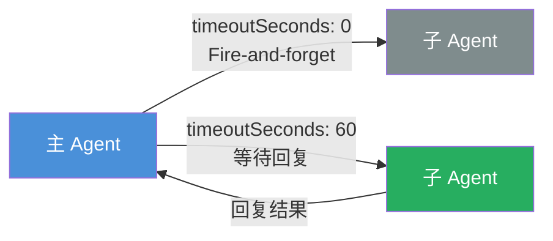
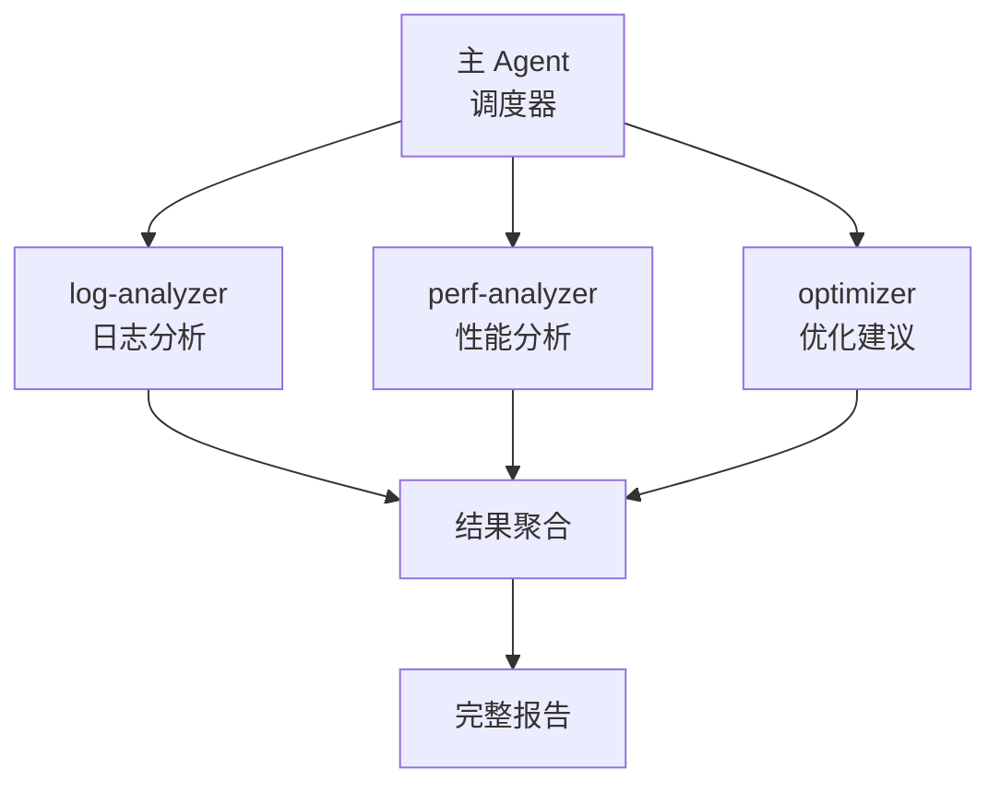

你有没有想过，让 AI Agent 去调度其他 AI Agent（如 Claude Code、Codex）来协同工作？听起来像是科幻片的设定，其实在 OpenClaw 里已经实现了。

现代 AI 应用越来越复杂，单一 Agent 的能力往往有上限。想象一下：你需要一个 Agent 做代码审查，另一个做性能分析，还有一个负责汇总报告——这时候，**Agent 之间的协同工作**就成了刚需。

<!--more-->

OpenClaw 给出的答案就是 **ACP（Agent Client Protocol）**——一个基于 JSON-RPC 2.0 扩展的通信协议。ACP 让 OpenClaw 能够无缝调度外部专业编码 harness（如 Claude Code、Codex、Qwen Code 等），实现真正的 Agent-to-Agent 协作。

这篇文章，我们来把 ACP 会话的核心用法彻底讲清楚。

## 1. 什么是 ACP 会话

ACP 是 OpenClaw 设计的一套通信协议，核心目标是**让 OpenClaw 能够调度外部 AI Agent（如 Claude Code）来协同完成任务**。

它的几个关键特点：

- **运行在外部 harness 进程中**：ACP 会话并不运行在 OpenClaw 主进程里，而是跑在 Claude Code、Codex、Gemini CLI 等外部工具中
- **被追踪为后台任务**：每个 ACP 会话在 OpenClaw 中都有迹可循，可查询状态、可获取结果
- **支持丰富的会话特性**：对话绑定、线程绑定、持久会话等高级特性全支持
- **触发方式灵活**：通过 `/acp` 命令或 `sessions_spawn({ runtime: "acp" })` 即可启动
- **支持会话恢复**：可通过 `resumeSessionId` 重放对话历史

Session Key 的格式长这样：`agent:<agentId>:acp:<uuid>`，唯一标识一个 ACP 会话。

## 2. sessions_spawn：如何派生子 Agent

`sessions_spawn` 是 ACP 的核心 API，用于**派生一个子 Agent 去执行任务**。

### 核心参数一览

| 参数 | 类型 | 默认值 | 说明 |
|------|------|--------|------|
| `task` | string | **必填** | 子 Agent 的任务描述 |
| `label` | string | - | 可读标签，方便追踪 |
| `agentId` | string | - | 托管目标（需 `subagents.allowAgents` 允许） |
| `runtime` | string | `"subagent"` | 运行时类型：`"subagent"` 或 `"acp"` |
| `mode` | string | `"run"` | 运行模式：`"run"` 或 `"session"` |
| `context` | string | `"isolated"` | 上下文模式：`"isolated"` 或 `"fork"` |
| `runTimeoutSeconds` | number | `0` | 超时秒数（0=无超时） |
| `cleanup` | string | `"keep"` | 完成后删除策略：`"delete"` 或 `"keep"` |

### context 参数：isolated vs fork

这一参数决定了子 Agent 能看到多少父 Agent 的上下文：



### thread + mode 组合



## 3. sessions_send：向子 Agent 发消息

`sessions_spawn` 只是**启动**一个子 Agent，真正实现双向通信要靠 `sessions_send`。



### sessions_send 核心参数

| 参数 | 类型 | 必填 | 说明 |
|------|------|------|------|
| `sessionKey` | string | 否 | 目标会话 key |
| `label` | string | 否 | 标签定位目标（二选一） |
| `message` | string | **是** | 发送的消息 |
| `timeoutSeconds` | number | 否 | 等待回复超时（0=立即返回） |

## 4. 辅助工具一览

除了 `sessions_spawn` 和 `sessions_send`，OpenClaw 还提供了一系列辅助工具：

| 工具 | 说明 |
|------|------|
| `sessions_list` | 查看会话列表，支持按 `kinds`、`activeMinutes` 过滤 |
| `sessions_history` | 读取历史转录本，支持 `includeTools`、`limit` 参数 |
| `sessions_yield` | 主动让出主轮次，等待子 Agent 完成后再收通知 |
| `subagents` | 控制子 Agent 生命周期：`list` 查看、`steer` 引导、`kill` 停止 |

```javascript
// 示例：查看最近活跃的会话
sessions_list({ kinds: ["main", "subagent"], activeMinutes: 10, messageLimit: 3 })

// 示例：读取历史
sessions_history({ sessionKey: "agent:main:subagent:abc123", limit: 20 })

// 示例：派发后让出轮次
sessions_spawn({ task: "分析数据", runtime: "subagent" })
sessions_yield()  // 下一条消息将收到子 Agent 完成通知
```

## 5. 实际应用场景

理解了 API，来看看这些场景怎么落地。

### 场景一：并行调度多个 Claude Code 审查

通过 `runtime: "acp"` 同时调度多个 Claude Code 实例审查不同模块：

```javascript
sessions_spawn({
  task: "审查 /src/auth 模块的代码质量、安全漏洞和性能问题，给出 Markdown 报告",
  label: "auth代码审查",
  runtime: "acp",
  agentId: "claude",
  context: "fork",
  runTimeoutSeconds: 300
})

sessions_spawn({
  task: "审查 /src/api 模块的代码质量、安全漏洞和性能问题，给出 Markdown 报告",
  label: "api代码审查",
  runtime: "acp",
  agentId: "claude",
  context: "fork",
  runTimeoutSeconds: 300
})
```

两个 Claude Code 实例并行启动，各自审查不同模块，主 Agent 等待两者结果汇总。

### 场景二：子 Agent 结果聚合

多阶段分析流水线，使用内部 Sub-agent：



```javascript
sessions_spawn({ task: "分析日志错误", label: "log-analyzer", ... })
sessions_spawn({ task: "分析性能瓶颈", label: "perf-analyzer", ... })
sessions_spawn({ task: "生成优化建议", label: "optimizer", ... })

sessions_yield()
// 下一条消息收到聚合结果
```

三个子 Agent 分别处理日志分析、性能分析、优化建议，最后主 Agent 汇总成完整报告。

### 场景三：调度 Claude Code 执行编码任务

通过 `runtime: "acp"` 派发 Claude Code 在独立进程中执行专业编码任务：

```javascript
sessions_spawn({
  task: "在 /workspace 中实现一个 REST API，包含用户注册、登录、获取个人信息接口，使用 Node.js + Express，代码需要包含单元测试",
  label: "claude-code-coding",
  runtime: "acp",
  agentId: "claude",
  context: "fork",
  runTimeoutSeconds: 600,
  cleanup: "keep"
})

sessions_yield()
// 等待 Claude Code 完成，接收执行结果
```

**关键配置**：
- `runtime: "acp"` 指定调度外部 Agent
- `agentId: "claude"` 指定目标外部 Agent（需先安装并启用 `@openclaw/acpx` 插件）
- `context: "fork"` 共享父 Agent 上下文
- `runTimeoutSeconds: 600` 给 10 分钟超时

**交互流程**：OpenClaw 通过 ACP 协议与 Claude Code 进程通信，下发任务指令、监控执行状态、收集结果。

## 6. ACP vs Sub-agent：怎么选？

| 场景 | 推荐运行时 | 说明 |
|------|-----------|------|
| 调度 Claude Code / Codex 等外部 Agent | ACP | 通过 ACP 协议与外部 harness 通信 |
| 快速 one-shot 后台任务 | Sub-agent | 轻量，内部执行无进程开销 |
| 需要会话恢复（resume） | ACP | 支持 `resumeSessionId` 重放对话历史 |
| 线程绑定持久对话 | ACP | 配合 `--thread auto` 创建线程绑定 |
| 沙箱隔离任务 | Sub-agent | ACP 不支持 `sandbox: "require"` |

## 7. 前置要求与限制

### 环境准备

使用 ACP 调度 Claude Code 前需安装 `@openclaw/acpx` 插件：

```bash
openclaw plugins install @openclaw/acpx
```

并在配置中启用：

```yaml
plugins:
  entries:
    acpx:
      enabled: true
```

运行 `/acp doctor` 验证后端就绪状态。

### 运行时控制命令

ACP 会话支持以下交互命令：

| 命令 | 说明 |
|------|------|
| `/acp model <provider/model>` | 切换模型 |
| `/acp permissions <profile>` | 设置审批策略 |
| `/acp timeout <seconds>` | 配置超时 |
| `/acp steer <指令>` | 向运行中的会话发送指令 |
| `/acp cancel` | 中止当前轮次 |
| `/acp close` | 结束会话 |

### 限制

- **沙箱隔离无法派生 ACP**：会话 `sandbox: "require"` 时不能使用 `runtime: "acp"`
- **非交互式会话**：需配置 `permissionMode=approve-all` 避免权限提示阻塞
- **streamTo**: 可通过 `streamTo: "parent"` 将子 Agent 的进度流式回传给主 Agent

## 总结

ACP 会话是 OpenClaw 实现多 Agent 协作的核心机制。通过 `sessions_spawn` 派生子 Agent、`sessions_send` 进行双向通信、再配合 `sessions_yield` 和 `subagents` 等辅助工具，我们可以构建出复杂的多 Agent 工作流水线。

关键要记住的几点：

1. **`context` 参数决定上下文是否共享**：`isolated` 是干净的独立环境，`fork` 则共享父 Agent 上下文
2. **`timeoutSeconds` 控制等待策略**：设为 0 就是 fire-and-forget，设具体数值则等待回复
3. **选对运行时**：需要调度 Claude Code 等外部 Agent 选 ACP，简单并行任务用 Sub-agent 更轻量

多 Agent 协作让 AI 系统从"单兵作战"进化到"团队配合"，而 ACP 就是这套协作机制的通信协议。学会用它，相当于给你的 AI 系统装上了一个可扩展的任务调度中枢。
