OpenClaw 有一套内置的 Memory 系统，基于 SQLite 实现，开箱即用。但对于需要更高搜索质量、更广索引范围的场景，OpenClaw 提供了一个更强大的选项——**QMD Memory Engine**。

本文梳理 QMD 的核心概念、架构原理、配置方法，以及它在 OpenClaw 记忆体系中的实际角色，最后与 OpenViking 方案做对比。

<!--more-->

## QMD 是什么

QMD 是一个**本地优先**的搜索辅助程序，以 Sidecar（旁车进程）的方式与 OpenClaw 并行运行。它在一个二进制文件里集成了三种能力：

- **BM25 检索**——经典的关键词匹配算法
- **向量搜索**——基于语义相似度的检索
- **重排序（Reranking）**——对初步结果做精排，提升最终质量

更关键的是，QMD 能索引**工作区 Memory 文件以外**的内容，比如项目文档、团队笔记、甚至历史对话。

## 相比内置引擎有什么优势

OpenClaw 自带一个基于 SQLite 的 Memory 引擎，对于简单场景已经够用。QMD 在此基础上增加了以下能力：

| 特性 | 内置引擎 | QMD |
|------|----------|-----|
| 基础搜索 | ✅ | ✅ |
| 重排序 + 查询扩展 | ❌ | ✅ |
| 索引额外目录 | ❌ | ✅ |
| 索引历史会话 | ❌ | ✅ |
| 完全本地运行（无需 API Key） | ✅ | ✅ |
| 零配置 | ✅ | ❌ |

一句话总结：**简单场景用内置引擎，需要更高搜索质量或更广数据范围时上 QMD**。

## 架构与工作原理

### Sidecar 模式

Sidecar 是微服务架构中的经典模式：主进程专注核心业务，辅助功能交给一个**独立进程**在旁边跑，两者通过本地通信协作。QMD 就是 OpenClaw 的搜索 Sidecar——OpenClaw 管聊天和记忆读写，QMD 专门负责搜索。

```mermaid
graph TB
    subgraph OpenClaw["OpenClaw（主进程）"]
        Chat["对话 / Agent 调度"]
        MemRW["记忆读写<br/>MEMORY.md · memory/*.md"]
    end

    subgraph QMD["QMD（Sidecar 进程）"]
        BM25["BM25 关键词"]
        Vec["向量搜索"]
        Rerank["LLM 重排序"]
    end

    subgraph Data["数据源"]
        Workspace["工作区 Memory 文件"]
        Extra["额外目录<br/>~/notes · 项目文档"]
        Sessions["历史会话记录"]
    end

    Chat -->|"memory_search"| QMD
    QMD -->|"返回相关片段"| Chat
    QMD ---|"每 5 分钟自动索引"| Data
    Chat -.->|"QMD 不可用时降级"| SQLite["内置 SQLite 引擎"]

    style OpenClaw fill:#e8f4fd,stroke:#1a73e8
    style QMD fill:#fef3e0,stroke:#e8a017
    style Data fill:#e8f5e9,stroke:#34a853
```



这种设计带来三个好处：

- **解耦**：QMD 挂了不影响 OpenClaw 主功能，自动降级到内置引擎
- **独立生命周期**：QMD 在后台默默更新索引、生成向量，不和主进程抢资源
- **可替换**：今天用 QMD，明天换别的搜索引擎，只需改配置

OpenClaw 负责管理 QMD 的完整生命周期：

1. 启动时，根据工作区 Memory 文件和配置的额外路径创建 QMD 集合
2. **定期刷新**：启动时 + 每 5 分钟自动执行 `qmd update`（更新索引）和 `qmd embed`（生成向量），后台运行不阻塞聊天
3. 你不需要手动管理索引，也不需要 crontab

### 搜索与容错

搜索流程有完善的降级机制：

1. 使用配置的 `searchMode` 执行搜索（默认 `search`，也支持 `vsearch` 和 `query`）
2. 如果当前模式失败，自动重试 `qmd query`
3. 如果 QMD **完全不可用**，无缝回退到内置 SQLite 引擎

### 首次运行须知

QMD 通过 Bun + node-llama-cpp 运行，会在首次执行 `qmd query` 时自动下载用于重排序和查询扩展的 **GGUF 模型**（约 2 GB）。所以首次搜索会比较慢，后续就正常了。

## 安装与配置

安装 QMD：

```bash
npm install -g @tobilu/qmd
```

在 OpenClaw 配置文件中启用：

```json
{
  "memory": {
    "backend": "qmd"
  }
}
```

OpenClaw 会自动创建主目录并管理索引。还可以通过 `qmd.paths` 索引工作区以外的文档，通过 `qmd.sessions.enabled` 索引历史会话。其他可调配置包括搜索范围（`scope`）、引用标注（`citations`）和超时时间（`timeoutMs`，默认 4000ms）。

## QMD 在记忆体系中的角色

**QMD 是按需语义搜索引擎，不是存储引擎，也不是每次对话都会被调用。**

OpenClaw 的记忆分两个阶段：启动时直接读取 `MEMORY.md` + 今天和昨天的日志，注入上下文（不经过 QMD）；对话过程中，当模型判断需要搜索历史记忆时，调用 `memory_search` 才触发 QMD。

一句话概括：**启动时读小文件保证基础记忆，运行时靠 QMD 按需检索保证深度记忆。** 记忆少的时候 QMD 是保险，记忆多了才是刚需。

## 与 OpenViking 的对比

OpenClaw 的记忆方案还有一个重量级选手——字节跳动开源的 OpenViking。两者架构思路完全不同：

- **OpenViking** 接管了 OpenClaw 的 `contextEngine` 插槽，成为记忆系统的**唯一入口**，自己管存储和检索，OpenClaw 原生的 Markdown 记忆体系被绕过。
- **QMD** 只替换了**搜索引擎**，不改存储。记忆还是 Markdown 文件，QMD 只是让搜索从 SQLite FTS 升级到混合检索。

| | **QMD** | **OpenViking** |
|---|---|---|
| 搜索质量 | ⭐⭐⭐⭐ BM25+向量+重排序 | ⭐⭐⭐⭐⭐ 向量+VLM 摘要提取 |
| 费用 | 🆓 完全免费 | 💰 embedding + VLM API 持续计费 |
| 供应商锁定 | **无** — 数据始终是本地 Markdown | **有** — 切回需要数据迁移 |
| 中文支持 | ⚠️ EmbeddingGemma 对中文弱 | ✅ doubao-embedding 对中文好 |
| 硬件要求 | 较高（本地跑模型） | 低（计算在远端 API） |
| 数据所有权 | 本地 Markdown，你完全控制 | 存在 OpenViking 的向量库里 |

**怎么选**：个人项目、追求零成本和数据自主 → QMD；团队/企业、对中文检索质量要求高 → OpenViking；硬件受限的小机器 → OpenViking（计算在远端）。

## 实际使用注意事项

- **中文语义搜索效果有限**：QMD 默认的 EmbeddingGemma-300M 偏英文，纯中文语义查询效果不好。但 OpenClaw 会做 query expansion 缓解，也可以在记忆文件中中英双语并行。
- **CPU 资源消耗**：生成向量嵌入在 CPU 上跑推理，小规格云主机首次 embed 几百个文件可能打满 CPU，建议用 `cpulimit -l 50 -- qmd embed` 限速。
- **命令行和 OpenClaw 的 QMD 是隔离的**：同一个程序，不同的数据目录。终端里操作 QMD 不影响 OpenClaw，反之亦然。

## 为什么我放弃了 QMD

在腾讯云轻量服务器（2 核 4G，无 GPU）上实际跑了一段时间，最终切回内置引擎：

- **太慢了**：`qmd query` 依次加载 Query Expansion（1.7B）、Embedding（300M）、Reranker（600M）三个模型，单次推理要 1-2 分钟，而 `memory_search` 默认超时 8 秒——几乎每次都超时返回空结果
- **Vulkan 编译噪音**：每次调用都尝试编译 GPU 支持，失败后才回退 CPU，控制台一堆 CMake 报错
- **关键词搜索够用了**：20-30 个记忆文件的规模，`qmd search`（纯 BM25）1.3 秒出结果，内置 SQLite FTS 也是毫秒级，不值得为语义搜索等 1-2 分钟

最终配置改回 `"backend": "builtin"`，简单快速零维护。

## 总结

QMD 是 OpenClaw Memory 系统的"增强版"，核心价值在于：

1. **搜索质量更高** — BM25 + 向量 + 重排序
2. **数据范围更广** — 任何本地文件都能索引
3. **完全本地** — 不需要外部 API
4. **优雅降级** — 出问题自动回退到内置引擎
5. **无锁定** — 记忆始终是 Markdown 文件，随时可换后端

对于把 OpenClaw 作为日常工作助手的人来说，QMD 让 AI 的"记忆力"从"只看当前项目"扩展到了"你磁盘上的任何文件"——这是一个质的飞跃。

但在实际使用中，**QMD 对硬件有隐性要求**。如果你的服务器是低配云主机（2 核 4G 无 GPU），本地跑 3 个 LLM 模型的开销会让 `memory_search` 形同虚设。这种情况下，内置的 SQLite FTS 引擎反而是更务实的选择——毫秒级响应，零资源消耗。QMD 更适合有独立 GPU 的开发机、Mac Studio 这类本地算力充足的环境。
