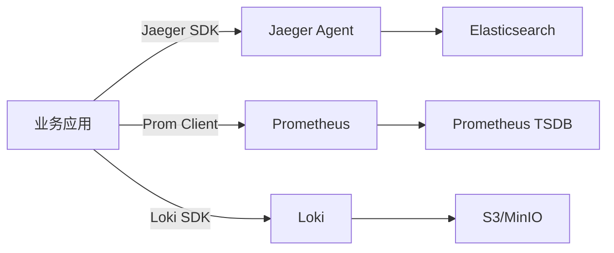
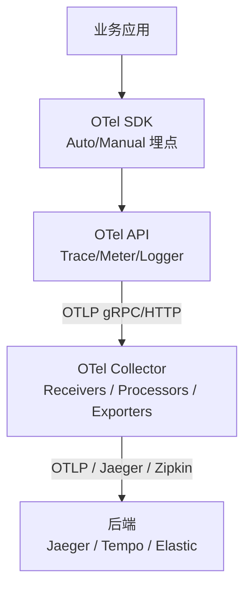
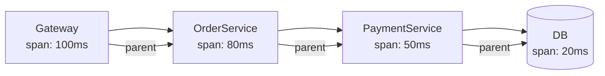
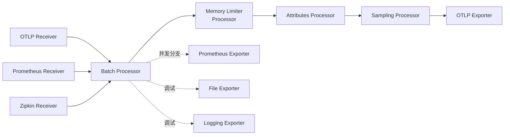

2022 年初我们还在用 Jaeger SDK + Prometheus client + Loki SDK 三套独立可观测体系。每个语言栈要维护三套埋点，新人入职第一周基本都在学"哪段代码要插哪个探针"。那年 6 月我们启动 OpenTelemetry 迁移 —— 不是为了追新，而是因为"统一"已经压过"性能"和"习惯"。

OpenTelemetry（OTel）不是某个产品，而是一套 **规范 + SDK + 协议 + 工具** 的总和。它在 2021 年 2 月发布 Tracing 1.0 GA，2021 年 CNCF 进入 Incubating，已经成为云原生可观测的事实标准。本文从三大信号、SDK 设计、Collector 架构、采样策略四个维度，给出生产级落地的工程经验。

<!--more-->

## 一、为什么需要 OpenTelemetry

先看"前 OTel 时代"的可观测栈：



三个 SDK、三套配置、三套部署、三套告警规则。问题：

- **埋点重复**：HTTP 入参、错误率、延迟，每个探针都要插一次
- **关联断裂**：Trace ID 无法关联到 Metrics/Labels，全链路排查要靠"时间窗口 + 服务名"
- **供应商锁定**：Jaeger SDK 想换 Zipkin 后端，所有应用代码要重写

OTel 的目标就是统一三大信号的 API 与协议，同时让后端可替换。

## 二、OTel 的四层架构



四层职责分明：

1. **API 层**：跨语言的稳定接口（`Tracer`、`Meter`、`Logger`），提供 no-op 默认实现
2. **SDK 层**：API 的具体实现，包含采样、上下文传播、批处理
3. **Collector**：独立进程（Go 二进制），收数据、做转换、再发到后端
4. **Backend**：存储与可视化（Jaeger、Tempo、Elastic、Splunk、Datadog 等）

**API 与 SDK 分离的设计哲学**：应用只依赖 API 包（无副作用、零依赖），SDK 由运行时决定。如果你的代码依赖了 SDK 完整包，未来换采集器会很难 —— 必须用 `opentelemetry-api` 而不是 `opentelemetry-sdk`。

## 三、三大信号：Trace、Metric、Log

OTel 定义三大信号（最初是 Trace + Metric，2021 年 Logs 才进入规范）。

### 3.1 Trace：分布式追踪

Trace 由 **Span** 组成，Span 之间通过 **Context Propagation** 形成因果链：



Context 通过 **W3C Trace Context**（`traceparent` Header）跨服务传播：

```
traceparent: 00-4bf92f3577b34da6a3ce929d0e0e4736-00f067aa0ba902b7-01
```

格式：`version-trace_id-parent_span_id-flags`。这是 2021 年由 W3C 正式标准化，OTel、Jaeger、Zipkin 都已支持。

### 3.2 Metric：可聚合指标

Metric 在 OTel 中有几种类型：

| 类型 | 含义 | 典型场景 |
|------|------|---------|
| **Counter** | 单调递增 | HTTP 请求数、订单数 |
| **UpDownCounter** | 可增可减 | 当前连接数、队列长度 |
| **Histogram** | 分布统计 | 请求延迟、响应体大小 |
| **Gauge** | 瞬时值 | CPU 利用率、温度 |

OTel Metric SDK 内部做 **delta-to-cumulative** 转换（如果后端需要累计值），并支持多种导出协议（OTLP、Prometheus Remote Write）。

### 3.3 Log：日志信号

OTel 的 Logs 是后加入的（2021 年规范 alpha）。它与传统日志最大的区别是 **Log 与 Trace 关联**：

```json
{
  "timestamp": "2022-08-15T16:00:00Z",
  "severity": "ERROR",
  "body": "Payment failed",
  "trace_id": "4bf92f3577b34da6a3ce929d0e0e4736",
  "span_id": "00f067aa0ba902b7",
  "resource.attributes": {
    "service.name": "payment-service",
    "service.version": "1.4.2"
  }
}
```

通过 `trace_id` 关联，可以从一条 ERROR 日志直接跳转到完整 Trace —— 这是 Loki + Jaeger 组合方案永远做不到的。

## 四、SDK 自动埋点

OTel 提供大量 **Instrumentation Library**（自动埋点库），覆盖主流框架：

| 语言 | HTTP | gRPC | 数据库 | 消息队列 |
|------|------|------|--------|---------|
| Java | netty、tomcat、spring-web | grpc-java | jdbc、hikari、jedis | kafka-client、rabbitmq |
| Go | net/http、gin、echo | grpc-go | database/sql、gorm | sarama、confluent-kafka |
| Python | requests、flask、django | grpcio | sqlalchemy、psycopg2 | pika、aiokafka |
| Node.js | http、express、koa | @grpc/grpc-js | pg、mongoose | kafkajs、amqplib |
| .NET | HttpClient、ASP.NET | Grpc.Net.Client | EF Core、Npgsql | MassTransit |

以 Go 为例：

```go
import (
    "go.opentelemetry.io/contrib/instrumentation/net/http/otelhttp"
    "go.opentelemetry.io/otel"
)

func main() {
    // 全局 HTTP Transport 替换
    client := &http.Client{
        Transport: otelhttp.NewTransport(http.DefaultTransport),
    }

    // 业务代码无需改动，自动埋点
    resp, err := client.Get("https://api.example.com/orders")
}
```

一行 `Transport` 替换，所有出站 HTTP 请求自动产生 Span（包含 URL、Method、Status Code、Headers）。这是 OTel 最大的工程价值：**业务代码零侵入**。

## 五、Collector 架构

OTel Collector 是独立部署的 Go 进程，核心是 **Receiver → Processor → Exporter** 三段管道：



### 关键 Processor

- **Batch**：合并 Span，减少后端写入压力（默认 8192 条/批，200ms 超时）
- **Memory Limiter**：内存超过阈值时拒绝接收，防止 Collector OOM
- **Attributes**：增删资源属性（如添加 `env=production`）
- **Probabilistic Sampling**：按比例采样，降低存储成本
- **Tail Sampling**（实验性）：基于完整 Trace 决策采样，保留错误请求

### 生产配置示例

```yaml
receivers:
  otlp:
    protocols:
      grpc:
        endpoint: 0.0.0.0:4317
      http:
        endpoint: 0.0.0.0:4318
  prometheus:
    config:
      scrape_configs:
        - job_name: 'kubernetes-pods'
          kubernetes_sd_configs:
            - role: pod

processors:
  batch:
    timeout: 200ms
    send_batch_size: 8192
  memory_limiter:
    check_interval: 1s
    limit_percentage: 80
    spike_limit_percentage: 20
  attributes/add_env:
    actions:
      - key: deployment.environment
        value: production
        action: insert
  probabilistic_sampler:
    sampling_percentage: 10  # 10% 采样率

exporters:
  otlp/jaeger:
    endpoint: jaeger-collector:4317
    tls:
      insecure: true
  otlp/tempo:
    endpoint: tempo:4317
    headers:
      x-api-key: ${TEMPO_API_KEY}
  logging:
    verbosity: basic

service:
  pipelines:
    traces:
      receivers: [otlp]
      processors: [memory_limiter, batch, attributes/add_env, probabilistic_sampler]
      exporters: [otlp/jaeger, otlp/tempo]
    metrics:
      receivers: [otlp, prometheus]
      processors: [memory_limiter, batch]
      exporters: [otlp/tempo]
```

我们用上面这套配置支撑了日均 2 亿 Span 的流量，单 Collector 实例内存 ~2GB，CPU ~1.5 核。

## 六、采样策略

采样是 OTel 生产化最关键的决策。100% 采样会让后端吃不消；采样率太低又丢失关键 trace。

### 6.1 头部采样（Head-based Sampling）

SDK 端在 Span 创建时决策，要么采样要么丢弃：

```go
import (
    "go.opentelemetry.io/otel/sdk/trace"
)

func initTracer() *trace.TracerProvider {
    return trace.NewTracerProvider(
        trace.WithSampler(trace.ParentBased(
            trace.TraceIDRatioBased(0.1), // 10% 采样
        )),
    )
}
```

`ParentBased` 保证同一 Trace 的所有 Span 决策一致（要么全采要么全弃），否则 Trace 会断裂。

### 6.2 尾部采样（Tail-based Sampling）

Collector 端在完整 Trace 收到后再决策：

```yaml
processors:
  tail_sampling:
    decision_wait: 10s
    num_traces: 100000
    policies:
      - name: errors
        type: status_code
        status_code: { status_codes: [ERROR] }
      - name: slow
        type: latency
        latency: { threshold_ms: 1000 }
      - name: probabilistic
        type: probabilistic
        probabilistic: { sampling_percentage: 5 }
```

策略："ERROR 或 P99 延迟 > 1s 全采；其余 5% 采样"。

**优缺点对比**：

| 维度 | Head Sampling | Tail Sampling |
|------|--------------|---------------|
| 决策时机 | Span 创建时 | Trace 完成后 |
| 成本 | SDK 侧几乎零开销 | Collector 需要缓存完整 Trace |
| 错误捕获 | 概率性（取决于采样率） | 可保证（针对错误全采） |
| 适用规模 | 任意 | 中小流量（每天 < 1 亿 Span） |

我们生产环境用 **Head 10% + Collector Tail Sampling** 双层：SDK 端先 10% 采样降低传输压力，Collector 端对收到的 10% 再做尾部策略（错误全采）。

## 七、OTLP 协议

OTel 定义了 **OTLP**（OpenTelemetry Line Protocol）作为 Collector 与后端通信的协议：

- **传输层**：gRPC（默认端口 4317）或 HTTP/Protobuf（端口 4318）
- **编码**：Protobuf（强类型、高压缩）
- **三大信号统一**：Trace、Metric、Log 走同一协议

```protobuf
message TraceRequest {
  repeated ResourceSpans resource_spans = 1;
}
message ResourceSpans {
  Resource resource = 1;
  repeated ScopeSpans scope_spans = 2;
}
message ScopeSpans {
  InstrumentationScope scope = 1;
  repeated Span spans = 2;
}
```

OTLP 是 OTel 唯一长期稳定的协议。即便 Jaeger、Tempo、Elastic 都支持 OTLP，但用 OTLP 意味着切换后端不需要改应用代码 —— 这就是"供应商中立"的核心。

## 八、生产落地清单

我们 2022 年 OTel 迁移的步骤：

### 1. 双写期（4 周）

新代码用 OTel SDK，老代码保留原 Jaeger SDK。Collector 同时接收 OTLP 与 Jaeger：

```yaml
receivers:
  otlp:
    protocols: { grpc: { endpoint: 0.0.0.0:4317 } }
  jaeger:
    protocols: { grpc: { endpoint: 0.0.0.0:14250 } }

service:
  pipelines:
    traces:
      receivers: [otlp, jaeger]  # 同时收
      processors: [batch]
      exporters: [otlp/tempo]
```

### 2. 自动埋点覆盖率检查（2 周）

用 OTel Collector 的 `servicegraph` 或后端的 Service Map 功能，看哪些服务/接口还没接 OTel。覆盖率到 90% 之前不要切流量。

### 3. 采样策略迭代（持续）

从 Head 1% 起步，根据后端存储容量逐步调。我们最终稳定在 Head 10% + Tail Sampling。

### 4. 关联三大信号（2 周）

确保 Log/Metric 都带 `trace_id` 和 `service.name`。这是 OTel 相对于"独立栈"的最大优势。

### 5. 切流量（1 周）

按服务灰度切：先内部工具 → 低流量服务 → 核心交易。每个服务观察 72 小时无异常再推进。

## 九、常见坑

### 1. 用了 SDK 而非 API

```go
// 错误：直接依赖 SDK，应用和具体实现绑死
import "go.opentelemetry.io/otel/sdk/trace"

// 正确：依赖 API，具体实现由初始化决定
import "go.opentelemetry.io/otel/trace"
```

否则将来想换采集器或 SDK 版本，所有业务代码都要改。

### 2. 采样率"全局一刀切"

不要给所有服务同一个采样率。核心支付服务应该采 100% 或 Tail-based 高优先级；内部测试服务 1% 都嫌多。

### 3. Context 传播丢失

手动起 goroutine 或异步任务时，**必须** 手动传递 Context：

```go
// 错误：丢失 Trace Context
go func() {
    doSomething()  // 内部创建的 span 是 root，不是 parent
}()

// 正确：传递 Context
go func(ctx context.Context) {
    ctx, span := tracer.Start(ctx, "async-task")
    defer span.End()
    doSomething(ctx)
}(ctx)
```

否则下游服务的 Trace 与上游无法关联，全链路断裂。

### 4. 高基数标签

```go
// 错误：用 user_id 作标签，会让 Prometheus/Tempo 爆炸
span.SetAttributes(attribute.String("user_id", userID))

// 正确：聚合标签
span.SetAttributes(attribute.String("user_tier", "gold"))
```

高基数（high cardinality）标签是 OTel 生产事故第一大来源。

## 十、小结

OpenTelemetry 不是"又一套 SDK"，而是可观测领域的"HTTP" —— 一个事实标准。它的工程价值在于：

1. **三大信号统一**：Trace、Metric、Log 用同一套 API、同一组 Context，天然关联
2. **业务零侵入**：自动埋点覆盖 90%+ 场景，业务代码只调 API
3. **后端可替换**：OTLP 协议保证切换 Jaeger/Tempo/Elastic 不动应用代码
4. **采集与存储解耦**：Collector 是独立层，可根据流量弹性扩缩

我们 2022 年的迁移最大的收获不是"用了新工具"，而是"新人入职第一天就能看懂全链路"。每个工程师都能从一条 ERROR 日志跳转到完整 Trace、Metrics 面板、上下游服务依赖 —— 这才是可观测的终极目标。

参考：

- [OpenTelemetry Tracing Specification 1.0](https://www.splunk.com/en_us/blog/devops/the-opentelemetry-tracing-specification-reaches-1-0-0.html)
- [OpenTelemetry 1.0: Standardizing Cloud-Native Observability](https://k8s.guru/blog/2021/02/24/opentelemetry-1-0-observability-standard)
- [OTel Collector Configuration](https://opentelemetry.io/docs/collector/configuration/)
- [OTLP Protocol Specification](https://opentelemetry.io/docs/specs/otlp/)