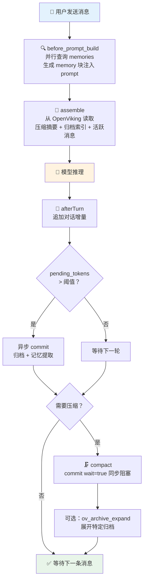

最近给 OpenClaw 装上了 [OpenViking](https://github.com/volcengine/OpenViking)——字节跳动火山引擎开源的 **AI Agent 上下文数据库**。装的过程很顺，但有一个隐藏代价直到我翻官方文档才意识到，本文把这个关键点讲清楚。

<!--more-->

## OpenViking 是什么

一句话：把 Agent 需要的记忆、资源、技能统一抽象成虚拟文件系统（`viking://` 协议），靠 L0/L1/L2 三层摘要按需加载，从根上解决 Token 消耗。GitHub 上线两个月拿下 16k+ Star，比同期 RAG 项目高出几个量级。

## 它怎么接管 OpenClaw

很多人以为 OpenViking 只是个"记忆查询工具"，实际它是横跨 OpenClaw 整个生命周期的深度集成层。安装插件后，OpenViking 会接管四个关键钩子：

**① before_prompt_build —— 自动召回**
每次对话前，并行查询 `viking://user/memories` 和 `viking://agent/memories`，结果经智能过滤排序后，转成 `<memory>` 块插入到提示词最前面。

**② assemble —— 上下文组装**
不再从本地文件加载历史，而是从 OpenViking 读取会话上下文。模型最终看到的是"压缩摘要 + 归档索引 + 活跃消息"，而不是无限增长的原始文本。

**③ afterTurn —— 轮次后处理**
每轮对话结束，新增量追加到 OpenViking 会话（自动剔除注入的 `<memory>` 块等噪音）。当 `pending_tokens` 超过阈值，触发**异步提交**——归档生成和记忆提取在服务端完成，不阻塞当前对话。

**④ compact —— 对话压缩**
唯一的**同步边界**。调用 `commit(wait=true)` 阻塞直到完成，再读取最新归档概览。如果摘要太粗糙，模型可以调用 `ov_archive_expand` 重新打开特定归档。

完整流程：

除了自动行为，插件还为模型提供了四个显式工具：

| 工具 | 作用 |
|---|---|
| `memory_recall` | 显式搜索长期记忆 |
| `memory_store` | 立即写入记忆并触发提交 |
| `memory_forget` | 通过 URI 删除或搜索后移除匹配项 |
| `ov_archive_expand` | 摘要不够时，展开特定归档看原始消息 |

## 效果数据

火山引擎的 LoCoMo10 测试（1540 条用例）：

| 实验组 | 任务完成率 | 输入 Token 总计 |
|--------|-----------|-----------------|
| OpenClaw (原生 memory-core) | 35.65% | 24,611,530 |
| OpenClaw + OpenViking Plugin | 51.23% | 2,099,622 |

任务完成率提升 43%，Token 成本降低 91%。

## 一个容易踩的坑：原生 Markdown 记忆文件不再维护

这是我装完后最大的疑问——`MEMORY.md` 和 `memory/YYYY-MM-DD.md` 还会被自动维护吗？翻了 [OpenViking 的 openclaw-plugin 文档](https://github.com/volcengine/OpenViking/blob/main/examples/openclaw-plugin/README.md) 和 [OpenClaw 记忆机制文档](https://docs.openclaw.ai/concepts/memory)，答案是**不会了**。

OpenViking 的 `assemble / afterTurn / compact / before_prompt_build` 四个钩子**全面接管**了记忆的读写。具体表现：

| 原生行为 | 装了 OpenViking 后 |
|---|---|
| 压缩前自动写入 `MEMORY.md` | ❌ 被 commit 流程替代 |
| 压缩前自动写入每日笔记 | ❌ 同上 |
| 会话开始自动加载 `MEMORY.md` | ❌ 改为检索 `<memory>` 块注入 |
| 自动加载今天/昨天的每日笔记 | ❌ 被上下文组装替代 |
| "记住这个"时写入文件 | ❌ 改为调用 `memory_store` |

OpenViking 是一次**彻底的接管**，不是增量的增强。所有记忆存储和检索都转移到了 OpenViking 后端，原生 Markdown 文件将不再被自动维护——这一点官方文档没有醒目标注，但确实是个值得提前知道的真相。

## 总结

OpenViking 插件从上下文组装、轮次处理到对话压缩，全链路接管了 OpenClaw 的记忆系统，效果显著（任务完成率 +43%、Token -91%）。但接管也意味着原生 Markdown 文件这条退路没了——如果你看重"记忆能直接打开查看"或"git 追踪变更"，装之前要想清楚。

如果你也在用 OpenClaw，强烈建议接上 OpenViking，然后认真读一遍上面那个对照表。

## 参考

- [OpenViking × OpenClaw 插件文档](https://github.com/volcengine/OpenViking/blob/main/examples/openclaw-plugin/README.md)
- [OpenClaw 记忆机制官方文档](https://docs.openclaw.ai/concepts/memory)