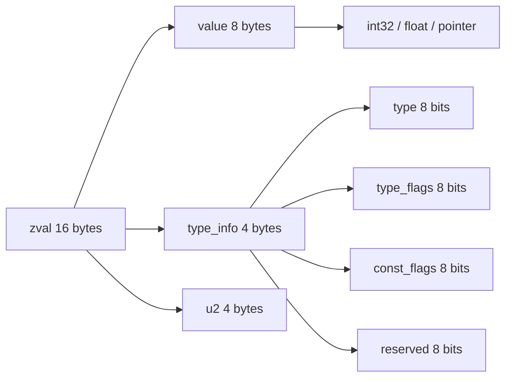
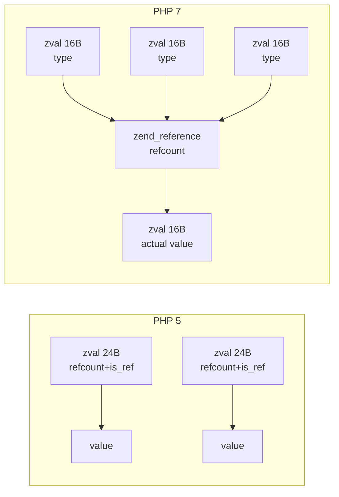
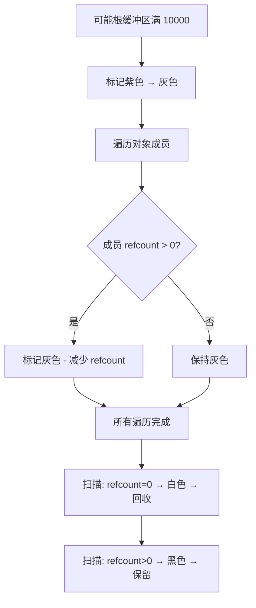
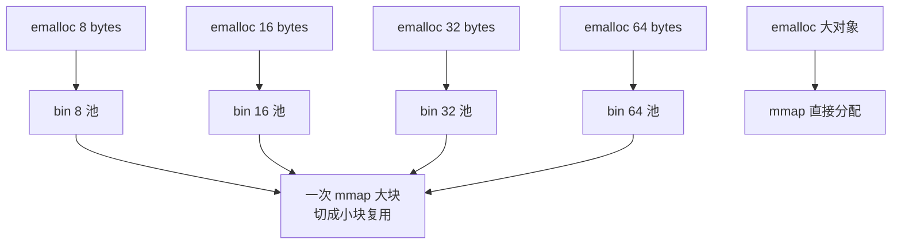

PHP 7 相比 PHP 5，最重要的性能优化之一就是 **zval 的重新设计**。zval 是 PHP 中一切变量的底层容器，理解它的内存模型对于理解 PHP 的内存管理、引用语义和垃圾回收至关重要。本文从 PHP 5/7 对比出发，逐步剖析 PHP 7 zval 的设计。

## PHP 5 的 zval：臃肿的设计

PHP 5 中，zval 结构体大致如下：

```c
struct _zval_struct {
    zvalue_value value;   // 16 字节，存储实际值
    zend_uint refcount__gc; // 4 字节，引用计数
    zend_uchar type;       // 1 字节，类型
    zend_uchar is_ref__gc; // 1 字节，是否为引用
};
```

整体 24 字节（在 64 位对齐后实际占 32 字节）。每个值变量本身就带 refcount 和 is_ref 标记。这意味着：

1. **每个值都要分配 refcount 计数**：小字符串、小整数也跑不掉
2. **每个 zval 都需要单独内存分配**：栈上的临时变量没法直接复用
3. **复杂值才需要的概念，简单值也被迫承担**

对于 PHP 这种"一切皆值"的语言，这种设计的内存开销显著。

## PHP 7 的重构

PHP 7 把 zval 简化为：

```c
struct _zval_struct {
    zend_value value;     // 8 字节，存储值
    union {
        struct {
            ZEND_ENDIAN_LOHI_4(zend_uchar type, zend_uchar type_flags, zend_uchar const_flags, zend_uchar reserved)
        } v;
        uint32_t type_info;
    } u1;
    union {
        uint32_t var_flags;
        uint32_t next;
        uint32_t cache_slot;
        uint32_t opline_num;
        uint32_t lineno;
        uint32_t num_args;
        uint32_t fe_pos;
        uint32_t fe_iter_idx;
        uint32_t access_flags;
        uint32_t property_guard;
        uint32_t constant_flags;
    } u2;
};
```

整体大小：**16 字节**。关键变化：

- **value**：8 字节，存储任意标量（整数、浮点数、指针）
- **type_info**：4 字节，编码类型和标志位
- **u2**：4 字节，根据上下文复用为不同用途



## 标量直接存储

PHP 7 最关键的优化之一是**标量直接存放在 zval.value 中**：

- 整数（int32）：直接放在 value 里，无需指针
- 浮点数（double）：直接放在 value 里
- 布尔/null：type 字段直接标记，无需 value
- 字符串、数组、对象：value 存的是指向 zend_string / HashTable / zend_object 的指针

这意味着小整数、布尔值这些高频数据**不需要堆分配**，节省了大量内存和 CPU。

```c
// 小整数示例：zval 完全不需要堆分配
zval z;
ZVAL_LONG(&z, 42);
// 此时 z.value.lval = 42，z.u1.type = IS_LONG
```

## 引用计数分离：zend_reference

PHP 5 中，每个值带 refcount。PHP 7 改为：**只有需要引用的值才分配 zend_reference**：

```c
struct _zend_reference {
    zend_refcounted_h gc;
    zval val;        // 实际的值
    zend_property_info *sources_ptr;
};
```



PHP 7 中：

- 普通赋值是写时复制（COW）：`$a = $b` 时，两个 zval 指向同一个 zend_string，refcount = 2
- 需要 `&` 引用时（`$a = &$b`）：zval 指向一个 zend_reference，zend_reference 内部存值
- 修改时先检查，refcount > 1 时触发 copy-on-write 分离

## 字符串：zend_string

PHP 7 中字符串使用 `zend_string` 结构：

```c
struct _zend_string {
    zend_refcounted_h gc;     // 8 字节，GC 头
    zend_ulong h;             // 8 字节，hash 缓存
    size_t len;               // 8 字节，字符串长度
    char val[1];              // 实际字符（柔性数组）
};
```

关键优化：

- **`h` 字段**：缓存字符串的 hash 值，避免重复计算（PHP 数组查找用字符串 hash 极高频）
- **`len` 字段**：缓存字符串长度，避免 `strlen()` 调用
- **柔性数组 `val[1]`**：结构体末尾紧接字符串数据，分配一次内存即可

## 数组：packed array 与 hash table

PHP 7 数组底层仍是 HashTable，但做了重要优化：

```c
struct _zend_array {
    zend_refcounted_h gc;
    union {
        struct {
            ZEND_ENDIAN_LOHI_4(zend_uchar flags, zend_uchar _unused, zend_uchar nIteratorsCount, zend_uchar _unused2)
        } v;
        uint32_t flags;
    } u;
    uint32_t nTableMask;       // hash 掩码
    Bucket *arData;            // 桶数组
    uint32_t nNumUsed;         // 已用桶数
    uint32_t nNumOfElements;   // 实际元素数
    uint32_t nTableSize;        // 哈希表大小（2 的幂）
    uint32_t nInternalPointer;
    zend_long nNextFreeElement;
    dtor_func_t pDestructor;
};
```

对于连续整数键的数组（packed array），PHP 7 走快速路径，直接按索引访问，不算 hash。

## 垃圾回收：循环引用检测

PHP 用引用计数管理内存，但单纯引用计数无法处理**循环引用**：

```php
$a = new stdClass();
$b = new stdClass();
$a->b = $b;
$b->a = $a;
// 此时 $a、$b 的 refcount 都不为 0，但已经无法从外部访问
```

PHP 7 的 GC 算法基于 [Jones 变种循环检测](https://researcher.watson.ibm.com/researcher/files/us-bacon/Bacon04Concurrent.pdf)：



算法核心是把 GC 标记位编码进类型字段——每个 zval 都有一个颜色标记：

- **白色**：未访问 / 待回收
- **灰色**：在当前 GC 周期内被遍历
- **黑色**：确认为活跃对象

每次 `possible root` 缓冲区累积满 10000 个对象时触发一次完整 GC。

## 内存分配：small memory pools

PHP 用自己的 `emalloc`/`efree` 替代裸 `malloc`/`free`，背后是 small memory pools：



不同大小的分配走不同的 free list，避免了 `malloc` 的碎片和锁竞争。这是 PHP 7 性能提升的另一个关键因素。

## 性能对比总结

| 维度 | PHP 5 | PHP 7 |
|---|---|---|
| zval 大小 | 24 字节 | 16 字节 |
| 整数/浮点 | 必须堆分配 | 直接 inline |
| 字符串长度 | 调用计算 | 缓存 len |
| 字符串 hash | 每次计算 | 缓存 h |
| 引用计数 | 每个值都有 | 分离到 zend_reference |
| 内存分配 | 全局堆 | Small bins 池化 |

实测 PHP 7 比 PHP 5 在 CPU 密集型场景快 2 倍以上、内存占用减少一半以上。

## 调试技巧

1. **`memory_get_usage()`**：观察脚本各阶段内存
3. **Xdebug profiling**：分析函数调用和内存分配热点
4. **`gc_collect_cycles()`**：手动触发 GC（生产环境慎用）
5. **strace / ltrace**：跟踪 emalloc 频率

## 参考资料

- PHP 源码：`Zend/zend_types.h`、`Zend/zend_variables.h`、`Zend/zend_gc.c`
- 鸟哥（惠新宸）博客：[PHP 7 数组底层实现](https://www.laruence.com/2018/03/06/3172.html)
- PHP Internals Book：[Memory management](https://www.phpinternalsbook.com/php7/memory_management.html)
- David F. Bacon 等：[Concurrent Cycle Collection in Reference Counted Systems](https://researcher.watson.ibm.com/researcher/files/us-bacon/Bacon04Concurrent.pdf)