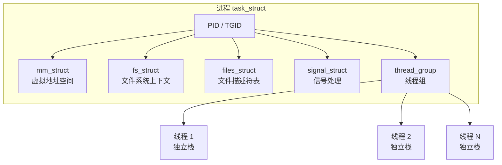
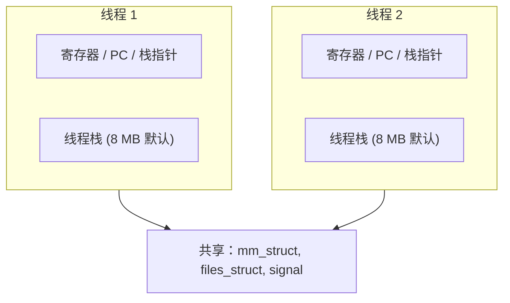
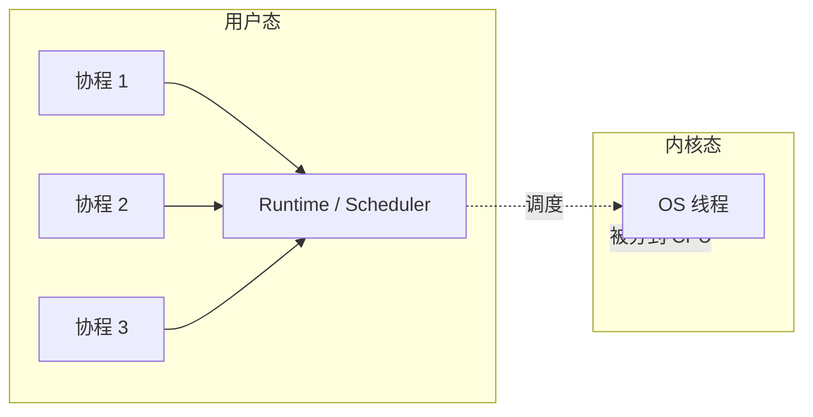
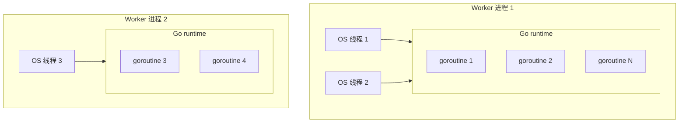
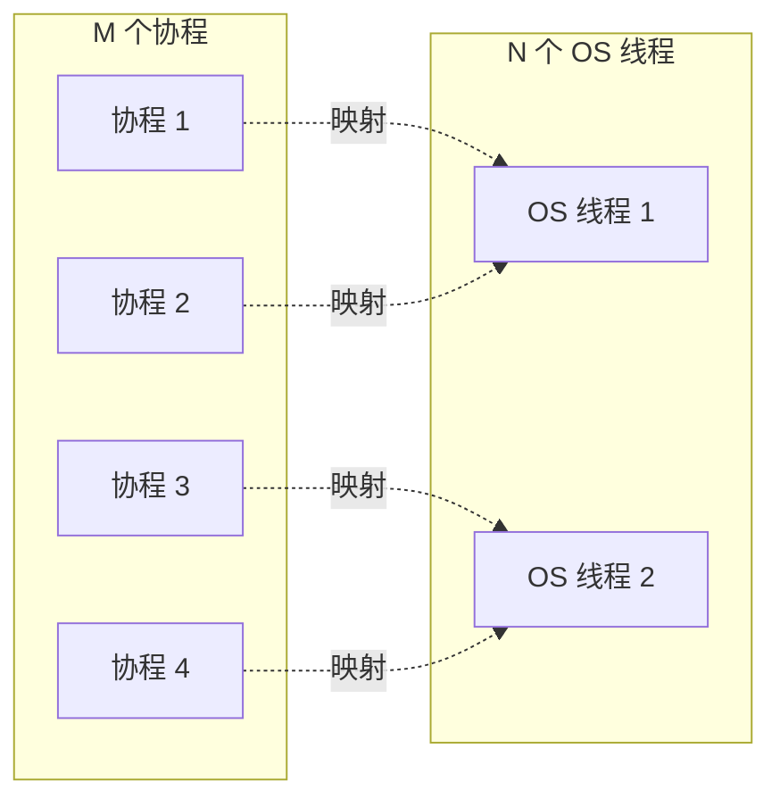

2016 年最热的技术话题之一是"协程"。Go 1.7 进一步优化了 goroutine 调度，Lua、Erlang 的协程模型在游戏和电信行业早已成熟。但到底什么是协程？它和线程的区别在哪？——这三个概念必须从**操作系统的视角**区分清楚，否则永远在"哪个性能更好"上打转。

这篇文章回到最基础的层次：进程、线程、协程在 Linux 内核和 CPU 眼里到底是什么样的东西。

<!--more-->

## 一、概念回顾：三个层次的并发单元

| 概念 | 调度主体 | 拥有 | 切换开销 |
|------|---------|------|---------|
| **进程** | 操作系统内核 | 独立地址空间、文件描述符、信号处理等 | 最大（~10-100 μs） |
| **线程**（内核线程） | 操作系统内核 | 线程栈、寄存器、PC、共享进程资源 | 中等（~1-10 μs） |
| **协程**（用户态线程） | 用户态运行时（runtime） | 协程栈、寄存器、PC | 最小（~100 ns） |

这三者从下到上是**包含关系**——协程跑在线程上，线程跑在进程上。但很多细节会颠覆直觉：线程不一定"轻"、协程不一定"新"。

## 二、进程：资源的容器

进程是操作系统分配资源的单位。在 Linux 内核中，每个进程由一个 `task_struct` 结构描述：



每个进程有独立的：

- **虚拟地址空间**：进程 A 的 `0x400000` 和进程 B 的 `0x400000` 指向不同的物理页（即使数值一样）
- **文件描述符表**：`fd=3` 在两个进程里可以指向不同的文件
- **信号处理表**：进程 A 注册的 `SIGTERM` 处理函数和进程 B 完全无关
- **PID 命名空间**：在容器/namespace 下还有独立 PID 编号

### 2.1 创建开销

```bash
$ time fork()
# 调用 fork() 实际开销 ~ 100 μs（不含 copy_page_range 等）
```

Linux 用 **写时复制（Copy-on-Write, CoW）** 优化 fork：刚 fork 时父子进程共享所有内存页（不可写），谁要写才真正复制一份。所以 fork 本身很快，但**后续进程修改内存时会产生大量缺页中断 + 物理页拷贝**。

### 2.2 进程间通信

地址空间隔离是"安全"也是"麻烦"——必须靠 IPC 通信：

| 机制 | 特点 | 适用 |
|------|------|------|
| 管道 / FIFO | 字节流，单向 | 父子进程 |
| 本地套接字 | 双向，可跨主机 | 灵活 |
| 共享内存 | 最快，需要同步 | 大数据量 |
| 信号 | 异步通知 | 控制信号 |
| 信号量 / 消息队列 | System V 风格 | 历史遗留 |

## 三、线程：调度的单位

线程是 CPU 调度的单位。在 Linux 上线程和进程几乎无差别——内核都用 `task_struct` 表示，唯一区别是**线程共享所属进程的地址空间**。



线程**独有**：线程栈、寄存器上下文（PC、SP 等）、线程局部存储（TLS）。

线程**共享**：进程的地址空间、文件描述符表、信号处理、信号量、内存等。

### 3.1 创建开销 vs 进程

POSIX 线程（pthread）的创建比 fork 略快：

```c
pthread_create(&tid, NULL, thread_func, NULL);
```

实测：约 50-200 μs。但线程栈默认 8 MB（可用 `ulimit -s` 或 `pthread_attr` 调小），**1024 个线程就是 8 GB 内存**——很多 C++ 服务因此崩溃。

### 3.2 线程同步的复杂性

线程共享内存是双刃剑。经典问题：

| 问题 | 描述 |
|------|------|
| 竞态条件 | 两个线程同时改一个变量，结果不确定 |
| 死锁 | 线程 A 等 B，B 等 A |
| 内存可见性 | 线程 A 写了变量，线程 B 看不到新值（CPU 缓存） |
| 伪唤醒 | `pthread_cond_wait` 可能错误地返回 |

锁的种类：

| 锁 | 特性 | 适用 |
|---|------|------|
| `mutex` | 互斥睡眠锁 | 临界区较长 |
| `spinlock` | 自旋不睡眠 | 临界区极短、不可睡眠 |
| `rwlock` | 读写锁 | 读多写少 |
| `atomic` | CPU 指令级别 | 单变量计数 |
| `RCU` | 读无锁、写复制 | Linux 内核广泛用 |

## 四、协程：用户态的轻量调度

协程（coroutine）的核心思想：**把调度权从内核移回用户态**。

### 4.1 内核不知道协程的存在



协程是**用户态运行时自己管理的执行流**，内核看到的还是 N 个 OS 线程（M 个线程上跑 N 个协程，M:N 调度）。一个协程就是一个数据结构：

```c
typedef struct {
    void *stack_ptr;    // 当前栈指针
    void *pc;           // 暂停在哪行
    void *stack_base;   // 独立栈内存 (2 KB goroutine / 8 KB Lua)
    // ...其他运行时数据
} coroutine_t;
```

协程切换时，runtime **手动保存**栈指针、程序计数器、寄存器，再切到另一个协程。这全部在用户态完成，**不进入内核**——所以耗时仅 100 ns 左右，是线程切换的 1/100。

### 4.2 协程的"栈"

线程栈默认 8 MB（其实大部分用不上，浪费）；goroutine 默认 2 KB，**按需增长**。这就是为什么 goroutine 可以轻松开几十万个——10 万个 × 2 KB = 200 MB，而 10 万个 pthread 栈要 800 GB。

### 4.3 协程调度策略

不同 runtime 实现各异，但常见模式：

| 调度策略 | 描述 | 代表 |
|---------|------|------|
| **协作式** | 协程主动 `yield()` 才切换 | Lua、Erlang |
| **抢占式** | runtime 强制切换（基于时间片或调度点） | Go（1.4 之前协作，1.4+ 信号抢占，1.14+ 异步抢占） |

Go 1.7（2016 年 8 月发布，本文章时间点之后）正是对调度器做了**重大优化**——用 Go runtime 的协程（goroutine）模型是工业级最成熟的协程实现。

### 4.4 一个 Go 的最小协程示例

```go
package main

import (
    "fmt"
    "time"
)

func say(s string) {
    for i := 0; i < 3; i++ {
        fmt.Println(s, i)
        time.Sleep(100 * time.Millisecond)
    }
}

func main() {
    go say("world")  // 启动 goroutine
    say("hello")
    // main 结束时所有 goroutine 一起终止
}
```

`go say("world")` 启动一个 goroutine——这是个**协程**，不是 OS 线程。Go runtime 把成百上千个 goroutine 调度到少量 OS 线程上跑。

实测开销：

```bash
# 启动 10 万个 goroutine
go run huge_goroutine.go
# 耗时：~100 ms
# 内存：~200 MB
# 同样数量 pthread 在多数机器上 OOM
```

### 4.5 Python 的协程：generator → async/await

2015 年 PEP 492 引入 `async def`/`await` 语法，但本质还是基于 generator 的协程：

```python
import asyncio

async def fetch(url):
    # 模拟 I/O
    await asyncio.sleep(1)
    return f"data from {url}"

async def main():
    tasks = [fetch(f"http://api/{i}") for i in range(1000)]
    results = await asyncio.gather(*tasks)
    print(len(results))
```

Python 的 `asyncio` 用 **event loop** 在单线程上调度多个协程。**单线程意味着无法利用多核**，但 I/O 并发能力很强——10K 协程并发毫无压力。

## 五、三者对比与适用场景

| 维度 | 进程 | 线程 | 协程 |
|------|------|------|------|
| 调度者 | 内核 | 内核 | 用户态 runtime |
| 创建开销 | ~100 μs | ~50 μs | ~100 ns |
| 切换开销 | ~10 μs | ~1-5 μs | ~100 ns |
| 默认栈 | 不限 | 8 MB | 2-8 KB |
| 地址空间 | 独立 | 共享（进程内） | 共享（线程上） |
| 利用多核 | 是 | 是 | 否（除非多线程 + 多协程） |
| 同步复杂度 | 低（IPC） | 高（锁） | 中（runtime 帮忙） |
| 编程模型 | fork-exec | pthread | async/await、go |

**选择建议：**

| 场景 | 选择 | 原因 |
|------|------|------|
| 利用多核 + 计算密集 | 多进程 / 多线程 | 协程不能跨核并行 |
| 高并发 I/O（Web/网关） | 协程 | 10K+ 并发，内存低 |
| 强隔离（不同用户请求） | 多进程 | 崩溃不影响其他 |
| 微服务编排 | 进程 + 协程 | 进程做边界，协程做并发 |

## 六、混合模型：现实架构的真实样貌

真实服务通常分层混合：



例如一个 Go 写的 HTTP 服务：

- **进程层**：master + N 个 worker 进程（绑定 CPU 核）
- **线程层**：每个 worker 内 GOMAXPROCS 个 OS 线程
- **协程层**：每个请求一个 goroutine

三个层次各司其职：**进程隔离故障域、线程利用多核、协程扛高并发**。

## 七、常见误区澄清

### 7.1 "协程比线程快"？

**不准确**。协程在 **I/O 等待**场景下优势巨大（避免线程上下文切换到内核阻塞），但在 **纯 CPU 计算**场景下，协程和线程的速度差异只在调度本身，差距很小。

### 7.2 "协程不需要锁"？

**部分对**。同一线程内的多个协程共享地址空间，**仍然需要同步**。跨线程的协程也仍然要锁。协程只是把"阻塞式 I/O"换成"非阻塞式 I/O + yield"，不消除共享内存的并发问题。

### 7.3 "协程是新的发明"？

不对。协程概念 1958 年就在 Melvin Conway 的论文里出现，比线程还早。只是过去没有成熟的工业级 runtime。Go（2009）、Kotlin（2011）、Rust async（2019+）让协程重新流行起来。

## 八、小结

| 概念 | 一句话定义 | 核心特征 |
|------|-----------|---------|
| **进程** | 资源分配单位 | 地址空间隔离 |
| **线程** | CPU 调度单位 | 共享进程资源、内核调度 |
| **协程** | 用户态调度单位 | 轻量、栈小、runtime 调度 |

从进程 → 线程 → 协程，每一层都在做"用更细的粒度换更高的并发密度"。但它们不是替代关系——**现代服务几乎都是三层混合使用**。理解每一层的工程取舍，才能在选型时不被"协程比线程快"这种口号带偏。

## 九、更新记录

- 2016-12 初稿（基于 Linux 4.4 内核、Go 1.7、Python 3.5）
- Go 1.14（2020）引入基于信号的异步抢占，解决 goroutine 长时间运行无法被调度的问题
- Rust 异步运行时（tokio 1.0，2020）成熟，async/await 成为主流
- Kotlin Coroutines（2017 1.x → 2024 2.x）成为 JVM 协程的代表

## 参考资料

- Robert Love, *Linux Kernel Development*, 3rd Edition, Addison-Wesley, 2010
- [Go Concurrency Patterns - Sameer Ajmani](https://www.youtube.com/watch?v=f6kdp27TYZs)
- [The Linux Programming Interface - Michael Kerrisk](https://man7.org/tlpi/)
- [Goroutine scheduling - Go runtime source code](https://github.com/golang/go/blob/master/src/runtime/proc.go)
- `man` pages: `clone(2)`、`pthread_create(3)`、`setcontext(3)`

## 十、动手：用 strace 看一次线程/进程创建

光看文字描述不够直观。Linux 提供 `strace` 跟踪系统调用，可以亲眼看到进程和线程在内核层是怎么创建的。

### 10.1 看进程创建

```bash
# 写一个最简单的 fork 程序
$ cat > fork_demo.c <<EOF
#include <unistd.h>
int main() {
    pid_t pid = fork();
    if (pid == 0) {
        _exit(0);  // 子进程
    }
    return 0;
}
EOF
$ gcc fork_demo.c -o fork_demo

# strace 看系统调用
$ strace -e trace=clone,execve,fork,vfork -f ./fork_demo
clone(child_stack=0, flags=CLONE_CHILD_SETTID|CLONE_CHILD_CLEARTID|SIGCHLD, ...) = 12345
+++ exited with 0 +++
```

关键观察：

- `fork()` 实际调用的是 `clone()` 系统调用——Linux 没有专门的 fork，所有进程/线程创建都走 clone
- `flags` 决定"克隆什么"：进程克隆整个地址空间，线程克隆栈和寄存器但共享地址空间
- 子进程 PID 是 12345，**父子进程返回不同的值**（父进程拿到子 PID，子进程拿到 0）——这就是 fork 的核心魔法

### 10.2 看线程创建

```c
// thread_demo.c
#include <pthread.h>
void* worker(void* arg) { return NULL; }
int main() {
    pthread_t tid;
    pthread_create(&tid, NULL, worker, NULL);
    pthread_join(tid, NULL);
    return 0;
}
```

```bash
$ gcc thread_demo.c -lpthread -o thread_demo
$ strace -e trace=clone -f ./thread_demo
clone(child_stack=0x7f..., flags=CLONE_VM|CLONE_FS|CLONE_FILES|CLONE_SIGHAND|CLONE_THREAD|..., ...) = 12346
```

注意 `flags` 的差异：

- `fork`：`CLONE_CHILD_SETTID | ...`，**几乎所有标志都不设置**，子进程独立拥有地址空间
- pthread：`CLONE_VM | CLONE_FS | CLONE_FILES | CLONE_SIGHAND | CLONE_THREAD`，**地址空间、文件系统、文件描述符、信号都共享**

这从内核层证明了：进程和线程在 Linux 上是**同一个东西的不同配置**，差别只是 clone 时设了哪些标志位。

### 10.3 协程不需要系统调用

回到 Go 的 goroutine 例子：

```bash
$ cat > go_demo.go <<EOF
package main
func main() {
    for i := 0; i < 100; i++ {
        go func() {}()
    }
}
EOF
$ go build go_demo.go
$ strace -e trace=clone -f ./go_demo
# 没有 clone 调用！
```

**启动 100 个 goroutine，零个 clone 系统调用**。所有协程切换都在用户态完成，Go runtime 用少量的 OS 线程（默认 = CPU 核数）来承载这些 goroutine。只有当协程阻塞在 I/O 时，runtime 才会在另一个 OS 线程上调度其他协程——这时底层会用到 clone，但那是 runtime 的内部优化，对应用透明。

这就是协程"轻"的根本原因：**没有系统调用 = 没有上下文切换到内核的开销**。

## 十一、扩展：M:N 调度模型

工业级协程 runtime 几乎都用 **M:N 调度**——M 个用户态协程跑在 N 个 OS 线程上（N 通常等于 CPU 核数）：



| Runtime | 调度模型 | M:N 比例 |
|---------|---------|---------|
| Go (goroutine) | 工作窃取式调度器 | M >> N（默认） |
| Rust (tokio) | 多线程 reactor | M >> N（默认） |
| Erlang (BEAM) | 抢占式调度 | 1:1 早期 → M:N |
| Java (Loom) | 虚拟线程 + ForkJoinPool | M >> N |
| Lua (coroutine) | 协作式单线程 | 1:N（M=1） |

**工作窃取**（work stealing）是 Go 调度器的精髓：每个 OS 线程维护自己的本地队列，空闲时从其他线程的队列尾部偷一半协程过来跑——这样负载均衡，避免一个线程累死、其它线程空转。

理解 M:N 模型，看开源项目的 `runtime/scheduler` 或 `tokio` 源码就有了共同的"语言"。
