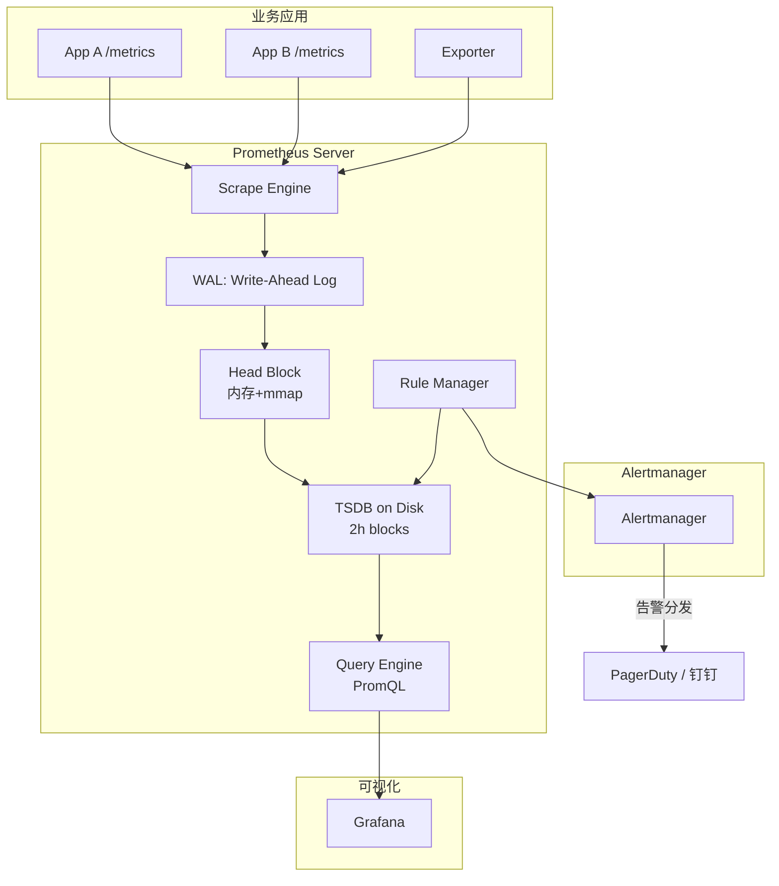
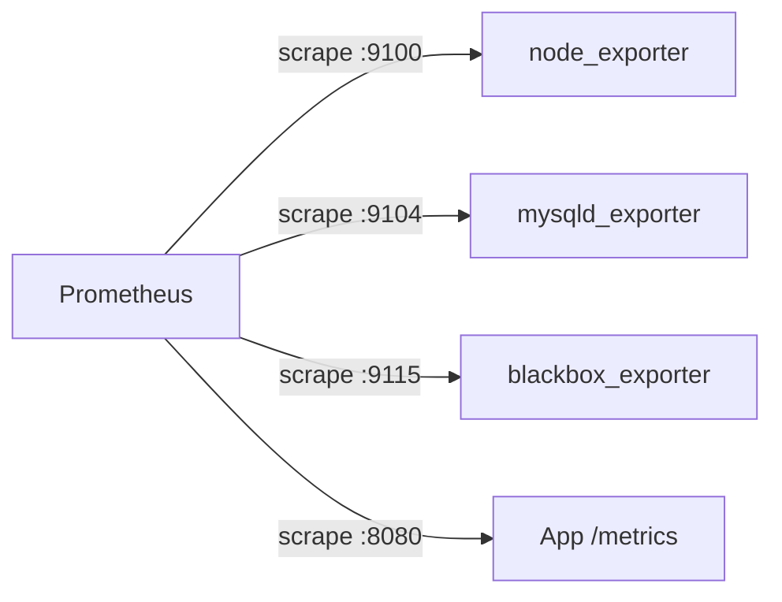
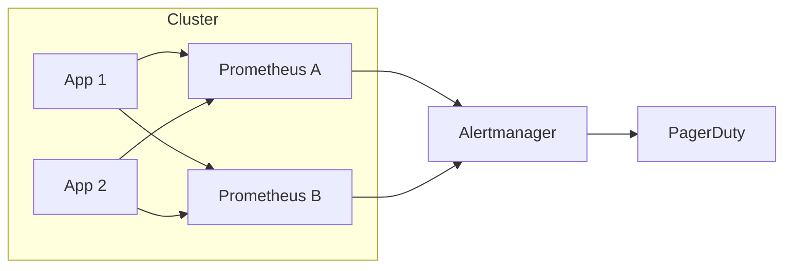

一套生产级 Prometheus 监控体系，绝不只是"跑起来一个 Prometheus 进程 + 配个 Grafana 面板"那么简单。从 2017 年 Prometheus 2.0 GA 至今，它的存储引擎、查询语言、生态工具链经历了数代演进。一个新项目如果按"开箱即用 demo"的认知去部署，三个月内几乎必然会在指标基数、告警风暴、长存储三件事上踩坑。

本文按"架构 → 数据采集 → 存储与查询 → 告警 → 高可用 → 落地清单"六个层次展开。

<!--more-->

## 一、Prometheus 2.x 架构总览

Prometheus 2.x 是当前生产部署的主流版本（2021 年时已经演进到 2.26+，2022 年发布 2.40+）。相比 1.x，2.x 的核心改进是**全新的 TSDB 存储引擎**：



关键模块：

- **Scrape Engine**：按 `scrape_interval` 拉取 `/metrics` 端点（默认 15s）
- **WAL（Write-Ahead Log）**：预写日志保证崩溃后数据不丢，是 2.x 引入的可靠性增强
- **Head Block**：内存 + mmap 的活跃数据块，达到 2 小时封存
- **TSDB on Disk**：封存后的 2 小时 Block 文件
- **Rule Manager**：周期性执行 Recording Rule 与 Alert Rule
- **Query Engine**：解析并执行 PromQL

## 二、数据采集：四种模式

### 2.1 直接埋点（Pull 模式）

Prometheus 默认采用 Pull 模式——它主动 HTTP GET 目标的 `/metrics` 端点。这意味着应用需要暴露 HTTP 端点。Go 应用常用 `prometheus/client_golang`：

```go
package main

import (
    "net/http"
    "github.com/prometheus/client_golang/prometheus/promhttp"
    "github.com/prometheus/client_golang/prometheus"
)

var (
    httpDuration = prometheus.NewHistogramVec(
        prometheus.HistogramOpts{
            Name:    "http_request_duration_seconds",
            Buckets: prometheus.DefBuckets, // .005 .01 .025 ... 10
        },
        []string{"path", "method", "status"},
    )
)

func main() {
    prometheus.MustRegister(httpDuration)

    http.Handle("/metrics", promhttp.Handler())
    http.ListenAndServe(":8080", nil)
}

func instrument(next http.Handler) http.Handler {
    return http.HandlerFunc(func(w http.ResponseWriter, r *http.Request) {
        timer := prometheus.NewTimer(httpDuration.WithLabelValues(
            r.URL.Path, r.Method, "200"))
        defer timer.ObserveDuration()
        next.ServeHTTP(w, r)
    })
}
```

### 2.2 Exporter 模式（最常用）

业务应用只暴露原始数据，由 Exporter 做协议转换。常见生态：

| Exporter | 采集目标 | 数据来源 |
|----------|----------|----------|
| `node_exporter` | 主机 | CPU/内存/磁盘/网络 |
| `mysqld_exporter` | MySQL | `SHOW GLOBAL STATUS` |
| `redis_exporter` | Redis | `INFO` 命令 |
| `blackbox_exporter` | 黑盒探测 | HTTP/TCP/ICMP |
| `kube-state-metrics` | K8s 对象 | API Server |

部署拓扑：



### 2.3 Pushgateway（短任务）

Pull 模型不适合短期任务（如 cron job）。这些任务启动后很快就退出，Prometheus 来不及抓取。Pushgateway 接收推送并保留指标，由 Prometheus 抓取 Pushgateway：

```bash
echo "job_runs_total{instance=\"cron-1\"} 1" | \
  curl --data-binary @- http://pushgateway:9091/metrics/job/cron_task
```

注意：**Pushgateway 不是万能解**——它会失去 `up` 健康检查、instance 维度混淆等问题。原则是**短任务才用 Pushgateway，长任务用 Exporter**。

### 2.4 联邦与 Remote Write

当 Prometheus 实例数量上升（>20），单点抓取会过载。两种扩展模式：

- **联邦（Federation）**：层级 Prometheus——上层 Prometheus 抓取下层的 `/federate` 端点，只看汇总指标
- **Remote Write**：将采集数据写入远程存储（如 Thanos、Cortex、InfluxDB），实现长期存储与跨集群聚合

### 2.5 Pull 与 Push：模型之争

Prometheus 的核心设计哲学是**坚持 Pull 模型**，但工业界对 Push 模型的需求从未消失。理解二者权衡，是设计采集方案的底层思考。

**Pull 模型的三大优势：**

- **target 健康发现**：Prometheus 主动拉取，未被拉取到的 target 自然暴露为 `up == 0`，无需额外健康探测
- **频率可控**：Prometheus 端统一配置 `scrape_interval`，不会因为某个应用写得太快就压垮 TSDB
- **防火墙友好**：运维只需放行 Prometheus→target 的出站访问，target 端无需对 Prometheus 配置入站白名单——Kubernetes 环境下尤为关键（注意 Prometheus 自身仍要监听 :9090、:9093 等入站端口供 API/Alertmanager 使用）

**Pull 的局限：** 短生命周期任务（cron、batch job）来不及被抓取就退出。Prometheus 官方为此提供了 **Pushgateway**——但它只能算"补丁"，长期运行应用一旦用 Pushgateway，就失去 `up` 维度与 instance 归属。

**Push 模型何时合理：** 当 target 位于 NAT/防火墙后无法被拉取，或运行在边缘网络环境（工厂、IoT）。此时可用 Prometheus Agent 模式（2023+ GA）——以 Push 角色工作，但协议仍是 Remote Write 而非传统 Pushgateway。

**Remote Write 协议的演进：**

- **2018-2020（Remote Write 1.0）**：基于 Snappy 压缩 + protobuf over TCP，单连接吞吐有限
- **2022（Remote Write 2.0）**：引入 **gRPC 流式 + 多租户 + 标签压缩**，写入吞吐提升 3-5 倍；新增 `created_timestamp` 解决乱序写入

选型原则：**能用 Pull 就用 Pull**；只有短任务、网络受限、边缘场景才考虑 Push/Remote Write 主动推送。

**真实生产中的折衷方案：** 在 Kubernetes 集群里，常见组合是 **Pull 主路径 + Remote Write 备份**——即 Prometheus 仍按 Pull 模式抓取所有 Pod 的 `/metrics`，同时通过 Remote Write 把样本异步镜像到 Thanos/Mimir。这样既保留 Pull 的健康检查与频率可控，又获得长存储与跨集群查询能力。这条路径也是当前社区默认推荐。Pushgateway 在生产中越来越少被提及，**绝大多数指标采集应直接通过 Exporter + Pull 完成**。

## 三、PromQL：四大函数必须掌握

### 3.1 `rate` 与 `irate`

```promql
# 每秒请求数（基于 5 分钟窗口）
rate(http_requests_total[5m])

# 瞬时速率（更敏感，适合告警）
irate(http_requests_total[1m])
```

`rate` 输出平均速率，抗噪声；`irate` 输出最近两次样本的变化率，更灵敏。**告警用 `irate`，仪表盘用 `rate`**。

### 3.2 `histogram_quantile`

计算分位数（注意 Histogram 才能算）：

```promql
histogram_quantile(0.99,
  sum by (le, service) (
    rate(http_request_duration_seconds_bucket[5m])
  )
)
```

### 3.3 `predict_linear`

预测何时资源耗尽：

```promql
predict_linear(node_filesystem_avail_bytes[6h], 4*3600) < 0
```

这条表达式预测未来 4 小时后磁盘是否会耗尽。

### 3.4 Recording Rule：把昂贵查询预计算

```yaml
groups:
- name: api.recording
  interval: 30s
  rules:
  - record: api:http_requests:rate5m
    expr: sum by (service, status) (rate(http_requests_total[5m]))
```

Recording Rule 把高频查询结果预计算成新指标，仪表盘和告警引用时几乎零成本。

## 四、告警体系：Alertmanager + 分级

### 4.1 Alert Rule 示例

```yaml
groups:
- name: api.alerts
  rules:
  - alert: HighErrorRate
    expr: |
      sum(rate(http_requests_total{status=~"5.."}[5m]))
        / sum(rate(http_requests_total[5m])) > 0.05
    for: 5m
    labels:
      severity: critical
    annotations:
      summary: "API 错误率超过 5%"
      description: "服务 {{ $labels.service }} 错误率 {{ $value | humanizePercentage }}"

  - alert: DiskWillFillIn4h
    expr: predict_linear(node_filesystem_avail_bytes[6h], 4*3600) < 0
    for: 10m
    labels:
      severity: warning
```

注意 `for: 5m` —— 必须持续 5 分钟才触发，避免抖动误报。

### 4.2 Alertmanager：路由、分组、静默

```yaml
route:
  group_by: ['alertname', 'service']
  group_wait: 30s
  group_interval: 5m
  repeat_interval: 4h
  receiver: 'default'
  routes:
  - match:
      severity: critical
    receiver: 'pagerduty'
  - match:
      severity: warning
    receiver: 'slack'

receivers:
- name: 'pagerduty'
  pagerduty_configs:
  - service_key: '<key>'
- name: 'slack'
  slack_configs:
  - api_url: '<webhook>'
  - channel: '#alerts'
```

关键概念：

- **Group（分组）**：相同告警合并发送，避免风暴
- **Inhibit（抑制）**：上游服务故障时抑制下游告警
- **Silence（静默）**：维护窗口期手动静音

### 4.3 告警分级原则

| 级别 | 含义 | 接收人 | 通道 |
|------|------|--------|------|
| **critical** | 影响生产 | 值班 SRE | 电话 + PagerDuty |
| **warning** | 即将出问题 | 团队 Slack | Slack #alerts |
| **info** | 仅通知 | 邮件列表 | 邮件 |

**黄金原则：critical 告警应当 < 5 条/天**。一旦告警风暴，值班人会麻木，等真正的事故来时反而错过。

## 五、高可用与长存储

### 5.1 双 Prometheus 模式



两套 Prometheus 抓取同一组目标，Alertmanager 选主决策。任一 Prometheus 挂掉不影响告警。

### 5.2 长存储方案

Prometheus 默认只在本地保留 15 天数据。生产环境通常对接远程存储：

| 方案 | 架构 | 适用场景 |
|------|------|----------|
| **Thanos** | Sidecar + Object Store (S3/COS) | K8s 生态首选 |
| **Cortex** | 微服务化多租户 | 大型组织 |
| **M3DB** | 分布式 TSDB | 极高写入量 |
| **VictoriaMetrics** | 单体 + 集群模式 | 简单高性价比 |

Thanos 2018 年由 Improbable 开源，是 CNCF Incubating 项目（2020-08）。其 `sidecar` 模式对 Prometheus 无侵入，是当前最流行的长存储方案。

### 5.3 长存储方案的取舍

**Thanos** —— 组件拆分最细（Sidecar + Store + Query + Compactor + Ruler），每个组件都可水平扩展；与 Prometheus 无侵入集成，复用现有告警规则；缺点是组件多运维复杂，Query 路径有 Store Gateway 对象存储查询的额外延迟（通常 100-500ms）。

**Cortex / Grafana Mimir** —— 多租户场景首选，单集群可承载 10 亿级活跃时序；Mimir 是 Cortex 的继任者（2022 年 Grafana Labs 开源），使用一致性哈希分片 + 块存储；缺点是依赖较重（需 etcd、对象存储、Ingester/Querier 多组件），小团队难以驾驭。

**VictoriaMetrics** —— 单体二进制部署极简，单节点可承载每秒百万级 datapoint；集群版通过 vmstorage 分片；国内中小团队渗透率快速上升（2023+），是"不想折腾 Thanos"的折衷方案。

**M3DB** —— Uber 开源的分布式 TSDB，自带存储引擎不依赖外部对象存储；适合极大规模与长保留期（>1 年）场景，但生态相对封闭。

选型决策：**K8s 中小规模** → Thanos；**多租户 SaaS** → Mimir；**不想运维** → VictoriaMetrics；**极致写入量** → M3DB。

无论选哪一种，都建议开启 Remote Write 双写路径以便日后切换或灰度验证。需要区分两个角色：

- **接收端（receiver）**：在 Prometheus 启动命令行加 `--enable-feature=remote-write-receiver`（这是一个**命令行参数**，不是 `prometheus.yml` 里的字段）
- **发送端（sender）**：在 `prometheus.yml` 里配置 `remote_write` 块，例如：

```yaml
# prometheus.yml —— 发送端配置
remote_write:
  - url: http://thanos-receive:19291/api/v1/receive
    basic_auth:
      username: '<thanos-user>'
      password_file: /etc/prometheus/remote-write.password
    write_relabel_configs:
      - source_labels: [__name__]
        regex: 'go_.*|process_.*'
        action: drop
```

长存储方案一旦上线，迁移成本极高，前期做好灰度验证。此外，Remote Write 链路本身也要纳入监控——记录每条样本的发送延迟、失败重试次数、对象存储写入吞吐量，避免出现"采集正常但远程写失败"的盲区。

## 六、生产落地清单

一个生产级监控项目至少需要满足：

- [ ] Prometheus 双实例部署，配置相同 `external_labels`
- [ ] Alertmanager 集群模式（3 节点 Gossip）
- [ ] Recording Rule 覆盖高频查询（仪表盘首屏 < 1s 加载）
- [ ] Alert Rule 按严重度分级，`for` 时长合理
- [ ] 所有告警有 Runbook 链接（annotations.description）
- [ ] 数据保留期 15+30 天（本地 + 远程）
- [ ] 仪表盘 JSON 进 Git 版本管理
- [ ] `node_exporter` 主机全覆盖
- [ ] 核心服务 RED 指标（Rate/Error/Duration）
- [ ] 告警收敛到 critical < 5/天、warning < 20/天

## 七、常见陷阱

**陷阱 1：高基数 label**

把 `user_id`、`email` 当 label，单指标可达百万级时序。**所有 label 必须低基数（< 100）**。高基数字段应进日志或 trace。

**陷阱 2：告警规则没有 `for`**

抖动误报满天飞。每次 Prometheus 重启都可能触发无 `for` 的告警。

**陷阱 3：Recording Rule 滥用**

每条 Recording Rule 增加 Prometheus 自身负担。无意义的 Recording Rule 反而降低查询性能。

**陷阱 4：忽略磁盘 IO**

Prometheus 是磁盘密集型，WAL 与 Block 文件持续写入。HDD 上 P99 抓取延迟可能高达秒级，监控 Prometheus 自身用 SSD 几乎成为共识。

## 八、小结

Prometheus 2.x 的生产级落地，关键不是"装好软件"，而是：

1. **数据模型正确**——Metric 类型、label 基数、Histogram bucket 选型
2. **采集路径覆盖**——主机、服务、依赖、黑盒探测四层
3. **告警分级合理**——critical < 5/天，warning 不疲劳轰炸
4. **高可用与长存储**——双实例 + Thanos/Cortex
5. **可维护性**——Rule 文件、仪表盘 JSON 进 Git，Runbook 与告警绑定

当监控从"工具堆叠"走向"工程体系"，Prometheus 生态的价值才真正释放出来。

## 更新记录

- **2017-11**：Prometheus 2.0 GA，引入全新 TSDB 引擎
- **2020-08**：Thanos 进入 CNCF Incubating
- **2021-06**：Grafana 8.0 GA，Grafana 生态整合加强
- **2022-06**：Grafana 9.0 GA，原生支持 Prometheus 风格数据源（Mimir/Prometheus）查询
- **2023+**：Prometheus Agent 模式出现，专为 Push 模型与 Edge 场景设计；VictoriaMetrics 在国内中小团队中渗透率快速上升
- **2024+**：OpenTelemetry 与 Prometheus 深度整合，OTLP/Prometheus 双协议并存成为新常态
