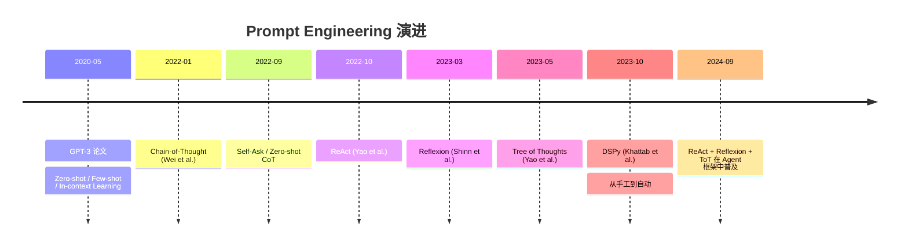
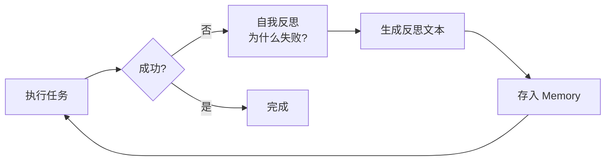
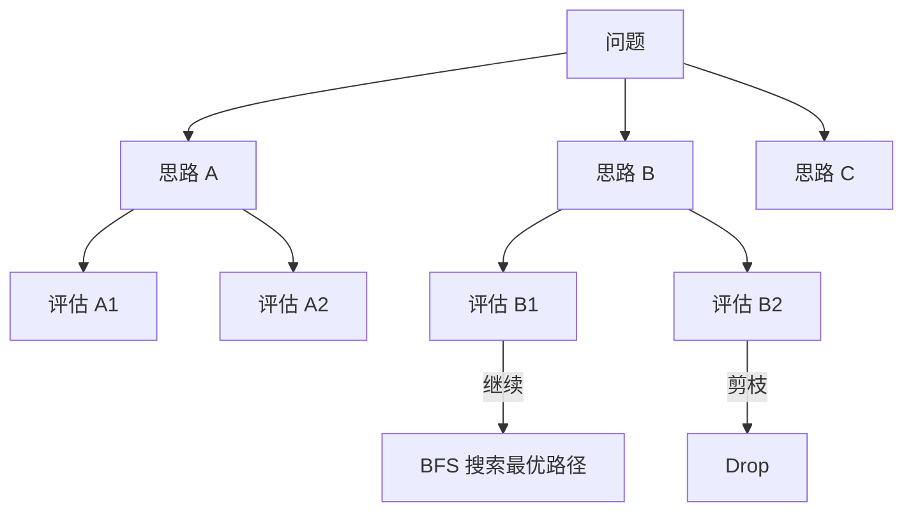
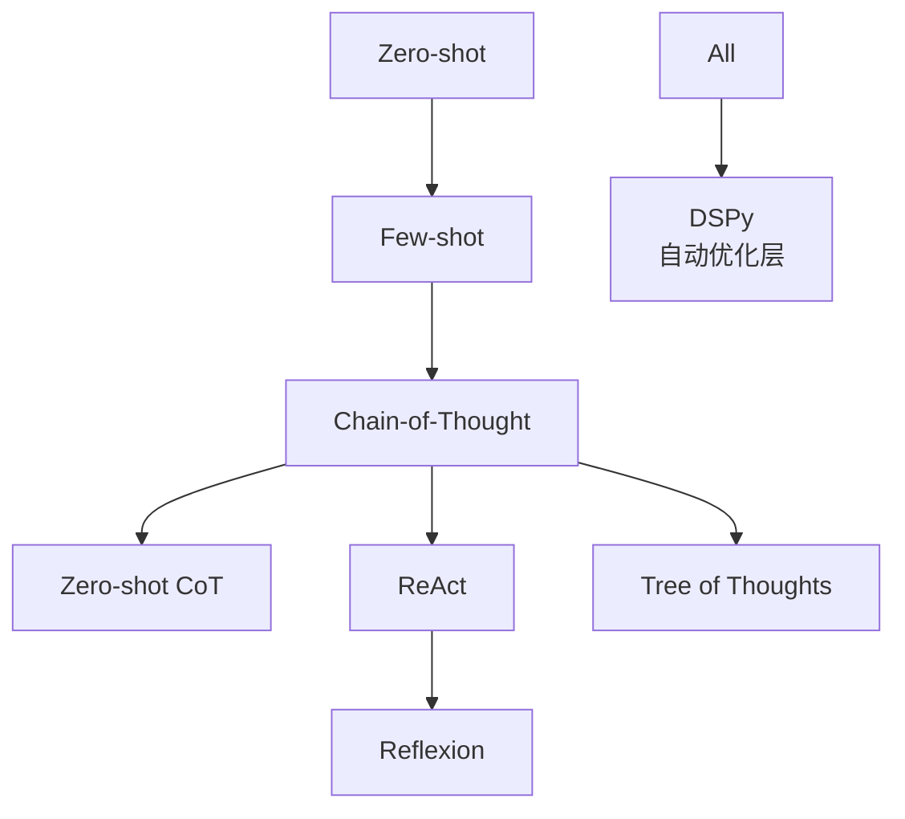
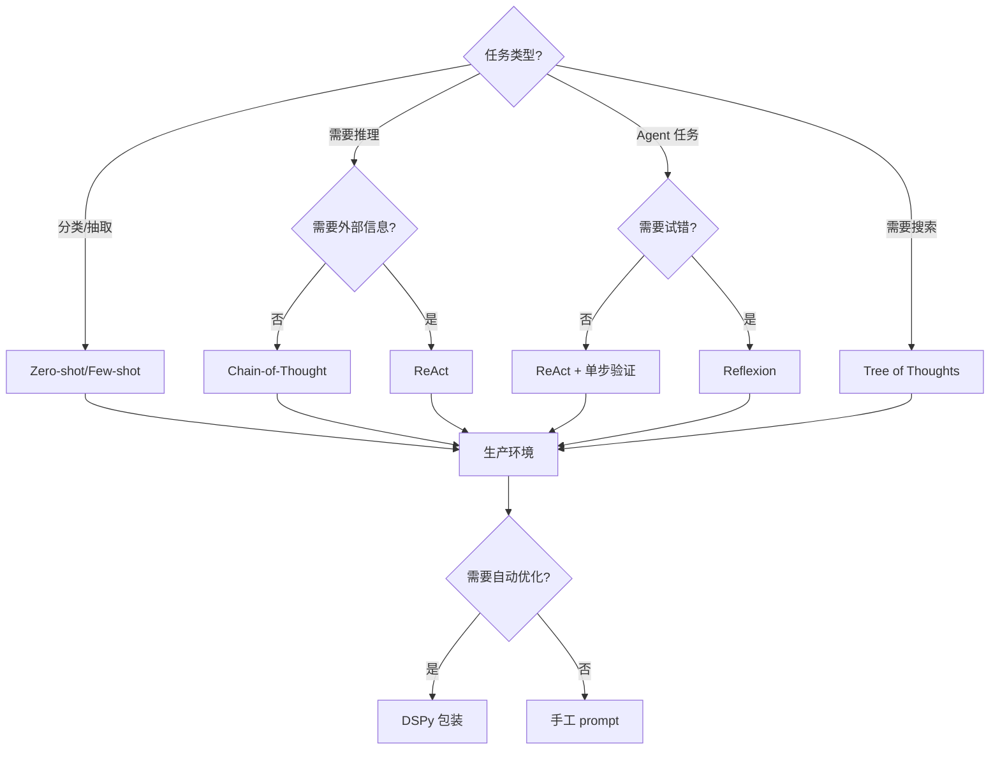
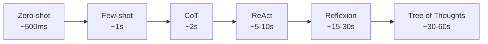

> 2022 年 LLM 刚出时，"会写 prompt"还是简历上的加分项；到 2025 年，"手写 prompt 调优"已经是低效的代名词——DSPy、Reflexion、ReAct 把 prompt 从"手艺"变成"工程"。但**演进不是替代，而是叠加**：CoT 仍在用、ReAct 仍是 Agent 基础，只是被更上层范式包裹。

这是一篇 Prompt Engineering 演进史。从 2020 年 GPT-3 的 Zero-shot 到 2024 年的 Tree of Thoughts、DSPy，七个范式如何逐层叠加：

- **Zero-shot / Few-shot**：in-context 学习的起点
- **Chain-of-Thought (CoT)**：让模型"一步步想"
- **Zero-shot CoT / Self-Ask**：免训练的推理激发
- **ReAct**：reason + act，LLM 第一次能"做事"
- **Reflexion**：让 Agent 自我反思改进
- **Tree of Thoughts**：把推理变成搜索问题
- **DSPy**：从手工 prompt 升级到自动编译优化

<!--more-->

## 一、Prompt Engineering 范式演进时间线



## 二、第一阶段：Zero-shot 与 Few-shot（2020）

### 2.1 Zero-shot

GPT-3 论文 ["Language Models are Few-Shot Learners"](https://arxiv.org/abs/2005.14165) 揭示了一个反直觉的现象：**大模型可以 zero-shot 完成很多任务**，只要在 prompt 里描述清楚。

```python
prompt_zero_shot = """
将以下文本分类为正面或负。

文本：这家餐厅的服务太棒了，菜品也很好吃。
情感：
"""
# 输出：正面
```

### 2.2 Few-shot

给几个 in-context 示例，模型能模仿示例完成新任务：

```python
prompt_few_shot = """
将以下文本分类为正面或负。

文本：这家餐厅的服务太棒了
情感：正面

文本：等位等了 2 小时，太糟糕了
情感：负

文本：菜味道一般，没什么特别
情感：
"""
# 输出：中性
```

**优势**：无需训练，无需调参。**局限**：复杂推理任务表现差（GSM8K 数学题仅 ~10% 准确率）。

## 三、第二阶段：Chain-of-Thought（2022）

### 3.1 核心思想：让模型"一步步想"

[Wei et al. NeurIPS 2022 "Chain-of-Thought Prompting Elicits Reasoning in Large Language Models"](https://arxiv.org/abs/2201.11903) 观察到：**只要在 prompt 里示范"中间推理步骤"，模型的复杂推理能力会被激发**。

```python
prompt_cot = """
问：Roger 一开始有 5 个网球。他又买了 2 罐网球，每罐 3 个。他现在有多少个？
思考：Roger 一开始有 5 个球。2 罐每罐 3 个 = 6 个球。5 + 6 = 11。答案是 11。

问：食堂有 23 个苹果。用掉 20 个做午餐，又买了 6 个。现在有多少个？
思考：
"""
# 模型输出：食堂有 23 个苹果。用掉 20 个剩 3 个。又买了 6 个 = 9 个。答案是 9。
```

**结果**（PaLM 540B、GSM8K 数学题）：

| 方法 | 准确率 |
|------|--------|
| Zero-shot | ~12% |
| Few-shot | ~17% |
| **Chain-of-Thought** | **~57%** |

**40 个百分点的飞跃**，仅靠 prompt 改写，不改模型。

### 3.2 Zero-shot CoT：免训练的"Let's think step by step"

[Kojima et al. 2022 "Large Language Models are Zero-Shot Reasoners"](https://arxiv.org/abs/2205.11916) 发现只要在 prompt 末尾加一句 `"Let's think step by step."`，模型就能自动展开推理：

```python
prompt_zero_shot_cot = """
问：食堂有 23 个苹果。用掉 20 个做午餐，又买了 6 个。现在有多少个？
让我们一步步思考。
"""
```

GSM8K 上 Zero-shot CoT 达到 **40%+**，接近 Few-shot CoT 的 50%+。**这意味着 prompt 范式进入了"无需示例也能激发推理"的时代**。

## 四、第三阶段：ReAct（2022-2023）

### 4.1 核心思想：Reason + Act 协同

CoT 让模型能"想"，但不能"做"。[Yao et al. ICLR 2023 "ReAct: Synergy between Reasoning and Acting in Language Models"](https://arxiv.org/abs/2210.03629) 把推理和动作**交织**：

```
Thought 1: 我需要查一下 iPhone 15 的发布日期
Action 1: Search[iPhone 15 发布日期]
Observation 1: 2023 年 9 月 12 日 Apple 特别活动
Thought 2: 现在我知道答案了
Action 2: Finish[2023 年 9 月 12 日]
```

### 4.2 完整 ReAct Prompt 模板

```python
REACT_PROMPT = """
回答以下问题，你可以使用以下工具：
- Search[query]：搜索网页
- Lookup[term]：在当前文档中查找术语
- Finish[answer]：结束并给出答案

按照以下格式：
Thought: 思考下一步行动
Action: 选择的工具和参数
Observation: 工具返回结果
... (重复 Thought/Action/Observation)
Thought: 我现在知道答案了
Action: Finish[最终答案]

问题：{question}
{scratchpad}
"""
```

**ReAct vs CoT 的本质区别**：

| 维度 | Chain-of-Thought | ReAct |
|------|------------------|-------|
| 推理 | 静态、纯文本 | 与外部工具交错 |
| 信息源 | 仅训练数据 + prompt | 可调用 API、DB、计算器 |
| 错误恢复 | 无法（一旦算错就错） | 可重试不同 Action |
| 适用场景 | 数学推理、逻辑题 | 开放域、QA、Agent |

**HotpotQA 多跳问答上 ReAct 比 CoT 提升 ~15%**，因为多跳必须查询多个事实源。

## 五、第四阶段：Reflexion（2023）

### 5.1 核心思想：让 Agent 自我反思

[Shinn et al. NeurIPS 2023 "Reflexion: Language Agents with Verbal Reinforcement Learning"](https://arxiv.org/abs/2303.11381) 给 ReAct 加了**反思循环**：



### 5.2 反思机制

```python
def reflexion_loop(task, max_trials=3):
    memory = []
    for trial in range(max_trials):
        # 1. 基于历史反思 + 当前任务生成 action
        action = agent.act(task, memory)
        
        # 2. 执行并观察
        observation = env.step(action)
        
        # 3. 判断是否成功
        if is_success(observation):
            return observation
        
        # 4. 反思：为什么失败？
        reflection = llm.generate(
            f"任务：{task}\n"
            f"尝试：{action}\n"
            f"结果：{observation}\n"
            f"反思："
        )
        memory.append(reflection)
    
    return failure
```

**结果**（HumanEval 编程任务）：

| 方法 | 准确率 |
|------|--------|
| GPT-4 base | 67% |
| GPT-4 + ReAct | 71% |
| **GPT-4 + Reflexion** | **88%** |

Reflexion 把 Agent 的"试错-反思-重试"循环用自然语言实现，无需 RL 训练。

## 六、第五阶段：Tree of Thoughts（2023）

### 6.1 核心思想：把推理变成搜索问题

CoT 和 ReAct 都是**单路径**推理——错了就断了。[Yao et al. 2023 "Tree of Thoughts: Deliberate Problem Solving with Large Language Models"](https://arxiv.org/abs/2305.10601) 把推理组织成树：



### 6.2 24 点游戏：4% → 74%

Tree of Thoughts 在 Game of 24（用 4 个数字算出 24）任务上的突破：

| 方法 | 成功率 |
|------|--------|
| 标准 CoT（多次采样） | 4% |
| **Tree of Thoughts (BFS)** | **74%** |

**18 倍提升**，仅靠结构化搜索。

### 6.3 三个核心组件

```python
class TreeOfThoughts:
    def __init__(self):
        self.thought_generator = llm.generate_k_candidates  # k 个候选
        self.state_evaluator = llm.evaluate_state  # 给状态打分
        self.search_algorithm = BFS or DFS  # 搜索策略
    
    def solve(self, problem):
        root = Node(state=problem, thought="")
        frontier = [root]
        while frontier:
            node = self.search_algorithm.pop(frontier)
            # 生成候选思路
            candidates = self.thought_generator(node.state, k=5)
            for candidate in candidates:
                new_node = Node(state=apply(node.state, candidate), thought=candidate)
                score = self.state_evaluator(new_node.state)
                if score > 0.8:
                    return new_node.state
                if score > 0.5:
                    frontier.append(new_node)
        return None
```

## 七、第六阶段：DSPy——Prompt 进入编译时代

### 7.1 核心思想：从手工 prompt 到自动编译

[Khattab et al. Oct 2023 "DSPy: Compiling Declarative Language Model Calls into Self-Improving Pipelines"](https://arxiv.org/abs/2310.03714) 把 prompt 视为**可编译的代码**：

```python
# 传统手工 prompt
prompt = """
你是一个专业的金融分析师。请分析以下公司的财报：
{report}
按照以下 JSON 格式输出：
{{"summary": "...", "risk": "...", "rating": "buy|hold|sell"}}
"""

# DSPy 风格
import dspy

class FinancialAnalyst(dspy.Signature):
    """分析公司财报并给出投资评级"""
    report: str = dspy.InputField()
    summary: str = dspy.OutputField()
    risk: str = dspy.OutputField()
    rating: str = dspy.OutputField()

class AnalystAgent(dspy.Module):
    def __init__(self):
        super().__init__()
        self.analyze = dspy.ChainOfThought(FinancialAnalyst)
    
    def forward(self, report):
        return self.analyze(report=report)

# 自动编译：DSPy 用 few-shot 示例 + teleprompter 自动找到最佳 prompt
agent = AnalystAgent()
optimizer = dspy.BootstrapFewShot(metric=accuracy_metric)
optimized_agent = optimizer.compile(agent, trainset=trainset)
```

### 7.2 DSPy vs 手工 prompt

| 维度 | 手工 prompt | DSPy |
|------|------------|------|
| Prompt 设计 | 工程师手写 | 自动生成 + 优化 |
| 示例选择 | 人工挑 few-shot | BootstrapFewShot 自动挑 |
| 调优成本 | 每次模型升级都要重写 | 编译一次，自动适配 |
| 调优方法 | 凭经验 + trial-error | Bootstrap + MIPRO 优化器 |
| 可维护性 | 散落在多个文件 | Signature 集中管理 |

**结果**（在多个 benchmark 上）：

| 任务 | 手工 prompt | DSPy BootstrapFewShot | DSPy MIPRO |
|------|------------|---------------------|-----------|
| HotpotQA F1 | 0.42 | 0.48 | **0.54** |
| GSM8K | 0.78 | 0.83 | **0.87** |
| HumanEval | 0.62 | 0.68 | **0.73** |

DSPy 的价值在于**把 prompt 优化从"手艺"变成"工程"**——和 ML 模型的超参搜索一样对待。

## 八、范式对比与组合实践

### 8.1 七个范式的本质差异



### 8.2 实战建议：怎么选

| 任务类型 | 推荐范式 | 原因 |
|---------|---------|------|
| 简单分类/抽取 | Zero-shot / Few-shot | 成本最低 |
| 数学/逻辑推理 | Chain-of-Thought | 推理可激发 |
| 多跳 QA / Agent | ReAct | 需要外部信息 |
| 代码生成 + 调试 | Reflexion | 试错能学到东西 |
| 组合优化 / 规划 | Tree of Thoughts | 需要多路径探索 |
| 生产 Pipeline | DSPy | 可维护、可回归 |

### 8.3 组合示例：ReAct + Reflexion + DSPy

```python
import dspy

class ReactAgent(dspy.Module):
    def __init__(self, tools):
        super().__init__()
        self.react = dspy.ReAct(
            signature="question -> answer",
            tools=tools,  # [search, calculator, lookup]
            max_iters=5,
        )
        self.reflector = dspy.ChainOfThought(
            "task, trajectory, outcome -> reflection"
        )
    
    def forward(self, question, max_trials=3):
        for trial in range(max_trials):
            prediction = self.react(question=question)
            if self.is_success(prediction):
                return prediction
            
            # 反思失败原因
            reflection = self.reflector(
                task=question,
                trajectory=prediction.trajectory,
                outcome=prediction.answer,
            )
            
            # 把反思加入下一次的 context
            question = f"{question}\n\nPrevious reflection: {reflection.reflection}"
        
        return prediction

# DSPy 自动编译这个组合 Agent 的所有 prompt
optimized = dspy.MIPROv2(metric=success_rate).compile(
    ReactAgent(tools=[search, calculator]),
    trainset=trainset,
)
```

## 九、生产实践中的权衡

### 9.0 范式选择的决策树



### 9.1 推理成本与质量

### 9.1 推理成本与质量

不同范式的 token 消耗差异巨大：

| 范式 | 单 query token 消耗 | 适用场景 |
|------|-------------------|---------|
| Zero-shot | 100-500 | 简单分类 |
| Few-shot (3 example) | 800-2000 | 中等复杂度 |
| Chain-of-Thought | 1500-3000 | 数学/逻辑 |
| ReAct (3 actions) | 3000-8000 | Agent 任务 |
| Reflexion (3 trials) | 5000-15000 | 编程/复杂决策 |
| Tree of Thoughts (BFS, b=5) | 10000-30000 | 规划/组合优化 |

**实战建议**：先用 Zero-shot/Few-shot 跑 baseline，只在质量不够时升级到 CoT/ReAct；不要无脑用最复杂的范式——成本翻 5 倍但质量只提 2%。

### 9.2 延迟与吞吐量

范式越复杂，延迟越高：



**生产环境的 sweet spot**：
  - **客服/搜索类**：ReAct（5-10s 可接受）
  - **代码助手**：ReAct + 单次 Reflexion（10-20s）
  - **批处理任务**：Tree of Thoughts（30s+ 没问题）
  - **实时对话**：Few-shot + 选择性 CoT（<2s）

### 9.3 调试与可观测性

复杂范式最大的工程问题是**调试难**——ReAct 失败时，是 prompt 错了、Action 错了、还是 Observation 解析错了？

**可观测性方案**：
  - **完整 trajectory 日志**：记录每一步的 Thought/Action/Observation
  - **关键节点评估**：每一步后让 LLM 自我评估"我是否在正确轨道上"
  - **离线 trace 回放**：用 LangSmith / Phoenix 等工具回放 trace

```python
import langsmith

@langsmith.traceable
def react_agent(question):
    trajectory = []
    for step in range(max_steps):
        thought = llm.generate(f"Question: {question}\nTrajectory: {trajectory}\nThought:")
        action = parse_action(thought)
        observation = tools[action.name](*action.args)
        trajectory.append({"thought": thought, "action": action, "observation": observation})
        if action.name == "Finish":
            return action.args[0]
    return None
```

## 十、与已有文章的边界

### 10.0 何时停止追求新范式

Prompt 工程的"边际收益"快速递减。下表展示了质量提升与成本/复杂度提升的非线性关系：

| 范式升级 | 质量提升 | 成本/复杂度提升 | ROI |
|---------|---------|----------------|-----|
| Zero-shot → Few-shot | +5-10% | +50% token 成本 | 高 |
| Few-shot → CoT | +15-30% | +200% token 成本 | 高 |
| CoT → ReAct | +10-20% | +300% token + 工具开发 | 中 |
| ReAct → Reflexion | +5-15% | +500% token（多轮试错） | 中 |
| 任意 → Tree of Thoughts | +20-40%（仅复杂任务） | +1000% token + LLM 调用 N 次 | 低（仅复杂任务）|
| 手工 → DSPy | +5-10% | 一次性编译成本 | 高（生产期）|

**核心结论**：不要为了"用 CoT 而用 CoT"。先用 Zero-shot 跑 baseline，**只在质量不够时升级**。ReAct 和 Reflexion 在简单任务上不仅不会更好，反而会因为 prompt 复杂导致模型困惑。

### 10.1 与已有文章的边界

本系列已有多篇 prompt 相关文章，避免重复：
  - `prompt-template-structured-output.md`：聚焦 JSON/YAML 输出格式与 JSON mode
  - `prompt-injection-defense.md`：聚焦 Prompt 注入攻击与防御
  - `dspy-prompt-optimization.md`：聚焦 DSPy 自动优化的工程细节

本文聚焦**"为什么"和"演进史"**——讲清楚每个范式的来历、解决的问题、组合关系，是 prompt 文章系列的"路线图"。

## 小结

Prompt Engineering 从 2020 年到 2025 年的演进路径，本质是**"控制粒度"逐步提升**：

- **Zero-shot / Few-shot**（2020）：控制"输入"，模型控制"推理"
- **Chain-of-Thought**（2022）：控制"推理过程"
- **ReAct**（2022）：控制"推理 + 动作"
- **Reflexion**（2023）：控制"反思回路"
- **Tree of Thoughts**（2023）：控制"搜索结构"
- **DSPy**（2023-2024）：控制"自动化编译"

每一层都没"取代"前一层——ReAct 内部仍在用 CoT，DSPy 内部仍在用 Few-shot + CoT + Reflexion。**演进是叠加而非替代**。

参考 [Wei 2022 CoT](https://arxiv.org/abs/2201.11903)、[Yao 2022 ReAct](https://arxiv.org/abs/2210.03629)、[Shinn 2023 Reflexion](https://arxiv.org/abs/2303.11381)、[Yao 2023 ToT](https://arxiv.org/abs/2305.10601)、[Khattab 2023 DSPy](https://arxiv.org/abs/2310.03714) 五篇关键论文，这六个范式组成了 LLM 应用层的"基础工具箱"。