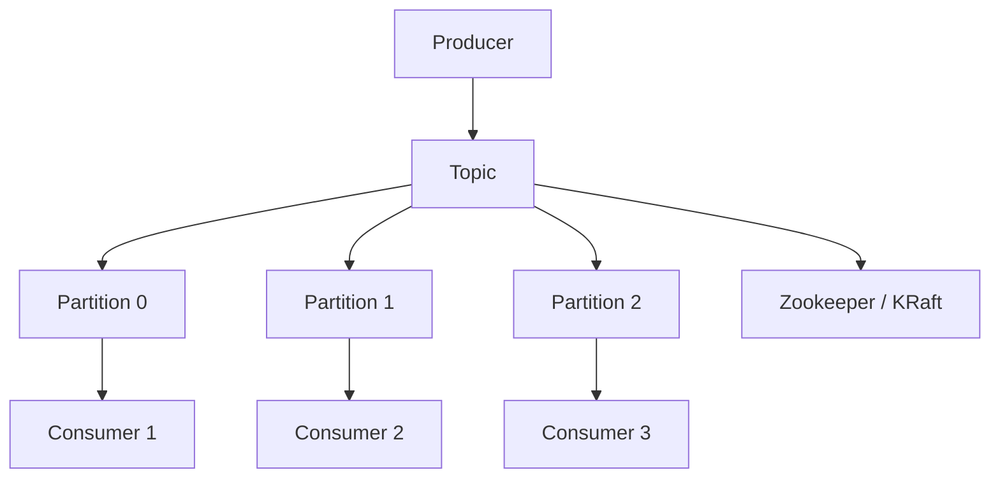
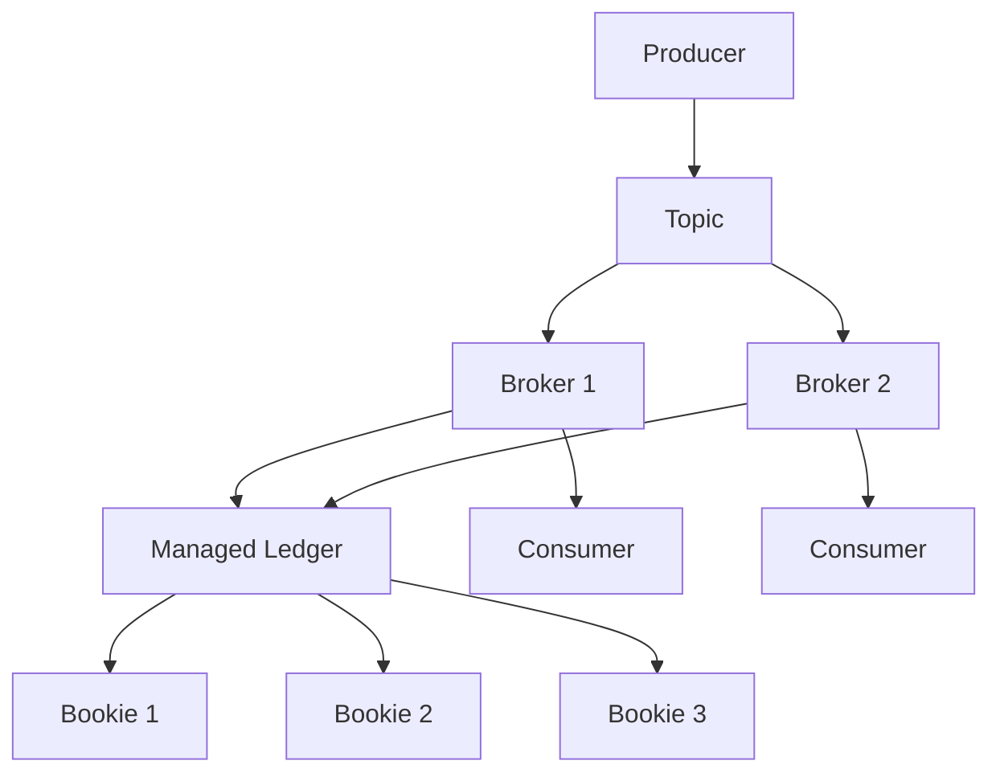

Pulsar 是 Apache 旗下的分布式消息队列，由 Yahoo 开源，专为云原生时代设计；Kafka 是 LinkedIn 开源的老牌消息队列，以高吞吐量闻名。两者在架构、设计哲学和适用场景上有显著差异。

<!--more-->

## 1. 架构上的根本区别

### Kafka 架构



Kafka 的核心是 **Partition（分区）**：
- 每个 Topic 由若干个 Partition 组成
- 消息按 Partition 均匀分布
- 消费者消费哪个 Partition 是固定的

### Pulsar 架构



Pulsar 的核心是 **计算与存储分离**：
- **Broker**：负责处理生产者和消费者的请求，无状态
- **BookKeeper**：负责消息持久化存储，可水平扩展
- 两者独立扩缩容，这是最重要的架构差异

### 核心差异

| 维度 | Kafka | Pulsar |
|------|-------|--------|
| 计算存储 | 耦合（Broker 即存储） | 分离（Broker 无状态） |
| 扩缩容 | 受 Partition 限制 | Broker 和 Bookie 独立扩缩 |
| 故障恢复 | 依赖副本同步 | BookKeeper 多副本 + 即时切换 |

## 2. 消息分发模式

### Kafka 的 Consumer Group

Kafka 的消费者组机制：
- 同一 Consumer Group 内的消费者分担 Partition
- 一个 Partition 只能被一个消费者消费
- 无法实现一条消息广播给所有消费者

```
Consumer Group A：
  Consumer 1 → Partition 0
  Consumer 2 → Partition 1
  Consumer 3 → Partition 2
```

### Pulsar 的四种订阅模式

Pulsar 支持四种订阅类型，更灵活：

| 订阅类型 | 说明 | 消息去向 |
|----------|------|----------|
| **Exclusive** | 独占，只有 1 个消费者 | 一个消费者收全量 |
| **Failover** | 主备切换 | 主消费者收全量，挂了切到备 |
| **Shared** | 共享，轮询分发 | 多个消费者分摊消息 |
| **Key_Shared** | 按 key 哈希分发 | 同一 key 的消息去同一消费者 |

### 一对多广播如何实现

**Kafka**：每个消费者用独立的 Consumer Group
```
Group A (Consumer 1) → 收到所有消息
Group B (Consumer 2) → 收到所有消息
Group C (Consumer 3) → 收到所有消息
```

**Pulsar**：每个消费者用独立的订阅名
```java
consumer1 = client.newConsumer()
    .subscriptionName("consumer-1")  // 独立订阅
    .subscribe();

consumer2 = client.newConsumer()
    .subscriptionName("consumer-2")  // 独立订阅
    .subscribe();
```

**两者本质都是一条消息只投给一个消费者，不是广播。要广播只能靠多组/多订阅。**

## 3. Ack 确认机制

Kafka 和 Pulsar 都通过确认机制来标记消息已被成功消费，但实现粒度和方式有本质区别。

**Kafka：位移提交（Commit Offset）**

Kafka 严格来说不叫"单条 Ack"，而是**提交消费位移（Commit Offset）**。消费了 Offset 1、2、3 后，提交 Offset = 4 的请求，表示"4 之前的消息都已处理"。

- **自动提交**：默认每 5 秒自动提交，程序崩溃可能丢消息
- **手动提交**：调用 `commitSync()` 或 `commitAsync()`，在业务逻辑执行成功后显式提交，精确控制消费进度

**Pulsar：支持单条 Ack**

Pulsar 的存储层 BookKeeper 在底层记录每条消息的确认状态，支持两种模式：

- **单条确认（Individual Ack）**：可单独 Ack 某一条消息，在并发处理或部分消息失败需单独重试的场景下非常灵活
- **累积确认（Cumulative Ack）**：Ack 某一条消息，等同于 Kafka 的方式，表示该消息之前的所有消息都已消费

| 特性 | Kafka | Pulsar |
|------|-------|--------|
| 核心概念 | 提交 Offset | 消息 Ack |
| Ack 粒度 | 仅累积提交，无法单独 Ack 中间某条 | 支持单条 Ack，也支持累积 Ack |
| 适用场景 | 高吞吐顺序消费 | 流式顺序消费 + 传统队列并发消费 |


## 4. 消息顺序保证

| 场景 | Kafka | Pulsar |
|------|-------|--------|
| 全局有序 | 需要单 Partition | 需要 Exclusive/Failover 订阅 |
| 分区有序 | 按 Partition 内的 offset | 按 Key_Shared 同一 key 有序 |
| Shared 模式有序 | ❌ 无序 | ❌ 无序 |

## 5. 性能对比

### 吞吐量

两者都能达到**百万级 QPS**：
- Kafka：优化过的顺序读写，吞吐极高
- Pulsar：用 BookKeeper 的分段 Entry 日志，也能达到类似量级

### 延迟

- Kafka：端到端延迟可低至 **2-5ms**（顺序读写优势）
- Pulsar：端到端延迟约 **5-10ms**（分层架构略有开销）

### 适用场景倾向

| 场景 | 推荐 |
|------|------|
| 超高吞吐量日志采集 | Kafka |
| 需要计算存储独立扩缩 | Pulsar |
| 低延迟金融交易 | Kafka |
| 多租户隔离 | Pulsar |
| 跨地域复制 | Pulsar 原生支持更好 |

## 6. 多租户（Multi-Tenancy）

这是 Pulsar 的强项：

- **Tenant（租户）和 Namespace（命名空间）** 层级设计
- 每个租户独立配置：TTL、Retention、Rate Limiting
- 资源隔离，天然适合云服务提供

Kafka 的多租户能力需要额外方案（如 Strimzi、Confluent RBAC）。

## 7. 消息回查与重放

### Seek 跳转回查

两者都支持跳转到指定位置重消费：

**Kafka：**
```java
consumer.seek(new TopicPartition(topic, partition), offset);
```

**Pulsar：**
```java
consumer.seek(messageId);
consumer.seek(timestamp);
```

### Nack 否定确认

**Pulsar 支持 Nack：**
```java
consumer.negativeAcknowledge(message);  // 触发重投
```

**Kafka 不支持 Nack**，只能用手动 commit offset + 重新消费。

### 延迟重投

**Pulsar 支持 Delayed Delivery：**
```java
producer.newMessage()
    .deliverAfter(5, TimeUnit.SECONDS)
    .value("msg");
```

Kafka 需要用时间轮或第三方方案实现延迟消息。

## 8. 地理复制（Geo-Replication）

Pulsar 原生支持跨机房复制：
- 配置 `replication_clusters`
- 消息自动同步到多个集群
- 消费端无感知

Kafka 需要用 MirrorMaker 或外部方案做跨集群复制。

## 9. 总结对比表

| 特性 | Kafka | Pulsar |
|------|-------|--------|
| 开发公司 | LinkedIn (now Confluent) | Yahoo (now Apache) |
| 成熟度 | ⭐⭐⭐⭐⭐ 成熟稳定 | ⭐⭐⭐⭐ 成熟 |
| 社区生态 | ⭐⭐⭐⭐⭐ 庞大 | ⭐⭐⭐ 中等 |
| 架构 | 计算存储耦合 | 计算存储分离 |
| 吞吐量 | 极高 | 极高 |
| 延迟 | 更低 | 中等 |
| 顺序保证 | Partition 内有序 | Exclusive/Failover 有序 |
| 多租户 | 需额外方案 | 原生支持 |
| 跨地域复制 | 需 MirrorMaker | 原生支持 |
| 延迟消息 | 需外部方案 | 原生支持 |
| Nack 重投 | 不支持 | 支持 |

## 10. 选型建议

**选 Kafka：**
- 日志采集、大数据流处理
- 需要最成熟的生态和周边工具
- 超低延迟需求

**选 Pulsar：**
- 云原生架构，需要计算存储独立扩缩
- 多租户场景
- 跨地域复制需求
- 需要原生延迟消息和 Nack 机制

两者都是优秀的消息队列，核心区别在于**架构设计哲学**——Kafka 追求极致性能，Pulsar 追求云原生时代的灵活性。


**参考版本：**
- Kafka：3.6+
- Pulsar：3.0+

<!--more-->