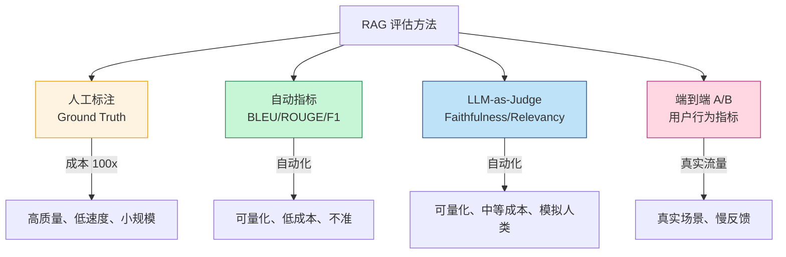
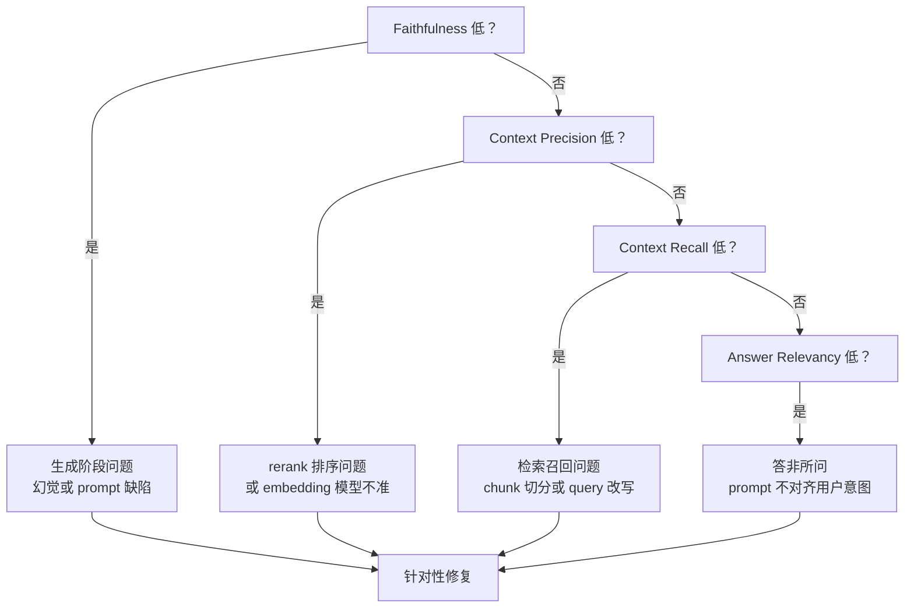
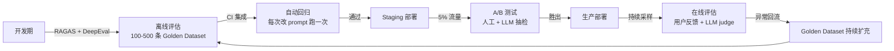

> 上线一个 RAG 系统不写评估，就像把 SQL 代码 push 上生产但从不跑测试。LLM 输出有随机性，prompt 微调、embedding 换模型、rerank 加权调整都可能让质量断崖式下跌——没有自动化的回归测试，你永远不知道哪次迭代把检索质量搞砸了。

这篇文章不讲"为什么要做评估"，讲**怎么搭一套真正能用的 RAG 评估体系**：

- 四种评估方法（人工 / 自动指标 / LLM-as-Judge / 端到端 A/B）的取舍
- Golden Dataset 怎么造、造多少、怎么维护
- RAGAS 四大核心指标的定义与局限
- LLM-as-Judge 与人类标注的相关系数证据
- 实战代码：基于 RAGAS + DeepEval 的离线评估 pipeline

<!--more-->

## 一、RAG 评估的四种方法

RAG 的输出非确定性，传统软件测试的"assert expected == actual"在这里失效。RAG 系统的失败模式也比纯 LLM 更复杂——可能是**检索错了**、**rerank 没排好**、**生成时幻觉了**、**引用了错误的 chunk**，需要分层评估：



### 1.1 人工标注：Ground Truth 但太贵

传统 IR 评估的"金标准"。给定 200 条 query，由领域专家标注"ground truth answer" + "ground truth relevant chunks"。但 RAG 场景有两个问题：

1. **标注成本极高**：每条 query 需要人工阅读所有候选 chunk、写标准答案、检查生成结果，**单条成本 5-30 分钟**，200 条就要 100+ 工时
2. **主观性强**：什么是"好的答案"？同一 query 不同专家标注的答案一致性通常只有 0.6-0.7（Cohen's Kappa）

**实际工程建议**：人工标注只占整体评估的 **5-10%**，用于校准 LLM-as-Judge、构建种子 Golden Dataset。

### 1.2 自动指标：BLEU/ROUGE 不可信

传统 NLP 的字符串重叠指标（BLEU、ROUGE、METEOR）曾是参考，但 **RAG 场景严重失效——同一个语义可以有多种合法表达**。"iPhone 15 的发布日期"和"iPhone 15 在 2023 年 9 月 12 日发布"语义完全等价，但 BLEU 分数可能 <0.1。

| 指标 | 适用场景 | RAG 场景失效原因 |
|------|---------|----------------|
| BLEU | 机器翻译（n-gram 精确匹配） | 不接受同义改写 |
| ROUGE-L | 摘要（最长公共子序列） | 不接受语义等价 |
| METEOR | 同义词扩展 | 仍偏向字面匹配 |
| F1 (token) | 分类 | 不接受语序变化 |
| BERTScore | 语义相似 | 但仍以 reference 为锚点 |

**结论**：自动指标只能用于**回归基线对比**（同一问题的两版答案分数对比），不能作为绝对质量分数。

### 1.3 LLM-as-Judge：当下主流

用强 LLM（GPT-4、Claude 3.5 Sonnet）当裁判，按 rubric 评估生成结果。核心证据来自 [Zheng et al. 2023 "Judging LLM-as-a-Judge with MT-Bench and Chatbot Arena"](https://arxiv.org/abs/2306.05685)，GPT-4 与人类标注的相关系数达到 **~85%**，接近人类之间的一致性。

**核心指标体系——RAGAS 四大指标**：

| 指标 | 定义 | 测量什么 |
|------|------|---------|
| Faithfulness | 答案中的每个事实是否能从 context 中找到依据 | 抗幻觉能力 |
| Answer Relevancy | 答案与 query 的语义相关度 | 是否答非所问 |
| Context Precision | 检索到的 context 排序质量（相关块是否在前面） | rerank 效果 |
| Context Recall | ground truth 涉及的事实是否被检索到 | 召回率 |

RAGAS 的核心创新是 **reference-free**——前两项指标**不需要 ground truth 答案**，仅靠 LLM 自身就能评估。这点极大降低了评估门槛，详见 [Es et al. 2023 arXiv:2309.15217](https://arxiv.org/abs/2309.15217)。

### 1.4 端到端 A/B：唯一真实场景

任何离线指标都不能替代真实用户行为。RAG 系统的关键在线指标：

- **Answer Accept Rate**：用户对生成答案的接受率（点赞/采纳/复制）
- **Retrieval Click-Through**：返回的文档被点击的比例
- **Hallucination Report Rate**：用户主动标记"答错了"的比例
- **Session Success Rate**：用户在一次会话中解决问题的比例

线上 A/B 测试周期长、流量切割复杂，必须**先有离线评估做兜底**，再上 A/B 验证。

## 二、RAGAS 评估实战

### 2.1 准备评估数据集

不需要 ground truth 答案，但需要 **(query, context, answer)** 三元组。每条样本至少包含：

```python
eval_dataset = [
    {
        "question": "iPhone 15 的发布日期是什么时候？",
        "contexts": [
            "iPhone 15 于 2023 年 9 月 12 日在 Apple 特别活动上发布。",
            "iPhone 15 系列包含标准版、Plus、Pro 和 Pro Max 四个型号。"
        ],
        "answer": "iPhone 15 在 2023 年 9 月 12 日发布。",
        "ground_truth": "2023 年 9 月 12 日"  # 仅 Context Recall 需要
    },
    # ... 至少 100 条样本才能有统计意义
]
```

### 2.2 用 RAGAS 跑评估

```python
from ragas import evaluate
from ragas.metrics import (
    faithfulness,
    answer_relevancy,
    context_precision,
    context_recall,
)
from datasets import Dataset

# 转换为 HuggingFace Dataset 格式
dataset = Dataset.from_list(eval_dataset)

# 跑评估
result = evaluate(
    dataset=dataset,
    metrics=[faithfulness, answer_relevancy, context_precision, context_recall],
    llm=judge_llm,          # GPT-4 或 Claude 3.5
    embeddings=judge_embeddings,  # text-embedding-3-small
)

print(result)
# {'faithfulness': 0.92, 'answer_relevancy': 0.85,
#  'context_precision': 0.78, 'context_recall': 0.88}
```

**实战坑 1**：judge LLM 选 GPT-4 比选 GPT-3.5 准 30-50%，但成本贵 10-30 倍。建议**离线评估用 GPT-4（少量样本），线上抽样用 GPT-3.5-turbo（成本优先）**。

**实战坑 2**：Context Precision 对 prompt 极其敏感——LLM judge 怎么定义"相关"、怎么数"正确排序"，会导致分数波动 ±0.1。建议**自定义 prompt 后用 50 条人工标注样本做校准**。

### 2.3 指标诊断流程图



## 三、LLM-as-Judge 的偏差与缓解

LLM judge 不是完美的。已知的几种系统性偏差：

| 偏差类型 | 表现 | 缓解方法 |
|---------|------|---------|
| Position Bias | 偏好第一个出现的答案 | 调换答案顺序后取平均 |
| Verbosity Bias | 偏好更长的答案 | rubric 明确长度无关 |
| Self-Enhancement Bias | 偏好自己生成的答案 | judge 与生成用不同模型 |
| Anchoring Bias | 偏好与 reference 相似的答案 | 不要给 reference |

参考 [Zheng et al. 2023](https://arxiv.org/abs/2306.05685) 的实验：单一 judge 的位置偏差可达 **15-25%**，调换顺序后取平均可以降到 **<5%**。

## 四、进阶：ARES 自动 prompt 选择

[RAGAS 适合单次评估](https://arxiv.org/abs/2309.15217)，但如果你想**自动选择最好的 RAG 配置**（chunk size、embedding 模型、rerank 权重），可以用 [Saad-Falcon et al. 2024 "ARES"](https://aclanthology.org/2024.acl-long.624/)。

ARES 的核心创新是**用少量人工标注样本 + 自合成数据，训练一个针对你领域的 LM judge**：

```python
from ares import ARES

ares = ARES(
    llm_judge="gpt-4",
    synthetic_query_generator="gpt-3.5-turbo",
    human_preference_domain=human_labels,  # 50-100 条人工标注
)

# 评估多个 RAG 配置
results = ares.evaluate(
    rag_configs=[config_a, config_b, config_c],
    evaluation_set=domain_specific_qa,
)

# 输出排序 + 置信区间
print(results.to_dataframe())
#   config  faithfulness  context_relevance  ci_lower  ci_upper
# 0   A          0.91             0.85        0.88      0.94
# 1   C          0.89             0.88        0.86      0.92  ← 最优
# 2   B          0.85             0.82        0.81      0.89
```

**实战建议**：ARES 适合**RAG 系统选型期**（换 embedding、换 chunk size），生产期用 RAGAS + 周期性人工抽检更经济。

## 五、构建你的 RAG 评估体系

一个生产级 RAG 评估体系应包含：



**实战建议**：

1. **从 100 条种子数据集开始**：50 条 easy + 30 条 medium + 20 条 hard（hard 是边缘 case、否定问题、多跳推理）
2. **每次改 embedding/rerank/prompt 自动跑评估**（CI hook）
3. **每月抽样 100 条线上 query 做 LLM-as-Judge**（GPT-3.5-turbo 即可）
4. **线上埋点 Answer Accept Rate 和 Hallucination Report**（最真实的反馈）
5. **每季度扩 50 条人工标注**，让 Golden Dataset 滚动增长

## 六、CI/CD 集成：把评估做成回归测试

### 6.1 每次改 prompt 自动跑评估

```python
# .github/workflows/rag-eval.yml
name: RAG Evaluation
on:
  pull_request:
    paths:
      - 'src/rag/prompts/**'
      - 'src/rag/retriever.py'

jobs:
  eval:
    runs-on: ubuntu-latest
    steps:
      - uses: actions/checkout@v4
      - uses: actions/setup-python@v5
        with:
          python-version: '3.11'
      
      - name: Run RAGAS evaluation
        run: |
          pip install ragas deepeval
          python -m pytest tests/test_rag_eval.py --tb=short
      
      - name: Check regression
        run: |
          python scripts/check_regression.py \
            --baseline=main \
            --threshold=0.05 \
            --metrics=faithfulness,answer_relevancy
```

**实战坑 3**：跑一次 RAGAS 评估 ~5-15 分钟（200 条样本 + GPT-4 judge）。建议**并行化**——把 Golden Dataset 拆 4 份，4 个 GitHub Actions job 并行跑。

### 6.2 评估结果可视化

每次评估产出报告，包含：

- 各指标 baseline 对比柱状图
- 按问题类型分组的指标（如"表格类问题 faithfulness 低"）
- 失败 case 抽样（10 条 worst faithfulness 的 query + answer）

把报告作为 PR comment 自动发布，让代码评审者能直接看到 prompt 改动对评估分数的影响。

## 七、结语：从"看感觉"到"看数字"

RAG 系统的迭代本质上是一个**数据闭环**——评估发现问题 → 修改 prompt/embedding/chunk → 重新评估 → 验证回归。没有评估体系的 RAG 团队，往往陷入以下陷阱：
  - "感觉答案不错"——主观、不可量化、无法回归
  - "线上反馈"——慢、样本稀疏、问题定位困难
  - "复制粘贴别人的 prompt"——不针对自己的领域数据

把这篇文章的工程实践落地：

1. 第 1 周：用 RAGAS 跑 100 条样本，建立 baseline
2. 第 2 周：配置 CI 自动评估，每次改 prompt 跑一次
3. 第 3 周：每月抽样 100 条线上 query 做 LLM-as-Judge
4. 第 4 周：上线 A/B 测试框架，接入 Answer Accept Rate

四步走完后，RAG 系统就有完整的数据驱动迭代能力。

## 小结

RAG 评估的核心是**分层组合**：人工标注做金标准、RAGAS 做离线自动化、LLM-as-Judge 做质量近似、线上 A/B 做真实反馈。四层缺一不可：

- 只有人工标注：评估成本指数级，无法回归
- 只有自动指标：BLEU/ROUGE 在 RAG 上不可信
- 只有 LLM-as-Judge：可能与人类偏差对齐错误
- 只有 A/B：发现问题太慢，错过的代价高

参考 [RAGAS 论文](https://arxiv.org/abs/2309.15217)、[MT-Bench 论文](https://arxiv.org/abs/2306.05685)、[ARES 论文](https://aclanthology.org/2024.acl-long.624/) 三篇关键文献，把这四层搭起来，RAG 系统才有"可观测、可回归"的质量保障。