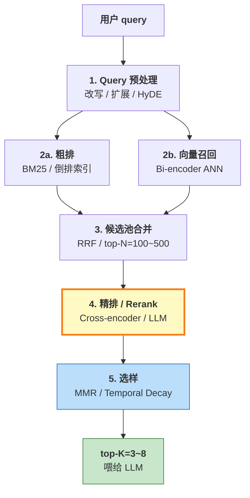

RAG（Retrieval-Augmented Generation）的"检索"二字，背后是一整条工程流水线——从用户 query 出发，经过**粗排、召回、精排、选样**四步处理后，才把 top-K 文档喂给 LLM。这条流水线上每个环节都有专门的算法优化，但**最容易出效果、也最容易被忽视**的，是中间的**Rerank 阶段**。

本文用一张全景图把 RAG 检索流水线串起来，然后按"相关性、多样性、时效性"三个维度，对 **7 种主流 Rerank 算法**做横向对比。

<!--more-->

## 一、RAG 检索流水线全景

RAG 检索不是"搜一下 → 喂给 LLM"这么简单。一次完整的检索要经过 5 个阶段：



各阶段的职责分工：

| 阶段 | 目的 | 典型技术 | 延迟预算 |
|------|------|---------|---------|
| **1. Query 预处理** | 让 query 更"易搜" | Query Rewrite、Query Expansion、HyDE | 10-100ms |
| **2. 粗排 + 向量召回** | 从百万级文档里捞出几百条候选 | BM25、Bi-encoder + HNSW/IVF | 10-50ms |
| **3. 候选池合并** | 多种召回器结果融合 | RRF、Convex Combination | < 1ms |
| **4. 精排（Rerank）** | 对候选池精排，提升相关性 | Cross-encoder、ColBERT、Cohere Rerank、LLM Rerank | 50-2000ms |
| **5. 选样** | 选 top-K，注意多样性和时效 | MMR、Temporal Decay、Top-K | < 1ms |

**关键洞察**：
- 阶段 2 决定**召回率（recall）**——相关文档有没有被找到
- 阶段 4 决定**精度（precision）**——捞出来的文档里，相关的有多少
- 阶段 5 决定**信息密度**——top-K 是相关但雷同，还是相关且多样

这三个维度互相独立，可以分别优化。

## 二、阶段 2 详解：粗排与向量召回

### 2.1 BM25（稀疏检索的代表）

BM25 是个 1994 年提出的**经典 TF-IDF 改进版**——在 30 年后的今天仍是工业级 RAG 的默认起点。

**核心思想**：词频（TF）饱和 + 文档长度归一化 + 逆文档频率（IDF）加权。

**优点**：
- 速度快、零依赖、零成本
- 对**精确关键词匹配**特别敏感（产品名、人名、专有名词）
- 解释性强——能告诉你"匹配了哪些词"

**缺点**：
- 不懂语义——"退款"和"退订"在 BM25 看来是两个无关词
- 受分词质量影响大

**典型参数**：
```
BM25 分数 = IDF(qi) * (tf(qi,D) * (k1+1)) / (tf(qi,D) + k1 * (1 - b + b * |D|/avgdl))
```
- k1 ≈ 1.2-2.0：词频饱和参数
- b ≈ 0.75：文档长度归一化强度

### 2.2 Bi-encoder（向量召回的代表）

Bi-encoder 是 2019 年 Sentence-BERT 提出后普及的范式：

**核心思想**：把 query 和 doc 各自编码成向量（独立编码），再用余弦相似度比较。

```
query  → [Encoder] → v_q     ┐
                             ├── cos(v_q, v_d) = 相关性
doc    → [Encoder] → v_d     ┘
```

**优点**：
- 文档向量可**离线预计算**，在线检索时只编码 query
- ANN 索引（HNSW/IVF）让百万级检索在 **10-50ms** 完成
- 天然支持语义匹配（"退款" ≈ "退订" ≈ "取消订单"）

**缺点**：
- **query 和 doc 在编码时互相不可见**——模型看不到 query-doc 之间的交互信号
- 判别力上限受限于 embedding 模型的表达力

### 2.3 BM25 + Bi-encoder 混合（Hybrid Search）

现代 RAG 系统的**最佳实践**是两者并用：

```
final_score = α * BM25_score + (1-α) * vector_score
            ↑ α 通常 0.3 ~ 0.5
```

**理由**：
- BM25 兜底精确关键词（专有名词、产品名）
- 向量召回兜底语义匹配（同义、改写）
- 两者 score 区间不同，需要**分数归一化**（min-max 缩放 / 排名归一化）

这就是**第一道 Rerank**——在粗排阶段已经做了一次相关性融合。

## 三、阶段 3 详解：候选池融合

多种召回器（BM25 + 向量 + 知识图谱）各自返回 top-N，结果需要**合并成一个候选池**。

### 3.1 Reciprocal Rank Fusion (RRF)

**机制**：每个召回器给每个文档一个排名，按公式加权求和：

```
RRF_score(d) = Σ_i  1 / (k + rank_i(d))
              ↑ k 通常取 60
              ↑ rank_i 是文档 d 在召回器 i 中的排名
```

**示例**：

| 文档 | BM25 rank | 向量 rank | RRF score |
|------|----------|----------|-----------|
| A | 1 | 5 | 1/61 + 1/65 ≈ 0.0318 |
| B | 3 | 1 | 1/63 + 1/61 ≈ 0.0323 |
| C | 2 | 4 | 1/62 + 1/64 ≈ 0.0318 |

B 在两个召回器里都靠前 → RRF 分数最高。

**优点**：
- 零超参数（k 是经验值）
- 适用于异构召回器（分数区间不同）
- 简单稳定

**缺点**：
- 不考虑具体分数值，只看排名
- 对长尾文档不友好

### 3.2 Convex Combination（凸组合）

```
final_score = α * BM25_normalized + (1-α) * vector_normalized
             ↑ BM25 分数需先 min-max 归一化到 [0, 1]
             ↑ α 经验值 0.3 ~ 0.5
```

**vs RRF**：凸组合需要归一化、对分数分布敏感，但能用上具体分数值。

## 四、阶段 4 详解：精排（Rerank）算法

精排是整个流水线里**最值得投入算力**的环节。粗排找出"可能相关"的 100 条候选，精排要把它们从"可能相关"变成"**确定相关**"。

### 4.1 Cross-encoder（最经典的精排方法）

**机制**：把 query 和 doc 拼接成一对 `[CLS] query [SEP] doc [SEP]`，送进 Transformer，让模型**看到 query 和 doc 之间的 token 级交互**。

```
[CLS] query tokens [SEP] doc tokens [SEP]
                ↓
        Transformer (12-24 层)
                ↓
        [CLS] 位置接一个分类头
                ↓
        标量分数（logit 或 sigmoid）
```

**为什么判别力更强**：
- Bi-encoder 编码时 query 和 doc 是**互相不可见**的——只能各自抽象成向量
- Cross-encoder 让 query 的每个 token 都能**直接 attend** 到 doc 的每个 token
- 这层 attention 让模型能捕捉到"退款"和"订单取消"之间的真实匹配信号

**典型模型**：
- **英文**：BERT、MiniLM cross-encoder（速度快）
- **中文**：BGE-Reranker、Qwen3-Reranker

**性能特征**：
- 模型大小：110M ~ 600M 参数
- 推理延迟：50-200ms / 100 候选（CPU），5-20ms（GPU）
- 不能离线预计算——必须在线跑

### 4.2 ColBERT / ColBERTv2（Late Interaction）

**机制**：跟 Bi-encoder 类似但**细粒度更高**——给 query 和 doc 里**每个 token** 都编码一个向量，匹配时算**所有 query token × 所有 doc token 的最大相似度之和**。

```
query:  [q1, q2, q3]  → 3 个 token 向量
doc:    [d1, d2, d3, d4, d5]  → 5 个 token 向量
                               ↓
score = Σ_i  max_j  cos(q_i, d_j)
       ↑ 对每个 query token，找最像的 doc token
```

**优点**：
- 比 Bi-encoder 判别力强（保留 token 级信息）
- doc 端向量可离线预计算
- 查询速度比 cross-encoder 快

**缺点**：
- 存储开销大（每 doc 存 100+ 个 token 向量）
- 实现复杂，主流框架支持有限

### 4.3 Cohere Rerank / BGE-Reranker（API 化精排）

工业界很多团队不自己跑模型，直接用托管 API：

| 服务 | 模型 | 特点 |
|------|------|------|
| **Cohere Rerank 3** | 闭源 | 英文最强，支持多语言 |
| **BGE-Reranker-v2** | 开源 | 中英文都好，可自部署 |
| **Qwen3-Reranker** | 开源 | 阿里出品，中文强 |
| **Jina Rerank** | 闭源 | 性价比高 |

**典型调用**：
```python
from cohere import Client
client = Client(api_key="...")
results = client.rerank(
    query="如何申请退款",
    documents=["退款 FAQ", "退货流程", "订单取消说明"],
    top_n=3
)
```

**优点**：
- 零运维，零部署
- 工业级质量
- 按调用付费

**缺点**：
- 每次调用有**网络往返**（50-200ms）
- 数据出域（合规风险）
- 单价累积

### 4.4 LLM Rerank（GPT-4 / Claude 排序）

**机制**：直接把候选文档列表 + query 喂给大模型，让它输出**重新排序后的列表**。

**典型 prompt 模板**：
```
你是一个专业的内容审核员。请根据 query 对下列文档按相关性排序，
输出 JSON 格式：[{"id": 1, "relevance": 0.95}, ...]

query: 如何申请退款
文档:
1. 退款 FAQ 第 1 段
2. 退货流程文档
3. 订单取消说明
...
```

**优点**：
- 判别力极强——LLM 真的"理解"了语义
- 可解释——LLM 可以输出排序理由
- 灵活——可加任意业务规则（如"优先 2024 年以后的文档"）

**缺点**：
- **极贵**——精排 100 条可能花费 0.5 ~ 2 元
- **极慢**——1-10 秒
- **不稳定**——temperature 不为 0 时排序会变

**适用场景**：小批量、高质量、高单价任务（法律检索、医疗问答、企业知识库）

## 五、阶段 5 详解：选样算法（多样性 + 时效性）

精排后的候选已经"按相关性排好序"，但**直接取 top-K 仍有问题**——相关文档可能高度雷同。这一阶段解决的是**信息密度**问题。

### 5.1 MMR（最大边际相关性）

1998 年 Carbonell & Goldstein 提出的经典算法。核心思想是**贪心迭代选择**：每一步挑"既相关又跟已选不太像"的文档。

**公式**：
```
MMR(d) = λ * Sim(d, q) - (1-λ) * max similarity(d, d')
                                              ↑ d' 是已选中的 doc
```

| λ 值 | 行为 |
|------|------|
| 1.0 | 纯相关排序，**MMR 退化为朴素 top-K** |
| 0.7 | 70% 看相关，30% 拉多样性（**默认值**）|
| 0.5 | 相关和多样性五五开 |
| 0.2 | 多样性压过相关（**风险区**）|

**性能**：O(K·N·d) 浮点运算，< 1ms，零外部依赖。

**适用**：top-K 同质化严重的场景（FAQ、客服对话、新闻聚合）。

### 5.2 Temporal Decay（时序衰减）

**机制**：在相关性分数之外，乘上一个时间衰减因子，越新的文档分数越高。

```
final_score = relevance * exp(-Δt / half_life)
              ↑ Δt = 当前时间 - 文档时间
              ↑ half_life = 半衰期（典型 30 天）
```

**适用场景**：
- 新闻聚合
- 股票研报
- 聊天记录
- 任何有**强时效性**的知识库

**不适用**：技术文档、书籍、字典类静态知识。

### 5.3 Top-K（朴素选样）

直接取精排后的前 K 条。

**问题**：当精排靠前的文档**高度雷同时**（同义 FAQ、相近新闻），top-K 信息密度低。

**何时够用**：
- 候选池已经多样性很好
- top-K ≤ 3（即使雷同也能用）
- 用户期待"最像 top-1"那一条

## 六、7 种 Rerank 算法横向对比

| 算法 | 维度 | 算力来源 | 延迟 | 推荐场景 |
|------|------|---------|------|---------|
| **BM25** | 相关性（精确）| 倒排索引 | < 10ms | 关键词兜底 |
| **Bi-encoder** | 相关性（语义）| ANN 检索 | 10-50ms | 语义召回 |
| **Cross-encoder** | 相关性（精排）| 模型推理 | 50-200ms | 通用精排 |
| **ColBERT** | 相关性（细粒度）| Late interaction | 30-100ms | 高质量精排 |
| **Cohere Rerank API** | 相关性（SOTA）| 远程 API | 100-300ms | 工业级英文 |
| **LLM Rerank** | 相关性（极致）| GPT-4 / Claude | 1-10s | 小批量高价值 |
| **MMR** | 多样性 | 纯向量距离 | < 1ms | 防 top-K 雷同 |
| **Temporal Decay** | 时效性 | 算术运算 | < 1ms | 新闻 / 聊天 |

**典型组合**：
- **轻量级 RAG**：BM25 + Bi-encoder + MMR（**总成本 < 100ms**）
- **工业级 RAG**：BM25 + Bi-encoder + RRF + Cross-encoder + MMR（**总成本 200-500ms**）
- **极致质量 RAG**：Query Expansion + BM25 + Bi-encoder + RRF + Cohere Rerank + MMR + Temporal Decay（**总成本 1-2 秒**）

---

**参考资料：**

1. **Gao, Y., et al. (2024).** *Retrieval-Augmented Generation for Large Language Models: A Survey*. [arXiv:2312.10997](https://arxiv.org/abs/2312.10997) — 对应文章总框（贯穿一、二、三节）。
2. **Jha, R., et al. (2024).** *Jina-ColBERT-v2: A General-Purpose Multilingual Late Interaction Retriever*. [arXiv:2408.16672](https://arxiv.org/abs/2408.16672) — 对应 4.2 节晚交互检索。
3. **Santhanam, K., et al. (2022).** *ColBERTv2: Effective and Efficient Retrieval via Lightweight Late Interaction*. [arXiv:2112.01488](https://arxiv.org/abs/2112.01488) — 上篇的 ColBERT 基础版本，4.2 节补充。
4. **Cohere (2024).** *Rerank 3.5: Multilingual Search Reranker for Enterprise* — 对应 4.3 节工业级 Rerank API。
5. **Qwen Team (2025).** *Qwen3-Embedding & Qwen3-Reranker Technical Report* — 对应 4.3 节中文开源 Rerank 代表。
