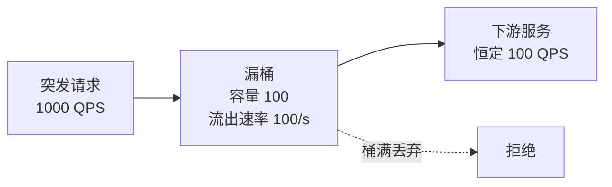
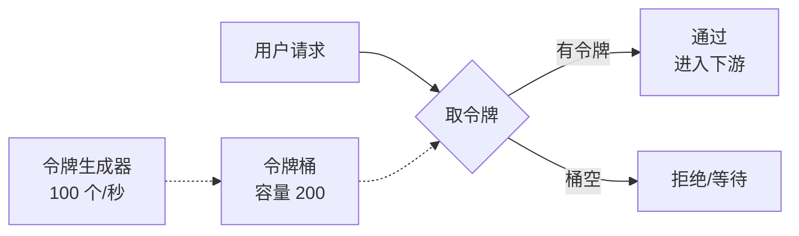
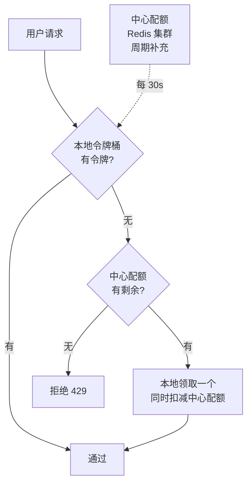

凌晨三点，监控系统告警：下单服务的 P99 延迟从 80ms 跳到 4s，CPU 跑满，数据库连接池打满，线程全部阻塞在等锁。重启服务、扩容数据库、加机器,十分钟后雪崩回来。问题根源不是代码 bug，是上游推荐服务在做一次全量重算，把下单接口的 QPS 从 2k 顶到 12k——所有资源都被拖垮，正常的请求也跟着排队超时。

这就是典型的"过载崩":服务不是慢慢变慢,而是像多米诺骨牌一样整体失能。排队论早就告诉我们，当系统利用率接近 100% 时，等待时间会呈指数级上升，客户端等不到响应就会重试，重试又叠加到已经过载的系统上，正反馈循环,雪崩。**限流是在过载边缘切一刀,把多余的请求挡在外面,保护自己,也保护共享资源的所有调用方**。

这篇文章想回答几个问题:主流的限流算法有哪几种、各自的取舍是什么?从单机限流到分布式限流,真正难的是哪一步?线上落地时应该选 Nginx、OpenResty 还是应用层自己实现?

<!--more-->

## 一、为什么必须限流:过载不是持平

很多人直觉上觉得"系统有缓冲能力,扛一扛就过去了"。但实际生产中,系统利用率一旦超过某个临界点(通常 70%-80%),**吞吐量不升反降**:

```
        吞吐量
          ▲
          │        ╱ 崩塌区
          │       ╱
    峰值 ─┼──────╱───────── 期望
          │     ╱
          │    ╱   稳定区
          │   ╱
          └──/────────────────► 负载
           临界点
```

排队论里的 M/M/1 模型给了一个反直觉的结论:平均响应时间 = `1 / (μ - λ)`,其中 μ 是服务速率,λ 是到达速率。当 λ 逼近 μ,分母逼近 0,响应时间无界增长——系统并没有"打满",而是"打挂"。

更糟糕的是客户端的重试行为:用户看不到响应会刷新,API 调用方会触发超时重试,这些额外的请求进一步推高 λ,形成正反馈。Google SRE 课本里有一句被反复引用的话:"过载保护不是惩罚慢用户,是保护系统不会因为慢用户而倒下。"

**限流是给系统装一个泄洪阀**。它牺牲一部分用户体验(被拒绝或排队),换来整体服务可用性。这是工程上的主动权衡。

## 二、四种算法:从最简到最精

### 2.1 固定窗口计数器

最简单的实现:`INCR` 一个 Redis key,设置 1 秒过期,如果计数超过阈值就拒绝。

```nginx
# 伪代码:固定窗口
key = "rate:user:42"
count = redis.INCR(key)
if count == 1:
    redis.EXPIRE(key, 1)  # 1 秒窗口
if count > 100:
    return 429
```

实现简单,O(1) 操作,**但有一个临界问题**:窗口边界处可以放过 2 倍流量。

```mermaid
gantt
    title 固定窗口临界问题(阈值 100/秒)
    dateFormat  X
    axisFormat %s
    section 窗口 1 (00-01s)
    100 请求:done, 00, 500
    section 窗口 2 (01-02s)
    100 请求:active, 500, 1000
```



第 1 秒末尾来了 100 个请求,被允许;紧接着第 2 秒开头又来了 100 个请求,也被允许。**两秒内实际通过了 200 个**,正好是阈值的两倍。如果攻击者刻意卡在边界,这个算法的限流等于没有。

### 2.2 滑动窗口:用精度换内存

**滑动窗口日志**是最直观的解法:把每次请求的时间戳存起来,统计窗口内的请求数:

```lua
-- Redis 滑动窗口日志(用 ZSET 实现)
-- KEYS[1] = 限流 key
-- ARGV[1] = 窗口大小(秒)
-- ARGV[2] = 阈值
-- ARGV[3] = 当前时间戳(微秒)
-- ARGV[4] = 唯一成员(防止 ZADD 同分覆盖)
local key = KEYS[1]
local window = tonumber(ARGV[1])
local limit = tonumber(ARGV[2])
local now = tonumber(ARGV[3])
local member = ARGV[4]

-- 窗口起点(now - window 秒)
local min = now - window * 1000000

-- 删除窗口外的旧记录
redis.call('ZREMRANGEBYSCORE', key, 0, min)

-- 当前窗口内的请求数
local count = redis.call('ZCARD', key)

if count >= limit then
    return 0  -- 限流
end

-- 记录这次请求
redis.call('ZADD', key, now, member)
redis.call('EXPIRE', key, window)
return 1
```

**为什么必须放在 Lua 脚本里?**`ZREMRANGEBYSCORE` + `ZCARD` + `ZADD` 这三个操作必须在同一个 Redis 调用里完成,否则在它们之间插入其他请求会导致计数错误。Redis 的单线程模型 + Lua 原子执行正好满足这个需求。

代价是**每个请求都要写一条 ZSET 记录**,内存占用随 QPS 线性增长。QPS 10k 时,1 秒窗口就有 10k 条记录,10 个用户就是 100k 条——成本不可忽视。

**滑动窗口计数**做了折中:把大窗口切成 N 个小格子,统计窗口内所有小格子的总数,边界处用加权近似。内存固定,精度 N 越大越接近真值,典型实现是 Cloudflare 的方案。

### 2.3 漏桶:恒速流出,天然平滑

漏桶的核心思想是:**请求先进入桶里,桶以恒定速率向外漏出,桶满则丢弃**。



漏桶的两个参数:

- **桶容量(burst)**:允许的瞬时积压,超出部分直接拒绝
- **流出速率(rate)**:恒定的下游速率

**优点**是天然平滑,下游看到的永远是匀速流量,适合保护不能承受波动的下游(如第三方 API、数据库)。**缺点**是对所有突发一视同仁:用户点击"提交订单"的瞬间希望立刻响应,漏桶会让他等 50ms——这 50ms 在用户体验里就是"卡"。

更糟的是排队:如果桶容量设小了,大量正常突发被丢弃;设大了,排队延迟直接拉高尾延迟 P99。**漏桶本质上是用延迟换平滑,牺牲的是用户体验。**

### 2.4 令牌桶:容忍突发,稳态受控

令牌桶的思想反过来:**桶里装的是"令牌",请求来时拿一个令牌,桶空则等待或拒绝**。令牌以恒定速率补充,桶有上限。



令牌桶比漏桶多一个维度:**桶容量允许的突发**。当桶是满的,瞬间可以放出桶容量的请求,这恰好覆盖了用户操作的"突发性"——用户不会突然点 100 次按钮,但偶尔连点 5-10 次是真实的。

懒惰计算(惰性令牌补充)是常用优化:**不用定时器持续补充令牌,而是每次请求时按时间差计算应该补充多少**。这样不需要后台 goroutine,实现简单且无误差。

```lua
-- Redis 令牌桶(懒惰补充)
-- KEYS[1] = 限流 key
-- ARGV[1] = 桶容量
-- ARGV[2] = 补充速率(个/秒)
-- ARGV[3] = 当前时间戳(秒,带小数)
-- ARGV[4] = 唯一成员(本次请求)
local key = KEYS[1]
local capacity = tonumber(ARGV[1])
local rate = tonumber(ARGV[2])  -- 每秒补充多少个
local now = tonumber(ARGV[3])

-- 读取桶状态(用 hash 存两个字段)
local data = redis.call('HMGET', key, 'tokens', 'last_refill')
local tokens = tonumber(data[1])
local last_refill = tonumber(data[2])

if tokens == nil then
    tokens = capacity
    last_refill = now
end

-- 按时间差补充
local elapsed = now - last_refill
local add = elapsed * rate
tokens = math.min(capacity, tokens + add)
last_refill = now

-- 尝试取一个
local allowed = 0
if tokens >= 1 then
    tokens = tokens - 1
    allowed = 1
end

-- 写回桶状态
redis.call('HMSET', key, 'tokens', tokens, 'last_refill', last_refill)
redis.call('EXPIRE', key, math.ceil(capacity / rate) + 1)
return {allowed, tokens}
```

Lua 脚本返回 `{allowed, tokens}`,allowed = 1 表示通过,0 表示拒绝,tokens 是剩余令牌数,业务层可以拿来做更细的决策(如"剩 1 个令牌就返回剩余配额给客户端")。

## 三、漏桶 vs 令牌桶:一句话说穿

**漏桶限制"流出速率",令牌桶限制"平均速率但容忍突发"**。

| 维度 | 漏桶 | 令牌桶 |
|------|------|--------|
| 流出模式 | 严格恒速 | 平均速率,可突发 |
| 突发处理 | 排队(延迟)或丢弃 | 消耗桶内令牌(无延迟) |
| 用户体验 | 稳定但慢 | 快但偶发拒绝 |
| 实现复杂度 | 简单 | 中等 |
| 内存开销 | O(1) | O(1) |

**经验法则**:

- **对下游第三方 API 用漏桶**:第三方 API 通常有严格的速率限制,我们不想触发它的限流器。漏桶把我们的请求"摊平",是最安全的姿势。
- **对用户请求用令牌桶**:用户操作的"突发性"是真实业务行为,令牌桶的桶容量正好覆盖。
- **混合策略**:网关层用令牌桶(对用户友好),业务服务间调用用漏桶(对下游友好)。

## 四、从单机到分布式:算法不变,问题变了

单机限流简单,任何一个进程的内存里维护计数器就够了。**分布式环境的难点是:多个进程/多个实例,如何协同执行同一个限流策略?**

### 4.1 本地限流的误差

假设部署了 N 个实例,每个实例按 `QPS/N` 限流。理论没问题,但有两个误差源:

1. **流量不均衡**:Nginx 按 round-robin 分发,但请求处理时长不一,某些实例可能集中了"重请求"
2. **突发叠加**:N 个实例同时达到 `QPS/N` 的瞬间,集群整体就是阈值,但每个实例都没触发限流

N 越大,误差越大。**生产环境里,本地限流只能作为兜底,不能作为唯一防线。**

### 4.2 集中式 Redis 限流:新的单点

把限流决策放到 Redis,所有实例都查同一个 key。问题:

- **Redis 成为新的单点**:Redis 挂了就全员崩溃,典型的"为解一个问题引入一个新问题"
- **每请求一次网络往返**:延迟 +2-5ms,直接拉低用户体验;Redis 出问题时,业务也跟着卡
- **时钟一致性**:多机时钟不一致时,令牌桶的"按时间差补充"会算错,需要统一时钟源(NTP 也有 ms 级漂移)

### 4.3 两级配额:工程上的折中

**核心思路**:本地令牌桶应付绝大多数请求,定期从中心批量领取配额补充。



实现要点:

- **中心 Redis 维护集群总配额**,按时间窗口发放(如每 30s 发放 5 倍单实例配额)
- **本地内存维护令牌桶**,按本地速率消耗
- **配额耗尽时**,本地主动去 Redis 领取下一批,领取失败的实例降级到本地限流
- **本地限流始终兜底**,即使 Redis 全挂,业务也不会崩,只是降级到单机粒度的限流

这种架构在 Uber、滴滴等大厂是标配,代价是**增加了架构复杂度**——只有规模到了一定程度才值得上。

## 五、落地形态对照

### 5.1 Nginx limit_req

Nginx 的 `limit_req` 模块基于漏桶算法,但有三个参数让语义复杂:

```nginx
http {
    # 定义限流区域:rate=10r/s 表示每秒 10 个请求
    limit_req_zone $binary_remote_addr zone=one:10m rate=10r/s;

    server {
        location /api/ {
            # burst=20:桶容量 20,允许排队 20 个
            # nodelay:队列里的请求不再延迟,立即通过
            limit_req zone=one burst=20 nodelay;
        }
    }
}
```

**三个参数的精确语义**:

- `rate=10r/s`:漏桶的流出速率,每秒漏 10 个
- `burst=20`:桶容量,允许瞬间超出 rate 的 20 个请求进入桶排队
- `nodelay`:桶里的请求**不再延迟**(本来要按 rate 排队,加上 nodelay 直接放行,等价于桶立刻清空)

**nodelay 的常见误解**:很多人以为 `nodelay` 是"无延迟",其实它是"队列里的不再延迟"。没有 `nodelay`,超出的请求会按 rate 一个一个匀速放行(真正的"延迟模式");加 `nodelay`,桶里的请求瞬间全部放行,桶空后再次进入限流——**结果就是"先瞬间通过 20 个,后面按 rate 限流"**。

### 5.2 OpenResty + Lua

OpenResty 把 Lua 嵌进 Nginx,可以做更复杂的限流逻辑。社区库 `lua-resty-limit-traffic` 提供了三种 limiter:

```lua
-- 1. resty.limit.req:漏桶
local limit_req = require "resty.limit.req"
local lim, err = limit_req.new("my_limit_req_store", 100, 0) -- 100 req/s,无延迟桶
local delay, err = lim:incoming(key, true)  -- 第二个参数 true 表示允许排队

-- 2. resty.limit.count:固定窗口
local limit_count = require "resty.limit.count"
local lim, err = limit_count.new("my_limit_count_store", 100, 60) -- 60 秒 100 个

-- 3. resty.limit.traffic:令牌桶(基于共享字典)
local limit_traffic = require "resty.limit.traffic"
local lim, err = limit_traffic.new("my_limit_traffic_store", 100, 200)
-- 100 = 桶容量,200 = 补充速率(按文档单位)
```

**三种 limiter 的取舍**:`req` 是漏桶,适合平滑流量;`count` 是计数器,实现最简但有临界问题;`traffic` 是令牌桶,容忍突发。OpenResty 的优势是**直接在网关层做复杂逻辑**(如"按用户等级不同限流"),不需要把请求转发到业务服务。

### 5.3 Go 应用层:golang.org/x/time/rate

Go 标准库扩展包提供了令牌桶实现,API 设计简洁:

```go
import (
    "context"
    "time"

    "golang.org/x/time/rate"
)

// rate=100,burst=200:每秒 100 个令牌,桶容量 200
limiter := rate.NewLimiter(100, 200)

// Wait/Allow/Reserve 三种用法
// 1. Wait:阻塞直到拿到令牌(最常用)
if err := limiter.Wait(ctx); err != nil {
    return err  // ctx 超时或被取消
}
handleRequest()

// 2. Allow:非阻塞,拿不到立即返回 false
if !limiter.Allow() {
    return errors.New("rate limited")
}
handleRequest()

// 3. Reserve:返回一个 Reservation,告诉你"需要等多久"
r := limiter.Reserve()
if !r.OK() {
    return errors.New("rate limited")
}
time.Sleep(r.Delay())  // 业务可以拿 Delay 做别的处理
handleRequest()
```

**三种用法的工程语义**:

- `Wait`:用户友好,自动按需阻塞,适合 HTTP handler
- `Allow`:非阻塞,适合内部调度(批处理、定时任务)
- `Reserve`:最灵活,可以拿到 `Delay()` 做更精细的控制(如"剩余等待时间 < 100ms 就放行,否则拒绝")

## 六、限流之外:熔断、降级、隔离

限流不是万能的。一个完整的过载保护体系还包括:

| 机制 | 保护对象 | 触发条件 | 典型实现 |
|------|---------|---------|---------|
| 限流 | 入流量 | 超过阈值 | Nginx/OpenResty/Redis |
| 熔断 | 下游故障 | 下游错误率超阈值 | Sentinel/Hystrix |
| 降级 | 核心路径 | 系统压力大 | 关闭非核心功能 |
| 隔离 | 资源争抢 | 共享资源被占用 | 线程池/信号量舱壁 |

**熔断**(Circuit Breaker)是给下游调用装的"保险丝":当下游错误率超过阈值(比如 50%),直接熔断,所有请求立刻返回失败,不去压垮下游;过一段时间放少量请求探测,恢复后重新放行。Netflix Hystrix 在 2018 年底进入维护模式,目前社区主流是 Sentinel(阿里开源)和 Resilience4j(Java),都支持熔断+限流+降级一体化。

**舱壁隔离**(Bulkhead)是给共享资源装的"防水舱":一个慢下游拖垮所有线程池,就是典型的"舱壁破了"。线程池隔离、信号量隔离都是舱壁的工程实现——核心是**把不同下游的调用放在不同的资源池里,一个池子挂了不影响其他**。

**为什么只有限流不够?**

- 限流只能挡**超过阈值的**流量,挡不住**正常流量打到一个已经半死的服务**——这种情况下熔断才有意义
- 限流阈值是固定的,流量特征变化时(大促、热点事件)需要快速调整——这需要监控+动态限流

**限流阈值的设定**:不能拍脑袋。**正确做法是压测找到系统的拐点**(利用率-延迟曲线开始陡升的临界点),再用监控覆盖这个拐点,在到达拐点之前就限流。**配合监控与动态调整**:根据 P99 延迟和错误率动态放宽或收紧阈值。

## 八、常见踩坑

### 8.1 限流维度选错

常见的限流维度:

- **按 IP**:防止单 IP 攻击,但代理环境下大量用户共用出口 IP,会误伤
- **按用户**:精准,但需要鉴权(限流逻辑要先解析 token,带来额外开销)
- **按接口**:每个接口独立限流,适合"重点接口重点保护"
- **按租户**:SaaS 场景必备,不同租户不同配额

**反例**:一个公开 API 只按 IP 限流,结果被 CDN 聚合后所有用户共享同一 IP,整个 CDN 出口被误伤。**生产环境通常是多维度组合**:先用 IP/租户粗筛,再用用户精筛。

### 8.2 429 与 Retry-After

HTTP 429 (Too Many Requests) 是限流的标准状态码。**必须同时返回 `Retry-After` 头**,告诉客户端多久后再来:

```nginx
limit_req_status 429;
limit_req_zone ... ;
# 默认会带 Retry-After,值是窗口剩余秒数
```

**客户端的正确姿势**:尊重 `Retry-After`,做指数退避 + 抖动。不要立刻重试——这会立刻把刚放出的窗口再次打满,变成死循环。

### 8.3 可观测性

限流是"挡掉流量"的隐身行为,如果不可观测,出问题时完全摸不着头脑。**至少要有这些指标**:

- `rate_limit_rejected_total{rule, dimension}`:被拒请求数(按规则、按维度打标签)
- `rate_limit_throttled_total`:被限流的请求数
- `rate_limit_tokens_remaining`:令牌桶剩余(用于容量规划)

**日志至少要记录**:被限流的 key(用户/IP)、触发规则、时间,方便事后追溯和阈值调优。

## 九、决策表

最后,工程选型时的一张决策表:

| 场景 | 推荐算法 | 推荐落地 | 备注 |
|------|---------|---------|------|
| HTTP 网关,通用限流 | 令牌桶 | Nginx `limit_req` + burst + nodelay | 兼顾用户体验与突发 |
| 对接第三方 API(严格速率) | 漏桶 | OpenResty `resty.limit.req` | 防止触发对方限流 |
| 大流量、高 QPS 场景 | 滑动窗口计数 | Redis + Lua 集群 | 内存可控,精度可调 |
| 内部服务 RPC | 令牌桶 | Go `rate.NewLimiter` | Wait/Allow 按场景选 |
| 多用户隔离 | 令牌桶 + 多维度 | 应用层 + Redis | 按用户配额 + 全局配额 |
| 突发性业务(秒杀) | 令牌桶(大桶容量) | 网关层 + 应用层二级 | 网关粗筛,应用层精筛 |

## 十、小结

限流算法的复杂度从 O(1) 的计数器到 O(n) 的滑动窗口日志,跨度很大。**但真正的工程难点从来不在算法本身,而是在分布式环境下让算法仍然成立**——单机对的算法到多机就错,本地对的策略到集群就偏,稳定的阈值在流量突变时就崩。

落地的几个原则:

1. **网关层先做粗筛**:Nginx/OpenResty 在网关层挡住 80% 的异常流量,业务服务专心业务
2. **应用层再做精筛**:不同接口、不同用户的细粒度配额,在应用层按业务维度判断
3. **限流必须可观测**:被拒的请求、被限的 key、剩余配额,全部要有指标和日志
4. **阈值从压测来,不是拍脑袋**:每次大促前重测拐点,配合监控动态调整
5. **只有限流不够**:配合熔断、降级、隔离,才能构建完整的过载保护体系

2019 年的限流生态相对成熟:Nginx 1.16 的 `limit_req` 已经稳定多年,OpenResty + `lua-resty-limit-traffic` 是网关层首选,Go 应用层用 `golang.org/x/time/rate` 几乎无脑。Redis 5.0 的 Stream 和 Lua 仍然是分布式限流的基石。Hystrix 进入维护模式后,Sentinel 在国内大厂快速普及,熔断+限流一体化的设计正在成为新趋势。

**限流的本质是工程权衡**:用一部分用户体验换取整体可用性,用架构复杂度换取系统韧性。没有银弹,只有取舍。