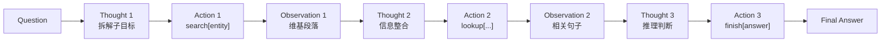
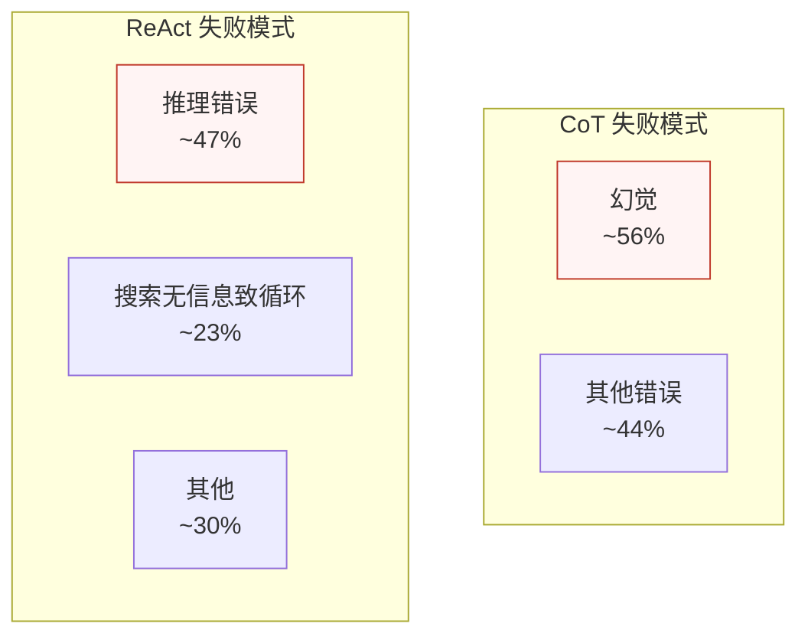

ReAct（[arXiv 2210.03629](https://arxiv.org/abs/2210.03629)）是姚顺雨 2022 年 10 月发表、2023 年 5 月在 Kigali 的 [ICLR 2023 Oral](https://iclr.cc/virtual/2023/oral/12647)（Notable Top 5%）上正式宣读的论文。它解决的问题很朴素：**让大语言模型在同一个轨迹里同时"想"和"做"**。在此之前，Chain-of-Thought（CoT）和"只行动"（Act-only）是两条互不往来的研究脉络，ReAct 是第一条把它们显式缝合起来的路径。

<!--more-->

## 问题的提出

2022 年是 LLM agent 研究的起点之年，但当时主流的 prompt 范式只有两条路：

- **CoT（[Wei et al. 2022](https://arxiv.org/abs/2201.11903)）**：让模型在最终回答前**自发地**在内部走一遍推理链。简单、能 zero-shot 触发（"Let's think step by step"），但模型很容易编造事实——推理链路再漂亮，落地的中间步骤可能是凭空捏造的。论文里把这类问题归为"幻觉与错误传播"。
- **Act-only**：让模型直接生成可执行动作（API 调用、命令、检索 query），不暴露中间推理。能拿到外部真实信息，但缺乏显式推理会让长链路任务迷失方向，错误也难以定位。

ReAct 的核心观察是：**这两条路不互斥**。如果把"思考"作为动作空间里的一个特殊动作，和外部 API 调用放在同一个序列里交错生成，模型既能用推理来拆解目标和处理异常，又能用行动去外部验证推理——而且**整条轨迹对开发者可见、可审计**。

## 方法

### 动作空间扩展

形式化地，ReAct 把动作空间从 `A` 扩展为：

```
 = A ∪ L
```

其中 `A` 是原行动空间（如 Wikipedia API），`L` 是语言空间，"思维"（Thought）就是 `L` 上的一个动作。于是模型的输出变成一串交错序列：

```
Thought_1 → Action_1 → Observation_1 → Thought_2 → Action_2 → Observation_2 → ... → finish[answer]
```

每个 Thought 不参与外部环境交互，只更新模型自己的"心智状态"；每个 Action 调一次外部 API；每个 Observation 是 API 返回值被塞回 prompt。

### Wikipedia API 三个动作

论文里问答（HotpotQA / FEVER）场景的工具集非常克制，只暴露三个原子动作：

| 动作 | 用途 |
|------|------|
| `search[entity]` | 返回含该实体的 Wikipedia 段落（前 5 条） |
| `lookup[string]` | 在当前段落里精确查找字符串，返回下一个包含它的句子 |
| `finish[answer]` | 终止轨迹，输出最终答案 |

这种极简动作集是**故意的**——它把"检索-阅读-整合"压到最低表达复杂度，让模型能力本身成为上限，而不是工具 API。

### 一图看懂循环



整个轨迹就是 prompt 里的一段 few-shot 示范（论文里 HotpotQA 用 6 个，ALFWorld 用 2 个）。模型不是被单独训练的，只是**被这几个示范教会了循环该长什么样**。

## 实验结果

论文里所有数字都跑在 **PaLM-540B** 上，下面这张表是问答 + 事实验证两组任务的关键对比。

### 问答与事实验证（HotpotQA / FEVER）

| 方法 | HotpotQA EM | FEVER Acc |
|------|-------------|-----------|
| Standard（无 CoT） | 28.7 | 57.1 |
| CoT | 29.4 | 56.3 |
| CoT-SC（Self-Consistency） | 33.4 | 60.4 |
| Act-only | 25.7 | 58.9 |
| **ReAct 单用** | 27.4 | **60.9** |
| CoT-SC → ReAct | 34.2 | **64.6** |
| ReAct → CoT-SC | **35.1** | 62.0 |

注意一个反直觉的发现：**ReAct 单用反而不如 CoT-SC**。HotpotQA 上 ReAct 的 EM 是 27.4，比 CoT-SC 的 33.4 低。原因是 ReAct 会在搜索结果无信息时陷入重复循环，把推理链路拖死。

但论文里最关键的发现是 **混合策略**：先用 CoT-SC 拿到候选答案，再用 ReAct 去外部验证，把分歧消解——这一组合在 HotpotQA 上达到 35.1，比任何单方法都高。结论是：**ReAct 的真正价值不在于单跑，而在于作为 CoT 的事实性补丁**。

### 交互式决策（ALFWorld / WebShop）

ALFWorld 是文字冒险式的家庭任务模拟器，WebShop 是模拟电商网站交互：

| 任务 | ReAct | 上一代 SOTA | 提升 |
|------|-------|-------------|------|
| ALFWorld 成功率 | **71%** | Act-only 45% / BUTLER 37% | +26 ~ +34 绝对点 |
| WebShop 成功率 | **40%** | IL+RL 28.7% | +10.3 绝对点 |

这种**纯 prompt、不训练**就能超过 IL+RL 的对比，是 ReAct 2022 年最轰动的实验结论。它直接证明了：LLM 自身已经具备把"看 → 想 → 做 → 修正"组织起来的能力，差的只是 prompt 范式。

### 微调扩展

论文还跑了一组小规模微调实验——用 3000 条 ReAct 生成的**正确轨迹**，在 PaLM-8B 和 PaLM-62B 上微调，结果小模型也能继承部分 ReAct 行为模式。这是后来指令微调 + agent 训练路线最早的实证之一，但论文里只是作为"扩展潜力"的初步验证，没展开。

## 失败模式：比 SOTA 更重要的发现

论文里最有研究价值的不是数字，而是**对失败的人工归类**。把模型跑错的轨迹逐条读，把错因分成几类：

| 范式 | 主要失败模式 | 占比 |
|------|--------------|------|
| CoT | **幻觉**（编造不存在的实体/关系） | ~56% |
| ReAct | 推理错误 + 搜索无信息导致循环 | 47% + 23% |



把这两组失败模式摆在一起看，能直接看出**后续 agent 研究的两条主线**：

- **解决 ReAct 的"搜索无信息致循环"** → 催生了 **Reflexion**（[Shinn et al. 2023](https://arxiv.org/abs/2303.11381)），让模型在循环时显式反思并改写策略；以及 **Tree of Thoughts**（[Yao et al. 2023](https://arxiv.org/abs/2305.10601)），把单链替换成搜索树来跳出局部最优——这两篇也是姚顺雨本人后续的工作。
- **解决 CoT 的"幻觉 56%"** → 催生了 **RAG** 路线（[Lewis et al. 2020](https://arxiv.org/abs/2005.11401) 的范式被 LLM 时代重新激活），用检索到的外部知识约束生成。

换句话说，**ReAct 论文里这块失败模式分析的真正读者，是它自己作者的后续工作**。

## 小结

ReAct 在论文数字上从来不是 SOTA（HotpotQA 单跑 27.4，比 CoT-SC 低），它的真正贡献是**范式**：

- 显式把"思维"作为动作空间元素 `Â = A ∪ L`，让 reasoning 和 acting 在 prompt 层可拼装
- 整条轨迹可观测、可审计、可回放——这是 agent 框架后来默认的事实标准
- 失败模式分析指向了未来工作的两个缺口（循环 / 幻觉），后续 Reflexion、ToT、RAG 都从这里分叉

今天看 LangChain、LangGraph、Claude Code 的 tool_use 循环、OpenAI Operator——它们的运行时抽象里都能找到 Thought → Action → Observation 这条主干的影子。ReAct 之后 4 年，所有 agent 框架的默认实现都是这篇文章的直接后人。

## 参考资料

- 论文原文：[arXiv 2210.03629](https://arxiv.org/abs/2210.03629)
- ICLR 2023 Oral：[react-lm.github.io](https://react-lm.github.io)
- 代码：[ysymyth/ReAct](https://github.com/ysymyth/ReAct)
- 中文解读参考：[知乎文章](https://zhuanlan.zhihu.com/p/1959021742447101771)
- 同期对照：[Wei et al. 2022, Chain-of-Thought Prompting](https://arxiv.org/abs/2201.11903)