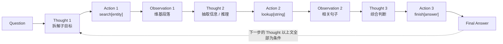

2022 年 10 月，普林斯顿的姚顺雨在 Google Brain 实习期间挂出了一篇只有 6 位作者的短文。它没提出新模型、没新架构、不需要训练——**只改了 prompt 的写法**。

但今天你用的每一个 agent——LangChain / LangGraph 的循环、Claude Code 的工具调用、OpenAI 的 Operator、各种 function calling 运行时——它们的执行主干都是这篇文章写下的那个循环：

```
Thought → Action → Observation → Thought → Action → Observation → ... → finish[answer]
```

这篇文章做两件事：**第一部分**是论文正文的中英对照翻译；**第二部分**是我用今天的视角写的解读——包括为什么"ReAct 单跑其实打不过 CoT-SC"这个反直觉结论，以及那张失败模式表如何定义了此后三年的 agent 研究议程。

> 翻译体例：每个段落先列英文原文（引用块），紧接中文译文。表格为便于阅读做了重排，专业术语保留英文。

<!--more-->

## 论文信息

| 项目 | 内容 |
|------|------|
| 标题 | ReAct: Synergizing Reasoning and Acting in Language Models |
| 作者 | Shunyu Yao（普林斯顿）、Jeffrey Zhao、Dian Yu、Nan Du、Izhak Shafran（Google Research, Brain team）、Karthik Narasimhan（普林斯顿）、Yuan Cao（Google） |
| 编号 | arXiv:2210.03629 |
| 发表 | ICLR 2023 Oral（Notable Top 5%），2023 年 5 月于卢旺达 Kigali 宣读 |
| 基座模型 | PaLM-540B（附录含 GPT-3 结果） |
| 代码 | github.com/ysymyth/ReAct |
| 项目页 | react-lm.github.io |

一句话概括论文做的事：**把"思考"显式地加进动作空间，让 LLM 在同一条轨迹里交替生成推理和动作。**

---

## 第一部分 · 全文翻译（中英对照）

### Abstract · 摘要

> While large language models (LLMs) have demonstrated impressive performance across tasks in language understanding and interactive decision making, their abilities for reasoning (e.g. chain-of-thought prompting) and acting (e.g. action plan generation) have primarily been studied as separate topics.

尽管大语言模型（LLM）在语言理解和交互式决策任务上展现出亮眼表现，但它们的**推理**能力（如思维链 prompting）和**行动**能力（如动作计划生成）此前**基本是作为两个独立课题**被研究的。

> In this paper, we explore the use of LLMs to generate both reasoning traces and task-specific actions in an interleaved manner, allowing for greater synergy between the two: reasoning traces help the model induce, track, and update action plans as well as handle exceptions, while actions allow it to interface with and gather additional information from external sources such as knowledge bases or environments.

本文中，我们探索让 LLM **以交错的方式**同时生成推理轨迹和任务相关动作，使两者产生更大的协同：**推理轨迹**帮助模型归纳、跟踪和更新行动计划，并处理异常；**动作**则让模型与外部来源（如知识库或环境）对接并从中收集额外信息。

> We apply our approach, named ReAct, to a diverse set of language and decision making tasks and demonstrate its effectiveness over state-of-the-art baselines in addition to improved human interpretability and trustworthiness.

我们把这一方法命名为 **ReAct**，应用于一系列语言与决策任务，证明它相比当前最佳基线更有效，同时**提升了人类的可理解性与可信度**。

> Concretely, on question answering (HotpotQA) and fact verification (Fever), ReAct overcomes prevalent issues of hallucination and error propagation in chain-of-thought reasoning by interacting with a simple Wikipedia API, and generating human-like task-solving trajectories that are more interpretable than baselines without reasoning traces.

具体来说，在问答（HotpotQA）和事实验证（FEVER）上，ReAct 通过**与一个简单的 Wikipedia API 交互**，克服了思维链推理中普遍存在的**幻觉与错误传播**问题，并生成**类人的解题轨迹**，比没有推理轨迹的基线更可解释。

> Furthermore, on two interactive decision making benchmarks (ALFWorld and WebShop), ReAct outperforms imitation and reinforcement learning methods by an absolute success rate of 34% and 10% respectively, while being prompted with only one or two in-context examples.

此外，在两个交互式决策基准（ALFWorld 和 WebShop）上，ReAct 以**绝对成功率 34% 和 10%** 的优势超过了模仿学习和强化学习方法——而它**只使用了一个或两个上下文示例**做提示。

### 1 Introduction · 引言

> A unique feature of human intelligence is the ability to seamlessly combine task-oriented actions with verbal reasoning (or inner speech), which has been theorized to play an important role in human cognition for enabling self-regulation or strategization and maintaining a working memory.

人类智能的一个独特之处，是能够**把面向任务的动作与语言推理（或称"内部言语"）无缝结合起来**。理论上认为，这种能力在人类认知中扮演重要角色：它支撑自我调节、策略制定，以及工作记忆的维持。

> Consider the example of cooking up a dish in the kitchen. Between any two specific actions, we may reason in language in order to track progress ("now that everything is cut, I should heat up the pot of water"), to handle exceptions or adjust the plan according to the situation ("I don't have salt, so let me use soy sauce and pepper instead"), and to realize when external information is needed ("how do I prepare dough? Let me search on the Internet"). We may also act (open a cookbook to read the recipe, open the fridge, check ingredients) to support the reasoning and to answer questions ("What dish can I make right now?").

以在厨房做一道菜为例。在任意两个具体动作之间，我们可能会**用语言推理**来跟踪进度（"既然都切好了，我该烧一锅水了"）、处理异常或根据情况调整计划（"没有盐了，那就用酱油和胡椒代替"）、意识到何时需要外部信息（"面团怎么做？我上网查一下"）。我们也会**通过行动**来支持推理并回答问题（翻开菜谱、打开冰箱、检查食材——"我现在能做什么菜？"）。

> This tight synergy between "acting" and "reasoning" allows humans to learn new tasks quickly and perform robust decision making or reasoning, even under previously unseen circumstances or facing information uncertainties.

"**行动**"与"**推理**"之间这种紧密协同，使人类能够快速学习新任务，并在**未曾见过的情境**或**信息不确定**的情况下依然做出稳健的决策与推理。

> On one hand, properly prompted large language models (LLMs) have demonstrated emergent capabilities to carry out several steps of reasoning traces to derive answers from questions in arithmetic, commonsense, and symbolic reasoning tasks. However, this "chain-of-thought" reasoning is a static black box, in that the model uses its own internal representations to generate thoughts and is not grounded in the external world, which limits its ability to reason reactively or update its knowledge.

一方面，经过恰当提示的 LLM 已展现出涌现能力，能执行若干步推理轨迹，在算术、常识和符号推理任务上推出答案。然而，这种"**思维链**"推理是一个**静态黑箱**——模型用自身的内部表示来生成想法，**没有与外部世界接地**，这限制了它反应式推理或更新知识的能力。

> On the other hand, recent work has explored the use of pre-trained language models for planning and acting in interactive environments, with a focus on predicting actions via language priors. These approaches usually convert multi-modal observations into text, use a language model to generate domain-specific actions or plans, and then use a controller to choose or execute them. However, they do not employ language models to reason abstractly about high-level goals or maintain a working memory to support acting.

另一方面，近期工作探索了用预训练语言模型在交互环境中做**规划与行动**，重点是通过语言先验来预测动作。这类方法通常把多模态观测转成文本，用语言模型生成领域特定的动作或计划，再用一个控制器去选择或执行。然而，它们**并没有让语言模型对高层目标做抽象推理**，也没有维护工作记忆来支撑行动。

> Beyond such simple embodied tasks to interact with a few blocks, there have not been studies on how reasoning and acting can be combined in a synergistic manner for general task solving, and if such a combination can bring systematic benefits compared to reasoning or acting alone.

除了这类"摆弄几个方块"的简单具身任务之外，**尚无人研究如何把推理与行动以协同方式结合**用于通用任务求解，也无人研究这种结合相比单独的推理或行动能否带来系统性收益。

> In this work, we present ReAct, a general paradigm to combine reasoning and acting with language models for solving diverse language reasoning and decision making tasks. ReAct prompts LLMs to generate both verbal reasoning traces and actions pertaining to a task in an interleaved manner, which allows the model to perform dynamic reasoning to create, maintain, and adjust high-level plans for acting (reason to act), while also interact with the external environments (e.g. Wikipedia) to incorporate additional information into reasoning (act to reason).

本文中我们提出 **ReAct**——一种用语言模型结合推理与行动、求解多样化语言推理与决策任务的**通用范式**。ReAct 提示 LLM **交错地**生成语言推理轨迹和任务相关动作：一方面让模型进行动态推理，以创建、维护和调整用于行动的高层计划（**推理以行动**，reason to act）；另一方面让它与外部环境（如 Wikipedia）交互，把额外信息纳入推理（**行动以推理**，act to reason）。

> For HotPotQA and Fever, with access to a Wikipedia API that the model can interact with, ReAct outperforms vanilla action generation models while being competitive with chain-of-thought reasoning (CoT). The best approach overall is a combination of ReAct and CoT that allows for the use of both internal knowledge and externally obtained information during reasoning.

在 HotpotQA 和 FEVER 上，借助一个可交互的 Wikipedia API，ReAct 超过了普通的动作生成模型，并与思维链推理（CoT）**相当**。综合表现最好的方法是 **ReAct 与 CoT 的结合**，它能在推理过程中同时使用内部知识和外部获取的信息。

> On ALFWorld and WebShop, two or even one-shot ReAct prompting is able to outperform imitation or reinforcement learning methods trained with 10^3 ~ 10^5 task instances, with an absolute improvement of 34% and 10% in success rates respectively. We also demonstrate the importance of sparse, versatile reasoning in decision making by showing consistent advantages over controlled baselines with actions only.

在 ALFWorld 和 WebShop 上，**两样本甚至单样本**的 ReAct 提示就能超过用 10³～10⁵ 个任务实例训练出来的模仿或强化学习方法，成功率分别绝对提升 **34%** 和 **10%**。我们还通过与"仅有动作"的受控基线对比，证明了**稀疏而多样的推理**在决策中的重要性。

> Besides general applicability and performance boost, the combination of reasoning and acting also contributes to model interpretability, trustworthiness, and diagnosability across all domains, as humans can readily distinguish information from model's internal knowledge versus external environments, as well as inspect reasoning traces to understand the decision basis of model actions.

除了通用性和性能提升，推理与行动的结合还提升了模型的**可解释性、可信度与可诊断性**：人类能轻易区分哪些信息来自模型的内部知识、哪些来自外部环境，也能检查推理轨迹来理解模型动作的决策依据。

> To summarize, our key contributions are the following: (1) we introduce ReAct, a novel prompt-based paradigm to synergize reasoning and acting in language models for general task solving; (2) we perform extensive experiments across diverse benchmarks to showcase the advantage of ReAct in a few-shot learning setup; (3) we present systematic ablations and analysis to understand the importance of acting in reasoning tasks, and reasoning in interactive tasks; (4) we analyze the limitations of ReAct under the prompting setup, and perform initial finetuning experiments showing the potential of ReAct to improve with additional training data.

总结我们的主要贡献：(1) 提出 **ReAct**，一种基于提示的新范式，让语言模型中的推理与行动协同以求解通用任务；(2) 在多样化基准上做大量实验，展示 ReAct 在少样本设置下的优势；(3) 给出系统的消融与分析，理解"推理任务中行动的价值"与"交互任务中推理的价值"；(4) 分析 ReAct 在纯提示设置下的局限，并做初步微调实验，展示它**随训练数据增加而提升**的潜力。

### 2 ReAct: Synergizing Reasoning + Acting · ReAct：让推理与行动协同

> Consider a general setup of an agent interacting with an environment for task solving. At time step t, an agent receives an observation o_t ∈ O from the environment and takes an action a_t ∈ A following some policy π(a_t | c_t), where c_t = (o_1, a_1, ..., o_{t-1}, a_{t-1}, o_t) is the context to the agent. Learning a policy is challenging when the mapping c_t ↦ a_t is highly implicit and requires extensive computation.

考虑一个智能体与环境交互求解任务的通用设定。在时间步 t，智能体从环境收到观测 o_t ∈ O，并按照某个策略 π(a_t | c_t) 采取动作 a_t ∈ A，其中 c_t = (o_1, a_1, ..., o_{t-1}, a_{t-1}, o_t) 是智能体的**上下文**。当 c_t ↦ a_t 的映射**高度隐式、需要大量计算**时，学习这样的策略是困难的。

> The idea of ReAct is simple: we augment the agent's action space to  = A ∪ L, where L is the space of language. An action â_t ∈ L in the language space, which we will refer to as a thought or a reasoning trace, does not affect the external environment, thus leading to no observation feedback. Instead, a thought â_t aims to compose useful information by reasoning over the current context c_t, and update the context c_{t+1} = (c_t, â_t) to support future reasoning or acting.

ReAct 的思想很简单：我们把智能体的动作空间**扩充为 Â = A ∪ L**，其中 L 是**语言空间**。语言空间中的一个动作 â_t ∈ L，我们称之为**思维**（thought）或**推理轨迹**，它**不影响外部环境**，因此不会产生观测反馈。相反，一个思维 â_t 的目标是对当前上下文 c_t 做推理以整合出有用信息，并把上下文更新为 c_{t+1} = (c_t, â_t)，从而支撑后续的推理或行动。

> As shown in Figure 1, there could be various types of useful thoughts, e.g. decomposing task goals and create action plans, injecting commonsense knowledge relevant to task solving, extracting important parts from observations, track progress and transit action plans, handle exceptions and adjust action plans, and so on.

如图 1 所示，有用的思维可以有多种类型：分解任务目标并创建行动计划、注入与解题相关的常识知识、从观测中抽取关键部分、跟踪进度并切换计划、处理异常并调整计划，等等。

> However, as the language space L is unlimited, learning in this augmented action space is difficult and requires strong language priors. In this paper, we mainly focus on the setup where a frozen large language model, PaLM-540B, is prompted with few-shot in-context examples to generate both domain-specific actions and free-form language thoughts for task solving. Each in-context example is a human trajectory of actions, thoughts, and environment observations to solve a task instance.

然而，由于语言空间 L 是**无限的**，在这个扩充后的动作空间里学习是困难的，需要强大的语言先验。本文主要关注这样一个设定：用一个**冻结的大语言模型 PaLM-540B**，通过少样本上下文示例来提示它生成领域特定动作和自由形式的语言思维。每个上下文示例都是**人类解题的一条轨迹**，包含动作、思维和环境观测。

> For the tasks where reasoning is of primary importance, we alternate the generation of thoughts and actions so that the task-solving trajectory consists of multiple thought-action-observation steps. In contrast, for decision making tasks that potentially involve a large number of actions, thoughts only need to appear sparsely in the most relevant positions of a trajectory, so we let the language model decide the asynchronous occurrence of thoughts and actions for itself.

对于**推理最为重要**的任务，我们让思维和动作**交替生成**，解题轨迹由多个"思维-动作-观测"步骤组成。相反，对于**可能包含大量动作**的决策任务，思维只需要在轨迹中最相关的位置**稀疏出现**，因此我们让语言模型**自行决定**思维和动作的异步出现时机。

> Since decision making and reasoning capabilities are integrated into a large language model, ReAct enjoys several unique features:

由于决策与推理能力被集成在同一个大语言模型里，ReAct 具备若干独特优势：

> **A) Intuitive and easy to design**: Designing ReAct prompts is straightforward as human annotators just type down their thoughts in language on top of their actions taken. No ad-hoc format choice, thought design, or example selection is used in this paper.

**A) 直观且易于设计**：编写 ReAct 提示非常直接——人类标注者只需在已执行的动作之上，用语言把自己的想法打出来。本文**没有使用任何专门的格式选择、思维设计或示例筛选技巧**。

> **B) General and flexible**: Due to the flexible thought space and thought-action occurrence format, ReAct works for diverse tasks with distinct action spaces and reasoning needs, including but not limited to QA, fact verification, text game, and web navigation.

**B) 通用且灵活**：由于思维空间和"思维-动作"出现形式都很灵活，ReAct 适用于动作空间和推理需求各不相同的多种任务，包括但不限于问答、事实验证、文字游戏和网页导航。

> **C) Performant and robust**: ReAct shows strong generalization to new task instances while learning solely from one to six in-context examples, consistently outperforming baselines with only reasoning or acting across different domains.

**C) 高效且稳健**：ReAct 仅从 1 到 6 个上下文示例中学习，就对新任务实例展现出很强的泛化能力，并在不同领域**持续超过**只有推理或只有行动的基线。

> **D) Human aligned and controllable**: ReAct promises an interpretable sequential decision making and reasoning process where humans can easily inspect reasoning and factual correctness. Moreover, humans can also control or correct the agent behavior on the go by thought editing.

**D) 与人类对齐且可控**：ReAct 提供了一个可解释的序贯决策与推理过程，人类能轻松检查其推理与事实正确性。此外，人类还可以通过**编辑思维（thought editing）**在运行时控制或纠正智能体的行为。

### 3 Knowledge-Intensive Reasoning Tasks · 知识密集型推理任务

> We begin with knowledge-intensive reasoning tasks like multi-hop question answering and fact verification. As shown in Figure 1(1d), by interacting with a Wikipedia API, ReAct is able to retrieve information to support reasoning, while also use reasoning to target what to retrieve next, demonstrating a synergy of reasoning and acting.

我们从多跳问答和事实验证这类**知识密集型推理任务**开始。如图 1(1d) 所示，通过与 Wikipedia API 交互，ReAct 既能检索信息来支撑推理，又能用推理来定位下一步该检索什么——展现出推理与行动的协同。

#### 3.1 Setup · 实验设置

**Domains · 任务域**

> We consider two datasets challenging knowledge retrieval and reasoning: (1) HotPotQA, a multi-hop question answering benchmark that requires reasoning over two or more Wikipedia passages, and (2) FEVER, a fact verification benchmark where each claim is annotated SUPPORTS, REFUTES, or NOT ENOUGH INFO. In this work, we operate in a question-only setup for both tasks, where models only receive the question/claim as input without access to support paragraphs, and have to rely on their internal knowledge or retrieve knowledge via interacting with an external environment to support reasoning.

我们考察两个对知识检索与推理都很有挑战的数据集：(1) **HotpotQA**，一个多跳问答基准，需要对两段以上 Wikipedia 段落做推理；(2) **FEVER**，一个事实验证基准，每条声明被标注为 SUPPORTS / REFUTES / NOT ENOUGH INFO。本文在两个任务上都采用**只给问题（question-only）**的设置：模型只接收问题或声明作为输入，**拿不到支撑段落**，必须依赖内部知识，或通过与外部环境交互检索知识来支撑推理。

**Action Space · 动作空间**

> We design a simple Wikipedia web API with three types of actions to support interactive information retrieval: (1) search[entity], which returns the first 5 sentences from the corresponding entity wiki page if it exists, or else suggests top-5 similar entities from the Wikipedia search engine; (2) lookup[string], which would return the next sentence in the page containing string, simulating Ctrl+F functionality on the browser; (3) finish[answer], which would finish the current task with answer.

我们设计了一个简单的 Wikipedia Web API，包含三类动作以支持交互式信息检索：(1) **`search[entity]`**——若该实体页面存在，返回其前 5 个句子，否则给出 Wikipedia 搜索引擎推荐的最相似的 5 个实体；(2) **`lookup[string]`**——返回页面中包含该字符串的下一句，模拟浏览器里的 Ctrl+F；(3) **`finish[answer]`**——以该答案结束当前任务。

> We note that this action space mostly can only retrieve a small part of a passage based on exact passage name, which is significantly weaker than state-of-the-art lexical or neural retriever. The purpose is to simulate how humans would interact with Wikipedia, and force models to retrieve via explicit reasoning in language.

我们要指出，这个动作空间大多只能基于精确的段落名检索到很小一部分内容，**明显弱于**当前最好的词法或神经检索器。这样做的目的是**模拟人类与 Wikipedia 交互的方式**，并迫使模型通过显式的语言推理来检索。

#### 3.2 Methods · 方法

**ReAct Prompting · ReAct 提示**

> For HotpotQA and Fever, we randomly select 6 and 3 cases from the training set and manually compose ReAct-format trajectories to use as few-shot exemplars in the prompts. Each trajectory consists of multiple thought-action-observation steps (i.e. dense thought), where free-form thoughts are used for various purposes.

对 HotpotQA 和 FEVER，我们分别从训练集中随机选取 **6 个和 3 个**样本，手工编写 ReAct 格式的轨迹作为提示中的少样本示例（我们发现更多示例并不会提升效果）。每条轨迹由多个"思维-动作-观测"步骤组成（即**密集思维**），自由形式的思维被用于多种目的。

> Specifically, we use a combination of thoughts that decompose questions ("I need to search x, find y, then find z"), extract information from Wikipedia observations ("x was started in 1844", "The paragraph does not tell x"), perform commonsense ("x is not y, so z must instead be…") or arithmetic reasoning ("1844 < 1989"), guide search reformulation ("maybe I can search/look up x instead"), and synthesize the final answer ("…so the answer is x").

具体来说，我们混合使用了这些思维：分解问题（"我需要搜索 x，找到 y，再找到 z"）、从 Wikipedia 观测中抽取信息（"x 始建于 1844 年"、"这段没有提到 x"）、做常识（"x 不是 y，那么 z 一定是……"）或算术推理（"1844 < 1989"）、引导检索改写（"也许我可以改成搜索/查找 x"），以及综合出最终答案（"……所以答案是 x"）。

**Baselines · 基线**

> We systematically ablate ReAct trajectories to build prompts for multiple baselines: (a) Standard prompting (Standard), which removes all thoughts, actions, observations in ReAct trajectories. (b) Chain-of-thought prompting (CoT), which removes actions and observations and serve as a reasoning-only baseline. We also build a self-consistency baseline (CoT-SC) by sampling 21 CoT trajectories with decoding temperature 0.7 during inference and adopting the majority answer. (c) Acting-only prompt (Act), which removes thoughts in ReAct trajectories.

我们通过对 ReAct 轨迹做系统性消融来构造多个基线的提示：(a) **Standard**——移除 ReAct 轨迹中的全部思维、动作和观测；(b) **CoT**——移除动作和观测，作为纯推理基线；我们还构造了自一致性基线 **CoT-SC**，在推理时以温度 0.7 采样 21 条 CoT 轨迹并取多数答案；(c) **Act**——移除 ReAct 轨迹中的思维。

**Combining Internal and External Knowledge · 结合内部与外部知识**

> As will be detailed in Section 3.3, we observe that the problem solving process demonstrated by ReAct is more factual and grounded, whereas CoT is more accurate in formulating reasoning structure but can easily suffer from hallucinated facts or thoughts. We therefore propose to combine ReAct and CoT-SC, and let the model decide when to switch to the other method based on the following heuristics:

正如 3.3 节将详述的，我们观察到：ReAct 的解题过程**更事实、更接地**，而 CoT 在**构造推理结构**上更准确，却容易遭受事实或思维幻觉。因此我们提出把 ReAct 与 CoT-SC 结合，让模型根据以下启发式规则决定何时切换到另一种方法：

> **A) ReAct → CoT-SC**: when ReAct fails to return an answer within given steps, back off to CoT-SC. We set 7 and 5 steps for HotpotQA and FEVER respectively as we find more steps will not improve ReAct performance.

**A) ReAct → CoT-SC**：当 ReAct 在给定步数内没能返回答案时，**回退**到 CoT-SC。我们对 HotpotQA 和 FEVER 分别设定 7 步和 5 步，因为更多步数不会提升 ReAct 的表现。

> **B) CoT-SC → ReAct**: when the majority answer among n CoT-SC samples occurs less than n/2 times (i.e. internal knowledge might not support the task confidently), back off to ReAct.

**B) CoT-SC → ReAct**：当 n 个 CoT-SC 样本中的多数答案出现次数**少于 n/2** 时（即内部知识可能不足以自信地支撑该任务），回退到 ReAct。

**Finetuning · 微调**

> Due to the challenge of manually annotating reasoning traces and actions at scale, we consider a bootstrapping approach, using 3,000 trajectories with correct answers generated by ReAct to finetune smaller language models (PaLM-8/62B) to decode trajectories (all thoughts, actions, observations) conditioned on input questions/claims.

由于大规模人工标注推理轨迹和动作很困难，我们采用一种**自举（bootstrapping）**方法：用 ReAct 生成的 **3000 条答案正确的轨迹**，去微调较小的语言模型（PaLM-8B / 62B），使其以问题或声明为条件解码出完整轨迹（全部思维、动作、观测）。

#### 3.3 Results and Observations · 结果与观察

**ReAct outperforms Act consistently · ReAct 稳定优于 Act**

**表 1：PaLM-540B 在 HotpotQA 与 FEVER 上的提示方法对比**

| 提示方法 | HotpotQA (EM) | FEVER (Acc) |
|----------|---------------|-------------|
| Standard | 28.7 | 57.1 |
| CoT | 29.4 | 56.3 |
| CoT-SC | 33.4 | 60.4 |
| Act | 25.7 | 58.9 |
| **ReAct** | 27.4 | **60.9** |
| CoT-SC → ReAct | 34.2 | **64.6** |
| ReAct → CoT-SC | **35.1** | 62.0 |
| 有监督 SOTA | 67.5 | 89.5 |

> Table 1 shows HotpotQA and Fever results using PaLM-540B as the base model with different prompting methods. We note that ReAct is better than Act on both tasks, demonstrating the value of reasoning to guide acting, especially for synthesizing the final answer.

表 1 展示了以 PaLM-540B 为基座、不同提示方法在 HotpotQA 和 FEVER 上的结果。我们注意到 ReAct 在两个任务上都**优于 Act**，证明了**用推理来引导行动**的价值，尤其在综合最终答案这一步。

**ReAct vs. CoT**

> On the other hand, ReAct outperforms CoT on Fever (60.9 vs. 56.3) and slightly lags behind CoT on HotpotQA (27.4 vs. 29.4). Fever claims for SUPPORTS/REFUTES might only differ by a slight amount, so acting to retrieve accurate and up-to-date knowledge is vital.

另一方面，ReAct 在 FEVER 上**优于** CoT（60.9 vs. 56.3），在 HotpotQA 上**略逊**于 CoT（27.4 vs. 29.4）。FEVER 中 SUPPORTS 与 REFUTES 的声明可能只差一点点，因此**通过行动检索准确且最新的知识至关重要**。

> To better understand the behavioral difference between ReAct and CoT on HotpotQA, we randomly sampled 50 trajectories with correct and incorrect answers from ReAct and CoT respectively (thus 200 examples in total), and manually labeled their success and failure modes in Table 2.

为了更好理解 ReAct 与 CoT 在 HotpotQA 上的行为差异，我们分别从 ReAct 和 CoT 中随机采样了 50 条答案正确和 50 条答案错误的轨迹（共 200 条），并人工标注了它们的成功与失败模式，见表 2。

**表 2：ReAct 与 CoT 在 HotpotQA 上的成功/失败模式类型及人工统计占比**

| 类型 | 定义 | ReAct | CoT |
|------|------|-------|-----|
| **成功** | 真正例：推理轨迹与事实均正确 | **94%** | 86% |
| | 假正例：推理轨迹或事实存在幻觉 | **6%** | 14% |
| **失败** | 推理错误：推理轨迹错误（含无法从重复步骤中恢复） | **47%** | 16% |
| | 检索结果错误：搜索返回空或不包含有用信息 | **23%** | — |
| | 幻觉：推理轨迹或事实是编造的 | **0%** | **56%** |
| | 标签歧义：预测正确但未精确匹配标签 | 29% | 28% |

> **A) Hallucination is a serious problem for CoT**, resulting in much higher false positive rate than ReAct (14% vs. 6%) in success mode, and make up its major failure mode (56%). In contrast, the problem solving trajectory of ReAct is more grounded, fact-driven, and trustworthy, thanks to the access of an external knowledge base.

**A) 幻觉是 CoT 的严重问题**：在成功样本中，CoT 的假正例率远高于 ReAct（14% vs. 6%），并且幻觉构成了 CoT 的**主要失败模式（56%）**。相比之下，ReAct 的解题轨迹**更接地、更由事实驱动、更可信**，这得益于它对外部知识库的访问。

> **B)** While interleaving reasoning, action and observation steps improves ReAct's groundedness and trustworthiness, such a structural constraint also reduces its flexibility in formulating reasoning steps, leading to more reasoning error rate than CoT. We note that there is one frequent error pattern specific to ReAct, in which the model repetitively generates the previous thoughts and actions, and we categorize it as part of "reasoning error" as the model fails to reason about what the proper next action to take and jump out of the loop.

**B)** 虽然交错进行推理、动作和观测提升了 ReAct 的接地性和可信度，但这种**结构约束也降低了它在形成推理步骤时的灵活性**，导致其推理错误率高于 CoT。我们注意到 ReAct 有一种特有的高频错误模式：模型**反复生成先前的思维和动作**。我们把它归入"推理错误"，因为模型没能推理出下一步该采取什么合适的动作、跳不出循环。

> **C) For ReAct, successfully retrieving informative knowledge via search is critical.** Non-informative search, which counts for 23% of the error cases, derails the model reasoning and gives it a hard time to recover and reformulate thoughts. This is perhaps an expected trade-off between factuality and flexibility, which motivates our proposed strategies of combining two methods.

**C) 对 ReAct 而言，通过搜索成功检索到有信息量的知识至关重要。** 无信息量的搜索占错误案例的 **23%**，它会使模型推理脱轨，且很难恢复和重构思维。这也许是**事实性与灵活性之间**一个可以预期的权衡，也正是我们提出两种方法的结合策略的动机。

**ReAct + CoT-SC perform best for prompting LLMs · 组合策略表现最佳**

> Also shown in Table 1, the best prompting method on HotpotQA and Fever are ReAct → CoT-SC and CoT-SC → ReAct respectively. While two ReAct + CoT-SC methods are advantageous at one task each, they both significantly and consistently outperform CoT-SC across different number of samples, reaching CoT-SC performance with 21 samples using merely 3-5 samples. These results indicate the value of properly combining model internal knowledge and external knowledge for reasoning tasks.

表 1 也显示，HotpotQA 上的最佳方法是 **ReAct → CoT-SC**，FEVER 上是 **CoT-SC → ReAct**。两种组合方法各在一个任务上占优，但它们都在各种采样数量下**显著且稳定地超过 CoT-SC**——用**仅 3-5 个样本**就达到了 CoT-SC 用 21 个样本的效果。这些结果表明：在推理任务中**恰当地结合模型内部知识与外部知识**是有价值的。

**ReAct performs best for fine-tuning · 微调时 ReAct 表现最佳**

> With PaLM-8/62B, prompting ReAct performs worst among four methods due to the difficulty to learn both reasoning and acting from in-context examples. However, when finetuned with just 3,000 examples, ReAct becomes the best method among the four, with PaLM-8B finetuned ReAct outperforming all PaLM-62B prompting methods, and PaLM-62B finetuned ReAct outperforming all 540B prompting methods.

在 PaLM-8B/62B 上，**提示方式的 ReAct 是四种方法里最差的**，因为很难仅从上下文示例中同时学会推理和行动。然而，**仅用 3000 条样本微调后，ReAct 就变成了四者中最好的方法**：微调后的 PaLM-8B ReAct 超过了所有 PaLM-62B 的提示方法，微调后的 PaLM-62B ReAct 超过了所有 540B 的提示方法。

> In contrast, finetuning Standard or CoT is significantly worse than finetuning ReAct or Act for both PaLM-8/62B, as the former essentially teaches models to memorize (potentially hallucinated) knowledge facts, and the latter teaches models how to (reason and) act to access information from Wikipedia, a more generalizable skill for knowledge reasoning.

相反，微调 Standard 或 CoT 的效果**明显不如**微调 ReAct 或 Act：前者本质上是在教模型**记忆**（可能是幻觉的）知识事实，而后者在教模型**如何（推理并）行动**以从 Wikipedia 获取信息——这是一项对知识推理而言**更具泛化性**的技能。

### 4 Decision Making Tasks · 交互式决策任务

> We also test ReAct on two language-based interactive decision-making tasks, ALFWorld and WebShop, both of which feature complex environments that require agents to act over long horizons with sparse rewards, warranting the need for reasoning to act and explore effectively.

我们还在两个基于语言的交互式决策任务上测试了 ReAct：**ALFWorld** 和 **WebShop**。两者都具有复杂环境，要求智能体在**长时程、稀疏奖励**下行动，因此必然需要推理来有效地行动和探索。

#### ALFWorld

> ALFWorld is a synthetic text-based game designed to align with the embodied ALFRED benchmark. It includes 6 types of tasks in which an agent needs to achieve a high-level goal (e.g. examine paper under desklamp) by navigating and interacting with a simulated household via text actions (e.g. go to coffeetable 1, take paper 2, use desklamp 1).

ALFWorld 是一个合成的文字游戏，设计与具身的 ALFRED 基准对齐。它包含 **6 类任务**，智能体需要通过文本动作在模拟家庭环境中导航和交互（如 `go to coffeetable 1`、`take paper 2`、`use desklamp 1`），以达成一个高层目标（如"在台灯下查看论文"）。

> A task instance can have more than 50 locations and take an expert policy more than 50 steps to solve, thus challenging an agent to plan and track subgoals, as well as explore systematically. In particular, one challenge built into ALFWorld is the need to determine likely locations for common household items (e.g. desklamps will likely be on desks, shelfs, or dressers), making this environment a good fit for LLMs to exploit their pretrained commonsense knowledge.

一个任务实例可能有**超过 50 个位置**，专家策略需要**50 步以上**才能解完，这对智能体规划与跟踪子目标、系统性探索都构成挑战。特别地，ALFWorld 内置的一个难点是**判断常见家居物品可能在哪儿**（例如台灯可能在书桌、架子或梳妆台上），这让该环境非常适合 LLM 发挥预训练得来的常识知识。

> To prompt ReAct, we randomly annotate three trajectories from the training set for each task type, where each trajectory includes sparse thoughts that (1) decompose the goal, (2) track subgoal completion, (3) determine the next subgoal, and (4) reason via commonsense where to find an object and what to do with it.

为了提示 ReAct，我们为每类任务从训练集中随机标注 **3 条轨迹**，每条轨迹包含**稀疏的思维**，用于：(1) 分解目标；(2) 跟踪子目标完成情况；(3) 确定下一个子目标；(4) 用常识推理去哪儿找某样东西、找到了该做什么。

> For robustness, we construct 6 prompts for each task type through each permutation of 2 annotated trajectories from the 3 we annotate. Act prompts are constructed using the same trajectories, but without thoughts — since task instances are randomly chosen from the training set, it favors neither ReAct nor Act and provides a fair and controlled comparison.

为了稳健性，我们对 3 条标注轨迹做两两排列，为每类任务构造 **6 个提示**。Act 的提示使用**同样的轨迹但去掉思维**——由于任务实例是随机选的，这种做法不偏向任何一方，提供了一个公平的受控对比。

#### WebShop

> Can ReAct also interact with noisy real-world language environments for practical applications? We investigate WebShop, a recently proposed online shopping website environment with 1.18M real-world products and 12k human instructions. Unlike ALFWorld, Webshop contains a high variety of structured and unstructured texts, and requires an agent to purchase a product based on a user instruction through web interactions.

ReAct 也能用于与**嘈杂的真实世界语言环境**交互吗？我们研究了 **WebShop**——一个新近提出的在线购物网站环境，包含 **118 万真实商品**和 **1.2 万条人类指令**。与 ALFWorld 不同，WebShop 包含大量结构化和非结构化文本（从 Amazon 抓取的商品标题、描述、选项），要求智能体根据一条用户指令通过网页交互**购买商品**。

> We formulate Act prompts with actions to search, choose product, choose options, and buy, with ReAct prompts additionally reasoning to determine what to explore, when to buy, and what products options are relevant to the instruction. We compare to an imitation learning (IL) method trained with 1,012 human annotated trajectories, and a imitation + reinforcement learning (IL + RL) method additionally trained with 10,587 training instructions.

Act 提示的动作包括搜索、选择商品、选择选项、购买；ReAct 提示**额外加入推理**，判断该探索什么、何时下单、哪些商品选项与指令相关。我们对比了用 **1012 条人工标注轨迹**训练的模仿学习（IL）方法，以及额外用 **10587 条训练指令**训练的 IL + RL 方法。

#### Results · 结果

**表 3：ALFWorld 各任务类型成功率（%）**

| 方法 | Pick | Clean | Heat | Cool | Look | Pick 2 | 全部 |
|------|------|-------|------|------|------|--------|------|
| Act（6 次最佳） | 88 | 42 | 74 | 67 | 72 | 41 | 45 |
| ReAct（平均） | 65 | 39 | 83 | 76 | 55 | 24 | 57 |
| **ReAct（6 次最佳）** | **92** | **58** | **96** | **86** | **78** | 41 | **71** |
| ReAct-IM（平均） | 55 | 59 | 60 | 55 | 23 | 24 | 48 |
| ReAct-IM（6 次最佳） | 62 | 68 | 87 | 57 | 39 | 33 | 53 |
| BUTLER（8 次最佳） | 46 | 39 | 74 | 100 | 22 | 24 | 37 |

> On ALFWorld, the best ReAct trial achieves an average success rate of 71%, significantly outperforming the best Act (45%) and BUTLER (37%) trials. In fact, even the worse ReAct trial (48%) beats the best trial of both methods. Moreover, the advantage of ReAct over Act is consistent across six controlled trials, with relative performance gain ranging from 33% to 90% and averaging 62%. Qualitatively, we saw that, without any thoughts at all, Act fails to correctly decompose goals into smaller subgoals, or loses track of the current state of the environment.

在 ALFWorld 上，ReAct 的最佳试验取得了 **71%** 的平均成功率，显著超过 Act（45%）和 BUTLER（37%）的最佳试验。事实上，**即便是最差的 ReAct 试验（48%）也打败了两种方法的最佳试验**。此外，ReAct 相对 Act 的优势在 6 次受控试验中保持一致，相对提升从 33% 到 90% 不等，平均 **62%**。定性来看，我们发现：完全没有思维时，Act **无法正确把目标分解为子目标**，或者**丢失对环境当前状态的跟踪**。

**表 4：WebShop 上的得分与成功率（SR）**

| 方法 | Score | SR |
|------|-------|-----|
| Act | 62.3 | 30.1 |
| **ReAct** | **66.6** | **40.0** |
| IL | 59.9 | 29.1 |
| IL + RL | 62.4 | 28.7 |
| 人类专家 | 82.1 | 59.6 |

> On Webshop, one-shot Act prompting already performs on par with IL and IL+RL methods. With additional sparse reasoning, ReAct achieves significantly better performance, with an absolute 10% improvement over the previous best success rate. By checking examples, we find that ReAct is more likely to identify instruction-relevant products and options by reasoning to bridge the gap between noisy observations and actions.

在 WebShop 上，**单样本** Act 提示的表现已经与 IL、IL+RL 相当。加入稀疏推理后，ReAct 的表现显著更好，成功率比此前最佳**绝对提升 10%**。检查样例我们发现，ReAct 更善于通过推理**弥合嘈杂观测与动作之间的鸿沟**，从而识别出与指令相关的商品和选项。

> However, existing methods are still far from the performance of expert humans, who perform significantly more product explorations and query re-formulations that are still challenging for prompting-based methods.

然而，现有方法与人类专家的表现仍相去甚远——专家会做多得多的商品探索和查询改写，这对基于提示的方法来说依然困难。

**On the value of internal reasoning vs. external feedback · 内部推理 vs. 外部反馈的价值**

> To our knowledge, ReAct is the first demonstration of combined reasoning and action using an LLM applied to an interactive environment within a closed-loop system. Perhaps the closest prior work is Inner Monologue (IM), in which actions from an embodied agent are motivated by an eponymous "inner monologue". However, IM's "inner monologue" is limited to observations of the environment state and what needs to be completed by the agent for the goal to be satisfied.

据我们所知，ReAct 是**首个在闭环系统中**用 LLM 把推理与行动结合起来、应用于交互环境的演示。最接近的先前工作也许是 **Inner Monologue（IM）**，其中具身智能体的动作由同名的"内心独白"驱动。然而，IM 的"内心独白"**仅限于环境状态的观测**、以及"为达成目标还需要完成什么"。

> In contrast, the reasoning traces in ReAct for decision making is flexible and sparse, allowing diverse reasoning types to be induced for different tasks. To demonstrate the differences, we ran an ablation experiment using a thought pattern composed of IM-like dense external feedback. ReAct substantially outperforms IM-style prompting (ReAct-IM) (71 vs. 53 overall success rate), with consistent advantages on five out of six tasks.

相比之下，ReAct 在决策中的推理轨迹是**灵活而稀疏**的，允许针对不同任务诱导出多样的推理类型。为展示差异，我们做了一项消融实验，使用类似 IM 的"密集外部反馈"作为思维模式。ReAct **大幅超过** IM 式提示（ReAct-IM）：总成功率 **71 vs. 53**，且在六类任务中的五类上保持一致优势。

> Qualitatively, we observed that ReAct-IM often made mistakes in identifying when subgoals were finished, or what the next subgoal should be, due to a lack of high-level goal decomposition. Additionally, many ReAct-IM trajectories struggled to determine where an item would likely be within the ALFWorld environment, due to a lack of commonsense reasoning.

定性来看，我们发现 ReAct-IM 常因**缺乏高层目标分解**而误判子目标何时完成、下一个子目标该是什么。此外，许多 ReAct-IM 轨迹因**缺乏常识推理**，难以判断某样物品在 ALFWorld 环境中可能位于何处。

### 5 Related Work · 相关工作

> Perhaps the most well-known work of using LLMs for reasoning is Chain-of-Thought (CoT), which reveals the ability of LLMs to formulate their own "thinking procedure" for problem solving.

用 LLM 做推理最著名的工作大概是**思维链（CoT）**，它揭示了 LLM 能够为解题构造自己的"思考过程"。

> Other work has also been extended to more sophisticated reasoning architecture beyond simple prompting. For example Selection-Inference divides the reasoning process into two steps of "selection" and "inference". STaR bootstraps the reasoning process by finetuning the model on correct rationales generated by the model itself.

其他工作还把推理扩展到比简单提示更复杂的架构。例如 **Selection-Inference** 把推理过程拆成"选择"和"推断"两步；**STaR** 通过在模型自己生成的正确推理链上微调来自举推理过程。

> In contrast to these methods, ReAct performs more than just isolated, fixed reasoning, and integrates model actions and their corresponding observations into a coherent stream of inputs for the model to reason more accurately and tackle tasks beyond reasoning.

与这些方法不同，ReAct 做的**不只是孤立的、固定的推理**，而是把模型动作及其对应观测**整合成一条连贯的输入流**，让模型更准确地推理，并处理推理之外的任务（如交互式决策）。

> The strong capability of LLMs has enabled them to perform tasks beyond language generation, and it is becoming more popular to take advantage of LLMs as a policy model for decision making, especially in interactive environments. WebGPT uses an LM to interact with web browsers, navigate through web pages, and infer answers to complicated questions. In comparison to ReAct, WebGPT does not explicitly model the thinking and reasoning procedure, instead rely on expensive human feedback for reinforcement learning.

LLM 的强大能力使其能承担语言生成之外的任务，把它作为**策略模型**用于决策（尤其是在交互环境中）也越来越流行。**WebGPT** 用语言模型与浏览器交互、在网页间导航、推断复杂问题的答案。与 ReAct 相比，WebGPT **没有显式建模思考与推理过程**，而是依赖昂贵的人类反馈做强化学习。

> Perhaps most relevant to ReAct in this respect are SayCan and Inner Monologue, which use LLMs for robotic action planning and decision making. In SayCan, LLMs were prompted to directly predict possible actions a robot can take, which is then reranked by an affordance model grounded on the visual environments. Inner Monologue made further improvements by adding the eponymous "inner monologue", which is implemented as injected feedback from the environment. To our knowledge, Inner Monologue is the first work that demonstrates such a closed-loop system, which ReAct builds on. However, we argue that Inner Monologue does not truly comprise of inner thoughts.

在这方面与 ReAct 最相关的也许是 **SayCan** 和 **Inner Monologue**，它们都用 LLM 做机器人动作规划与决策。SayCan 中，LLM 被提示直接预测机器人可执行的候选动作，再由基于视觉环境的**可供性模型**重排序。Inner Monologue 通过加入"内心独白"（实现为注入的环境反馈）做了进一步改进。据我们所知，IM 是首个展示这种闭环系统的工作，ReAct 正是在此基础上构建的。但我们认为，IM **并不真正包含内在思维**。

> In contrast, ReAct learns a policy in a much cheaper way, since the decision making process only requires language description of the reasoning procedure.

相比之下，ReAct 以**便宜得多**的方式学到了策略，因为它的决策过程只需要**对推理过程的语言描述**。

### 6 Conclusion · 结论

> We have proposed ReAct – a simple yet effective method for synergizing reasoning and acting in large language models. Through a diverse set of experiments on multi-hop question-answering, fact checking, and interactive decision-making tasks, we show that ReAct leads to superior performance with interpretable decision traces.

我们提出了 **ReAct**——一种简单而有效的方法，让大语言模型中的推理与行动协同。通过在多跳问答、事实核查和交互式决策任务上的一组多样化实验，我们证明 ReAct 能带来**更优的表现与可解释的决策轨迹**。

> Despite the simplicity of our method, complex tasks with large action spaces require more demonstrations to learn well, which unfortunately can easily go beyond the input length limit of in-context learning. We explore the fine-tuning approach on HotpotQA with initial promising results, but learning from more high-quality human annotations will be the desiderata to further improve the performance.

尽管我们的方法很简单，但**动作空间大的复杂任务需要更多示范才能学好**，而这很容易就超出上下文学习的输入长度限制。我们在 HotpotQA 上探索了微调路线，初步结果令人鼓舞，但**从更多高质量人工标注中学习**是进一步提升表现的必要条件。

> Scaling up ReAct with multi-task training and combining it with complementary paradigms like reinforcement learning could result in stronger agents that further unlock the potential of LLMs for more applications.

通过**多任务训练**扩大 ReAct 的规模，并与**强化学习**等互补范式结合，有望产生更强的智能体，进一步释放 LLM 在更多应用中的潜力。

---

## 第二部分 · 解读

### 一、这篇论文到底解决了什么问题

2022 年，LLM agent 研究刚起步，prompt 范式只有两条互不来往的路：

- **CoT**（Wei et al. 2022）：让模型在答前"想一遍"。能拆解复杂问题，但**思维是内部的、不与外部接地**——推理链再漂亮，中间事实可能是编的。
- **Act-only**：让模型直接生成可执行动作（WebGPT 是代表）。能拿到真实信息，但**没有抽象推理**，长链路任务里容易迷失方向，出错也不知道错在哪一步。

ReAct 的观察是：**这两条路不互斥，而且互补得厉害。**

- CoT 的弱点（幻觉）正好是 Act 的强项（外部接地）
- Act 的弱点（无规划、无状态跟踪）正好是 CoT 的强项（推理）

所以 ReAct 做的事从形式上看极小——**把"思考"加进动作空间**——但从范式上看极大：它让"想"和"做"第一次位于**同一个序列、同一个模型、同一次自回归**里。



### 二、Â = A ∪ L：这个形式化到底在说什么

论文只写了一行公式，但它是整篇文章的支点：

```
 = A ∪ L

a_t ∈ A  →  改变外部环境，产生 observation o_t
â_t ∈ L  →  不改变外部环境，只把上下文更新为 c_{t+1} = (c_t, â_t)
```

关键洞察是：**语言动作是"无副作用"的动作。**

这一点为什么重要？因为如果 Thought 需要外部执行（比如要调一个 "think" API），那它就不可能和 Action 统一在同一个自回归序列里自由交错。而"Thought 只影响上下文"这个性质，意味着：

1. **整个 agent 循环可以只靠一个 LLM API 实现**——不需要训练、不需要多个模型、不需要控制器。
2. **Thought 和 Action 用同一个 next-token 分布生成**——模型自己决定"现在该想还是该做"。
3. **整条轨迹是纯文本**——所以天然可观测、可回放、可人工编辑。

这也是 ReAct 能在 2022 年立刻被工业界采用的原因：它**零成本**。你不需要改模型，只需要改 prompt。今天所有 function calling / tool_use 的运行时，本质上都是这个循环的强类型化版本（把 Action 从 `search[x]` 这种字符串解析，换成结构化的 JSON schema）。

### 三、Thought 到底在干什么：它不是解释，是控制器

很多人把 Thought 理解成"给人类看的解释日志"。论文的用词更准确——thought 是 **reasoning trace**，作用是**更新上下文以支撑后续的推理或行动**。

论文列了 6 类 Thought（在 HotpotQA 的示例里）：

| 类型 | 例子 |
|------|------|
| 分解问题 | "I need to search x, find y, then find z" |
| 抽取观测信息 | "x was started in 1844" / "The paragraph does not tell x" |
| 常识推理 | "x is not y, so z must instead be..." |
| 算术推理 | "1844 < 1989" |
| 引导检索改写 | "maybe I can search/look up x instead" |
| 综合答案 | "...so the answer is x" |

换句话说，Thought 承担的是**控制器**的角色：维护子目标栈、判断当前状态、决定下一步、在失败时改写策略。

有两组实验直接证明了这一点：

- **ReAct vs Act**（表 1）：HotpotQA 27.4 vs 25.7，FEVER 60.9 vs 58.9。差距不大，但 ALFWorld 上是 **71% vs 45%**——差距巨大。论文定性描述：Act "无法把目标分解为子目标，或丢失对环境当前状态的跟踪"。**越是需要长时程规划的任务，Thought 的价值越大。**
- **ReAct vs ReAct-IM**（表 3）：71% vs 53%。这是最干净的一个消融：IM 式思维只做"环境状态复述 + 还差什么"，ReAct 思维做"目标分解 + 常识推理 + 子目标跟踪"。同样的动作空间、同样的环境，**只是思维内容不同，成功率差 18 个点**。

结论：**Thought 的价值不在于"说话"，而在于"说什么话"。复述观测 ≈ 没想。**

### 四、一个反直觉的结论：ReAct 单跑打不过 CoT-SC

这是论文里最容易被跳过、但最诚实的一个发现。

看表 1：HotpotQA 上 **ReAct 27.4 < CoT-SC 33.4**，甚至 < 普通 CoT 的 29.4。也就是说，在纯问答任务上，"能查资料"并没有赢过"多采样投票"。

为什么？看表 2 的失败模式就清楚了：

| 失败模式 | ReAct | CoT |
|----------|-------|-----|
| 推理错误 | **47%** | 16% |
| 检索无信息 | **23%** | — |
| 幻觉 | **0%** | **56%** |

两组失败模式几乎是完全互补的：

- **ReAct 的问题在"推理被结构卡住"**：每一步都必须先产出 Thought 再产出 Action，这种结构约束**降低了推理的灵活性**。最典型的症状是模型**反复生成相同的 Thought 和 Action，跳不出循环**（论文把它归为推理错误）。另外一个死穴是**搜不到有用信息**（23%）——一旦 search 返回空，模型就很难恢复。
- **CoT 的问题在"事实是编的"**：56% 的失败来自幻觉。

所以 ReAct 换来的是** groundedness（接地性），付出的是 flexibility（灵活性）**。论文自己把这个称为 "an expected trade-off between factuality and flexibility"。

这也是为什么 ReAct 在 **FEVER 上赢**（60.9 vs 56.3）——事实验证任务的 SUPPORTS/REFUTES 只差一丝，必须查真实资料；而在 **HotpotQA 上输**——多跳问答更依赖推理链的完整性，CoT-SC 的 21 次采样投票更稳。

**一个务实的判断**：如果你的任务是"事实密集、可查证"的（查资料、对数据、核代码），ReAct 明显更合适；如果是"推理密集、无需外部信息"的（数学、规划、写作），CoT/自一致性可能更强，硬上 ReAct 反而会因为检索噪声拖后腿。

### 五、混合策略：用"模型的不确定性"做路由

论文给出的组合方案非常朴素，但思想很超前：

```
ReAct → CoT-SC   ：ReAct 超过 N 步还没给出答案（HotpotQA 7 步 / FEVER 5 步）→ 回退到 CoT-SC
CoT-SC → ReAct   ：n 次采样里多数票出现次数 < n/2（内部知识不自信）→ 回退到 ReAct
```

**这两个条件的共同点：都在用"模型自身的不确定性"作为路由信号。**

- ReAct 步数超阈值 = "外部探索陷入僵局"
- CoT-SC 票数不集中 = "内部知识没有把握"

效果非常显著：组合方法用 **3-5 个 CoT-SC 样本**就达到了单独 CoT-SC 用 21 个样本的效果。也就是说，**把"查资料"作为兜底，能让自一致性的采样成本降到 1/5**。

今天来看，这其实就是 **routing / 自适应推理**的雏形：不用一个策略打天下，而是检测"当前策略是否在失效"，然后在策略间切换。2024 年之后各种 route-to-expert、adaptive test-time compute 的思想，和这里是同一条脉络。

### 六、表 2 是整篇论文最有价值的一张表

表 1 的数字会过期，表 2 不会。

ReAct 在 HotpotQA 上单跑 27.4，一点都不 SOTA。但表 2 做的是一件更重要的事：**把 agent 的错误做成了可操作的分类学**。他们人工读了 200 条轨迹，逐条归类。

这张表直接定义了此后三年的研究议程：

| 表里暴露的缺口 | 催生的工作 |
|----------------|-----------|
| ReAct 陷入重复循环（归在推理错误里） | **Reflexion**（Shinn et al. 2023）——让模型显式反思失败并改写策略 |
| 推理错误率高（47%），单链无法回溯 | **Tree of Thoughts**（Yao et al. 2023）——把链换成搜索树，用 BFS/DFS 跳出局部最优 |
| CoT 幻觉 56% | **RAG** 路线被 LLM 时代重新激活，用检索约束生成 |
| 检索无信息 23% | 更好的 retriever、查询改写（query rewriting）、多轮检索 |

有意思的是：Reflexion 和 ToT **都是姚顺雨本人后续的工作**。

换句话说，**ReAct 论文里这块失败模式分析的真正读者，是它自己的作者。** 一篇好论文不只是报告自己做成了什么，更是把"还没解决的缺口"精确地标记出来——这样整个领域（包括作者自己）才知道下一步往哪儿走。

### 七、微调实验：被低估的一节

论文 3.3 节末尾那段关于微调的观察，是整篇里最被低估的：

> 提示方式下，ReAct 在 PaLM-8B/62B 上是四种方法里**最差的**；但用 3000 条轨迹微调后，它变成**最好的**。微调后的 8B ReAct 超过所有 62B 提示方法；微调后的 62B ReAct 超过所有 540B 提示方法。

两层含义：

**1. 小模型学不会 ReAct，不是因为笨，是因为"同时学推理和行动"这个任务对 in-context learning 太难。** 上下文示例能教会模型格式，但教不会策略。这个观察后来被反复验证——今天 agent 能力基本都得靠 SFT/RL 注入，光靠 system prompt 是不够的。

**2. "教模型怎么查"比"教模型记住答案"更泛化。** 论文对比了微调 Standard/CoT（本质是记忆事实，甚至可能记住幻觉）与微调 ReAct/Act（学习如何获取信息），后者明显更好。这是 **agentic SFT** 最早的实证之一，也是今天所有 "teach the model to use tools, not to memorize facts" 路线的祖先。

顺便说一句：用模型自己生成的正确轨迹去微调（“自举 / bootstrapping”，论文引的是 STaR 的思路），这条线后来长成了 rejection sampling fine-tuning 和 RLVR——今天 o1/R1 一类的推理训练，思想源头在这里能看到影子。

### 八、稀疏 vs 密集思维：一个被普遍误读的设计

论文明确区分了两种使用方式：

- **推理主导的任务（QA/FEVER）**：用**密集思维**，Thought-Action-Observation 严格交替
- **决策主导的任务（ALFWorld/WebShop）**：用**稀疏思维**，"**让语言模型自行决定**思维和动作的异步出现时机"

第二条经常被忽略。今天很多 agent 框架**强制每一步都要输出一段 Thought**，其实违背了论文原意。Thought 应该出现在"需要它的时候"——目标分解时、状态不明时、遇到异常时、准备下单时。在不必要的地方强行思考，只会消耗上下文、放大噪声、增加延迟。

论文里 ALFWorld 的 Thought 只出现在四个位置：分解目标、跟踪子目标完成、确定下一个子目标、用常识判断物品在哪儿。**不是每一步都有。**

### 九、2025 年回看：ReAct 的遗产与局限

**遗留下来、今天已是默认事实的：**

1. **Thought → Action → Observation 成为 agent 的事实标准循环。** LangChain/LangGraph、Claude Code 的 tool_use 循环、OpenAI Operator、各类 function calling 运行时，主干都是它。
2. **可观测性成为硬要求。** 论文 D) 那句"人类能轻易区分信息来自内部知识还是外部环境"，今天变成了 agent 产品的标配——你不给我看推理和工具调用过程，我不敢用。
3. **"Thought 可编辑"这个人机协作接口。** 论文提到人类可以在运行时编辑 Thought 来纠正 agent（Figure 5）。这一点今天实现得不多，但它其实是最有想象力的部分：**思维是纯文本，所以人类可以插手。**

**论文的局限，以及后来被补上的：**

| 局限 | 表现 | 后来的补救 |
|------|------|-----------|
| 上下文线性增长 | 每步都把全轨迹塞回 prompt，长任务爆窗 | 记忆压缩、轨迹摘要、外部记忆库 |
| 贪心解码导致重复循环 | 论文自己也归因到 decoding | Reflexion、重试与多样性采样、去重惩罚 |
| 单链无回溯 | 一步错，后面全错 | ToT / MCTS / LATS 等搜索式推理 |
| 依赖手写 few-shot | 换任务要重写示例 | 微调（论文已给出初步结果）+ 如今的 RL |
| 没有跨任务学习 | 每条轨迹从零开始 | 多任务训练、经验复用 |
| 成本随步数线性增长 | 每步一次完整 LLM 调用 | 缓存、小模型路由、并行工具调用 |

**最值得注意的是最后一条脉络的演变**：2024-2025 年，随着 o1 / R1 一类"用强化学习训练出来的长推理 + 工具使用"模型出现，ReAct 的**循环结构被完整保留**，但驱动它的策略来源从"手写 few-shot prompt"变成了"训练出来的权重"。

也就是说：**ReAct 没有被推翻，它被蒸馏进了模型里。** 你今天让 Claude 或 GPT 用工具，它不需要你写 6 个示例演示 Thought 该长什么样——但它的执行循环，仍然是 Thought → Action → Observation。

### 十、一个最小实现

论文的核心循环，20 行就够：

```python
def react(question, env, llm, few_shot, max_steps=7):
    ctx = [SYSTEM_PROMPT, few_shot, f"Question: {question}"]
    for step in range(max_steps):
        text = llm(ctx)                       # 自由生成："Thought: ... \n Action: ..."
        thought, action = parse(text)          # 解析出思考和动作
        if thought:
            ctx.append(thought)                # 只更新上下文，不碰环境
        if action.name == "finish":
            return action.arg
        obs = env.call(action)                 # search / lookup / 任意工具
        ctx.append(f"Observation: {obs}")      # 观测塞回上下文
    return fallback_to_cot(question)           # 超步 → 回退到 CoT-SC
```

就这么简单。**没有训练、没有梯度、没有控制器**——只有一个把输出不断追加回输入的字符串循环。

这正是 ReAct 能在 2022 年引爆的原因：它把一个看起来很复杂的"智能体"问题，还原成了一次 prompt 工程。

### 十一、一句话总结

ReAct 在数字上从来不是 SOTA（HotpotQA 单跑 27.4，比 CoT-SC 低 6 个点），它的真正贡献是**范式**：

> **把"思考"降维成一种无副作用的动作，从而让推理与行动第一次能在同一个自回归序列里自由交错。**

这个降维带来了三件事：整条轨迹变成纯文本（可观测、可回放、可编辑）、整个 agent 只需要一个 LLM API（零训练成本）、策略切换可以用模型自身的不确定性来路由（ReAct ↔ CoT-SC）。

三年过去，agent 的骨架没变，变的是谁在驱动这个骨架——从手写的 few-shot 示例，变成了训练出来的权重。

## 参考资料

- 论文原文：[arXiv 2210.03629](https://arxiv.org/abs/2210.03629)
- ICLR 2023 Oral 项目页：[react-lm.github.io](https://react-lm.github.io)
- 代码：[ysymyth/ReAct](https://github.com/ysymyth/ReAct)
- 思维链原始论文：[Wei et al. 2022, Chain-of-Thought Prompting](https://arxiv.org/abs/2201.11903)
- 自一致性：[Wang et al. 2022, Self-Consistency](https://arxiv.org/abs/2203.11171)
- 解决"重复循环"：[Shinn et al. 2023, Reflexion](https://arxiv.org/abs/2303.11381)
- 解决"单链无回溯"：[Yao et al. 2023, Tree of Thoughts](https://arxiv.org/abs/2305.10601)
- 对照环境：[Shridhar et al. 2020, ALFWorld](https://arxiv.org/abs/2010.03768) / [Yao et al. 2022, WebShop](https://arxiv.org/abs/2207.01206)
