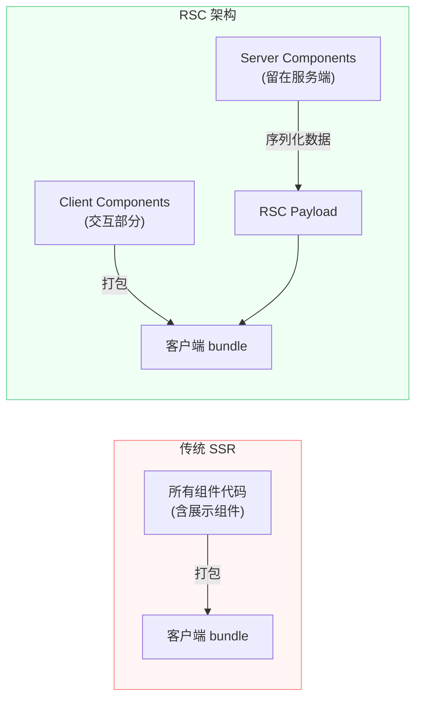
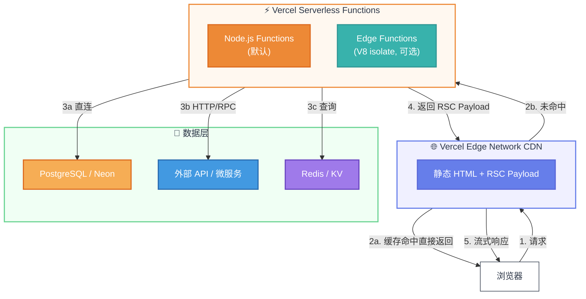
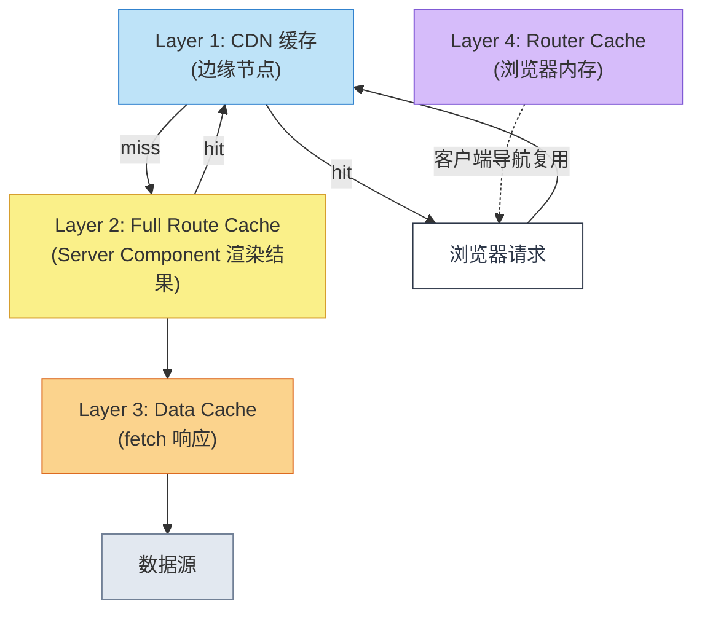

RSC（React Server Components）是一套**组件渲染范式**：把只用于展示的组件留在服务端执行，结果序列化成 RSC Payload 发到浏览器；只有需要交互的部分才被打包到客户端。常见的一个误区是认为「Server Component 必须直连数据库」，其实 RSC 的能力边界只是「可以在服务端执行 Node API」，数据从数据库来还是从后端服务来完全是架构选择。

Vercel 作为 Next.js 的官方部署平台，把这套范式产品化做得最好：静态页面进 CDN、动态请求进 Serverless Functions。本文从 RSC 原理出发，重点拆解 Next.js 在 Vercel 上的运行时组成——CDN 边缘缓存、Node Runtime 与 Edge Runtime 的差异、四层缓存机制，以及一个动态页面的完整请求旅程。

<!--more-->

## 一、背景：传统渲染模式的痛点

在 RSC 出现之前，前端渲染主要有四种模式：CSR、SSR、SSG、ISR。这几种模式我在 [Next.js 核心渲染模式解析](/posts/nextjs-rendering-modes/) 一文里详细讲过。但在实践中，这些模式都有各自的短板：

**CSR（Client-Side Rendering）**：首屏靠 JS 在浏览器里拼，SEO 不友好，白屏时间长。组件逻辑全要打到客户端，bundle 越来越大。

**传统 SSR**：每次请求服务端渲染完整 HTML，浏览器再 hydrate 整个应用。这意味着**所有组件代码都要发到浏览器**，哪怕只是展示一行文字的纯展示组件。

**SSG/ISR**：构建时或后台生成静态页面，性能最好，但难以处理个性化、用户登录后的视图。

RSC 想解决的问题，本质上只有一句话：**把"只用于渲染的组件"留在服务端，不要把它们的代码发到浏览器**。



实际收益：一个普通电商页面的客户端 bundle 从 450KB 降到 140KB，原因就是大量纯展示组件（商品卡片、列表项、布局）不再需要被打包。

## 二、RSC 的核心原理

### 2.1 什么是 Server Component

Server Component 是**只在服务端执行的 React 组件**。它的特点是：

- 不能包含交互逻辑（`useState`、`useEffect`、事件处理器）
- 可以是 `async`，直接在组件体内 `await` 数据
- 可以访问 Node API：文件系统、数据库、`fs`、`process.env` 等
- 渲染结果被**序列化**成一种特殊格式（RSC Payload），发到浏览器

```tsx
// app/products/page.tsx — Server Component
import { db } from '@/lib/db'

export default async function ProductList() {
  // 直接 async，直接查 DB，完全合法
  const products = await db.product.findMany()

  return (
    <div>
      {products.map(p => (
        <ProductCard key={p.id} product={p} />
      ))}
    </div>
  )
}
```

### 2.2 什么是 RSC Payload

这是 RSC 最核心的概念。浏览器拿到的不是 HTML 字符串，而是一段**序列化后的 React 元素树**：

```
格式类似：
M1:{"id":"./ProductCard.js","chunks":["abc123"],"name":"default"}
J0:["$","div",null,{"children":[
  ["$","@1",null,{"product":{"id":1,"name":"iPhone"}}]
]}]
```

其中 `M` 行是模块引用（指向 Client Component 的引用），`J` 行是 JSX 树。浏览器拿到这段数据后：

1. 解析出哪些是已经渲染好的 Server Component（直接展示）
2. 解析出哪些是 Client Component 引用，去拉客户端 chunk
3. 把两部分拼起来，hydrate 交互部分

### 2.3 流式响应（Streaming）

RSC 天然支持流式渲染。Server Component 里如果有慢的部分，可以用 `<Suspense>` 隔离，**先返回快的部分**：

```tsx
import { Suspense } from 'react'

export default function Page() {
  return (
    <>
      <FastSection />  {/* 立即返回 */}
      <Suspense fallback={<Skeleton />}>
        <SlowSection />  {/* 后台慢慢渲染，流式补充 */}
      </Suspense>
    </>
  )
}
```

用户看到的是「页面框架先出来，慢内容随后填进来」，而不是「白屏等所有数据齐了才一次性渲染」。

### 2.4 Server Component 不是必须直连数据库

这是很多人误解的地方。RSC 的能力边界是「**可以在服务端执行 Node API**」，但怎么用这个能力是你的架构选择：

| 数据来源 | Server Component 是否能用 | 备注 |
|---|---|---|
| 直接 `db.query()` / ORM | ✅ | Node Runtime 下 |
| `fetch()` 内部后端 API | ✅ | 最常见的方案 |
| `fetch()` 外部 HTTP 服务 | ✅ | 微服务调用 |
| gRPC / RPC | ✅ | 内部服务高效调用 |
| 浏览器端 Cookie 转发的鉴权调用 | ✅ | 需要手动 `cookies()` 转发 |

**RSC 让你「能」绕过 API 层，但不是让你「必须」这么做**。判断标准很简单：

- 这份数据**只有 Next.js 在用** → 直接查 DB
- 这份数据**被多个入口共用**（移动端、第三方、小程序）→ 保留 API 层，让 RSC 调它
- 写操作涉及业务规则（事务、分布式锁、风控）→ Server Actions 或独立 API，别塞进组件

## 三、Vercel 上的 Next.js 架构

Vercel 是 Next.js 的官方部署平台，也是把 RSC 这套架构「产品化」做得最好的。整个架构可以分成三层：



### 3.1 三种渲染策略在 Vercel 上的归宿

**SSG（Static Site Generation）**：
- 构建时在 Vercel 构建机上执行 RSC，生成 HTML + RSC Payload
- 部署时推送到全球 CDN 边缘节点
- 请求时 CDN 命中，毫秒级返回（不经过任何函数计算）

**ISR（Incremental Static Regeneration）**：
- 首次请求 CDN miss → 触发 Serverless Function 渲染 → 回填 CDN
- 后续请求 CDN 命中
- 过期后下一次请求触发**后台重新生成**（stale-while-revalidate）
- 标记方式：`export const revalidate = 60`

**SSR / 动态 RSC（Dynamic Server Rendering）**：
- 每次请求都命中 Serverless Function → 执行 RSC → 返回结果
- 标记方式：`export const dynamic = 'force-dynamic'`，或使用了 `cookies()` / `headers()` / `fetch(..., { cache: 'no-store' })`

### 3.2 一个动态请求的完整旅程

```
用户访问 /products/123
    ↓
① Vercel Edge Network（边缘节点）
   ├─ 检查 CDN 缓存：miss（这是动态路由）
   └─ 转发到最近的 Serverless Function
    ↓
② Serverless Function（Node.js Runtime）
   ├─ 启动（冷启动 200-500ms，热启动 <50ms）
   ├─ 执行 Server Components：
   │    ├─ <RootLayout>   → 读 cookies()，获取用户身份
   │    ├─ <ProductPage>  → await db.product.findUnique({ where: { id: 123 } })
   │    └─ <ReviewList>   → await fetch(API_URL, { next: { revalidate: 60 } })
   ├─ 渲染完成，序列化成 RSC Payload
   └─ 包进 HTML 流式响应
    ↓
③ 浏览器收到响应
   ├─ 解析 HTML，立即展示已渲染部分
   ├─ 收到 RSC Payload 后，挂载 Client Components
   └─ Hydration 完成，页面可交互
```

### 3.3 Node Runtime vs Edge Runtime

Vercel 提供两种 Function runtime，选择直接决定你能用什么能力：

| Runtime | 本质 | 能力 | 冷启动 | 部署位置 |
|---|---|---|---|---|
| **Node.js**（默认） | 完整 Node 进程 | 全部 Node API、文件系统、所有 npm 包、能直连 DB | 200-500ms | 固定区域（iad1 等） |
| **Edge** | V8 isolate | 受限 API，不能直连 TCP DB，不能用大部分 Node 模块 | ~5ms | 全球边缘节点 |

**配置方式**：

```tsx
// 默认 Node.js，什么都不用写

// 切到 Edge Runtime
export const runtime = 'edge'

// app/api/route.ts 里
export const runtime = 'edge'
```

**实践中的取舍**：
- 需要 `prisma` 直连 DB、用 `fs`、复杂业务逻辑 → Node Runtime
- 需要全球低延迟、轻量 API、地理路由 → Edge Runtime
- Edge 上要查 DB，得走代理（Prisma Accelerate、Neon HTTP driver）

### 3.4 缓存层：最容易搞混的部分

Vercel 上有四层缓存，搞清楚每层缓存的是什么，控制粒度才精确：



**Layer 1 — CDN 缓存**：缓存完整 HTML + RSC Payload，控制 header `s-maxage`、`stale-while-revalidate`，命中条件是路由是静态/ISR 且没过期。

**Layer 2 — Full Route Cache**：缓存 Server Component 的渲染结果，跨请求复用、跨用户复用（除非带用户态标记）。控制 `next.revalidate` / `next.tags`。

**Layer 3 — Data Cache**：缓存 `fetch()` 的响应，可以被 `revalidateTag()` 主动失效。控制 `fetch(url, { cache, next })`。

**Layer 4 — Router Cache**：浏览器内存里的 RSC Payload + 路由树，Next.js 客户端自动管理（30 秒 stale），用户导航时不重新发请求。

**典型用法**：

```tsx
// 公共数据，进 CDN 和 Full Route Cache
fetch(url, { next: { revalidate: 60, tags: ['products'] } })

// 用户态数据，跳过所有缓存
fetch(url, { cache: 'no-store' })

// 主动失效
import { revalidateTag } from 'next/cache'
revalidateTag('products')
```

## 四、Server Component 直连数据库的工程权衡

既然 RSC 允许直连，那到底什么时候该走 API、什么时候该直连？我把工程上常见的判断列出来：

**适合直接连 DB 的场景**：
- 单体应用，没有跨服务需求
- 简单 CRUD，业务规则在数据库就能搞定
- 性能敏感，**省掉一次网络往返和 JSON 序列化**
- 团队规模小，前后端一个团队维护
- 单页面大量组件需要同一份数据（用 React `cache()` 合并请求）

**应该保留 API 层的场景**：
- 多端共用数据（移动端、第三方开放平台、小程序）
- 已有微服务/独立后端团队，再连一遍等于把业务切碎
- 复杂业务前置：事务、分布式锁、风控、限流中间件放在 ORM 调用里很别扭
- 安全边界：把数据库连接凭据放进 SSR runtime 的攻击面
- 跨服务调用，需要走服务发现、负载均衡

**一句话**：

> Server Component 直接连 DB 是 RSC 的「能力上限」，但工程上不一定是「最优选择」。看你的数据是被谁消费。

## 五、总结

RSC 不是一个新框架，而是一种**新的渲染范式**。它把"组件在哪执行"这件事变成了可控的——纯展示组件留在 Node 进程里执行，结果序列化成 RSC Payload 发到浏览器；只有需要交互的部分才被打包到客户端。

Vercel 把这套范式做成了一键部署：静态的进 CDN，动态的进 Serverless Function，开发者不用关心扩容、负载均衡、边缘节点这些事。要注意的是：

1. **RSC 不强制直连 DB**，它是能力不是义务
2. **Vercel 的缓存分四层**，每层控制粒度不同，写代码时要清楚缓存的是哪一层
3. **Node Runtime 默认能直连 DB**，Edge Runtime 不能——切 runtime 之前先想清楚
4. **直连 DB 在工程上不一定最优**，多端共用、复杂业务、安全边界这些场景还是 API 层更合适

理解了这几件事，用 Next.js 写应用就从"框架使用"升级到"架构设计"了。