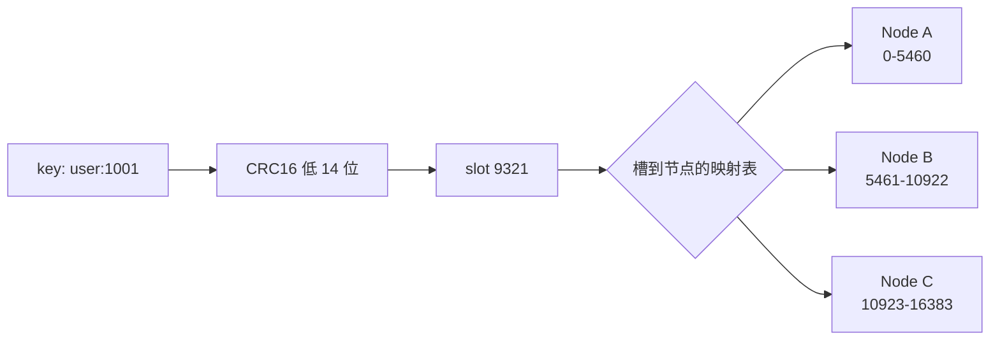

Redis Cluster 不把 key 直接映射到节点，中间隔着一层固定数量的哈希槽：key 先算出一个 0 到 16383 之间的槽号，槽号再对应到某个节点。扩容、缩容、再平衡，动的都是「槽到节点」这张表，「key 到槽」的计算从头到尾不变。

这层间接的收益很直接，但代价都藏在细节里。下面从 16384 这个数字的来历、槽表在集群里的两种形态、以及迁移过程中客户端会看到什么，逐段拆开。

<!--more-->

## 一、key 到槽，槽到节点

槽号的计算就一行公式：

```text
HASH_SLOT = CRC16(key) mod 16384
```

这里的 CRC16 不是随便一个变体，官方规范把它钉死成 XMODEM：

| 参数 | 值 |
| --- | --- |
| 名称 | XMODEM（又称 ZMODEM、CRC-16/ACORN） |
| 宽度 | 16 bit |
| 多项式 | 0x1021（x^16 + x^12 + x^5 + 1） |
| 初值 | 0x0000 |
| 输入 / 输出反转 | 否 / 否 |
| 输出异或 | 0x0000 |

源码里的写法不是取模，而是位与——因为 16384 是 2 的 14 次方：

```c
/* src/cluster.h */
#define CLUSTER_SLOT_MASK_BITS 14
#define CLUSTER_SLOTS (1 << CLUSTER_SLOT_MASK_BITS)          /* 16384 */
#define CLUSTER_SLOT_MASK ((unsigned long long)(CLUSTER_SLOTS - 1))
```

取模 16384 等价于只保留 CRC16 结果的低 14 位，高两位直接丢掉。原来 16 位能取到 65536 种余数，这里只用到 16384 种。这个「浪费」就是整件事的起点。



关键在于两个映射的独立性：key 到槽只依赖 key 自身的字节，跟集群有几个节点、都是谁无关；节点拓扑变化只改下面那张表。所以加一台机器时，没有哪个 key 需要重新计算位置，只需要把一批槽「过户」过去。

## 二、16384 的来历

antirez 在 issue #2576 里亲口解释过这个数字，理由是两条：

```text
1. Normal heartbeat packets carry the full configuration of a node, that
   can be replaced in an idempotent way with the old in order to update
   an old config. This means they contain the slots configuration for a
   node, in raw form, that uses 2k of space with 16k slots, but would use
   a prohibitive 8k of space using 65k slots.
2. At the same time it is unlikely that Redis Cluster would scale to more
   than 1000 master nodes because of other design tradeoffs.
```

第一条对应源码里的一个字段。集群节点之间走一条独立的 TCP 通道（Cluster Bus，端口是数据端口加 10000），心跳包头里塞着一个<strong>原始位图</strong>，第 N 位表示「这个槽归发送方」：

```c
/* src/cluster_legacy.h */
unsigned char myslots[CLUSTER_SLOTS / 8];        /* 2048 字节 */
static_assert(offsetof(clusterMsg, myslots) == 80, "");
static_assert(offsetof(clusterMsg, slaveof) == 2128, "");
```

80 加 2048 等于 2128，两个编译期断言把这个数组的大小和位置钉死。2048 字节是 16384 位的直接结果，换成 65536 槽就是 8192 字节。心跳是每秒都在发的，包头的体积会乘上整个集群的通信量。

| 槽位数 | 位图大小 | 1000 个主节点时每节点 | 结论 |
| --- | --- | --- | --- |
| 1024 | 128 B | 不够分（最多 1024 个节点） | 粒度太粗 |
| 16384 | 2 KB | 约 16 个 | 实际采用 |
| 65536 | 8 KB | 约 65 个 | 心跳包过大 |

第二条是容量上的假设：设计时认为集群不会长到 1000 个主节点以上，16384 分给 1000 台，每台还有 16 个槽，粒度够用；再往上加槽位只会让心跳包变大，换不来实际收益。

有一点常被中文博客写错：<strong>位图在集群总线上并不压缩</strong>。antirez 在同一串讨论里后来自己澄清过 —— "No compression, just 1 bit for 1 slot"，指向的就是上面那个 `myslots` 数组。真正会「压缩」的是给人看的文本输出：`CLUSTER NODES` 会扫描位图，把连续的 bit 合并成区间，打印成 `0-5460` 这样的形式；对应的 `clusterNode` 结构里除了原始位图，还存了一份 `slot_info_pairs`（start/end 区间对）专门用于输出。所以准确的说法是：总线传裸位图，区间压缩只发生在文本层。

## 三、哈希标签与跨槽限制

槽位这层间接有个直接后果：多 key 操作要求所有 key 落在同一个槽，否则报 `CROSSSLOT` 错误。`MULTI` 事务、Lua 脚本、`MSET` 都受这条约束。

解法是哈希标签。当 key 里出现 `{...}` 且花括号内非空时，只对花括号之间的子串做哈希，这段子串就是「标签」：

```ruby
def HASH_SLOT(key)
  s = key.index "{"
  if s
    e = key.index "}", s + 1
    key = key[s + 1..e - 1] if e && e != s + 1
  end
  crc16(key) % 16384
end
```

注意规则里的三个条件：必须存在 `{`，`{` 右边必须存在 `}`,两者之间必须有至少一个字符。所以 `{}:name` 这种空标签会退化——仍然按整个 key 哈希。用起来是这样的：

```text
MSET {user:1000}.name Angela {user:1000}.surname White
```

两个 key 都只哈希 `user:1000`，必然同槽，跨 key 操作就合法了。

迁移期间这条保证会短暂松动：如果多 key 操作涉及的 key 不存在，或者正分散在源节点和目标节点两侧，会拿到 `-TRYAGAIN`，客户端过一会儿重试即可。单 key 操作不受影响。

## 四、槽位迁移：一次搬一个槽

Redis 把「加节点」「减节点」「再平衡」全都抽象成同一个动作——搬槽。搬一个槽就是把哈希到这个槽的所有 key 从 A 挪到 B。整个过程由两条状态标记加一条数据搬移命令组成：

```text
# 目标节点 B 标记为「正在导入」
CLUSTER SETSLOT 8 IMPORTING <A 的 node id>

# 源节点 A 标记为「正在迁出」
CLUSTER SETSLOT 8 MIGRATING <B 的 node id>

# 从 A 取一批属于槽 8 的 key，逐批搬走
CLUSTER GETKEYSINSLOT 8 100
MIGRATE 10.0.0.12 6379 "" 0 5000 KEYS {user:1000}.name

# 搬完，双方（通常还包括其余节点）恢复正常归属
CLUSTER SETSLOT 8 NODE <B 的 node id>
```

`MIGRATE` 本身是原子的：两端在这段时间内被锁住，序列化后的 key 送达目标、收到 OK 之后再从源删除。对外部客户端来说，一个 key 在任意时刻要么在 A 要么在 B。

两个状态标记决定的是「谁来回答」：

| 状态 | 持有方 | 行为 |
| --- | --- | --- |
| MIGRATING | 源节点 A | 槽内 key 还在 → 正常处理；key 已经搬走 → 回 `-ASK`，指向 B |
| IMPORTING | 目标节点 B | 只有客户端先发过 `ASKING` 才处理，否则回 `-MOVED`，指向 A |

`MOVED` 和 `ASK` 的区别是永久与一次性：`MOVED` 表示槽的归属已经变了，客户端应该更新本地槽表；`ASK` 只对紧跟其后的那一条命令有效，客户端不能借此改动槽表。之所以必须存在 `ASK`，是因为迁移中同一个槽的 key 可能同时散在 A 和 B 两边，客户端必须仍然先问 A、再按需转 B。这个额外的往复只挂在某一个槽上，代价可以接受。

客户端这边维护一份槽到节点的映射（实现上常按区间存），稳定期直接命中目标节点、不产生任何重定向；一旦收到 `MOVED`，说明很可能有一批槽一起变了，此时整份刷新更划算——刷新用 `CLUSTER SHARDS`，`CLUSTER SLOTS` 从 7.0 起已被标记为 deprecated。

## 五、和一致性哈希的差别

一致性哈希把节点和 key 都映射到同一个哈希环上，key 顺时针碰到的第一个节点就是归属，为了对抗倾斜，每个物理节点在环上放上百来个虚拟节点。它的「桶」是环上的虚拟节点，<strong>数量跟着节点数走</strong>。

Redis 的 16384 个槽是<strong>定长桶</strong>，桶的数量和节点数完全解耦。两者都能做到「扩容只搬一部分数据」，但可控性不一样：一致性哈希里新节点进环之后到底接走哪些 key，由哈希位置决定，你只能说个期望值；Redis 里槽到节点是一张显式表，可以精确地指定「从 A 匀 500 个槽给 B」，负载均衡变成一道算术题。

| 维度 | 一致性哈希 | Redis 哈希槽 |
| --- | --- | --- |
| 哈希空间 | 环 [0, 2^32)，节点与 key 同空间 | 桶 0-16383，key 单向映射 |
| 桶数量 | 随节点与虚拟节点数变化 | 固定 16384，与节点数无关 |
| 新节点影响范围 | 环上相邻区间的 key | 迁移哪些槽由工具或人显式指定 |
| 平衡手段 | 增加虚拟节点 | 调整槽分配，有明确计数 |
| 元数据形态 | 环本身，各客户端需达成一致 | 槽到节点的表，随 gossip 传播 |
| 迁移粒度 | 单 key 或虚拟节点区间 | 槽，槽内 key 整批走 |

[一致性哈希的深入分析](/2017/08/consistent-hashing-deep-dive/)那篇拆过虚拟节点和倾斜的问题，关心的是「怎么让环均匀」；Redis 这套关心的是「怎么让搬动可被精确指挥」，槽位就是为此引入的一层。

16384 不是算出来的最优值，它是「心跳包里的位图要小」和「主节点不会超过 1000 台」这两条约束交点上一个够用的数字。

真正让整套设计站得住的是槽这层间接：把「数据在哪」拆成两个独立的映射之后，key 到槽永不失效，槽到节点可以随时重写。迁移、再平衡、故障转移全都落在那张可随时改写的表上，客户端要做的只是缓存一份槽到节点的映射，并在收到 `MOVED` 时重新拉一遍。
