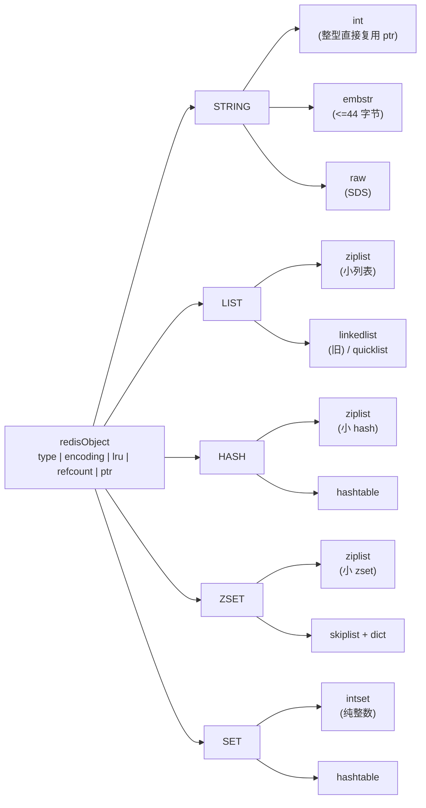
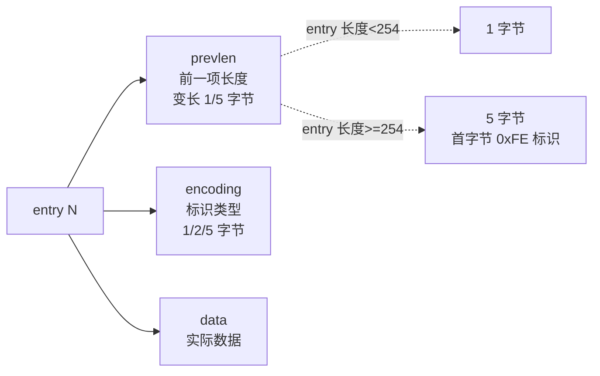
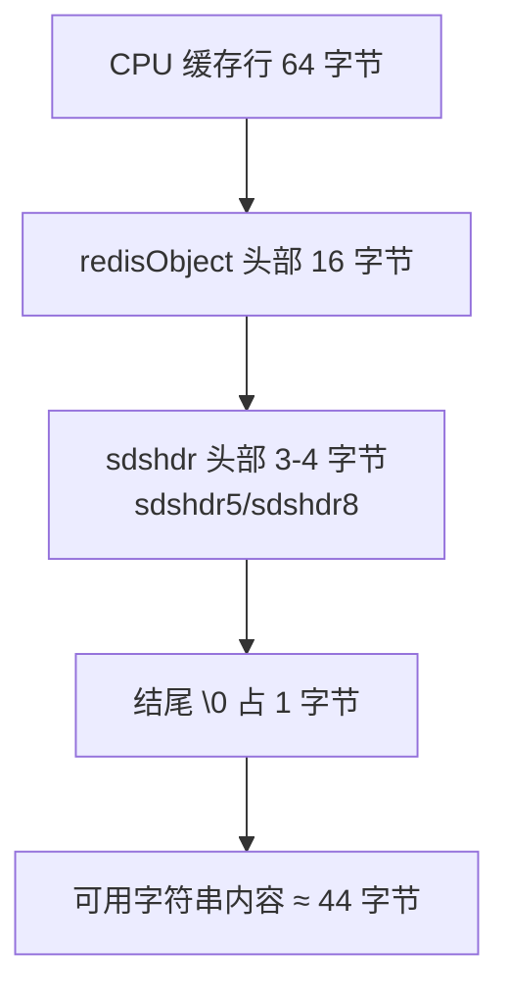
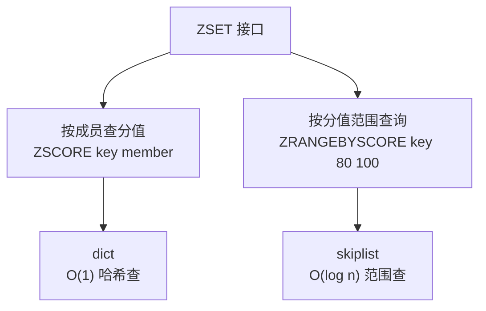
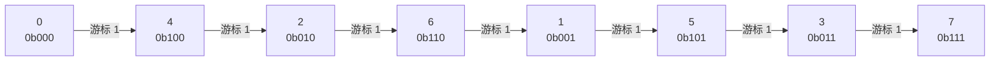
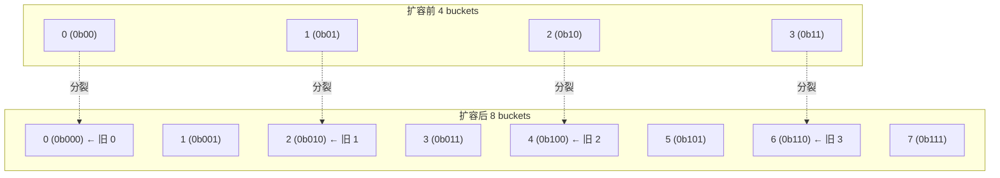

凌晨两点，线上 Redis 集群报警 `used_memory_rss` 飙到物理内存的 95%。你下意识敲下 `DEBUG OBJECT mykey`，看到 `encoding: hashtable`——本来期望的 `ziplist` 已经被自动升级成 dict 了。更糟的是 `redis-cli --scan --pattern 'user:*' | wc -l` 在主节点上跑了一分多钟，期间 P99 延迟从 2ms 跳到 800ms。

这是典型的"不知道 Redis 在背后做了什么"引发的血案。Redis 不只是一个 key-value 存储：它在每个 key 背后藏了一套**对象系统**、**多种底层编码**和**渐进式 rehash 机制**。理解这些，就知道为什么 KEYS 是生产禁令、为什么 SCAN 是"魔法"、为什么"小 key 聚合"比"大 key 拆分"更重要。

<!--more-->

## 一、对象系统：type 与 encoding 两层

Redis 的每个 key 在内存里都对应一个 `redisObject` 结构（在 `server.h` 中定义）：

```c
typedef struct redisObject {
    unsigned type:4;        // 5 种数据类型
    unsigned encoding:4;    // 多种底层编码
    unsigned lru:24;        // LRU 淘汰用
    int refcount;           // 引用计数
    void *ptr;              // 指向实际数据结构
} robj;
```

`type` 暴露给客户端，是 `STRING / LIST / HASH / SET / ZSET` 这五种；`encoding` 是 Redis 内部实现，同一个 type 在数据规模不同时会切换底层结构：



**关键点：`type` 是用户视角，`encoding` 是 Redis 视角。** 同一个 `HASH`，元素多了会自动从 `ziplist` 升到 `hashtable`——这条切换路径对客户端完全透明，但会决定内存占用相差 5-10 倍。

`OBJECT ENCODING` 是窥探内部编码的命令：

```bash
> SET greeting "hello world"
OK
> OBJECT ENCODING greeting
"embstr"

> APPEND greeting " - this is a long string exceeding the embstr threshold"
> OBJECT ENCODING greeting
"raw"
```

## 二、小对象编码：内存压榨术

Redis 设计的核心矛盾：**CPU 便宜，内存贵**。所有"小对象编码"都是用 CPU 时间换内存空间。下面分三类看。

### 2.1 ziplist：连续内存的极致压缩

`zipList`（压缩列表）是 Redis 自定义的一块**连续内存**，每个 entry 由三段组成：



两个关键设计：

- **无指针**：所有 entry 在一块连续内存上，没有 malloc/free，没有指针，CPU 缓存极友好
- **变长 prevlen**：每个 entry 记录前一项长度，方便从后向前遍历（`ZREVRANGE` 用得到）

代价是著名的**连锁更新（cascade update）**问题：在 entry N 的长度从 250 变成 256（恰好跨过 254 字节门槛）时，entry N+1 的 prevlen 要从 1 字节扩到 5 字节，自己又会膨胀超过 254，进而触发 N+2 的 prevlen 也膨胀……最坏情况 O(n²)。Redis 文档承认这是 ziplist 存在的最坏情况，但因为 entry 普遍较短，实际很少触发。

### 2.2 intset：纯整数的紧凑结构

`intset`（整数集合）是 Redis 给**纯整数集合**准备的紧凑结构：所有元素按值排序，用二分查找定位，类型可以动态升级（`int16 → int32 → int64`）：

```c
typedef struct intset {
    uint32_t encoding;   // INTSET_ENC_INT16/32/64
    uint32_t length;
    int8_t contents[];
} intset;
```

**两个不直观的规则**：

- **升级不降级**：哪怕删光了大整数，编码也不会回退。Redis 宁可浪费内存，也不愿每次删除都做一次 O(n) 重排
- **二分而非哈希**：明明是 O(1) 的 hash，为什么用 O(log n)？因为 `intset` 在内存上比 hashtable 紧凑得多——100 个整数集合 `intset` 占 408 字节，`hashtable` 要 3KB 多

### 2.3 字符串三态：int / embstr / raw

字符串是 Redis 里最常见的 type。它有三种编码，对应三种内存布局：

```bash
> SET counter 100
> OBJECT ENCODING counter
"int"            # 整型：直接复用 ptr 存 long 值，零额外内存

> SET greeting "hello"
> OBJECT ENCODING greeting
"embstr"         # embstr：redisObject + sdshdr + data 一次性分配

> SET doc "this is a very long string ... 远超 embstr 阈值 ..."
> OBJECT ENCODING doc
"raw"            # raw：redisObject 和 SDS 分别两次分配
```

**44 字节分界线怎么来的**：



64 - 16 - 3 - 1 = **44**。embstr 的精髓是：redisObject、sds 头、字符串内容、结尾 `\0` 一次 `malloc` 出来，**正好占满一个缓存行**，读取时一次 cache miss 就拿到全部。

超过 44 字节就走 `raw`：redisObject 和 SDS 两次分配，两个缓存行，两次 cache miss。

### 2.4 阈值配置表："内存换 CPU"的旋钮

ziplist / intset 是**有上限的小编码**。Redis 提供配置项控制切换阈值，调小阈值 = 更省内存但 ziplist 上 O(n) 操作更多，调大阈值 = 更费内存但 CPU 更快：

| 配置项 | 默认值 | 含义 |
|--------|--------|----------|
| `hash-max-ziplist-entries` | 512 | hash 元素数超过此值，转 hashtable |
| `hash-max-ziplist-value` | 64 字节 | hash 单个 field/value 长度超过此值，转 hashtable |
| `list-max-ziplist-size` | -2（即 8KB） | list 整个 ziplist 超过此字节数，转 quicklist |
| `list-compress-depth` | 0 | quicklist 两端不压缩的节点数 |
| `zset-max-ziplist-entries` | 128 | zset 元素数超过此值，转 skiplist+dict |
| `zset-max-ziplist-value` | 64 字节 | zset 单个 member/score 长度超过此值，转 skiplist+dict |
| `set-max-intset-entries` | 512 | set 元素数超过此值且能转 intset 时，转 hashtable |

**强调一句：阈值是"内存换 CPU"的旋钮**。ziplist 上所有操作都是 O(n) —— `HGETALL` 在 512 元素的小 hash 上是 O(512)，但 hashtable 是 O(1) 哈希查找。如果你的场景是"读多写少"且元素又小又少，阈值可以调大；如果场景是"频繁 HGETALL 大对象"，阈值要调小。

## 三、zset 为什么同时用 skiplist + hash

Redis 的 zset 是唯一一个有"双结构"的类型：内部同时维护一个 **dict** 和一个 **skiplist**，两边数据完全同步。

为什么不用一个结构搞定？两种访问路径的复杂度要求完全不同：



如果只用 dict：`ZRANGEBYSCORE` 要遍历全部 O(n)。

如果只用 skiplist：`ZSCORE` 是 O(1) 哈希查变成 O(log n)，高频命令变慢 10 倍。

所以 zset **同时维护两份**，dict 服务单点查询，skiplist 服务范围查询，`ZRANGEBYSCORE` 一边走 skiplist 找到区间，一边用 dict 反查每个 member 的分值（虽然 skiplist 上拿到的就是分值，但其它命令可能需要）—— 这是"空间换时间"的典型。

### 3.1 skiplist vs 平衡树：工程上的三个理由

skiplist 是 Redis 作者 antirez 反复斟酌后的选择，常被拿来和 AVL/红黑树对比：

- **实现简单**：skiplist 插入/删除 ~100 行 C 代码，平衡树的旋转操作调试起来是噩梦
- **范围遍历天然**：skiplist 底层就是链表（`BWALK` 是反向），中序遍历平衡树要做额外的栈结构
- **随机层高，免旋转**：skiplist 用随机化保证平衡，不需要全局 rebalance；红黑树的删除要处理 6 种 case

Redis 给 skiplist 选的具体参数：

```c
#define ZSKIPLIST_MAXLEVEL 32  // 最大层数
#define ZSKIPLIST_P 0.25       // 升级概率
```

**为什么 p = 0.25 而不是 0.5**：p 越大，平均层数越高，查询越快但插入开销也越大。p=0.25 让大部分节点只有 1-2 层，skiplist 又浅又紧凑，平均每个节点 1.33 层指针，内存极省；查询复杂度仍是 O(log n)，只是常数项略大。**为什么 maxlevel = 32**：极端上限保护。理论上 2^32 个元素的 skiplist 才可能达到 32 层，远超任何真实场景；32 层指针是 `zskiplistLevel[32]`，每层 8 字节，总共 256 字节，节点结构本身有上限。

## 四、SCAN 的巧思（重点）

这是本文最重要的一节。

### 4.1 为什么 KEYS 是生产禁令

`KEYS pattern` 的问题是它在**单线程**的 Redis 里**同步阻塞**主循环：

```bash
> KEYS user:*        # Redis 主线程停顿，直到返回所有匹配的 key
> KEYS *             # 1000 万 key 的库上跑十几秒，期间所有命令排队
```

除了阻塞，`KEYS pattern` 在数据量大时还有三个问题：返回巨量 key 撑爆客户端 buffer、加重网络延迟、Cluster 模式下 KEYS 不跨 slot（你想 KEYS 必须扫每个节点）。

`SCAN` 的设计目标：**渐进式遍历**，把一次大查询切分成多次小查询，**每次执行一小段时间就放回主线程**。命令签名：

```bash
SCAN cursor [MATCH pattern] [COUNT count] [TYPE type]
```

返回的是一个**游标 + 元素列表**对：

```text
1) "8192"            # 下一次迭代的游标（0 表示遍历完成）
2) 1) "key1"
   2) "key2"
   ...
```

### 4.2 reverse binary iteration：游标的奥秘

SCAN 最精妙的地方在游标的设计。Redis 用**反向二进制迭代**（reverse binary iteration）生成下一个游标，核心算法只有 4 行：

```c
// dictScan 核心（C 源码）
v |= ~m0;          // 把 cursor 之外的高位置 1
v = rev(v);        // 反转位
v++;               // 加一
v = rev(v);        // 反转回来
```

这个反转技巧是为了让**高位先变**。假设 hash 表有 8 个 bucket（sizemask = 0b111），迭代顺序是：



注意看：游标走的是 `0 → 4 → 2 → 6 → 1 → 5 → 3 → 7`，**最高位先变**，最低位最后变。这不是连续加一，但效果是一样的——每个 bucket 访问一次。

### 4.3 反向二进制迭代如何扛住 rehash

Redis 的 hash 表在元素过多或过少时会 rehash（扩容到 2 倍或缩容到 1/2）。在 SCAN 遍历过程中发生 rehash 是常态：**扩容时每个 bucket 要分裂成两个**（一个高位 0，一个高位 1），**缩容时两个 bucket 合并成一个**。

reverse binary iteration 的天才之处：**高位先访问让"分裂前已存在的元素"在分裂后立刻被访问**。看一个例子，4 bucket（0b00, 0b01, 0b10, 0b11）扩到 8 bucket：



迭代顺序是 `0 → 4 → 2 → 6 → 1 → 5 → 3 → 7`。SCAN 在第一次迭代拿到 `0` 后，下次游标是 `4`（旧 bucket 2）—— 而**扩容前 bucket 2 分裂成的新 bucket 4 在我们到达前已经准备好**。这样保证了一个不变量：**扩容前已存在的元素一定不漏**。

### 4.4 代价与保证语义

reverse binary iteration 的代价是**可能返回同一个 key 多次**。这是 rehash 分裂时无法避免的：旧 bucket 0 的元素同时属于新 bucket 0 和新 bucket 4，SCAN 可能两次都返回。

由此推出 SCAN 的五条保证语义：

| 保证 | 含义 |
|------|------|
| 遍历过程中**新增的 key** | 不保证会返回（也不保证不返回） |
| 遍历过程中**已存在的 key** | 保证不漏，但**可能重复** |
| `COUNT count` | 只是**提示**，Redis 内部按 hash 表状态动态调整 |
| 单次执行**不阻塞** | 每次只扫一批 bucket，立刻返回 |
| `cursor = 0` | 遍历**开始**的标记，**不是结束的标记**；结束是 SCAN 返回 `0` 时 |

特别注意最后一条：游标 0 是"开始"，不是"结束"。客户端判断"遍历完成"的唯一方式是比较返回值和 0。整个 SCAN 协议是一个无状态游标，客户端可以**中途停**（甚至进程崩溃重启），下次传上次返回的游标继续。

### 4.5 SCAN vs KEYS 一图比较

| 维度 | KEYS pattern | SCAN cursor |
|------|--------------|-------------|
| 时间复杂度 | O(N) 一次性 | O(N) 渐进，分批 |
| 是否阻塞主线程 | 是 | 否 |
| 单次返回数量 | 全部匹配 | 一批（COUNT 提示） |
| 重复返回 | 否 | 可能 |
| 新增 key 保证 | 全部 | 不保证 |
| Cluster 支持 | 跨 slot 不支持 | 单 slot，需要每节点单独 SCAN |
| 适用场景 | 调试 / 数据极小 | 生产环境遍历 |

## 五、内存优化实战

### 5.1 把大 hash 拆成 ziplist 小 hash

一个 hash 1000 个 field 是 hashtable，**内存占用比 10 个 100 field 的小 hash（每个都是 ziplist）大 5-10 倍**。原因：hashtable 是数组 + 链表结构，每 entry 多 ~30 字节指针和元数据；ziplist 是紧凑字节数组。

**量化估算**：

- 1000 字段 hash（hashtable）：约 30KB
- 10 × 100 字段 hash（ziplist）：每 sub-hash ~2KB，总共 ~20KB
- 但 10 个 sub-hash 还要存 10 个外层 key 元数据：~10 × 200B = 2KB

实际收益 30KB → 22KB，节省 ~27%。对亿级 key 的库，这是 GB 级差异。

拆分的常见模式是按 userId 末位 hash：

```bash
# 原始
HSET user:{12345} field1 val1 field2 val2 ...

# 拆分
HSET user:{12345}:bucket:0 field1 val1 ...
HSET user:{12345}:bucket:1 field11 val11 ...
```

注意 `{}` 的用法——Redis Cluster 用 `{}` 内的内容算 slot，所有 `user:{12345}:*` 在同一个 slot，事务和 SCAN 都不跨 slot。

### 5.2 jemalloc 与 used_memory_rss

Redis 5.1 默认用 **jemalloc**（FreeBSD 出身的内存分配器）替代 glibc malloc，原因是 jemalloc 在多线程场景下的内存碎片更少。

两个内存指标要分清：

```bash
> INFO memory
used_memory:102400000      # Redis 实际"用到"的内存
used_memory_rss:153600000  # 进程向 OS 申请的常驻集（含碎片）
mem_fragmentation_ratio:1.50  # rss / used，越大碎片越多
```

- `used_memory` 正常增长：数据在涨，是业务问题
- `used_memory_rss` 涨但 `used_memory` 不涨：碎片在涨，可能是大量删 key 后 jemalloc 没及时归还内存
- `mem_fragmentation_ratio > 1.5`：碎片过多，可用 `DEBUG RELOAD` 或 `ACTIVATE-DEFRAG`（Redis 4.0+ 提供）

### 5.3 单 key 过大的连带风险

单个 key 超过几 MB 甚至 GB 是线上常见的雷：

| 操作 | 大 key 风险 |
|------|------------|
| `DEL` | 同步阻塞主线程（Redis 4.0 之前 `UNLINK` 是异步删除） |
| 主从同步 | 同步时一条 `RDB transfer-command` 阻塞带宽，主从延迟飙升 |
| Cluster 迁移 | `MIGRATE` 单 key 阻塞整个 slot 迁移 |
| `KEYS / SCAN` | 单 key 大，返回的对象大，client buffer 可能溢出 |

**判断大 key**：

```bash
redis-cli --bigkeys                  # 给出每种 type 的最大 key
redis-cli --memkeys                  # 按内存排序
DEBUG OBJECT <key> | grep serializedlength  # 单 key 序列化字节数
```

**拆解策略**：列表按时间切片、hash 按字段拆 bucket、set 拆成多个小 set（并用 SINTERSTORE 做交集）。

## 六、按数据规模选结构：一份清单

最后是一份"按数据规模选结构"的实用清单（针对 Redis 5.x 默认配置）：

```text
┌──────────────────────────────────────────────────────────────┐
│ 规模判断             │ 推荐类型                │ 内部编码      │
├──────────────────────────────────────────────────────────────┤
│ 整数计数             │ INSET (整型字符串)       │ int           │
│ < 44 字节字符串      │ STRING                  │ embstr        │
│ 44B - 几十 KB 字符串 │ STRING                  │ raw           │
│ < 128 元素小 zset    │ ZSET                    │ ziplist       │
│ 128+ 元素 zset       │ ZSET                    │ skiplist+dict │
│ < 512 元素小 hash    │ HASH                    │ ziplist       │
│ 512+ 元素 hash       │ HASH                    │ hashtable     │
│ < 512 元素小 list    │ LIST                    │ ziplist       │
│ 512+ 元素 list       │ LIST                    │ quicklist     │
│ 纯整数小 set         │ SET                     │ intset        │
│ 有非整数 set         │ SET                     │ hashtable     │
│ 流式消息（5.0+）     │ STREAM                  │ radix tree    │
└──────────────────────────────────────────────────────────────┘
```

**使用建议**：

1. **小对象优先**：能装进 ziplist / intset / embstr 就装，省内存比省 CPU 划算
2. **业务量超过阈值前主动拆分**：不要等 Redis 自动升级；提前按业务键（如 userId）拆分
3. **遍历用 SCAN 不用 KEYS**：COUNT 设为 100-1000，根据响应时间调整
4. **SCAN 客户端实现要无状态**：可以随时停，下次传游标继续
5. **大 key 用 `UNLINK` 不用 `DEL`**：异步释放内存，不阻塞主线程
6. **定期看 `INFO memory` 的 `mem_fragmentation_ratio`**：> 1.5 时考虑 `ACTIVATE-DEFRAG`

Redis 的设计哲学可以浓缩成一句话：**"在内存里塞下尽可能多的数据，同时不让访问变慢"**。从 16 字节的 `redisObject` 到 SCAN 的反向二进制迭代，每一行源码都在和内存较劲。读懂这些，就知道为什么"小 key 聚合"比"大 key 拆分"重要得多、为什么 KEYS 是生产红线、为什么 `mem_fragmentation_ratio` 是个比 `used_memory` 更敏感的早期预警指标。