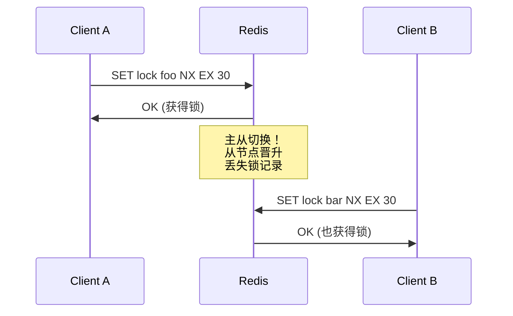
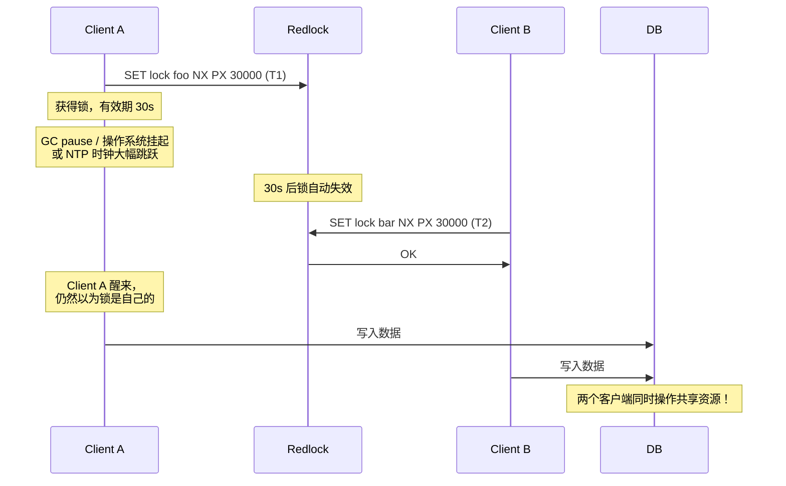
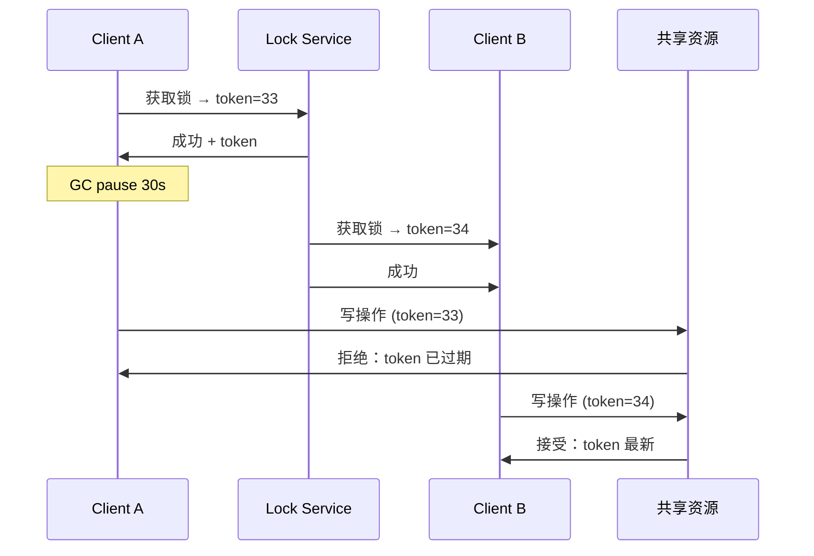
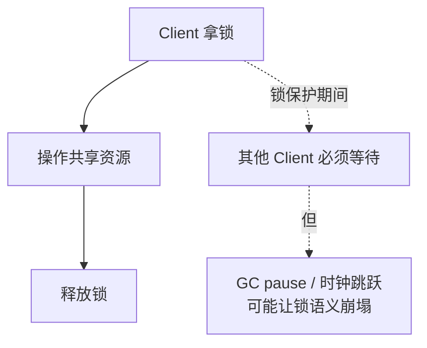

分布式锁是分布式系统的常见组件——秒杀、限流、任务调度都依赖它。Redis 因为性能好、部署简单，常被用来实现分布式锁。但是 Redis 单实例的锁正确吗？Redlock 多实例锁的算法真的安全吗？本文从 SETNX 出发，逐步剖析 Martin Kleppmann 在著名文章《How to do distributed locking》中对 Redlock 的拷问。

## 最简单的锁：SETNX + 过期

```redis
SETNX lock:order 1
EXPIRE lock:order 30
```

这是 Redis 分布式锁的最朴素实现。但有一个致命问题：**如果 SETNX 后客户端崩溃，EXPIRE 永远不会执行**——锁永久不释放。

正确做法是用一条原子命令：

```redis
SET lock:order 1 NX EX 30
```

`NX` 仅当 key 不存在时设置；`EX 30` 设置 30 秒过期。原子操作。

## 单实例 Redis 锁的局限



主从切换是单实例 Redis 锁的最大风险：

1. Client A 在 Master 上 SET 成功
3. Master 还没把 SET 命令同步到 Slave 就宕机
4. Slave 晋升为新 Master，**丢失锁记录**
5. Client B 可以再次 SET 成功

对一致性要求高的场景，单实例 Redis 不够用。

## Redlock 算法

Antirez（Salvatore Sanfilippo，Redis 作者）2014 年提出 **Redlock 算法**（[官方文档](https://redis.io/docs/manual/patterns/distributed-locks/)），目标是跨多个独立 Redis 实例做锁：


获取锁的 5 步：

1. 取当前时间 T1
2. 依次对 N 个实例发送 `SET key value NX PX ttl`
3. 记录每个实例响应的耗时，计算获取锁总耗时 elapsed
4. 只有当**多数派（N/2+1）实例成功获取**，且 `elapsed < ttl` 时，认为获取锁成功
5. 真正有效期 = ttl - elapsed - 时钟漂移

```python
def acquire_lock(redis_clients, key, value, ttl=10000):
    start = current_time_ms()
    success = 0

    for client in redis_clients:
        try:
            if client.set(key, value, nx=True, px=ttl):
                success += 1
        except Exception:
            continue

    elapsed = current_time_ms() - start
    if success > len(redis_clients) // 2 and elapsed < ttl:
        return True
    return False
```

释放时对每个实例发送 `DEL key`（Lua 脚本保证原子）。

## Kleppmann 的质疑

Martin Kleppmann 是 Cambridge 的分布式系统专家，2016 年发表《[How to do distributed locking](https://martin.kleppmann.com/2016/02/08/how-to-do-distributed-locking.html)》对 Redlock 发起挑战。Antirez 立即撰文《[Is Redlock safe?](https://antirez.com/news/101)》回应，引发广泛讨论。

核心争议：**Redlock 的安全性假设依赖"时钟不会发生跳跃性错误"**，但现实中存在多种时钟异常：



Kleppmann 提出了**最致命的反例**：

1. Client A 获得锁（ttl=30s）
2. **GC pause 或 OS 挂起**导致 Client A 长时间停顿
3. 锁自动过期（30s 后）
4. Client B 获取同一锁
5. Client A 醒来，仍然以为锁有效，继续操作共享资源

时钟跳跃（特别是 NTP 大幅调整）也会让 TTL 计算出现负数。

## Fencing Token：一种解决方案

Kleppmann 提出的强化方案是 **Fencing Token**——单调递增的 token：



- 锁服务每次分配锁时附带**单调递增的 token**
- 共享资源（数据库、存储）记录 token，拒绝过期 token 的写入
- 即使 Client A 拿着过期 token 来写，DB 也拒绝

关键：**Fencing Token 要求共享资源本身支持版本检查**（如 ZooKeeper 的 zxid、Cassandra 的 LWT）。

## Antirez 的回应

Antirez 的核心论点：

1. **GC pause 是罕见问题**：Redlock 设计目标不是抵御这类罕见故障，而是提供比单 Redis 更强的保证
2. **时钟同步**：现实环境应使用 NTP + 监控时钟漂移，而非假设完美时钟
4. **正确性问题**：必须考虑"Redlock 在 99% 情况下能正确工作"的价值

这场讨论的核心分歧是：**分布式锁的"正确性"如何定义**。

## 等价性问题：锁的语义

Kleppmann 提出的关键洞见：

> 一个分布式锁，本质上需要提供比"互斥"更强的保证——它要建立的不仅是不变量，还要对应现实世界的事件顺序。



如果你的应用**严格依赖"持锁者必不冲突"**（如金融转账），纯 Redis 锁不够——你需要 ZAB/Paxos 类强一致系统。

如果你的应用**能容忍偶发冲突**（如秒杀、统计计数器），Redis 锁足够。

## 现实选型建议

| 场景 | 推荐方案 |
|---|---|
| 严格一致性（金融、库存） | ZooKeeper / etcd + Fencing Token |
| 高性能 + 大部分一致（缓存、限流） | Redis Redlock |
| 单体应用不需要分布式锁 | 不需要 |
| 跨机房/多区域 | 慎用——网络延迟会破坏 TTL 假设 |

## Redis 锁的工程实现要点

### 1. 唯一 value 防误删

```lua
-- 释放锁前验证 value
if redis.call("get", KEYS[1]) == ARGV[1] then
    return redis.call("del", KEYS[1])
else
    return 0
end
```

value 用 UUID，避免释放别人的锁。

### 2. 锁续约（看门狗）

Redisson 等客户端实现了 **Watch Dog** 机制：定时续约锁，避免业务没完成锁就过期：

```java
// Redisson 自动续约
lock.lock();  // 后台线程每 1/3 ttl 续期一次
try {
    doWork();
} finally {
    lock.unlock();
}
```

### 3. 自旋获取

```java
while (!lock.tryLock(100, 30, TimeUnit.SECONDS)) {
    // 等待后重试
}
```

设置重试间隔和最大等待时间，避免无效自旋。

## etcd vs Redis 锁

| 维度 | Redis Redlock | etcd / Zookeeper |
|---|---|---|
| 一致性 | 多数派成功（弱保证） | Raft / ZAB 强一致 |
| 时钟依赖 | 强（TTL 基于本地时钟） | 弱（依赖租约/会话） |
| 性能 | 高 | 中 |
| 复杂度 | 多实例部署 | 3/5 节点 + 选举 |
| Fencing Token | 不支持 | 支持（lease ID） |

如果业务对一致性要求高，**etcd 或 ZooKeeper 是更好的选择**——它们的 lease 机制基于租约而非时间，能抵御时钟跳跃。

## 实际案例分析

### 案例 1：电商秒杀

- 流量大、性能敏感
- 偶发超卖可接受（人工补单）
- **Redis 锁 + 库存预扣**足够

### 案例 2：支付扣款

- 一致性严格，不能重复扣款
- **必须用 ZK / etcd + 数据库乐观锁**

### 案例 3：定时任务

- 多个实例抢同一任务
- 偶发重复执行可接受（任务本身要幂等）
- **Redis 锁 / 数据库行锁都够**

## 我的实践清单

1. **业务先考虑幂等**：避免"必须严格互斥"的场景
2. **小集群（3 节点）足够**：5 节点成本高收益有限
3. **锁粒度要细**：按订单 ID 分段锁，不要按业务锁
4. **监控锁等待时长**：超时率 / 等待时间 / GC 频率
5. **使用 Redisson 等成熟客户端**：避免手写 Lua 脚本出错

## 锁的替代方案

有时根本不需要"锁"：

```sql
-- 数据库乐观锁
UPDATE orders SET status = 'paid', version = version + 1
WHERE id = 123 AND version = 0;
```

```python
# 唯一索引防重复
try:
    db.insert(unique_key=task_id, ...)
except DuplicateKeyError:
    pass  # 已存在
```

幂等设计 + 乐观锁往往比分布式锁更可靠。

## 参考资料

- Antirez《Distributed locks with Redis》[官方文档](https://redis.io/docs/manual/patterns/distributed-locks/)
- Martin Kleppmann《[How to do distributed locking](https://martin.kleppmann.com/2016/02/08/how-to-do-distributed-locking.html)》
- Antirez《[Is Redlock safe?](https://antirez.com/news/101)》
- Kleppmann《Designing Data-Intensive Applications》第 8 章（中文版《数据密集型应用系统设计》）
- Redisson 文档：[Distributed locks and synchronizers](https://github.com/redisson/redisson/wiki/8.-distributed-locks-and-synchronizers)