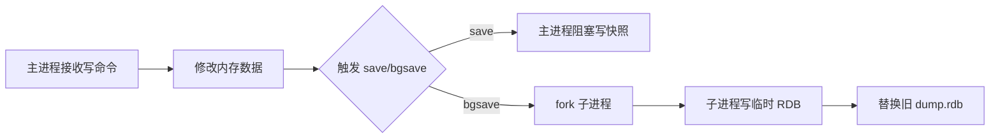
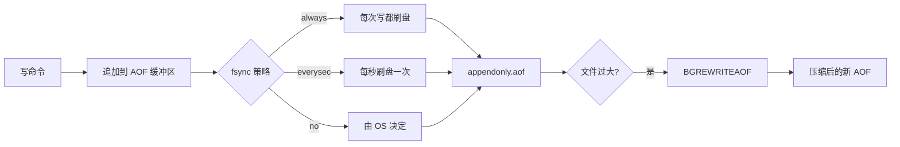
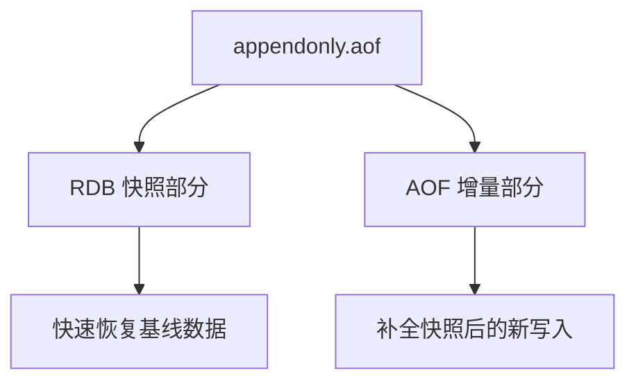

内存是易失的。一台物理机的内存条拔掉，断电后所有数据归零；但 Redis 的定位不仅是缓存——当它用作计数器、分布式锁、限流器、排行榜的时候，每一条丢失的数据都可能引发线上事故。

持久化本质上是在"性能"与"数据安全"之间做工程取舍。Redis 提供 RDB（快照）和 AOF（追加日志）两种主流方案，外加 Redis 4.0 引入的混合模式。下面从原理到配置、从场景到踩坑，完整拆解。

<!--more-->

## 一、为什么需要持久化？

先想清楚什么场景必须开持久化：

| 业务场景 | 是否需要持久化 | 原因 |
|---------|--------------|------|
| 纯缓存（前端页面片段、Session） | 否 | 丢失后可从 DB 重建 |
| 分布式锁（SETNX 场景） | 必须 | 锁状态丢失会导致并发冲突 |
| 计数器 / 排行榜 | 必须 | 累计值丢失业务无法恢复 |
| 限流器（令牌桶） | 视情况 | 短暂丢失可接受，但不能丢全部 |
| 消息队列（Stream / List） | 必须 | 队列消息丢失等于数据丢失 |

注意，Redis 持久化 ≠ MySQL 的事务。RDB/AOF 只保证"重启后能恢复大部分数据"，并不提供 ACID 能力。

## 二、RDB：时间点快照

### 2.1 工作原理

RDB（Redis Database）是 Redis 在某个时刻的数据全集快照，默认保存为 `dump.rdb`。



关键细节：

- `BGSAVE`：主进程 `fork()` 出子进程，由子进程写入磁盘，**主进程不阻塞**，可继续处理命令
- `SAVE`：主进程直接执行快照，期间**阻塞所有客户端请求**，仅在维护场景使用
- `fork()` 利用了 Linux 的 Copy-On-Write：fork 之后父子进程共享内存页，只有某页被修改时才真正复制

### 2.2 触发时机

```bash
# 满足任一条件就触发 BGSAVE
save 900 1      # 900 秒内至少 1 个 key 变化
save 300 10     # 300 秒内至少 10 个 key 变化
save 60 10000   # 60 秒内至少 10000 个 key 变化

# 其他触发方式
shutdown         # 正常关闭时触发 SAVE
flushall         # 清空后必然空快照
debug reload     # 调试用
```

### 2.3 优缺点

**优点：**

- 单文件紧凑（压缩二进制），适合备份和异地灾备
- 恢复大数据集比 AOF 快很多（直接内存反序列化）
- `fork()` + COW 机制让父进程几乎无感知，对性能影响小
- 是 Redis 默认的持久化方式

**缺点：**

- **会丢数据**：最后一次快照到宕机之间的写入全部丢失
- 大数据集快照时 `fork()` 可能阻塞（数据量大时 COW 复制耗时）
- 不适合"零丢失"要求高的场景（如金融、订单）

## 三、AOF：追加日志

### 3.1 工作原理

AOF（Append Only File）记录**每一条改变数据的写命令**（文本协议），重启时回放重建数据。



### 3.2 三种 fsync 策略

| 策略 | 行为 | 数据安全 | 性能 |
|------|------|---------|------|
| `always` | 每个命令都 fsync | 零丢失（除非磁盘损坏） | 最差，TPS 下降明显 |
| `everysec`（默认） | 每秒 fsync 一次 | 最差丢 1 秒 | 折中，推荐 |
| `no` | 由 OS 决定刷盘时机 | 看 OS 调度 | 最好 |

> 实际生产中，`everysec` 是最常用的配置，兼顾数据安全和性能。

### 3.3 AOF 重写机制

AOF 文件会无限增长，必须有"瘦身"机制。Redis 通过 `BGREWRITEAOF` 创建子进程，根据当前内存数据生成最小命令集。

例如，依次执行：

```
INCR counter
INCR counter
INCR counter
```

AOF 文件记录三条命令，但重写后只保留一条：

```
SET counter 3
```

重写触发条件（可配置）：

```bash
auto-aof-rewrite-percentage 100   # 文件比上次重写翻倍
auto-aof-rewrite-min-size 64mb    # 文件至少 64MB
```

### 3.4 优缺点

**优点：**

- 数据安全性高（默认配置下最差丢 1 秒）
- AOF 文件可读（文本协议），误操作可手工修复
- 通过 `redis-check-aof --fix` 可以修复损坏的 AOF

**缺点：**

- 文件通常比 RDB 大（同数据集可能 1.5-2 倍）
- 恢复时回放所有命令，比 RDB 慢
- 高并发写场景下，磁盘 fsync 可能成为瓶颈

## 四、混合模式：Redis 4.0+ 的最佳实践

Redis 4.0 引入 RDB+AOF 混合持久化。开启方式：

```bash
aof-use-rdb-preamble yes
```

混合模式下 AOF 文件分两部分：

```
[RDB 格式的当前快照][AOF 格式的增量命令]
```



**混合模式同时获得：**

- RDB 级别的快速恢复（基线数据是二进制快照）
- AOF 级别的数据安全（增量是最近 1 秒的写命令）

绝大多数生产环境的现代 Redis 推荐混合模式。

## 五、配置模板

### 5.1 纯缓存场景（不要求持久化）

```bash
save ""
appendonly no
```

直接关闭所有持久化，最高性能。

### 5.2 平衡配置（推荐）

```bash
# RDB：作为兜底，每 5 分钟一次
save 300 100

# AOF：作为主力持久化
appendonly yes
appendfsync everysec
no-appendfsync-on-rewrite yes   # 重写期间不做 fsync
aof-use-rdb-preamble yes        # 开启混合模式

# 重写配置
auto-aof-rewrite-percentage 100
auto-aof-rewrite-min-size 128mb
```

### 5.3 高安全配置

```bash
save ""
appendonly yes
appendfsync always
aof-use-rdb-preamble yes
```

注意 `always` 模式性能开销很大，需要测试再上线。

## 六、常见踩坑

### 6.1 fork 阻塞

大数据集（>10GB）下 `BGSAVE` 或 `BGREWRITEAOF` 时，`fork()` 系统调用本身可能耗时百毫秒级，期间主进程被阻塞。监控指标：

```bash
# 查看最近一次 fork 耗时
redis-cli info | grep latest_fork_usec
```

如果 `latest_fork_usec` 经常 > 10000（10ms），考虑：

- 降低单实例数据量（分片）
- 关闭透明大页（THP）：`echo never > /sys/kernel/mm/transparent_hugepage/enabled`
- 避免高峰期触发持久化

### 6.2 AOF 损坏

AOF 文件中途损坏（磁盘满、断电）会导致 Redis 启动失败。修复方式：

```bash
redis-check-aof --fix appendonly.aof
```

建议：在生产环境部署前，验证 AOF 文件可正常恢复（备份 + 启动测试）。

### 6.3 主从复制下的持久化

如果主从都开启持久化，磁盘 IO 会翻倍。常见做法：

- **主节点**：开启 AOF（保证写入安全）
- **从节点**：开启 RDB（定期快照备份）
- 从节点还可以关闭持久化，但主节点不能关（否则主从切换时数据丢失）

## 七、监控指标

生产环境必备监控项：

```bash
# Redis 自身指标
redis-cli info persistence | grep -E "(rdb_last_bgsave_status|aof_last_rewrite_time_sec|aof_last_bgrewrite_status)"
```

| 指标 | 含义 | 告警阈值 |
|------|------|---------|
| `rdb_last_bgsave_status` | 上次 RDB 是否成功 | != ok |
| `aof_last_bgrewrite_status` | 上次 AOF 重写是否成功 | != ok |
| `latest_fork_usec` | fork 耗时 | > 10000us |
| `aof_delayed_fsync` | 延迟 fsync 次数 | > 0 |

## 八、总结

| 维度 | RDB | AOF | 混合模式 |
|------|-----|-----|---------|
| 数据安全 | 低（可能丢分钟级） | 高（最差 1 秒） | 高（最差 1 秒） |
| 恢复速度 | 快 | 慢 | 快 |
| 文件大小 | 小 | 大 | 中 |
| 性能影响 | 小 | 中（everysec） | 中 |
| 适用场景 | 备份、灾备 | 数据安全优先 | 通用推荐 |

**选型口诀：**

- 纯缓存 → 关闭持久化
- 一般业务 → 混合模式（AOF+RDB preamble）
- 强一致 → AOF + always fsync
- 大数据量实例 → 优先 RDB，关注 fork 耗时

## 更新记录

- **2018 年**：Redis 4.0 引入混合持久化模式（RDB preamble），成为新的最佳实践
- **2020 年**：Redis 6.0 改进了多线程 IO 模型，但持久化仍是单线程 fsync
- **2022 年**：Redis 7.0 引入 Redis Functions，持久化与 RDB/AOF 配合更完善
