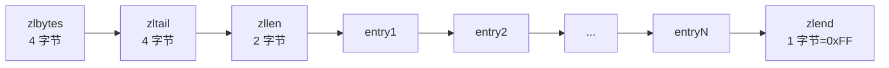
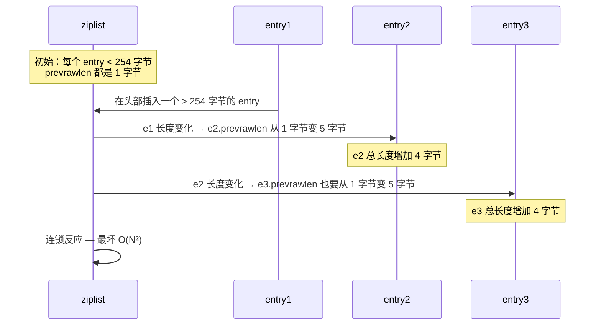

Redis 内部为了在小集合场景下节省内存，自定义了一种紧凑的顺序型结构——**ziplist**（压缩列表）。它被 list、hash、sorted set 在元素数量较少、元素值较小时采用。本文从内存布局入手，逐步剖析其编码原理、性能取舍和著名的"连锁更新"问题。

## 为什么需要 ziplist

普通的双向链表每个节点需要分配独立的内存块，并保存 prev/next 指针（每个指针 8 字节，在 64 位系统上）。如果集合里只有几个、十几个元素，链表的空间开销远大于数据本身——典型的"指针开销 > 实际数据"。

ziplist 的设计目标是**用一段连续的字节数组存储所有元素**，没有指针、内存对齐也尽量紧凑。代价是查找和修改的复杂度从 O(1) 退化到 O(N)，但对小集合而言这是值得的。

## 整体内存布局

ziplist 在内存中是一段连续字节，按顺序划分为以下几部分：

- **zlbytes**（uint32）：整个 ziplist 占用的字节数
- **zltail**（uint32）：到最后一个 entry 的偏移量，便于直接从尾部反向遍历
- **zllen**（uint16）：entry 数量。当实际数量超过 65535 时，此字段被设为 65535（0xFFFF），需要遍历才能得到真实数量
- **entry[]**：若干个 entry，按列表顺序排列
- **zlend**（uint8，常量 0xFF）：ziplist 结束标记

整个结构在内存里就是一段连续字节数组。Redis 在 `list`、`hash`、`zset` 这三种类型的底层会根据元素数量和大小决定是否采用 ziplist（list 还会用 quicklist，但 quicklist 的节点默认也是 ziplist）。

## entry 的三段式编码

每个 entry 由三部分组成：

### prevrawlen（前一个 entry 的字节长度）

为了支持反向遍历，entry 头部保存前一个 entry 的长度。编码采用变长：

- 如果前一长度 < 254，prevrawlen 用 **1 字节**保存
- 否则用 **5 字节**：第一字节为 0xFE，后 4 字节为 uint32

### encoding（当前 entry 的类型与长度）

encoding 也采用变长。Redis 把 entry 分为两类：

**字符串编码**（高 2 位）：
- 00xxxxxx：长度 ≤ 63（6 位），encoding 占 1 字节
- 01xxxxxx xxxxxxxx：长度 ≤ 16383（14 位），encoding 占 2 字节
- 10000000 + 4 字节长度：长度 > 16383，encoding 占 5 字节

**整数编码**（高 2 位 = 11）：
- 11000000：int16
- 11010000：int32
- 11100000：int64
- 11110000：24 位有符号整数
- 11111110：8 位有符号整数
- 1111xxxx：0~12 的小整数（xxxx 直接是值，不用额外字节）

整数编码让常见的小数字（如计数器、评分）直接嵌入 entry，避免额外的字符串存储。

### entry-data

根据 encoding 类型，存储对应的字符串字节或整数值。

## 连锁更新（Cascade Update）

变长编码的设计有一个经典性能陷阱。考虑这样的场景：

当某个 entry 的长度从 < 254 增长到 ≥ 254 时，其 prevrawlen 从 1 字节扩展到 5 字节，导致 entry 整体长度增加 4 字节。这个变化又可能让下一个 entry 的 prevrawlen 跟着扩展……最坏情况下，所有后续 entry 都需要重新分配并复制。

Redis 源码 `ziplist.c` 中的 `__ziplistCascadeUpdate` 函数处理这种情况，时间复杂度是 **O(N²)**，但只有在 entry 长度恰好跨越 254 边界时才会触发，工程上极少见。

## ziplist 与其他编码的转换阈值

Redis 在不同数据结构上对 ziplist 有不同的转换阈值（可通过配置调整）：

- **list-max-ziplist-size**：quicklist 节点中 ziplist 的最大字节数（默认 8KB），或 entry 最大数量（默认 -2 即每节点 2 个元素）
- **hash-max-ziplist-entries**：hash 字段数 ≤ 此值（默认 512）且 value 大小 ≤ hash-max-ziplist-value（默认 64 字节）时使用 ziplist
- **zset-max-ziplist-entries**：sorted set 元素数 ≤ 此值（默认 128）且 member 字节数 ≤ zset-max-ziplist-value（默认 64）时使用 ziplist

一旦超过阈值，Redis 会自动转换为 hashtable（hash）或 skiplist（zset）等常规结构。

## 性能取舍总结

| 维度 | ziplist | hashtable/skiplist |
|---|---|---|
| 内存占用 | 紧凑，连续字节 | 指针 + 桶数组，开销大 |
| 查找复杂度 | O(N) | O(1) / O(log N) |
| 插入删除 | 涉及 memmove | 局部调整 |
| 极端场景 | 连锁更新 O(N²) | 无此问题 |
| 适用规模 | 元素少、值小 | 任意规模 |

Redis 用 ziplist 是用 **CPU 换内存** 的典型实践——在小集合场景下，CPU 的少量浪费可以换来显著的内存节省。在 Redis 这种"内存即成本"的系统里，这个取舍非常合理。

## 参考资料

- 《Redis 设计与实现》—— 黄健宏（[redisbook.com](http://redisbook.com/)）
- Redis 源码 `src/ziplist.c`
- Redis 官方文档：[Memory optimization](https://redis.io/topics/memory-optimization)
