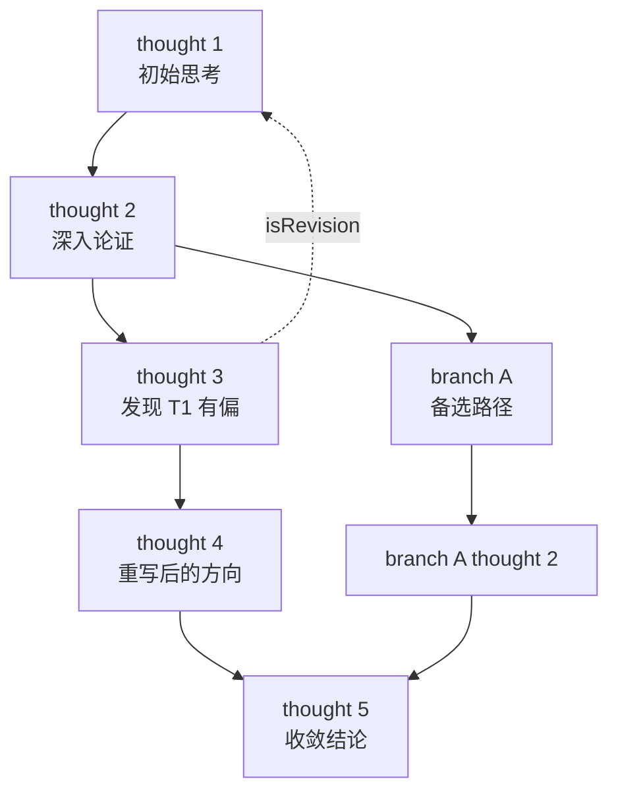

Sequential Thinking MCP 是 Anthropic 官方 [modelcontextprotocol/servers](https://github.com/modelcontextprotocol/servers/tree/main/src/sequentialthinking) 仓库里的一个示范性 server（现已 archived）。它在 Claude 还没有原生 extended thinking 的窗口期承担了一个关键角色——把"思维链"（Chain-of-Thought, CoT）从 prompt 技巧，**外化**成了一个可被工具调用协议观察、干预、编排的对象。今天 Claude 的 thinking block、ReAct 循环、Tree-of-Thoughts 这些已经成为标配的设计模式，都和它解决的问题有直接血缘。

<!--more-->

## 出现的背景

2024 年中之前的 Claude 模型（3 Opus / 3 Sonnet），还没有原生的 extended thinking 能力。如果想让模型"一步步思考"，主流做法是在 prompt 里写一句"Let's think step by step"——也就是依赖模型在生成最终回答前，**自发地**在内部走一遍 CoT。

这种 prompt 形式的 CoT 简单，但做不到三件事：

- **结构化执行**：模型可能偷懒把多个推理步骤压缩成一段，跳过你期望的中间环节
- **可观测**：开发者看不到模型推理的中间过程，只能看到最终回答，无法定位错误出在哪一步
- **外部状态**：CoT 过程只在模型的临时上下文里，外部系统没法持久化、审计、回放

Sequential Thinking MCP 就是为补足这三个能力而设计的。

## 核心机制

整个 server 只暴露一个 tool：`sequentialthinking`。模型每调用一次，就产生一个"思考节点"。

一次调用的关键字段：

```typescript
{
  thought: string,            // 本步思考的文本
  thoughtNumber: number,      // 当前是第几步
  totalThoughts: number,      // 计划总共多少步（可动态调整）
  nextThoughtNeeded: boolean, // 是否需要继续下一步
  isRevision?: boolean,       // 是否在修订之前的某一步
  revisesThought?: number,    // 修订的是哪一步
  branchFromThought?: number, // 分支自哪一步
  branchId?: string,          // 分支标识
  needsMoreThoughts?: boolean
}
```

字段之间的关系大致如下：



注意几个关键设计点：

- `totalThoughts` 是**预期值**，不是硬约束——模型可以在过程中通过 `needsMoreThoughts` 把它调大
- `isRevision` + `revisesThought` 让模型能**显式回头修正**之前的某一步，这是 Self-Refine 模式的工程化
- `branchFromThought` + `branchId` 让模型能**主动分叉**走备选路径，这正是 Tree-of-Thoughts 的简化版
- server 端会保存完整的 thought chain，**每一步的输出对外部都可见**

## 解决的问题

把 CoT 过程从"prompt 里的文字"搬到"tool call 协议的对象"上，Sequential Thinking 一次性给了开发者三件 prompt 形式给不了的东西：

1. **可观测的推理过程**：每一步 thought 的输入和输出都被工具调用日志完整记录，开发者能精准定位"是哪一步开始跑偏"
2. **可干预的执行流**：可以在 server 端加校验，比如某一步的 thought 长度异常、或两步之间的论点自相矛盾，就拒绝继续
3. **可持久化的思维链**：thought chain 落盘后能跨 session 复用、能给人类审计、能作为训练数据回灌

对当时的开发者来说，这意味着第一次能像调试程序一样调试 LLM 的推理过程。

## 退场与遗产

2024 年下半年 Claude 引入 extended thinking，把"分步推理"内化到模型原生能力——Sequential Thinking 这类外部 MCP 的存在空间被立刻压缩。加上它本身就是 MCP 协议的**示范工程**而非生产级工具，被归档是必然。

但它解决的问题，是今天所有主流 agent 设计模式的源头：**CoT** 仍是 prompt 工程的根基；**ReAct** 来自它的"thought + action"两段式；**Reflexion / Self-Refine** 对应 `isRevision` 字段；**Tree-of-Thoughts** 对应 `branchFromThought` 字段；现代 agent runtime（LangGraph、Claude Code 的 tool_use 循环）本质上是把它的 server 端逻辑下沉到了 framework 层。

## 结尾

Sequential Thinking MCP 在今天看，更接近一份**设计宣言**而非一份可生产代码。它告诉我们：

> 当模型缺乏某种能力时，与其寄希望于 prompt 技巧，不如把它做成一个**可观察、可干预、可编排的协议对象**。

这个思路今天仍然成立——任何模型还做不到的事，都可以先做成 MCP server，等模型原生能力跟上后再归档。

它是 MCP 协议时代的一个过渡性 server，但它的设计语言——"让推理过程成为一个一等公民对象"——已经内化进了今天所有主流 agent 框架。
