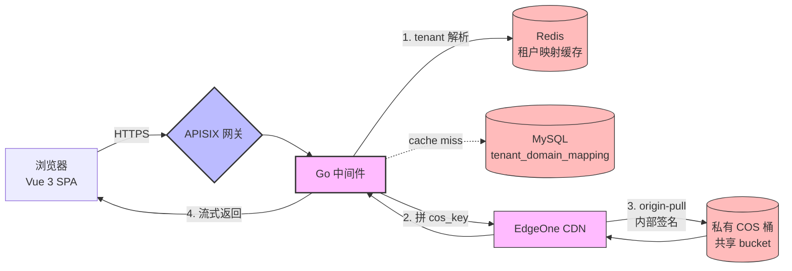
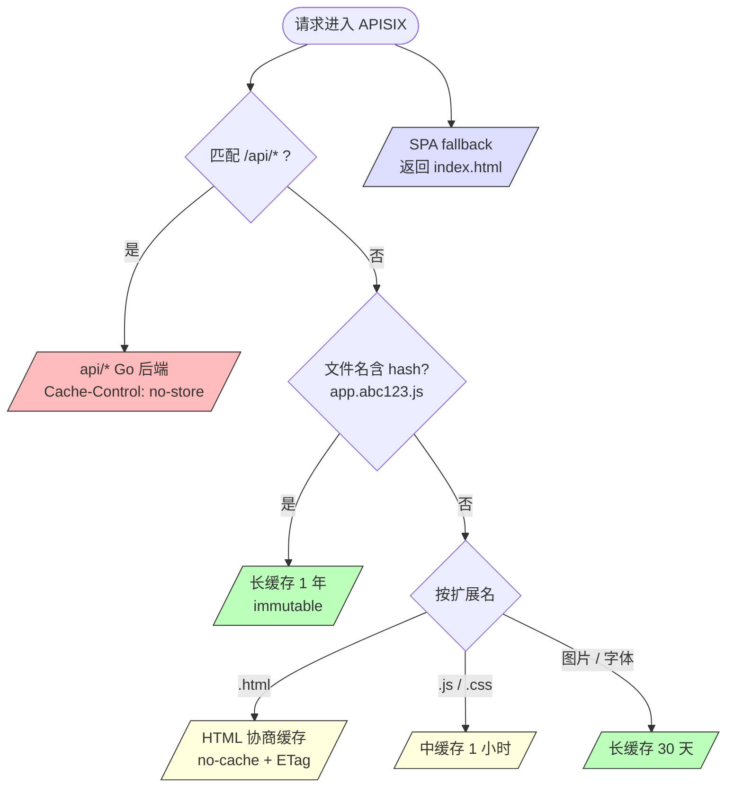
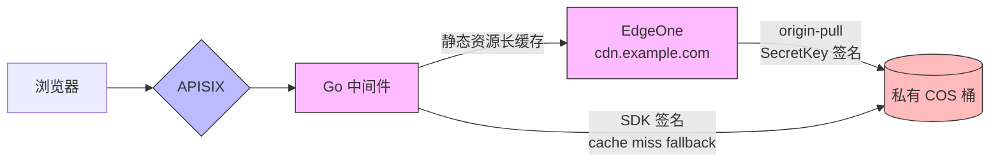
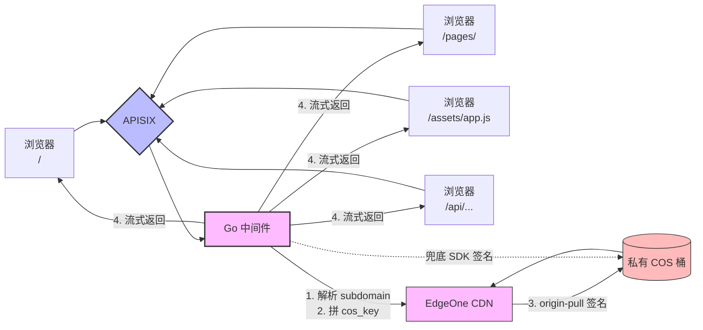
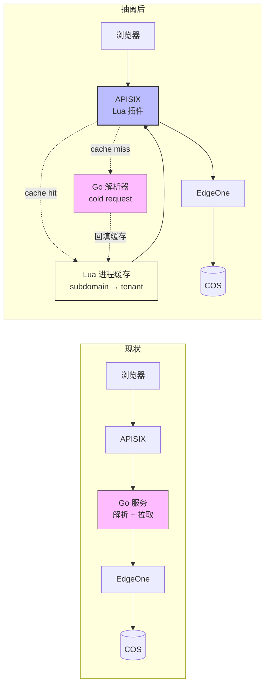

做多租户 SaaS 时，网关是最容易被低估的环节。一个典型的 SPA 帮助中心场景：每个租户有自己的 subdomain、自己的 SPA 资源、私有的内容数据，访问链路涉及 APISIX 网关、Go 中间件、对象存储、CDN。本文从 **私有 COS 桶** 这一前提出发，整理一套完整的、可落地的网关设计方案，文末讨论能否改用公有桶简化架构。

<!--more-->

## 技术栈

| 组件 | 用途 |
|------|------|
| **Vue 3 + Vue Router + Vite** | 前端 SPA，hash 模式路由 + 内容寻址文件名 |
| **APISIX** | 网关层（路由、CORS、限流；无鉴权，所有 URL 公开） |
| **Go 中间件** | 租户解析、COS SDK 签名拉取、API 网关 |
| **EdgeOne** | 私有 COS 桶 origin-pull、长缓存资源 CDN 加速 |
| **Redis** | `subdomain → tenant` 映射缓存（TTL 5min） |
| **MySQL** | `tenant_domain_mapping` 表 + 业务数据 |
| **腾讯云 COS（私有桶）** | SPA 静态资源 + 页面内容，所有租户共享一个 bucket |

## 架构总览



**关键路径**：浏览器 → APISIX → Go（必须，subdomain 解析）→ EdgeOne → COS（私有桶）。EdgeOne 持有 SecretKey 负责签名，Go 服务持有 SecretKey 用 SDK 直接拉取作为 fallback。

## 路由分层

按 URL 模式 + 文件扩展名 + 内容寻址 三维度分流。

| 路由 | 匹配 | 上游 | 缓存策略 |
|------|------|------|---------|
| `*.html` | 后缀 | Go（→ EdgeOne → COS） | `no-cache, must-revalidate` |
| `/assets/*.[hash].js` | hash 文件名 | Go（→ EdgeOne → COS） | `public, max-age=31536000, immutable` |
| `/assets/*.[hash].css` | hash 文件名 | Go（→ EdgeOne → COS） | `public, max-age=31536000, immutable` |
| `*.js` / `*.css`（无 hash） | 后缀 | Go（→ EdgeOne → COS） | `public, max-age=3600` |
| 图片 / 字体 | 后缀 | Go（→ EdgeOne → COS） | `public, max-age=2592000` |
| `/sapi/*`（公开 API） | 前缀 | Go（→ EdgeOne → COS） | `public, max-age=300` 或按业务 |
| `/` 及未匹配路径 | fallback | Go（→ EdgeOne → COS `index.html`） | `no-cache` |

**SPA fallback**：所有未匹配的路径都返回 `index.html`，由 Vue Router 处理客户端路由。

**hash 文件名**：Vite 构建默认输出 `app.a1b2c3.js` 形式，文件名变化即触发新版本，配合 `immutable` 可以安全缓存一年。



## 差异化缓存（RFC 7234）

按 [RFC 7234](https://datatracker.ietf.org/doc/html/rfc7234) 设计缓存策略。

**HTML（短缓存 + ETag 协商）**

```http
Cache-Control: no-cache, must-revalidate
ETag: "<file-hash>"
```

`no-cache` 不是「不缓存」，而是「缓存但必须重新验证」。浏览器每次带 `If-None-Match` 协商，保证新版本可立即生效。

**带 hash 的静态资源（永久缓存）**

```http
Cache-Control: public, max-age=31536000, immutable
```

`immutable` 是关键：告诉浏览器**不要发条件请求**。

**API 响应（不缓存）**

```http
Cache-Control: no-store
```

## 压缩策略

**Brotli 优先，Gzip 兜底**（[RFC 7932](https://datatracker.ietf.org/doc/html/rfc7932)）。

```http
Accept-Encoding: br, gzip
```

| 资源类型 | Brotli 质量 | Gzip 质量 |
|----------|------------|-----------|
| `text/html` | 5（动态） | 6 |
| `text/css` | 11（最高） | 9 |
| `application/javascript` | 11 | 9 |
| `image/svg+xml` | 11 | 9 |
| `image/png,jpeg` | 不压缩 | 不压缩 |

**预压缩优于运行时压缩**：Vite 用 [`vite-plugin-compression`](https://github.com/vbenjs/vite-plugin-compression) 在构建时生成 `.br` / `.gz`，网关直接 serve 避免运行时 CPU 抖动。

## 安全响应头

```http
Content-Security-Policy: default-src 'self'; script-src 'self'; style-src 'self' 'unsafe-inline'; img-src 'self' data: https:; connect-src 'self' https://api.example.com
X-Content-Type-Options: nosniff
X-Frame-Options: DENY
Referrer-Policy: strict-origin-when-cross-origin
Strict-Transport-Security: max-age=63072000; includeSubDomains; preload
```

- **CSP**：根据 Vue 项目用到的源来配，`unsafe-inline` 用 nonce 替代更安全
- **HSTS preload**：在 [hstspreload.org](https://hstspreload.org/) 提交域名
- **`X-Frame-Options` + CSP `frame-ancestors`** 双重防护

## 鉴权策略

**所有 URL 公开可访问，无需鉴权层**。`*.html` / 静态资源 / SPA fallback / `/sapi/*` 都不需要登录。如果未来要加登录态，由前端 Vue Router 守卫处理（跳转 `/login`），不再额外加网关鉴权层。

> 公开是设计选择，不是疏忽。`help.example.com` 类帮助中心内容本身就要对最终用户开放，COS 里存的是渲染好的 HTML / JSON，**没有需要保护的中间数据**。

## 性能优化清单

**传输层**

- HTTP/2（APISIX 默认启用）
- TLS 1.3 + 0-RTT（按需启用）
- TLS Session Resumption

**连接复用**

- APISIX → Go：keepalive 连接池
- Go → EdgeOne：keepalive
- 浏览器 → APISIX：HTTP/2 多路复用

**缓存命中率**

- 长缓存资源走 EdgeOne
- EdgeOne 回源 COS 私有桶（origin-pull 内部签名）

**流式响应**

- 反向代理不解压整 body，`io.Copy` 流式透传

## APISIX 配置示例

```yaml
# SPA fallback：所有未匹配路径由 Go 返回 index.html
- name: spa-fallback
  uri: "/*"
  priority: 1
  upstream:
    nodes:
      - host: go-spa-svc
        port: 8080
  plugins:
    response-rewrite:
      headers:
        Cache-Control: "no-cache, must-revalidate"

# 带 hash 的静态资源
- name: spa-hashed-assets
  uri: "/assets/*"
  priority: 10
  upstream:
    nodes:
      - host: go-spa-svc
        port: 8080
  plugins:
    response-rewrite:
      headers:
        Cache-Control: "public, max-age=31536000, immutable"

# 公开 API（无需鉴权，由 Go 反代到 EdgeOne → COS）
- name: sapi-backend
  uri: "/sapi/*"
  priority: 100
  upstream:
    nodes:
      - host: go-spa-svc
        port: 8080
  plugins:
    limit-req:
      rate: 200
      burst: 400
      key: "remote_addr"
    cors:
      allow_origins: "https://www.example.com"
      allow_methods: "GET,POST,PUT,DELETE,OPTIONS"
    # 注意：没有 jwt-auth，所有 URL 都公开
```

## 私有 COS 桶的 EdgeOne 方案

私有桶必须签名才能访问，APISIX 默认没有签名能力。**最干净的方案是 EdgeOne 套在中间**——同厂商集成最深，EdgeOne 持有 SecretKey，对外是公开 HTTP。



**两种拉取路径**：

- **正常路径**：Go → EdgeOne（CDN 缓存命中，不回源）
- **CDN 缓存未命中**：Go → EdgeOne → COS（EdgeOne 用 SecretKey 签名 origin-pull）
- **EdgeOne 故障 / cache miss 失败**：Go 直接用 SDK 拉 COS（兜底）

### EdgeOne 控制台配置

| 配置项 | 值 | 说明 |
|--------|-----|------|
| 加速域名 | `cdn.example.com` | 暴露给 APISIX/Go 的域名 |
| 源站类型 | **腾讯云 COS** | 同厂商，自动打通 |
| 源站地址 | `example-docs-1250000000.cos.ap-guangzhou.myqcloud.com` | 私有桶 endpoint |
| 源站认证 | **私有 Bucket 访问** | 勾选，填 SecretId / SecretKey |
| 回源 HOST | `example-docs-1250000000.cos.ap-guangzhou.myqcloud.com` | COS 校验的 Host 头 |
| 缓存规则 | 按文件后缀 / 路径 | `*.html` → 5min；`/assets/*.[hash].*` → 30 天 |

### EdgeOne vs 通用 CDN

| 能力 | EdgeOne | 通用 CDN |
|------|---------|---------|
| COS 私有桶 origin-pull | **原生支持**，控制台勾选 | 需 custom origin + 签名 header |
| 跨厂商网络 | 腾讯云内网回源 | 走公网 |
| 安全集成 | 腾讯云 CAM / WAF 无缝 | 各自独立 |

## 实际部署架构：所有 URL 都过 Go

> **核心 invariant**：**每一次**拉取 COS 内容（无论是 SPA HTML、`<id>` 内容、还是静态资源），Go 中间件都必须**先解析 subdomain 拿到租户的 company_id，再拼出 cos_key**，缺一不可。

实际场景是 **Go 中间件在每一个请求路径上**：



### Go 中间件统一 handler

```go
type Tenant struct {
    CompanyID      string `json:"company_id"`
    PathPrefix     string `json:"path_prefix"`      // "/<company_id>/"
    PublishStatus  string `json:"publish_status"`   // "draft" | "published"
}

var (
    sharedCOSClient *cos.Client    // COS SDK client（持有 SecretKey）
    redisClient     *redis.Client
    edgeOneBaseURL  = string = "https://cdn.example.com"
)

func spaMiddleware(db *sql.DB) http.HandlerFunc {
    return func(w http.ResponseWriter, r *http.Request) {
        // 1. 从 Host 提取 subdomain
        subdomain := extractSubdomain(r.Host)

        // 2. tenant 解析（Redis 缓存优先）
        tenant := getTenantCached(ctx, subdomain, db)
        if tenant == nil {
            http.Error(w, "tenant not found", 404)
            return
        }

        // 3. 发布状态门控：draft 状态直接 404，不拉 COS
        if tenant.PublishStatus != "published" {
            http.Error(w, "not published", 404)
            return
        }

        // 4. 拼 cos_key：/company_id + URI
        //    /pages/<id>     → /<company_id>/pages/<id>
        //    /assets/app.js  → /<company_id>/assets/app.js
        cosKey := tenant.PathPrefix + strings.TrimPrefix(r.URL.Path, "/")

        // 5. 优先走 EdgeOne（CDN 缓存命中即返回）
        edgeOneURL := edgeOneBaseURL + cosKey
        if resp, err := fetchEdgeOne(ctx, edgeOneURL); err == nil {
            defer resp.Body.Close()
            copyResponse(w, resp)
            return
        }

        // 6. EdgeOne 失败，SDK 直拉私有 COS 兜底
        obj, err := sharedCOSClient.Object.Get(ctx, sharedBucket, cosKey, nil)
        if err != nil {
            // SPA fallback：返回 tenant 的 index.html
            obj, err = sharedCOSClient.Object.Get(ctx, sharedBucket,
                tenant.PathPrefix+"index.html", nil)
            if err != nil {
                http.Error(w, "not found", 404)
                return
            }
        }
        defer obj.Body.Close()

        copyCOSObject(w, obj)
    }
}

func getTenantCached(ctx context.Context, subdomain string, db *sql.DB) *Tenant {
    cacheKey := "tenant:" + subdomain

    // 1. 查 Redis
    if data, err := redisClient.Get(ctx, cacheKey).Bytes(); err == nil {
        var t Tenant
        if json.Unmarshal(data, &t) == nil {
            return &t
        }
    }

    // 2. 缓存未命中，查 MySQL
    var t Tenant
    err := db.QueryRow(`
        SELECT company_id, path_prefix, publish_status
        FROM tenant_domain_mapping
        WHERE subdomain = $1 AND status = 'active'
    `, subdomain).Scan(&t.CompanyID, &t.PathPrefix, &t.PublishStatus)
    if err != nil {
        return nil
    }

    // 3. 写回 Redis（TTL 5min）
    if data, err := json.Marshal(&t); err == nil {
        redisClient.Set(ctx, cacheKey, data, 5*time.Minute)
    }
    return &t
}
```

### MySQL 表设计

```sql
CREATE TABLE tenant_domain_mapping (
    id              BIGINT PRIMARY KEY AUTO_INCREMENT,
    subdomain       VARCHAR(64) NOT NULL UNIQUE,
    company_id      VARCHAR(32) NOT NULL,
    path_prefix     VARCHAR(128) NOT NULL COMMENT '/<company_id>/',
    status          ENUM('active', 'disabled') NOT NULL DEFAULT 'active'
                    COMMENT 'subdomain 是否启用',
    publish_status   ENUM('draft', 'published') NOT NULL DEFAULT 'draft'
                    COMMENT '租户资源是否已发布',
    published_at    DATETIME NULL COMMENT '发布时间',
    created_at      DATETIME NOT NULL DEFAULT CURRENT_TIMESTAMP,
    updated_at      DATETIME NOT NULL DEFAULT CURRENT_TIMESTAMP ON UPDATE CURRENT_TIMESTAMP,
    INDEX idx_company_id (company_id),
    INDEX idx_status (status),
    INDEX idx_publish_status (publish_status)
) ENGINE=InnoDB DEFAULT CHARSET=utf8mb4;
```

**`publish_status` 是公有桶方案下防「未发布内容被 URL 访问」的关键**：

- 即使对象已经传到 `public-bucket`（CI/CD 自动发布），Go 端在拼完 cos_key 后会再查一次 `publish_status`
- `publish_status = 'draft'` → **返回 404**，不拉对象
- `publish_status = 'published'` → 正常拉取
- `published_at` 时间戳可作为发布审计

发布动作（CI/CD 或后台管理）：

```sql
UPDATE tenant_domain_mapping
SET publish_status = 'published', published_at = NOW()
WHERE subdomain = ?;
```

### 缓存策略

| 数据 | 缓存位置 | TTL | 命中率 | 作用 |
|------|---------|-----|--------|------|
| `subdomain → tenant` | Redis | 5min | ~99% | 租户映射极少变 |

**简单性 = 优势**：单层 Redis，逻辑清晰，命中率足够高。

### 私有桶签名的天然好处

Go 服务在请求路径上，**SecretKey 放在 Go 服务配置里最合理**——比 APISIX Lua 安全得多（Lua 配置容易被错误地打到日志里）。

Go 用 COS SDK 自动签名（HMAC-SHA1、StringToSign、CanonicalRequest 全部封装好了），不需要手写签名算法。

**结论**：**私有桶 + Go 在中间层 = 最自然的组合**。

## 抽离 COS 拉取：Go 退化成解析器

当前架构 Go 在每个请求路径上——**这是演进起点**，不是终态。当 Go 服务成为瓶颈时，可以把 COS 拉取从 Go 剥出去：



**演进步骤**：

1. 把 Go 服务拆成两个 endpoint：
   - `GET /resolve?host=...` → 返回 `company_id` / `path_prefix`（**轻**，只查 Redis/DB）
   - `GET /proxy?path=...` → COS 拉取 + 流式返回（**重**，现网方案）
2. APISIX 加 Lua 插件：进程内 LRU 缓存 + cache miss 时回调 `/resolve`
3. APISIX route upstream 改为 `cdn.example.com`（EdgeOne），Lua 拼 cos_key 通过 `ngx.var.upstream_uri` 重写
4. Go `/proxy` endpoint 保留作为 fallback，CDN 故障时启用
5. `/resolve` 长期保留，是权限 / 业务 API 的入口

**Lua 插件骨架**（仅展示核心逻辑）：

```lua
function _M.rewrite(conf, ctx)
    local tenant = cache_get("tenant:" .. ngx.var.host)  -- L1 进程内
    if not tenant then
        local res = http_get(conf.resolver_url .. "?host=" .. ngx.var.host)  -- L2 Go
        tenant = cjson.decode(res)
        cache_set("tenant:" .. ngx.var.host, tenant, 60)
    end
    ngx.var.upstream_uri = tenant.path_prefix .. ngx.var.uri:sub(2)
end
```

**何时做这次演进**：

| 触发条件 | 演进收益 |
|---------|---------|
| Go 服务 QPS 上限 / CPU 持续高水位 | 省掉 Go 进程固定开销 |
| 边缘延迟敏感（首屏 < 200ms 需求）| Lua 比 Go 进程少 1-3ms |
| 业务要加鉴权（JWT / Session）| Lua 插件做边缘鉴权比 Go 改造成本低 |

**没有演进动力的现状下不必做**：当前 Go 中间层方案已经能扛住大多数 SaaS 帮助中心的流量。**过早优化是万恶之源**。

## 私有桶 vs 公有桶

文章主体用的是私有 COS 桶方案，但**你这个场景（公开 + UUID + 多租户 + 无敏感数据）用公有桶完全可行**，甚至更优。

### 场景特征决定桶的选择

| 特征 | 你的情况 | 桶选择的影响 |
|------|---------|-------------|
| 访问是否需登录 | 公开 | 私有桶的「保护」无意义 |
| 是否多租户 | 是 | 路径隔离足够（UUID 不可枚举）|
| 页面 ID 形式 | UUID（128 bit）| 公有权风险也不存在 |
| COS 用途 | 减 DB 压力 | 不是安全边界 |
| 数据敏感性 | 无 PII | 私有桶合规价值不成立 |

### 什么时候必须用私有桶

- 内容需登录（客户专属文档）
- 含 PII / 敏感数据
- 付费内容（知识付费、企业内训）
- 内部草稿（未发布）
- 行业合规要求（金融、医疗）

### 结论

**先用公有桶跑起来**——配置简单、运维负担低、UUID 路径隔离足够。同时在 Go 服务和 MySQL 设计上**为私有桶预留扩展点**（cos_key 拼接逻辑抽象、schema 不绑定桶类型）。业务一旦要收紧（登录、付费、合规），半天就能切到私有桶，不需要重写。

**本文的私有桶方案不是冗余**——它是演进路径上的安全垫：抗 CDN 故障、内容权限管理更细（MySQL + RBAC）、可平滑升级到鉴权场景。

## 参考资料

- [RFC 7234 - HTTP/1.1 Caching](https://datatracker.ietf.org/doc/html/rfc7234)
- [RFC 7932 - Brotli Compressed Data Format](https://datatracker.ietf.org/doc/html/rfc7932)
- [APISIX 官方文档](https://apisix.apache.org/docs/apisix/getting-started/)
- [APISIX limit-req 插件](https://apisix.apache.org/docs/apisix/plugins/limit-req/)
- [EdgeOne 私有 Bucket 访问](https://cloud.tencent.com/document/product/1552/101227)
- [腾讯云 COS Go SDK](https://github.com/tencentyun/cos-go-sdk-v5)
- [Vite 官方文档](https://cn.vitejs.dev/)
- [Vue Router](https://router.vuejs.org/zh/)
- [Web Fundamentals - HTTP Cache](https://web.dev/articles/http-cache)
- [HSTS Preload List](https://hstspreload.org/)