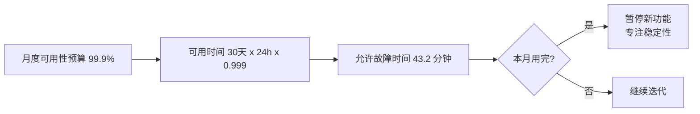

上一篇（[《SRE》读书笔记：SLI 与 SLO](/2023/11/sre-sli-slo-reading-notes/)）聊了 SLI/SLO 的概念，这篇继续聊 SRE 的另外两个核心实践：**错误预算（Error Budget）** 和 **事后总结（Postmortem）**。这两个实践一起，把"故障"从追责对象变成了改进机会。

<!--more-->

## 错误预算：可靠性的"预算"

错误预算（Error Budget）就是把 SLO 中的"容错空间"具象化为一种"预算"。

如果一个服务的 SLO 是 99.9% 可用性，那么每月允许 0.1% 的不可用时间——这就是错误预算。



错误预算的核心思想：**可靠性不是越多越好，而是要平衡**。

如果一个服务长期达到 99.99% 的可用性，那意味着 SLO 定得太松——它本来可以承担更多风险（释放可靠性预算）换取迭代速度。

## 错误预算的三种用途

错误预算用完，团队该怎么办？Google 给出了三种选择：

**1. 把预算转移给工程效率**

如果产品方抱怨"新功能上线太慢"，团队可以说："SLO 还有 80% 预算，我们可以多做一些改动。"——这是在用可靠性预算买工程速度。

**2. 把预算转移给新功能**

如果市场方要求"尽快上线新功能"，团队可以同意，但同时声明："本月 SLO 预算只能承受 X 次故障，请谨慎。"

**3. 把预算用于稳定性改进**

如果某个团队反复出事故，团队负责人可以说："本月预算已耗尽 50%，暂停新功能，集中精力解决稳定性问题。"

## 错误预算的真实案例

Google 内部有一个真实案例：

某次重大的 Gmail 故障，几个小时的服务降级。当时 Gmail 的 SLO 是 99.9%，按月度计算还有较多预算。但 Google 决定**用掉所有剩余预算**——让所有涉及 Gmail 的团队暂停新功能，集中精力做根因分析和改进。

这个决策的本质是：**故障是宝贵的"学习机会"，不要把预算用光才后悔**。

## 事后总结：把故障变成改进机会

SRE 的另一个核心实践是**事后总结（Postmortem）**——对每一次重大故障进行系统性复盘。

但 Google 的 Postmortem 有几个关键特征：

**1. 无指责文化（Blame-free）**

Postmortem 不是追责大会。它的目的是**理解发生了什么、为什么发生、如何防止再次发生**——而不是追究"谁的错"。

为什么无指责？因为追究个人责任会带来一系列副作用：
- 人们隐瞒问题，避免被发现
- 人们不愿分享失败的实验
- 人们不愿意做有挑战性的工作
- 团队心理压力大，合作意愿下降

**2. 关注系统，不是个人**

错误的发生往往是系统性问题——比如流程缺失、文档不完善、工具不支持、培训不到位。把责任推到个人，会掩盖真正的根因。

正确的问题不是"谁搞坏了？"，而是"为什么我们的系统让这种事情能发生？"

**3. 公开透明**

Postmortem 文档在公司内部公开。任何人都可以查阅、学习、提问。

这有两个好处：
- 知识扩散：避免下次同样问题在另一个团队重演
- 心理建设：人们看到"这么牛的团队也犯过这种错"，心理负担减轻

## 一份典型的 Postmortem 文档

```markdown
# 故障总结：Gmail 推送延迟（2024-08-15）

## 时间线
- 14:23 监控报警：推送延迟 P99 突破阈值
- 14:25 on-call 工程师响应
- 14:30 确认是 Kafka 消费组 rebalance 导致
- 14:45 应用 patch 增加消费组副本
- 15:10 服务恢复正常

## 影响
- 推送延迟平均增加 8 分钟
- 涉及 2.3 亿用户（约 30% 用户）
- SLO 预算消耗：本月 30%

## 根因
新部署的 Kafka 消费者配置错误，导致单分区在故障转移时被锁住。

## 为什么没提前发现
- 部署前的压测只覆盖了正常流量，没模拟故障转移
- 监控告警阈值设置过宽，第一次报警时已发生 5 分钟

## 改进措施
1. 增加故障转移场景的自动化测试
2. 收紧 P99 延迟告警阈值
3. Kafka 部署流程增加配置验证步骤
4. 准备回滚 playbook
```

## Postmortem 的心理价值

很多人以为 Postmortem 只是工程实践，但它有巨大的心理价值。

当团队成员犯了错：
- 责备文化 → 心理压力、隐瞒问题
- 学习文化 → 心理安全、主动报告

Google 的实践表明：**心理安全感越高的团队，事故发现得越早，损失越小**。

为什么？因为当人们不怕被责备时，会主动报告"我看到一个问题"——而这些问题往往是大事故的早期信号。

## 给我最大的启发

读 SRE 这一章，我开始尝试在自己的团队里建立类似实践：

1. **每个事故都写 Postmortem**：哪怕是 5 分钟的小故障
2. **避免指责**：用"我们的系统哪里有问题"代替"谁犯了错"
3. **文档公开**：让团队成员都能查阅所有 Postmortem
4. **聚焦改进措施**：每篇 Postmortem 必须列出可执行的改进项
5. **跟踪改进**：改进项必须有人 owner、有 deadline

这种实践改变的不仅是流程，更是**团队文化**。

## 一个反直觉的发现

**事故越多（被记录的），组织越健康**。

如果一个团队声称"我们从来没出过事故"，最可能的原因是：
- 事故被隐瞒了
- 监控不到位，问题没被发现
- 团队害怕报告问题

相反，**一个不断有事故记录、不断有 Postmortem、不断有改进的团队，才是真正成熟的团队**。

## 推荐阅读

- Google《Site Reliability Engineering》第 3 章（消除琐事）、第 6 章（监控）、第 7 章（紧急响应）、第 11 章（Postmortem）
- Google《The Site Reliability Workbook》—— 配套实践
- Etsy《Debriefing Facilitation Guide》—— 怎么主持无指责复盘会议

SRE 是一套完整的"可靠性工程"实践。SLI/SLO、错误预算、Postmortem、消除琐事、On-call 轮值……每一项都值得深入学习。但最根本的是它的思维方式：**把可靠性当成工程问题，而不是人品问题**。

## 补充：微信读书里我划过的句子

> 只要仍然有剩余的错误预算，就可以发布新的版本。

这句话是错误预算机制的精华。**预算的本质是"风险配额"**——团队可以在配额内承担合理的风险（发布新功能、尝试新设计），但用完了就停下来修复。

我后来把这种思路迁移到团队管理：**给团队"错误预算"也是管理的一种艺术**。如果追求"零错误"，团队会变得保守、不敢尝试；如果允许合理的错误，并把这些错误变成学习机会，团队反而更有活力。

另一句关于过载保护：

> 我们的任务过载保护是基于资源利用率（utilization）实现的。

这一句体现了 SRE 的工程化思维——**基于客观指标，而不是主观感受**。当 CPU 利用率、内存使用、磁盘 IO 等指标接近阈值时，系统主动降级或拒绝请求，而不是等到请求堆积、用户报障才反应过来。

**预先保护** vs **事后修复**，是 SRE 系统和传统系统的根本差异。
