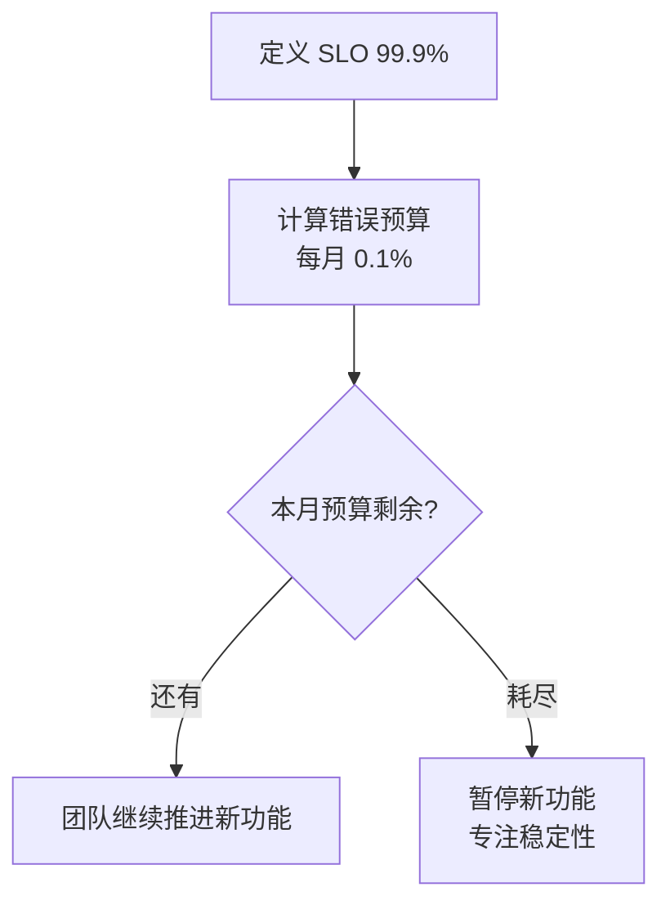

Google 的 SRE 团队在 2016 年公开了《Site Reliability Engineering》（《SRE：Google 运维解密》），这本书影响了过去十年整个互联网行业的运维实践。它的核心思想是**用工程化的方法解决可靠性问题**，而不是用"运维人员加班"。

这一篇主要聊聊 SLI/SLO 这两个核心概念。

<!--more-->

## 传统的"运维"思维的局限

传统运维的核心 KPI 是"系统可用率 99.9%"——但这个数字背后隐藏着很多问题：

- **不可测量**：可用率怎么算？按天？按小时？按请求数？
- **不可执行**：99.9% 听起来挺好，怎么达到？
- **不可优化**：做不到 100%，是因为什么？不知道。

SRE 的核心洞见是：**把抽象的"可用性"变成可测量的指标，把可靠性和工程效率挂钩**。

## SLI：服务等级指标

SLI（Service Level Indicator）是服务的**量化健康指标**。常见的 SLI 有：

- 请求延迟（latency）：P50、P95、P99
- 错误率（error rate）：HTTP 5xx 占比
- 吞吐量（throughput）：QPS
- 可用性（availability）：成功请求 / 总请求

选择 SLI 的关键是：**站在用户角度**。

不是"机器 CPU 占用率"，而是"用户实际感受到的响应时间"。不是"数据库连接数"，而是"用户实际看到的页面加载完成时间"。

Google 给出了一个 SLI 公式：**好事件 / 总事件**。

举例：
- 可用性 SLI：2xx 请求数 / 总请求数
- 延迟 SLI：< 100ms 的请求数 / 总请求数

这种简单明确的定义让指标可以随时计算、随时报警、随时优化。

## SLO：服务等级目标

SLO（Service Level Objective）是 SLI 的**目标值**。

例如：
- 可用性 SLO：99.9%（99.9% 的请求必须成功）
- 延迟 SLO：P99 < 200ms（99% 的请求必须在 200ms 内完成）

SLO 是团队对用户的**承诺**。一旦设定，就要在合理时间内达到。

## 关键洞见：不要追求 100%

SRE 一个最重要的反直觉论点是：**不要追求 100% 的可靠性**。

理由：

1. **100% 太贵**：最后那 0.001% 的可靠性可能需要 10 倍成本
2. **100% 不可能**：复杂系统总有失败模式
3. **过度可靠降低效率**：把所有精力放在可靠性上，就没法做新功能

Google 用 SLO 平衡可靠性和迭代速度。当可靠性达到目标，团队就可以"放飞自我"做新功能；当可靠性低于目标，团队就要暂停新功能，把工程资源投到稳定性上。

## 错误预算：错误的空间

基于 SLO，SRE 提出了"错误预算"（Error Budget）的概念。

如果 SLO 是 99.9%，那每个月允许的错误率是 0.1%——这就是"错误预算"。你可以用掉它（用 0.2% 的错误率），但超过就要"还债"（暂停新功能，集中精力提升可靠性）。

错误预算是 SRE 给工程管理最大的礼物。它把"可靠性"和"开发速度"变成了同一个硬币的两面，而不是对立。

## SLO 文档：团队对齐

SRE 强调把 SLO 写成文档，让所有相关方对齐。SLO 文档应该包含：

1. **服务描述**：这个服务做什么
2. **关键用户旅程**：用户在服务里做什么
3. **SLI 定义**：用什么指标衡量健康度
4. **SLO 目标值**：当前的目标是什么
5. **测量方法**：如何计算 SLI
6. **报警规则**：什么时候报警

写 SLO 文档的过程本身就很有价值——它强迫团队思考"我们的服务到底在衡量什么"。

## 一个常见误区：SLO ≠ SLA

容易混淆的概念：

- **SLO（Service Level Objective）**：内部目标，团队自己设定、自己追踪
- **SLA（Service Level Agreement）**：外部承诺，写在合同里，达不到要赔偿

SLA 通常比 SLO 严格。例如 SLO 是 99.9%，SLA 可能写成 99.5%——这样即使内部不达标，外部承诺还能维持。

## 我学到的实践

把 SLO 思维引入团队后，我开始做几件事：

1. **每个核心服务定义 SLO**：哪怕是 99% 也比没有好
2. **SLO 上看板**：让团队成员随时看到当前 SLO 状态
3. **错误预算纳入规划**：月初看预算，预算紧张就放慢节奏
4. **SLO 报警**：预算耗尽 50%、80%、100% 时分别报警
5. **SLO 复盘**：每季度复盘 SLO 是否合理，是否需要调整

## 一个跨行业的迁移思考

SLO 思维不只适用于互联网服务。它可以迁移到任何需要"可靠性 vs 速度"权衡的场景：

- 银行核心系统：可用性 SLO 99.99%，新功能上线要谨慎
- 内容创作工具：可用性 SLO 99%，可以更快迭代
- 内部管理系统：可用性 SLO 95%，可以容忍偶尔宕机

## 给我最大的启发

读 SRE 这一章我最大的收获是：**可靠性是可以工程化、可以量化、可以管理的**。

过去我们以为"可靠性"是一种"品质"——要么系统稳定，要么不稳定。SRE 告诉我们**可靠性是一个可以持续优化的指标**，它可以被分解、被测量、被管理。

这种思维转变比任何具体技术都重要。当我们把可靠性当成工程问题，它就变成了可解决的问题。

## 补充：微信读书里我划过的句子

> 只要仍然有剩余的错误预算，就可以发布新的版本。

这一句非常直接地表达了错误预算的精髓——**它不是惩罚，而是约束**。只要预算没用完，就有空间去做新功能。这把"可靠性"和"开发速度"放在了同一个天平上。

另一句关于过载保护：

> 我们的任务过载保护是基于资源利用率（utilization）实现的。

Google 的过载保护不是基于"请求数"或"队列长度"——而是基于资源利用率。这避免了"打满 CPU 但内存还有空余"这种浪费情况。**过载保护的本质是"硬件资源成为瓶颈时才触发"，而不是"请求堆积"**。这种思路让保护更精准、更高效。

虽然只有两句话，但每一句都体现了 SRE 的核心思想：**用工程化方法解决可靠性问题，让数据驱动决策**。

## 推荐阅读

- Google《Site Reliability Engineering》—— 原始经典
- Google《The Site Reliability Workbook》—— 配套实践指南
- Alex Hidalgo《Implementing Service Level Objectives》—— 更现代的实践视角

SRE 是一套完整的体系，SLI/SLO 只是入口。后续还有很多概念：错误预算、事后总结、消除琐事、On-call 轮值……每一样都值得深入学习。
