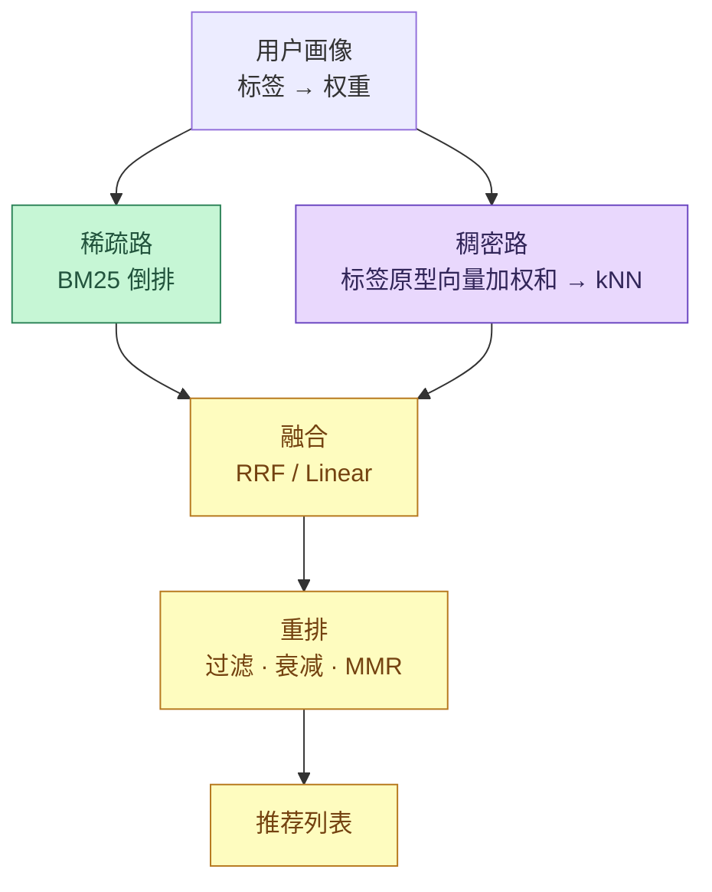
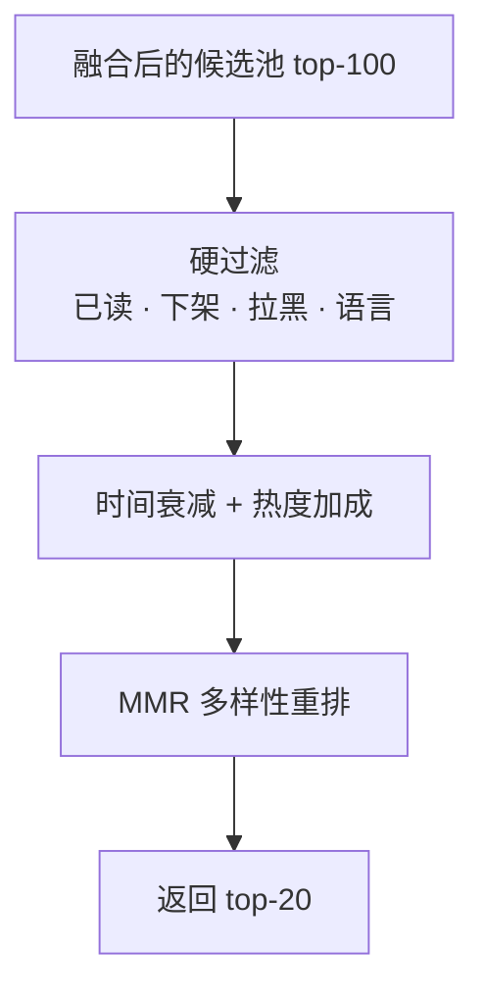
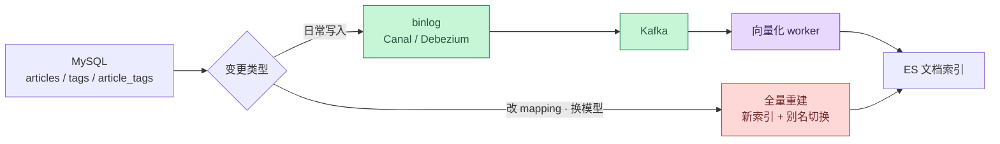
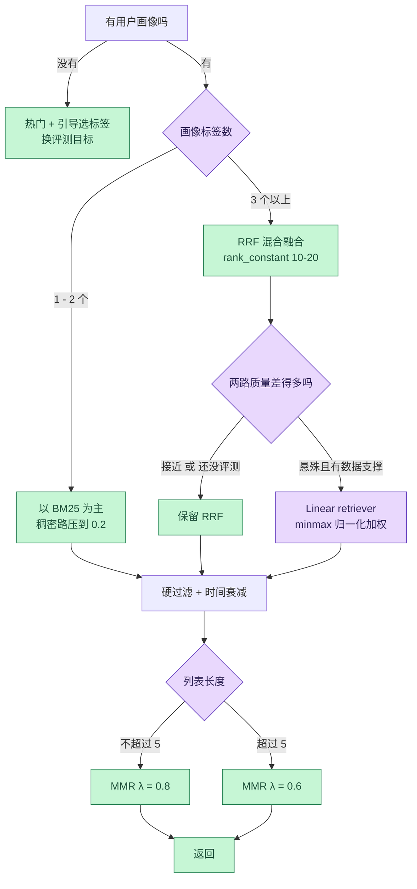

一句话先放在前面：**BM25 负责字面命中，向量检索负责意思相近，而标签推荐需要两者同时在场。**

用户画像里写着「MySQL」，内容标签里写着「关系型数据库」，倒排索引里找不到一个共同的词，字面匹配的召回是零。反过来，一个新用户只选了一个「MySQL」，纯向量检索会围绕这一个点向四周扩散，把「跟 MySQL 沾边的所有东西」都推给他——因为它不知道他不感兴趣什么。

这两个缺口方向相反，而且不是把 embedding 模型换大就能补上的。标签推荐看起来像推荐问题，拆开之后其实是一个标准的检索问题：用户画像是 query，内容是 document，剩下的全是信息检索的老问题。

下面按这个视角从头推一遍：先说清标签推荐真正在算什么，再把稀疏路和稠密路各自的失效模式拆开，然后讲融合——为什么默认不用加权求和、RRF 的参数该怎么取，最后落到重排、数据链路、评测和容量估算。

<!--more-->

## 一、概念底座：标签推荐到底在算什么

### 1.1 三个对象和一个打分函数

抛开业务名词，这套系统只有三个东西：

- **内容侧**：文档 `d`，带一个标签集合 `T(d) = {t₁, t₂, …}`
- **用户侧**：用户 `u`，带一张标签权重表 `W(u) = {t → w}`
- **目标**：为每个 `u` 产出一个按相关性降序的文档列表

写成函数：

```
score(u, d) = f( T(d), W(u), context )
```

新手最容易把它简化成集合交集的大小 `|T(d) ∩ supp(W(u))|`。这个写法在 demo 里跑得通，但它默认了三件不成立的事：

1. **字面相同就等于语义相同**。实际有大量同义词、缩写、中英混写：`k8s` 和 `Kubernetes`、`大模型` 和 `LLM`、`ES` 和 `Elasticsearch`。
2. **字面不同就等于语义不同**。`MySQL` 和 `关系型数据库` 在业务上高度相关，在字符层面毫无关系。
3. **标签只有「有」和「没有」**。用户对一个标签的偏好是有强度的，而且会随时间变化。

第一、二条是召回问题，第三条是排序问题。混合检索只解决前两条——这一点必须先说清楚，否则很容易误以为上了向量检索就什么都好了。

### 1.2 标签分布是幂律的，这决定了所有取舍

真实语料里的标签分布几乎一定是长尾：少数标签覆盖大部分文档，大部分标签只覆盖极少文档。粗略可以分成三段，它们的性质完全相反：

| 分段 | 特征 | IDF | 对召回的贡献 |
|---|---|---|---|
| 头部（平台型标签） | 如「后端」「AI」，半数以上文档都有 | 极低，接近 1 | 几乎没有区分度，命中了也排不出序 |
| 腰部（技术栈标签） | 如「MySQL」「Redis」，覆盖若干篇 | 中等 | 主力，是精确匹配最该发力的地方 |
| 长尾（具体标签） | 如「MySQL 8.0 复制延迟」，可能只有几篇 | 很高 | 一命中就能把文档顶到前排，但共现太稀疏 |

这张表带出两个反直觉的结论。

**第一，只靠标签匹配，推荐结果会自然退化成「帮我找热门」。** 因为能覆盖足够多文档的只有头部标签，而头部标签的 IDF 接近 1，谁命中和不命中都一样。列表看起来有内容，实际是把热门清单换了个说法。

**第二，冷门标签反而更珍贵。** 很多人下意识觉得热门标签更「准」，但在 BM25 的框架里恰恰相反：长尾标签的 IDF 高，一次命中就能带来很大的分数增量。这一点后面会展开——它正是 BM25 在这类场景里难以被向量检索取代的原因。

### 1.3 把推荐改写成检索

做一次视角转换，后面所有决定都会自然起来：

```
query    = 用户画像 W(u)          （可能加上当前上下文）
document = T(d) + title + body    （内容侧的全部文本）
```

一旦这么写，可选的工具就确定了：召回用倒排和 ANN，排序用 BM25 和余弦，融合用 RRF 或加权求和，评测用 Recall@K、MRR、nDCG。整套东西不需要重新发明。

总体的骨架就是两路召回加一个融合：



两路并行，各自取一批候选，融合之后再重排。下面把每一段拆开讲。

## 二、稀疏路：BM25 和标签字段设计

### 2.1 一个 tags 字段要同时充当三种东西

标签在查询里会被当成三种不同的对象使用：精确过滤（`term`）、聚合分面（`terms agg`）、模糊匹配（分词后的 BM25）。用一个字段兼顾，靠的是 `multi-field`：

```json
PUT /knowledge
{
  "settings": {
    "analysis": {
      "filter": {
        "tag_synonyms": {
          "type": "synonym_graph",
          "synonyms_path": "analysis/tag_synonyms.txt",
          "updateable": true
        }
      },
      "analyzer": {
        "tag_index": { "type": "custom", "tokenizer": "ik_max_word" },
        "tag_search": {
          "type": "custom",
          "tokenizer": "ik_smart",
          "filter": ["lowercase", "tag_synonyms"]
        }
      }
    }
  },
  "mappings": {
    "properties": {
      "tags": {
        "type": "keyword",
        "normalizer": "lowercase",
        "fields": {
          "text": {
            "type": "text",
            "analyzer": "tag_index",
            "search_analyzer": "tag_search"
          }
        }
      },
      "title": { "type": "text", "analyzer": "ik_max_word" },
      "doc_vector": {
        "type": "dense_vector",
        "dims": 1024,
        "index": true,
        "similarity": "cosine",
        "index_options": { "type": "int8_hnsw", "m": 16, "ef_construction": 100 }
      },
      "status": { "type": "keyword" }
    }
  }
}
```

几个设计点值得单独说明。

**主字段用 `keyword` + `normalizer`，而不是 `text`。** 标签是精确值，`term` 比 `match` 快，也不会出现「MySQL 被分词成 mysql 之后匹配不上」的麻烦。`normalizer` 负责大小写折叠，让 `MySQL` 和 `mysql` 归一到同一个值。

**`normalizer` 里放不了同义词，这是硬约束。** normalizer 只允许字符级 filter 和 `lowercase`、`asciifolding` 等少数几个 token filter，`synonym` 不在名单里。所以同义词必须放在 `tags.text` 子字段的 search analyzer 上。

**同义词要用 `synonym_graph` 且只在搜索侧生效。** `synonym_graph` 不能用于索引时的 analyzer，只能用于 search analyzer，因为它在建索引阶段会产生位置图，破坏短语查询。把同义词放在搜索侧，还有一个额外好处：改同义词表不需要重建索引，`updateable: true` 配合 `_reload_search_analyzers` 就能热加载。

**中文分词需要额外装插件。** `ik_max_word` / `ik_smart` 来自 IK 分词插件，默认发行版里没有；不想装插件的话可以用 `smartcn`，或者自己用词典方案切分。

### 2.2 同义词表就是标签归一化表

同义词文件在这里承担的其实是「标签归一化」的职责。一张够用的表通常只包含三类映射：

```
# 中文与英文
大模型, 大语言模型, llm, large language model
数据库, database
关系型数据库, rdbms, 关系数据库

# 缩写与全称
k8s, kubernetes, 容器编排
es, elasticsearch

# 版本与产品变体
mysql, mariadb
```

第三类的判断要谨慎。`mysql` 和 `mariadb` 在检索语境里可以算同族，但如果标签体系本身把它们分开管理，加同义词反而会污染画像——用户关注 MySQL 不代表他关注 MariaDB。**同义词表宁窄勿宽，只在「字面不同但业务上指同一件事」时才加。**

上下位关系（`数据库 > 关系型数据库 > MySQL`）不要塞进同义词表。同义词是双向等价的，上下位是单向的，混在一起会让召回变得不可控。上下位关系更适合在应用层做标签权重传播：用户标了「MySQL」，可以给他补一个权重乘了 0.3 的「数据库」。

### 2.3 查询构造

最简单的写法是 `terms`：

```json
{ "terms": { "tags": ["mysql", "kubernetes"] } }
```

它能召回，但会退化，原因有三个：所有标签权重相同、命中几个标签完全不进分数（`terms` 是常量评分）、只有标签参与匹配。换成加权 BM25：

```json
{
  "query": {
    "bool": {
      "should": [
        { "match": { "tags.text": { "query": "mysql",      "boost": 3.0 } } },
        { "match": { "tags.text": { "query": "kubernetes", "boost": 1.5 } } },
        { "match": { "title":     { "query": "mysql kubernetes", "boost": 1.0 } } }
      ],
      "minimum_should_match": 1
    }
  }
}
```

这里的 `boost` 直接取用户画像里归一化之后的标签权重。命中两个标签的文档会同时拿到两份分数，这是 `terms` 给不了的。

### 2.4 BM25 的两个真实边界

**边界一：它对标签的层级和顺序完全无感。** BM25 是词袋模型，`数据库` 和 `MySQL` 之间的关系它看不见，只能靠同义词表和权重传播人工铺平。这意味着词表维护是一项长期成本——只要标签体系在演进，这张表就得跟着改。

**边界二：IDF 是全局统计量，所以 BM25 天然偏爱长尾精确匹配。** 这一点经常被说反。头部标签的 IDF 低，命中了也拿不到多少分；长尾标签的 IDF 高，一次命中就能把文档推上去。而「用户精确表达了某个具体兴趣」正是标签推荐最有价值的场景。

所以结论要说得更明确一些：**在「用户标签与内容标签字面相同」这个子问题上，BM25 基本是最优解，向量检索赢不了它。** 稠密路的价值在别处。

## 三、稠密路：把标签变成向量

### 3.1 文档向量怎么来

编码输入决定向量质量，成本差异很大：

| 编码输入 | 成本 | 语义覆盖 |
|---|---|---|
| 只用标签拼接 | 最低，标签变化时才重算 | 只有标签词汇本身，向量几乎等于标签名字的平均 |
| 标签 + 标题 | 低 | 多一层上下文，能区分同名标签的不同用法 |
| 标题 + 摘要 + 标签（加权拼接） | 中 | 最好，但长文本要截断，截断位置会影响结果 |

有个便宜的小技巧：**把标签在待编码文本里重复两次再拼接**。这等于给标签维度加权，又完全不用改模型结构。对「标签比正文更能代表文档主题」的语料，效果立竿见影。

维度选择上，1024 维（bge-m3、e5-large 这一档）是当前通用型的中位选择，768 维省内存，1536 维以上只有在领域数据上重新训练过才值得。ES 的 `dense_vector` 上限是 4096 维。

### 3.2 用户向量怎么来（三种方案）

这是整篇文章里最需要想清楚的地方。用户画像不是一个字符串，而是一张带权重的标签表，怎么把它压成一个查询向量，有三种做法。

**方案 A：把标签拼成一句话去编码**

```python
query_vec = embed(" ".join(user_tags))
```

看起来最省事，问题最多：

- **顺序会带来漂移**。`"mysql redis"` 和 `"redis mysql"` 编码出来的向量不相等，排序结果会跟着变。
- **标签多了会被稀释**。十个互不相关的标签拼在一起，向量落在「平均词汇」的位置，跟谁都像，跟谁都不特别像。
- **成本在线付**。每次请求都要跑一次 embedding，模型抖动直接变成接口 P99。

**方案 B：标签原型向量加权求和（推荐）**

```python
# 离线：每个 tag 一个原型向量
# 用该 tag 下的 top-N 文档（标题 + 摘要）编码后取均值再归一化
tag_vec[t] = normalize(mean(embed(d.title + d.summary) for d in top_docs(t)))

# 在线：用户向量 = 权重加权和，再归一化
u = sum(w * tag_vec[t] for t, w in user_weights.items())
u = u / norm(u)
```

这个方案的好处是可以一条条列出来的：

- 在线零编码成本，只是 1024 维向量的加法和一次归一化，量级在微秒
- 标签权重天然作用在向量空间里，不需要发明新的查询语法
- 原型向量离线可缓存、可人工干预——某个标签的原型跑偏了，直接替换一个即可，不用重训模型
- 用户兴趣变化只改系数，不动向量本体，画像更新变成一次纯算术操作

**归一化不能省。** 加权和之后必须除以模长，否则重度用户的向量模长会失控。用 `cosine` 时 ES 内部会归一化所以看不出问题，一旦换成 `dot_product`（归一化向量下更快）就会失真。

**方案 C：每个标签一条 kNN 子查询**

```json
{
  "retriever": {
    "rrf": {
      "retrievers": [
        { "retriever": { "knn": { "field": "doc_vector", "query_vector": [ /* mysql 原型 */ ], "k": 30, "num_candidates": 200 } }, "weight": 1.0 },
        { "retriever": { "knn": { "field": "doc_vector", "query_vector": [ /* k8s 原型 */ ],   "k": 30, "num_candidates": 200 } }, "weight": 0.6 }
      ],
      "rank_window_size": 80,
      "rank_constant": 20
    }
  }
}
```

优点是每个标签单独查，不会被互相稀释，可以给不同标签不同权重，也能表达「多兴趣」——一个用户的两簇兴趣本来就不该被平均成一个方向。

代价是延迟随标签数线性增长：N 个标签就是 N 次 HNSW 图遍历。

**经验阈值：标签数 ≤ 3 用方案 C，> 3 用方案 B。** 也可以两者混用——用方案 B 得到主向量，再用方案 C 补充权重最高的两个标签，兼顾覆盖和精度。

### 3.3 dense_vector 和 kNN 参数

```json
{
  "field": "doc_vector",
  "query_vector": [0.013, -0.221, 0.088],
  "k": 100,
  "num_candidates": 500,
  "filter": { "term": { "status": "published" } }
}
```

几个容易踩的坑：

**模型版本必须隔离。** 不同模型产出的向量放在同一个字段里，余弦相似度是没有意义的——两套坐标系下的距离不可比。做法是把模型版本写进字段名（`doc_vector_v3`）或索引名，换模型时新建字段和索引双写一段时间，而不是原地覆盖。

**`num_candidates` 是召回率与延迟之间唯一的旋钮**，经验值是 `k` 的 10 到 20 倍，上限 10000。它决定每个分片上先用 ANN 捞出多少个候选再精排。

**`similarity` 选 `cosine`，除非向量已经归一化过。** 归一化过的向量用 `dot_product` 能省掉每次查询的归一化开销，这也是为什么方案 B 里那步归一化必须做。

**量化是自建向量库最有力的反例。** 标量量化到 int8 从 8.12 引入，8.14 起成为新索引的默认配置（`index_options.type: int8_hnsw`），内存直接压到四分之一，召回损失提高 `num_candidates` 就能补回来。后续版本还增加了 int4 和 bit 量化，压缩比更高。也就是说，「为了省内存所以得单独上一个向量数据库」这个理由，在多数自建规模下已经不成立了。

**HNSW 是分段图，段数多了延迟会明显变差。** Lucene 在每个 segment 上各建一张 HNSW 图，查询时要遍历每一个段。大量写入之后段数上升，kNN 延迟会跟着涨。上线前 `_forcemerge` 到较少段数，是投入产出比最高的一步优化，比调参有用得多。

## 四、融合：为什么默认不用加权求和

### 4.1 两路分数不在一个量纲上

先看两路分数各自的取值范围：

- **BM25**：无上界。分数随 query 长度、IDF 分布变化，同一篇文档在不同 query 下的分数可以差几个数量级。
- **余弦相似度**：固定在 `[-1, 1]`。

直接写 `0.5 * bm25 + 0.5 * cosine`，等于让 BM25 单方面决定排序，权重是假的。要真正加权，必须先归一化，但归一化本身有三个麻烦：

1. **min-max 对离群点极敏感**。候选池里出现一篇 BM25 分数异常高的文档，其余所有文档会被压到接近 0，两路权重瞬间失衡。
2. **z-score 假设近似正态分布**，而检索分数通常是重尾分布，均值方差都不稳定。
3. **归一化是「每次查询重算」的**。分数不可跨请求比较，也就无法缓存、无法做 A/B 对比、无法解释「为什么这篇排在前面」。

### 4.2 RRF 只用排名，绕开量纲问题

倒数排名融合（Reciprocal Rank Fusion）的公式很短：

```
score(d) = Σ_r  w_r / (k + rank_r(d))
```

- `rank_r(d)` 是文档 `d` 在第 `r` 路结果里的名次，从 1 开始
- `k` 是平滑常数，ES 里的参数名是 `rank_constant`，默认 60
- `w_r` 是这一路的权重，默认 1.0
- 某一路没召回 `d`，这一项就不贡献，不扣分

它的全部威力来自「只用名次」这一点：无论这一路的原始分数是 12.7 还是 0.83，第 3 名就是第 3 名。量纲问题被彻底绕开了，代价是丢掉了「第 1 名领先第 2 名多少」的信息。

### 4.3 `k` 该取多少

`k` 控制排名差异被压平的程度。代入默认值 60 算一下：

- 第 1 名贡献 `1/61 ≈ 0.0164`，第 2 名 `1/62 ≈ 0.0161`，差距约 1.6%
- 第 1 名和第 100 名（`1/160 ≈ 0.0063`）差约 2.6 倍

也就是说 `k` 大的时候，所有进入候选池的文档分数都很接近，RRF 更偏向「两路都出现」的共识文档；`k` 小的时候，单路的头部名次就能拉开差距。

**实用结论：候选池越小，`k` 就该越小。** 百万级以下的自建语料，一次融合通常只涉及几百个候选，名次本身已经相当可信，`k` 取 10 到 20 往往比 60 好。ES 默认 60 是为了在大规模场景下足够稳，不是最优值。

还有一个常被忽略的点：**`rank_window_size` 决定每路有多少条参与融合，它的默认值远小于你需要的候选池大小，必须显式设置。** 它必须大于等于 `size`。如果 `rank_window_size` 设成 10，而 `k` 设成 20，那 `k` 的小值优势基本被截断吃掉了——参数要一起看，不能单独调。

### 4.4 ES 里的两种融合方式

**RRF retriever**（retriever 框架 8.14 进入技术预览、8.16 正式可用）：

```json
{
  "retriever": {
    "rrf": {
      "filter": { "term": { "status": "published" } },
      "retrievers": [
        {
          "standard": {
            "query": {
              "bool": {
                "should": [
                  { "match": { "tags.text": { "query": "mysql",      "boost": 3.0 } } },
                  { "match": { "tags.text": { "query": "kubernetes", "boost": 1.5 } } },
                  { "match": { "title":     { "query": "mysql kubernetes", "boost": 1.0 } } }
                ],
                "minimum_should_match": 1
              }
            }
          },
          "weight": 1.2
        },
        {
          "retriever": {
            "knn": {
              "field": "doc_vector",
              "query_vector": [0.013, -0.221, 0.088],
              "k": 100,
              "num_candidates": 500
            }
          },
          "weight": 0.8
        }
      ],
      "rank_window_size": 100,
      "rank_constant": 20
    }
  },
  "size": 20
}
```

要注意的约束：

- **带 `weight` 必须用包装格式**（`{"retriever": {...}, "weight": 1.2}`），直接写 `{"knn": {...}}` 的简写格式权重固定为 1.0。加权 RRF 是 9.2 之后才支持的，更早的版本只能等价权融合。
- **`k` 不能大于 `num_candidates`。**
- **顶层不能再出现 `query`、`knn`、`sort`、`rescore`、`search_after`**，和 retriever 互斥。排序和分页要在 retriever 框架里另想办法。
- **过滤条件写在 `rrf.filter` 上会被下发给所有子检索器。** 这很重要：如果两路搜的不是同一个语料（比如一路漏了权限过滤），融合出来的结果在业务上就是错的。权限、状态、租户、语言这类条件必须在同一层统一施加。

**Linear retriever**（加权归一化求和）：

```json
{
  "retriever": {
    "linear": {
      "retrievers": [
        {
          "retriever": {
            "standard": { "query": { "match": { "tags.text": "mysql" } } }
          },
          "weight": 1.0,
          "normalizer": "minmax"
        },
        {
          "retriever": {
            "knn": { "field": "doc_vector", "query_vector": [0.013, -0.221, 0.088], "k": 100, "num_candidates": 500 }
          },
          "weight": 1.6,
          "normalizer": "minmax"
        }
      ]
    }
  },
  "size": 20
}
```

它内部按 `normalizer` 指定的方式（`minmax` 或 `l2_norm`）对每一路做归一化再加权求和，把 4.1 节说的麻烦事吃掉了。代价是参数变多，而且归一化策略本身会影响结果。

两者的取舍：

| | RRF | Linear |
|---|---|---|
| 输入 | 名次 | 归一化后的分数 |
| 需要调的参数 | 少（`k`、`weight`） | 多（`weight`、`normalizer`） |
| 某一路分数量级异常 | 不受影响 | 被归一化拉平，可能掩盖真实差异 |
| 一路明显更可信 | 难表达「强很多」 | 可以用大权重表达 |
| 适合场景 | 两路质量接近，或还没有评测数据 | 两路质量悬殊，且能用量化指标证明 |

**推荐路径：先用 RRF 建立基线，只在评测集证明「某一路稳定更强」时才切到 Linear。** 反过来先上 Linear 再调权重很难收敛，因为你会同时调权重、归一化方式和候选深度，参数空间大到无法归因。

另外还有一个省事的写法：9.1 之后的 RRF 和 Linear 支持多字段简写格式，直接给出字段列表让 ES 自己生成子检索器：

```json
{
  "retriever": {
    "rrf": {
      "query": "mysql kubernetes",
      "fields": ["tags^3", "title", "title_semantic"]
    }
  }
}
```

字段被自动分成词汇组（`keyword`/`text`）和语义组（`semantic_text`），两组各自占最终得分的 50%。适合原型验证，生产环境里想精细控制候选深度和权重，还是要显式写子检索器。

### 4.5 动态权重：稀疏画像要压稠密路

一个很常见的翻车现场：新用户只选了一个标签，稠密路给出的语义近邻围绕这一个点发散，推荐列表变成「跟 MySQL 沾边的所有东西」。

根因是用户向量只有一个方向，没有「不感兴趣」的约束，向量检索天然只会放大模糊性——画像越窄，放大得越厉害。

处理办法是让融合权重跟着画像质量走。给一个可以直接用的函数：

```
coverage   = min(len(W(u)) / 5, 1.0)              # 画像覆盖度，5 个标签封顶
entropy    = -Σ pₜ·log pₜ / log(len(W(u)))        # 权重分布的归一化熵，1 表示完全均匀
confidence = coverage * (0.5 + 0.5 * entropy)

w_dense  = 0.2 + 0.6 * confidence                 # 0.2 ~ 0.8
w_sparse = 1.2 - 0.6 * confidence                 # 1.2 ~ 0.6
```

- 新用户（`coverage` 低、`entropy` 低）→ 稠密路压到 0.2，主要靠标签精确匹配兜住相关性
- 老用户（5 个以上标签、分布均匀）→ 稠密路升到 0.8，承担跨词表泛化的活

**熵那一项不能省。** 一个用户有 20 个标签，但 19 个权重都是 0.01，剩下一个占 0.81——他的画像其实和单标签用户一样窄，只是标签个数看起来很多。只看标签数量的策略会被这种情况骗得很惨。

这两个权重直接填进 RRF 子检索器的 `weight`（9.2+），或者用来在应用层做两路结果的合并。

## 五、重排：融合之后还剩一半活

融合出来的 top-100 只是候选池，直接返回会有三个典型问题：全是同一个作者的、全是同一个标签下的、上周刚看过的又来了。



### 5.1 行为权重先饱和再衰减

用户画像里的 `wₜ` 不该是行为次数的直接累加。两个修正必须加：

```
rawₜ  = Σ_b n_b · score_b                     # 行为次数 × 行为分数
satₜ  = 1 − exp(−rawₜ / n₀)                   # 饱和，n₀ 是半饱和点，取 5 左右
wₜ    = satₜ · exp(−ln2 · Δt / half_life)     # 指数衰减，半衰期取 30 天
```

- **饱和**解决「重度用户单个标签权重无限增长」。没有这一步，一个读了 200 篇 MySQL 文章的用户，其余兴趣会被彻底压没，推荐列表变成单主题。
- **衰减**解决「两个月前的兴趣和昨天一样重」。用半衰期表示比线性衰减好，因为它是可解释的：30 天前的行为权重刚好是一半。

行为分数上，比「次数」更重要的是区分强度：

| 行为 | 分数 | 说明 |
|---|---|---|
| 曝光未点击 | −0.05 | 弱负反馈，聊胜于无 |
| 点击 | +0.2 | 最弱的正向信号 |
| 停留超过正文 60% | +0.4 | 比点击更能说明真的读了 |
| 收藏 / 点赞 | +0.6 | |
| 分享 | +0.8 | 最强的隐式正向信号 |
| 搜索命中该标签 | +0.5 | 意图最明确，不要和浏览行为混在一起 |

**显式负反馈必须单独一张表，不能混进这个加权和里。** 用户主动取消关注某个标签，强度要压过全部历史正向累积。如果把它当成一个负分加进 `rawₜ`，一个关注了半年的标签只要被取消一次，权重可能还是正的——用户明确说了不要，系统却还在推，这是最伤信任的一类错误。

### 5.2 MMR 多样性

问题的本质是：融合分数最高的十篇，往往来自同一个标签、同一个作者，用户看到的是「一条信息的十个副本」。

最大边际相关（MMR）用一行公式解决：

```
MMR = argmax_{dᵢ ∈ C\S} [ λ · rel(dᵢ, u) − (1 − λ) · max_{dⱼ ∈ S} sim(dᵢ, dⱼ) ]
```

- `S` 是已经选中的集合，初始为空
- `rel` 用融合分数归一化之后的值
- `sim` 可以用文档向量的余弦，也可以更便宜地用标签集合的 Jaccard
- `λ` 是相关性权重，越小越多样

代价必须说清楚：**`λ` 调小会直接拉低离线相关性指标。** MMR 是拿相关性换多样性，两者不可兼得，`λ` 本质上是一个业务参数而不是技术参数。合理的起点是：列表长度 5 以内用 `λ = 0.8`，长到 20 时用 `λ = 0.6`。

ES 侧有 `diversify` retriever（9.3 起预览）内部就是 MMR。不想依赖预览特性的话，把候选池取到 200，在应用层做一遍也很便宜——200 篇两两余弦大约是两万次点积，相比检索本身可以忽略。

### 5.3 过滤要走在打分前

`filter` 上下文和 `must` 在 ES 里的开销差别很明显：`filter` 不计分，结果可以被缓存成 bitset 反复复用；`must` 会走完整的评分流程。

所以权限、上下架、语言、租户、已读这些条件全部用 `filter`，并且**在融合层写一份统一的**，不要分散到各个子检索器里各写各的。分散写的直接后果是两路搜到的语料不一致，融合结果在业务上就是错的。

## 六、数据链路

### 6.1 全量与增量



两条路各自有明确的适用场景：

- **全量重建**用在新索引初始化，或者 mapping 变更时。`dense_vector` 的 `dims` 是索引时写死的，改不了；换 embedding 模型也意味着换字段。做法是建 `knowledge_v2`，双写、验证、再切别名。别在原索引上原地改。
- **增量**用 binlog 捕获，Canal 或 Debezium 推到 Kafka，消费端写 ES。生产环境必备，定时全表扫描撑不住规模。

**最容易漏的一条：`article_tags` 表的变更也要触发文章重新索引。** 如果只监听 `articles` 表的 binlog，那么「给文章打标签」这个动作永远不会同步到 ES——而标签恰恰是这个系统唯一的输入。关联表的任何增删改，都要把对应的 `article_id` 重新投递一次。标签本身的改名、合并、删除同理，可能涉及大批文档。

### 6.2 向量化的位置

| 位置 | 优点 | 缺点 |
|---|---|---|
| 应用层同步调用 | 简单可控 | 阻塞写入，模型抖动会传导到接口 P99 |
| Binlog 消费端异步 | 解耦、可重试、可批量 | 有延迟，需要处理乱序 |
| ES ingest pipeline + inference processor | 无外部组件，链路最短 | 模型要部署进 ES 集群，中文模型的接入成本高 |

中小规模选第二种就够了。有一个原则值得坚持：**向量化失败不能阻塞文本字段的更新。** 先写文本、`doc_vector` 留空、异步补齐，比「等模型出来一起写」稳得多——文本字段可搜索，向量字段暂时缺失只是这一篇不进稠密路的候选，不会让整条链路卡住。

另外，`semantic_text` 字段类型把切分和向量化都交给了 ES 的推理端点，配合前述的多字段简写格式，几十行配置就能跑出混合检索。它的代价是推理模型必须部署在 ES 集群里（吃内存和 license），而且切分策略由 ES 决定。想清楚是「快速验证」还是「长期可控」，再做选择。

## 七、评测

### 7.1 没有点击日志时的离线评测

标签推荐有一个天然的弱监督信号：**用户主动选择的标签**。

留一法：

1. 取一个标签数不少于 3 的用户
2. 从画像里**抽掉一个**标签 `t`，只用剩下的标签生成推荐列表
3. 看列表前 K 条里有没有打 `t` 标签的文档

指标用标准的几个：

- `Recall@K`：被抽掉的标签下的文档召回了多少
- `MRR`：第一篇命中的位置
- `nDCG@K`：带位置折扣的增益

这个办法好在它模拟的正是「用户没有明说的兴趣」，而这恰好是推荐要解决的问题。局限也要说清：它天然偏向与已有标签共现强的标签，对「发现型推荐」不敏感——一个用户从没接触过但可能喜欢的领域，留一法永远测不出来。

### 7.2 必须分桶看

这是最常被忽略的一条。**两路检索在不同画像长度下的价值完全不同**，只报一个总指标，会让你永远不知道该往哪个方向调权重。

| 画像标签数 | 稀疏路 | 稠密路 | 该做什么 |
|---|---|---|---|
| 0（冷启动） | — | — | 换目标：热门 + 引导选标签 |
| 1 – 2 | 相对更好 | 相对更差 | 压稠密路权重，动态函数已经覆盖 |
| 3 – 5 | 相当 | 相当 | 等权或接近等权 |
| 6 以上 | 相对更差 | 相对更好 | 提稠密路权重 |

表里填的应该是你自己的评测结果，这里只标注典型方向——**方向在所有语料上是一致的，具体拐点在哪个标签数上，必须跑自己的数据。** 而 4.5 节那个动态权重函数里的 `coverage` 除数，就应该直接从这张表的拐点读出来，而不是拍脑袋取 5。

冷启动那一桶单独说：0 标签用户没有可比信号，用推荐质量指标考核冷启动，是在考核一个不存在的东西。正确做法是换目标——推荐热门、推荐高完读率、引导他先选三个标签。评测指标也要跟着换，用「首次选择标签的转化率」这类指标。

### 7.3 在线指标

- **点击率**容易被标题党污染，**完读率和收藏率**更接近「推荐对了」。标签推荐的目标是「找到感兴趣的内容」，而不是「骗一次点击」。
- **多样性**：列表内标签的平均 Jaccard 距离，或者标签分布的熵。这是衡量 MMR 调得对不对的直接依据。
- **覆盖率**：系统整体能覆盖到多少比例的文档。一个只推头部标签的系统点击率可以很好看，但覆盖率极低，长期会把长尾内容饿死。
- **新鲜度**：结果里 30 天内文档的占比。同时要看它和完读率的关系——如果新文档的完读率明显低，说明新鲜度是靠牺牲相关性换来的。

## 八、容量与延迟算一笔账

稠密路的成本几乎全在内存。以 100 万篇文档、1024 维、原始 float32 为例：

| 项目 | 计算 | 结果 |
|---|---|---|
| 原始向量 | 1e6 × 1024 × 4 B | 约 4.1 GB |
| int8 量化后 | 1e6 × 1024 × 1 B | 约 1.0 GB |
| HNSW 图结构开销 | int8 下大致再加三成 | 约 1.3 GB |
| 单节点承载 | 一个副本约 2.3 GB 常驻 | 64 GB 内存节点很宽裕 |

两个注意点：向量放在堆外（off-heap），堆本身留给对象，数据节点的堆控制在 30 GB 以内可以保留指针压缩；上面的数字是单副本，多副本要乘份数。

延迟的大头只有两个：

- **BM25** 在百万级倒排上是毫秒级，过滤条件走 `filter` 缓存之后更稳。
- **kNN** 由 HNSW 图遍历决定，受 `num_candidates`、段数和向量维度影响。

融合和重排都是 CPU 上的小计算，除非 MMR 的候选池开到几千，否则不会成为瓶颈。

**真正的性能旋钮只有两个：`num_candidates` 和段数。** 前者用召回率换延迟，后者靠 `_forcemerge` 一次性改善。把这两个盯住，比反复调 `weight` 有用得多——调权重影响的是排序质量，调这两个影响的是「候选池里有没有正确答案」。

## 九、怎么选

把上面的判断收成一张决策树：



## 写在最后

回到开头那个判断：标签推荐的召回缺口，一半在词表，一半在语义。

**词表那一半，向量检索帮不上忙。** 「用户标 MySQL、内容标关系型数据库」这类问题，靠的是同义词表、标签归一化和上下位权重传播——本质上是在维护一张人工的映射关系。指望 embedding 模型凭空补上它并不现实，因为这两个词在通用语料里本来就经常分开出现，模型学不到它们在你业务里的等价性。

**语义那一半才是向量检索真正拿下的地方**：跨语言、跨表述，以及「标签体系没覆盖但内容确实相关」的长尾。这部分用倒排做不了，只能靠稠密向量。

两路混起来之后，所有难点都会挤到融合这一步。RRF 值得作为默认选择，不是因为它效果最好，而是因为它在几乎不需要调参的前提下没有明显短板——默认参数跑出来的结果，通常比手工调了三天的加权求和更稳。等评测集证明某一路确实更强，再换 Linear 拿那部分收益也不迟，顺序反过来就很难收敛。

至于向量本身，现在已经不太需要为它单独引入一个向量库了。ES 的 kNN 加上 int8 量化、nested 向量、retriever 框架，覆盖了绝大多数自建推荐系统的规模，省掉的是双写一致性和两套运维的成本。真正该问的问题不是「要不要上向量数据库」，而是「这套标签体系能不能让两路检索都跑得出东西」——如果标签本身就是一团乱麻，再好的检索也只是把混乱排了个序。
