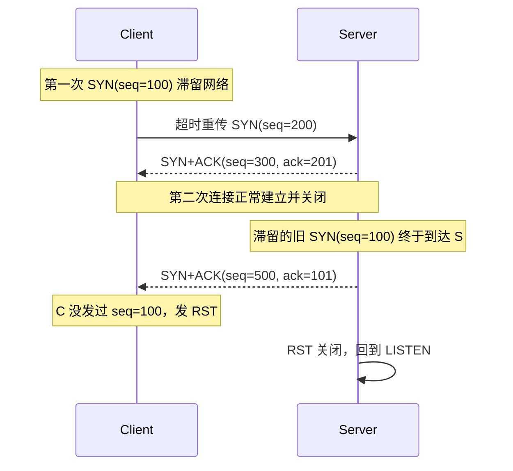
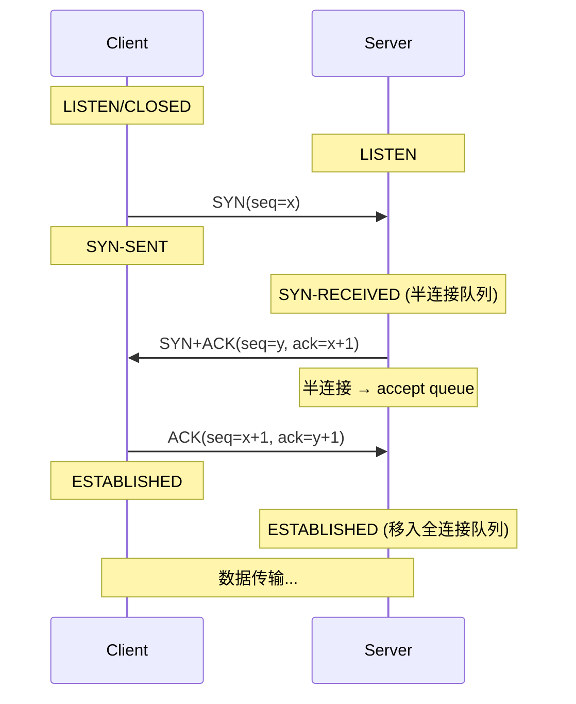
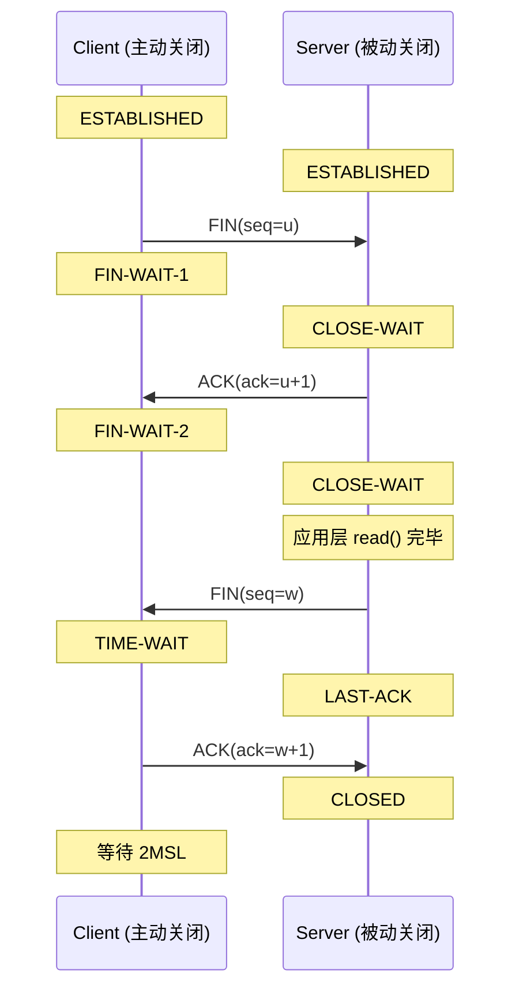

想象你要打电话给一个陌生号码。第一次拨打，电话响了但没人接——这通电话算不算"建立连接"？如果你就此认为对方"在线"，开始滔滔不绝地说正事，那就太草率了。对方可能在开会、在路上、号码根本没人用。TCP 三次握手解决的就是这个"草率"问题——在真正开始传递数据前，**双向确认对方都有收发能力，且收到的请求是当下最新的**。

这篇文章回到 1981 年 RFC 793 的最初设计动机，把三次握手和四次挥手当作一个完整的连接生命周期来看。

<!--more-->

## 一、为什么不能是两次握手？

教科书上常见的"两次也行"的假设，本质是忽略了**网络中滞留的历史报文**。下面用一个真实场景说明。

### 1.1 历史 SYN 引发的问题

客户端 C 第一次发 SYN (seq=100)，但这个报文因为网络拥塞被卡在半路上，迟迟到不了服务端 S：



| 步骤 | 报文 | 关键观察 |
|------|------|----------|
| ① C → S | SYN (seq=100) | 第一次连接请求，滞留网络 |
| ② C → S | SYN (seq=200) | 超时重传，本次连接正常完成 |
| ③ S → C | SYN+ACK (seq=500, ack=101) | **回应那个旧请求** |
| ④ C → S | RST | C 不认识这个连接，回 RST 释放 |

如果是两次握手，第 ③ 步后 S 就直接进入 `ESTABLISHED`、分配内存和端口。等到 S 发现 C 不回数据，已经浪费了一份连接资源。当这种滞留报文成批到达（攻击场景下尤其常见），服务端的半连接队列会被无效连接迅速耗尽。

**RFC 793 §3.4 一句话点题**："The principle reason for the three-way handshake is to prevent old duplicate connection initiations from causing confusion."（三次握手的根本目的是防止旧的重复连接请求引发混淆。）

### 1.2 双向确认序列号

第二个常被忽略的原因：**TCP 没有全局时钟，序列号（ISN）也不是从 0 开始的固定值**。RFC 793 明确写道：

> *"A three-way handshake is necessary because sequence numbers are not tied to a global clock in the network, and TCPs may have different mechanisms for picking the ISN's."*

ISN 由两端各自独立生成，必须经过对方确认才能作为本次通信的起点。三次握手中：

- 第 ① 步：C 告诉 S 我的 ISN=x
- 第 ② 步：S 告诉 C 我的 ISN=y，并确认收到 x
- 第 ③ 步：C 告诉 S 我收到了 y

第 ③ 步 ACK 把两个方向上的"我同意这个 ISN"绑在一起。任何一步缺失，对端都无从判断这个序列号是不是当前的、是不是属于自己的。

### 1.3 为什么恰好是三步？

把"四次握手"想象成：SYN → ACK → SYN → ACK。RFC 793 明确指出**第 ②、③ 步可以合并在一个报文中**（同时设置 SYN 和 ACK 标志位），所以三次是工程上的最优解。再多一步只是浪费往返时间，再少一步解决不了上面的两个问题。

## 二、三次握手的完整状态机

下面用一个时序图把客户端和服务端的状态变化画全：



状态转换的关键点：

| 客户端状态 | 服务端状态 | 说明 |
|-----------|-----------|------|
| `CLOSED` | `LISTEN` | 起始状态 |
| `SYN-SENT` | `SYN-RECEIVED` | 第 ② 步后，S 端进入半连接 |
| `ESTABLISHED` | `ESTABLISHED` | 第 ③ 步后连接建立完成 |

服务端在 `SYN-RECEIVED` 状态下维护一个**半连接记录**（存在 SYN 队列中），字段至少包括：客户端 IP:Port、客户端 ISN (x)、服务端自己的 ISN (y)。收到第 ③ 步 ACK 时校验 ack 是否等于 y+1——这就是 RFC 793 所说的"对暗号"。

## 三、四次挥手：为什么要四次？

TCP 是全双工的——客户端到服务端、服务端到客户端是两条独立的数据流。**关闭一条连接意味着要把两个方向都关闭**，所以需要四次报文。



为什么不是三次？因为第 ② 步 ACK（确认客户端的 FIN）和第 ③ 步 FIN（服务端自己的关闭请求）在时序上**未必能合并**——服务端可能还有数据要发给客户端，必须先 ACK 客户端的关闭请求，再等自己发完数据才能发 FIN。所以"三次挥手"是理论上的特殊场景，正常情况下就是四次。

## 四、TIME_WAIT：为什么必须等 2MSL？

主动关闭方（这里是客户端）在发出最后一个 ACK 后进入 `TIME-WAIT`，等待 **2 倍 MSL（Maximum Segment Lifetime）** 才真正关闭。RFC 793 把 MSL 定为 2 分钟，主流 Linux 实现中是 60 秒。

两个工程原因决定了必须等：

### 4.1 保证最后的 ACK 能到达对端

ACK 在网络中可能丢失。如果对端（服务端）没收到，会超时重传 FIN。主动关闭方必须留在 `TIME-WAIT` 状态才能**重发 ACK**。如果提前释放，对端会一直重传失败、报 `Connection reset`。

2MSL 涵盖了一个完整的"丢包 + 重传 + 重传 ACK"往返周期，超出这个时间未收到重传就基本可以认为 ACK 已被接收。

### 4.2 让旧连接的残留报文彻底消亡

TCP 用四元组（src IP, src Port, dst IP, dst Port）标识连接。同一对四元组在连接关闭后**不能立即复用**——否则网络中迟到的旧报文可能被新连接误收。等待 2MSL 保证所有可能滞留的旧报文都已在网络中过期消失。

### 4.3 TIME_WAIT 过多的副作用

高并发短连接服务（如 HTTP 服务器、Redis）经常会遇到 `TIME_WAIT` 数量堆积：

```bash
$ netstat -n | awk '/^tcp/ {++S[$NF]} END {for(a in S) print a, S[a]}'
TIME_WAIT 18432
ESTABLISHED 412
```

每条 `TIME_WAIT` 连接占用一个本地端口。如果连接频率高，端口耗尽会导致 `Address already in use`。常见的缓解策略：

| 优化手段 | 参数 / 做法 | 副作用 |
|---------|------------|--------|
| 开启 `tcp_tw_reuse` | `net.ipv4.tcp_tw_reuse=1` | 仅对客户端连接生效（出向连接），复用处于 TIME_WAIT 的端口 |
| 调整 `tcp_max_tw_buckets` | 适当增大 | 只是延后问题，且会占用更多内核内存 |
| 缩短 `tcp_fin_timeout` | `net.ipv4.tcp_fin_timeout=15` | Linux 默认 60s，谨慎调小 |
| 长连接复用 | 应用层 Keep-Alive | 根本性解决 |

注意 Linux 的 `tcp_tw_recycle` 在 NAT 环境下会误杀合法连接（4.12 内核后已移除），不要使用。

## 五、实战：用 tcpdump 观察握手挥手

下面是一段 `tcpdump` 的输出片段（简化为关键行）：

```bash
$ tcpdump -i eth0 -nn -S port 80
IP 10.0.0.1.52344 > 10.0.0.2.80: Flags [S], seq 100, win 29200
IP 10.0.0.2.80     > 10.0.0.1.52344: Flags [S.], seq 300, ack 101, win 28960
IP 10.0.0.1.52344 > 10.0.0.2.80: Flags [.], ack 301, win 29200
...
IP 10.0.0.1.52344 > 10.0.0.2.80: Flags [F.], seq 101, ack 301, win 29200
IP 10.0.0.2.80     > 10.0.0.1.52344: Flags [.], ack 102, win 28960
IP 10.0.0.2.80     > 10.0.0.1.52344: Flags [F.], seq 301, ack 102, win 28960
IP 10.0.0.1.52344 > 10.0.0.2.80: Flags [.], ack 302, win 29200
```

`S` 是 SYN，`.` 是 ACK，`F` 是 FIN。第三步的 ACK 在 `tcpdump` 输出中**不带数据**也常被省略打印，所以肉眼看上去有时只有两步 ACK——但内核层面是完整的。

一个常见排查脚本：

```bash
# 查看当前服务器上 TIME_WAIT 数量及占用
ss -s
cat /proc/net/netstat | grep -i tw
```

## 六、小结

| 问题 | 工程答案 |
|------|---------|
| 为什么是三次握手 | 防止历史滞留 SYN 导致服务端错误建连；双向确认独立生成的 ISN |
| 为什么恰好三步 | 第 ② 步可同时携带 SYN+ACK 标志，最少报文数为 3 |
| 为什么要四次挥手 | TCP 全双工，两条方向各需一次 FIN+ACK |
| TIME_WAIT 为什么 2MSL | 保证最后 ACK 能重传；防止旧报文污染新连接 |
| TIME_WAIT 太多怎么办 | Keep-Alive 长连接 + `tcp_tw_reuse`（仅客户端） |

三次握手是网络协议设计中"用最少的步骤解决最难的问题"的经典案例。理解了为什么不是两次，再看 SYN Cookie、TFO（TCP Fast Open）、QUIC 的连接迁移，就有了判断其设计取舍的统一标尺。

## 七、更新记录

- 2015-03 初稿（基于 RFC 793 与 Linux 3.x 内核实现）
- TLS 1.3（RFC 8446，2018）将握手简化到 1-RTT，QUIC（RFC 9000，2021）进一步把握手集成到传输层握手，本质上都是在三次握手的"信息冗余"上做减法——它们能这么做的前提是底层不再有"历史滞留 SYN"这一类问题
- TCP Fast Open（TFO，RFC 7413，2015）允许在第一个 SYN 里就携带数据，把握手和数据传输重叠，对短连接请求（如 HTTP GET）能省一个 RTT，但要求服务端缓存 cookie，部署复杂度较高
- MPTCP（RFC 8684，2020）在三次握手之上多路复用多条子流，对移动端切换 WiFi/4G 的场景天然友好——但和 TCP 单流应用协议兼容性需要额外适配

## 八、动手：观察一次连接的真实生命周期

光看时序图不够直观。把下面这段 shell 在自己的机器上跑一遍，能亲眼看到三次握手、HTTP 往返、四次挥手的全流程。

```bash
# 终端 A：起一个 nc 监听
$ nc -l 8080

# 终端 B：发起连接（-v 显示详细信息）
$ curl -v telnet://127.0.0.1:8080

# 终端 C：抓包
$ sudo tcpdump -i lo -nn -S -tttt port 8080
```

输出大致是这样的：

```
00:00:00.000000 IP 127.0.0.1.54321 > 127.0.0.1.8080: Flags [S], seq 100, win 43690
00:00:00.000015 IP 127.0.0.1.8080 > 127.0.0.1.54321: Flags [S.], seq 200, ack 101, win 43690
00:00:00.000040 IP 127.0.0.1.54321 > 127.0.0.1.8080: Flags [.], ack 201, win 43690
00:00:00.001000 IP 127.0.0.1.54321 > 127.0.0.1.8080: Flags [P.], seq 101:107, ack 201, win 43690
00:00:00.005000 IP 127.0.0.1.8080 > 127.0.0.1.54321: Flags [F.], seq 201, ack 107, win 43690
00:00:00.005040 IP 127.0.0.1.54321 > 127.0.0.1.8080: Flags [F.], seq 107, ack 202, win 43690
00:00:00.005080 IP 127.0.0.1.8080 > 127.0.0.1.54321: Flags [.], ack 108, win 43690
```

三秒不到就把一个完整的 TCP 会话看完了。注意几处：

- 三次握手占了 40 微秒——这是本地 loopback 的延迟；真实网络会加上 RTT
- 第一个 `P.` 是 PUSH（数据段），curl 把"hello\n"发了过去
- 关闭顺序有点不对称：服务端先发 FIN，客户端回了 FIN+ACK——这是因为 `nc` 退出会触发本地半关闭

如果想看 HTTP 完整过程，把命令换成 `curl -v http://127.0.0.1:8080/` 并在终端 A 跑一个简单的 HTTP 服务即可。`tcpdump` 的 `-S` 选项禁止相对序列号（输出原始 seq），`-tttt` 输出易读的绝对时间戳，这两个选项是排查 TCP 问题的标配。

## 参考资料

- [RFC 793 - Transmission Control Protocol](https://datatracker.ietf.org/doc/html/rfc793)
- [RFC 1323 - TCP Extensions for High Performance](https://datatracker.ietf.org/doc/html/rfc1323)
- [《TCP/IP 详解 卷1》](https://www.ituring.com.cn/book/1194) — W. Richard Stevens
- Linux man page: `tcp(7)`、`ip(7)`
