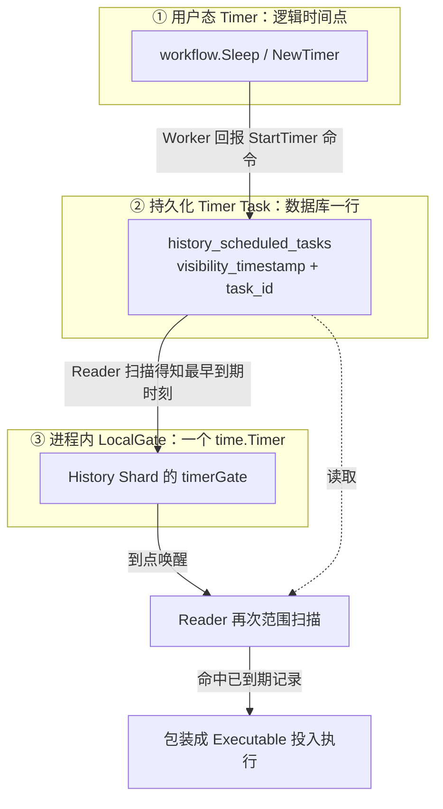
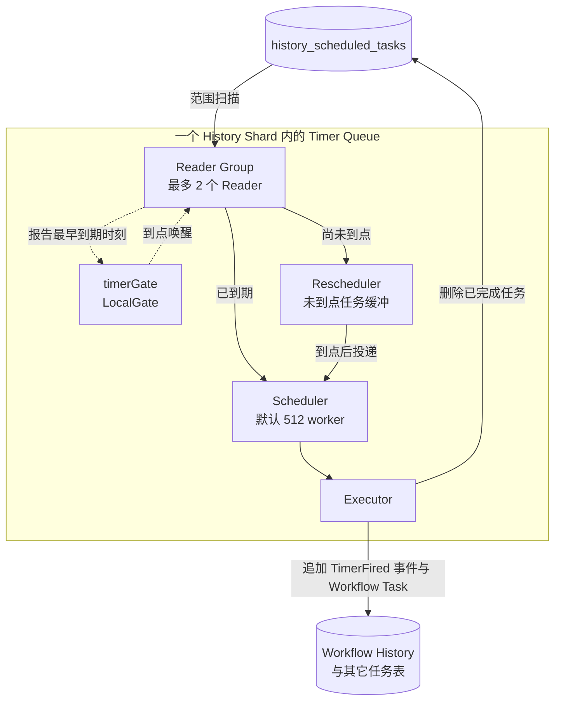
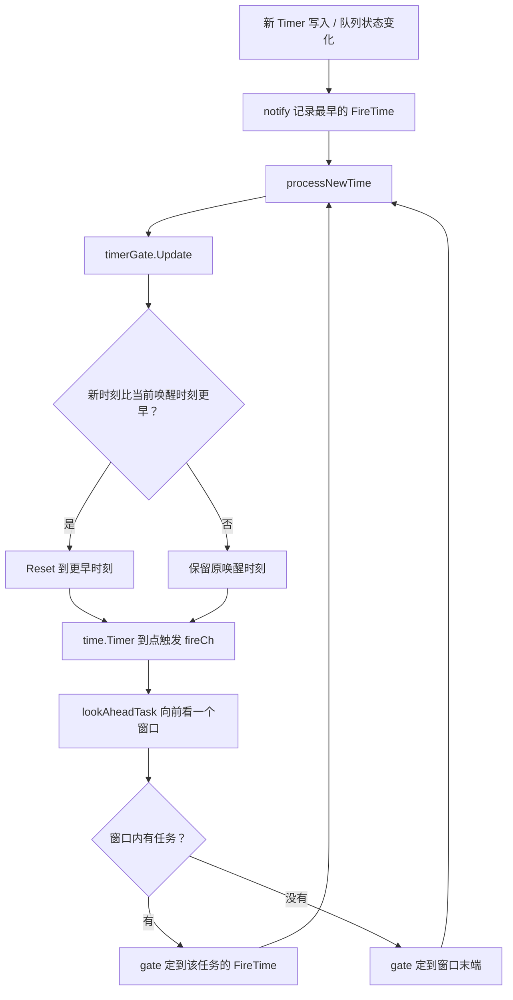
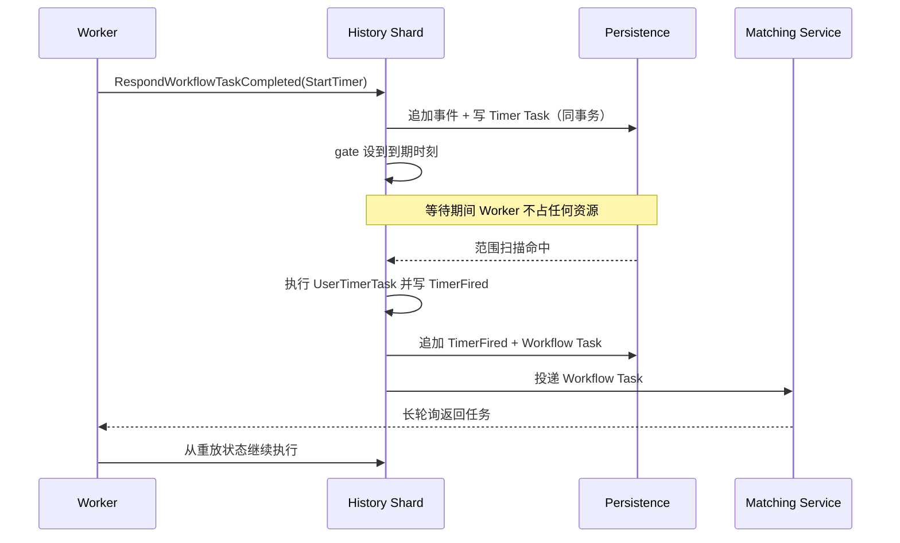

Temporal 是一套持久化执行（durable execution）平台。它真正做的事，是把「创建订单 → 等支付 → 等三天 → 查是否付款 → 等物流 → 等七天 → 发通知」这种跨越数天甚至数月的业务流程，变成一条可以随时重放的持久化事件流。业务代码写在 Workflow 里，外部依赖放在 Activity 里，服务端只负责把状态和事件存下来，然后在正确的时刻把执行权交还给 Worker。

这里最容易被误解的一点是定时能力。直觉上，「给 100 万个用户各设一个定时提醒」意味着 100 万个正在等待的执行单元；而在 Temporal 里，等待根本不占用执行资源。定时任务在数据库里就是一行记录，长期运行的是数量有限的 Reader、Scheduler 和 Executor。

这篇文章沿着 Temporal 服务端源码，把这条链路拆成五段来讲：定时任务怎么写进去、History Service 靠什么发现「该干活了」、进程内的自适应闹钟如何工作、到期后怎么变成 Worker 真正执行的任务，以及故障恢复依赖什么保证。

<!--more-->

## 一、先分清三个「Timer」

同一个词在 Temporal 里指三种完全不同的东西，混淆它们是理解这套机制的第一道坎。

| 层次 | 具体形态 | 存在哪里 | 生命周期 |
|---|---|---|---|
| ① 用户态 Timer | `workflow.Sleep`、`NewTimer` | Workflow 事件（TimerStarted / TimerFired） | 与 Workflow Execution 同寿 |
| ② 持久化 Timer Task | 定时任务表里的一行 | 数据库 `history_scheduled_tasks` | 到期执行后被删除 |
| ③ 进程内 LocalGate | 一个 `time.Timer` | History Service 进程内存 | 随进程存活，可反复重置 |

三者的关系不是「一个包一个」，而是数据在不同阶段的投影：



第一层是业务语义：`workflow.Sleep(ctx, 24*time.Hour)` 表示「这个 Workflow 的下一步要在 24 小时后才允许发生」。它不产生任何 Go 定时器，只产生一对事件。第二层是调度语义：一条「某 Workflow 最早在某个时刻可被唤醒」的记录。第三层是运行时语义：History Service 自己用来「睡到下一次有必要干活」的本地闹钟。

**结论很直接：100 万个用户 Timer 就是 100 万行记录，不是 100 万个 goroutine。** 每个用户 Timer 占用的是存储和索引，不是线程、栈或调度器时隙。

## 二、写入侧：Timer 是事件溯源的副产品

Temporal 的持久化执行建立在事件溯源之上：每个 Workflow Execution 有一条只追加的 History，任何时刻都能通过重放这条 History 重建出完整状态。所以定时任务的写入不是「注册一个定时器」，而是「追加一个事件」。

当 Worker 执行 Workflow 代码走到 `workflow.Sleep`，它并不会阻塞，而是把当前执行挂起，向 History Service 回报一条 `StartTimer` 命令。History Shard 收到后，在一个数据库事务里完成三件事：

1. 追加 `TimerStarted` 事件到 Workflow History；
2. 更新 Mutable State（记录还有哪个 Timer 在等、关联的事件 ID 等）；
3. 写入一条 Timer Task，其 `visibility_timestamp` 等于「到期时刻」。

这三件事必须原子完成。前两项保证「重放时能重现出这个 Sleep」，第三项保证「服务端知道什么时候该唤醒它」。History 与 Mutable State 的一致性靠「Mutable State 记录自己已反映到的最新事件 ID」来校验；任务与状态的一致性靠数据库事务；而与下游服务的最终一致性则靠 Transactional Outbox 模式——这是后面第七节要展开的部分。

这样设计换来一个关键性质：**Workflow Task 执行完就可以返回，Worker 不为此保留任何资源。** Worker 重启、宕机、换机器、发布新版本，都不影响那个还躺在数据库里的 Timer。到期后服务端重新生成一个 Workflow Task，交给任意一个可用的 Worker 继续执行——注意是继续执行同一个 Workflow，而不是从头跑。

顺带区分一个容易混淆的概念：如果需要的是「每天 10:00 执行一次」这类周期性任务，用 Schedule 更合适。Schedule 的本质是「按日历规则定时启动新的 Workflow Run」，而 `workflow.Sleep` 是「单次 Workflow 内部的等待」。前者关心的是启动，后者关心的是续跑。

## 三、集群侧：History Shard 与 Timer Queue

Workflow Execution 在集群里按 History Shard 划分。Shard 总数在集群创建时就固定下来，之后不能改；集群里多个 History Service 实例各自负责一部分 Shard，归属关系由一个 ShardController 组件通过成员协议（基于 Ringpop 实现）协调。

每个 Shard 带一个单调递增的 `RangeID`，用作 fencing 代际号——当 Shard 发生所有权转移或进行故障恢复时，旧的持有者会因为 RangeID 不匹配而被拒绝写入，避免出现两个实例同时推进同一个 Shard。

「拥有一个 Shard」意味着同步处理它的所有 RPC，并异步处理它的后台任务队列。Shard 内部的队列不止一条：Timer Queue、Transfer Queue、Visibility Queue、Replication Queue、Archival Queue。定时任务走的是 Timer Queue，在代码里由 `queues.NewScheduledQueue` 构造：

```text
service/history/queues/queue_scheduled.go   → scheduledQueue（定时队列本体）
service/history/queues/reader.go            → Reader（拉取并提交任务）
service/history/queues/slice.go             → Slice（一段待读取的任务范围）
service/history/queues/iterator.go          → Iterator（范围内的游标推进）
service/history/queues/rescheduler.go       → Rescheduler（未到点任务的缓冲）
service/history/queues/queue_base.go        → queueBase（确认位点与检查点）
common/timer/local_gate.go                  → LocalGate（进程内唤醒）
```

它们的组合关系如下：



Timer Queue 并不持有「所有 Timer」。它持有的是一组**待读取的范围**和**已经读出来的少量任务**。真正的全量 Timer 全在数据库里。

## 四、读取侧：范围扫描加游标，而不是逐条比对

既然 Timer 都在数据库里，第一个问题就是：怎么高效地找出「已经可以执行」的那些？

答案是让数据库的索引顺序替你判断。定时任务表的主键是四元组——分片、类别、触发时刻、任务 ID：

```text
PRIMARY KEY (shard_id, category_id, visibility_timestamp, task_id)
```

查询语句形如：

```sql
SELECT visibility_timestamp, task_id, data, data_encoding
FROM history_scheduled_tasks
WHERE shard_id = $1
  AND category_id = $2
  AND ((visibility_timestamp >= $3 AND task_id >= $4) OR visibility_timestamp > $5)
  AND visibility_timestamp < $6
ORDER BY visibility_timestamp, task_id
LIMIT $7
```

其中 `$6` 是「现在」。**这一条 `visibility_timestamp < now` 就是「任务已经 ready」的全部判据**，不需要在应用层再做任何「该不该执行」的判断。索引天然按 (时间, 任务 ID) 有序，所以这是一个走主键前缀的范围扫描，不是全表过滤。

而 `$3/$4/$5` 那一组就是游标：`(visibility_timestamp, task_id)` 记住上一批读到哪里，下一批从这里继续。代码里的 Iterator 负责推进它：

```go
// service/history/queues/iterator.go
func (i *IteratorImpl) Next() (tasks.Task, error) {
    task, err := i.pagingIterator.Next()
    if err != nil {
        return nil, err
    }
    i.remainingRange.InclusiveMin = task.GetKey().Next()
    return task, err
}
```

每读完一条，就把范围的左端点推到「这条任务的 Key 的下一个」。再加上 `LIMIT` 分页，于是同时满足四个要求：不从头扫、不重复、不遗漏、能处理任意数量的任务。

需要说明的是，这张带 `category_id` 的 `history_scheduled_tasks` 是当前主线里的统一表；更早的实现把定时任务放在 `timer_tasks`，按任务类型拆分。两者在代码里并存，新队列路径走前者。

**这里有一个反直觉之处：读出来的任务不一定立刻执行。** 判定「是否执行」不只看 `visibility_timestamp < now`，还要在提交阶段再过一道时间检查，这就是下一节和第六节的内容。

## 五、自适应唤醒：LocalGate 与通知机制

范围扫描解决了「查什么」，但没回答「隔多久查一次」。如果答案是一个固定周期（比如每 5 秒），那既浪费又不够及时：一个刚到期 10 毫秒的 Timer 也得等满一个周期。

Temporal 的做法是用一个**自适应的本地闹钟**决定下一次唤醒时刻。它是 `common/timer/local_gate.go` 里的一个结构：

```go
type LocalGateImpl struct {
    fireCh  chan struct{}
    closeCh chan struct{}

    timeSource clock.TimeSource

    timer          *time.Timer  // 真正会触发的那个 Go 定时器
    nextWakeupTime time.Time    // 上面这个定时器会在什么时候触发
}

func (lg *LocalGateImpl) Update(nextTime time.Time) bool {
    now := lg.timeSource.Now()

    if lg.timer.Stop() && lg.nextWakeupTime.Before(nextTime) {
        // 原本的定时器是有效的，且已有更早的唤醒时刻：保留它
        lg.timer.Reset(lg.nextWakeupTime.Sub(now))
        return false
    }

    // 否则设置新的唤醒时刻
    lg.nextWakeupTime = nextTime
    lg.timer.Reset(nextTime.Sub(now))
    return true
}
```

三个要点：

**它是一个可重置的一次性闹钟，不是循环定时器。** 唤醒时刻完全由 `Update` 的入参决定，所以「查询间隔」根本不是一个配置项，而是「下一个值得关注的时间点是什么」的计算结果。

**它拒绝被推迟。** 如果当前已经定在一个更早的时刻，后来传入一个更晚的时间会被忽略，保持原唤醒时刻。这条看似不起眼的规则保证了「只要知道有一件更早的事要处理，就不会因为后来的一件更晚的事而睡过头」。

**它必须能被提前打断。** 设想现在 10:00，已知最近的 Timer 是 10:04，闹钟设到 10:04。10:00:10 突然插入一个 10:00:20 到期的 Timer——如果闹钟只会睡到 10:04，这个新任务就会被延迟 3 分 40 秒。所以定时队列还配了一条通知通道：

```go
// service/history/queues/queue_scheduled.go
func (p *scheduledQueue) notify(newTime time.Time) {
    p.newTimeLock.Lock()
    defer p.newTimeLock.Unlock()

    if !p.newTime.IsZero() && !newTime.Before(p.newTime) {
        return
    }

    p.newTime = newTime
    select {
    case p.newTimerCh <- struct{}{}:
    default:
    }
}
```

新任务写入时，`NotifyNewTasks` 会取这批任务里最早的 `visibility_timestamp` 调用 `notify`；事件循环收到 `newTimerCh` 后执行 `processNewTime`，把新时间交给 `timerGate.Update`。于是闹钟被提前重设到 10:00:20。

那么「睡多久」具体怎么算？由 `lookAheadTask` 决定：

```go
// 向前看一个窗口，只取一条
lookAheadMinTime := p.nonReadableScope.Range.InclusiveMin.FireTime
lookAheadMaxTime := lookAheadMinTime.Add(backoff.Jitter(
    p.options.MaxPollInterval(),
    p.options.MaxPollIntervalJitterCoefficient(),
))

request := &persistence.GetHistoryTasksRequest{
    ShardID:             p.shard.GetShardID(),
    TaskCategory:        p.category,
    InclusiveMinTaskKey: tasks.NewKey(lookAheadMinTime, 0),
    ExclusiveMaxTaskKey: tasks.NewKey(lookAheadMaxTime, 0),
    BatchSize:           1,
    NextPageToken:       nil,
}
```

逻辑很干净：在当前可读位置，到「当前可读位置加一个 `MaxPollInterval` 窗口（含 ±15% 抖动）」之间，找**一条**任务。找到了，就把闹钟定到那条任务的触发时刻；没找到，就把闹钟定到窗口末端。源码注释直接点明了这个设计的后果——**不需要独立的 max poll 定时器**，加载会在每个 `maxPollInterval + jitter` 或新任务通知到来时被触发。

关键配置及默认值一览（均为动态配置项，可运行时调整）：

```text
history.timerTaskBatchSize                        100      单次读取任务条数
history.timerQueueMaxReaderCount                  2        单个队列的 Reader 上限
history.timerProcessorSchedulerWorkerCount        512      调度器 worker 数
history.timerProcessorMaxPollInterval             5 min    向前看窗口长度
history.timerProcessorMaxPollIntervalJitterCoef   0.15     窗口长度 ±15% 抖动
history.timerProcessorMaxTimeShift                1 s      允许的时间位移
history.timerProcessorPollBackoffInterval         5 s      出错或积压时的退避
history.timerProcessorUpdateAckInterval           30 s     检查点（确认位点）周期
history.timerProcessorUpdateAckIntervalJitterCoef 0.15     检查点周期抖动
history.timerProcessorMaxPollRPS                  20       单队列每秒读取次数上限
```

`5 min` 这个默认值最容易被误读。它**不是**「每 5 分钟查一次数据库」，而是「在没有更近任务时的兜底上限」——用来保证系统不会无限期地不检查，同时配合 ±15% 抖动打散多个 Shard，避免所有 Shard 在同一毫秒集中打数据库。

整条唤醒逻辑可以画成一个自我循环：



## 六、「还差一分钟」的任务会被怎么处理

这是一个把机制问到底的问题：Reader 扫出来一条记录，但它距离 `visibility_timestamp` 还差一分钟，会怎么办？

要分两种情形，答案不一样。

**情形一：超出预取范围（绝大多数情况）。** 它根本不会被取出来。`visibility_timestamp < now` 的过滤条件把它挡在查询之外，它继续安静地躺在表里。同时 `lookAheadTask` 已经向前看到它了，于是 `timerGate` 被设置到它到期的那个时刻——读取位置的推进和闹钟的设定是两条独立的路径，正是这个分离让「不取出来也能准确唤醒」成为可能。

**情形二：落在极小的时间提前量之内。** Reader 的查询上界并不是严格的 now，而是带有细微的向前偏移（`timerProcessorMaxTimeShift` 默认 1 秒），加上持久化精度常量 `ScheduledTaskMinPrecision`（1 毫秒）的对齐处理，所以**少量尚未到点的任务确实会被读进内存**。但读到不等于执行，提交阶段会再拦一次：

```go
// service/history/queues/reader.go
func (r *ReaderImpl) submit(executable Executable) {
    now := r.timeSource.Now()
    fireTime := executable.GetKey().FireTime.Add(common.ScheduledTaskMinPrecision)
    if now.Before(fireTime) {
        r.rescheduler.Add(executable, fireTime)
        return
    }

    executable.SetScheduledTime(now)
    if !r.scheduler.TrySubmit(executable) {
        executable.Reschedule()
    }
}
```

尚未到点的任务被交给 `Rescheduler`，它按命名空间分桶放入优先队列，并配一个自己的 LocalGate，到点后再投回调度器。

所以更准确的说法是：**Reader 做的是「预取 + 延迟投递」，而不是严格的「只取已到期」。** 「取出来干等一分钟」在机制上不会发生，但「取出来先在内存里等几毫秒到几秒」是常态。这个缓冲存在的价值是削掉扫描与执行之间的时间缝隙，让刚过期的任务不必等下一轮扫描。

反过来说，也正因为有这个缓冲，`Rescheduler` 的堆积量是一个值得盯的指标：它长期偏高，说明扫描节奏或上游吞吐出了问题。

## 七、到期之后：从 Task 到 Workflow Task

任务被读出来之后会被包装成 `Executable`——它既是待执行任务的载体，也是一小块状态机（创建 → 调度 → 开始 → 完成），并携带失败处理策略。随后经 `Scheduler` 的内存 channel 投给 Executor worker 执行。

真正的分发在定时任务执行器里按任务类型展开。定时队列承载的不只是用户 Timer，常见类型包括：

| 任务类型 | 语义 |
|---|---|
| `UserTimerTask` | `workflow.Sleep`、`NewTimer` 产生的用户定时器 |
| `ActivityTimeoutTask` | Activity 的调度到开始、开始到结束等超时 |
| `WorkflowTaskTimeoutTask` | Workflow Task 自身的超时 |
| `WorkflowRunTimeoutTask` | 单次 Workflow Run 的超时 |
| `WorkflowExecutionTimeoutTask` | 整个 Workflow Execution 的超时 |
| `ActivityRetryTimerTask` | Activity 重试的退避定时 |
| `WorkflowBackoffTimerTask` | Workflow 重试的退避定时 |

用户 Timer 的路径最能说明这套设计的本质：

```text
UserTimerTask
  → 加载 WorkflowExecutionContext，加锁
  → 加载 Mutable State
  → 按序取出该 Workflow 所有用户 Timer
  → 逐个判断是否真的到期（IsTimeExpired）
  → 写入 TimerFired 事件
  → updateWorkflowExecution：追加事件 + 更新 Mutable State + 生成 Workflow Task
```

其中判断到期的逻辑值得单独看一眼。`IsTimeExpired` 会用「参考时间」和「任务自身触发时刻」中较大的那个作为基准，并截断到毫秒精度再比较，这样处理了持久化过程中时间精度丢失导致触发时刻轻微前移的问题。而且因为用户 Timer 是按序排列的，一旦遇到一个尚未到期的 Timer 就可以直接跳出循环——后面的只会更晚。

这里最关键的一句话是：**Timer 到期执行的从来不是用户代码，而是对持久化状态的修改。** 它只产生一个 `TimerFired` 事件，把 Workflow 从「等待中」推回「可推进」。真正跑业务逻辑的是随后被调度起来的 Worker，而 Worker 拿到的是从事件流重放出来的、与中断前完全一致的状态。

这也解释了为什么这套模型能容忍任意时长的等待：等待期间没有任何执行上下文需要维护，需要维护的只有事件流。

## 八、另一个「取」：Worker 侧的长轮询

到这里只讲了一半。Timer Queue 解决的是「什么时候产生任务」，还有另一半是「谁来执行任务」。而这两个「取」，机制完全不同。

Timer Queue 是服务端自己取：History Shard 常驻 Reader 主动向数据库做范围扫描。

Task Queue 是客户端自己取：Worker 主动发起一个长轮询请求，Matching Service 把请求挂住不返回，等任务就绪时再返回。Worker 启动时反复调用 `PollWorkflowTaskQueue` / `PollActivityTaskQueue`，请求里带任务队列名与 worker 身份。Matching Service 侧是一个显式的轮询循环：

```go
// service/matching/matching_engine.go
pollLoop:
    for {
        err := common.IsValidContext(ctx)
        if err != nil {
            return nil, err
        }
        // …
        task, versionSetUsed, err := e.pollTask(pollerCtx, partition, pollMetadata)
        // …
    }
```

任务到达时直接与挂起中的请求配对返回，原来的 RPC 就此完成。**Server 不会反向建立到 Worker 的连接去推送任务**——这是长轮询与「服务端 push」最本质的区别，也是 Worker 可以躲在 NAT 或负载均衡之后工作的原因。

Task Queue 还会被拆成分区以提高吞吐，默认 4 个分区。分区所有权可以重新分配，其元数据和任务积压也能按需从存储加载或卸载。当某个分区无人轮询或任务吞吐很低时，轮询请求和任务可以被「转发」到父分区，逐级向上收敛到根分区；根分区一旦加载，会强制该任务队列的全部分区一起加载，从而保证「有任务的分区」和「久等的轮询者」终能相遇。

两个「取」的对照：

| 维度 | Timer Queue（服务端） | Task Queue（客户端） |
|---|---|---|
| 发起方 | History Shard 的 Reader | Worker 进程 |
| 动作 | 主动向数据库范围扫描 | 主动发起 gRPC 长轮询并挂起 |
| 存储形态 | 持久化任务表 | 内存中的等待队列与任务积压 |
| 解决的问题 | 什么时候可以往下走 | 由哪个 Worker 来执行 |
| 感知新工作的方式 | 定时扫描 + 通知唤醒 | 请求挂起，服务端就绪即返回 |
| 分区维度 | History Shard | Task Queue Partition |

把两者串起来，就是一次定时任务的完整生命周期：



## 九、确认位点、检查点与故障恢复

最后补上可靠性这一环。既然读取是「范围扫描 + 游标」，那么「已经处理到哪」这件事必须被持久化，否则 Shard 迁移或重启后无法续读。

Timer Queue 用一个高水位线来表达这件事：每个 Reader 维护自己负责的范围，队列整体维护一个「已确认的不再需要重读的位置」。这个状态会周期性写回——周期就是 `timerProcessorUpdateAckInterval`（默认 30 秒，带 ±15% 抖动），也就是检查点。之所以不做成「每完成一条就写一次」，是在「重启后重复处理的量」和「写入压力」之间取的折中。

已完成的区间不是逐条删除，而是成批做区间删除（`RangeCompleteHistoryTasks`），一次提交覆盖一整段。这里还有一个细节埋着坑：当 Shard 的 RangeID 发生变化时，代码会额外再做一次区间删除，因为底层持久化实现可能会依据已持久化的 shard 信息来服务请求。少这一步，就会出现一部分任务永远删不掉、每次重启都被重新处理的情况。

至于「定时任务与下游任务」之间的一致性，靠的是 Transactional Outbox 模式。定时任务执行时，`TimerFired` 事件和代表「需要给 Matching 投递一个 Workflow Task」的 Transfer Task 是同一个事务写入的；随后由 Transfer Queue 的处理器负责把这个内层任务真正投递出去。**先和状态一起落库、再由独立处理器搬运**，这样即使投递环节失败或进程崩溃，任务也不会丢——它只是被延迟到下一轮。

把这些放在一起，就能回答那个最初的问题了：

| 疑问 | 实际机制 |
|---|---|
| 是不是给每个定时任务开一个 goroutine？ | 不是。等待是数据库里的一行记录 |
| 是不是要频繁全表扫描？ | 不是。走主键前缀的范围扫描，用游标分页推进 |
| 查询间隔是固定值吗？ | 不是。由自适应 gate 根据最近的到期时刻决定 |
| 新插入更早的任务会漏吗？ | 不会。通知机制会提前重设唤醒时刻 |
| 到期就执行用户代码吗？ | 不是。只写事件、改状态，再由 Worker 重放执行 |

## 写在最后

Temporal 的定时任务机制，本质上是把「时间」也变成了状态。它没有为每一个等待创建一个执行单元，而是把「在某时刻之后可以继续」编码成一条带时间戳的持久化记录，再用「范围扫描 + 自适应闹钟 + 通知打断」这三件套去发现它。整个系统里长期活跃的东西数量，与用户定时任务的数量无关。

三个可以直接带走的判断：

**第一，定时系统的可扩展性瓶颈在「发现」而不在「等待」。** 等待可以被持久化，代价接近于零；真正的工程难度在于如何用一个不随任务数增长的常驻组件，准确地知道「什么时候该看一眼」。范围扫描加游标的组合，让这个进度是可推进、可恢复、可切分的。

**第二，用一个可重置的一次性闹钟，比用一个固定周期的轮询更省也更快。** 固定周期天然存在「平均延迟 = 半个周期」的浪费，而自适应唤醒把延迟压到接近零，同时把无意义的查询次数降到最低。代价是必须额外配一条通知通道，来应对「更早的任务突然插入」——这两者必须成对出现，只做其中一个都会出问题。

**第三，确认位点和检查点的粒度选择，决定的是崩溃恢复代价。** 逐条确认写压力大，永久不确认则重启后重复处理的量不可控。周期性的高水位线加区间删除，是一个值得在自建调度系统里直接借用的折中。
