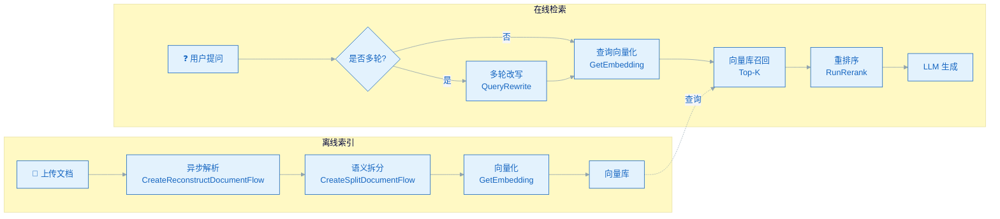

把 RAG 链路拆开看，每一步（解析、拆分、Embedding、检索、重排）都有可以替换的实现。腾讯云知识引擎原子能力做的事情，本质上是把这些环节单独抽成高质量的 API，让开发者按需组合。

这篇文章不是入门教程，而是面向已经理解 RAG 全流程的 AI 应用开发者，重点聊在企业知识库问答场景下，怎么用这套原子能力，以及几个真实的取舍。

<!--more-->

## 一、为什么是原子能力，而不是端到端产品

在做企业 RAG 选型时，市面上有几类典型方案：

| 方案 | 特点 | 典型代表 |
|------|------|----------|
| **编排框架** | 提供组件抽象，自己组装所有环节 | LangChain、LlamaIndex |
| **Agent 编排** | 状态机、多步推理 | LangGraph |
| **端到端知识库产品** | 全托管，开箱即用 | 腾讯 ima、阿里钉钉智能问答 |
| **原子能力 API** | 每个环节独立 API，自己组合 | 腾讯云知识引擎原子能力 |

前两类是**框架**，给你零件让你装；第三类是**产品**，黑盒交付；原子能力是中间路线——给你做好的零件，但不替你做组装。

为什么选这个中间路线？实践下来几个原因：

- **每个环节都能换**。比如某个项目解析用腾讯的，Embedding 用自建的开源模型，重排序用 BGE，编排用 LangGraph。这种混搭在框架里很麻烦，端到端产品里几乎不可能。
- **关键环节质量过硬**。OCR 解析、语义切分这种细节，自己搭和用云厂商打磨过的模型，差距肉眼可见。
- **不绑定业务架构**。端到端产品要求你的文档、数据全交进去；原子能力只暴露 API，数据完全在自己手里。

企业知识库问答最典型的形态：原子能力负责 RAG 链路的核心组件，上层编排、Agent 逻辑、用户界面自己来。

## 二、原子能力一张表

先把所有原子能力摆出来，避免后面来回解释。这张表和官方文档对齐，细节可以跳过。

| 能力 | API | 用途 |
|------|-----|------|
| 文档解析（同步/SSE） | `ReconstructDocumentSSE` | 小文件，实时解析 |
| 文档解析（异步） | `CreateReconstructDocumentFlow` | 大文件，离线处理 |
| 文档语义拆分 | `CreateSplitDocumentFlow` | 多级语义切分 |
| 文本向量化 | `GetEmbedding` | 文本转向量 |
| 多轮改写 | `QueryRewrite` | 指代消解、省略补全 |
| 重排序 | `RunRerank` | 精排召回结果 |

调用域名统一是 `lkeap.tencentcloudapi.com`，默认限频 20 次/秒。这些是 RAG 全流程需要的最小集合，剩下的事情（向量数据库、LLM 调用、业务编排）自己接。

## 三、企业知识库 RAG 的实战流程

下面是经过几个项目验证过的一套流程，重点不是每步怎么调，而是每个环节的**取舍经验**。



### 3.1 解析：同步 SSE 还是异步 Flow？

`ReconstructDocumentSSE`（同步）和 `CreateReconstructDocumentFlow`（异步）接口功能几乎一致，区别在**调用方式**和**文件大小限制**。

经验上这样选：

- **用户上传完等待立刻提问**的场景（比如上传合同然后问"这份合同的付款条款是什么"）→ 同步 SSE，几秒出结果
- **后台批量入库**（比如导入 1 万份历史产品手册）→ 异步 Flow，可以处理 100M 的 PDF

文档类型上，腾讯自研的多模态解析对**扫描 PDF、表格、图文混排**特别友好。这一点对很多企业场景是刚需——大量老旧文档都是扫描件。

### 3.2 拆分：粒度怎么选

`CreateSplitDocumentFlow` 提供多级语义拆分，官方说法是回答完整性比正则切分提升 20%。但实际用下来还有几个细节：

- **默认 chunk size 通常偏大**。如果文档是技术规范、合同条款这种**强结构化内容**，建议在调用时调小 chunk size，按段落甚至按条款切
- **多级拆分有时候切得过细**。返回结果里会同时给粗粒度和细粒度两种 chunk，做召回时只用一种，否则向量召回会重复
- **元数据要顺手带上**。拆分接口允许传自定义字段（文档类型、所属部门、更新时间），召回时用这些字段做过滤，精准度能上一个台阶

### 3.3 Embedding：内置够用

`GetEmbedding` 内置模型在多数企业文档场景下够用。官方数据召回率从 85% 提升到 92%（相比基线模型）。

如果要换，比如：

- 有强领域术语（医疗、法律、工业）的项目，可以用自己的领域模型做 Embedding，原子引擎的解析和拆分接口照样用
- 多语言场景（中文+英文混排），要看内置模型是否覆盖

接口层面，`GetEmbedding` 是标准向量接口，可以直接接任何向量数据库（Elasticsearch、Milvus、腾讯云 VectorDB 都行）。

### 3.4 重排序：必加

`RunRerank` 这一步**强烈建议加**。

原因：向量召回 Top-K 里通常会混进一些"看起来像但其实不相关"的片段，原因是 Embedding 模型在长尾场景下区分度有限。Rerank 模型对 Query 和 Chunk 做精细相关性打分，能把噪音过滤掉一大半。

代价是增加一次远程调用，P95 延迟会上去。企业问答场景下这个 trade-off 完全值得——用户对延迟的容忍度比对准确率的容忍度高得多，多等 200ms 换来准确率提升 10 个点，是划算的。

### 3.5 多轮改写：按需开启

`QueryRewrite` 解决多轮对话里的指代消解和省略补全。**不是所有场景都需要**。

- **多轮对话**（智能客服、Agent 交互）→ 必加
- **单轮问答**（企业内部知识库搜索）→ 加了反而引入噪音，建议关掉

实战里发现一个坑：有些用户的"指代"其实是错指代或者改了话题，强行改写反而把检索方向带偏。所以多轮改写的结果最好和原文一起回退，万一改写不合理还能用原查询兜底。

## 四、企业知识库问答的几个最佳实践

只讲几个在真实项目里验证过的点。

### 4.1 知识库的组织方式

不要把所有文档塞进一个知识库。按**业务域**拆：

- HR 政策库
- IT 故障库
- 产品手册库
- 财务制度库
- ...

每个库独立构建、独立检索。结果有两个好处：

- 单库召回更精准，向量召回不会被无关文档稀释
- 权限管理更清晰（不同部门员工只能检索自己权限范围内的库）

原子能力的"知识库"概念（综合能力套件里的 `CreateKnowledgeBase`）就支持这种隔离。

### 4.2 标签 + 元数据做二次过滤

向量召回之外，强烈建议用**标签**做二次过滤。

腾讯云的知识库支持标签管理（`tags`），可以在文档上传时打标签（比如"部门=HR"、"文档类型=制度"），检索时传标签参数做硬性筛选。

实际效果：向量召回 + 标签过滤的混合检索，比纯向量检索在企业问答场景下的精准度高出一截。

### 4.3 文档更新的处理

企业文档会更新。处理思路：

- **不要全量重建**。单个文档变更时，只对这个文档重新走解析→拆分→Embedding 流程，生成新的 chunk 覆盖旧的
- **异步任务管理**。`CreateReconstructDocumentFlow` 返回 TaskId，用 `GetReconstructDocumentResult` 轮询状态，不要在前端阻塞
- **保留历史版本**。企业文档有时需要追溯"去年 3 月的政策是什么"，旧 chunk 不要直接删，加个版本字段就行

### 4.4 检索效果调优的几个切入点

按成本从低到高排序：

1. **调整 chunk size**：粗细粒度对召回影响巨大，先试这个
2. **加 Rerank**：单点改造，效果立竿见影
3. **加标签过滤**：结构化兜底
4. **混合检索**：向量 + 关键词（Elasticsearch 的 BM25 + 向量混合）
5. **微调 Embedding**：成本最高，最后才考虑

每一步改动都能拿到 A/B 数据，不要一上来就上最重的方案。

## 五、和 LangChain / LangGraph 的关系

这个问题被问过很多次：用了腾讯云原子能力，还需要 LangChain / LangGraph 吗？

从定位看：**它们是不同层级的东西，不是替代关系**。

- **LangChain / LlamaIndex**：编排框架，提供 Chain、Retriever、Memory 等抽象。它们的组件是可插拔的，理论上可以接腾讯的原子能力 API，但实际用下来默认组件质量参差不齐，关键环节还是要换
- **LangGraph**：状态机式的 Agent 编排框架，**不专做 RAG**，而是把 RAG 作为 Agent 里的一个节点。它解决的是多步决策、人机协作、条件分支这些事
- **腾讯云原子能力**：RAG 链路的具体组件，不是框架

实际项目里常见的组合：

```
腾讯原子能力（解析/拆分/Embedding/Rerank）
    +
LangGraph（Agent 编排，决定什么时候调用 RAG、什么时候调用工具、什么时候转人工）
    +
自建 LLM 调用层（模型选型、流式输出、Prompt 管理）
```

LangChain 抽象偏重，调试链路长，新版本 API 变动频繁；LangGraph 设计更清爽，但学习曲线更陡。**如果项目主要是 RAG + 简单 Agent**，直接用 FastAPI 自己写编排就够，不必上 LangGraph。

## 总结

腾讯云知识引擎原子能力定位很清晰：**RAG 链路的高质量零件库**。它不替代你的架构决策，而是把最容易踩坑的几个环节（OCR 解析、语义切分、Embedding、Rerank）做成开箱即用的 API。

对企业知识库问答这类场景，这套原子能力的优势是数据自主（API 自调）、关键环节质量过硬、可以和任意编排框架组合使用。

如果你的项目是端到端的产品级知识库、不想自己写编排，直接用 ima 或者类似的 SaaS 更快；但凡你打算自建、要控制数据、要灵活组装，这套原子能力是目前国内云厂商里最值得考虑的一组 API。

---

*参考资料：*
- [知识引擎原子能力 - 产品概述](https://cloud.tencent.com/document/product/1772/111122)
- [知识引擎原子能力 - 产品优势](https://cloud.tencent.com/document/product/1772/111123)
- [知识引擎原子能力 - 应用场景](https://cloud.tencent.com/document/product/1772/111124)
- [知识引擎原子能力 - API 概览](https://cloud.tencent.com/document/product/1772/115374)
- [知识引擎原子能力 - 计费概述](https://cloud.tencent.com/document/product/1772/111126)
- [知识引擎原子能力 - RAG 操作指南](https://cloud.tencent.com/document/product/1772/111236)