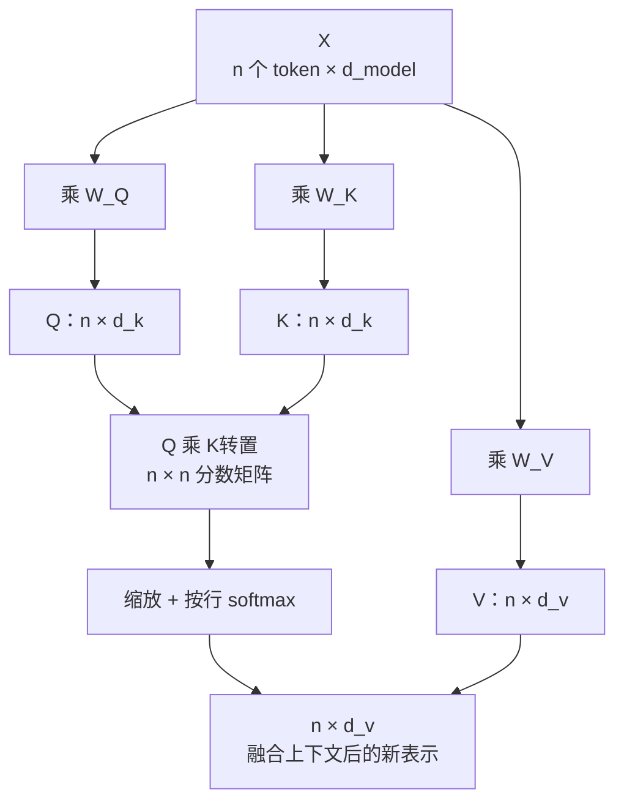

下面是一段学习对话的整理稿。提问的人没有机器学习基础，从 Q、K、V 这三个字母开始，一路问到参数怎么训练、编码器和解码器有什么区别，最后停在后训练。

问题保留了原有的追问顺序，措辞做了改写；回答重写过——去掉重复的比喻，补上对话里被跳过的 √d_k、多头注意力和位置编码，数字与结论对回 Attention Is All You Need 原文。

<!--more-->

## 一、Q、K、V：一次软性查表

> **问：** 怎么理解 Transformer 里的 Q、K、V？最好别一上来就写公式。

把注意力想成一次"软查表"。Q（Query）是查询条件，K（Key）是每条记录的索引标签，V（Value）是记录里真正的内容。普通查表用 key 精确命中一条记录；注意力是把 Q 和所有 K 逐一比对算出相似度，再按相似度把所有 V 加权混起来。之所以叫"软"，是因为它不做硬选择，而是所有记录都拿一点、相关的多拿一些。

自注意力里 Q、K、V 来自同一批输入——把每个 token 的向量排成矩阵 X，分别乘上三个不同的可学习矩阵，得到三份视角不同的表示：

```
Q = X · W_Q
K = X · W_K
V = X · W_V
```

> **问：** 三个都来自同一个 X，为什么不干脆用 X 本身？

因为一个词在不同环节要扮演不同角色。"苹果"被查询时，起作用的是"是不是水果、能不能吃"这类特征；向外提供信息时，要拿出的却是"会掉下来、和牛顿有关"这些内容。W_Q、W_K、W_V 训练出来的，就是这三套不同的投影方式。

## 二、从一句话到三个矩阵

> **问：** 具体怎么算？一句话进来，怎么变成 Q、K、V？

先把 token 变成向量、排成矩阵 X：行是 token，列是 d_model。每个向量再乘上对应的投影矩阵，形状就是纯粹的矩阵乘法：

```
X           n × d_model          n = token 数量
W_Q         d_model × d_k
Q = X·W_Q   n × d_k

论文的 base 配置：d_model = 512，h = 8，d_k = d_v = 512 / 8 = 64
```

> **问：** 那 token 变成向量这一步是怎么做的？

分词器先把文本切成子词级别的 token，每个 token 对应词表里的一个整数 ID。Embedding 就是一张"词表大小 × d_model"的查找表，按 ID 取出一行，就是这个词的初始向量。这张表本身也是参数，会被一起训练——训练完之后，语义相近的 token 在表里的向量会挨得比较近。

> **问：** 如果这句话有 10 个词，X 就是 10 行？

是。行数等于 token 数量，Q、K、V 的行数始终也是 10——第 i 行永远对应第 i 个 token，变的只是列（向量维度）。

> **问：** 那 Q 和 K 相乘得到的 QKᵀ，是多大的矩阵？

n × d_k 乘 d_k × n，得到 n × n。10 个 token 就是 10×10 一共 100 个数字，第 i 行第 j 列表示"第 i 个词对第 j 个词的关注程度"。这 100 个数字里，10 个是词和自己的关系，90 个是不同词之间的关系。

> **问：** 每个词不是只跟"另外 9 个"算吗？

注意力算的是"和所有词"，包括自己。保留自相关是有意义的：处理"苹果 很 好吃"里的"苹果"时，它最终的表示可能是 40% 的苹果 + 10% 的很 + 50% 的好吃。自己的信息没被丢掉，权重由模型自己学。



## 三、Softmax 与 √d_k

> **问：** Softmax 到底在做什么？

两步：先对每个分数取 e 的幂，把差距拉开；再除以总和，归一化成一组权重。同样是 1、5、2、0 四个分数，直接除以总和得到 12.5% / 62.5% / 25% / 0%；走 Softmax 会变成约 0.6% / 94% / 4.7% / 0.6%。分数高一点，权重就明显大一块——这正是注意力想要的效果。

```
softmax(x_i) = e^(x_i) / Σ_j e^(x_j)
```

> **问：** 为什么非要让它们加起来等于 1？直接给"5 份、2 份、1 份"也是比例。

确实不是必须，归一化是一种约定。它换来两件事：一是尺度稳定，QK 的原始分数整体放大 10 倍，输出不会跟着放大 10 倍，相对权重不变；二是总和为 1 时，输出正好是 V 的加权平均，可以直接读成"这份信息我拿了多少"。

> **问：** 公式里的 e 是个常量吗？

是，e ≈ 2.71828，和 π 一样是数学常量。用它是因为 e^x 的导数还是 e^x，在反向传播的求导链上最省事。它和 W 的区别在于：训练从第一步到最后一步，e 一直是 2.71828，而 W 每一步都在变。

> **问：** 那还除以 √d_k 呢？

缩放。如果 q、k 的各分量独立、均值 0、方差 1，那么点积 q·k 的方差就是 d_k，标准差是 √d_k——d_k = 64 时是 8，d_k = 512 时是 22.6。softmax 对输入尺度极为敏感，量级一大就饱和成接近 one-hot 的分布，雅可比趋近于 0，梯度传不回去，模型学不动。除以 √d_k 就是把方差拉回 1：

```
q · k = Σ q_i k_i
E[q·k] = 0
Var[q·k] = d_k          （d_k 个方差为 1 的独立项相加）

Attention(Q, K, V) = softmax( Q Kᵀ / √d_k ) V
```

这一步不是工程技巧，是数学必需，今天所有注意力实现（包括 FlashAttention）里都省不掉。

## 四、多头注意力与位置编码

> **问：** 为什么要多头？一个头不够用吗？

单个头输出的是所有 V 的一个加权平均。如果一个词同时承担两种关系——既是动词的宾语、又和某个代词指代同一实体——单头只能给一个折中的向量，两种信息互相稀释。多头就是开 h 个独立通道，各自在低维子空间里算注意力，拼回来再过一次线性投影。

关键在于成本没变：单头是 O(n² · 512)，8 个头是 8 × O(n² · 64) = O(n² · 512)。头数也不是越多越好，论文表 3 的 (A) 行里，h = 1 比最佳设置差 0.9 BLEU，h = 32 时也掉到 25.4——每个头只剩 16 维，表达能力不够了。

> **问：** 自注意力把输入当成一袋子向量，顺序信息不就丢了？

会丢。打乱词序，输出只是跟着打乱，内容不变。所以要另外把位置信息补进去：论文的做法是把一组不同频率的正弦、余弦值直接加到 token 嵌入上。因为三角函数平移等于旋转，模型可以用一个固定线性变换从 PE_pos 读出 PE_pos+k，也就是读出相对距离。

论文里正弦编码和可学习位置嵌入的实验结果几乎一样（表 3 的 (E) 行），选正弦是为了可能外推到更长序列。后来的实践把这根接力棒交给了 RoPE——不再"加"位置，而是直接对 Q、K 做旋转，让点积天然只依赖相对距离，LLaMA、Qwen、DeepSeek 用的都是它。

## 五、W 是怎么长出来的

> **问：** Q、K、V 是每句话现算的，那 W_Q、W_K、W_V 呢？谁定的？

没有谁定，它们一开始是随机数，然后被训练出来。流程是：前向算出预测 → 和正确答案比 → 得到 Loss → 反向传播算出每个参数的梯度 → 优化器按梯度微调 → 换下一批数据重复。

梯度下降可以想成下山：Loss 是一座山，参数是坐标，梯度告诉你往哪边走能更低。现实里不会真的把一个数字改了再试一次，反向传播一次性算出几十亿个参数各自的调整方向和幅度。

```
随机初始化 W
    ↓
前向：X → Q/K/V → Attention → 预测
    ↓
和正确答案比较 → Loss
    ↓
反向传播 → 每个参数各自的梯度
    ↓
优化器更新（W_Q、W_K、W_V、W_O、前馈网络、Embedding、LayerNorm……）
    ↓
下一批数据，重复
```

> **问：** 那我理解成"每个句子训练出一套自己的 W"？

不对，这是最容易踩的坑。同一个模型里只有一套 W，从第一个句子到最后一个句子，都在修改同一套参数。句子换了，变的是 X、Q、K、V——这类现场计算出来的中间结果叫激活值，W 叫参数。一句话概括：X、Q、K、V 是每个句子临时算出来的，W 是所有句子共同训练出来的。

> **问：** 那第 100 个句子训练完，会不会把第 1 个句子学到的弄坏？

会，这个现象叫灾难性遗忘。真实训练之所以没被它毁掉，靠三件事：每次更新幅度很小（由学习率控制）、一次拿一批数据一起算 Loss 再统一更新（mini-batch）、同一批数据会被反复遍历多轮（epoch），单个样本后面还有机会重新参与。

所以模型优化的从来不是"适合某一句子的 W"，而是让 W 在整个数据分布上总体 Loss 最小。

> **问：** 那同一套 W，怎么应付训练时没见过的问题？

靠泛化。模型不是把"猫吃鱼""狗吃肉"当成两条独立的知识背下来，而是在海量样本里学到了"动物 + 吃 + 食物"这样的结构。所以面对一个从没出现过的句子——"一个穿宇航服的熊猫在月球上修自行车"——它能把熊猫、宇航服、月球、自行车、修理这几个概念重新组合起来。参数里压缩的不是答案，是模式。

## 六、参数量到底指什么

> **问：** 除了 W_Q、W_K、W_V，还有多少参数要训练？

一个 Transformer 层里，注意力部分除了 Q/K/V 三个投影，还有输出投影 W_O；接着是前馈网络的两个矩阵 W₁、W₂；LayerNorm 有 γ、β。模型外面还有 Embedding 矩阵，以及最后把隐向量映射回词表分数的输出层。

| 部分 | 需要训练 | 作用 |
|------|---------|------|
| Embedding | 是 | token → 向量 |
| W_Q / W_K / W_V | 是 | 生成 Q、K、V |
| W_O | 是 | 注意力输出的线性投影 |
| 前馈网络 W₁ / W₂ | 是 | 逐位置的信息加工 |
| LayerNorm γ / β | 是 | 归一化之后的缩放与平移 |
| 输出层 | 是 | 隐向量 → 词表分数 |
| softmax / √d_k / 激活函数 | 否 | 固定的数学运算 |

现代 Transformer 的参数量大头在前馈网络和 Embedding 上，W_Q/W_K/W_V 只是其中一小块。

> **问：** 那"70B 模型"说的是什么？

说的是可训练数字的总个数，70B 就是 7×10^10 个。不是 Q/K/V 的个数，也不是训练了多少句子。举个量级：词表 50000、d_model = 4096 的 Embedding 就有 50000 × 4096 ≈ 2.05 亿个参数；单个 4096×4096 的 W_Q 是约 1678 万个。

顺带一个容易混的换算：70B 个参数用 16 bit（2 字节）存约 140 GB，用 4 bit 存约 35 GB。"70B" 说的是参数数量，不是文件大小。

## 七、训练目标：预测下一个 token

> **问：** 训练过程就是不断遮住一个词、让模型填回来吗？

那是 BERT 用的掩码语言建模。GPT 这类模型用的是另一套：根据前面的 token 预测下一个。上面那句"就是不断遮住一个词"其实说对了一半——遮词是理解类模型的做法，生成类模型不需要遮。

```
输入                 要预测
我                   今天
我 今天               去
我 今天 去            北京
我 今天 去 北京        旅游
```

一句 100 个 token 的文本，天然就是接近 100 个训练目标。

> **问：** 那需要人工一条条告诉它答对了没有吗？

不需要。答案就藏在文本自己里面，这叫自监督学习。而且模型一次读入整句，用因果掩码限制每个位置只能看自己和左边的 token，一次前向就能同时算出所有位置的预测和 Loss——不是"训练完'我 → 今天'，再训练'我今天 → 去'"。

```
        我   今天   去   北京   旅游
我      ✓
今天    ✓    ✓
去      ✓    ✓    ✓
北京    ✓    ✓    ✓    ✓
旅游    ✓    ✓    ✓    ✓    ✓

右上角是"未来的信息"，在 softmax 之前被掩成 -∞
```

> **问：** 就这么一个"猜下一个词"的目标，凭什么能训出这么强的模型？

因为要猜得准，光记住词频远远不够。比如"小明把苹果放在桌子上，因为____"，要预测对后面，模型得知道小明是谁、苹果是什么、桌子在哪、"因为"通常引出什么；再比如"如果 A > B，B > C，那么 A ____ C"，要填对"大于"，模型得掌握一种传递关系。目标越难，为了继续压低 Loss，它就越被迫把语言结构、世界知识和推理模式压进内部表示。

> **问：** 既然能一次算完，为什么用的时候还是一个一个吐字？

训练时整句答案已知，可以并行；推理时第 n 个 token 依赖第 n-1 个的输出，只能逐个生成。并行优势只体现在训练上，推理的加速靠 KV Cache——把已经算过的 K、V 缓存下来，每一步只算新 token 的 Q。

## 八、编码器与解码器

> **问：** 编码器和解码器分别干什么？

原始 Transformer 是为翻译设计的：编码器先把源语言整句读进去，解码器再一个词一个词地生成目标语言。两者的区别不在"谁负责理解"，而在注意力能看到什么——编码器的自注意力没有掩码，每个位置都能看到全句；解码器的自注意力带因果掩码，只能看到自己和左边。

层数上，编码器层是两个子层（自注意力 + 前馈网络），解码器层是三个（掩码自注意力 + 交叉注意力 + 前馈网络）。交叉注意力是两半之间唯一的连接：Q 来自解码器上一层，K、V 来自编码器的输出。每个子层外面都套了残差连接和 LayerNorm。

| 架构 | 代表 | 注意力可见范围 | 适合的任务 |
|------|------|--------------|-----------|
| Encoder-only | BERT | 双向，全句互相可见 | 分类、情感分析、信息抽取 |
| Decoder-only | GPT 类 | 因果掩码，只能看自己和左边 | 生成、对话、续写 |
| Encoder-Decoder | 原始 Transformer、T5 | 编码器双向 + 解码器因果 + 交叉注意力 | 翻译、摘要 |

> **问：** 现在的 GPT 只用解码器就够了吗？

够，而且更简洁。GPT 的输入和输出被放进同一个序列：问题本身就是序列的前缀，回答是它的续写。同一个解码器既处理输入又生成输出，不需要再单独建一个编码器。

真正让 Decoder-only 赢下这一局的是目标统一。不管是文章、代码、对话还是数学题，全都转成"预测下一个 token"，一个训练目标同时覆盖了预训练和生成。这也是它能用无监督方式吃掉整个互联网文本的原因。

> **问：** 那它凭什么也能翻译？

把翻译写成续写就行：

```
English: I love apples.
Chinese:
        ↓
       我 → 喜欢 → 苹果
```

对模型来说这不是什么特殊模块，就是普通的接着往下写。生成"我"的时候，它能看到前面 English 那一段——因果掩码挡住的是未来，不是输入。所以"编码器负责理解、解码器负责生成"只是一句入门类比，Decoder-only 也在理解，只是理解这件事被放进了同一个自回归序列里。

## 九、后训练

> **问：** 预训练之后的后训练，是在重新训练参数吗？

机制上完全一样：构造训练目标 → 算 Loss → 反向传播 → 更新参数。不同的只有数据、目标和规模。

预训练的目标是"下一个 token 是什么"，数据是原始文本。后训练换成两类数据：一类是人工构造的"指令 → 理想回答"，监督微调（SFT）用它来对齐回答格式和行为；另一类针对同一个问题的两个回答，附上"哪个更好"的偏好标注，RLHF 及后续方法用它来调更细的偏好。它基本不改模型的知识，改的是模型使用知识的方式——什么时候该解释、什么时候该拒绝、用什么语气。

后训练也不一定动全部参数。全参微调会更新所有这些矩阵；LoRA 这类方法保持原参数不动，只训练一组小的增量矩阵：

```
W_new = W_original + ΔW      （训练时只更新 ΔW）
```

---

把整条线串起来只有一句话：把训练目标变成梯度，用梯度修改参数。预训练、后训练、微调，区别只在于拿什么数据、想让模型学会什么。

```
预训练：随机 W → 海量文本预测下一个 token → Loss → 反向传播 → 更新所有可训练参数
后训练：在 W_pretrain 上继续用指令 / 偏好数据微调 → W_final
使用：  输入 X → Q/K/V → 注意力（多头、位置编码、残差、LayerNorm）→ 逐层堆叠 → 预测下一个 token
```

前面反复出现的两个词值得分清楚：**参数**（W 系列，训练期间被反复修改，训练结束后固定）和**激活值**（X、Q、K、V，每处理一句话现场算一次，从不被保存下来）。它们的区别，就是 Transformer 架构与训练这件事的分界线。
