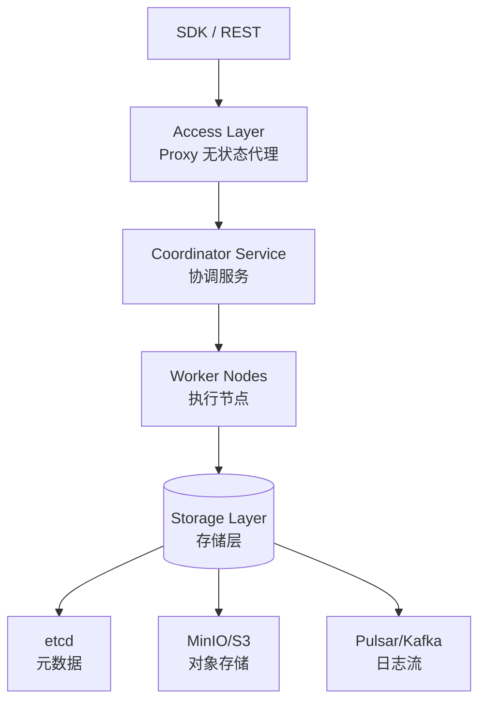
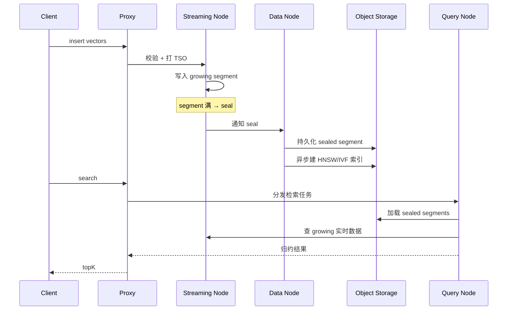
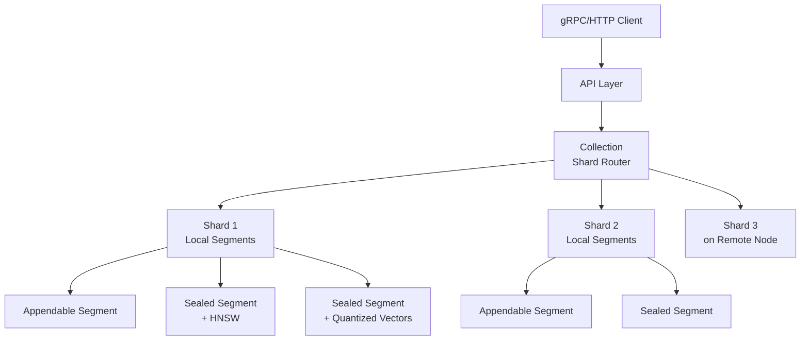
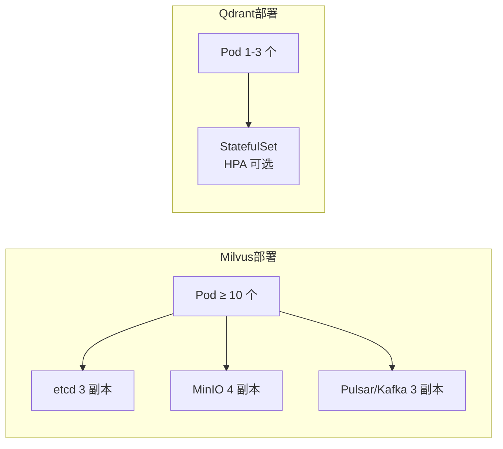
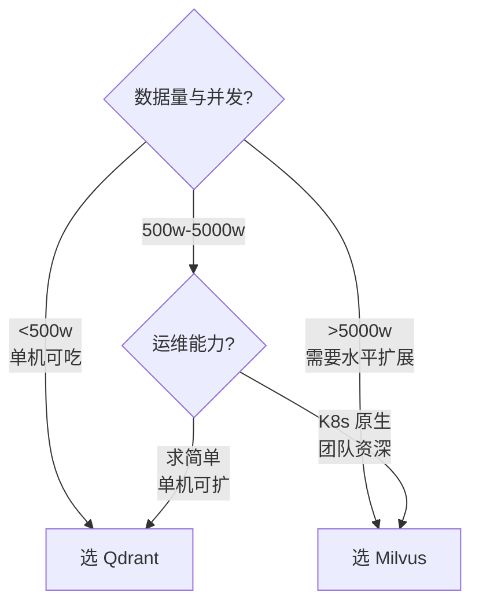

2023 年我们给一个法律咨询产品做 RAG，要把 800 万条判例向量化后存起来做相似检索。第一版用 FAISS 直接落盘，结果运维同学来了一句："你这是向量索引，不是向量数据库" —— 我们这才意识到，"能存"和"能服务"是两回事。

FAISS 解决了"如何高效做 ANN 检索"，但没解决"如何管理 800 万条向量 + 元数据 + 多租户 + 水平扩展 + 实时增删改"。向量数据库（Vector Database）补齐了这一层 —— 它把 ANN 索引、持久化、元数据过滤、分布式协调整合成一套服务。

2023-2024 年向量数据库赛道最常被拿来对比的是 **Milvus**（中国系，云原生分布式）和 **Qdrant**（德国系，Rust 单体）。两者的设计哲学几乎是两个极端：Milvus 走"存储-计算分离的微服务架构"，Qdrant 走"单体二进制 + Rust 极致性能"。本文从架构、索引、过滤、运维四个维度对比。

<!--more-->

## 一、向量数据库的核心问题

传统数据库（MySQL/PostgreSQL）擅长结构化数据 + 精确匹配；ES 擅长文本 + 倒排索引。它们遇到"高维向量 + 近似最近邻（ANN）"就抓瞎——不是因为它们做得不好，而是它们从一开始就不是为这个场景设计的：

- 向量维度通常 384-1536，每条记录 KB 级；B+ 树走全表扫描就是 O(N)，百万级已经慢到不可用
- ANN 检索（HNSW、IVF）需要专门的数据结构和内存布局
- 真实场景几乎都要"向量相似 + 元数据过滤"（如"找相似判例，但只在合同纠纷类目下"），两种索引如何联动是核心难题
- 千万到百亿级数据量下，单机放不下，必须分布式；分布式又带来"分片策略、副本一致性、查询路由"的新复杂度

向量数据库就是在这些问题上做工程化的产物。它本质上是一个"ANN 索引 + 元数据索引 + 持久化 + 分布式协调" 的综合体，2023 年起成为 RAG、AI 搜索、推荐系统的核心基础设施。

## 二、Milvus：云原生的存储-计算分离架构

Milvus 由 Zilliz 公司（2019 年创立，中国）发起，2020 年开源，2022 年进入 LF AI & Data 基金会。Milvus 2.x 是为云原生重写的版本，核心理念是"存储-计算分离 + 微服务分层"。

### 2.1 四层架构



四层职责：

- **Access Layer（Proxy）**：无状态代理，做请求校验、路由、结果归约。横向扩展无上限
- **Coordinator Service（协调器）**：四种协调器组成"大脑"
  - **Root Coordinator**：DDL/DCL、TSO 时间戳
  - **Query Coordinator**：Query Node 拓扑与负载均衡
  - **Data Coordinator**：Data Node、Index Node 拓扑，flush/compact
  - **Streaming Node（2.6+）**：流式数据接入与一致性
- **Worker Nodes（执行节点）**：Query Node（跑检索）、Data Node（处理 mutation）、Index Node（建索引）
- **Storage（存储层）**：etcd（元数据）、MinIO/S3（向量/索引文件）、Pulsar/Kafka（WAL 日志流）

### 2.2 数据流：Insert → Seal → Index → Query



**关键设计**：
- **Growing → Sealed 两阶段**：刚写入的向量在内存（growing segment），写满后 seal 成不可变段（sealed segment），后台异步建索引
- **WAL 解耦**：增量数据先写日志流（保证不丢），再异步落盘
- **冷热分层**：热数据（growing + 最近 sealed）放内存/SSD，冷数据（老 sealed）放对象存储

### 2.3 索引与过滤

Milvus 支持的索引：

| 索引类型 | 适用场景 | 特点 |
|---------|---------|------|
| FLAT | 小数据量（<100w），要求 100% 召回 | 暴力搜索，无压缩 |
| IVF_FLAT / IVF_PQ | 中等数据量（百万-千万） | 倒排聚类 + 量化 |
| HNSW | 高召回、低延迟（千万级） | 图索引，内存大 |
| ANNOY | 简单场景 | 树结构 |
| DiskANN | 超大数据（十亿+） | 磁盘版图索引 |
| GPU 索引（CAGRA） | NVIDIA GPU | GPU 加速 |

元数据过滤通过"标量字段索引"实现（bitmap、倒排、bitmap + 标量），与向量检索的融合方式有"先过滤后搜索"、"先搜索后过滤"、"边搜索边过滤"三种，Milvus 内部根据数据分布自动选。

## 三、Qdrant：Rust 单体的极致工程

Qdrant 由德国柏林团队 2021 年发布，2023 年完成 0.10 "The Big Migration"（从 Python+Rust 混合重写为纯 Rust），2024 年 4 月发布 1.0 GA。它的设计哲学与 Milvus 几乎相反：**单体二进制 + 极致工程**。

### 3.1 单体架构



**核心抽象**：**Collection → Shard → Segment → Point**（点 = 单条向量 + payload）

- **Collection**：一个租户的逻辑集合（最大隔离单位）
- **Shard**：分片，水平扩展基本单位（可分布到不同节点）
- **Segment**：每个 shard 内部又分 segment，是实际存储单元
  - **Appendable Segment**：接受新写入（小、内存）
  - **Sealed Segment**：不可变、已建索引（落盘）
- **Point**：向量 + payload（JSON 元数据）

### 3.2 HNSW 索引的深度优化

Qdrant 的 HNSW 实现是公开源码中最精细的之一（`lib/segment/src/index/hnsw_index/hnsw.rs`）：

```rust
pub struct HNSWIndex {
    id_tracker: Arc<dyn IdTracker>,
    vector_storage: Arc<dyn VectorStorage>,
    quantized_vectors: Arc<dyn QuantizedVectors>,
    payload_index: Arc<dyn PayloadIndex>,
    config: HnswGraphConfig,
    path: PathBuf,
    graph: GraphLayers,
}
```

**关键设计**：
- **Filterable HNSW**：把 payload 索引嵌入 HNSW 边的扩展上 —— 不是"过滤后搜索"或"搜索后过滤"，而是"边搜索边约束"。filter 选择性高时跳过非匹配邻居
- **三层向量存储**：raw vector、quantized vector（压缩）、HNSW graph —— 可独立配置内存 residency（pinned / cached / cold mmap）
- **量化**：内置 Scalar Quantization（4x 压缩）、Product Quantization（16-32x 压缩）、Binary Quantization（32x）

### 3.3 数据流与 Optimizer


阈值默认 20k vectors，触发后 Optimizer 自动 seal → 建索引 → 量化 → 原子切换。对客户端完全无感。

### 3.4 Payload 索引

Qdrant 把 payload 当一等公民 —— 每个 field 可以独立建索引：

```json
POST /collections/legal_cases/index
{
  "field_name": "case_type",
  "field_schema": "keyword"
}
```

支持类型：keyword、integer、float、geo、text、datetime、bool、null。Geo 索引尤其好用（"找距离我 5km 内的相似商家"）。

## 四、Milvus vs Qdrant：工程对比

### 4.1 架构差异

| 维度 | Milvus 2.x | Qdrant 1.x |
|------|-----------|-----------|
| 部署形态 | 多组件微服务（6+ 角色） | 单二进制 |
| 存储 | 强依赖 etcd + MinIO + Pulsar | 自带 RocksDB-like 存储 + mmap |
| 水平扩展 | 各层独立扩缩 | 增 shard 即可 |
| 资源开销 | 重（最小部署 ~10+ Pod） | 轻（1 个 Pod 起） |
| 云原生适配 | K8s Operator 完善 | Helm Chart 即可 |

### 4.2 索引与过滤

| 维度 | Milvus | Qdrant |
|------|--------|--------|
| 索引类型丰富度 | FLAT/IVF/HNSW/ANNOY/DiskANN/GPU | HNSW 为主，其他为辅 |
| HNSW 调优 | 支持 m/ef_construct 等 | 支持 m/ef_construct + 内存 tier |
| 量化 | SQ/PQ/BQ | SQ/PQ/BQ |
| 元数据过滤 | 标量字段索引 | filterable HNSW（更精细） |
| 混合检索 | "过滤后搜/搜后过滤" 自动 | 边搜边过滤，HNSW 内嵌 |

### 4.3 性能（参考公开基准）

- **百万-千万级 HNSW 检索**：Qdrant 略快（Rust 极致优化，公开基准领先 20-40%）
- **亿级以上分布式**：Milvus 占优（架构原生支持）
- **元数据过滤选择性高（filter 命中 1-10%）**：Qdrant filterable HNSW 优势明显
- **元数据过滤选择性低（filter 命中 50%+）**：两者差距小

### 4.4 运维复杂度



- **Milvus**：6+ 组件要监控，etcd、MinIO、Pulsar 任何一个出问题都影响检索
- **Qdrant**：1 个进程就是一切，Docker / K8s 部署都轻量；存储用 mmap 直接吃本地 SSD

## 五、选型建议

### 5.1 决策树



### 5.2 选型清单

| 场景 | 推荐 | 理由 |
|------|------|------|
| 1 亿+ 向量、严格水平扩展 | Milvus | 架构原生支持 |
| 100 万级、快速上线 | Qdrant | 单二进制，5 分钟部署 |
| 强依赖 K8s Operator / 多云 | Milvus | Operator 完善 |
| 元数据过滤复杂（高选择性） | Qdrant | filterable HNSW 更精细 |
| 需要 GPU 加速 | Milvus | CAGRA GPU 索引 |
| 边缘 / 单机 / 嵌入式 | Qdrant | 单二进制，资源占用小 |
| 多租户隔离（按 Collection） | Qdrant | 隔离粒度更细 |
| 已有 Pulsar/Kafka 基础设施 | Milvus | 可复用 |

### 5.3 常见坑

1. **Milvus 2.6 前没 Streaming Node**：WAL 强依赖外部 Pulsar/Kafka，运维同学先打一架
2. **Qdrant 内存估算偏低**：HNSW 内存 ≈ 维度 × 向量数 × 4 bytes / 压缩比，1 亿 768 维 float32 ≈ 280 GB，不要按 1 GB/百万估算
3. **Milvus Index 类型选错**：千万级优先 HNSW（高召回），亿级以上考虑 DiskANN（内存友好）
4. **Qdrant 量化牺牲召回**：Binary Quantization 32x 压缩但召回掉 5-10%，用于"粗排"或召回容忍度高的场景
5. **Milvus growing segment 内存压力**：高并发写入场景，growing segment 不断增长会吃光内存；需要调小 seal 阈值

## 六、小结

Milvus 与 Qdrant 的本质分歧是"分布式架构 vs 单体极致"的工程路线选择：

- **Milvus**：存储-计算分离 + 微服务分层，云原生时代为大规模分布式而生，组件多但每层都能独立扩；适合亿级以上、强依赖 K8s 的场景
- **Qdrant**：Rust 单体二进制，filterable HNSW + 极致内存控制，运维成本最低；适合 100 万-数千万级、追求简单部署的场景

我们的 800 万条判例最后选 Qdrant —— 单机 4 核 64 GB + 1 TB SSD 就能跑，P99 检索延迟 30ms，运维同学只需要盯一个进程的 metrics。代价是未来突破 5 亿条时要重新评估 Milvus / Weaviate 的分布式方案。向量数据库的选型没有"最好"，只有"当下数据规模 + 团队运维能力"的最优解。

参考：

- [Milvus 官方架构文档](https://milvus.io/docs/architecture_overview.md)
- [Milvus Storage/Computing Disaggregation](https://milvus.io/docs/v2.4.x/four_layers.md)
- [Qdrant Architecture Overview](https://qdrant.tech/articles/architecture/)
- [Qdrant 1.0 Release Notes](https://qdrant.tech/articles/release-1-0-0/)
- [Qdrant 0.10 - The Big Migration](https://qdrant.tech/articles/release-0-10-0/)
