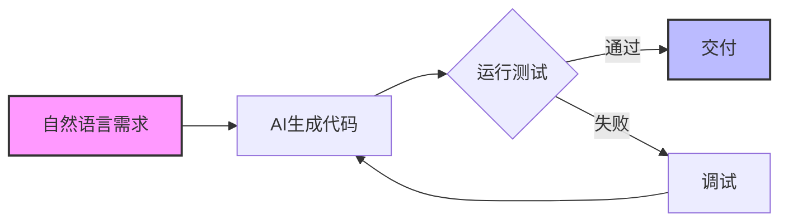
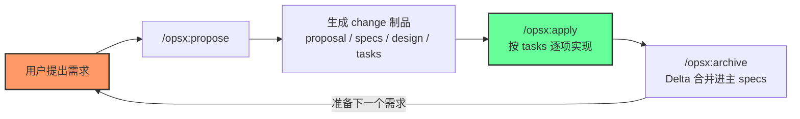

在 AI 辅助开发的浪潮中，"Vibe Coding" 虽然听起来很酷，但本质是依靠直觉和 AI 的模糊理解——你在和 AI "对暗号"，能不能跑通全靠运气。

为了让这种开发模式从「玄学」走向「工业级可靠」，**SDD（规范驱动开发）** 应运而生，而 **OpenSpec** 正是落地这一理念的开源框架。

如果你熟悉 **TDD（测试驱动开发）**，会发现 SDD 其实是 TDD 思想在 AI 时代的延伸：**先定义"什么是正确的"，再让 AI 去实现**。

<!--more-->

## AI Coding 的现状

当前主流 AI 编程工具的工作流，本质都是"需求 → 代码 → 试错"的循环：



这套流程的问题在于：**试错的次数决定了开发效率**。当需求复杂时，AI 生成的代码往往需要多次调试才能跑通，甚至会逐渐失控。

## 三种开发模式对比

| 模式 | 描述 | 核心问题 / 定位 |
|:---|:---|:---|
| **Vibe Coding** | 自然语言 + AI 生成 + 试错修正 | 不可控，复杂项目易崩盘 |
| **TDD** | 先写测试，再写代码让测试通过 | 约束粒度在函数 / 单元级别 |
| **SDD** | 先定规范（Specification），再基于规范生成代码 | 约束覆盖到系统级设计 |

**本质变化**：TDD 用测试用例约束代码，SDD 用规范文档约束整个系统的设计和实现。

## 理清两个层次：流程框架 vs AI 助手能力

在深入之前，必须先澄清一个很多文章都混淆的点——SDD 的落地涉及**两个不同层次**的东西：

| 层次 | 代表 | 回答的问题 | 是否工具无关 |
|:---|:---|:---|:---|
| **流程 / 框架层** | OpenSpec | 先做什么、后做什么（What & When） | ✅ 工具无关，支持 20+ AI 编程工具 |
| **AI 助手能力层** | Command / Rule / Skill | AI 具体怎么被约束、怎么扩展能力（How） | ❌ 属于具体工具（Claude Code、CodeBuddy 等） |

> ⚠️ 常见误区：**Command / Rule / Skill 并不是 OpenSpec 的概念**，而是 Claude Code、CodeBuddy 这类 AI 编程助手自身的配置机制。OpenSpec 本身是**工具无关**的流程框架——它把"先写规范再写代码"标准化，具体在哪个 IDE、用什么 Rule/Skill 去执行，由你选的工具决定。两者是**协作**关系，不是同一个东西。

理解了这层区分，下面分别来看。

## AI 助手能力层：Command / Rule / Skill

以 Claude Code / CodeBuddy 为代表的现代 AI 助手，用三种机制来定义 AI 的行为边界与能力：

| 概念 | 回答 | 类比 | 触发方式 |
|:---|:---|:---|:---|
| **Rule** | 我必须怎么做 | 方向盘，约束边界 | 每次对话自动加载 |
| **Skill** | 我能够怎么做 | 工具箱，扩展能力 | AI 按需自动加载 |
| **Command** | 我一键触发什么 | 遥控器按钮 | 用户显式 `/命令` 调用 |

### Rule：始终加载的静态约束

Rule 在**每次对话开始时**自动加载，适合高频、短小、必须始终生效的约束：

- 项目命令（`npm run build`、`bun test`）
- 代码风格（ES 模块 vs CommonJS、命名规范）
- 项目结构约定（API 放在哪个目录）
- 安全红线（如"永不提交 `.env`"）

### Skill：按需加载的动态能力

Skill 只在 AI 判断**当前任务相关时**才加载完整内容（平时只扫描它的名称和描述做路由），适合复杂、多步骤的操作：

- 数据库迁移、监控配置等特定领域流程
- 可复用的多步工作流（发布、PR、代码审查）
- 超过一屏、包含脚本执行的详细指南

### Command：用户显式触发的快捷方式

Command 是**用户主动按下**的斜杠命令，没有自动识别、你按它才做：

- `/deploy`：一键执行部署工作流
- `/review`：一键运行代码审查

**最强模式**是三者配合：Command 作为好记的"咒语"入口，内部去组合调用若干 Skill，而 Rule 在全程守住底线。

### Rule 还是 Skill？用"石蕊测试"判断

比起"超过 50 行就做成 Skill"这种武断阈值，更实用的判据是问一句：

> **"即使我这次没想到它，我也希望这条指令生效吗？"**
> - 是 → 做成 **Rule**（如"永不提交 `.env`"，安全约束，始终适用）
> - 否 → 做成 **Skill**（如"改动计费代码时才跑这三个集成测试"，特定场景才相关）

核心动机都是**上下文窗口的利用效率**：Rule 始终占用上下文，所以要短；Skill 按需加载，所以能承载丰富的专业能力而不浪费 token。

## 流程框架层：OpenSpec 工作流

[OpenSpec](https://github.com/Fission-AI/OpenSpec)（`@fission-ai/openspec`）是一个**工具无关**的规范驱动开发框架，专为**存量项目（brownfield）** 设计。它的核心工作流是 **Propose → Apply → Archive** 三步：



在 `/opsx:propose` 阶段，OpenSpec 会为这次变更创建一个独立文件夹，一次性产出四类制品：

| 制品 | 回答的问题 |
|:---|:---|
| `proposal.md` | 为什么做？范围是什么（in / out of scope）？ |
| `specs/` | 系统行为**改了什么**（Delta 格式）？ |
| `design.md` | 技术上怎么做？用什么架构？ |
| `tasks.md` | 实作分几步、做到哪了（带复选框）？ |

值得注意的是，OpenSpec 采用**流动式（无阶段门禁）**：你可以随时回头修改任何一个制品，不存在"必须先过 Design 才能写 Tasks"的硬性关卡。

### 亮点：Delta Spec —— 只描述"变化量"

OpenSpec 区别于其他 SDD 工具的关键设计，是 `specs/` 里存的不是整份规范，而是**这次变更的增量（Delta）**——用 `ADDED / MODIFIED / REMOVED` 描述行为变化。等 `/opsx:archive` 时，再把这份 Delta **合并回主规范目录**。这样规范会随着每次归档持续"长大"，形成一份始终最新的系统行为文档，对存量项目极其友好。

### 项目结构与常用命令

```bash
# 安装（支持 npm / pnpm / yarn / bun）
npm install -g @fission-ai/openspec@latest

cd your-project
openspec init          # 生成 openspec/ 目录与 AGENTS.md
```

```text
openspec/
├── specs/      # 权威系统规范（source of truth）
├── changes/    # 每个变更一个独立文件夹
│   └── archive/  # 已归档的历史变更
└── AGENTS.md   # 给 AI 助手的工作说明
```

常用命令：`/opsx:propose`（提议变更）、`/opsx:apply`（按任务实现）、`/opsx:archive`（归档并合并）、`/opsx:verify`（验证实现与规范是否一致）。

### 三层如何协作

OpenSpec 定"先写规范再写代码"的**流程**，而具体执行时：

- **Rule** 在规范阶段确保设计符合项目约束
- **Skill** 提供执行所需的专业能力
- **Command**（如 `/opsx:apply`）作为触发各阶段的入口

## 工具实践：CodeBuddy Craft Spec

腾讯云 CodeBuddy IDE 的 **Craft Spec** 功能，是 SDD 理念的一种产品化实现。开发者输入自然语言需求后，AI 会先输出结构化 PRD 和设计方案供确认，确认后才进入编码阶段：

| SDD 阶段 | CodeBuddy 功能 |
|:---|:---|
| 需求提议 | 自然语言需求输入 |
| 规范 | 自动生成 PRD 文档 |
| 设计 | 设计原型生成 |
| 任务 | 任务拆解 |
| 实现 | Craft 模式逐步生成代码 |

关键差异在于**中间多了一步对齐**：

- Vibe Coding：`需求 → 代码`（两步，中间无确认）
- Craft Spec：`需求 → PRD/设计方案确认 → 代码`（三步，AI 先呈现理解，你确认后再动手）

这看似多了一步，实则大幅减少了返工。

## 进阶：MCP + SDD

将内部工具封装为 MCP（Model Context Protocol）后，AI 不仅能"看到"工具，还能真正执行操作：

**场景**：MySQL 数据库 + SDD 工作流

1. 规范阶段：AI 调用 MySQL MCP 直接查询真实 schema
2. 设计阶段：AI 基于实际表结构设计新功能
3. 实现阶段：生成的代码自动匹配现有表风格

```text
用户：新增一个用户收藏功能
AI：先查库 → 生成 Spec（包含真实的 user_id 字段类型）
AI：根据 Spec 生成代码
```

**企业优先封装的 MCP 类型**：

| 类型 | MCP |
|:---|:---|
| 基础设施 | 数据库查询、日志查询、监控指标 |
| 研发流程 | 代码审查、CI/CD 触发、版本管理 |
| 业务能力 | 内部 API、消息推送、数据同步 |

## SDD 与传统开发方法对比

| 维度 | 传统瀑布 | 敏捷开发 | TDD | SDD |
|:---|:---|:---|:---|:---|
| **需求定义** | 详细文档 | User Story | 测试用例 | 规范文档 |
| **质量保障** | 后期测试 | 持续集成 | 单元测试 | 规范验证 |
| **适用场景** | 稳定需求 | 变化需求 | 单元级别 | 系统级 + AI |

**关键洞察**：SDD 不是要替代 TDD，而是弥补 TDD 在 AI 时代的断层——TDD 解决"如何确保代码正确"，SDD 解决"如何确保 AI 生成的系统设计正确"。

## 总结

| 层级 | 角色 | 回答 |
|:---|:---|:---|
| **Vibe Coding** | 出发点 | 简单快捷但不可控 |
| **OpenSpec / SDD** | 流程框架层 | 先规范后编码，确保不偏航 |
| **Rule** | 约束层 | 要怎么做（自动、始终生效） |
| **Skill** | 能力层 | 会做什么（按需加载） |
| **Command** | 触发层 | 一键做什么（用户调用） |

记住那条主线：**OpenSpec 管"流程"，Command/Rule/Skill 管"能力"**，两者配合才让 AI 编程从"靠运气"走向"工业级可靠"。

**实践建议**：从建立项目的 **Rule** 开始——这能立竿见影地减少 AI 乱写代码的情况；再引入 OpenSpec 把变更流程规范化。进一步可以在 [CodeBuddy IDE](https://www.codebuddy.cn/ide/) 中体验 Craft Spec 完整流程。

*参考资料：*
- *[Fission-AI/OpenSpec](https://github.com/Fission-AI/OpenSpec) GitHub 项目*
- *CodeBuddy IDE*
