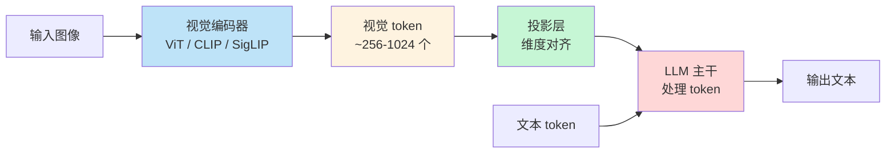
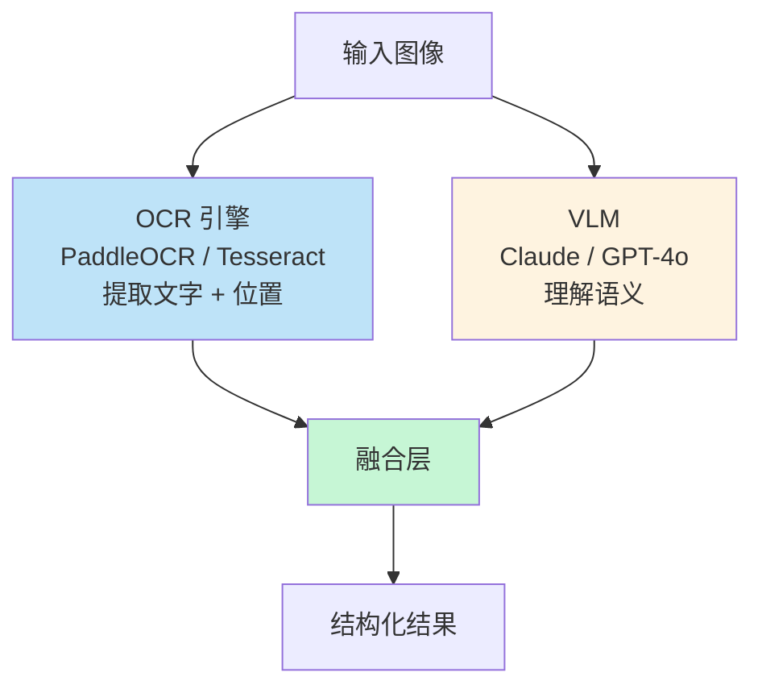

> 2025 年 GPT-4o、Claude 4、Gemini 2.5 都原生支持多模态——能"看图"的 LLM 已经从前沿技术变成基础设施。但**多模态 ≠ 万能**：图片理解有 4 个根本限制（幻觉、空间推理、计数、小文本）。这篇文章讲清楚 VLM 的真正能力和工程化路径。

VLM（Vision-Language Model）让 LLM 突破"只能读文本"的边界——能看截图、读 PDF、理解图表、识别人脸、看懂 UI。这是 2025-2026 年 AI 应用最重要的能力扩展。

但很多团队的 VLM 应用踩了同一个坑：**直接拿来用，没考虑 VLM 的边界**。结果是上线后遇到各种边界 case 才补窟窿。

<!--more-->

## 一、VLM 的工作原理



大多数 VLM 由三部分组成：
1. **视觉编码器**（ViT/CLIP/SigLIP）——把图像编码成"视觉 token"
2. **投影层**——把视觉 token 映射到 LLM 的 embedding 空间
3. **LLM 主干**——和文本 token 一起处理

**GPT-4o 的特殊性**：原生多模态 Transformer，**没有独立的视觉塔**——视觉和文本从一开始就在同一个模型里处理。

## 二、2025-2026 主流模型对比

| 模型 | 发布 | Context | 强项 | 弱项 |
|------|------|---------|------|------|
| **GPT-4o** | 2025-03 | 128K | 实时语音、代码截图、跨模态融合 | 中文 OCR 一般 |
| **Gemini 2.5 Pro** | 2025-05 | 1-2M | 长视频、图表解析 | API 限速严 |
| **Claude 4 Sonnet** | 2025-02 | 200K | **文档 OCR、表格抽取、结构化提取** | 视频能力弱 |
| **Qwen 2.5-VL-72B** | 2025-04 | 128K | 开源之王、多语言 | 闭源仍略胜 |
| **Llama 4 Scout** | 2025-04 | 10M | 开源、超长 context | 质量不极致 |

**实战选型**：

```python
def select_vlm(task: str) -> str:
    if "extract_structured_data" in task or "ocr" in task:
        return "claude-sonnet-4-5"  # Claude 文档能力最强
    elif "video_understanding" in task:
        return "gemini-2.5-pro"  # Gemini 视频最强
    elif "real_time" in task or "voice" in task:
        return "gpt-4o"  # GPT-4o 实时能力最强
    elif "self_hosted" in task or "cost" in task:
        return "qwen-2.5-vl-72b"  # 开源 SOTA
    else:
        return "claude-sonnet-4-5"  # 默认
```

## 三、文档理解：最强场景

VLM 最成熟的应用是**文档数字化**——从图片/PDF 提取结构化数据。

### 3.1 发票/收据识别

```python
import anthropic
import base64

def extract_invoice(image_path: str) -> dict:
    with open(image_path, "rb") as f:
        image_data = base64.b64encode(f.read()).decode()
    
    response = client.messages.create(
        model="claude-sonnet-4-5",
        max_tokens=1024,
        messages=[{
            "role": "user",
            "content": [
                {
                    "type": "image",
                    "source": {
                        "type": "base64",
                        "media_type": "image/jpeg",
                        "data": image_data
                    }
                },
                {
                    "type": "text",
                    "text": """从这张发票图片中提取信息，严格按 JSON 格式输出：

{
    "invoice_number": "发票号码",
    "date": "YYYY-MM-DD",
    "seller": "销售方名称",
    "buyer": "购买方名称",
    "items": [
        {"name": "商品名称", "quantity": 数量, "unit_price": 单价, "amount": 金额}
    ],
    "total_amount": "总金额（含税）",
    "tax_id": "税号"
}

如果某字段无法识别，用 null。
"""
                }
            ]
        }]
    )
    
    return json.loads(response.content[0].text)
```

**实测准确率**：
- 印刷发票：95-98%
- 手写收据：75-85%
- 复杂表格：80-90%

### 3.2 PDF 长文档

PDF 处理有特殊技巧：

```python
# 方案 1：整页送进 VLM（适合 ≤20 页）
def process_pdf_short(pdf_path):
    # 把每页转成图片
    images = pdf_to_images(pdf_path)
    
    response = client.messages.create(
        model="claude-sonnet-4-5",
        messages=[{
            "role": "user",
            "content": [
                *[{"type": "image", "source": {"type": "base64", "data": img}} for img in images],
                {"type": "text", "text": "总结这份 PDF 的核心内容..."}
            ]
        }]
    )

# 方案 2：分块 + 摘要 + 综合（适合 >20 页）
def process_pdf_long(pdf_path):
    images = pdf_to_images(pdf_path)
    
    # 每 5 页一组，分别总结
    summaries = []
    for i in range(0, len(images), 5):
        chunk = images[i:i+5]
        summary = summarize_chunk(chunk)
        summaries.append(summary)
    
    # 综合所有 summary
    final = synthesize(summaries)
    return final
```

### 3.3 表格抽取

```python
# Claude 在表格抽取上特别强
TABLE_EXTRACTION_PROMPT = """提取图片中的所有表格。

要求：
1. 保留原始的行列结构
2. 数字保持原样，不要格式化
3. 空单元格用 null
4. 多个表格用 markdown 格式分别输出

输出格式：
## 表格 1
| 列1 | 列2 | 列3 |
|-----|-----|-----|
| ... | ... | ... |

## 表格 2
...
"""
```

## 四、图表理解

VLM 看图表（柱状图、折线图、饼图）是 2025 年的杀手级应用。

```python
def analyze_chart(image_path: str, question: str) -> str:
    """让 VLM 回答关于图表的问题"""
    
    response = client.messages.create(
        model="claude-sonnet-4-5",
        messages=[{
            "role": "user",
            "content": [
                {"type": "image", "source": {"type": "base64", "data": image_b64}},
                {"type": "text", "text": question}
            ]
        }]
    )
    
    return response.content[0].text

# 示例
answer = analyze_chart(
    "quarterly_revenue.png",
    "Q3 的收入是多少？同比增长多少？哪个产品线贡献最大？"
)
```

**准确率（GPT-4o / Claude 4 在 ChartQA 上）**：88%+——远超传统 OCR + 解析方法。

## 五、UI/UX 截图分析

```python
def analyze_ui_screenshot(screenshot_path: str) -> dict:
    """分析 UI 截图，提取设计信息"""
    
    prompt = """分析这张 UI 截图，按 JSON 格式输出：

{
    "layout": "整体布局描述（顶部导航 / 左侧菜单 / 主内容区 / 右侧边栏等）",
    "components": [
        {"type": "按钮/输入框/卡片/菜单", "text": "文本", "position": "位置"}
    ],
    "color_scheme": {
        "primary": "主色调 hex",
        "background": "背景色 hex",
        "text": "文字色 hex"
    },
    "issues": ["发现的可用性问题"],
    "suggestions": ["改进建议"]
}
"""
    # 调用 VLM...
```

**实战场景**：
- 自动化 UI 审计
- 设计稿转代码（Figma → HTML）
- 竞品 UI 分析
- 自动化测试（验证 UI 是否符合设计稿）

## 六、VLM 的四个根本限制

**用了 VLM 才知道：不是所有"看图"都能做好**。

### 6.1 幻觉：会看到不存在的东西

```python
# VLM 经常"自信地"识别根本不存在的物体
# 例如：图中是白色背景的简单形状，VLM 可能说"看到了一只猫"
```

**缓解**：
- 给置信度要求："如果不确定，明确说'我不确定'"
- 多模型投票（多 VLM 同时看，结果一致才信）
- 高风险场景必须人工复核

### 6.2 空间推理：难以精确描述位置

```python
# ❌ VLM 很难准确说"按钮在距离左边 234 像素、上边 156 像素"
# ✅ 但能说"按钮在屏幕中上部偏左"
```

**缓解**：用 VLM 做"语义理解"，用传统 CV（OpenCV）做"精确测量"。

### 6.3 计数：难以准确数很多物体

```python
# VLM 在数 1-5 个物体时基本准确
# 数 20+ 个物体时准确率显著下降
```

**缓解**：先用传统 CV（YOLO）检测和计数，再用 VLM 做高层语义理解。

### 6.4 小文本：低分辨率图片看不清

```python
# 1080p 截图里 12px 的文字，VLM 经常认错
```

**缓解**：
- 关键区域裁剪放大后再送 VLM
- 用 OCR 引擎（PaddleOCR / Tesseract）做文字识别，VLM 做语义理解
- **OCR + VLM 混合架构**

## 七、生产架构：OCR + VLM 混合



```python
class HybridDocExtractor:
    def __init__(self):
        self.ocr = PaddleOCR(use_angle_cls=True, lang="ch")
        self.vlm = anthropic.Anthropic()
    
    def extract(self, image_path):
        # 1. OCR 提取所有文字 + 位置
        ocr_result = self.ocr.ocr(image_path, cls=True)
        
        # 2. VLM 提取结构化字段
        vlm_extraction = self.vlm_extract(image_path)
        
        # 3. 融合
        # - OCR 提供精确的文字内容
        # - VLM 提供语义归类（哪个字段是什么）
        result = self.merge(ocr_result, vlm_extraction)
        
        return result
    
    def merge(self, ocr_data, vlm_data):
        """把 OCR 的精确文字 + VLM 的语义分类合并"""
        # 示例：VLM 说"发票号"对应 OCR 的某段文字
        # 直接用 OCR 的精确值替换 VLM 的猜测
        for field, position in vlm_data["field_positions"].items():
            text_at_position = self.get_text_at(ocr_data, position)
            vlm_data["fields"][field] = text_at_position
        
        return vlm_data["fields"]
```

## 八、成本控制

VLM 是**吞 token 大户**——一张 1024×1024 的图要 ~1000 tokens（高分辨率模式 ~4000 tokens）。

### 8.1 图像预处理

```python
def optimize_for_vlm(image_path: str, max_size: int = 1024) -> bytes:
    """缩放到合适大小，节省 token"""
    img = Image.open(image_path)
    
    # 限制最大尺寸
    img.thumbnail((max_size, max_size))
    
    # 转 JPEG 压缩
    buf = io.BytesIO()
    img.save(buf, format="JPEG", quality=85)
    return buf.getvalue()
```

### 8.2 选择合适的 detail level

OpenAI 提供 `detail` 参数：

```python
# low: 85 tokens（图像被压缩成 512×512）
# high: 170 tokens（图像被压缩成 1024×1024）——默认
# auto: 模型自己决定

response = openai.ChatCompletion.create(
    model="gpt-4o",
    messages=[{
        "role": "user",
        "content": [
            {"type": "text", "text": "描述这张图"},
            {
                "type": "image_url",
                "image_url": {
                    "url": "...",
                    "detail": "low"  # 节省 80% token
                }
            }
        ]
    }]
)
```

### 8.3 批量处理

```python
async def batch_process_images(images: list[str]) -> list[dict]:
    """并发处理多张图片"""
    semaphore = asyncio.Semaphore(10)  # 控制并发
    
    async def process_one(img):
        async with semaphore:
            return await extract_async(img)
    
    return await asyncio.gather(*[process_one(img) for img in images])
```

## 九、上线 checklist

把 VLM 落到代码里：

- [ ] **根据任务选模型**——文档选 Claude，视频选 Gemini，实时选 GPT-4o
- [ ] **JSON schema 严格输出**——VLM 输出接 Pydantic 校验
- [ ] **OCR + VLM 混合架构**——小文本用 OCR，语义用 VLM
- [ ] **图像预处理**——缩放到合适大小，节省 token
- [ ] **置信度要求**——不确定时让 VLM 明确说
- [ ] **多模型投票**——高风险场景交叉验证
- [ ] **幻觉检测**——通过规则校验输出合理性
- [ ] **成本监控**——单任务 VLM token 上限
- [ ] **失败兜底**——转人工或简化版 OCR

## 十、一点反思

VLM 是 2025-2026 年最重要的 AI 能力扩展，但**不能盲目乐观**。

> VLM 让 LLM 从"读文本"扩展到"看世界"。但这个"看"不是人眼——它会编造细节、数不清东西、读不清小字。

我见过的典型 VLM 上线事故：

- 团队 A：用 VLM 自动审核用户上传图片，**幻觉**——把卡通图当成违规图
- 团队 B：用 VLM 数仓库库存，**计数不准**——数量偏差 30%
- 团队 C：用 VLM 读小票金额，**小文本漏读**——金额识别错误 15%

正确的态度：**VLM 是 95% 准确率的工具，不是 100%**。生产环境必须：

1. 设计**冗余校验**（OCR + VLM 双轨）
2. 设计**兜底机制**（VLM 不确定 → 人工）
3. 设计**反馈闭环**（错的样本回灌训练）

2026 年的 VLM 比 2023 年强 10 倍，但**距离人眼还有差距**。把它当工具用，不是当神用。

---

**参考资料：**
- [OpenAI GPT-4o Vision Documentation](https://platform.openai.com/docs/guides/vision)
- [Anthropic Claude Vision Documentation](https://docs.claude.com/en/docs/build-with-claude/vision)
- [Google Gemini 2.5 Pro Multimodal](https://ai.google.dev/gemini-api)
- [Qwen2.5-VL Technical Report](https://qwenlm.github.io/blog/qwen2-vl/)
- [Top 5 Vision Language Models in 2025](https://blogs.novita.ai/top-5-vision-language-models/)
- [Multimodal LLMs: Vision, Audio, and Beyond](https://enricopiovano.com/blog/multimodal-llms-vision-audio/)
- [PaddleOCR](https://github.com/PaddlePaddle/PaddleOCR)
- [LLaVA-NEXT Open-source VLM](https://github.com/haotian-liu/LLaVA)
- [MMMU Benchmark](https://mmmu-benchmark.github.io/)
- [ChartQA Benchmark](https://github.com/ahmed-masry/ChartQA)
- [DocVQA Benchmark](https://www.docvqa.org/)